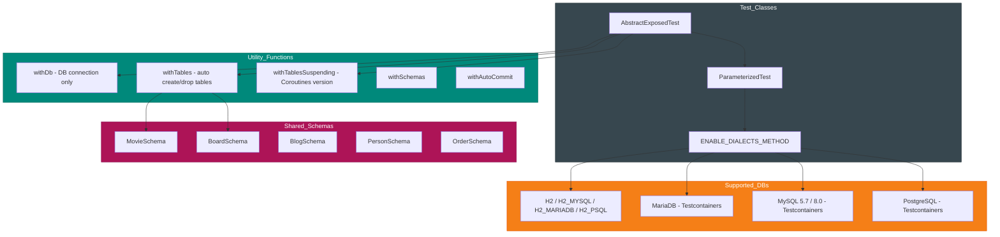
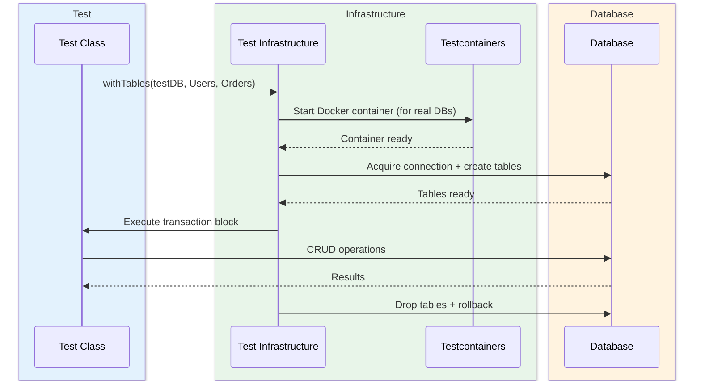

# Module bluetape4k-exposed-tests

English | [한국어](./README.ko.md)

## Overview

A shared test infrastructure module for testing Exposed-based modules. It simplifies writing integration tests against multiple databases (H2, MySQL, MariaDB, PostgreSQL).

## Adding Dependencies

```kotlin
dependencies {
    testImplementation("io.github.bluetape4k:bluetape4k-exposed-tests:${version}")
}
```

## Key Features

- **Common test base**: `AbstractExposedTest` provides the foundation for DB tests
- **Multi-database support**: Tests against H2, MySQL, MariaDB, and PostgreSQL
- **Testcontainers integration**: Docker-based real database testing
- **Sync and async tests**: Supports both plain JDBC and Coroutines environments
- **Table/schema utilities**: Reusable test entities and tables

## Supported Databases

| Database           | TestDB       | Testcontainers |
|--------------------|--------------|----------------|
| H2 v2              | `H2`         | No             |
| H2 MySQL mode      | `H2_MYSQL`   | No             |
| H2 MariaDB mode    | `H2_MARIADB` | No             |
| H2 PostgreSQL mode | `H2_PSQL`    | No             |
| MariaDB            | `MARIADB`    | Yes            |
| MySQL 5.7          | `MYSQL_V5`   | Yes            |
| MySQL 8.0          | `MYSQL_V8`   | Yes            |
| PostgreSQL         | `POSTGRESQL` | Yes            |

## Usage Examples

### Writing a basic test

```kotlin
import io.bluetape4k.exposed.tests.AbstractExposedTest
import io.bluetape4k.exposed.tests.TestDB
import io.bluetape4k.exposed.tests.withTables
import org.jetbrains.exposed.v1.core.Table
import org.jetbrains.exposed.v1.core.dao.id.LongIdTable
import org.junit.jupiter.params.ParameterizedTest
import org.junit.jupiter.params.provider.MethodSource

object Users: LongIdTable("users") {
    val name = varchar("name", 50)
    val email = varchar("email", 100)
}

class UserRepositoryTest: AbstractExposedTest() {

    @ParameterizedTest
    @MethodSource(ENABLE_DIALECTS_METHOD)
    fun `should insert and find user`(testDB: TestDB) {
        withTables(testDB, Users) {
            // Insert
            Users.insert {
                it[name] = "John"
                it[email] = "john@example.com"
            }

            // Query
            val user = Users.selectAll().single()

            assertEquals("John", user[Users.name])
            assertEquals("john@example.com", user[Users.email])
        }
    }
}
```

### withDb — DB connection only (no tables)

```kotlin
import io.bluetape4k.exposed.tests.TestDB
import io.bluetape4k.exposed.tests.withDb

@ParameterizedTest
@MethodSource(ENABLE_DIALECTS_METHOD)
fun `should connect to database`(testDB: TestDB) {
    withDb(testDB) {
        // Runs inside a transaction
        val isConnected = connection.isValid(5)
        assertTrue(isConnected)
    }
}
```

### withTables — Auto create and drop tables

```kotlin
import io.bluetape4k.exposed.tests.TestDB
import io.bluetape4k.exposed.tests.withTables

@ParameterizedTest
@MethodSource(ENABLE_DIALECTS_METHOD)
fun `should create and drop tables`(testDB: TestDB) {
    withTables(testDB, Users, Orders) {
        // Tables are created before the test
        // Tables are dropped after the test

        Users.insert { /* ... */ }
        Orders.insert { /* ... */ }

        // Test logic
    }
}
```

### Coroutines environment (async tests)

```kotlin
import io.bluetape4k.exposed.tests.TestDB
import io.bluetape4k.exposed.tests.withTablesSuspending
import kotlinx.coroutines.Dispatchers
import org.junit.jupiter.params.ParameterizedTest
import org.junit.jupiter.params.provider.MethodSource

class AsyncRepositoryTest: AbstractExposedTest() {

    @ParameterizedTest
    @MethodSource(ENABLE_DIALECTS_METHOD)
    fun `should insert user in coroutine`(testDB: TestDB) = runBlocking {
        withTablesSuspending(testDB, Users) {
            // Runs inside a suspend function
            Users.insert {
                it[name] = "John"
                it[email] = "john@example.com"
            }

            val user = Users.selectAll().single()
            assertEquals("John", user[Users.name])
        }
    }
}
```

### Testing against a specific database only

```kotlin
import io.bluetape4k.exposed.tests.TestDB

class PostgresOnlyTest: AbstractExposedTest() {

    // Test only against PostgreSQL
    companion object {
        @JvmStatic
        fun databases() = TestDB.ALL_POSTGRES
    }

    @ParameterizedTest
    @MethodSource("databases")
    fun `postgres specific test`(testDB: TestDB) {
        withTables(testDB, Users) {
            // PostgreSQL-specific test
        }
    }
}
```

### Testing against a group of databases

```kotlin
import io.bluetape4k.exposed.tests.TestDB

class MySQLLikeTest: AbstractExposedTest() {

    companion object {
        // MySQL + MariaDB + H2 MySQL mode
        @JvmStatic
        fun databases() = TestDB.ALL_MYSQL_LIKE

        // PostgreSQL + H2 PostgreSQL mode
        @JvmStatic
        fun postgresDatabases() = TestDB.ALL_POSTGRES_LIKE
    }

    @ParameterizedTest
    @MethodSource("databases")
    fun `mysql compatible test`(testDB: TestDB) {
        withTables(testDB, Users) {
            // MySQL-compatible DB test
        }
    }
}
```

## TestDB Configuration

```kotlin
import io.bluetape4k.exposed.tests.TestDBConfig

// Whether to use Testcontainers
TestDBConfig.useTestcontainers = true  // default

// Use only H2 for fast tests (default: true)
TestDBConfig.useFastDB = true
```

## Test Schemas and Data

### MovieSchema (DAO example)

```kotlin
import io.bluetape4k.exposed.shared.entities.MovieSchema

class MovieTest: AbstractExposedTest() {

    @ParameterizedTest
    @MethodSource(ENABLE_DIALECTS_METHOD)
    fun `should query actors by movie`(testDB: TestDB) {
        withMovieAndActors(testDB) {
            // Sample data is pre-loaded
            val actors = ActorEntity.all()
            assertTrue(actors.isNotEmpty())
        }
    }
}
```

### Shared table schemas

| File                             | Description                       |
|----------------------------------|-----------------------------------|
| `shared/entities/MovieSchema.kt` | Movie, Actor, ActorInMovie tables |
| `shared/entities/BoardSchema.kt` | Board table                       |
| `shared/entities/BlogSchema.kt`  | Blog table                        |
| `shared/mapping/PersonSchema.kt` | Person mapping table              |
| `shared/mapping/OrderSchema.kt`  | Order mapping table               |

## Testcontainers Configuration

```kotlin
import io.bluetape4k.exposed.tests.Containers

// MariaDB container
Containers.MariaDB

// MySQL 5.7 container
Containers.MySQL5

// MySQL 8.0 container
Containers.MySQL8

// PostgreSQL container
Containers.Postgres
```

## Key Files

| File                          | Description                                                                                                                           |
|-------------------------------|---------------------------------------------------------------------------------------------------------------------------------------|
| `AbstractExposedTest.kt`      | Base test class                                                                                                                       |
| `TestDB.kt`                   | Supported database definitions and connection info                                                                                    |
| `TestDBConfig.kt`             | Test environment settings (`useTestcontainers`, `useFastDB`)                                                                          |
| `Containers.kt`               | Testcontainers container management                                                                                                   |
| `WithDB.kt`                   | DB connection utilities                                                                                                               |
| `WithTables.kt`               | Table create/drop utilities                                                                                                           |
| `WithSchemas.kt`              | Schema utilities                                                                                                                      |
| `WithAutoCommit.kt`           | AutoCommit mode utilities                                                                                                             |
| `WithDBSuspending.kt`         | Coroutines DB connection utilities                                                                                                    |
| `WithTablesSuspending.kt`     | Coroutines table utilities                                                                                                            |
| `WithSchemasSuspending.kt`    | Coroutines schema utilities                                                                                                           |
| `WithAutoCommitSuspending.kt` | Coroutines AutoCommit utilities                                                                                                       |
| `Assertions.kt`               | Test assertion utilities (`assertTrue`, `assertFalse`, `assertEquals`, `assertNotEquals`, `assertFailAndRollback`, `expectException`) |
| `TestSupports.kt`             | Test support utilities (`inProperCase`, `currentDialectTest`, etc.)                                                                   |

## Test Run Options

```bash
# Fast tests (H2 only)
./gradlew test -DuseFastDB=true

# Full database tests
./gradlew test

# Test against a specific database only
./gradlew test -DtestDB=POSTGRESQL
```

## Test Infrastructure Structure



### Test execution flow



## Notes

- Detekt static analysis is disabled for the `exposed-tests` module
- Docker is required when using Testcontainers
- Set `TestDBConfig.useTestcontainers = false` when using a local database
