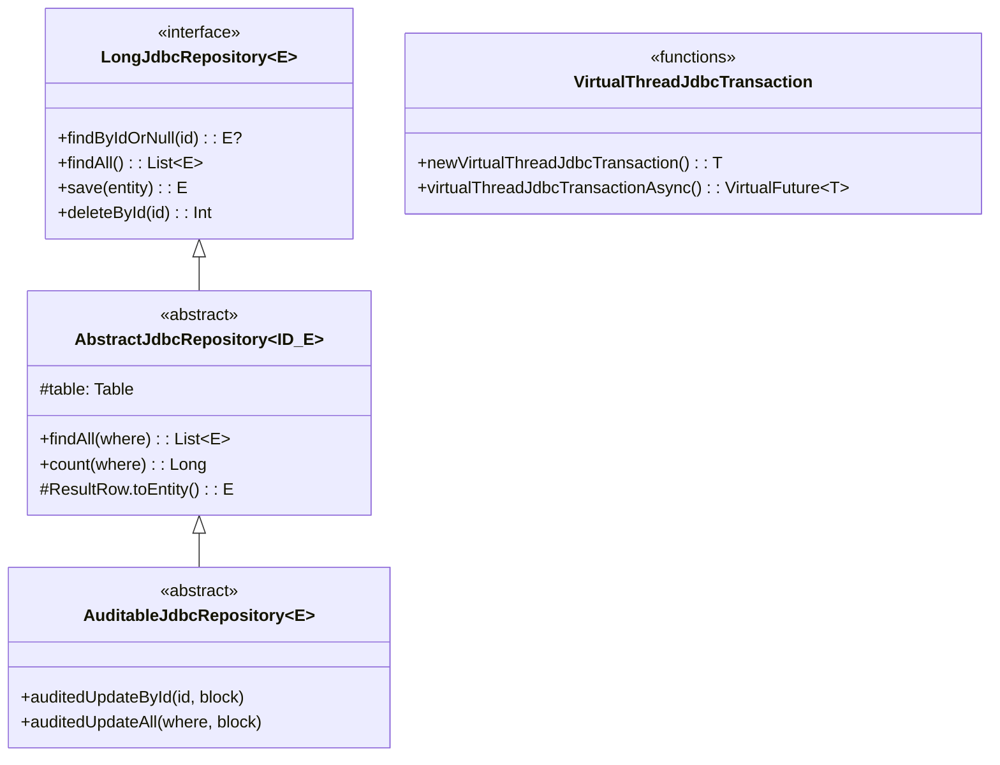
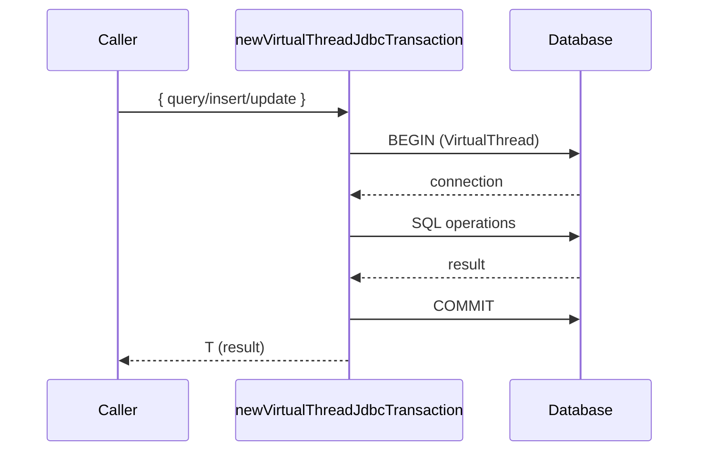
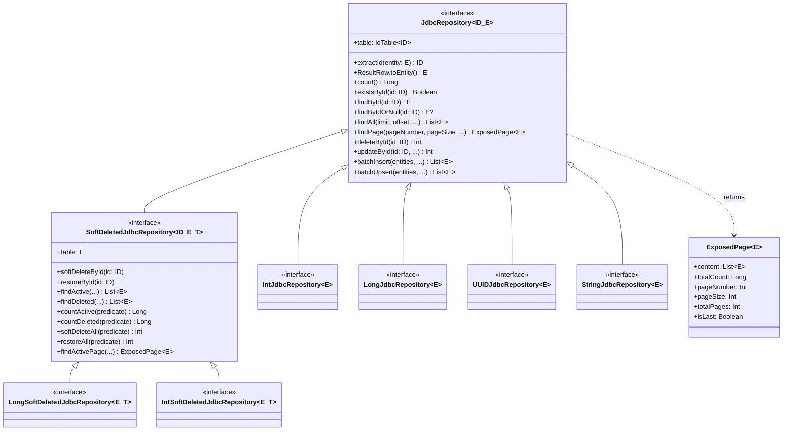
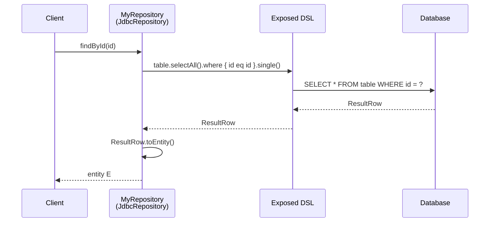
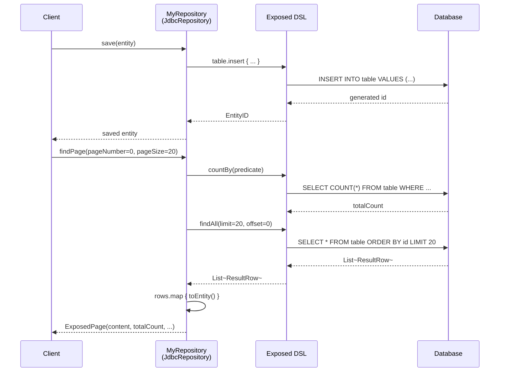
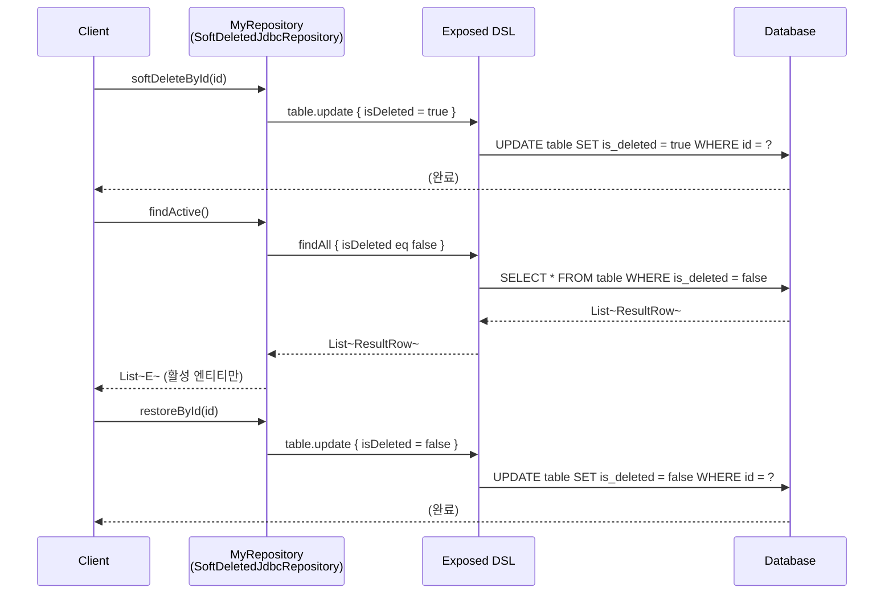

# Module bluetape4k-exposed-jdbc

[English](./README.md) | 한국어

JetBrains Exposed JDBC 계층을 위한 Repository 패턴, 트랜잭션 확장, 쿼리 유틸리티를 제공하는 모듈입니다.
`bluetape4k-exposed-core`와 `bluetape4k-exposed-dao`를 기반으로 JDBC에 특화된 기능을 제공합니다.

## 개요

`bluetape4k-exposed-jdbc`는 다음을 제공합니다:

- **Repository 패턴**: `JdbcRepository<ID, T, E>`, `SoftDeletedJdbcRepository<ID, T, E>` 인터페이스
- **Coroutines 지원**: `SuspendedQuery` — suspend 함수로 JDBC 쿼리 실행
- **Virtual Thread 트랜잭션**: JDK 21+ Virtual Thread 기반 트랜잭션 실행
- **테이블/스키마 확장**: `ImplicitSelectAll`, `TableExtensions`, `SchemaUtilsExtensions`

## 의존성 추가

```kotlin
dependencies {
    implementation("io.github.bluetape4k:bluetape4k-exposed-jdbc:${version}")

    // Coroutines 지원 시 (SuspendedQuery)
    implementation("io.github.bluetape4k:bluetape4k-coroutines:${version}")
}
```

## 기본 사용법

### 1. JdbcRepository 구현

```kotlin
import io.bluetape4k.exposed.jdbc.repository.LongJdbcRepository
import org.jetbrains.exposed.v1.core.ResultRow
import org.jetbrains.exposed.v1.core.dao.id.LongIdTable
import org.jetbrains.exposed.v1.jdbc.insert
import org.jetbrains.exposed.v1.jdbc.transactions.transaction

data class UserRecord(
    val id: Long = 0L,
    val name: String,
    val email: String,
)

object UserTable: LongIdTable("users") {
    val name = varchar("name", 100)
    val email = varchar("email", 200)
}

class UserRepository: LongJdbcRepository<UserTable, UserRecord> {

    override val table = UserTable

    override fun ResultRow.toEntity() = UserRecord(
        id = this[UserTable.id].value,
        name = this[UserTable.name],
        email = this[UserTable.email],
    )

    fun save(user: UserRecord): UserRecord {
        val id = UserTable.insert {
            it[name] = user.name
            it[email] = user.email
        } get UserTable.id
        return user.copy(id = id.value)
    }
}

// 사용
transaction {
    val repo = UserRepository()
    val user = repo.save(UserRecord(name = "홍길동", email = "hong@example.com"))

    val found = repo.findById(user.id)
    val page = repo.findPage(pageNumber = 0, pageSize = 20)
    println("총 레코드: ${page.totalCount}, 총 페이지: ${page.totalPages}")
}
```

### 2. SoftDeletedJdbcRepository 구현

```kotlin
import io.bluetape4k.exposed.core.dao.id.SoftDeletedIdTable
import io.bluetape4k.exposed.jdbc.repository.LongSoftDeletedJdbcRepository

object PostTable: SoftDeletedIdTable<Long>("posts") {
    override val id = long("id").autoIncrement().entityId()
    val title = varchar("title", 255)
    val content = text("content")
    override val primaryKey = PrimaryKey(id)
}

data class PostRecord(
    val id: Long = 0L,
    val title: String,
    val content: String,
    val isDeleted: Boolean = false,
)

class PostRepository: LongSoftDeletedJdbcRepository<PostTable, PostRecord> {
    override val table = PostTable

    override fun ResultRow.toEntity() = PostRecord(
        id = this[PostTable.id].value,
        title = this[PostTable.title],
        content = this[PostTable.content],
        isDeleted = this[PostTable.isDeleted],
    )
}

transaction {
    val repo = PostRepository()

    // 논리 삭제
    repo.softDeleteById(postId)

    // 활성 레코드만 조회
    val activePosts = repo.findActive()

    // 삭제된 레코드만 조회
    val deletedPosts = repo.findDeleted()

    // 복원
    repo.restoreById(postId)
}
```

### 3. Coroutines 기반 배치 조회 (SuspendedQuery)

```kotlin
import io.bluetape4k.exposed.core.fetchBatchedResultFlow
import kotlinx.coroutines.flow.flatMapConcat
import kotlinx.coroutines.flow.asFlow
import kotlinx.coroutines.flow.toList

// 10개씩 배치로 읽어오는 Flow 기반 쿼리
val allIds = UserTable
    .select(UserTable.id)
    .fetchBatchedResultFlow(batchSize = 10)
    .flatMapConcat { rows -> rows.asFlow() }
    .toList()
```

### 4. Virtual Thread 트랜잭션

```kotlin
import io.bluetape4k.exposed.jdbc.transactions.newVirtualThreadJdbcTransaction
import io.bluetape4k.exposed.jdbc.transactions.virtualThreadJdbcTransactionAsync

// JDK 21+ Virtual Thread에서 동기 트랜잭션 실행
val count = newVirtualThreadJdbcTransaction {
    UserTable.selectAll().count()
}

// 여러 트랜잭션을 비동기 병렬 실행 후 대기
val futures = List(10) { index ->
    virtualThreadJdbcTransactionAsync {
        UserTable.insert { it[name] = "user-$index" }
        index
    }
}
val results = futures.awaitAll()
```

### 5. ExposedPage — 페이징 결과

```kotlin
// JdbcRepository.findPage() 사용
transaction {
    val repo = UserRepository()
    val page = repo.findPage(
        pageNumber = 0,
        pageSize = 20,
        sortOrder = SortOrder.ASC
    ) { UserTable.name like "홍%" }

    println("전체 수: ${page.totalCount}")
    println("현재 페이지: ${page.pageNumber}")
    println("전체 페이지: ${page.totalPages}")
    println("마지막 페이지: ${page.isLast}")
    page.content.forEach { println(it) }
}
```

### 6. 배치 삽입 / Upsert

```kotlin
transaction {
    val repo = UserRepository()

    // 배치 삽입
    val inserted = repo.batchInsert(userList) { user ->
        this[UserTable.name] = user.name
        this[UserTable.email] = user.email
    }

    // 배치 Upsert
    val upserted = repo.batchUpsert(userList) { user ->
        this[UserTable.name] = user.name
        this[UserTable.email] = user.email
    }
}
```

## JdbcRepository 주요 메서드

| 메서드                                   | 설명                       |
|---------------------------------------|--------------------------|
| `count()`                             | 전체 레코드 수                 |
| `countBy(predicate)`                  | 조건에 맞는 레코드 수             |
| `existsById(id)`                      | ID로 존재 여부 확인             |
| `existsBy(predicate)`                 | 조건으로 존재 여부 확인            |
| `findById(id)`                        | ID로 단건 조회 (없으면 예외)       |
| `findByIdOrNull(id)`                  | ID로 단건 조회 (없으면 null)     |
| `findAll(limit, offset, ...)`         | 전체 조회 (페이징/정렬 지원)        |
| `findWithFilters(...)`                | 다중 조건 AND 조합 조회          |
| `findBy(...)`                         | `findWithFilters`의 alias |
| `findFirstOrNull(...)`                | 조건에 맞는 첫 번째 엔티티          |
| `findLastOrNull(...)`                 | 조건에 맞는 마지막 엔티티           |
| `findByField(field, value)`           | 특정 컬럼 값으로 조회             |
| `findAllByIds(ids)`                   | 여러 ID로 일괄 조회             |
| `findPage(pageNumber, pageSize, ...)` | 페이징 조회                   |
| `deleteById(id)`                      | ID로 삭제                   |
| `deleteByIdIgnore(id)`                | ID로 삭제 (예외 무시)           |
| `deleteAll(op)`                       | 조건에 맞는 레코드 삭제            |
| `deleteAllByIds(ids)`                 | 여러 ID로 일괄 삭제             |
| `updateById(id, ...)`                 | ID로 수정                   |
| `updateAll(predicate, ...)`           | 조건에 맞는 레코드 일괄 수정         |
| `batchInsert(entities, ...)`          | 배치 삽입                    |
| `batchUpsert(entities, ...)`          | 배치 Upsert                |

## SoftDeletedJdbcRepository 추가 메서드

| 메서드                                         | 설명                           |
|---------------------------------------------|------------------------------|
| `softDeleteById(id)`                        | ID로 논리 삭제 (`isDeleted=true`) |
| `restoreById(id)`                           | ID로 논리 삭제 복원                 |
| `countActive(predicate)`                    | 활성 레코드 수                     |
| `countDeleted(predicate)`                   | 삭제된 레코드 수                    |
| `findActive(limit, offset, ...)`            | 활성 레코드만 조회                   |
| `findDeleted(limit, offset, ...)`           | 삭제된 레코드만 조회                  |
| `softDeleteAll(predicate)`                  | 조건에 맞는 레코드 일괄 논리 삭제          |
| `restoreAll(predicate)`                     | 조건에 맞는 레코드 일괄 복원             |
| `findActivePage(pageNumber, pageSize, ...)` | 활성 레코드 페이징 조회                |

## AuditableJdbcRepository (감사 추적 Repository)

`AuditableJdbcRepository`는 UPDATE 시 `updatedAt`과 `updatedBy`를 자동으로 설정하는 감사 기능을 제공합니다.

### 테이블 정의 (exposed-core)

```kotlin
import io.bluetape4k.exposed.core.auditable.AuditableLongIdTable

object ArticleTable : AuditableLongIdTable("articles") {
    val title = varchar("title", 255)
    val content = text("content")
    // createdBy, createdAt, updatedBy, updatedAt 자동 추가
}
```

### Repository 구현

```kotlin
import io.bluetape4k.exposed.jdbc.repository.LongAuditableJdbcRepository
import org.jetbrains.exposed.v1.core.ResultRow

data class ArticleRecord(
    val id: Long = 0L,
    val title: String,
    val content: String,
)

class ArticleRepository : LongAuditableJdbcRepository<ArticleRecord, ArticleTable> {
    override val table = ArticleTable

    override fun extractId(entity: ArticleRecord) = entity.id

    override fun ResultRow.toEntity() = ArticleRecord(
        id = this[ArticleTable.id].value,
        title = this[ArticleTable.title],
        content = this[ArticleTable.content],
    )
}
```

### auditedUpdateById — ID로 수정

UPDATE 시 `updatedAt`을 DB `CURRENT_TIMESTAMP`(UTC)로, `updatedBy`를 `UserContext.getCurrentUser()`로 자동 설정합니다.

```kotlin
import io.bluetape4k.exposed.core.auditable.UserContext
import org.jetbrains.exposed.v1.jdbc.transactions.transaction

transaction {
    UserContext.withUser("editor@example.com") {
        val repo = ArticleRepository()

        // updatedBy="editor@example.com", updatedAt=DB현재시각 자동 설정
        val rows = repo.auditedUpdateById(1L) {
            it[ArticleTable.title] = "Updated Title"
        }
        println("수정된 행: $rows")
    }
}
```

### auditedUpdateAll — 조건으로 대량 수정

조건에 맞는 모든 레코드를 UPDATE하고 감사 필드를 자동 설정합니다.

```kotlin
transaction {
    UserContext.withUser("batch-job") {
        val repo = ArticleRepository()

        // title이 "Draft"인 모든 레코드 수정
        // updatedBy="batch-job", updatedAt=DB현재시각 자동 설정
        val rows = repo.auditedUpdateAll(predicate = { ArticleTable.title eq "Draft" }) {
            it[ArticleTable.title] = "Published"
        }
        println("수정된 행: $rows")
    }
}
```

### 전체 사용 예시

```kotlin
import io.bluetape4k.exposed.core.auditable.UserContext
import org.jetbrains.exposed.v1.jdbc.transactions.transaction

transaction {
    val repo = ArticleRepository()

    // 1. INSERT
    UserContext.withUser("alice") {
        val newArticle = ArticleRecord(
            title = "Hello Auditable",
            content = "Tracking changes automatically",
        )
        // INSERT 시 createdBy="alice", createdAt=DB현재시각 자동 설정
        repo.save(newArticle)
    }

    // 2. SELECT
    val article = repo.findByIdOrNull(1L)
    println("생성자: ${article?.createdBy}")  // "alice"
    println("생성일: ${article?.createdAt}")   // DB 타임스탬프

    // 3. UPDATE
    UserContext.withUser("bob") {
        // updatedBy="bob", updatedAt=DB현재시각 자동 설정
        repo.auditedUpdateById(1L) {
            it[ArticleTable.title] = "Updated by Bob"
        }
    }

    // 4. 수정 내역 확인
    val updated = repo.findByIdOrNull(1L)
    println("수정자: ${updated?.updatedBy}")  // "bob"
    println("수정일: ${updated?.updatedAt}")   // DB 타임스탬프 (생성일과 다름)
}
```

### 중요 사항

- `auditedUpdateById()` 또는 `auditedUpdateAll()`을 반드시 사용하세요.
- 일반 `JdbcRepository.updateById()`를 사용하면 감사 필드가 자동 설정되지 않습니다.

### 편의 타입 별칭

| 인터페이스                         | 기본키 타입           |
|-------------------------------|------------------|
| `IntAuditableJdbcRepository`  | `Int`            |
| `LongAuditableJdbcRepository` | `Long`           |
| `UUIDAuditableJdbcRepository` | `java.util.UUID` |

## 편의 타입 별칭 (일반 Repository)

| 인터페이스                             | 기본키 타입             |
|-----------------------------------|--------------------|
| `IntJdbcRepository`               | `Int`              |
| `LongJdbcRepository`              | `Long`             |
| `UuidJdbcRepository`              | `kotlin.uuid.Uuid` |
| `UUIDJdbcRepository`              | `java.util.UUID`   |
| `StringJdbcRepository`            | `String`           |
| `IntSoftDeletedJdbcRepository`    | `Int`              |
| `LongSoftDeletedJdbcRepository`   | `Long`             |
| `UuidSoftDeletedJdbcRepository`   | `kotlin.uuid.Uuid` |
| `UUIDSoftDeletedJdbcRepository`   | `java.util.UUID`   |
| `StringSoftDeletedJdbcRepository` | `String`           |

## 클래스 다이어그램

### Repository 및 VirtualThread 트랜잭션 핵심 구조





### Repository 계층 구조



## 시퀀스 다이어그램

### findById — 단건 조회



### save + findPage — 저장 후 페이징 조회



### softDeleteById / restoreById — 논리 삭제 및 복원



## 주요 파일/클래스 목록

| 파일                                                  | 설명                                 |
|-----------------------------------------------------|------------------------------------|
| `jdbc/repository/JdbcRepository.kt`                 | JDBC Repository 기본 인터페이스           |
| `jdbc/repository/SoftDeletedJdbcRepository.kt`      | Soft Delete 지원 Repository          |
| `repository/ExposedRepository.kt`                   | (Deprecated) 구 Repository 인터페이스    |
| `core/SuspendedQuery.kt`                            | 커서 기반 배치 Flow 쿼리                   |
| `jdbc/transactions/VirtualThreadJdbcTransaction.kt` | Virtual Thread 기반 JDBC 트랜잭션        |
| `core/transactions/VirtualThreadTransaction.kt`     | (Deprecated) 구 Virtual Thread 트랜잭션 |
| `core/ImplicitSelectAll.kt`                         | `SELECT *` 형태의 묵시적 전체 조회           |
| `core/TableExtensions.kt`                           | 테이블 메타데이터 확장 함수                    |
| `core/SchemaUtilsExtensions.kt`                     | SchemaUtils 확장 함수                  |

## 테스트

```bash
./gradlew :bluetape4k-exposed-jdbc:test
```

## 참고

- [JetBrains Exposed JDBC](https://github.com/JetBrains/Exposed/wiki/DSL)
- [bluetape4k-exposed-core](../exposed-core)
- [bluetape4k-exposed-dao](../exposed-dao)
