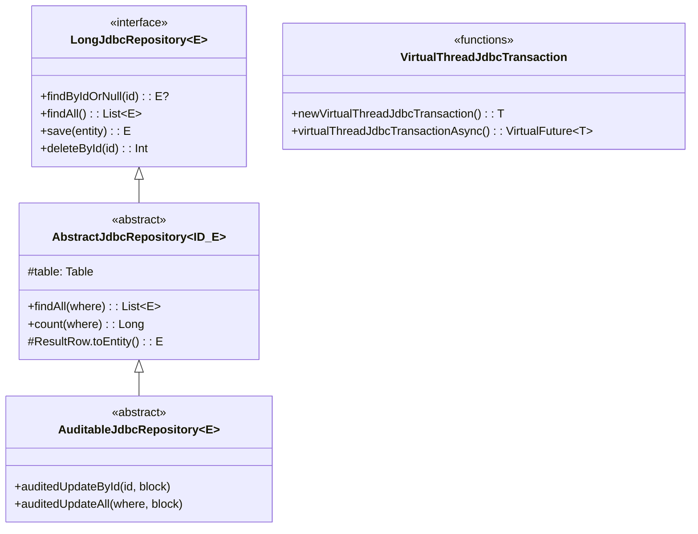
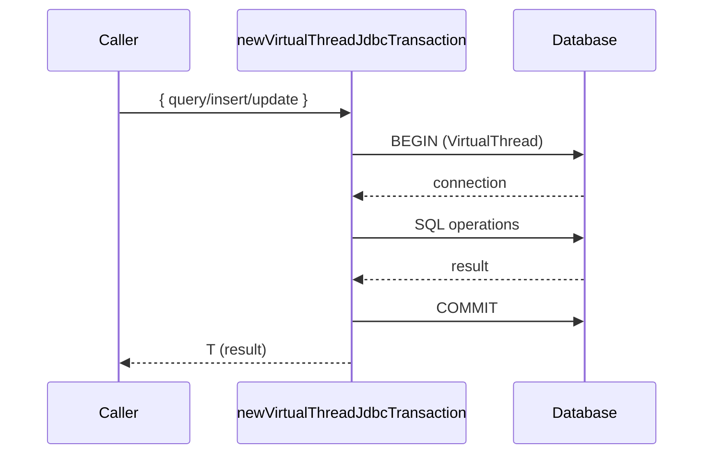
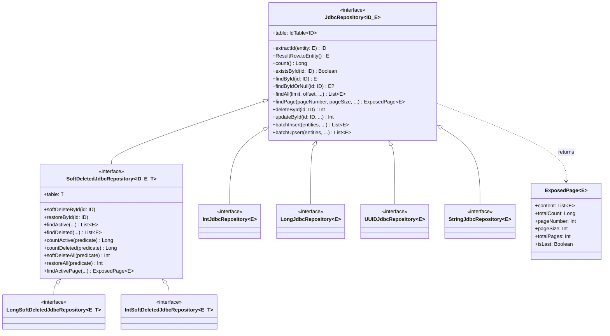
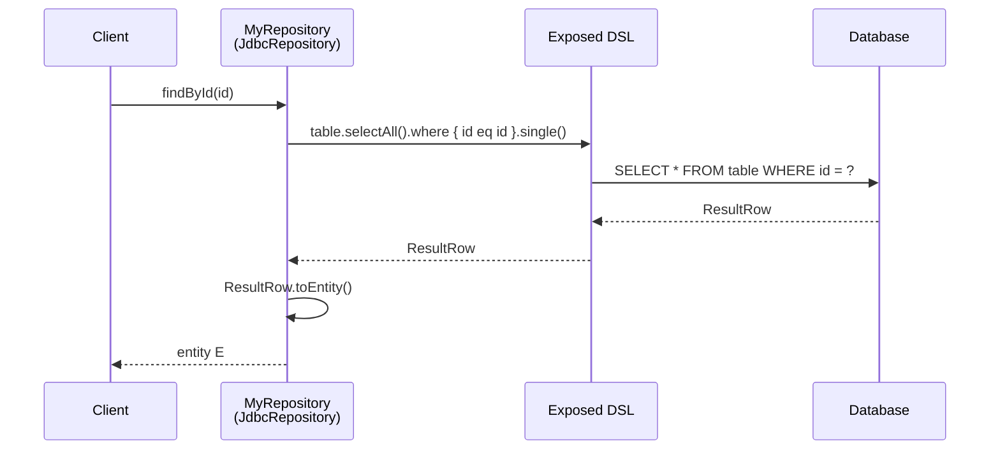
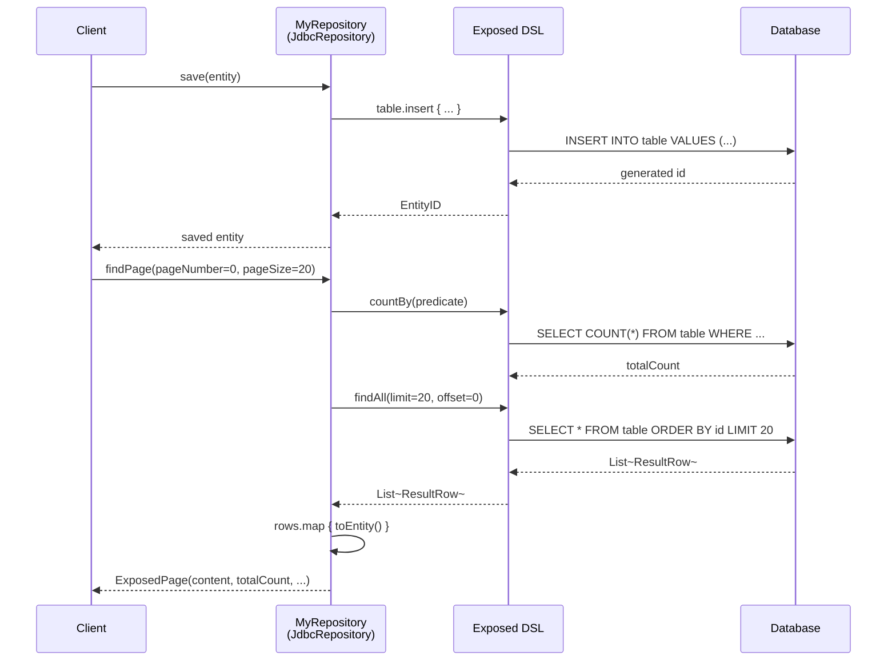
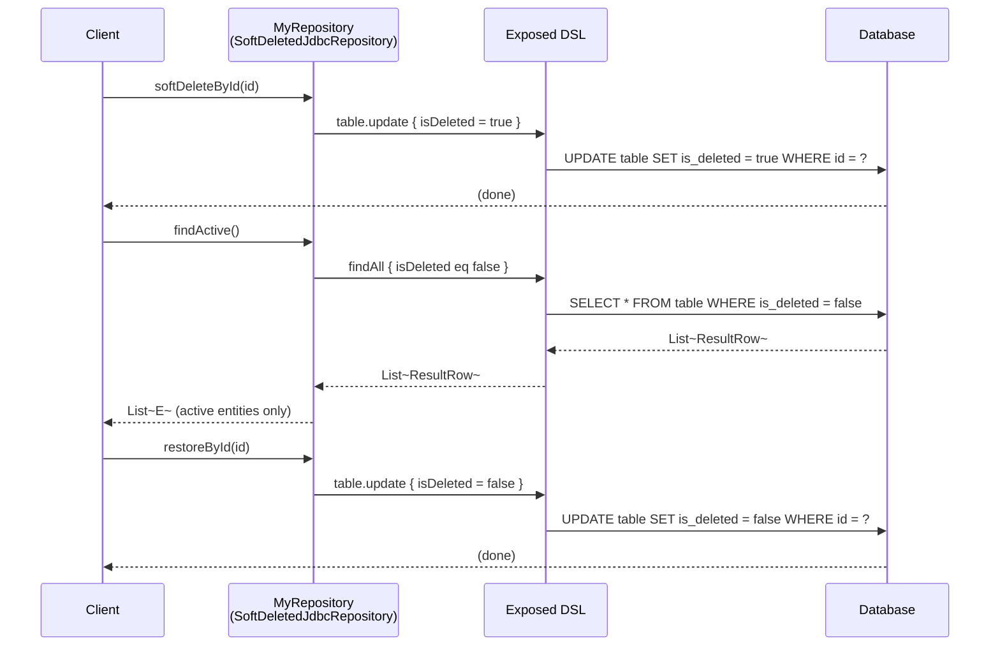

# Module bluetape4k-exposed-jdbc

English | [한국어](./README.ko.md)

Provides the Repository pattern, transaction extensions, and query utilities for the JetBrains Exposed JDBC layer. Built on top of `bluetape4k-exposed-core` and `bluetape4k-exposed-dao`, it delivers JDBC-specific features.

## Overview

`bluetape4k-exposed-jdbc` provides:

- **Repository pattern**: `JdbcRepository<ID, T, E>` and `SoftDeletedJdbcRepository<ID, T, E>` interfaces
- **Coroutines support**: `SuspendedQuery` — run JDBC queries as suspend functions
- **Virtual Thread transactions**: Transaction execution on JDK 21+ Virtual Threads
- **Table/schema extensions**: `ImplicitSelectAll`, `TableExtensions`, `SchemaUtilsExtensions`

## Adding Dependencies

```kotlin
dependencies {
    implementation("io.github.bluetape4k:bluetape4k-exposed-jdbc:${version}")

    // For Coroutines support (SuspendedQuery)
    implementation("io.github.bluetape4k:bluetape4k-coroutines:${version}")
}
```

## Basic Usage

### 1. Implementing JdbcRepository

```kotlin
import io.bluetape4k.exposed.jdbc.repository.LongJdbcRepository
import org.jetbrains.exposed.v1.core.ResultRow
import org.jetbrains.exposed.v1.core.dao.id.LongIdTable
import org.jetbrains.exposed.v1.jdbc.insert
import org.jetbrains.exposed.v1.jdbc.transactions.transaction

data class UserRecord(
    val id: Long = 0L,
    val name: String,
    val email: String,
)

object UserTable: LongIdTable("users") {
    val name = varchar("name", 100)
    val email = varchar("email", 200)
}

class UserRepository: LongJdbcRepository<UserTable, UserRecord> {

    override val table = UserTable

    override fun ResultRow.toEntity() = UserRecord(
        id = this[UserTable.id].value,
        name = this[UserTable.name],
        email = this[UserTable.email],
    )

    fun save(user: UserRecord): UserRecord {
        val id = UserTable.insert {
            it[name] = user.name
            it[email] = user.email
        } get UserTable.id
        return user.copy(id = id.value)
    }
}

// Usage
transaction {
    val repo = UserRepository()
    val user = repo.save(UserRecord(name = "Hong Gildong", email = "hong@example.com"))

    val found = repo.findById(user.id)
    val page = repo.findPage(pageNumber = 0, pageSize = 20)
    println("Total records: ${page.totalCount}, Total pages: ${page.totalPages}")
}
```

### 2. Implementing SoftDeletedJdbcRepository

```kotlin
import io.bluetape4k.exposed.core.dao.id.SoftDeletedIdTable
import io.bluetape4k.exposed.jdbc.repository.LongSoftDeletedJdbcRepository

object PostTable: SoftDeletedIdTable<Long>("posts") {
    override val id = long("id").autoIncrement().entityId()
    val title = varchar("title", 255)
    val content = text("content")
    override val primaryKey = PrimaryKey(id)
}

data class PostRecord(
    val id: Long = 0L,
    val title: String,
    val content: String,
    val isDeleted: Boolean = false,
)

class PostRepository: LongSoftDeletedJdbcRepository<PostTable, PostRecord> {
    override val table = PostTable

    override fun ResultRow.toEntity() = PostRecord(
        id = this[PostTable.id].value,
        title = this[PostTable.title],
        content = this[PostTable.content],
        isDeleted = this[PostTable.isDeleted],
    )
}

transaction {
    val repo = PostRepository()

    // Soft delete
    repo.softDeleteById(postId)

    // Query only active records
    val activePosts = repo.findActive()

    // Query only deleted records
    val deletedPosts = repo.findDeleted()

    // Restore
    repo.restoreById(postId)
}
```

### 3. Coroutines-based batch query (SuspendedQuery)

```kotlin
import io.bluetape4k.exposed.core.fetchBatchedResultFlow
import kotlinx.coroutines.flow.flatMapConcat
import kotlinx.coroutines.flow.asFlow
import kotlinx.coroutines.flow.toList

// Flow-based query that reads in batches of 10
val allIds = UserTable
    .select(UserTable.id)
    .fetchBatchedResultFlow(batchSize = 10)
    .flatMapConcat { rows -> rows.asFlow() }
    .toList()
```

### 4. Virtual Thread transactions

```kotlin
import io.bluetape4k.exposed.jdbc.transactions.newVirtualThreadJdbcTransaction
import io.bluetape4k.exposed.jdbc.transactions.virtualThreadJdbcTransactionAsync

// Run a synchronous transaction on a JDK 21+ Virtual Thread
val count = newVirtualThreadJdbcTransaction {
    UserTable.selectAll().count()
}

// Run multiple transactions asynchronously in parallel
val futures = List(10) { index ->
    virtualThreadJdbcTransactionAsync {
        UserTable.insert { it[name] = "user-$index" }
        index
    }
}
val results = futures.awaitAll()
```

### 5. ExposedPage — paginated results

```kotlin
// Using JdbcRepository.findPage()
transaction {
    val repo = UserRepository()
    val page = repo.findPage(
        pageNumber = 0,
        pageSize = 20,
        sortOrder = SortOrder.ASC
    ) { UserTable.name like "Hong%" }

    println("Total count: ${page.totalCount}")
    println("Current page: ${page.pageNumber}")
    println("Total pages: ${page.totalPages}")
    println("Is last page: ${page.isLast}")
    page.content.forEach { println(it) }
}
```

### 6. Batch insert / Upsert

```kotlin
transaction {
    val repo = UserRepository()

    // Batch insert
    val inserted = repo.batchInsert(userList) { user ->
        this[UserTable.name] = user.name
        this[UserTable.email] = user.email
    }

    // Batch upsert
    val upserted = repo.batchUpsert(userList) { user ->
        this[UserTable.name] = user.name
        this[UserTable.email] = user.email
    }
}
```

## JdbcRepository Key Methods

| Method                                  | Description                               |
|-----------------------------------------|-------------------------------------------|
| `count()`                               | Total record count                        |
| `countBy(predicate)`                    | Count matching records                    |
| `existsById(id)`                        | Check existence by ID                     |
| `existsBy(predicate)`                   | Check existence by condition              |
| `findById(id)`                          | Find by ID (throws if not found)          |
| `findByIdOrNull(id)`                    | Find by ID (returns null if not found)    |
| `findAll(limit, offset, ...)`           | Find all (supports paging and sorting)    |
| `findWithFilters(...)`                  | Find with multiple AND conditions         |
| `findBy(...)`                           | Alias for `findWithFilters`               |
| `findFirstOrNull(...)`                  | First matching entity                     |
| `findLastOrNull(...)`                   | Last matching entity                      |
| `findByField(field, value)`             | Find by a specific column value           |
| `findAllByIds(ids)`                     | Find multiple entities by IDs             |
| `findPage(pageNumber, pageSize, ...)`   | Paginated query                           |
| `deleteById(id)`                        | Delete by ID                              |
| `deleteByIdIgnore(id)`                  | Delete by ID (ignore exceptions)          |
| `deleteAll(op)`                         | Delete matching records                   |
| `deleteAllByIds(ids)`                   | Delete multiple records by IDs            |
| `updateById(id, ...)`                   | Update by ID                              |
| `updateAll(predicate, ...)`             | Bulk update matching records              |
| `batchInsert(entities, ...)`            | Batch insert                              |
| `batchUpsert(entities, ...)`            | Batch upsert                              |

## SoftDeletedJdbcRepository Additional Methods

| Method                                          | Description                                        |
|-------------------------------------------------|----------------------------------------------------|
| `softDeleteById(id)`                            | Soft delete by ID (`isDeleted=true`)               |
| `restoreById(id)`                               | Restore a soft-deleted record by ID                |
| `countActive(predicate)`                        | Count active records                               |
| `countDeleted(predicate)`                       | Count deleted records                              |
| `findActive(limit, offset, ...)`                | Find only active records                           |
| `findDeleted(limit, offset, ...)`               | Find only deleted records                          |
| `softDeleteAll(predicate)`                      | Bulk soft delete matching records                  |
| `restoreAll(predicate)`                         | Bulk restore matching records                      |
| `findActivePage(pageNumber, pageSize, ...)`     | Paginated query of active records                  |

## AuditableJdbcRepository (Audit Tracking Repository)

`AuditableJdbcRepository` automatically sets `updatedAt` and `updatedBy` on UPDATE operations.

### Table definition (exposed-core)

```kotlin
import io.bluetape4k.exposed.core.auditable.AuditableLongIdTable

object ArticleTable : AuditableLongIdTable("articles") {
    val title = varchar("title", 255)
    val content = text("content")
    // createdBy, createdAt, updatedBy, updatedAt are added automatically
}
```

### Repository implementation

```kotlin
import io.bluetape4k.exposed.jdbc.repository.LongAuditableJdbcRepository
import org.jetbrains.exposed.v1.core.ResultRow

data class ArticleRecord(
    val id: Long = 0L,
    val title: String,
    val content: String,
)

class ArticleRepository : LongAuditableJdbcRepository<ArticleRecord, ArticleTable> {
    override val table = ArticleTable

    override fun extractId(entity: ArticleRecord) = entity.id

    override fun ResultRow.toEntity() = ArticleRecord(
        id = this[ArticleTable.id].value,
        title = this[ArticleTable.title],
        content = this[ArticleTable.content],
    )
}
```

### auditedUpdateById — Update by ID

On UPDATE, automatically sets `updatedAt` to DB `CURRENT_TIMESTAMP` (UTC) and `updatedBy` to `UserContext.getCurrentUser()`.

```kotlin
import io.bluetape4k.exposed.core.auditable.UserContext
import org.jetbrains.exposed.v1.jdbc.transactions.transaction

transaction {
    UserContext.withUser("editor@example.com") {
        val repo = ArticleRepository()

        // updatedBy="editor@example.com", updatedAt set to current DB time
        val rows = repo.auditedUpdateById(1L) {
            it[ArticleTable.title] = "Updated Title"
        }
        println("Rows updated: $rows")
    }
}
```

### auditedUpdateAll — Bulk update by condition

Updates all matching records and automatically sets audit fields.

```kotlin
transaction {
    UserContext.withUser("batch-job") {
        val repo = ArticleRepository()

        // Update all records where title = "Draft"
        // updatedBy="batch-job", updatedAt set to current DB time
        val rows = repo.auditedUpdateAll(predicate = { ArticleTable.title eq "Draft" }) {
            it[ArticleTable.title] = "Published"
        }
        println("Rows updated: $rows")
    }
}
```

### Complete example

```kotlin
import io.bluetape4k.exposed.core.auditable.UserContext
import org.jetbrains.exposed.v1.jdbc.transactions.transaction

transaction {
    val repo = ArticleRepository()

    // 1. INSERT
    UserContext.withUser("alice") {
        val newArticle = ArticleRecord(
            title = "Hello Auditable",
            content = "Tracking changes automatically",
        )
        // INSERT: createdBy="alice", createdAt set to current DB time
        repo.save(newArticle)
    }

    // 2. SELECT
    val article = repo.findByIdOrNull(1L)
    println("Creator: ${article?.createdBy}")   // "alice"
    println("Created at: ${article?.createdAt}") // DB timestamp

    // 3. UPDATE
    UserContext.withUser("bob") {
        // updatedBy="bob", updatedAt set to current DB time
        repo.auditedUpdateById(1L) {
            it[ArticleTable.title] = "Updated by Bob"
        }
    }

    // 4. Verify the update
    val updated = repo.findByIdOrNull(1L)
    println("Modifier: ${updated?.updatedBy}")   // "bob"
    println("Updated at: ${updated?.updatedAt}") // DB timestamp (different from createdAt)
}
```

### Important notes

- Always use `auditedUpdateById()` or `auditedUpdateAll()` for auditable entities.
- Using the plain `JdbcRepository.updateById()` will not automatically set audit fields.

### Convenience type aliases

| Interface                      | Primary key type   |
|--------------------------------|--------------------|
| `IntAuditableJdbcRepository`   | `Int`              |
| `LongAuditableJdbcRepository`  | `Long`             |
| `UUIDAuditableJdbcRepository`  | `java.util.UUID`   |

## Convenience Type Aliases (Standard Repository)

| Interface                           | Primary key type      |
|-------------------------------------|-----------------------|
| `IntJdbcRepository`                 | `Int`                 |
| `LongJdbcRepository`                | `Long`                |
| `UuidJdbcRepository`                | `kotlin.uuid.Uuid`    |
| `UUIDJdbcRepository`                | `java.util.UUID`      |
| `StringJdbcRepository`              | `String`              |
| `IntSoftDeletedJdbcRepository`      | `Int`                 |
| `LongSoftDeletedJdbcRepository`     | `Long`                |
| `UuidSoftDeletedJdbcRepository`     | `kotlin.uuid.Uuid`    |
| `UUIDSoftDeletedJdbcRepository`     | `java.util.UUID`      |
| `StringSoftDeletedJdbcRepository`   | `String`              |

## Class Diagrams

### Core Repository and VirtualThread Transaction Structure





### Repository Hierarchy



## Sequence Diagrams

### findById — Single record lookup



### save + findPage — Save then paginate



### softDeleteById / restoreById — Soft delete and restore



## Key Files and Classes

| File                                                         | Description                                   |
|--------------------------------------------------------------|-----------------------------------------------|
| `jdbc/repository/JdbcRepository.kt`                         | JDBC Repository base interface                |
| `jdbc/repository/SoftDeletedJdbcRepository.kt`              | Soft Delete Repository                        |
| `repository/ExposedRepository.kt`                           | (Deprecated) Legacy Repository interface      |
| `core/SuspendedQuery.kt`                                     | Cursor-based batch Flow query                 |
| `jdbc/transactions/VirtualThreadJdbcTransaction.kt`         | Virtual Thread-based JDBC transaction         |
| `core/transactions/VirtualThreadTransaction.kt`             | (Deprecated) Legacy Virtual Thread transaction |
| `core/ImplicitSelectAll.kt`                                  | Implicit `SELECT *` query                     |
| `core/TableExtensions.kt`                                    | Table metadata extension functions            |
| `core/SchemaUtilsExtensions.kt`                              | SchemaUtils extension functions               |

## Testing

```bash
./gradlew :bluetape4k-exposed-jdbc:test
```

## References

- [JetBrains Exposed JDBC](https://github.com/JetBrains/Exposed/wiki/DSL)
- [bluetape4k-exposed-core](../exposed-core)
- [bluetape4k-exposed-dao](../exposed-dao)
