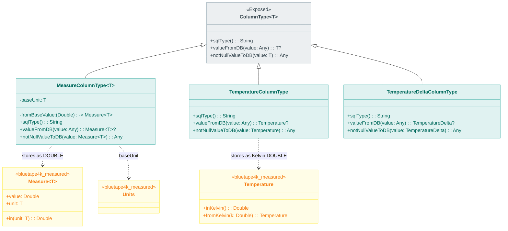
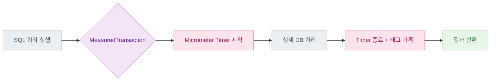
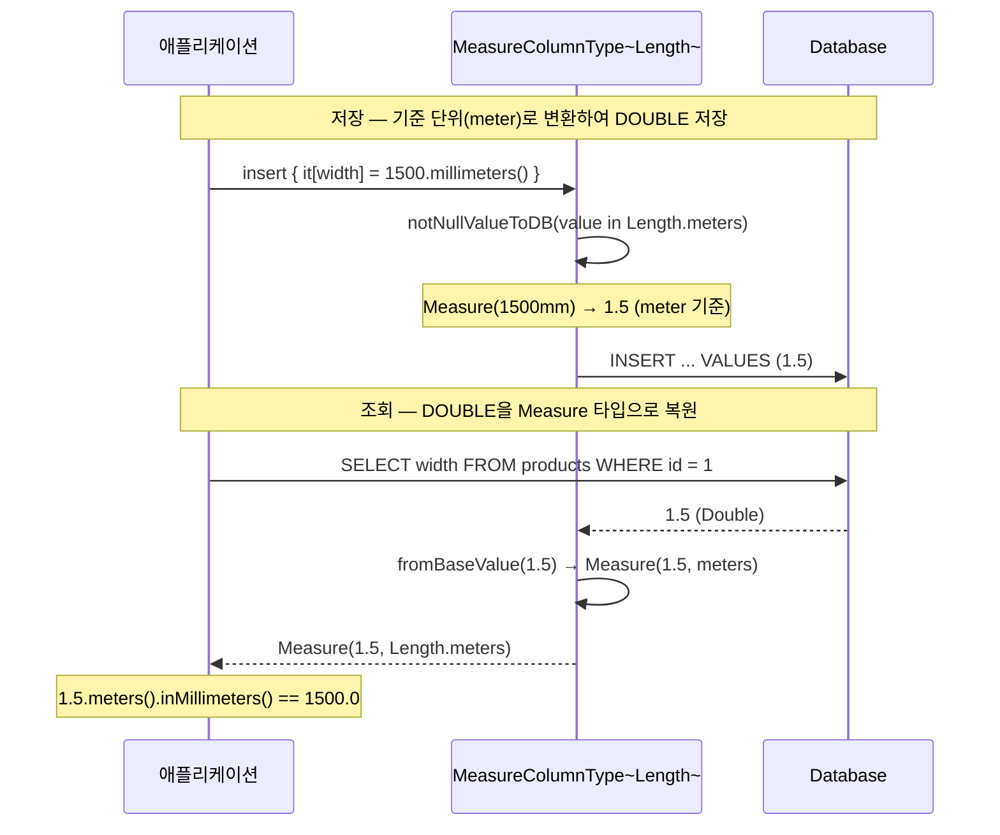

# Module bluetape4k-exposed-measured

[English](./README.md) | 한국어

Exposed에서 `bluetape4k-measured` 타입(`Measure<T>`, `Temperature`, `TemperatureDelta`)을
`DOUBLE` 컬럼으로 저장/조회하기 위한 Custom ColumnType 모듈입니다.

## 지원 컬럼

- `measure(name, baseUnit)`
- `length(name)`, `mass(name)`, `area(name)`, `volume(name)`
- `angle(name)`, `pressure(name)`, `storage(name)`, `frequency(name)`
- `energy(name)`, `power(name)`
- `temperature(name)`, `temperatureDelta(name)`

## 예제

```kotlin
object ProductTable: Table("products") {
    val width = length("width")
    val weight = mass("weight")
    val storage = storage("storage")
    val temp = temperature("temp")
}
```

## 클래스 다이어그램



## 쿼리 실행 흐름



## 저장/조회 시퀀스 다이어그램


