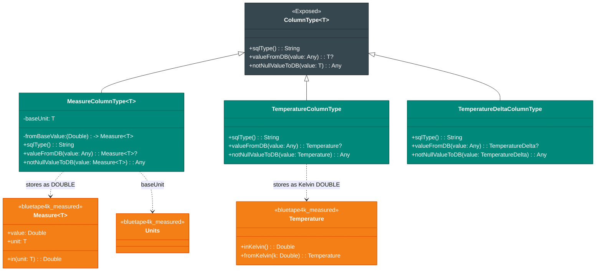
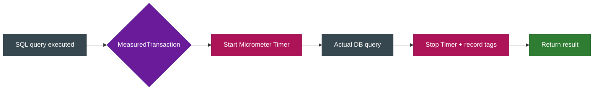
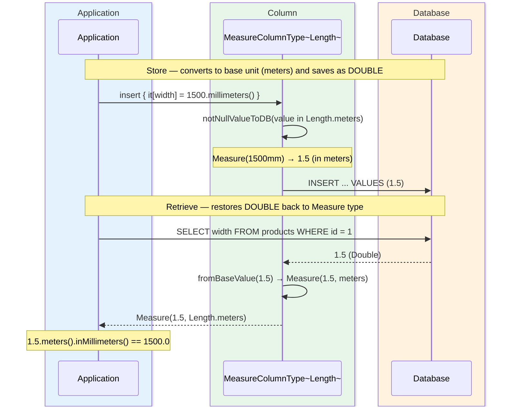

# Module bluetape4k-exposed-measured

English | [한국어](./README.ko.md)

A custom ColumnType module for storing and retrieving `bluetape4k-measured` types (`Measure<T>`, `Temperature`,
`TemperatureDelta`) as `DOUBLE` columns in Exposed.

## Supported Columns

- `measure(name, baseUnit)`
- `length(name)`, `mass(name)`, `area(name)`, `volume(name)`
- `angle(name)`, `pressure(name)`, `storage(name)`, `frequency(name)`
- `energy(name)`, `power(name)`
- `temperature(name)`, `temperatureDelta(name)`

## Example

```kotlin
object ProductTable: Table("products") {
    val width = length("width")
    val weight = mass("weight")
    val storage = storage("storage")
    val temp = temperature("temp")
}
```

## Class Diagram



## Query Execution Flow



## Storage / Retrieval Sequence Diagram


