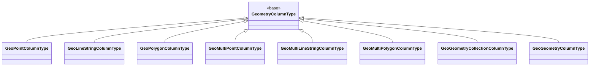
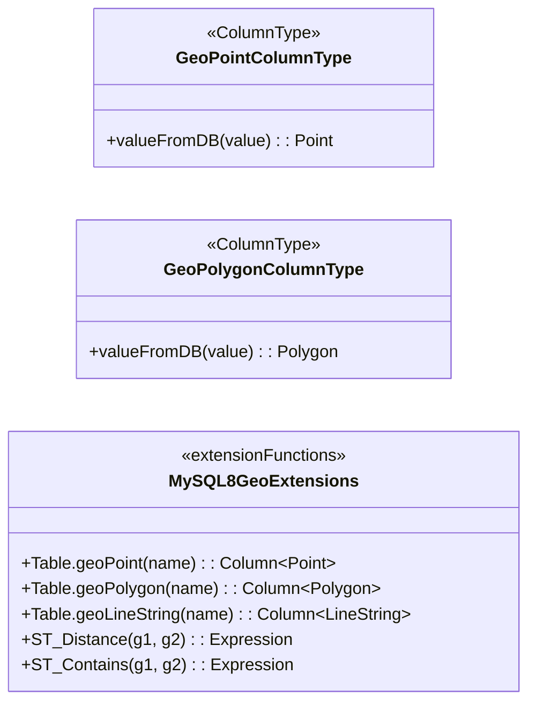

# Module bluetape4k-exposed-mysql8

[English](./README.md) | 한국어

MySQL 8.0+ 공간 데이터(GIS)를 JetBrains Exposed ORM에서 사용할 수 있게 해주는 모듈입니다.

JTS(Java Topology Suite)를 사용하여 8가지 geometry 타입을 지원하며, 거리 계산, 공간 관계(포함, 교차 등), 넓이/길이 측정 등의 공간 함수를 제공합니다.

## UML



## 확장 함수 다이어그램



## 개요

- **Geometry 타입
  **: Point, LineString, Polygon, MultiPoint, MultiLineString, MultiPolygon, GeometryCollection, Geometry (기본)
- **좌표계**: WGS84 (SRID 4326) 기본값
- **공간 함수**: 9개 관계 함수 + 4개 측정 함수 + 3개 속성 함수
- **MySQL 전용**: `MysqlDialect` 사용 시에만 동작
- **직렬화 경로**:
    - PreparedStatement 바인딩은 MySQL Internal Format (`4byte SRID LE + WKB`) 사용
    - SQL literal 경로는 `ST_GeomFromWKB(..., srid, 'axis-order=long-lat')` 사용

## 지원하는 Geometry 타입

| 타입                 | JTS 클래스              | 설명              |
|--------------------|----------------------|-----------------|
| POINT              | `Point`              | 단일 좌표           |
| LINESTRING         | `LineString`         | 선분              |
| POLYGON            | `Polygon`            | 폐곡선 영역          |
| MULTIPOINT         | `MultiPoint`         | 다중 점            |
| MULTILINESTRING    | `MultiLineString`    | 다중 선분           |
| MULTIPOLYGON       | `MultiPolygon`       | 다중 폐곡선 영역       |
| GEOMETRYCOLLECTION | `GeometryCollection` | 혼합 geometry 컬렉션 |
| GEOMETRY           | `Geometry`           | 범용(모든 타입 허용)    |

## Table 확장 함수

```kotlin
object Locations : LongIdTable("locations") {
    val name = varchar("name", 255)
    val point = geoPoint("point")                    // POINT
    val line = geoLineString("line")                 // LINESTRING
    val area = geoPolygon("area")                    // POLYGON
    val multiPoint = geoMultiPoint("multi_point")   // MULTIPOINT
    val path = geoMultiLineString("path")           // MULTILINESTRING
    val zones = geoMultiPolygon("zones")            // MULTIPOLYGON
    val collection = geoGeometryCollection("coll")  // GEOMETRYCOLLECTION
    val geom = geoGeometry("geom")                  // GEOMETRY (범용)
}
```

모든 확장 함수는 기본 SRID 4326(WGS84)을 사용합니다. 다른 SRID가 필요한 경우 두 번째 인자로 명시할 수 있습니다.

```kotlin
val point = geoPoint("location", srid = 3857)  // Web Mercator
```

## WGS84 좌표 생성 헬퍼

**좌표 순서 규약**: longitude(경도, X축) 먼저, latitude(위도, Y축) 두 번째

```kotlin
// Point
val seoul = wgs84Point(lng = 126.9780, lat = 37.5665)
val busan = wgs84Point(lng = 129.0756, lat = 35.1796)

// Polygon (자동으로 닫힘 — 첫 좌표 = 마지막 좌표)
val korea = wgs84Polygon(
    126.0 to 37.0,
    129.0 to 37.0,
    129.0 to 33.0,
    126.0 to 33.0,
    126.0 to 37.0  // 또는 자동 닫힘
)

// 직사각형 Polygon
val area = wgs84Rectangle(
    minLng = 126.0, minLat = 37.0,
    maxLng = 128.0, maxLat = 38.0
)

// LineString
val route = wgs84LineString(
    126.9780 to 37.5665,  // 서울
    127.1086 to 37.2171,  // 경기도
    127.1086 to 36.4405   // 충청도
)

// MultiPoint, MultiLineString, MultiPolygon
val points = wgs84MultiPoint(seoul, busan)
val lines = wgs84MultiLineString(route1, route2)
val areas = wgs84MultiPolygon(area1, area2)
```

## 공간 관계 함수

9가지 공간 술어(predicate) 함수를 제공합니다. 모두 `Op<Boolean>`을 반환하여 WHERE 절에서 사용할 수 있습니다.

```kotlin
// ST_Contains — A가 B를 완전히 포함하는가?
Locations.selectAll()
    .where { Locations.area.stContains(Locations.point) }
    .toList()

// ST_Within — A가 B 내부에 있는가?
Locations.selectAll()
    .where { Locations.point.stWithin(Locations.area) }
    .toList()

// ST_Intersects — A와 B가 교차하는가? (포함 포함)
Locations.selectAll()
    .where { Locations.area.stIntersects(otherGeom) }
    .toList()

// ST_Disjoint — A와 B가 완전히 분리되어 있는가?
Locations.selectAll()
    .where { Locations.point.stDisjoint(otherPoint) }
    .toList()

// ST_Overlaps — A와 B가 부분적으로 겹치는가? (완전 포함 제외)
Locations.selectAll()
    .where { Locations.area.stOverlaps(otherArea) }
    .toList()

// ST_Touches — A와 B가 경계에서만 접촉하는가?
Locations.selectAll()
    .where { Locations.line.stTouches(otherLine) }
    .toList()

// ST_Crosses — A가 B를 교차하는가? (선과 면의 교차 판정)
Locations.selectAll()
    .where { Locations.line.stCrosses(otherLine) }
    .toList()

// ST_Equals — A와 B가 동일한가?
Locations.selectAll()
    .where { Locations.point.stEquals(otherPoint) }
    .toList()

// ST_DWithin — A가 B로부터 distance(미터) 이내에 있는가?
Locations.selectAll()
    .where { Locations.point.stDWithin(otherPoint, distance = 5_000.0) }
    .toList()
```

## 공간 측정 함수

거리, 길이, 넓이를 계산하는 함수들입니다. 모두 `Expression<Double>`을 반환합니다.

```kotlin
// ST_Distance — 두 geometry 간의 평면 거리 (미터, SRID 4326)
val distExpr = Locations.point1.stDistance(Locations.point2)
val distance = Locations.select(distExpr).single()[distExpr]  // Double

// ST_Distance_Sphere — 두 geometry 간의 구면 거리 (미터, 지구 곡면 고려)
val distSpherExpr = Locations.point1.stDistanceSphere(Locations.point2)
val distSphere = Locations.select(distSpherExpr).single()[distSpherExpr]  // Double

// ST_Length — LineString 또는 MultiLineString의 길이 (미터)
val lengthExpr = Locations.line.stLength()
val length = Locations.select(lengthExpr).single()[lengthExpr]  // Double

// ST_Area — Polygon 또는 MultiPolygon의 넓이 (제곱미터)
val areaExpr = Locations.area.stArea()
val area = Locations.select(areaExpr).single()[areaExpr]  // Double
```

## 공간 속성 함수

Geometry의 메타데이터를 반환하는 함수들입니다.

```kotlin
// ST_AsText — WKT(Well-Known Text) 문자열
val textExpr = Locations.point.stAsText()
val text = Locations.select(textExpr).single()[textExpr]  // String, e.g. "POINT(126.978 37.5665)"

// ST_SRID — SRID 값 반환
val sridExpr = Locations.point.stSrid()
val srid = Locations.select(sridExpr).single()[sridExpr]  // Int, e.g. 4326

// ST_GeometryType — Geometry 타입명 반환
val typeExpr = Locations.point.stGeometryType()
val typeName = Locations.select(typeExpr).single()[typeExpr]  // String, e.g. "POINT"
```

## 사용 예제

### 기본 CRUD

```kotlin
transaction(db) {
    // 생성
    Locations.insert {
        it[name] = "서울"
        it[point] = wgs84Point(lng = 126.9780, lat = 37.5665)
        it[area] = wgs84Rectangle(126.0, 37.0, 127.5, 38.0)
    }

    // 조회
    Locations.selectAll()
        .where { Locations.name eq "서울" }
        .singleOrNull()

    // 수정
    Locations.update({ Locations.name eq "서울" }) {
        it[point] = wgs84Point(126.9780, 37.5665)
    }

    // 삭제
    Locations.deleteWhere { name eq "서울" }
}
```

### 공간 조건으로 필터링

```kotlin
transaction(db) {
    val zone = wgs84Rectangle(126.0, 37.0, 127.0, 38.0)

    // zone 내의 모든 포인트 조회
    val pointsInZone = Locations.selectAll()
        .where { Locations.point.stWithin(zone) }
        .toList()

    // zone과 겹치는 모든 영역 조회
    val overlappingAreas = Locations.selectAll()
        .where { Locations.area.stIntersects(zone) }
        .toList()
}
```

### 거리 기반 검색

```kotlin
transaction(db) {
    val myLocation = wgs84Point(126.9780, 37.5665)

    // 내 위치로부터 5km 이내의 장소들
    val nearby = Locations.selectAll()
        .where { Locations.point.stDWithin(myLocation, distance = 5_000.0) }
        .toList()
}
```

### 거리 정렬

```kotlin
transaction(db) {
    val myLocation = wgs84Point(126.9780, 37.5665)
    val distExpr = Locations.point.stDistance(myLocation)

    // 거리 순 정렬
    val sorted = Locations.select(Locations.id, Locations.name, distExpr)
        .orderBy(distExpr to SortOrder.ASC)
        .toList()

    sorted.forEach { row ->
        val distance = row[distExpr]
        println("장소: ${row[Locations.name]}, 거리: ${distance.toInt()}m")
    }
}
```

### 넓이 계산

```kotlin
transaction(db) {
    val areas = Locations.select(Locations.name, Locations.area.stArea())
        .map { row ->
            val areaValue = row[Locations.area.stArea()]  // m²
            Pair(row[Locations.name], areaValue / 1_000_000)  // km²로 변환
        }
}
```

## 테이블 선언 주의사항

Geometry 컬럼을 포함한 테이블은 **반드시 트랜잭션 내에서만** 인스턴스화되어야 합니다.

```kotlin
// ❌ 금지 — object 선언 불가 (dialect 체크가 컴파일 타임에 수행)
object Locations : LongIdTable("locations") {
    val point = geoPoint("point")  // IllegalStateException!
}

// ✅ 올바름 — 트랜잭션 내에서 class로 선언
class Locations : LongIdTable("locations") {
    val point = geoPoint("point")
}

transaction(db) {
    val table = Locations()
    SchemaUtils.create(table)
    // 사용...
}
```

## 기술 요건

| 항목           | 버전                                 |
|--------------|------------------------------------|
| **MySQL**    | 8.0+ (Testcontainers: `mysql:8.0`) |
| **JTS Core** | 1.20.0 이상                          |
| **Exposed**  | v1 (Jetbrains)                     |
| **SRID**     | 4326 (WGS84, 기본값)                  |

## 의존성

```kotlin
testImplementation(project(":bluetape4k-exposed-mysql8"))
```

모듈이 제공하는 의존성:

- `org.jetbrains.exposed:exposed-core`
- `org.jetbrains.exposed:exposed-dao`
- `org.jetbrains.exposed:exposed-jdbc`
- `org.locationtech.jts:jts-core`

## 주의사항

### MySQL Dialect 전용

모든 확장 함수는 `MysqlDialect` 사용 시에만 동작합니다. 다른 DBMS에서 호출 시 `IllegalStateException`이 발생합니다.

```kotlin
// PostgreSQL 등에서 사용 불가
val point = geoPoint("location")  // IllegalStateException: geoPoint는 MySQL dialect에서만 지원됩니다.
```

### 미지원 함수

MySQL의 `ST_Centroid()`, `ST_Envelope()` 등 일부 공간 함수는 geographic SRID(4326)에서
`ER_NOT_IMPLEMENTED_FOR_GEOGRAPHIC_SRS` 오류를 발생시킵니다. 이 모듈은 이러한 함수를 제공하지 않습니다.

### 좌표 순서

WGS84(SRID 4326)은 axis-order가 **longitude-latitude(경도-위도)**입니다. 모든 헬퍼 함수는 이 순서를 따릅니다.

```kotlin
// ✅ 올바름
wgs84Point(lng = 126.9780, lat = 37.5665)

// ❌ 잘못됨 (위도 먼저 사용하면 보정 불가)
wgs84Point(lng = 37.5665, lat = 126.9780)
```

## 테스트 패턴

테스트는 Testcontainers를 사용하여 MySQL 8.0을 자동으로 시작합니다.

```kotlin
abstract class AbstractMySqlGisTest : AbstractExposedTest() {
    companion object : KLogging() {
        @JvmStatic
        val mysqlContainer: MySQLContainer<*> = MySQLContainer(
            DockerImageName.parse("mysql:8.0")
        ).apply { start() }

        @JvmStatic
        val db: Database by lazy {
            Database.connect(
                url = mysqlContainer.jdbcUrl + "?allowPublicKeyRetrieval=true&useSSL=false",
                driver = "com.mysql.cj.jdbc.Driver",
                user = mysqlContainer.username,
                password = mysqlContainer.password,
            )
        }
    }

    protected fun withGeoTables(vararg tables: Table, statement: () -> Unit) {
        transaction(db) {
            runCatching { SchemaUtils.drop(*tables) }
            SchemaUtils.create(*tables)
        }
        try {
            transaction(db) { statement() }
        } finally {
            transaction(db) {
                runCatching { SchemaUtils.drop(*tables) }
            }
        }
    }
}
```

핵심 회귀 테스트:

```bash
./gradlew :bluetape4k-exposed-mysql8:test --tests "io.bluetape4k.exposed.mysql8.gis.GeometryColumnTypeTest"
./gradlew :bluetape4k-exposed-mysql8:test --tests "io.bluetape4k.exposed.mysql8.gis.MySqlWkbUtilsTest"
```

## 참조

- [JTS Topology Suite](https://github.com/locationtech/jts)
- [MySQL GIS Functions](https://dev.mysql.com/doc/refman/8.0/en/spatial-function-reference.html)
- [WGS84 / SRID 4326](https://en.wikipedia.org/wiki/Web_Mercator_projection#EPSG:4326)
