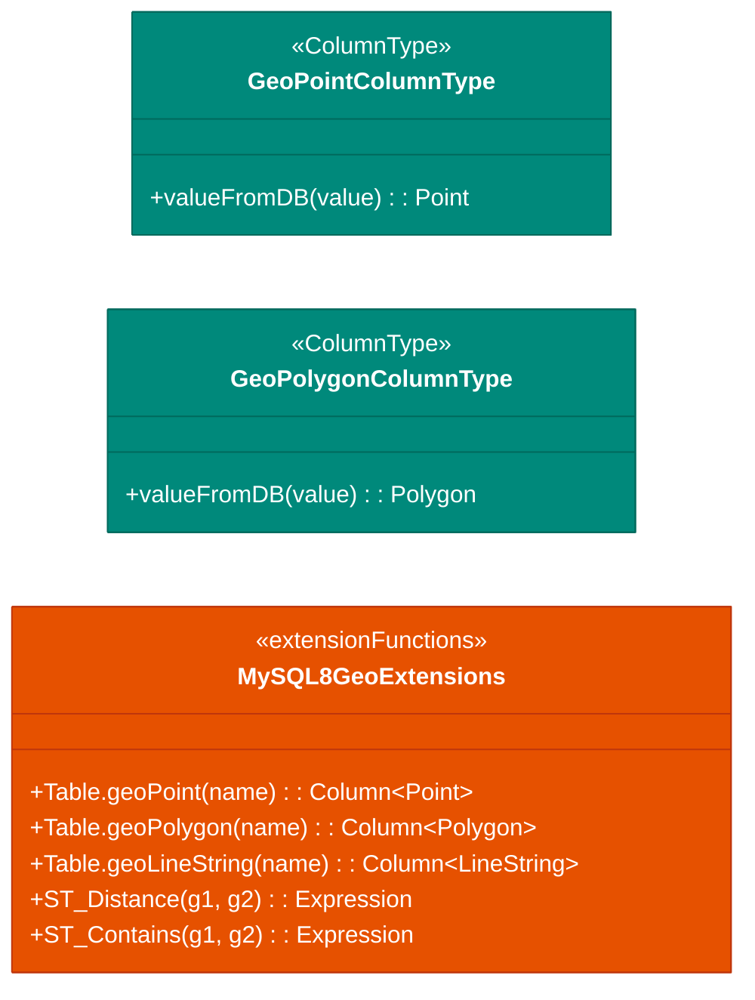

# Module bluetape4k-exposed-mysql8

English | [한국어](./README.ko.md)

A module that enables MySQL 8.0+ spatial data (GIS) in JetBrains Exposed ORM.

It supports 8 geometry types using JTS (Java Topology Suite) and provides spatial functions for distance calculation, spatial relationships (containment, intersection, etc.), and area/length measurements.

## UML

```mermaid
classDiagram
    class GeometryColumnType {
        <<base>>
    }
    class GeoPointColumnType
    class GeoLineStringColumnType
    class GeoPolygonColumnType
    class GeoMultiPointColumnType
    class GeoMultiLineStringColumnType
    class GeoMultiPolygonColumnType
    class GeoGeometryCollectionColumnType
    class GeoGeometryColumnType

    GeometryColumnType <|-- GeoPointColumnType
    GeometryColumnType <|-- GeoLineStringColumnType
    GeometryColumnType <|-- GeoPolygonColumnType
    GeometryColumnType <|-- GeoMultiPointColumnType
    GeometryColumnType <|-- GeoMultiLineStringColumnType
    GeometryColumnType <|-- GeoMultiPolygonColumnType
    GeometryColumnType <|-- GeoGeometryCollectionColumnType
    GeometryColumnType <|-- GeoGeometryColumnType

    style GeometryColumnType fill:#1565C0,stroke:#0D47A1,color:#FFFFFF
    style GeoPointColumnType fill:#00897B,stroke:#00695C,color:#FFFFFF
    style GeoLineStringColumnType fill:#00897B,stroke:#00695C,color:#FFFFFF
    style GeoPolygonColumnType fill:#00897B,stroke:#00695C,color:#FFFFFF
    style GeoMultiPointColumnType fill:#00897B,stroke:#00695C,color:#FFFFFF
    style GeoMultiLineStringColumnType fill:#00897B,stroke:#00695C,color:#FFFFFF
    style GeoMultiPolygonColumnType fill:#00897B,stroke:#00695C,color:#FFFFFF
    style GeoGeometryCollectionColumnType fill:#00897B,stroke:#00695C,color:#FFFFFF
    style GeoGeometryColumnType fill:#00897B,stroke:#00695C,color:#FFFFFF
```



## Extension Function Diagram



## Overview

- **Geometry types
  **: Point, LineString, Polygon, MultiPoint, MultiLineString, MultiPolygon, GeometryCollection, Geometry (generic)
- **Coordinate system**: WGS84 (SRID 4326) by default
- **Spatial functions**: 9 relationship functions + 4 measurement functions + 3 property functions
- **MySQL only**: Works exclusively with `MysqlDialect`
- **Serialization path**:
    - PreparedStatement binding uses MySQL Internal Format (`4-byte SRID LE + WKB`)
    - SQL literal path uses `ST_GeomFromWKB(..., srid, 'axis-order=long-lat')`

## Supported Geometry Types

| Type               | JTS Class            | Description               |
|--------------------|----------------------|---------------------------|
| POINT              | `Point`              | Single coordinate         |
| LINESTRING         | `LineString`         | Line segment              |
| POLYGON            | `Polygon`            | Closed area               |
| MULTIPOINT         | `MultiPoint`         | Multiple points           |
| MULTILINESTRING    | `MultiLineString`    | Multiple line segments    |
| MULTIPOLYGON       | `MultiPolygon`       | Multiple closed areas     |
| GEOMETRYCOLLECTION | `GeometryCollection` | Mixed geometry collection |
| GEOMETRY           | `Geometry`           | Generic (any type)        |

## Table Extension Functions

```kotlin
object Locations : LongIdTable("locations") {
    val name = varchar("name", 255)
    val point = geoPoint("point")                    // POINT
    val line = geoLineString("line")                 // LINESTRING
    val area = geoPolygon("area")                    // POLYGON
    val multiPoint = geoMultiPoint("multi_point")   // MULTIPOINT
    val path = geoMultiLineString("path")           // MULTILINESTRING
    val zones = geoMultiPolygon("zones")            // MULTIPOLYGON
    val collection = geoGeometryCollection("coll")  // GEOMETRYCOLLECTION
    val geom = geoGeometry("geom")                  // GEOMETRY (generic)
}
```

All extension functions use SRID 4326 (WGS84) by default. You can specify a different SRID as the second argument.

```kotlin
val point = geoPoint("location", srid = 3857)  // Web Mercator
```

## WGS84 Coordinate Helpers

**Coordinate order convention**: longitude (X-axis) first, latitude (Y-axis) second

```kotlin
// Point
val seoul = wgs84Point(lng = 126.9780, lat = 37.5665)
val busan = wgs84Point(lng = 129.0756, lat = 35.1796)

// Polygon (auto-closed — first coordinate equals last coordinate)
val korea = wgs84Polygon(
    126.0 to 37.0,
    129.0 to 37.0,
    129.0 to 33.0,
    126.0 to 33.0,
    126.0 to 37.0  // or auto-closed
)

// Rectangular Polygon
val area = wgs84Rectangle(
    minLng = 126.0, minLat = 37.0,
    maxLng = 128.0, maxLat = 38.0
)

// LineString
val route = wgs84LineString(
    126.9780 to 37.5665,  // Seoul
    127.1086 to 37.2171,  // Gyeonggi
    127.1086 to 36.4405   // Chungcheong
)

// MultiPoint, MultiLineString, MultiPolygon
val points = wgs84MultiPoint(seoul, busan)
val lines = wgs84MultiLineString(route1, route2)
val areas = wgs84MultiPolygon(area1, area2)
```

## Spatial Relationship Functions

Nine spatial predicate functions are provided. All return `Op<Boolean>` and can be used in WHERE clauses.

```kotlin
// ST_Contains — Does A fully contain B?
Locations.selectAll()
    .where { Locations.area.stContains(Locations.point) }
    .toList()

// ST_Within — Is A inside B?
Locations.selectAll()
    .where { Locations.point.stWithin(Locations.area) }
    .toList()

// ST_Intersects — Do A and B intersect? (includes containment)
Locations.selectAll()
    .where { Locations.area.stIntersects(otherGeom) }
    .toList()

// ST_Disjoint — Are A and B completely separate?
Locations.selectAll()
    .where { Locations.point.stDisjoint(otherPoint) }
    .toList()

// ST_Overlaps — Do A and B partially overlap? (excludes full containment)
Locations.selectAll()
    .where { Locations.area.stOverlaps(otherArea) }
    .toList()

// ST_Touches — Do A and B touch only at their boundaries?
Locations.selectAll()
    .where { Locations.line.stTouches(otherLine) }
    .toList()

// ST_Crosses — Does A cross B? (e.g., a line crossing a polygon)
Locations.selectAll()
    .where { Locations.line.stCrosses(otherLine) }
    .toList()

// ST_Equals — Are A and B geometrically equal?
Locations.selectAll()
    .where { Locations.point.stEquals(otherPoint) }
    .toList()

// ST_DWithin — Is A within distance (meters) of B?
Locations.selectAll()
    .where { Locations.point.stDWithin(otherPoint, distance = 5_000.0) }
    .toList()
```

## Spatial Measurement Functions

Functions for computing distances, lengths, and areas. All return `Expression<Double>`.

```kotlin
// ST_Distance — Planar distance between two geometries (meters, SRID 4326)
val distExpr = Locations.point1.stDistance(Locations.point2)
val distance = Locations.select(distExpr).single()[distExpr]  // Double

// ST_Distance_Sphere — Spherical distance (meters, accounts for Earth's curvature)
val distSpherExpr = Locations.point1.stDistanceSphere(Locations.point2)
val distSphere = Locations.select(distSpherExpr).single()[distSpherExpr]  // Double

// ST_Length — Length of a LineString or MultiLineString (meters)
val lengthExpr = Locations.line.stLength()
val length = Locations.select(lengthExpr).single()[lengthExpr]  // Double

// ST_Area — Area of a Polygon or MultiPolygon (square meters)
val areaExpr = Locations.area.stArea()
val area = Locations.select(areaExpr).single()[areaExpr]  // Double
```

## Spatial Property Functions

Functions that return geometry metadata.

```kotlin
// ST_AsText — WKT (Well-Known Text) string
val textExpr = Locations.point.stAsText()
val text = Locations.select(textExpr).single()[textExpr]  // e.g. "POINT(126.978 37.5665)"

// ST_SRID — Returns the SRID value
val sridExpr = Locations.point.stSrid()
val srid = Locations.select(sridExpr).single()[sridExpr]  // e.g. 4326

// ST_GeometryType — Returns the geometry type name
val typeExpr = Locations.point.stGeometryType()
val typeName = Locations.select(typeExpr).single()[typeExpr]  // e.g. "POINT"
```

## Usage Examples

### Basic CRUD

```kotlin
transaction(db) {
    // Create
    Locations.insert {
        it[name] = "Seoul"
        it[point] = wgs84Point(lng = 126.9780, lat = 37.5665)
        it[area] = wgs84Rectangle(126.0, 37.0, 127.5, 38.0)
    }

    // Read
    Locations.selectAll()
        .where { Locations.name eq "Seoul" }
        .singleOrNull()

    // Update
    Locations.update({ Locations.name eq "Seoul" }) {
        it[point] = wgs84Point(126.9780, 37.5665)
    }

    // Delete
    Locations.deleteWhere { name eq "Seoul" }
}
```

### Filtering by Spatial Condition

```kotlin
transaction(db) {
    val zone = wgs84Rectangle(126.0, 37.0, 127.0, 38.0)

    // Find all points within the zone
    val pointsInZone = Locations.selectAll()
        .where { Locations.point.stWithin(zone) }
        .toList()

    // Find all areas overlapping the zone
    val overlappingAreas = Locations.selectAll()
        .where { Locations.area.stIntersects(zone) }
        .toList()
}
```

### Distance-Based Search

```kotlin
transaction(db) {
    val myLocation = wgs84Point(126.9780, 37.5665)

    // Places within 5km of my location
    val nearby = Locations.selectAll()
        .where { Locations.point.stDWithin(myLocation, distance = 5_000.0) }
        .toList()
}
```

### Sorting by Distance

```kotlin
transaction(db) {
    val myLocation = wgs84Point(126.9780, 37.5665)
    val distExpr = Locations.point.stDistance(myLocation)

    // Sort by distance
    val sorted = Locations.select(Locations.id, Locations.name, distExpr)
        .orderBy(distExpr to SortOrder.ASC)
        .toList()

    sorted.forEach { row ->
        val distance = row[distExpr]
        println("Place: ${row[Locations.name]}, Distance: ${distance.toInt()}m")
    }
}
```

### Area Calculation

```kotlin
transaction(db) {
    val areas = Locations.select(Locations.name, Locations.area.stArea())
        .map { row ->
            val areaValue = row[Locations.area.stArea()]  // m²
            Pair(row[Locations.name], areaValue / 1_000_000)  // Convert to km²
        }
}
```

## Table Declaration Notes

Tables with geometry columns **must only be instantiated inside a transaction**.

```kotlin
// ❌ Prohibited — cannot use object declaration (dialect check runs at instantiation time)
object Locations : LongIdTable("locations") {
    val point = geoPoint("point")  // IllegalStateException!
}

// ✅ Correct — declare as a class and instantiate inside a transaction
class Locations : LongIdTable("locations") {
    val point = geoPoint("point")
}

transaction(db) {
    val table = Locations()
    SchemaUtils.create(table)
    // use...
}
```

## Technical Requirements

| Item         | Version                            |
|--------------|------------------------------------|
| **MySQL**    | 8.0+ (Testcontainers: `mysql:8.0`) |
| **JTS Core** | 1.20.0 or later                    |
| **Exposed**  | v1 (JetBrains)                     |
| **SRID**     | 4326 (WGS84, default)              |

## Dependency

```kotlin
testImplementation(project(":bluetape4k-exposed-mysql8"))
```

Dependencies provided by this module:

- `org.jetbrains.exposed:exposed-core`
- `org.jetbrains.exposed:exposed-dao`
- `org.jetbrains.exposed:exposed-jdbc`
- `org.locationtech.jts:jts-core`

## Notes

### MySQL Dialect Only

All extension functions work exclusively with `MysqlDialect`. Calling them with any other DBMS will throw an
`IllegalStateException`.

```kotlin
// Cannot use with PostgreSQL or other databases
val point = geoPoint("location")  // IllegalStateException: geoPoint is only supported with MySQL dialect
```

### Unsupported Functions

Some MySQL spatial functions such as `ST_Centroid()` and `ST_Envelope()` throw
`ER_NOT_IMPLEMENTED_FOR_GEOGRAPHIC_SRS` when used with a geographic SRID (4326). This module does not expose those functions.

### Coordinate Order

WGS84 (SRID 4326) uses **longitude-latitude** axis order. All helper functions follow this convention.

```kotlin
// ✅ Correct
wgs84Point(lng = 126.9780, lat = 37.5665)

// ❌ Wrong (swapping latitude and longitude cannot be corrected automatically)
wgs84Point(lng = 37.5665, lat = 126.9780)
```

## Test Pattern

Tests use Testcontainers to automatically start MySQL 8.0.

```kotlin
abstract class AbstractMySqlGisTest : AbstractExposedTest() {
    companion object : KLogging() {
        @JvmStatic
        val mysqlContainer: MySQLContainer<*> = MySQLContainer(
            DockerImageName.parse("mysql:8.0")
        ).apply { start() }

        @JvmStatic
        val db: Database by lazy {
            Database.connect(
                url = mysqlContainer.jdbcUrl + "?allowPublicKeyRetrieval=true&useSSL=false",
                driver = "com.mysql.cj.jdbc.Driver",
                user = mysqlContainer.username,
                password = mysqlContainer.password,
            )
        }
    }

    protected fun withGeoTables(vararg tables: Table, statement: () -> Unit) {
        transaction(db) {
            runCatching { SchemaUtils.drop(*tables) }
            SchemaUtils.create(*tables)
        }
        try {
            transaction(db) { statement() }
        } finally {
            transaction(db) {
                runCatching { SchemaUtils.drop(*tables) }
            }
        }
    }
}
```

Core regression tests:

```bash
./gradlew :bluetape4k-exposed-mysql8:test --tests "io.bluetape4k.exposed.mysql8.gis.GeometryColumnTypeTest"
./gradlew :bluetape4k-exposed-mysql8:test --tests "io.bluetape4k.exposed.mysql8.gis.MySqlWkbUtilsTest"
```

## References

- [JTS Topology Suite](https://github.com/locationtech/jts)
- [MySQL GIS Functions](https://dev.mysql.com/doc/refman/8.0/en/spatial-function-reference.html)
- [WGS84 / SRID 4326](https://en.wikipedia.org/wiki/Web_Mercator_projection#EPSG:4326)
