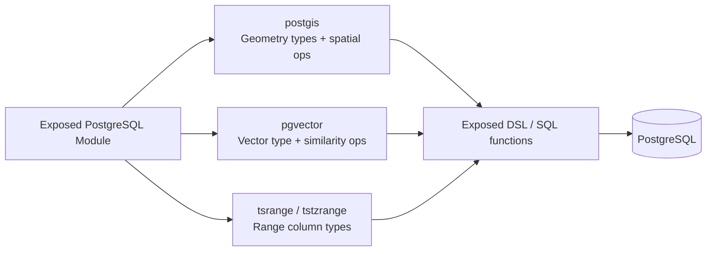

# bluetape4k-exposed-postgresql

PostgreSQL 전용 Kotlin Exposed 확장 모듈입니다. PostGIS 공간 데이터, pgvector 벡터 검색, TSTZRANGE 시간 범위 컬럼 타입을 제공합니다.

## UML



## 주요 기능

### 1. PostGIS - 공간 데이터

공간 정보(지도, 위치 기반 검색 등)를 저장하고 조회합니다.

**패키지**: `io.bluetape4k.exposed.postgresql.postgis`

**의존성**: `net.postgis:postgis-jdbc:2024.1.0` (런타임에 추가 필요)

#### 컬럼 타입

- `GeoPointColumnType`: POINT 좌표 저장 (SRID 4326 WGS 84)
- `GeoPolygonColumnType`: POLYGON 영역 저장 (SRID 4326 WGS 84)

#### 사용 예제

```kotlin
import io.bluetape4k.exposed.postgresql.postgis.*
import net.postgis.jdbc.geometry.Point
import net.postgis.jdbc.geometry.Polygon
import org.jetbrains.exposed.v1.core.Table

object LocationTable : Table("locations") {
    val id = integer("id").primaryKey()
    val name = varchar("name", 100)
    val point = geoPoint("point")        // POINT 컬럼
    val area = geoPolygon("area")        // POLYGON 컬럼
}
```

#### 공간 연산

쿼리에서 거리 계산, 포함 관계 확인 등을 수행합니다.

```kotlin
transaction {
    // 두 지점 간 거리 계산 (도 단위, WGS84 기준)
    LocationTable
        .select(LocationTable.name, LocationTable.point.stDistance(otherPoint))
        .toList()

    // 특정 거리 이내의 지점 검색 (0.5도 이내)
    LocationTable
        .select(LocationTable.name)
        .where(LocationTable.point.stDWithin(searchPoint, 0.5))
        .toList()

    // 지점이 영역 내에 있는지 확인
    LocationTable
        .select(LocationTable.name)
        .where(LocationTable.point.stWithin(polygonArea))
        .toList()

    // 영역이 다른 영역을 포함하는지 확인
    LocationTable
        .select(LocationTable.name)
        .where(LocationTable.area.stContains(otherArea))
        .toList()

    // 두 영역이 겹치는지 확인
    if (area1.stOverlaps(area2)) { /* ... */ }

    // 두 영역이 교차하는지 확인
    if (area1.stIntersects(area2)) { /* ... */ }

    // 두 영역이 분리되어 있는지 확인
    if (area1.stDisjoint(area2)) { /* ... */ }

    // 영역의 넓이 계산 (degree² 단위)
    LocationTable
        .select(LocationTable.name, LocationTable.area.stArea())
        .toList()
}
```

**지원하는 공간 함수:**
- `ST_Distance(point, point)`: 두 지점 간 거리
- `ST_DWithin(point, point, distance)`: 거리 이내 확인
- `ST_Within(point, polygon)`: 지점이 영역 내에 있는지 확인
- `ST_Contains(polygon, polygon)`: 한 영역이 다른 영역을 포함하는지 확인
- `ST_Contains(polygon, point)`: 영역이 지점을 포함하는지 확인
- `ST_Overlaps(polygon, polygon)`: 두 영역이 부분적으로 겹치는지 확인 (포함 관계 제외)
- `ST_Intersects(polygon, polygon)`: 두 영역이 교차하는지 확인 (포함/겹침 포함)
- `ST_Disjoint(polygon, polygon)`: 두 영역이 완전히 분리되어 있는지 확인
- `ST_Area(polygon)`: 영역의 넓이 반환

---

### 2. pgvector - 벡터 검색

머신러닝 기반 유사도 검색을 위한 벡터 저장 및 거리 연산입니다.

**패키지**: `io.bluetape4k.exposed.postgresql.pgvector`

**의존성**: `com.pgvector:pgvector:0.1.6` (런타임에 추가 필요)

#### 컬럼 타입

- `VectorColumnType(dimension)`: VECTOR(n) 타입으로 FloatArray 저장

#### 사용 예제

```kotlin
import io.bluetape4k.exposed.postgresql.pgvector.*
import org.jetbrains.exposed.v1.core.Table
import org.jetbrains.exposed.v1.jdbc.transactions.transaction

object DocumentTable : Table("documents") {
    val id = integer("id").primaryKey()
    val title = varchar("title", 200)
    val embedding = vector("embedding", 384)  // 384차원 벡터
}

transaction {
    // pgvector JDBC 타입 등록 (연결 후 1회만 필요)
    connection.registerVectorType()

    // 벡터 저장
    DocumentTable.insert {
        it[title] = "Document 1"
        it[embedding] = FloatArray(384) { Random.nextFloat() }
    }

    // 코사인 거리 검색 (유사도 순서)
    val queryVector = FloatArray(384) { ... }
    DocumentTable
        .select(DocumentTable.title)
        .orderBy(DocumentTable.embedding.cosineDistance(queryVector))
        .limit(10)
        .toList()

    // L2 유클리드 거리로 검색
    DocumentTable
        .select(DocumentTable.title)
        .orderBy(DocumentTable.embedding.l2Distance(queryVector))
        .limit(10)
        .toList()

    // 내적으로 검색
    DocumentTable
        .select(DocumentTable.title)
        .orderBy(DocumentTable.embedding.innerProduct(queryVector))
        .limit(10)
        .toList()
}
```

**거리 연산자:**
- `cosineDistance(<=>)`: 코사인 거리 (정규화된 벡터에 최적)
- `l2Distance(<->)`: L2 유클리드 거리
- `innerProduct(<#>)`: 내적 거리

---

### 3. TSTZRANGE - 시간 범위

PostgreSQL의 시간 범위 타입을 Kotlin Instant 기반으로 지원합니다. 타임존 정보를 보존하며 H2 데이터베이스에서는 VARCHAR fallback을 지원합니다.

**패키지**: `io.bluetape4k.exposed.postgresql.tsrange`

#### 값 객체

- `TimestampRange`: 범위의 시작/종료 시각 및 경계 포함 여부 표현

```kotlin
data class TimestampRange(
    val start: Instant,
    val end: Instant,
    val lowerInclusive: Boolean = true,   // [start
    val upperInclusive: Boolean = false,  // end)
)
```

#### 컬럼 타입

- `TstzRangeColumnType`: TSTZRANGE (PostgreSQL) 또는 VARCHAR(120) (H2 등)으로 저장
  - PostgreSQL JDBC literal과 ISO-8601 literal 모두 파싱
  - fractional seconds (`2024-01-01 00:00:00.123456+00`)도 지원

#### 사용 예제

```kotlin
import io.bluetape4k.exposed.postgresql.tsrange.*
import java.time.Instant
import org.jetbrains.exposed.v1.core.Table

object EventTable : Table("events") {
    val id = integer("id").primaryKey()
    val name = varchar("name", 100)
    val duration = tstzRange("duration")  // [start, end) 시간 범위
}

transaction {
    val now = Instant.now()
    val oneHourLater = now.plusSeconds(3600)

    // 범위 저장: [now, oneHourLater) (하한 포함, 상한 미포함)
    EventTable.insert {
        it[name] = "Meeting"
        it[duration] = TimestampRange(now, oneHourLater)
    }

    // 범위에 특정 시각이 포함되는지 확인
    val checkTime = now.plusSeconds(1800)  // 30분 후
    EventTable
        .select(EventTable.name)
        .where(EventTable.duration.contains(checkTime))
        .toList()

    // 두 범위가 겹치는지 확인 (&&)
    EventTable
        .select(EventTable.name)
        .where(
            EventTable.duration.overlaps(
                TimestampRange(oneHourLater, oneHourLater.plusSeconds(3600))
            )
        )
        .toList()

    // 한 범위가 다른 범위를 완전히 포함하는지 확인
    EventTable
        .select(EventTable.name)
        .where(
            EventTable.duration.containsRange(
                TimestampRange(now.plusSeconds(600), now.plusSeconds(1200))
            )
        )
        .toList()

    // 두 범위가 인접한지 확인 (-|-)
    EventTable
        .select(EventTable.name)
        .where(
            EventTable.duration.isAdjacentTo(
                TimestampRange(oneHourLater, oneHourLater.plusSeconds(3600))
            )
        )
        .toList()
}
```

**범위 연산:**
- `overlaps(&&)`: 두 범위가 겹치는지 확인
- `contains()`: 범위가 특정 시각을 포함하는지 확인
- `containsRange()`: 범위가 다른 범위를 완전히 포함하는지 확인
- `isAdjacentTo()`: 두 범위가 인접한지 확인

**범위 표현:**
- `[start, end)`: 하한 포함, 상한 미포함 (기본값)
- `[start, end]`: 양쪽 포함
- `(start, end)`: 양쪽 미포함
- `(start, end]`: 하한 미포함, 상한 포함

---

## 의존성 추가

프로젝트의 `build.gradle.kts`에 다음을 추가합니다:

```kotlin
dependencies {
    implementation("io.github.bluetape4k:bluetape4k-exposed-postgresql:1.5.0-SNAPSHOT")

    // 필요한 기능별로 런타임 의존성 추가
    runtimeOnly("net.postgis:postgis-jdbc:2024.1.0")      // PostGIS 사용 시
    runtimeOnly("com.pgvector:pgvector:0.1.6")            // pgvector 사용 시
}
```

테스트에서 컨테이너를 사용할 경우:

```kotlin
testImplementation("io.github.bluetape4k:bluetape4k-testcontainers:${version}")
```

## 테스트 컨테이너 사용

`bluetape4k-testcontainers` 모듈의 `PostgisServer` / `PgvectorServer`를 사용하면 `CREATE EXTENSION` 없이도 확장이 자동으로 활성화됩니다.

```kotlin
// PostGIS — postgis 확장 자동 활성화
val db = Database.connect(
    url = PostgisServer.Launcher.postgis.jdbcUrl,
    driver = "org.postgresql.Driver",
    user = PostgisServer.Launcher.postgis.username!!,
    password = PostgisServer.Launcher.postgis.password!!,
)

// pgvector — vector 확장 자동 활성화 (JDBC 타입 등록은 별도 필요)
val pgvector = PgvectorServer.Launcher.pgvector
val db = Database.connect(url = pgvector.jdbcUrl, ...).also {
    transaction(it) {
        PGvector.addVectorType(connection.connection as java.sql.Connection)
    }
}

// 추가 확장이 필요한 경우
val server = PostgisServer.Launcher.withExtensions("postgis_topology")
val server = PgvectorServer.Launcher.withExtensions("pg_trgm")
```

## 주의사항

- **PostgreSQL 전용**: 모든 기능이 PostgreSQL dialect에서만 동작합니다. H2 등 다른 DB에서는 오류가 발생합니다. TSTZRANGE만 H2에서 VARCHAR fallback으로 작동합니다.
- **PostGIS 확장**: `PostgisServer` 사용 시 `postgis` 확장이 자동으로 활성화됩니다. 직접 서버에 연결하는 경우 `CREATE EXTENSION IF NOT EXISTS postgis` 실행이 필요합니다.
- **pgvector 확장**: `PgvectorServer` 사용 시 `vector` 확장이 자동으로 활성화됩니다. 단, JDBC 드라이버 타입 등록(`PGvector.addVectorType()`)은 연결마다 별도로 필요합니다.
- **차원 검증**: pgvector 저장 시 벡터 차원이 컬럼 정의와 일치하지 않으면 오류가 발생합니다.

---

## 참고 자료

- [PostGIS 공식 문서](https://postgis.net/docs/)
- [pgvector GitHub](https://github.com/pgvector/pgvector)
- [PostgreSQL Range Types](https://www.postgresql.org/docs/current/rangetypes.html)
