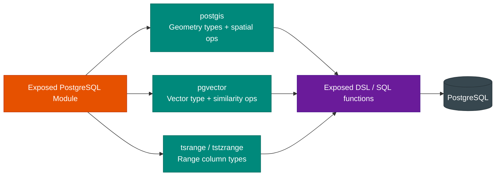
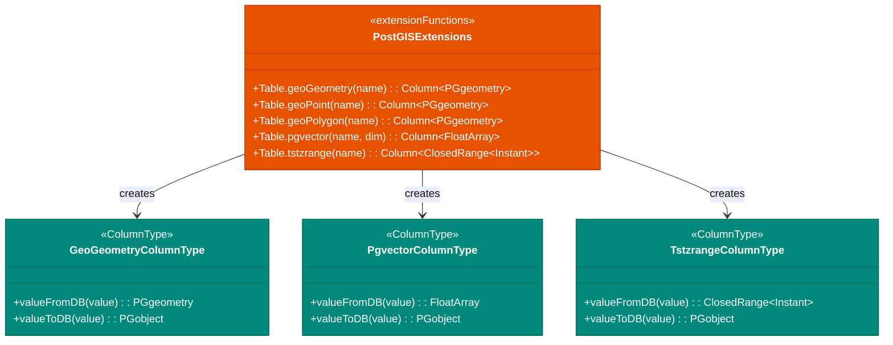

# bluetape4k-exposed-postgresql

English | [한국어](./README.ko.md)

A Kotlin Exposed extension module for PostgreSQL. Provides PostGIS spatial data, pgvector similarity search, and TSTZRANGE time-range column types.

## UML



## Column Type Diagram



## Features

### 1. PostGIS - Spatial Data

Store and query spatial information such as maps and location-based searches.

**Package**: `io.bluetape4k.exposed.postgresql.postgis`

**Dependency**: `net.postgis:postgis-jdbc:2024.1.0` (must be added as a runtime dependency)

#### Column Types

- `GeoPointColumnType`: Stores POINT coordinates (SRID 4326 WGS 84)
- `GeoPolygonColumnType`: Stores POLYGON areas (SRID 4326 WGS 84)

#### Usage Example

```kotlin
import io.bluetape4k.exposed.postgresql.postgis.*
import net.postgis.jdbc.geometry.Point
import net.postgis.jdbc.geometry.Polygon
import org.jetbrains.exposed.v1.core.Table

object LocationTable : Table("locations") {
    val id = integer("id").primaryKey()
    val name = varchar("name", 100)
    val point = geoPoint("point")        // POINT column
    val area = geoPolygon("area")        // POLYGON column
}
```

#### Spatial Operations

Perform distance calculations, containment checks, and more in queries.

```kotlin
transaction {
    // Distance between two points (in degrees, WGS84)
    LocationTable
        .select(LocationTable.name, LocationTable.point.stDistance(otherPoint))
        .toList()

    // Find points within a distance (within 0.5 degrees)
    LocationTable
        .select(LocationTable.name)
        .where(LocationTable.point.stDWithin(searchPoint, 0.5))
        .toList()

    // Check if a point is within a polygon
    LocationTable
        .select(LocationTable.name)
        .where(LocationTable.point.stWithin(polygonArea))
        .toList()

    // Check if a polygon contains another polygon
    LocationTable
        .select(LocationTable.name)
        .where(LocationTable.area.stContains(otherArea))
        .toList()

    // Check if two polygons overlap
    if (area1.stOverlaps(area2)) { /* ... */ }

    // Check if two polygons intersect
    if (area1.stIntersects(area2)) { /* ... */ }

    // Check if two polygons are completely separate
    if (area1.stDisjoint(area2)) { /* ... */ }

    // Calculate the area of a polygon (in degree²)
    LocationTable
        .select(LocationTable.name, LocationTable.area.stArea())
        .toList()
}
```

**Supported spatial functions:**

- `ST_Distance(point, point)`: Distance between two points
- `ST_DWithin(point, point, distance)`: Check if within a given distance
- `ST_Within(point, polygon)`: Check if a point is inside a polygon
- `ST_Contains(polygon, polygon)`: Check if one polygon contains another
- `ST_Contains(polygon, point)`: Check if a polygon contains a point
- `ST_Overlaps(polygon, polygon)`: Check if two polygons partially overlap (excludes containment)
- `ST_Intersects(polygon, polygon)`: Check if two polygons intersect (includes containment and overlap)
- `ST_Disjoint(polygon, polygon)`: Check if two polygons are completely disjoint
- `ST_Area(polygon)`: Return the area of a polygon

---

### 2. pgvector - Vector Search

Store vectors and compute distances for machine-learning-based similarity search.

**Package**: `io.bluetape4k.exposed.postgresql.pgvector`

**Dependency**: `com.pgvector:pgvector:0.1.6` (must be added as a runtime dependency)

#### Column Types

- `VectorColumnType(dimension)`: Stores a `FloatArray` as a VECTOR(n) column

#### Usage Example

```kotlin
import io.bluetape4k.exposed.postgresql.pgvector.*
import org.jetbrains.exposed.v1.core.Table
import org.jetbrains.exposed.v1.jdbc.transactions.transaction

object DocumentTable : Table("documents") {
    val id = integer("id").primaryKey()
    val title = varchar("title", 200)
    val embedding = vector("embedding", 384)  // 384-dimensional vector
}

transaction {
    // Register pgvector JDBC type (required once per connection)
    connection.registerVectorType()

    // Store a vector
    DocumentTable.insert {
        it[title] = "Document 1"
        it[embedding] = FloatArray(384) { Random.nextFloat() }
    }

    // Search by cosine distance (similarity order)
    val queryVector = FloatArray(384) { 0.0f }
    DocumentTable
        .select(DocumentTable.title)
        .orderBy(DocumentTable.embedding.cosineDistance(queryVector))
        .limit(10)
        .toList()

    // Search by L2 Euclidean distance
    DocumentTable
        .select(DocumentTable.title)
        .orderBy(DocumentTable.embedding.l2Distance(queryVector))
        .limit(10)
        .toList()

    // Search by inner product
    DocumentTable
        .select(DocumentTable.title)
        .orderBy(DocumentTable.embedding.innerProduct(queryVector))
        .limit(10)
        .toList()
}
```

**Distance operators:**

- `cosineDistance(<=>)`: Cosine distance (optimal for normalized vectors)
- `l2Distance(<->)`: L2 Euclidean distance
- `innerProduct(<#>)`: Inner product distance

---

### 3. TSTZRANGE - Time Ranges

Supports PostgreSQL time range types backed by Kotlin
`Instant`. Preserves timezone information and falls back to VARCHAR in H2.

**Package**: `io.bluetape4k.exposed.postgresql.tsrange`

#### Value Object

- `TimestampRange`: Represents a range with start/end instants and boundary inclusivity

```kotlin
data class TimestampRange(
    val start: Instant,
    val end: Instant,
    val lowerInclusive: Boolean = true,   // [start
    val upperInclusive: Boolean = false,  // end)
)
```

#### Column Type

- `TstzRangeColumnType`: Stored as TSTZRANGE (PostgreSQL) or VARCHAR(120) (H2 and others)
    - Parses both PostgreSQL JDBC literals and ISO-8601 literals
    - Supports fractional seconds (e.g., `2024-01-01 00:00:00.123456+00`)

#### Usage Example

```kotlin
import io.bluetape4k.exposed.postgresql.tsrange.*
import java.time.Instant
import org.jetbrains.exposed.v1.core.Table

object EventTable : Table("events") {
    val id = integer("id").primaryKey()
    val name = varchar("name", 100)
    val duration = tstzRange("duration")  // [start, end) time range
}

transaction {
    val now = Instant.now()
    val oneHourLater = now.plusSeconds(3600)

    // Store range: [now, oneHourLater) (lower inclusive, upper exclusive)
    EventTable.insert {
        it[name] = "Meeting"
        it[duration] = TimestampRange(now, oneHourLater)
    }

    // Check if a specific instant falls within the range
    val checkTime = now.plusSeconds(1800)  // 30 minutes later
    EventTable
        .select(EventTable.name)
        .where(EventTable.duration.contains(checkTime))
        .toList()

    // Check if two ranges overlap (&&)
    EventTable
        .select(EventTable.name)
        .where(
            EventTable.duration.overlaps(
                TimestampRange(oneHourLater, oneHourLater.plusSeconds(3600))
            )
        )
        .toList()

    // Check if a range fully contains another range
    EventTable
        .select(EventTable.name)
        .where(
            EventTable.duration.containsRange(
                TimestampRange(now.plusSeconds(600), now.plusSeconds(1200))
            )
        )
        .toList()

    // Check if two ranges are adjacent (-|-)
    EventTable
        .select(EventTable.name)
        .where(
            EventTable.duration.isAdjacentTo(
                TimestampRange(oneHourLater, oneHourLater.plusSeconds(3600))
            )
        )
        .toList()
}
```

**Range operations:**

- `overlaps(&&)`: Check if two ranges overlap
- `contains()`: Check if a range contains a specific instant
- `containsRange()`: Check if a range fully contains another range
- `isAdjacentTo()`: Check if two ranges are adjacent

**Range notation:**

- `[start, end)`: Lower inclusive, upper exclusive (default)
- `[start, end]`: Both bounds inclusive
- `(start, end)`: Both bounds exclusive
- `(start, end]`: Lower exclusive, upper inclusive

---

## Dependency

Add the following to your `build.gradle.kts`:

```kotlin
dependencies {
    implementation("io.github.bluetape4k:bluetape4k-exposed-postgresql:1.5.0-SNAPSHOT")

    // Add runtime dependencies for the features you need
    runtimeOnly("net.postgis:postgis-jdbc:2024.1.0")      // For PostGIS
    runtimeOnly("com.pgvector:pgvector:0.1.6")            // For pgvector
}
```

For container-based testing:

```kotlin
testImplementation("io.github.bluetape4k:bluetape4k-testcontainers:${version}")
```

## Using Test Containers

The `PostgisServer` / `PgvectorServer` from
`bluetape4k-testcontainers` automatically activates the required extensions without needing `CREATE EXTENSION`.

```kotlin
// PostGIS — postgis extension activated automatically
val db = Database.connect(
    url = PostgisServer.Launcher.postgis.jdbcUrl,
    driver = "org.postgresql.Driver",
    user = PostgisServer.Launcher.postgis.username!!,
    password = PostgisServer.Launcher.postgis.password!!,
)

// pgvector — vector extension activated automatically (JDBC type registration still required separately)
val pgvector = PgvectorServer.Launcher.pgvector
val db = Database.connect(url = pgvector.jdbcUrl).also {
    transaction(it) {
        PGvector.addVectorType(connection.connection as java.sql.Connection)
    }
}

// For additional extensions
val server = PostgisServer.Launcher.withExtensions("postgis_topology")
val server = PgvectorServer.Launcher.withExtensions("pg_trgm")
```

## Notes

- **PostgreSQL only
  **: All features work exclusively with the PostgreSQL dialect. Other databases such as H2 will throw errors. Only TSTZRANGE falls back to VARCHAR in H2.
- **PostGIS extension**: The `postgis` extension is activated automatically when using
  `PostgisServer`. For direct server connections, run `CREATE EXTENSION IF NOT EXISTS postgis` manually.
- **pgvector extension**: The `vector` extension is activated automatically when using
  `PgvectorServer`. However, JDBC driver type registration (
  `PGvector.addVectorType()`) must still be performed per connection.
- **Dimension validation
  **: Storing a vector with a dimension that does not match the column definition will result in an error.

---

## References

- [PostGIS Documentation](https://postgis.net/docs/)
- [pgvector GitHub](https://github.com/pgvector/pgvector)
- [PostgreSQL Range Types](https://www.postgresql.org/docs/current/rangetypes.html)
