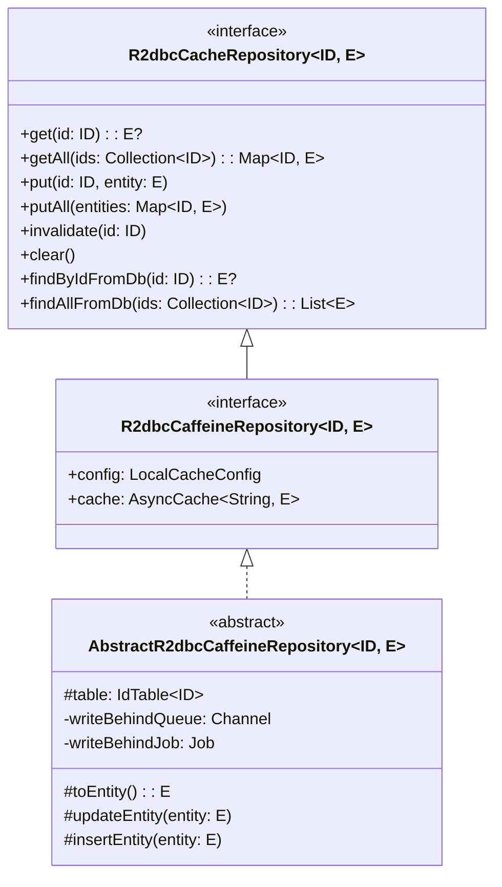
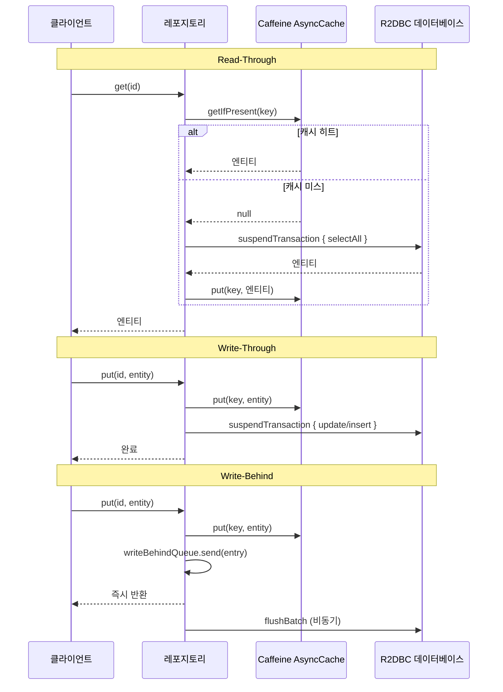

# bluetape4k-exposed-r2dbc-caffeine

[English](./README.md) | 한국어

Caffeine 로컬(인프로세스) 캐시를 사용하는 Exposed R2DBC 저장소입니다. JDBC 의존 없이 `exposed-cache` 모듈만 참조합니다.

> **참고**: [exposed-cache — 전체 모듈 생태계 및 인터페이스 계층 구조](../exposed-cache/README.ko.md)

## 아키텍처





## 주요 기능

- **Read-Through**: 캐시 미스 시 R2DBC `suspendTransaction`으로 DB 로드, 결과를 Caffeine에 캐싱
- **Write-Through**: `put()` 호출 시 Caffeine과 DB를 동기적으로 갱신
- **Write-Behind**: `put()` 호출 시 Caffeine은 즉시 갱신, DB 쓰기는 `Channel`을 통해 비동기 배치 처리
- **JDBC 무의존**: 순수 R2DBC + `exposed-cache` 인터페이스만 사용
- **Caffeine AsyncCache**: `CompletableFuture` 기반 논블로킹 캐시
- **코루틴 네이티브**: 모든 DB 작업이 `suspendTransaction` 사용

## 사용 예시

```kotlin
class ActorRepository(
    config: LocalCacheConfig = LocalCacheConfig.WRITE_THROUGH,
) : AbstractR2dbcCaffeineRepository<Long, ActorRecord>(config) {

    override val table = ActorTable

    override suspend fun ResultRow.toEntity() = toActorRecord()

    override fun UpdateStatement.updateEntity(entity: ActorRecord) {
        this[ActorTable.firstName] = entity.firstName
        this[ActorTable.lastName] = entity.lastName
        this[ActorTable.email] = entity.email
    }

    override fun BatchInsertStatement.insertEntity(entity: ActorRecord) {
        this[ActorTable.firstName] = entity.firstName
        this[ActorTable.lastName] = entity.lastName
        this[ActorTable.email] = entity.email
    }

    override fun extractId(entity: ActorRecord) = entity.id
}

// Read-Through (캐시 미스 → DB 로드)
val actor = repository.get(1L)

// Write-Through (캐시 + DB 동기 반영)
repository.put(1L, updatedActor)

// Write-Behind (캐시 즉시, DB 비동기 배치)
val behindConfig = LocalCacheConfig(writeMode = CacheWriteMode.WRITE_BEHIND)
val behindRepo = ActorRepository(behindConfig)
behindRepo.put(1L, updatedActor)  // 즉시 반환
```

## 의존성

| 의존성 | 용도 |
|---|---|
| `bluetape4k-exposed-r2dbc` | Exposed R2DBC 트랜잭션 지원 |
| `bluetape4k-exposed-cache` | `R2dbcCacheRepository`, `LocalCacheConfig`, `CacheMode` |
| `bluetape4k-coroutines` | 코루틴 유틸리티 |
| `com.github.ben-manes.caffeine:caffeine` | 인프로세스 비동기 캐시 |
