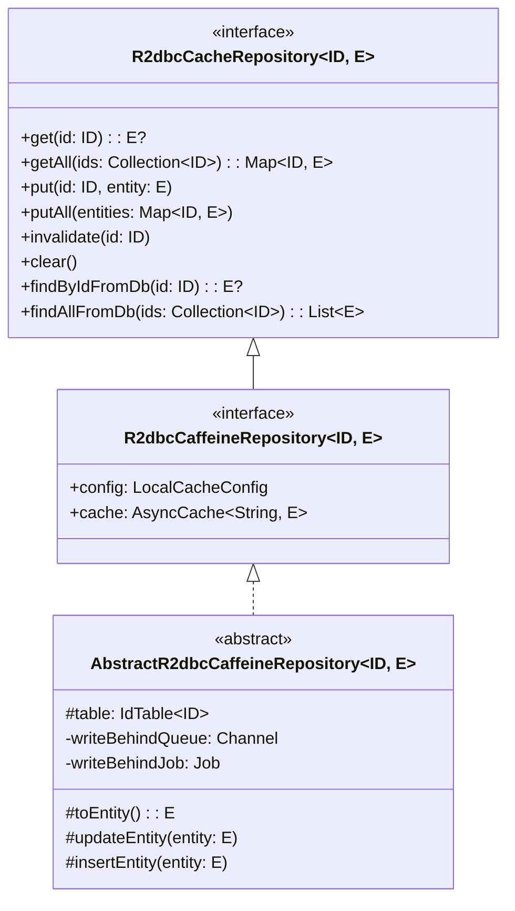
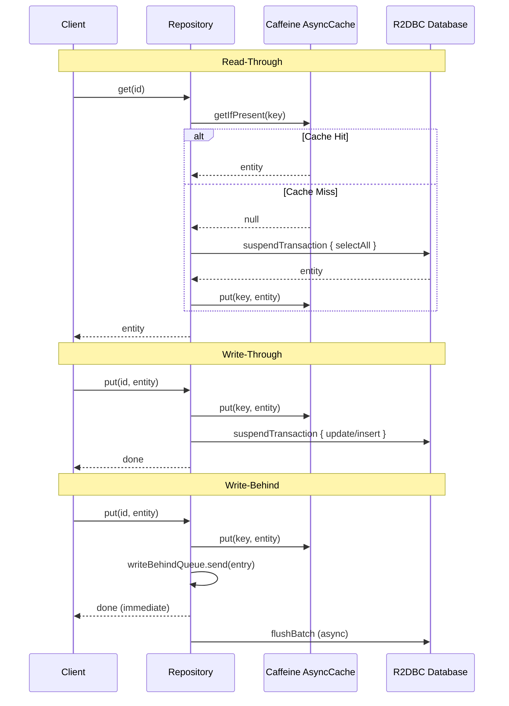

# bluetape4k-exposed-r2dbc-caffeine

Exposed R2DBC repository with Caffeine local (in-process) cache. No JDBC dependency -- only `exposed-cache` is referenced.

## Architecture





## Features

- **Read-Through**: Cache miss triggers DB load via R2DBC `suspendTransaction`, result cached in Caffeine
- **Write-Through**: `put()` updates both Caffeine and DB synchronously
- **Write-Behind**: `put()` updates Caffeine immediately, DB write is batched asynchronously via `Channel`
- **No JDBC dependency**: Pure R2DBC with `exposed-cache` interfaces only
- **Caffeine AsyncCache**: Non-blocking cache backed by `CompletableFuture`
- **Coroutine-native**: All DB operations use `suspendTransaction`

## Usage

```kotlin
class ActorRepository(
    config: LocalCacheConfig = LocalCacheConfig.WRITE_THROUGH,
) : AbstractR2dbcCaffeineRepository<Long, ActorRecord>(config) {

    override val table = ActorTable

    override suspend fun ResultRow.toEntity() = toActorRecord()

    override fun UpdateStatement.updateEntity(entity: ActorRecord) {
        this[ActorTable.firstName] = entity.firstName
        this[ActorTable.lastName] = entity.lastName
        this[ActorTable.email] = entity.email
    }

    override fun BatchInsertStatement.insertEntity(entity: ActorRecord) {
        this[ActorTable.firstName] = entity.firstName
        this[ActorTable.lastName] = entity.lastName
        this[ActorTable.email] = entity.email
    }

    override fun extractId(entity: ActorRecord) = entity.id
}

// Read-Through (cache miss -> DB load)
val actor = repository.get(1L)

// Write-Through (cache + DB)
repository.put(1L, updatedActor)

// Write-Behind (cache immediate, DB async batch)
val behindConfig = LocalCacheConfig(writeMode = CacheWriteMode.WRITE_BEHIND)
val behindRepo = ActorRepository(behindConfig)
behindRepo.put(1L, updatedActor)  // returns immediately
```

## Dependencies

| Dependency | Purpose |
|---|---|
| `bluetape4k-exposed-r2dbc` | Exposed R2DBC transaction support |
| `bluetape4k-exposed-cache` | `R2dbcCacheRepository`, `LocalCacheConfig`, `CacheMode` |
| `bluetape4k-coroutines` | Coroutines utilities |
| `com.github.ben-manes.caffeine:caffeine` | In-process async cache |
