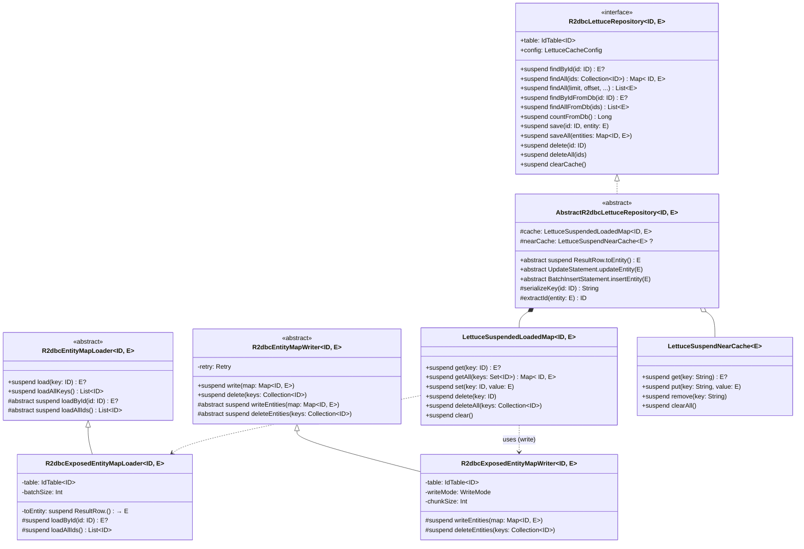
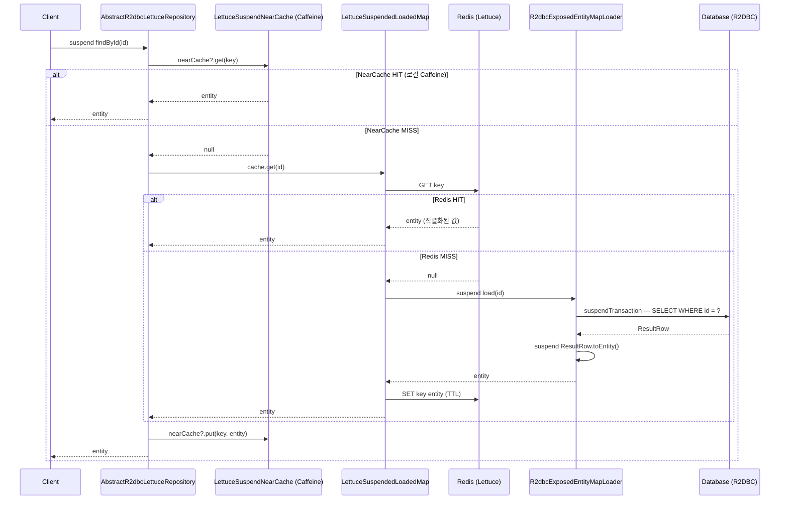
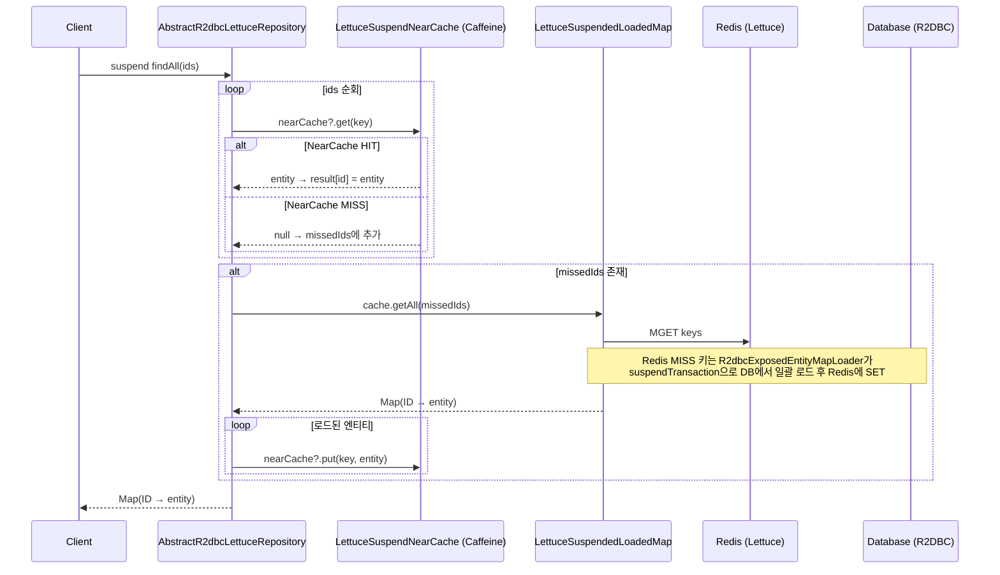
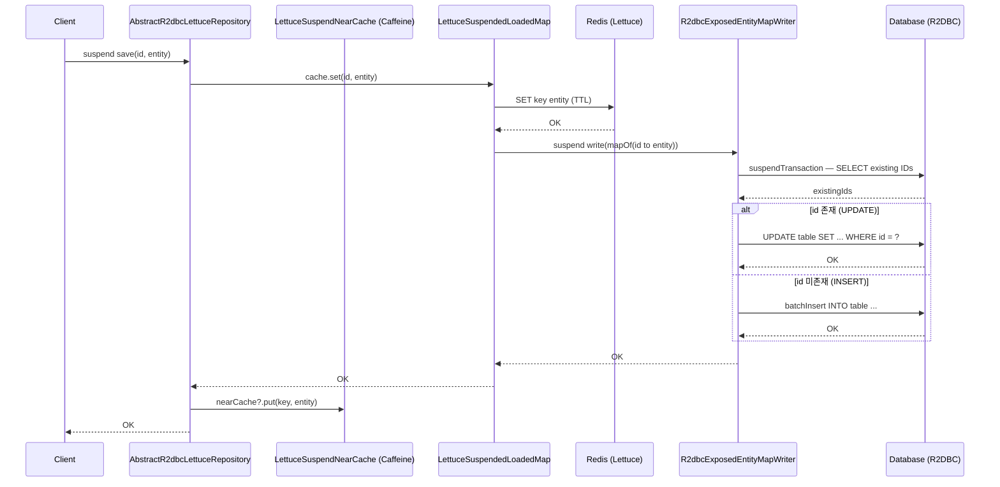
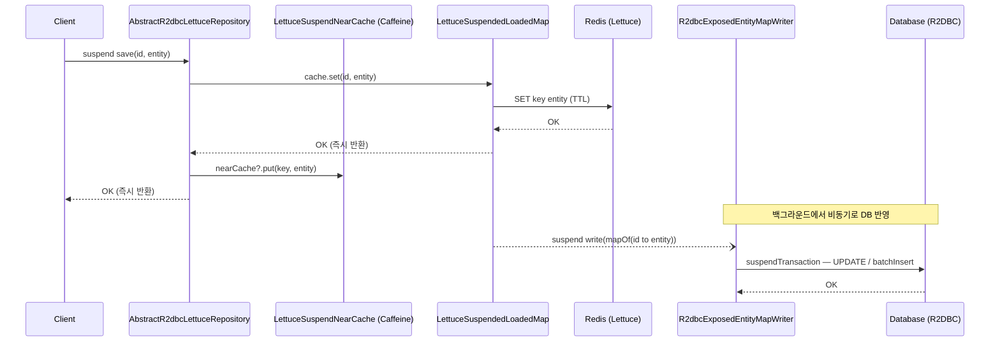
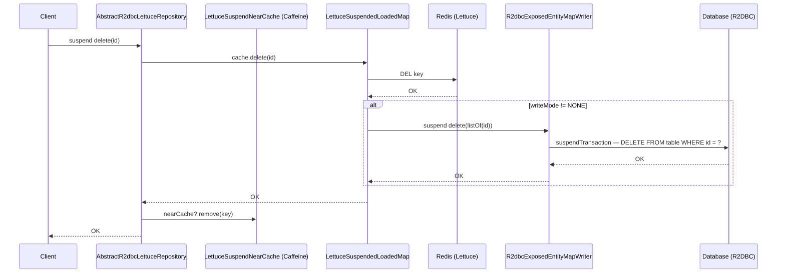

# Module bluetape4k-exposed-r2dbc-lettuce

Exposed R2DBC와 Lettuce Redis 캐시를 결합한 코루틴 네이티브 Read-through / Write-through / Write-behind 캐시 레포지토리 모듈입니다.
`runBlocking` 없이 `suspendTransaction` 기반으로 완전한 코루틴 네이티브 동작을 보장합니다.

## 개요

`bluetape4k-exposed-r2dbc-lettuce`는 다음을 제공합니다:

- **Read-through 캐시**: `findById` 시 캐시 미스이면 R2DBC `suspendTransaction`으로 DB 자동 로드 후 Redis에 캐싱
- **Write-through / Write-behind**: `save` 시 Redis와 DB를 동시(또는 비동기)로 반영
- **NearCache 지원**: Caffeine 로컬 캐시(front) + Redis(back) 2-tier 캐시 (옵션)
- **코루틴 레포지토리**: `R2dbcLettuceRepository` / `AbstractR2dbcLettuceRepository`
- **MapLoader / MapWriter**: Lettuce `LettuceSuspendedLoadedMap` 연동을 위한 R2DBC 기반 구현체

## 의존성 추가

```kotlin
dependencies {
    implementation("io.github.bluetape4k:bluetape4k-exposed-r2dbc-lettuce:${version}")
}
```

## 기본 사용법

### 코루틴 레포지토리 구현 (AbstractR2dbcLettuceRepository)

```kotlin
import io.bluetape4k.exposed.r2dbc.lettuce.repository.AbstractR2dbcLettuceRepository
import io.bluetape4k.redis.lettuce.map.LettuceCacheConfig
import io.lettuce.core.RedisClient

data class UserRecord(val id: Long, val name: String, val email: String): java.io.Serializable

class UserR2dbcLettuceRepository(redisClient: RedisClient):
    AbstractR2dbcLettuceRepository<Long, UserRecord>(
        client = redisClient,
        config = LettuceCacheConfig.READ_WRITE_THROUGH,
    ) {
    override val table = UserTable

    override suspend fun ResultRow.toEntity() = UserRecord(
        id = this[UserTable.id].value,
        name = this[UserTable.name],
        email = this[UserTable.email],
    )

    override fun UpdateStatement.updateEntity(entity: UserRecord) {
        this[UserTable.name] = entity.name
        this[UserTable.email] = entity.email
    }

    override fun BatchInsertStatement.insertEntity(entity: UserRecord) {
        this[UserTable.id] = entity.id
        this[UserTable.name] = entity.name
        this[UserTable.email] = entity.email
    }

    override fun extractId(entity: UserRecord) = entity.id
}

// suspend 함수로 사용
suspend fun example(repo: UserR2dbcLettuceRepository) {
    repo.save(1L, UserRecord(1L, "홍길동", "hong@example.com"))
    val user = repo.findById(1L)   // NearCache → Redis → DB 순으로 조회
    repo.delete(1L)                // Redis + DB 동시 삭제
    repo.clearCache()              // Redis 캐시 전체 삭제
}
```

## 클래스 다이어그램

### Repository 계층 구조



## 시퀀스 다이어그램

### Read-through — findById (NearCache 포함)



### Read-through — findAll (다건 조회, NearCache 포함)



### Write-through — save



### Write-behind — save (비동기 DB 반영)



### delete — 캐시 + DB 동시 삭제



## R2dbcLettuceRepository 주요 메서드

| 메서드                                   | 설명                                           |
|---------------------------------------|----------------------------------------------|
| `suspend findById(id)`                | NearCache → Redis → DB 순으로 조회 (Read-through) |
| `suspend findAll(ids)`                | 다건 조회, 미스 키만 Redis → DB Read-through         |
| `suspend findAll(limit, offset, ...)` | R2DBC DB 조회 후 결과를 Redis에 적재                  |
| `suspend findByIdFromDb(id)`          | 캐시 우회, R2DBC `suspendTransaction` 직접 조회      |
| `suspend findAllFromDb(ids)`          | 캐시 우회, R2DBC 다건 직접 조회                        |
| `suspend countFromDb()`               | R2DBC DB 전체 레코드 수                            |
| `suspend save(id, entity)`            | Redis 저장 + WriteMode에 따라 R2DBC DB 반영         |
| `suspend saveAll(entities)`           | 다건 저장                                        |
| `suspend delete(id)`                  | Redis + R2DBC DB 동시 삭제                       |
| `suspend deleteAll(ids)`              | 다건 삭제                                        |
| `suspend clearCache()`                | NearCache + Redis 키 전체 삭제 (DB 영향 없음)         |

## LettuceCacheConfig — 쓰기 모드

| WriteMode            | 동작                                  |
|----------------------|-------------------------------------|
| `READ_WRITE_THROUGH` | save 시 Redis + R2DBC DB 동시 반영 (기본값) |
| `READ_WRITE_BEHIND`  | save 시 Redis 즉시, R2DBC DB는 비동기 반영   |
| `READ_ONLY`          | Redis에만 저장, DB 쓰기 없음                |

## NearCache 설정

`LettuceCacheConfig.nearCacheEnabled = true`로 Caffeine 로컬 캐시(front)를 활성화할 수 있습니다.

```kotlin
val config = LettuceCacheConfig(
    writeMode = WriteMode.WRITE_THROUGH,
    nearCacheEnabled = true,
    nearCacheName = "user-near-cache",
    nearCacheMaxSize = 1000,
    nearCacheTtl = Duration.ofMinutes(5),
)
```

NearCache가 활성화되면 조회 순서: **Caffeine(로컬) → Redis → DB**

## JDBC 버전과의 차이점

| 항목               | exposed-jdbc-lettuce                               | exposed-r2dbc-lettuce            |
|------------------|----------------------------------------------------|----------------------------------|
| DB 드라이버          | JDBC (blocking)                                    | R2DBC (non-blocking)             |
| 트랜잭션             | `transaction {}` / `suspendedTransactionAsync(IO)` | `suspendTransaction {}`          |
| `toEntity`       | 일반 함수 (`fun`)                                      | suspend 함수 (`suspend fun`)       |
| `runBlocking` 사용 | 없음 (`LettuceSuspendedLoadedMap`)                   | 없음 (`LettuceSuspendedLoadedMap`) |
| 동기 레포지토리         | `JdbcLettuceRepository` 제공                         | 미제공 (suspend only)               |

## 주요 파일/클래스 목록

| 파일                                             | 설명                                                                  |
|------------------------------------------------|---------------------------------------------------------------------|
| `repository/R2dbcLettuceRepository.kt`         | suspend 캐시 레포지토리 인터페이스                                              |
| `repository/AbstractR2dbcLettuceRepository.kt` | 추상 구현체 (LettuceSuspendedLoadedMap + NearCache)                      |
| `map/R2dbcEntityMapLoader.kt`                  | R2DBC `suspendTransaction` 기반 MapLoader 추상 클래스                      |
| `map/R2dbcEntityMapWriter.kt`                  | R2DBC `suspendTransaction` + Resilience4j Retry 기반 MapWriter 추상 클래스 |
| `map/R2dbcExposedEntityMapLoader.kt`           | Exposed R2DBC DSL 기반 MapLoader 구현체                                  |
| `map/R2dbcExposedEntityMapWriter.kt`           | Exposed R2DBC DSL 기반 MapWriter 구현체 (upsert 전략)                      |

## 테스트

```bash
./gradlew :bluetape4k-exposed-r2dbc-lettuce:test
```

## 참고

- [bluetape4k-exposed-r2dbc](../exposed-r2dbc)
- [bluetape4k-exposed-jdbc-lettuce](../exposed-jdbc-lettuce)
- [bluetape4k-lettuce](../../infra/lettuce)
- [Lettuce Redis Client](https://lettuce.io)
