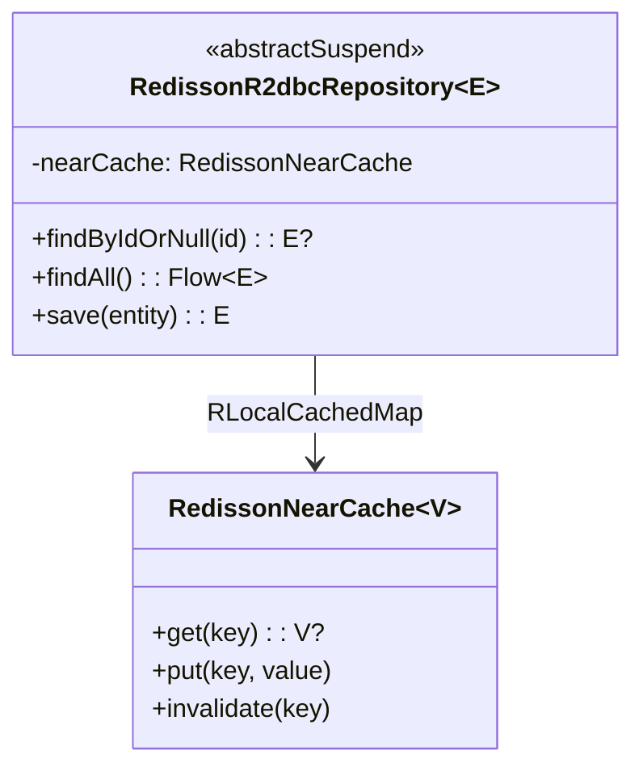
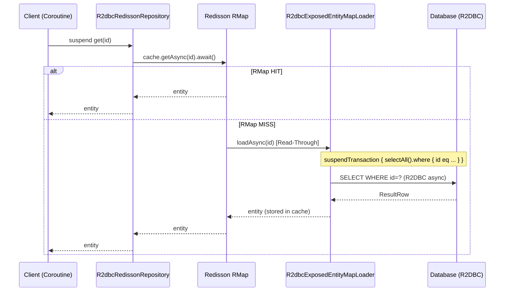
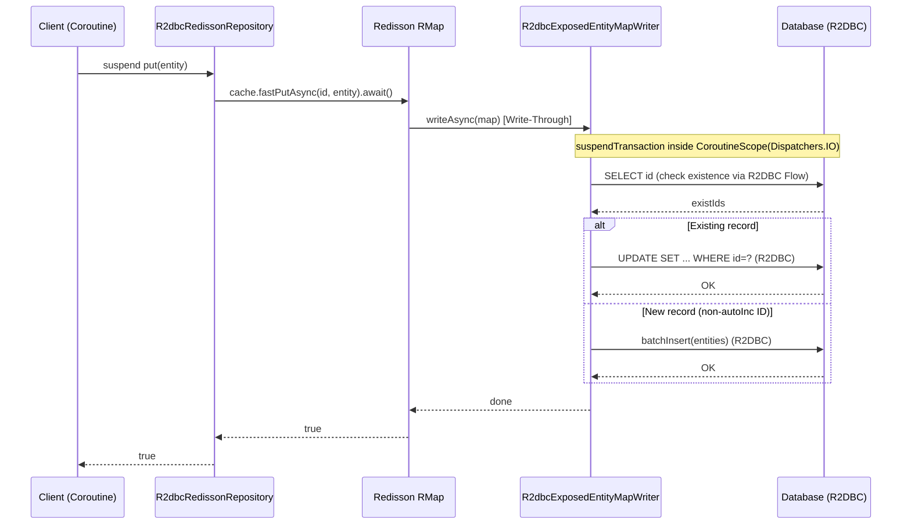
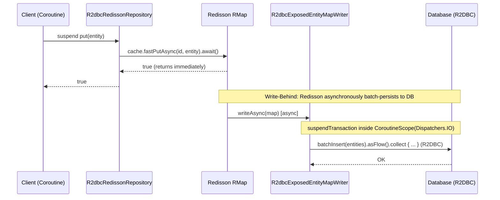

# Module bluetape4k-exposed-r2dbc-redisson

English | [한국어](./README.ko.md)

Combines Exposed R2DBC with Redisson caching to implement asynchronous Read-Through/Write-Through cache patterns.

## Overview

`bluetape4k-exposed-r2dbc-redisson` integrates Exposed R2DBC (asynchronous) with the [Redisson](https://github.com/redisson/redisson) Redis client, making it easy to cache database query results in Redis within an async environment. All interfaces are based on `suspend` functions and are fully compatible with Kotlin Coroutines.

### Key Features

- **Async MapLoader/MapWriter support**: Integration with Redisson `AsyncMapLoader`/`AsyncMapWriter`
  - `loadAllKeys()` iterates reliably in ascending primary key order
- **Repository abstraction**: Common cache + DB access pattern (`R2dbcRedissonRepository`)
- **Coroutines-native**: All operations are `suspend` functions
- **Near Cache support**: Two-tier Local Cache + Redis caching
- **Read-Through/Write-Through/Write-Behind**: Multiple cache patterns supported

## Adding Dependencies

```kotlin
dependencies {
    implementation("io.github.bluetape4k:bluetape4k-exposed-r2dbc-redisson:${version}")
    implementation("org.redisson:redisson:3.37.0")

    // R2DBC driver
    implementation("org.postgresql:r2dbc-postgresql:1.0.5.RELEASE")
}
```

## Basic Usage

### 1. Implementing R2dbcRedissonRepository

Extend `AbstractR2dbcRedissonRepository` to implement an async cache Repository.

```kotlin
import io.bluetape4k.exposed.core.HasIdentifier
import io.bluetape4k.exposed.r2dbc.redisson.repository.AbstractR2dbcRedissonRepository
import io.bluetape4k.redis.redisson.cache.RedisCacheConfig
import org.jetbrains.exposed.v1.core.ResultRow
import org.jetbrains.exposed.v1.core.dao.id.LongIdTable
import org.jetbrains.exposed.v1.core.statements.UpdateStatement
import org.redisson.api.RedissonClient

// Entity (must implement java.io.Serializable)
data class UserRecord(
    override val id: Long,
    val name: String,
    val email: String,
): HasIdentifier<Long>, java.io.Serializable

object UserTable: LongIdTable("users") {
    val name = varchar("name", 100)
    val email = varchar("email", 200)
}

class UserR2dbcRedissonRepository(
    redissonClient: RedissonClient,
    config: RedisCacheConfig,
): AbstractR2dbcRedissonRepository<Long, UserTable, UserRecord>(
    redissonClient = redissonClient,
    cacheName = "users",
    config = config,
) {
    override val entityTable = UserTable

    override suspend fun ResultRow.toEntity() = UserRecord(
        id    = this[UserTable.id].value,
        name  = this[UserTable.name],
        email = this[UserTable.email],
    )

    // Required for Write-Through mode
    override fun doUpdateEntity(statement: UpdateStatement, entity: UserRecord) {
        statement[UserTable.name]  = entity.name
        statement[UserTable.email] = entity.email
    }
}

// Usage (all methods are suspend)
val repo = UserR2dbcRedissonRepository(redissonClient, RedisCacheConfig.readOnly())

// Retrieve from cache (auto-loads from DB on miss)
val user = repo.get(1L)

// Bypass cache and query DB directly
val freshUser = repo.findByIdFromDb(1L)

// Load from DB and populate cache
val all = repo.findAll(limit = 100)

// Store in cache
repo.put(user!!)
repo.putAll(users)

// Invalidate cache
repo.invalidate(1L)
repo.invalidateAll()
repo.invalidateByPattern("user:*")
```

### 2. Cache pattern configuration

```kotlin
import io.bluetape4k.redis.redisson.cache.RedisCacheConfig

// Read-Through Only
val readOnlyConfig = RedisCacheConfig.readOnly(
    ttl = Duration.ofMinutes(30),
)

// Read-Through + Write-Through
val readWriteConfig = RedisCacheConfig.readWrite(
    ttl = Duration.ofMinutes(30),
    writeMode = WriteMode.WRITE_THROUGH,
)

// Enable Near Cache (Local + Redis two-tier)
val nearCacheConfig = RedisCacheConfig.readOnly(
    ttl = Duration.ofMinutes(30),
    nearCacheEnabled = true,
)
```

## Architecture Overview



## Class Diagrams

### R2DBC Redisson Repository Hierarchy


## Cache Patterns

### Read-Through (R2DBC + suspend)

On a cache miss, `R2dbcExposedEntityMapLoader` automatically loads from the DB via R2DBC `suspendTransaction`.



### Write-Through (R2DBC + suspend)

On `put()`, `R2dbcExposedEntityMapWriter` immediately persists to DB via R2DBC `suspendTransaction`.



### Write-Behind (R2DBC + suspend + async DB)

On `put()`, immediately returns and then `R2dbcExposedEntityMapWriter` asynchronously batch-persists to the DB.



## R2dbcRedissonRepository Key Methods

| Method                                    | Description                                             |
|-------------------------------------------|---------------------------------------------------------|
| `exists(id)`                              | Check ID existence in cache (suspend)                   |
| `get(id)`                                 | Retrieve entity from cache, load from DB on miss (suspend) |
| `getAll(ids, batchSize)`                  | Batch retrieve from cache (suspend)                     |
| `findByIdFromDb(id)`                      | Bypass cache, query DB directly (suspend)               |
| `findAllFromDb(ids)`                      | Bypass cache, batch query DB (suspend)                  |
| `findAll(limit, offset, sortBy, where)`   | Load from DB and sync cache (suspend)                   |
| `put(entity)`                             | Store in cache (suspend)                                |
| `putAll(entities, batchSize)`             | Batch store in cache (suspend)                          |
| `invalidate(vararg ids)`                  | Remove from cache (suspend)                             |
| `invalidateAll()`                         | Clear all cache entries (suspend)                       |
| `invalidateByPattern(pattern, count)`     | Remove cache entries matching a pattern (suspend)       |

## Cache Configuration Constants (`RedisCacheConfig`)

Commonly used cache mode constants are provided as named constants.

| Constant                                             | Description                              |
|------------------------------------------------------|------------------------------------------|
| `RedisCacheConfig.READ_ONLY`                         | Read-Through only (remote cache)         |
| `RedisCacheConfig.READ_ONLY_WITH_NEAR_CACHE`         | Read-Through + Near Cache                |
| `RedisCacheConfig.READ_WRITE_THROUGH`                | Read-Through + Write-Through             |
| `RedisCacheConfig.READ_WRITE_THROUGH_WITH_NEAR_CACHE`| Read-Write-Through + Near Cache          |
| `RedisCacheConfig.WRITE_BEHIND`                      | Write-Behind (remote cache)              |
| `RedisCacheConfig.WRITE_BEHIND_WITH_NEAR_CACHE`      | Write-Behind + Near Cache                |

## Key Files and Classes

### Repository (repository/)

| File                                      | Description                                         |
|-------------------------------------------|-----------------------------------------------------|
| `R2dbcRedissonRepository.kt`              | R2DBC async cache Repository interface              |
| `AbstractR2dbcRedissonRepository.kt`      | R2DBC async cache Repository abstract class         |
| `R2dbcCacheRepository.kt`                 | (Deprecated) Legacy R2DBC cache Repository          |
| `AbstractR2dbcCacheRepository.kt`         | (Deprecated) Legacy R2DBC cache abstract class      |

### Map (map/)

| File                                    | Description                                                             |
|-----------------------------------------|-------------------------------------------------------------------------|
| `R2dbcEntityMapLoader.kt`               | R2DBC async MapLoader base implementation (`MapLoaderAsync`)            |
| `R2dbcEntityMapWriter.kt`               | R2DBC async MapWriter base implementation (`MapWriterAsync`)            |
| `R2dbcExposedEntityMapLoader.kt`        | Exposed IdTable-based MapLoader implementation                          |
| `R2dbcExposedEntityMapWriter.kt`        | Exposed IdTable-based MapWriter implementation (Write-Through/Behind)   |
| `AsyncIteratorSupport.kt`               | Extension to collect a Redisson `AsyncIterator` into a `List`           |

## Testing

```bash
./gradlew :bluetape4k-exposed-r2dbc-redisson:test
```

## References

- [JetBrains Exposed R2DBC](https://github.com/JetBrains/Exposed)
- [Redisson](https://github.com/redisson/redisson)
- [Redisson AsyncMapLoader](https://www.javadoc.io/doc/org.redisson/redisson/latest/org/redisson/api/map/MapLoaderAsync.html)
- [bluetape4k-exposed-r2dbc](../exposed-r2dbc)
- [bluetape4k-exposed-jdbc-redisson](../exposed-jdbc-redisson)
