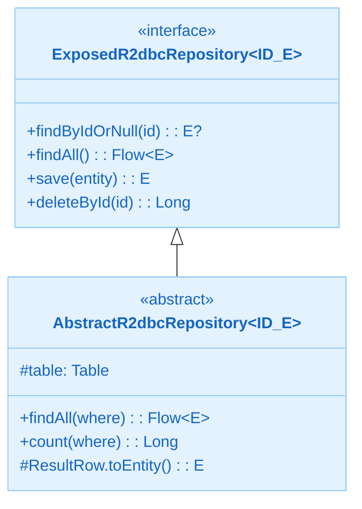
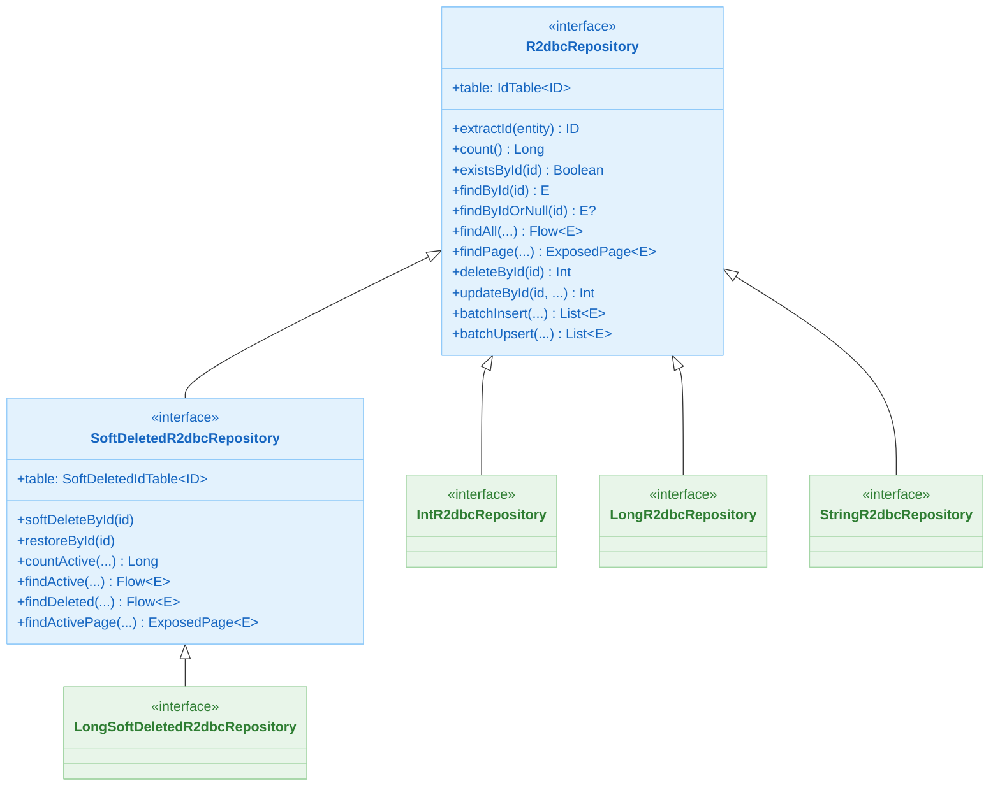
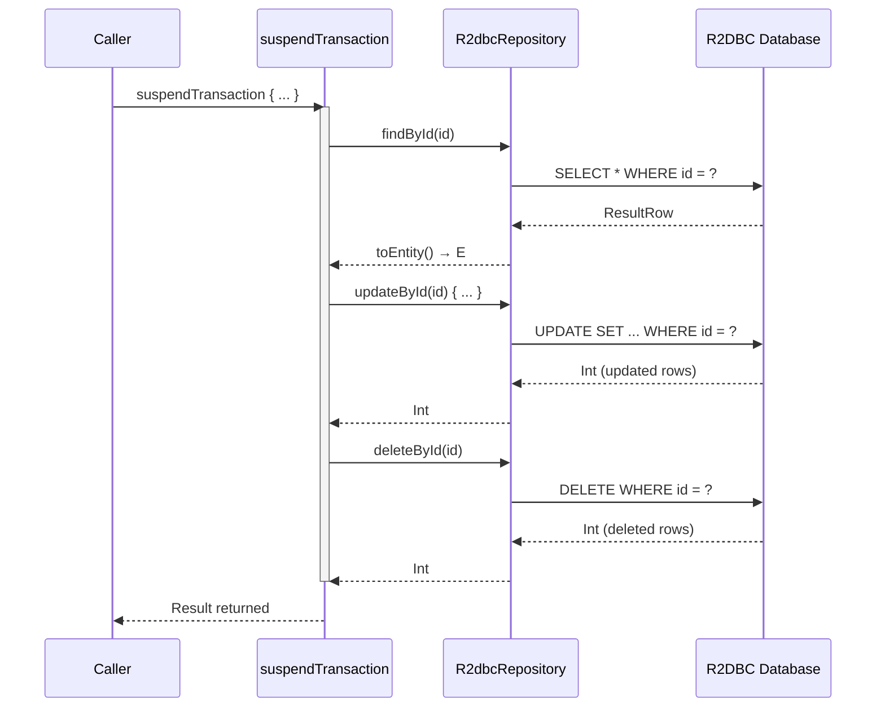
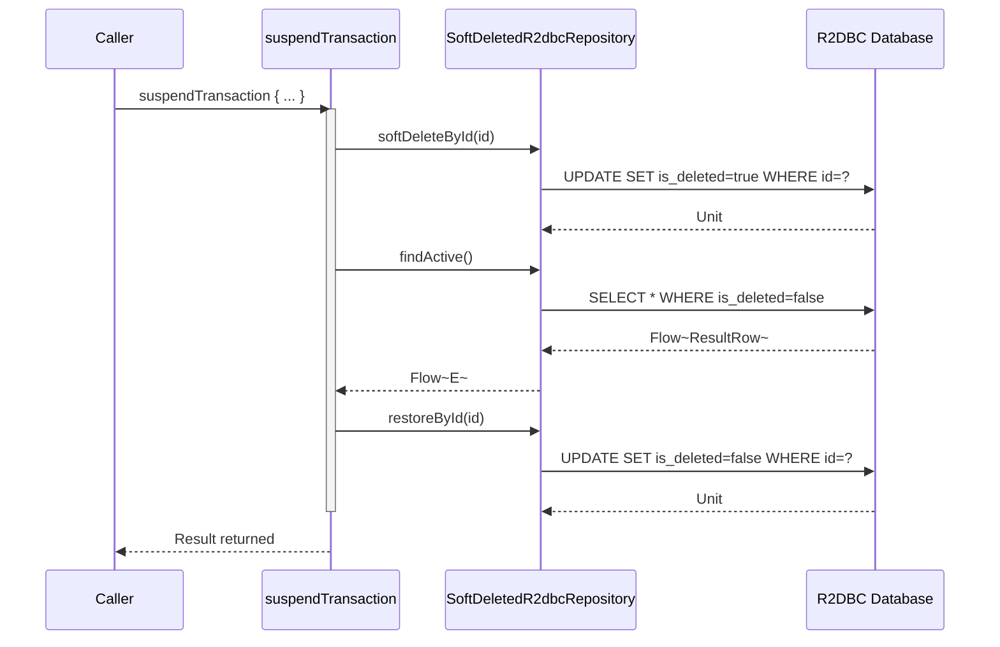

# Module bluetape4k-exposed-r2dbc

English | [한국어](./README.ko.md)

Provides extension functions and the Repository pattern for use with Exposed in R2DBC environments.

## Overview

`bluetape4k-exposed-r2dbc` builds on the JetBrains Exposed R2DBC (Reactive Relational Database Connectivity) driver to deliver extensions for asynchronous, reactive database operations. Fully compatible with Kotlin Coroutines.

### Key Features

- **Repository pattern**: `R2dbcRepository<ID, T, E>` and `SoftDeletedR2dbcRepository<ID, T, E>` interfaces
- **Flow-based queries**: `findAll`, `findBy`, `findByField`, and others return `Flow<E>`
- **Batch insert support**: `BatchInsertOnConflictDoNothing` pattern
    - For PostgreSQL-compatible databases, uses `ON CONFLICT DO NOTHING` without pinning to a specific `id` column
- **Coroutines-friendly API**: All single-record lookup and mutation operations are `suspend` functions
- **Soft delete support**: `SoftDeletedR2dbcRepository`
- **Virtual Thread transactions**: `virtualThreadTransaction` — run R2DBC transactions on Java 21 Virtual Threads
- **R2DBC Readable extensions**: Type-safe column value accessors such as `Readable.getString` and `Readable.getLong`
- **SELECT \* support**: `ImplicitQuery` / `FieldSet.selectImplicitAll()` — generates `SELECT *` SQL
- **Async table metadata**: `Table.suspendColumnMetadata()`, `suspendIndexes()`, and other async metadata APIs

## Adding Dependencies

```kotlin
dependencies {
    implementation("io.github.bluetape4k:bluetape4k-exposed-r2dbc:${version}")

    // R2DBC driver (examples)
    implementation("org.postgresql:r2dbc-postgresql:1.0.5.RELEASE")
    // or
    implementation("io.r2dbc:r2dbc-h2:1.0.0.RELEASE")
}
```

## Basic Usage

### 1. Implementing R2dbcRepository

```kotlin
import io.bluetape4k.exposed.r2dbc.repository.LongR2dbcRepository
import org.jetbrains.exposed.v1.core.ResultRow
import org.jetbrains.exposed.v1.core.dao.id.LongIdTable
import org.jetbrains.exposed.v1.r2dbc.insertAndGetId
import org.jetbrains.exposed.v1.r2dbc.transactions.suspendTransaction

data class ActorRecord(
    val id: Long = 0L,
    val firstName: String,
    val lastName: String,
)

object ActorTable : LongIdTable("actors") {
    val firstName = varchar("first_name", 50)
    val lastName  = varchar("last_name",  50)
}

class ActorRepository : LongR2dbcRepository<ActorTable, ActorRecord> {
    override val table = ActorTable

    override suspend fun ResultRow.toEntity() = ActorRecord(
        id        = this[ActorTable.id].value,
        firstName = this[ActorTable.firstName],
        lastName  = this[ActorTable.lastName],
    )

    suspend fun save(record: ActorRecord): ActorRecord {
        val id = ActorTable.insertAndGetId {
            it[firstName] = record.firstName
            it[lastName]  = record.lastName
        }
        return record.copy(id = id.value)
    }
}

// Usage
suspendTransaction {
    val repo = ActorRepository()
    val saved = repo.save(ActorRecord(firstName = "Johnny", lastName = "Depp"))

    val found = repo.findById(saved.id)                              // suspend, throws if not found
    val foundOrNull = repo.findByIdOrNull(saved.id)                  // suspend, returns null if not found
    val all = repo.findAll(limit = 10).toList()                      // Flow<E>
    val byName = repo.findBy { ActorTable.lastName eq "Depp" }.toList()
    val page = repo.findPage(pageNumber = 0, pageSize = 20)          // suspend
}
```

### 2. Implementing SoftDeletedR2dbcRepository

```kotlin
import io.bluetape4k.exposed.core.dao.id.SoftDeletedIdTable
import io.bluetape4k.exposed.r2dbc.repository.LongSoftDeletedR2dbcRepository

object ContactTable : SoftDeletedIdTable<Long>("contacts") {
    override val id = long("id").autoIncrement().entityId()
    val name = varchar("name", 100)
    override val primaryKey = PrimaryKey(id)
}

data class ContactRecord(
    val id: Long = 0L,
    val name: String,
    val isDeleted: Boolean = false,
)

class ContactRepository : LongSoftDeletedR2dbcRepository<ContactTable, ContactRecord> {
    override val table = ContactTable

    override suspend fun ResultRow.toEntity() = ContactRecord(
        id        = this[ContactTable.id].value,
        name      = this[ContactTable.name],
        isDeleted = this[ContactTable.isDeleted],
    )
}

suspendTransaction {
    val repo = ContactRepository()

    // Soft delete
    repo.softDeleteById(1L)

    // Query only active records (isDeleted = false)
    val active = repo.findActive().toList()

    // Query only deleted records
    val deleted = repo.findDeleted().toList()

    // Restore
    repo.restoreById(1L)

    // Paginated active records
    val page = repo.findActivePage(pageNumber = 0, pageSize = 20)
}
```

### 3. Batch insert / Upsert

```kotlin
suspendTransaction {
    val repo = ActorRepository()

    // Batch insert
    val inserted = repo.batchInsert(actorList) { actor ->
        this[ActorTable.firstName] = actor.firstName
        this[ActorTable.lastName]  = actor.lastName
    }

    // Batch upsert
    val upserted = repo.batchUpsert(actorList) { actor ->
        this[ActorTable.firstName] = actor.firstName
        this[ActorTable.lastName]  = actor.lastName
    }
}
```

Because
`BatchInsertOnConflictDoNothing` does not pin the conflict target to a specific column on PostgreSQL-compatible databases, it works with tables that use unique columns or indexes other than
`id`.

## R2dbcRepository Key Methods

| Method                                | Suspend | Return type      | Description                             |
|---------------------------------------|---------|------------------|-----------------------------------------|
| `count()`                             | yes     | `Long`           | Total record count                      |
| `countBy(predicate)`                  | yes     | `Long`           | Count matching records                  |
| `existsById(id)`                      | yes     | `Boolean`        | Check existence by ID                   |
| `existsBy(predicate)`                 | yes     | `Boolean`        | Check existence by condition            |
| `findById(id)`                        | yes     | `E`              | Find by ID (throws if not found)        |
| `findByIdOrNull(id)`                  | yes     | `E?`             | Find by ID (returns null if not found)  |
| `findAll(limit, offset, ...)`         | no      | `Flow<E>`        | Find all (supports paging and sorting)  |
| `findWithFilters(...)`                | no      | `Flow<E>`        | Find with multiple AND conditions       |
| `findBy(...)`                         | no      | `Flow<E>`        | Alias for `findWithFilters`             |
| `findFirstOrNull(...)`                | yes     | `E?`             | First matching entity                   |
| `findLastOrNull(...)`                 | yes     | `E?`             | Last matching entity                    |
| `findByField(field, value)`           | no      | `Flow<E>`        | Find by a specific column value         |
| `findByFieldOrNull(field, value)`     | yes     | `E?`             | First result matching a specific column |
| `findAllByIds(ids)`                   | no      | `Flow<E>`        | Find multiple entities by IDs           |
| `findPage(pageNumber, pageSize, ...)` | yes     | `ExposedPage<E>` | Paginated query                         |
| `deleteById(id)`                      | yes     | `Int`            | Delete by ID                            |
| `deleteAll(op)`                       | yes     | `Int`            | Delete matching records                 |
| `deleteAllByIds(ids)`                 | yes     | `Int`            | Delete multiple records by IDs          |
| `updateById(id, ...)`                 | yes     | `Int`            | Update by ID                            |
| `updateAll(predicate, ...)`           | yes     | `Int`            | Bulk update matching records            |
| `batchInsert(entities, ...)`          | yes     | `List<E>`        | Batch insert                            |
| `batchUpsert(entities, ...)`          | yes     | `List<E>`        | Batch upsert                            |

## SoftDeletedR2dbcRepository Additional Methods

| Method                                      | Suspend | Return type      | Description                          |
|---------------------------------------------|---------|------------------|--------------------------------------|
| `softDeleteById(id)`                        | yes     | `Unit`           | Soft delete by ID (`isDeleted=true`) |
| `restoreById(id)`                           | yes     | `Unit`           | Restore a soft-deleted record by ID  |
| `countActive(predicate)`                    | yes     | `Long`           | Count active records                 |
| `countDeleted(predicate)`                   | yes     | `Long`           | Count deleted records                |
| `findActive(limit, offset, ...)`            | no      | `Flow<E>`        | Find only active records             |
| `findDeleted(limit, offset, ...)`           | no      | `Flow<E>`        | Find only deleted records            |
| `softDeleteAll(predicate)`                  | yes     | `Int`            | Bulk soft delete matching records    |
| `restoreAll(predicate)`                     | yes     | `Int`            | Bulk restore matching records        |
| `findActivePage(pageNumber, pageSize, ...)` | yes     | `ExposedPage<E>` | Paginated query of active records    |

## Diagrams

### Core R2dbcRepository Structure



### R2dbcRepository Hierarchy



### suspend Transaction Flow

How CRUD operations are executed through `R2dbcRepository` inside a `suspendTransaction` block.



### SoftDelete Transaction Flow



## Convenience Type Aliases

| Interface                          | Primary key type   |
|------------------------------------|--------------------|
| `IntR2dbcRepository`               | `Int`              |
| `LongR2dbcRepository`              | `Long`             |
| `UuidR2dbcRepository`              | `kotlin.uuid.Uuid` |
| `UUIDR2dbcRepository`              | `java.util.UUID`   |
| `StringR2dbcRepository`            | `String`           |
| `IntSoftDeletedR2dbcRepository`    | `Int`              |
| `LongSoftDeletedR2dbcRepository`   | `Long`             |
| `UuidSoftDeletedR2dbcRepository`   | `kotlin.uuid.Uuid` |
| `UUIDSoftDeletedR2dbcRepository`   | `java.util.UUID`   |
| `StringSoftDeletedR2dbcRepository` | `String`           |

## Virtual Thread Transactions

Run R2DBC transactions on Java 21 Virtual Threads.

```kotlin
import io.bluetape4k.exposed.r2dbc.virtualThreadTransaction

// Using the default VirtualThreadExecutor
val count = virtualThreadTransaction(db = database) {
    UserTable.selectAll().count()
}

// Using a custom Executor
val executor = Executors.newSingleThreadExecutor()
val result = virtualThreadTransaction(executor = executor, db = database) {
    UserTable.insert { it[name] = "Alice" }
    UserTable.selectAll().count()
}
```

## R2DBC Readable Column Value Access

Type-safe column value accessor extensions for `io.r2dbc.spi.Readable`.

```kotlin
import io.bluetape4k.exposed.r2dbc.getString
import io.bluetape4k.exposed.r2dbc.getLong
import io.bluetape4k.exposed.r2dbc.getLocalDate

// Index-based access
val name: String = readable.getString(0)
val id: Long = readable.getLong(1)

// Column-name-based access (nullable)
val nickname: String? = readable.getStringOrNull("nickname")
val birthday: LocalDate? = readable.getLocalDateOrNull("birthday")

// ExposedBlob access (suspend function)
val blob: ExposedBlob = readable.getExposedBlob("data")
val blobOrNull: ExposedBlob? = readable.getExposedBlobOrNull("data")
```

Supported types: `String`, `Boolean`, `Char`, `Byte`, `Short`, `Int`, `Long`, `Float`, `Double`,
`BigDecimal`, `ByteArray`, `Date`, `Timestamp`, `Instant`, `LocalDate`, `LocalTime`,
`LocalDateTime`, `OffsetDateTime`, `UUID`, `ExposedBlob`

## SELECT * Support

`ImplicitQuery` generates `SELECT *` instead of an explicit column list.

```kotlin
import io.bluetape4k.exposed.r2dbc.selectImplicitAll

// SELECT * FROM actors WHERE ...
val rows = ActorTable.selectImplicitAll()
    .where { ActorTable.lastName eq "Depp" }
    .toList()
```

## Key Files and Classes

| File                                           | Description                                        |
|------------------------------------------------|----------------------------------------------------|
| `repository/R2dbcRepository.kt`                | R2DBC Repository base interface                    |
| `repository/SoftDeletedR2dbcRepository.kt`     | Soft Delete R2DBC Repository                       |
| `repository/ExposedR2dbcRepository.kt`         | (Deprecated) Legacy Repository interface           |
| `TableExtensions.kt`                           | Async table metadata extension functions           |
| `QueryExtensions.kt`                           | Flow/Query extensions (`forEach`, `any`, etc.)     |
| `ReadableExtensions.kt`                        | Type-safe R2DBC Readable column value accessors    |
| `ImplicitSelectAll.kt`                         | `SELECT *` query (`ImplicitQuery`)                 |
| `virtualThreadTransaction.kt`                  | Java 21 Virtual Thread-based transaction execution |
| `statements/BatchInsertOnConflictDoNothing.kt` | ON CONFLICT DO NOTHING batch insert                |

## Testing

```bash
./gradlew :bluetape4k-exposed-r2dbc:test
```

## References

- [JetBrains Exposed R2DBC](https://github.com/JetBrains/Exposed)
- [R2DBC Specification](https://r2dbc.io/)
- [Kotlin Coroutines](https://kotlinlang.org/docs/coroutines-overview.html)
