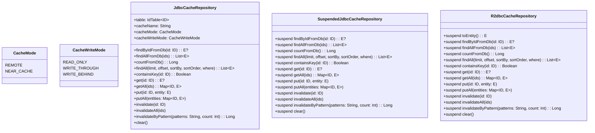

# Module bluetape4k-exposed-redis-api

[English](./README.md) | 한국어

Exposed ORM을 위한 Redis (Lettuce & Redisson) 기반 통합 캐시 저장소 API 인터페이스입니다. 이 모듈은 플러그인형 Redis 백엔드와 함께 동작하는 캐시 인식 Exposed 저장소를 구현하기 위한 통합 추상화 계층을 제공합니다.

## 개요

`bluetape4k-exposed-redis-api`는 Redis 기반 Exposed 저장소를 위한 핵심 인터페이스들을 정의합니다:

- **동기 JDBC**: `JdbcCacheRepository<ID, E>` — 차단형 JDBC 캐시 저장소
- **코루틴 기반 JDBC**: `SuspendedJdbcCacheRepository<ID, E>` — suspend 친화적 JDBC 캐시
- **반응형 R2DBC**: `R2dbcCacheRepository<ID, E>` — 완전 비차단 반응형 캐시
- **패턴 기반 무효화**: `invalidateByPattern()`이 3개 기본 인터페이스 모두에 내장됨
- **캐시 전략**: Read-Through, Write-Through (WRITE_THROUGH), Write-Behind (WRITE_BEHIND), Read-Only (READ_ONLY)
- **캐시 모드**: REMOTE (Redis 전용) 또는 NEAR_CACHE (L1 로컬 + L2 Redis)

## 아키텍처



## 인터페이스 계층 구조

### 핵심 인터페이스

1. **JdbcCacheRepository<ID, E>** — 동기 JDBC 캐시
    - 차단형 연산
    - 기존 JDBC 트랜잭션과 함께 사용
    - 코루틴이 아닌 환경에 적합

2. **SuspendedJdbcCacheRepository<ID, E>** — 코루틴 기반 JDBC 캐시
    - 모든 연산이 `suspend` 함수
    - 내부적으로 `suspendedTransactionAsync` 사용
    - Kotlin 코루틴 기반 애플리케이션에 최적
    - `runBlocking()` 불필요

3. **R2dbcCacheRepository<ID, E>** — 반응형 R2DBC 캐시
    - 완전 비차단 반응형 캐시
    - `ResultRow.toEntity()`는 suspend 함수
    - Reactive Streams 기반
    - 고 동시성 시나리오에 최적

### 패턴 기반 무효화

3개 기본 인터페이스 모두에 `invalidateByPattern()`이 내장되어 있습니다 (Lettuce, Redisson 공통):

```kotlin
// JdbcCacheRepository, SuspendedJdbcCacheRepository, R2dbcCacheRepository 모두 지원
fun/suspend invalidateByPattern(patterns: String, count: Int = DEFAULT_BATCH_SIZE): Long
```

Redis SCAN 명령으로 `${cacheName}:${patterns}` 형식의 키를 검색하여 일괄 삭제합니다.

## 캐시 모드

### REMOTE

Redis만 캐시 계층으로 사용합니다. 로컬(Near) 캐시는 없습니다.

```
┌─────────┐      ┌──────┐
│ 요청    │─────>│Redis │
└─────────┘      └──────┘
```

### NEAR_CACHE

2계층 캐싱: 로컬 (L1, 예: Caffeine) + Redis (L2)

```
┌─────────┐      ┌──────────┐      ┌──────┐
│ 요청    │─────>│ Caffeine │─────>│Redis │
└─────────┘      │  (L1)    │      └──────┘
                 └──────────┘
```

## 캐시 쓰기 전략

### READ_ONLY

읽기는 캐시됩니다 (Read-Through), 하지만 쓰기는 캐시에 동기화되지 **않습니다**.

### WRITE_THROUGH

동기 쓰기: 캐시와 DB가 함께 업데이트됩니다. 일관성이 보장되지만 쓰기 지연이 발생할 수 있습니다.

### WRITE_BEHIND

비동기 쓰기: 데이터가 먼저 캐시에 쓰여진 후, 비동기로 DB에 반영됩니다. 쓰기 성능이 우수하지만 장애 시 데이터 손실 위험이 있습니다.

## 의존성 추가

```kotlin
dependencies {
    // API 인터페이스만 포함
    implementation("io.github.bluetape4k:bluetape4k-exposed-redis-api:${version}")

    // Lettuce 기반 구현
    implementation("io.github.bluetape4k:bluetape4k-exposed-jdbc-lettuce:${version}")
    // 또는
    implementation("io.github.bluetape4k:bluetape4k-exposed-r2dbc-lettuce:${version}")

    // Redisson 기반 구현
    implementation("io.github.bluetape4k:bluetape4k-exposed-jdbc-redisson:${version}")
    // 또는
    implementation("io.github.bluetape4k:bluetape4k-exposed-r2dbc-redisson:${version}")

    // Coroutines 지원
    implementation("io.github.bluetape4k:bluetape4k-coroutines:${version}")
}
```

## 기본 사용 예제

### 엔티티와 테이블 정의

```kotlin
import io.bluetape4k.exposed.cache.JdbcCacheRepository
import io.bluetape4k.exposed.cache.CacheMode
import io.bluetape4k.exposed.cache.CacheWriteMode
import org.jetbrains.exposed.v1.core.ResultRow
import org.jetbrains.exposed.v1.core.dao.id.LongIdTable
import java.io.Serializable

// 엔티티 (분산 캐시 저장을 위해 Serializable 필수)
data class UserRecord(
    val id: Long = 0L,
    val name: String,
    val email: String,
) : Serializable {
    companion object {
        private const val serialVersionUID = 1L
    }
}

// 테이블
object UserTable : LongIdTable("users") {
    val name = varchar("name", 100)
    val email = varchar("email", 200)
}
```

### 캐시 저장소 구현 (동기 JDBC)

```kotlin
class UserCacheRepository(
    private val redisClient: RedisClient,
) : JdbcCacheRepository<Long, UserRecord> {

    override val table = UserTable
    override val cacheName = "user"
    override val cacheMode = CacheMode.NEAR_CACHE
    override val cacheWriteMode = CacheWriteMode.WRITE_THROUGH

    override fun ResultRow.toEntity() = UserRecord(
        id = this[UserTable.id].value,
        name = this[UserTable.name],
        email = this[UserTable.email],
    )

    override fun extractId(entity: UserRecord) = entity.id

    override fun findByIdFromDb(id: Long): UserRecord? {
        return transaction {
            UserTable.select { UserTable.id eq id }
                .mapNotNull { it.toEntity() }
                .firstOrNull()
        }
    }

    override fun findAllFromDb(ids: Collection<Long>): List<UserRecord> {
        return transaction {
            UserTable.select { UserTable.id inList ids }
                .mapNotNull { it.toEntity() }
        }
    }

    // ... 나머지 메서드 구현 ...
}

// 사용
transaction {
    val repo = UserCacheRepository(redisClient)
    
    // Read-Through: 캐시에 없으면 DB에서 로드하여 캐시
    val user = repo.get(1L)
    
    // Write-Through: 캐시와 DB 동시 업데이트
    val newUser = UserRecord(name = "Alice", email = "alice@example.com")
    repo.put(1L, newUser)
    
    // 캐시로 존재 여부 확인
    if (repo.containsKey(1L)) {
        println("사용자 발견")
    }
    
    // 일괄 연산
    val users = repo.getAll(listOf(1L, 2L, 3L))
    
    // 캐시 무효화
    repo.invalidate(1L)
    
    repo.close()
}
```

### 캐시 저장소 구현 (코루틴 기반 JDBC)

```kotlin
class UserSuspendedCacheRepository(
    private val redisClient: RedisClient,
) : SuspendedJdbcCacheRepository<Long, UserRecord> {

    override val table = UserTable
    override val cacheName = "user"
    override val cacheMode = CacheMode.NEAR_CACHE
    override val cacheWriteMode = CacheWriteMode.WRITE_BEHIND

    override fun ResultRow.toEntity() = UserRecord(
        id = this[UserTable.id].value,
        name = this[UserTable.name],
        email = this[UserTable.email],
    )

    override fun extractId(entity: UserRecord) = entity.id

    override suspend fun findByIdFromDb(id: Long): UserRecord? {
        return suspendedTransactionAsync {
            UserTable.select { UserTable.id eq id }
                .mapNotNull { it.toEntity() }
                .firstOrNull()
        }
    }

    // ... 나머지 suspend 메서드 구현 ...
}

// 코루틴 컨텍스트에서의 사용
val repo = UserSuspendedCacheRepository(redisClient)

val user = repo.get(1L)  // 발견되면 UserRecord 반환
val users = repo.getAll(listOf(1L, 2L, 3L))

repo.put(1L, UserRecord(name = "Bob", email = "bob@example.com"))
repo.invalidate(1L)

repo.close()
```

### 패턴 기반 무효화

Lettuce, Redisson 구현 모두에서 사용 가능합니다:

```kotlin
// 모든 구현체에서 동작: Lettuce 또는 Redisson
suspend fun invalidateUserCache(repo: SuspendedJdbcCacheRepository<Long, UserRecord>) {
    // "user:*" 패턴과 일치하는 모든 캐시 키 무효화
    repo.invalidateByPattern("user:*", count = 100)
}
```

## 핵심 개념

### 직렬화 요구 사항

모든 엔티티 클래스는 분산 캐시 저장을 위해 `Serializable`을 구현해야 합니다:

```kotlin
data class ProductRecord(
    val id: Long = 0L,
    val name: String,
) : Serializable {
    companion object {
        private const val serialVersionUID = 1L
    }
}
```

### 캐시 vs. DB 연산

- **캐시 기반**: `get()`, `getAll()`, `put()`, `putAll()` — 캐시 우선 연산
- **DB 전용**: `findByIdFromDb()`, `findAllFromDb()`, `countFromDb()` — 캐시 우회
- **캐시 무효화**: `invalidate()`, `invalidateAll()`, `clear()` — 캐시만 영향 (DB 변경 없음)

### 일괄 처리

기본 배치 크기는 `500`입니다. 큰 데이터셋을 삽입할 때 덮어쓰기:

```kotlin
repo.putAll(largeMap, batchSize = 1000)
```

## 참고 문서

- `bluetape4k-exposed-jdbc-lettuce` — Lettuce 기반 JDBC 캐시 구현
- `bluetape4k-exposed-r2dbc-lettuce` — Lettuce 기반 R2DBC 캐시 구현
- `bluetape4k-exposed-jdbc-redisson` — Redisson 기반 JDBC 캐시 구현
- `bluetape4k-exposed-r2dbc-redisson` — Redisson 기반 R2DBC 캐시 구현
