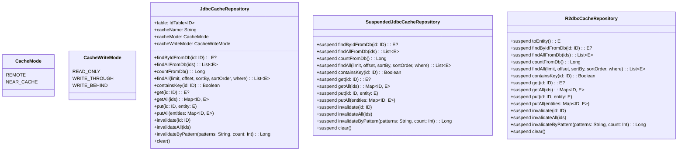

# Module bluetape4k-exposed-redis-api

English | [한국어](./README.ko.md)

Unified cache repository API interfaces for Exposed ORM with Redis (Lettuce & Redisson). This module provides a unified abstraction layer for implementing cache-aware Exposed repositories with pluggable Redis backends.

## Overview

`bluetape4k-exposed-redis-api` defines the core interfaces for Redis-backed Exposed repositories:

- **Synchronous JDBC**: `JdbcCacheRepository<ID, E>` — blocking JDBC cache repository
- **Coroutine-based JDBC**: `SuspendedJdbcCacheRepository<ID, E>` — suspend-friendly JDBC cache
- **Reactive R2DBC**: `R2dbcCacheRepository<ID, E>` — fully non-blocking reactive cache
- **Pattern-based invalidation**: `invalidateByPattern()` built into all three base interfaces
- **Cache strategies**: Read-Through, Write-Through (WRITE_THROUGH), Write-Behind (WRITE_BEHIND), Read-Only (READ_ONLY)
- **Cache modes**: REMOTE (Redis-only) or NEAR_CACHE (L1 local + L2 Redis)

## Architecture



## Interface Hierarchy

### Core Interfaces

1. **JdbcCacheRepository<ID, E>** — Synchronous JDBC cache
   - Blocking operations
   - Used with traditional JDBC transactions
   - Suitable for non-coroutine environments

2. **SuspendedJdbcCacheRepository<ID, E>** — Coroutine-based JDBC cache
   - All operations are `suspend` functions
   - Uses `suspendedTransactionAsync` internally
   - Ideal for Kotlin coroutine-based applications
   - No `runBlocking()` needed

3. **R2dbcCacheRepository<ID, E>** — Reactive R2DBC cache
   - Fully non-blocking reactive cache
   - `ResultRow.toEntity()` is a suspend function
   - Built on top of Reactive Streams
   - Best for high-concurrency scenarios

### Pattern-Based Invalidation

All three base interfaces include `invalidateByPattern()` for Redis SCAN-based bulk cache removal:

```kotlin
// Available on JdbcCacheRepository, SuspendedJdbcCacheRepository, R2dbcCacheRepository
fun/suspend invalidateByPattern(patterns: String, count: Int = DEFAULT_BATCH_SIZE): Long
```

Searches keys matching `${cacheName}:${patterns}` and deletes them in batches.

## Cache Modes

### REMOTE
Uses only Redis as a cache layer. No local (near) cache.

```
┌─────────┐      ┌──────┐
│ Request │─────>│Redis │
└─────────┘      └──────┘
```

### NEAR_CACHE
Two-tier caching: Local (L1, e.g., Caffeine) + Redis (L2).

```
┌─────────┐      ┌──────────┐      ┌──────┐
│ Request │─────>│ Caffeine │─────>│Redis │
└─────────┘      │  (L1)    │      └──────┘
                 └──────────┘
```

## Cache Write Strategies

### READ_ONLY
Reads are cached (Read-Through), but writes are **not** synced to cache.

### WRITE_THROUGH
Synchronous write: Cache and DB are updated together. Ensures consistency but may introduce write latency.

### WRITE_BEHIND
Asynchronous write: Data is written to cache first, then asynchronously to DB. Better write performance but risk of data loss on failure.

## Adding Dependencies

```kotlin
dependencies {
    // API interfaces only
    implementation("io.github.bluetape4k:bluetape4k-exposed-redis-api:${version}")

    // For Lettuce-based implementations
    implementation("io.github.bluetape4k:bluetape4k-exposed-jdbc-lettuce:${version}")
    // or
    implementation("io.github.bluetape4k:bluetape4k-exposed-r2dbc-lettuce:${version}")

    // For Redisson-based implementations
    implementation("io.github.bluetape4k:bluetape4k-exposed-jdbc-redisson:${version}")
    // or
    implementation("io.github.bluetape4k:bluetape4k-exposed-r2dbc-redisson:${version}")

    // For Coroutines support
    implementation("io.github.bluetape4k:bluetape4k-coroutines:${version}")
}
```

## Basic Usage Example

### Define Entity and Table

```kotlin
import io.bluetape4k.exposed.cache.JdbcCacheRepository
import io.bluetape4k.exposed.cache.CacheMode
import io.bluetape4k.exposed.cache.CacheWriteMode
import org.jetbrains.exposed.v1.core.ResultRow
import org.jetbrains.exposed.v1.core.dao.id.LongIdTable
import java.io.Serializable

// Entity (must be Serializable for distributed cache)
data class UserRecord(
    val id: Long = 0L,
    val name: String,
    val email: String,
) : Serializable {
    companion object {
        private const val serialVersionUID = 1L
    }
}

// Table
object UserTable : LongIdTable("users") {
    val name = varchar("name", 100)
    val email = varchar("email", 200)
}
```

### Implement Cache Repository (Synchronous JDBC)

```kotlin
class UserCacheRepository(
    private val redisClient: RedisClient,
) : JdbcCacheRepository<Long, UserRecord> {

    override val table = UserTable
    override val cacheName = "user"
    override val cacheMode = CacheMode.NEAR_CACHE
    override val cacheWriteMode = CacheWriteMode.WRITE_THROUGH

    override fun ResultRow.toEntity() = UserRecord(
        id = this[UserTable.id].value,
        name = this[UserTable.name],
        email = this[UserTable.email],
    )

    override fun extractId(entity: UserRecord) = entity.id

    override fun findByIdFromDb(id: Long): UserRecord? {
        return transaction {
            UserTable.select { UserTable.id eq id }
                .mapNotNull { it.toEntity() }
                .firstOrNull()
        }
    }

    override fun findAllFromDb(ids: Collection<Long>): List<UserRecord> {
        return transaction {
            UserTable.select { UserTable.id inList ids }
                .mapNotNull { it.toEntity() }
        }
    }

    // ... implement remaining methods ...
}

// Usage
transaction {
    val repo = UserCacheRepository(redisClient)
    
    // Read-Through: If not in cache, loads from DB and caches
    val user = repo.get(1L)
    
    // Write-Through: Updates both cache and DB
    val newUser = UserRecord(name = "Alice", email = "alice@example.com")
    repo.put(1L, newUser)
    
    // Check existence with cache
    if (repo.containsKey(1L)) {
        println("User found")
    }
    
    // Batch operations
    val users = repo.getAll(listOf(1L, 2L, 3L))
    
    // Invalidate cache
    repo.invalidate(1L)
    
    repo.close()
}
```

### Implement Cache Repository (Coroutine-based JDBC)

```kotlin
class UserSuspendedCacheRepository(
    private val redisClient: RedisClient,
) : SuspendedJdbcCacheRepository<Long, UserRecord> {

    override val table = UserTable
    override val cacheName = "user"
    override val cacheMode = CacheMode.NEAR_CACHE
    override val cacheWriteMode = CacheWriteMode.WRITE_BEHIND

    override fun ResultRow.toEntity() = UserRecord(
        id = this[UserTable.id].value,
        name = this[UserTable.name],
        email = this[UserTable.email],
    )

    override fun extractId(entity: UserRecord) = entity.id

    override suspend fun findByIdFromDb(id: Long): UserRecord? {
        return suspendedTransactionAsync {
            UserTable.select { UserTable.id eq id }
                .mapNotNull { it.toEntity() }
                .firstOrNull()
        }
    }

    // ... implement remaining suspend methods ...
}

// Usage in coroutine context
val repo = UserSuspendedCacheRepository(redisClient)

val user = repo.get(1L)  // Returns a UserRecord if found
val users = repo.getAll(listOf(1L, 2L, 3L))

repo.put(1L, UserRecord(name = "Bob", email = "bob@example.com"))
repo.invalidate(1L)

repo.close()
```

### Pattern-Based Invalidation

Available on all repository implementations (Lettuce and Redisson):

```kotlin
// Works with any implementation: Lettuce or Redisson
suspend fun invalidateUserCache(repo: SuspendedJdbcCacheRepository<Long, UserRecord>) {
    // Invalidate all cache keys matching pattern "user:*"
    repo.invalidateByPattern("user:*", count = 100)
}
```

## Key Concepts

### Serialization Requirement
All entity classes must implement `Serializable` for distributed cache storage:

```kotlin
data class ProductRecord(
    val id: Long = 0L,
    val name: String,
) : Serializable {
    companion object {
        private const val serialVersionUID = 1L
    }
}
```

### Cache vs. DB Operations
- **Cache-backed**: `get()`, `getAll()`, `put()`, `putAll()` — cache-first operations
- **DB-only**: `findByIdFromDb()`, `findAllFromDb()`, `countFromDb()` — bypass cache
- **Cache invalidation**: `invalidate()`, `invalidateAll()`, `clear()` — cache-only (DB unchanged)

### Batch Processing
Default batch size is `500`. Override when inserting large datasets:

```kotlin
repo.putAll(largeMap, batchSize = 1000)
```

## See Also

- `bluetape4k-exposed-jdbc-lettuce` — Lettuce-based JDBC cache implementation
- `bluetape4k-exposed-r2dbc-lettuce` — Lettuce-based R2DBC cache implementation
- `bluetape4k-exposed-jdbc-redisson` — Redisson-based JDBC cache implementation
- `bluetape4k-exposed-r2dbc-redisson` — Redisson-based R2DBC cache implementation
