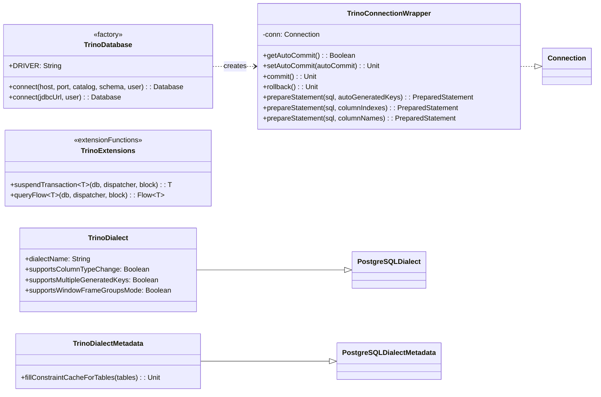

# Module bluetape4k-exposed-trino

[English](./README.md) | 한국어

JetBrains Exposed ORM과 Trino JDBC를 통합하는 모듈입니다. PostgreSQL Dialect 기반으로 Trino에서 Exposed DSL을 사용하고, 코루틴 기반 suspend 트랜잭션과 Flow 쿼리를 제공합니다.

## 개요

`bluetape4k-exposed-trino`는 다음을 제공합니다:

- **TrinoDialect**: `PostgreSQLDialect` 상속, Exposed ORM과 Trino 호환 (ALTER COLUMN TYPE / multiple generated keys 비활성화)
- **TrinoDialectMetadata**: `getImportedKeys` 미지원 우회 (FK 제약 캐싱 no-op)
- **TrinoConnectionWrapper**: Trino JDBC `prepareStatement` 오버로드 호환 래퍼, 실제 JDBC 연결을 `autoCommit=true`로 고정
- **TrinoDatabase**: JDBC URL 또는 호스트/포트/카탈로그/스키마 기반 연결 팩토리 (`object`)
- **suspendTransaction**: `Dispatchers.IO`에서 블로킹 JDBC를 suspend 함수로 래핑
- **queryFlow**: 트랜잭션 안에서 결과를 materialize 한 뒤 `Flow<T>`로 emit
- **TrinoTable**: Trino DDL에서 unsupported PRIMARY KEY / NULL 구문을 제거하는 테이블 베이스 클래스
- **@TrinoUnsupported**: Trino 미지원 기능 마커 어노테이션

## 의존성 추가

```kotlin
dependencies {
    implementation(project(":bluetape4k-exposed-trino"))
    // 또는 Maven 좌표
    implementation("io.github.bluetape4k:bluetape4k-exposed-trino:${version}")
}
```

## 기본 사용법

### 1. Trino 데이터베이스 연결

```kotlin
import io.bluetape4k.exposed.trino.TrinoDatabase

// 호스트/포트/카탈로그/스키마로 연결
val db = TrinoDatabase.connect(
    host = "trino-coordinator",
    port = 8080,
    catalog = "hive",
    schema = "default",
    user = "analyst",
)

// 또는 JDBC URL 직접 지정
val db = TrinoDatabase.connect(
    jdbcUrl = "jdbc:trino://localhost:8080/memory/default",
    user = "trino",
)
```

### 2. 동기 트랜잭션

```kotlin
import org.jetbrains.exposed.v1.jdbc.transactions.transaction
import org.jetbrains.exposed.v1.jdbc.SchemaUtils

transaction(db) {
    SchemaUtils.create(Events)
    Events.insert {
        it[eventId] = 1L
        it[region] = "kr"
    }
    val rows = Events.selectAll().toList()
}
```

> DDL을 Exposed에서 생성할 때는 일반 `Table` 대신 `TrinoTable` 상속을 권장합니다.
> Trino Memory 커넥터는 PRIMARY KEY / CONSTRAINT 구문을 지원하지 않으므로 기본 `Table`의 DDL을 그대로 쓰면 실패할 수 있습니다.

### 3. suspend 트랜잭션

```kotlin
import io.bluetape4k.exposed.trino.suspendTransaction

val rows = suspendTransaction(db) {
    Events.selectAll().where { Events.region eq "kr" }.toList()
}
```

Virtual Thread 디스패처와 함께 사용:

```kotlin
import java.util.concurrent.Executors
import kotlinx.coroutines.asCoroutineDispatcher

val vtDispatcher = Executors.newVirtualThreadPerTaskExecutor().asCoroutineDispatcher()
val rows = suspendTransaction(db, vtDispatcher) {
    Events.selectAll().toList()
}
```

### 4. Flow 쿼리

```kotlin
import io.bluetape4k.exposed.trino.queryFlow

queryFlow(db) {
    Events.selectAll().where { Events.region eq "kr" }
}.collect { row ->
    println(row[Events.eventId])
}
```

> `queryFlow`는 JDBC `ResultSet` 수명과 Exposed 트랜잭션 경계를 안전하게 유지하기 위해
> 트랜잭션 안에서 결과를 `List`로 materialize 한 뒤 emit 합니다.
> API는 `Flow`이지만, 진정한 row-by-row 스트리밍 커서는 아닙니다.
> 매우 큰 결과셋은 페이지네이션 또는 전용 배치 전략을 별도로 고려해야 합니다.

## ⚠️ 트랜잭션 동작 주의사항

Trino는 ACID 트랜잭션을 지원하지 않습니다. `transaction {}` 블록을 사용할 수 있지만, 아래 표를 참고하여 동작 차이를 반드시 인지하세요.

| 동작                 | Trino            | 일반 RDBMS     |
|--------------------|------------------|--------------|
| 원자성                | ❌ 미보장            | ✅ 보장         |
| Rollback           | ❌ no-op          | ✅ 동작         |
| Nested transaction | ⚠️ 호출 허용, 원자성 없음 | ✅ 지원         |
| Savepoint          | ❌ 미지원            | ✅ 지원         |
| autocommit 모드      | 항상 ON (변경 불가)    | ON/OFF 전환 가능 |

**실질적 영향**:

- `transaction {}` 블록 내 다중 DML 실행 시, 중간 실패가 발생하면 앞선 DML은 **롤백되지 않습니다**.
- 쓰기 블록에서는 부분 반영(partial write) 위험을 항상 고려해야 합니다.
- 읽기 전용 쿼리(`SELECT`)는 일반적으로 안전하게 사용 가능합니다.

## 지원/미지원 기능

### Trino 일반 계약 (범용)

| 기능                        | 지원 여부     | 비고                                       |
|---------------------------|-----------|------------------------------------------|
| SELECT / JOIN / 집계        | ✅         | 표준 SQL                                   |
| INSERT / UPDATE / DELETE  | ⚠️ 커넥터 의존 | 모듈은 Exposed DSL을 제공하지만 실제 지원 범위는 커넥터가 결정 |
| CREATE TABLE / DROP TABLE | ⚠️ 커넥터 의존 | 테스트는 Memory 커넥터 기준으로 검증                  |
| DDL via SchemaUtils       | ⚠️ 커넥터 의존 | `TrinoTable` 사용 권장                       |
| 윈도우 함수 (GROUPS 모드)        | ✅         | `supportsWindowFrameGroupsMode = true`   |
| 트랜잭션 원자성                  | ❌         | autocommit 전용                            |
| Rollback                  | ❌         | no-op                                    |
| Savepoint                 | ❌         | 미지원                                      |
| ALTER COLUMN TYPE         | ❌         | `supportsColumnTypeChange = false`       |
| Multiple generated keys   | ❌         | `supportsMultipleGeneratedKeys = false`  |
| FK 제약 메타데이터 조회            | ❌         | `getImportedKeys` 미지원 → no-op            |

### Memory 커넥터 테스트 범위 (테스트 환경 한정)

Testcontainers를 통한 Trino Memory 커넥터 환경에서 검증된 기능입니다.

| 기능                        | 검증 여부 | 비고                        |
|---------------------------|-------|---------------------------|
| CREATE/DROP TABLE         | ✅     | Memory 커넥터                |
| INSERT 단건/다건              | ✅     |                           |
| SELECT / WHERE / ORDER BY | ✅     |                           |
| COUNT / 집계 함수             | ✅     |                           |
| suspendTransaction        | ✅     | Dispatchers.IO            |
| queryFlow                 | ✅     | materialize 후 emit        |
| TrinoConnectionWrapper 호환 | ✅     | prepareStatement 오버로드     |
| JDBC 드라이버 자동 등록           | ✅     | TrinoDatabase 접근 시 init{} |

## 핵심 API 다이어그램



## 주요 파일/클래스 목록

| 파일                                | 설명                                                            |
|-----------------------------------|---------------------------------------------------------------|
| `TrinoDatabase.kt`                | 연결 팩토리 (호스트/포트/카탈로그 또는 JDBC URL)                              |
| `TrinoConnectionWrapper.kt`       | Trino JDBC 호환 Connection 래퍼 (실제 JDBC 연결을 autocommit=true로 고정) |
| `TrinoExtensions.kt`              | `suspendTransaction`, `queryFlow` 확장 함수                       |
| `TrinoTable.kt`                   | Trino unsupported DDL 구문(PRIMARY KEY, 명시적 NULL) 제거            |
| `TrinoUnsupported.kt`             | Trino 미지원 기능 마커 어노테이션                                         |
| `dialect/TrinoDialect.kt`         | PostgreSQLDialect 상속 Trino 다이얼렉트                              |
| `dialect/TrinoDialectMetadata.kt` | FK 제약 캐싱 no-op 구현                                             |

## 테스트

```bash
./gradlew :bluetape4k-exposed-trino:test
```

핵심 회귀 테스트 예:

```bash
./gradlew :bluetape4k-exposed-trino:test --tests "io.bluetape4k.exposed.trino.TrinoConnectionWrapperTest"
./gradlew :bluetape4k-exposed-trino:test --tests "io.bluetape4k.exposed.trino.TrinoDatabaseTest"
./gradlew :bluetape4k-exposed-trino:test --tests "io.bluetape4k.exposed.trino.TrinoTransactionAtomicityTest"
```

## Phase 2 로드맵

다음 기능은 이후 릴리즈에서 추가될 예정입니다.

| 기능                       | 설명                                             |
|--------------------------|------------------------------------------------|
| `connect(dataSource)`    | `javax.sql.DataSource` 기반 연결 팩토리 (커넥션 풀 통합)    |
| `exposed-bigquery-trino` | BigQuery → Trino → Exposed 파이프라인 통합 모듈         |
| 배치 INSERT 최적화            | Trino Bulk Insert 커넥터 지원                       |
| 결과셋 스트리밍                 | 진정한 row-by-row 커서 스트리밍 (Trino Arrow Flight 기반) |

## 참고

- [Trino](https://trino.io/)
- [Trino JDBC Driver](https://trino.io/docs/current/client/jdbc.html)
- [JetBrains Exposed](https://github.com/JetBrains/Exposed)
- [bluetape4k-exposed-duckdb](../exposed-duckdb/README.ko.md) — 유사한 in-process 분석 DB 통합 참고
