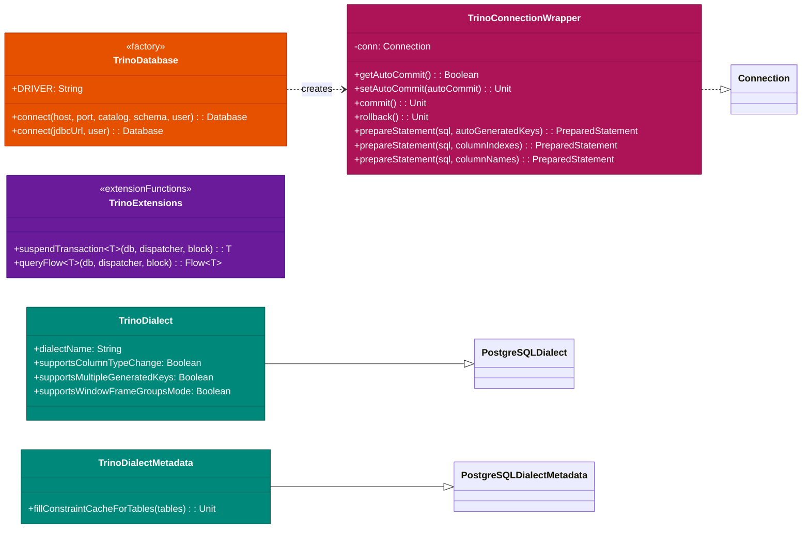
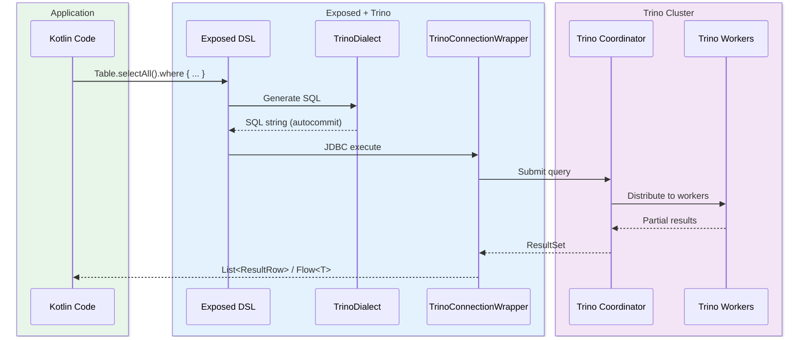

# Module bluetape4k-exposed-trino

English | [한국어](./README.ko.md)

A module that integrates JetBrains Exposed ORM with Trino JDBC. Built on PostgreSQL Dialect, it enables using the Exposed DSL with Trino and provides coroutine-based suspend transactions and Flow queries.

## Overview

`bluetape4k-exposed-trino` provides:

- **TrinoDialect**: Extends
  `PostgreSQLDialect` for Exposed ORM compatibility with Trino (disables ALTER COLUMN TYPE / multiple generated keys)
- **TrinoDialectMetadata**: Bypasses unsupported `getImportedKeys` (FK constraint caching no-op)
- **TrinoConnectionWrapper**: Compatibility wrapper for Trino JDBC
  `prepareStatement` overloads; forces the underlying JDBC connection to `autoCommit=true`
- **TrinoDatabase**: Connection factory based on JDBC URL or host/port/catalog/schema (`object`)
- **suspendTransaction**: Wraps blocking JDBC calls in a suspend function using `Dispatchers.IO`
- **queryFlow**: Materializes results inside a transaction and emits them as a `Flow<T>`
- **TrinoTable**: Base table class that strips unsupported PRIMARY KEY / NULL syntax from Trino DDL
- **@TrinoUnsupported**: Marker annotation for Trino-unsupported features

## Dependency

```kotlin
dependencies {
    implementation(project(":bluetape4k-exposed-trino"))
    // or Maven coordinates
    implementation("io.github.bluetape4k:bluetape4k-exposed-trino:${version}")
}
```

## Basic Usage

### 1. Connecting to Trino

```kotlin
import io.bluetape4k.exposed.trino.TrinoDatabase

// Connect using host/port/catalog/schema
val db = TrinoDatabase.connect(
    host = "trino-coordinator",
    port = 8080,
    catalog = "hive",
    schema = "default",
    user = "analyst",
)

// Or specify a JDBC URL directly
val db = TrinoDatabase.connect(
    jdbcUrl = "jdbc:trino://localhost:8080/memory/default",
    user = "trino",
)
```

### 2. Synchronous Transaction

```kotlin
import org.jetbrains.exposed.v1.jdbc.transactions.transaction
import org.jetbrains.exposed.v1.jdbc.SchemaUtils

transaction(db) {
    SchemaUtils.create(Events)
    Events.insert {
        it[eventId] = 1L
        it[region] = "kr"
    }
    val rows = Events.selectAll().toList()
}
```

> When generating DDL from Exposed, prefer extending `TrinoTable` over the standard `Table`.
> The Trino Memory connector does not support PRIMARY KEY / CONSTRAINT syntax, so using a plain `Table`'s DDL may fail.

### 3. Suspend Transaction

```kotlin
import io.bluetape4k.exposed.trino.suspendTransaction

val rows = suspendTransaction(db) {
    Events.selectAll().where { Events.region eq "kr" }.toList()
}
```

Using a Virtual Thread dispatcher:

```kotlin
import java.util.concurrent.Executors
import kotlinx.coroutines.asCoroutineDispatcher

val vtDispatcher = Executors.newVirtualThreadPerTaskExecutor().asCoroutineDispatcher()
val rows = suspendTransaction(db, vtDispatcher) {
    Events.selectAll().toList()
}
```

### 4. Flow Query

```kotlin
import io.bluetape4k.exposed.trino.queryFlow

queryFlow(db) {
    Events.selectAll().where { Events.region eq "kr" }
}.collect { row ->
    println(row[Events.eventId])
}
```

> To safely manage JDBC `ResultSet` lifetimes and Exposed transaction boundaries,
> `queryFlow` materializes results into a `List` inside the transaction before emitting.
> The API surface is `Flow`, but it is not a true row-by-row streaming cursor.
> For very large result sets, consider a separate pagination or dedicated batch strategy.

## ⚠️ Transaction Behavior Warning

Trino does not support ACID transactions. While
`transaction {}` blocks can be used, be sure to understand the behavioral differences in the table below.

| Behavior           | Trino                          | Standard RDBMS        |
|--------------------|--------------------------------|-----------------------|
| Atomicity          | ❌ Not guaranteed               | ✅ Guaranteed          |
| Rollback           | ❌ no-op                        | ✅ Works               |
| Nested transaction | ⚠️ Calls allowed, no atomicity | ✅ Supported           |
| Savepoint          | ❌ Not supported                | ✅ Supported           |
| Autocommit mode    | Always ON (cannot be changed)  | Can be toggled ON/OFF |

**Practical impact**:

- If a failure occurs mid-way through multiple DML operations in a
  `transaction {}` block, previously executed DML statements are **not rolled back**.
- Write blocks always carry the risk of partial writes.
- Read-only queries (`SELECT`) are generally safe to use.

## Supported / Unsupported Features

### General Trino Contract

| Feature                        | Supported              | Notes                                                                         |
|--------------------------------|------------------------|-------------------------------------------------------------------------------|
| SELECT / JOIN / Aggregation    | ✅                      | Standard SQL                                                                  |
| INSERT / UPDATE / DELETE       | ⚠️ Connector-dependent | This module provides the Exposed DSL; actual support depends on the connector |
| CREATE TABLE / DROP TABLE      | ⚠️ Connector-dependent | Tests verified against the Memory connector                                   |
| DDL via SchemaUtils            | ⚠️ Connector-dependent | Prefer `TrinoTable`                                                           |
| Window functions (GROUPS mode) | ✅                      | `supportsWindowFrameGroupsMode = true`                                        |
| Transaction atomicity          | ❌                      | Autocommit only                                                               |
| Rollback                       | ❌                      | no-op                                                                         |
| Savepoint                      | ❌                      | Not supported                                                                 |
| ALTER COLUMN TYPE              | ❌                      | `supportsColumnTypeChange = false`                                            |
| Multiple generated keys        | ❌                      | `supportsMultipleGeneratedKeys = false`                                       |
| FK constraint metadata lookup  | ❌                      | `getImportedKeys` not supported → no-op                                       |

### Memory Connector Test Coverage (test environment only)

Features verified in a Trino Memory connector environment via Testcontainers.

| Feature                              | Verified | Notes                                |
|--------------------------------------|----------|--------------------------------------|
| CREATE/DROP TABLE                    | ✅        | Memory connector                     |
| Single/batch INSERT                  | ✅        |                                      |
| SELECT / WHERE / ORDER BY            | ✅        |                                      |
| COUNT / Aggregation functions        | ✅        |                                      |
| suspendTransaction                   | ✅        | Dispatchers.IO                       |
| queryFlow                            | ✅        | Materialized before emit             |
| TrinoConnectionWrapper compatibility | ✅        | prepareStatement overloads           |
| Automatic JDBC driver registration   | ✅        | init{} block on TrinoDatabase access |

## Core API Diagram



### Distributed Query Flow



## Key Files / Classes

| File                              | Description                                                          |
|-----------------------------------|----------------------------------------------------------------------|
| `TrinoDatabase.kt`                | Connection factory (host/port/catalog or JDBC URL)                   |
| `TrinoConnectionWrapper.kt`       | Trino JDBC-compatible Connection wrapper (forces autocommit=true)    |
| `TrinoExtensions.kt`              | `suspendTransaction` and `queryFlow` extension functions             |
| `TrinoTable.kt`                   | Strips unsupported DDL syntax (PRIMARY KEY, explicit NULL) for Trino |
| `TrinoUnsupported.kt`             | Marker annotation for Trino-unsupported features                     |
| `dialect/TrinoDialect.kt`         | Trino dialect extending PostgreSQLDialect                            |
| `dialect/TrinoDialectMetadata.kt` | FK constraint caching no-op implementation                           |

## Testing

```bash
./gradlew :bluetape4k-exposed-trino:test
```

Core regression test examples:

```bash
./gradlew :bluetape4k-exposed-trino:test --tests "io.bluetape4k.exposed.trino.TrinoConnectionWrapperTest"
./gradlew :bluetape4k-exposed-trino:test --tests "io.bluetape4k.exposed.trino.TrinoDatabaseTest"
./gradlew :bluetape4k-exposed-trino:test --tests "io.bluetape4k.exposed.trino.TrinoTransactionAtomicityTest"
```

## Phase 2 Roadmap

The following features are planned for future releases.

| Feature                   | Description                                                                   |
|---------------------------|-------------------------------------------------------------------------------|
| `connect(dataSource)`     | `javax.sql.DataSource`-based connection factory (connection pool integration) |
| `exposed-bigquery-trino`  | Integrated pipeline module: BigQuery → Trino → Exposed                        |
| Batch INSERT optimization | Support for Trino Bulk Insert connectors                                      |
| Result set streaming      | True row-by-row cursor streaming (Trino Arrow Flight-based)                   |

## References

- [Trino](https://trino.io/)
- [Trino JDBC Driver](https://trino.io/docs/current/client/jdbc.html)
- [JetBrains Exposed](https://github.com/JetBrains/Exposed)
- [bluetape4k-exposed-duckdb](../exposed-duckdb/README.md) — Similar in-process analytics DB integration reference
