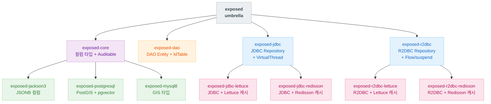
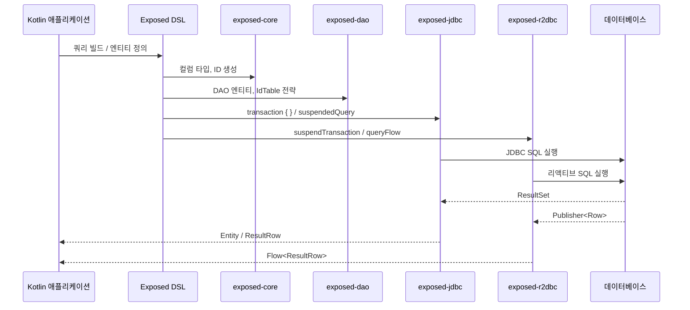

# Module bluetape4k-exposed

[English](./README.md) | 한국어

`bluetape4k-exposed-core`, `bluetape4k-exposed-dao`, `bluetape4k-exposed-jdbc` 세 모듈을 하나로 묶는 **하위 호환 Umbrella 모듈**입니다.

## 개요

기존에 `bluetape4k-exposed` 단일 모듈을 사용하던 코드는 **변경 없이** 계속 동작합니다. 신규 프로젝트에서는 실제로 필요한 하위 모듈만 직접 참조하는 것을 권장합니다.

```text
bluetape4k-exposed  (umbrella)
├── bluetape4k-exposed-core   ← 핵심 컬럼 타입, 확장 함수 (JDBC 불필요)
├── bluetape4k-exposed-dao    ← DAO 엔티티, ID 테이블 전략
└── bluetape4k-exposed-jdbc   ← JDBC Repository, 트랜잭션, 쿼리 확장
```

## 의존성 추가

### 기존 코드 (변경 없이 사용)

```kotlin
dependencies {
    // 기존과 동일하게 사용 가능
    implementation("io.github.bluetape4k:bluetape4k-exposed:${version}")
}
```

### 신규 코드 (최소 의존 권장)

- R2DBC, Jackson, 암호화/압축 컬럼 타입 등 → `bluetape4k-exposed-core`
- DAO Entity, 커스텀 IdTable (KSUID 등) → `bluetape4k-exposed-dao`
- JDBC Repository, 쿼리, 트랜잭션 → `bluetape4k-exposed-jdbc`
- 기존 코드와 하위 호환 → `bluetape4k-exposed` (이 모듈)

```kotlin
// 예: R2DBC 모듈에서는 core만 사용
dependencies {
    implementation("io.github.bluetape4k:bluetape4k-exposed-core:${version}")
}
```

```kotlin
// 예: JDBC Repository가 필요한 경우
dependencies {
    implementation("io.github.bluetape4k:bluetape4k-exposed-jdbc:${version}")
    // exposed-jdbc는 core + dao를 전이 의존성으로 포함
}
```

## 하위 모듈 상세

### bluetape4k-exposed-core

- JDBC 의존 없이 사용 가능한 기반 모듈
- 압축(LZ4/Snappy/Zstd), 암호화, 직렬화(Kryo/Fory) 컬럼 타입
- 클라이언트 측 ID 생성 확장 (`timebasedGenerated`, `snowflakeGenerated`, `ksuidGenerated`)
- `HasIdentifier<ID>`, `ExposedPage<T>` 공통 인터페이스
- `BatchInsertOnConflictDoNothing`

- 자세한 내용: `bluetape4k-exposed-core` 모듈 README 참조

### bluetape4k-exposed-dao

- `idEquals`, `idHashCode`, `entityToStringBuilder` 등 DAO Entity 보조
- `StringEntity` / `StringEntityClass` (String PK 지원)
- 커스텀 IdTable: `KsuidTable`, `KsuidMillisTable`, `SnowflakeIdTable`, `TimebasedUUIDTable`, `TimebasedUUIDBase62Table`,
  `SoftDeletedIdTable`

- 자세한 내용: `bluetape4k-exposed-dao` 모듈 README 참조

### bluetape4k-exposed-jdbc

- `ExposedRepository<T, ID>` — CRUD, 페이징, 배치 삽입/Upsert
- `SoftDeletedRepository<T, ID>` — Soft Delete 지원
- `suspendedQuery { }` — Coroutines 기반 JDBC 쿼리
- `virtualThreadTransaction { }` — JDK 21+ Virtual Thread 트랜잭션
- `SchemaUtilsExtensions`, `TableExtensions`, `ImplicitSelectAll`

- 자세한 내용: `bluetape4k-exposed-jdbc` 모듈 README 참조

## 테스트

```bash
# 개별 모듈 테스트
./gradlew :bluetape4k-exposed-core:test
./gradlew :bluetape4k-exposed-dao:test
./gradlew :bluetape4k-exposed-jdbc:test
```

## 모듈 의존성 구조



## 계층별 실행 흐름



## 참고

- [JetBrains Exposed](https://github.com/JetBrains/Exposed)
- bluetape4k-exposed-core
- bluetape4k-exposed-dao
- bluetape4k-exposed-jdbc
