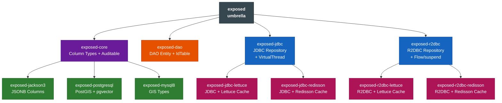
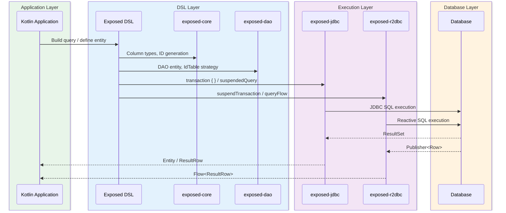

# Module bluetape4k-exposed

English | [한국어](./README.ko.md)

A **backward-compatible umbrella module** that bundles `bluetape4k-exposed-core`, `bluetape4k-exposed-dao`, and
`bluetape4k-exposed-jdbc` together.

## Overview

Existing code that depends on the single `bluetape4k-exposed` module continues to work **without any changes
**. For new projects, we recommend referencing only the specific sub-modules you actually need.

```text
bluetape4k-exposed  (umbrella)
├── bluetape4k-exposed-core   ← Core column types and extension functions (no JDBC dependency)
├── bluetape4k-exposed-dao    ← DAO entities and ID table strategies
└── bluetape4k-exposed-jdbc   ← JDBC Repository, transactions, and query extensions
```

## Adding Dependencies

### Existing Code (no changes required)

```kotlin
dependencies {
    // Works exactly as before
    implementation("io.github.bluetape4k:bluetape4k-exposed:${version}")
}
```

### New Code (prefer minimal dependencies)

- R2DBC, Jackson, encrypted/compressed column types, etc. → `bluetape4k-exposed-core`
- DAO entities, custom IdTable (KSUID, etc.) → `bluetape4k-exposed-dao`
- JDBC Repository, queries, transactions → `bluetape4k-exposed-jdbc`
- Backward compatibility with existing code → `bluetape4k-exposed` (this module)

```kotlin
// Example: use only core in an R2DBC module
dependencies {
    implementation("io.github.bluetape4k:bluetape4k-exposed-core:${version}")
}
```

```kotlin
// Example: when a JDBC Repository is needed
dependencies {
    implementation("io.github.bluetape4k:bluetape4k-exposed-jdbc:${version}")
    // exposed-jdbc transitively includes core + dao
}
```

## Sub-Module Details

### bluetape4k-exposed-core

- Foundation module usable without a JDBC dependency
- Compressed (LZ4/Snappy/Zstd), encrypted, and serialized (Kryo/Fory) column types
- Client-side ID generation extensions (`timebasedGenerated`, `snowflakeGenerated`, `ksuidGenerated`)
- Common interfaces: `HasIdentifier<ID>`, `ExposedPage<T>`
- `BatchInsertOnConflictDoNothing`

See the `bluetape4k-exposed-core` module README for details.

### bluetape4k-exposed-dao

- DAO Entity helpers: `idEquals`, `idHashCode`, `entityToStringBuilder`
- `StringEntity` / `StringEntityClass` (String primary key support)
- Custom IdTables: `KsuidTable`, `KsuidMillisTable`, `SnowflakeIdTable`, `TimebasedUUIDTable`,
  `TimebasedUUIDBase62Table`, `SoftDeletedIdTable`

See the `bluetape4k-exposed-dao` module README for details.

### bluetape4k-exposed-jdbc

- `ExposedRepository<T, ID>` — CRUD, pagination, batch insert/upsert
- `SoftDeletedRepository<T, ID>` — Soft delete support
- `suspendedQuery { }` — Coroutines-based JDBC queries
- `virtualThreadTransaction { }` — JDK 21+ Virtual Thread transactions
- `SchemaUtilsExtensions`, `TableExtensions`, `ImplicitSelectAll`

See the `bluetape4k-exposed-jdbc` module README for details.

## Testing

```bash
# Test individual modules
./gradlew :bluetape4k-exposed-core:test
./gradlew :bluetape4k-exposed-dao:test
./gradlew :bluetape4k-exposed-jdbc:test
```

## Module Dependency Graph



## Layered Execution Flow



## References

- [JetBrains Exposed](https://github.com/JetBrains/Exposed)
- bluetape4k-exposed-core
- bluetape4k-exposed-dao
- bluetape4k-exposed-jdbc
