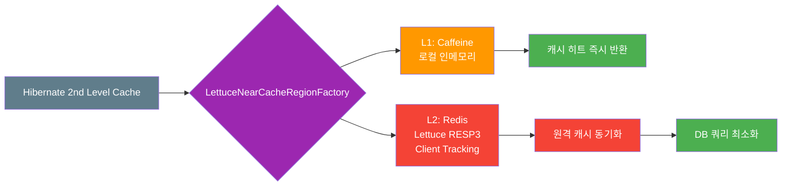
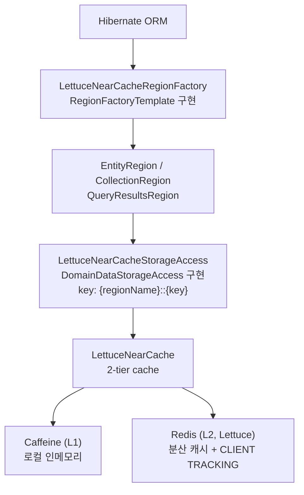
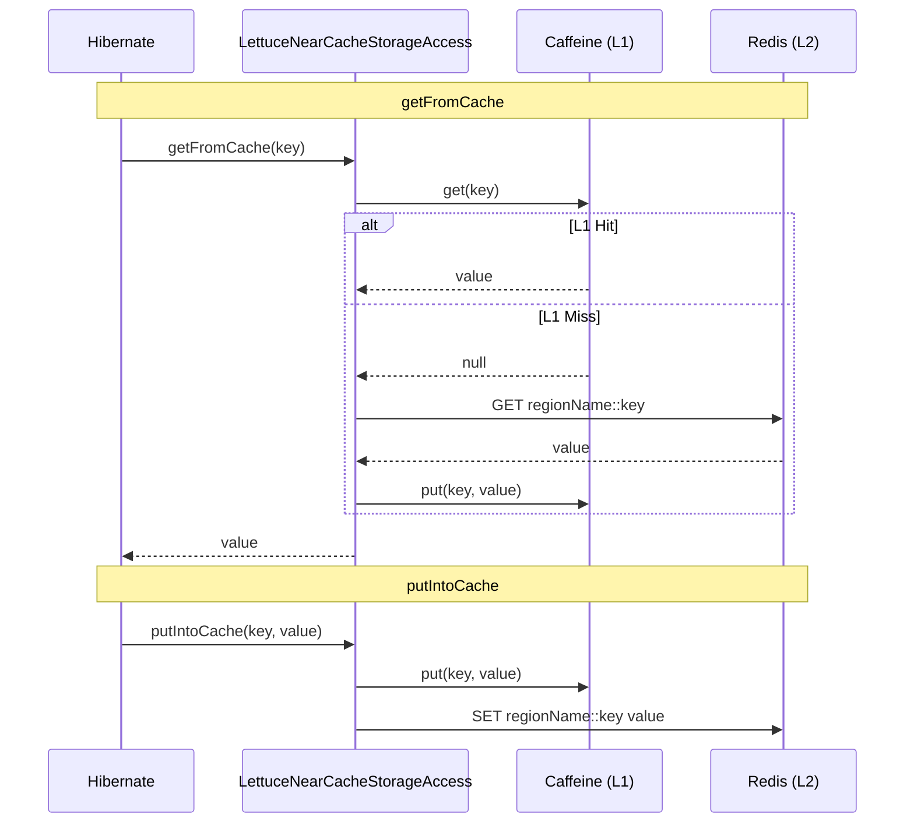

# infra-hibernate-cache-lettuce

Hibernate 7 **2nd Level Cache** 구현체 — Lettuce Near Cache(Caffeine L1 + Redis L2) 기반.
`hibernate.cache.lettuce.*` Hibernate properties 설정만으로 모든 Region에 Near Cache가 자동 적용된다.

> Near Cache 코어는 `bluetape4k-projects` 의 `bluetape4k-cache-lettuce` 모듈을 사용한다.
> Spring Boot 4와 통합하려면 [`spring-boot/hibernate-lettuce`](../../spring-boot/hibernate-lettuce/README.md) 참조.

## 아키텍처

### Near Cache 2-Tier 구조



### 레이어 구조



- **Region 격리**: 각 Region은 독립된 `LettuceNearCache` 인스턴스를 가짐
- **키 prefix**: `{regionName}::{key}` 형식으로 Redis 키 충돌 방지
- **AccessType**: `NONSTRICT_READ_WRITE` 권장 (분산 캐시에서 soft-lock 불필요)

## 최근 변경

- `LettuceNearCacheStorageAccess.evictData()`를 region local-only clear에서 **local + Redis clearAll**로 변경
- 테스트에서 `session.get()`을 `session.find()`로 교체해 Hibernate deprecated API 제거
- One-To-Many / Many-To-One / Many-To-Many 관계 엔티티 캐시 시나리오 테스트 추가

## 의존성

```kotlin
// build.gradle.kts
dependencies {
    implementation(project(":hibernate-cache-lettuce"))

    // 런타임 직렬화 (필수 - bluetape4k-io의 optional 의존성이므로 명시 필요)
    implementation(Libs.fory_kotlin)  // Apache Fory
    implementation(Libs.lz4_java)     // LZ4 압축
}
```

## 설정

### Hibernate Properties

```properties
# Region Factory 등록 (필수)
hibernate.cache.region.factory_class=io.bluetape4k.hibernate.cache.lettuce.LettuceNearCacheRegionFactory
hibernate.cache.use_second_level_cache=true

# Redis 연결
hibernate.cache.lettuce.redis_uri=redis://localhost:6379

# 직렬화 코덱 (lz4fory | fory | kryo | lz4kryo | lz4jdk | gzipfory | zstdfory | jdk)
hibernate.cache.lettuce.codec=lz4fory

# RESP3 + CLIENT TRACKING 활성화 (Redis 6+ 필요)
hibernate.cache.lettuce.use_resp3=true

# L1 (Caffeine) 설정
hibernate.cache.lettuce.local.max_size=10000
hibernate.cache.lettuce.local.expire_after_write=30m

# Redis TTL (기본, ms/s/m/h 단위 지원)
hibernate.cache.lettuce.redis_ttl.default=120s

# Region별 TTL 오버라이드
hibernate.cache.lettuce.redis_ttl.io.example.Product=300s
hibernate.cache.lettuce.redis_ttl.io.example.Order=600s

# timestamps region은 query cache invalidation 정확성을 위해 TTL 비활성화

# Caffeine 통계 수집 (Metrics 연동 시 활성화)
hibernate.cache.lettuce.local.record_stats=false
```

### application.yml (Spring Boot 없이 직접 사용)

```yaml
spring:
  jpa:
    properties:
      hibernate:
        cache:
          region.factory_class: io.bluetape4k.hibernate.cache.lettuce.LettuceNearCacheRegionFactory
          use_second_level_cache: true
          lettuce:
            redis_uri: redis://localhost:6379
            codec: lz4fory
            use_resp3: true
            local:
              max_size: 10000
              expire_after_write: 30m
            redis_ttl:
              default: 120s
```

지원 codec 값은 `jdk`, `kryo`, `fory`, `gzip*`, `lz4*`, `snappy*`, `zstd*` 계열이며,
오타나 미지원 codec 이름은 기본값으로 대체하지 않고 즉시 예외로 실패합니다.

## Entity 설정

```kotlin
@Entity
@Cacheable
@Cache(usage = CacheConcurrencyStrategy.NONSTRICT_READ_WRITE)
class Product(
    @Id @GeneratedValue
    val id: Long = 0,
    val name: String = "",
    val price: BigDecimal = BigDecimal.ZERO,
)
```

### 컬렉션 캐싱

```kotlin
@OneToMany(mappedBy = "category")
@Cache(usage = CacheConcurrencyStrategy.NONSTRICT_READ_WRITE)
val products: MutableList<Product> = mutableListOf()
```

`NONSTRICT_READ_WRITE`를 권장한다. 분산 Redis 환경에서는 soft-lock 기반의 `READ_WRITE`가 추가 overhead를 발생시키기 때문이다.

## 동작 방식

#### getFromCache / putIntoCache 흐름



| 연산                        | 동작                                                        |
|---------------------------|-----------------------------------------------------------|
| `getFromCache`            | L1(Caffeine) hit → 즉시 반환 / miss → Redis GET → L1 populate |
| `putIntoCache`            | L1 + L2 동시 write-through                                  |
| `evictData(key)`          | L1 + L2 해당 key 삭제                                         |
| `evictData()` (region 전체) | L1 + L2 전체 제거 (`clearAll()`)                              |
| 외부 Redis 변경 감지            | RESP3 CLIENT TRACKING push → L1 자동 무효화                    |

## 지원 코덱

| 코덱 이름 | 설명 | 압축 |
|-----------|------|------|
| `lz4fory` | LZ4 + Apache Fory **(기본값)** | LZ4 |
| `fory` | Apache Fory | - |
| `gzipfory` | GZip + Apache Fory | GZip |
| `zstdfory` | Zstd + Apache Fory | Zstd |
| `kryo` | Kryo | - |
| `lz4kryo` | LZ4 + Kryo | LZ4 |
| `jdk` | Java 직렬화 | - |
| `lz4jdk` | LZ4 + Java 직렬화 | LZ4 |

## TTL 단위

`ms` (밀리초) · `s` (초) · `m` (분) · `h` (시간) · (없음 = 초)

## 테스트 실행

```bash
./gradlew :hibernate-cache-lettuce:test
```

Testcontainers로 Redis 7+를 자동 실행하며 H2 인메모리 DB를 사용한다.

## 주의 사항

- **timestamps region TTL 비활성화**:
  `default-update-timestamps-region`은 query cache invalidation 계약 때문에 Redis TTL을 적용하지 않는다.
- **H2 버전**: Hibernate 7은 H2 v2 (`com.h2database:h2:2.x`) 필요.
- **Redis 6+**: `use_resp3=true` (기본값) 사용 시 필요. 하위 버전은 `use_resp3=false` 설정.
