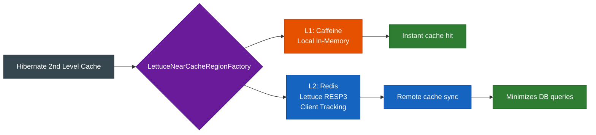
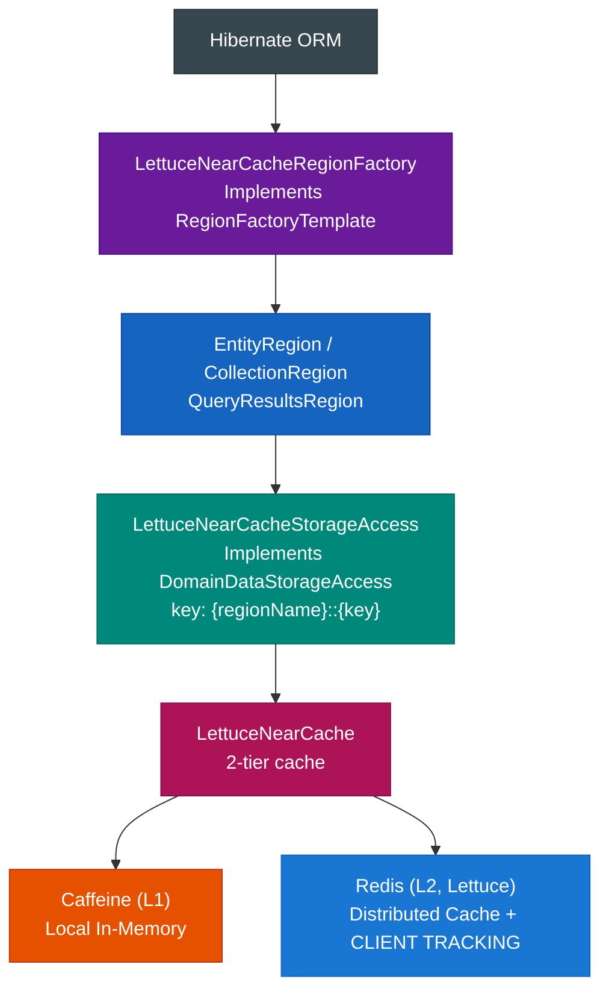
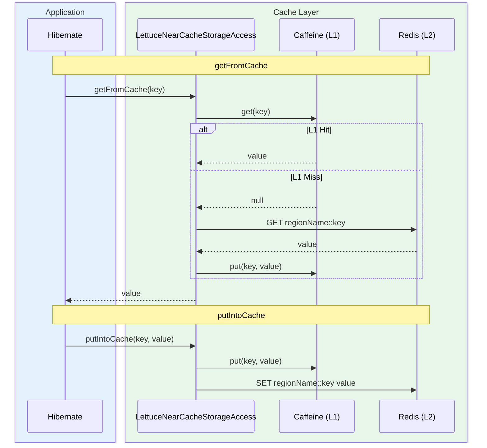

# infra-hibernate-cache-lettuce

English | [한국어](./README.ko.md)

Hibernate 7 **2nd Level Cache** implementation backed by Lettuce Near Cache (Caffeine L1 + Redis L2). Simply configure
`hibernate.cache.lettuce.*` properties and Near Cache is automatically applied to all regions.

> The Near Cache core uses the `bluetape4k-cache-lettuce` module from `bluetape4k-projects`.
> For Spring Boot 4 integration, see [`spring-boot/hibernate-lettuce`](../../spring-boot/hibernate-lettuce/README.md).

## Architecture

### Near Cache 2-Tier Structure



### Layer Structure



- **Region Isolation**: Each region gets its own `LettuceNearCache` instance
- **Key Prefix**: Redis key collision is prevented using the `{regionName}::{key}` format
- **AccessType**: `NONSTRICT_READ_WRITE` is recommended (soft-locking is unnecessary in a distributed cache)

## Recent Changes

- Changed `LettuceNearCacheStorageAccess.evictData()` from region local-only clear to **local + Redis clearAll**
- Replaced `session.get()` with `session.find()` in tests to remove deprecated Hibernate API usage
- Added cache scenario tests for One-To-Many, Many-To-One, and Many-To-Many relationships

## Dependencies

```kotlin
// build.gradle.kts
dependencies {
    implementation(project(":hibernate-cache-lettuce"))

    // Runtime serialization (required — must be declared explicitly since bluetape4k-io uses optional dependencies)
    implementation(Libs.fory_kotlin)  // Apache Fory
    implementation(Libs.lz4_java)     // LZ4 compression
}
```

## Configuration

### Hibernate Properties

```properties
# Register the Region Factory (required)
hibernate.cache.region.factory_class=io.bluetape4k.hibernate.cache.lettuce.LettuceNearCacheRegionFactory
hibernate.cache.use_second_level_cache=true

# Redis connection
hibernate.cache.lettuce.redis_uri=redis://localhost:6379

# Serialization codec (lz4fory | fory | kryo | lz4kryo | lz4jdk | gzipfory | zstdfory | jdk)
hibernate.cache.lettuce.codec=lz4fory

# Enable RESP3 + CLIENT TRACKING (requires Redis 6+)
hibernate.cache.lettuce.use_resp3=true

# L1 (Caffeine) settings
hibernate.cache.lettuce.local.max_size=10000
hibernate.cache.lettuce.local.expire_after_write=30m

# Redis TTL (default; supports ms/s/m/h units)
hibernate.cache.lettuce.redis_ttl.default=120s

# Per-region TTL overrides
hibernate.cache.lettuce.redis_ttl.io.example.Product=300s
hibernate.cache.lettuce.redis_ttl.io.example.Order=600s

# TTL is disabled for the timestamps region to maintain query cache invalidation accuracy

# Enable Caffeine statistics collection (activate when integrating Metrics)
hibernate.cache.lettuce.local.record_stats=false
```

### application.yml (when used without Spring Boot)

```yaml
spring:
  jpa:
    properties:
      hibernate:
        cache:
          region.factory_class: io.bluetape4k.hibernate.cache.lettuce.LettuceNearCacheRegionFactory
          use_second_level_cache: true
          lettuce:
            redis_uri: redis://localhost:6379
            codec: lz4fory
            use_resp3: true
            local:
              max_size: 10000
              expire_after_write: 30m
            redis_ttl:
              default: 120s
```

Supported codec values include the `jdk`, `kryo`, `fory`, `gzip*`, `lz4*`, `snappy*`, and
`zstd*` families. Typos or unsupported codec names cause an immediate exception rather than silently falling back to a default.

## Entity Configuration

```kotlin
@Entity
@Cacheable
@Cache(usage = CacheConcurrencyStrategy.NONSTRICT_READ_WRITE)
class Product(
    @Id @GeneratedValue
    val id: Long = 0,
    val name: String = "",
    val price: BigDecimal = BigDecimal.ZERO,
)
```

### Collection Caching

```kotlin
@OneToMany(mappedBy = "category")
@Cache(usage = CacheConcurrencyStrategy.NONSTRICT_READ_WRITE)
val products: MutableList<Product> = mutableListOf()
```

`NONSTRICT_READ_WRITE` is recommended because soft-lock-based
`READ_WRITE` introduces additional overhead in a distributed Redis environment.

## How It Works

#### getFromCache / putIntoCache Flow



| Operation                       | Behavior                                                               |
|---------------------------------|------------------------------------------------------------------------|
| `getFromCache`                  | L1 (Caffeine) hit → return immediately; miss → Redis GET → populate L1 |
| `putIntoCache`                  | Write-through to both L1 and L2 simultaneously                         |
| `evictData(key)`                | Delete the key from both L1 and L2                                     |
| `evictData()` (entire region)   | Remove all entries from L1 and L2 (`clearAll()`)                       |
| External Redis change detection | RESP3 CLIENT TRACKING push → automatic L1 invalidation                 |

## Supported Codecs

| Codec Name | Description                     | Compression |
|------------|---------------------------------|-------------|
| `lz4fory`  | LZ4 + Apache Fory **(default)** | LZ4         |
| `fory`     | Apache Fory                     | -           |
| `gzipfory` | GZip + Apache Fory              | GZip        |
| `zstdfory` | Zstd + Apache Fory              | Zstd        |
| `kryo`     | Kryo                            | -           |
| `lz4kryo`  | LZ4 + Kryo                      | LZ4         |
| `jdk`      | Java serialization              | -           |
| `lz4jdk`   | LZ4 + Java serialization        | LZ4         |

## TTL Units

`ms` (milliseconds) · `s` (seconds) · `m` (minutes) · `h` (hours) · (no suffix = seconds)

## Running Tests

```bash
./gradlew :hibernate-cache-lettuce:test
```

Redis 7+ is automatically started via Testcontainers; an H2 in-memory database is used.

## Notes

- **Disable TTL for the timestamps region**:
  Redis TTL is not applied to
  `default-update-timestamps-region` in order to preserve the query cache invalidation contract.
- **H2 Version**: Hibernate 7 requires H2 v2 (`com.h2database:h2:2.x`).
- **Redis 6+**: Required when `use_resp3=true` (the default). For older Redis versions, set `use_resp3=false`.
