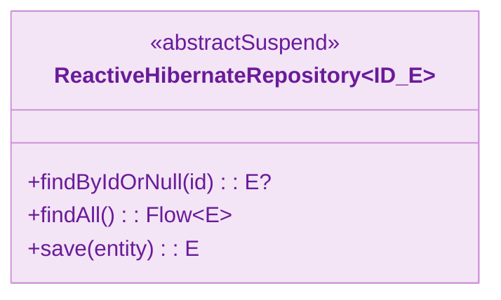
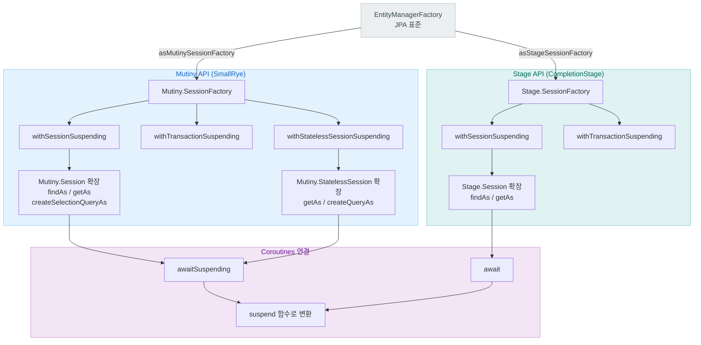
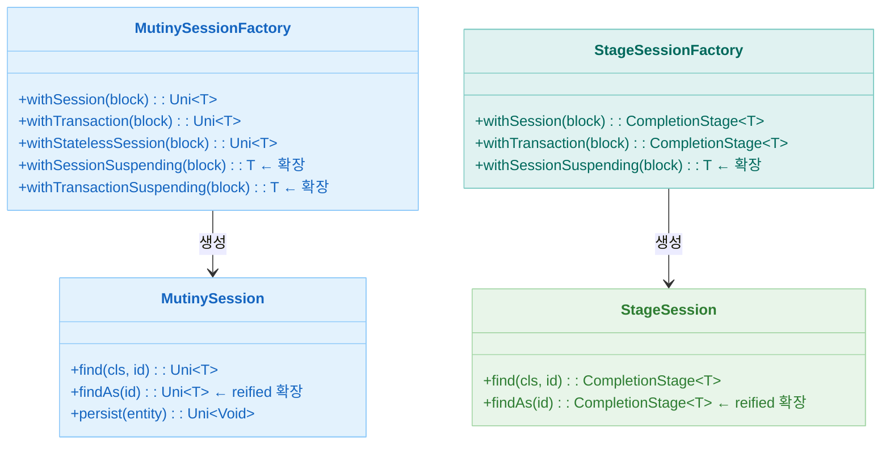

# Module bluetape4k-hibernate-reactive

[English](./README.md) | 한국어

Hibernate Reactive(Mutiny/Stage) 사용 시 반복 코드를 줄이는 Kotlin 확장 라이브러리입니다.

## 주요 기능

- **EntityManagerFactory 변환**: JPA `EntityManagerFactory` -> `Mutiny/Stage SessionFactory`
- **Coroutine 친화 SessionFactory API**: `withSessionSuspending`, `withTransactionSuspending`
- **Mutiny Session 확장**: `findAs/getAs/create*QueryAs/createEntityGraphAs` 등 reified 함수
- **Stage Session 확장**: Mutiny와 동일한 패턴의 reified 함수
- **StatelessSession 지원**: 트랜잭션/조회/쿼리 보조 API 제공

## 의존성 추가

```kotlin
dependencies {
    implementation("io.github.bluetape4k:bluetape4k-hibernate-reactive:${version}")
}
```

## 주요 기능 상세

### 1. SessionFactory 변환

- `mutiny/EntityManagerFactorySupport.kt`
- `stage/EntityManagerFactorySupport.kt`

```kotlin
val mutinySf = emf.asMutinySessionFactory()
val stageSf = emf.asStageSessionFactory()
```

### 2. Coroutine SessionFactory API

- `mutiny/SessionFactorySupport.kt`
- `stage/SessionFactorySupport.kt`

```kotlin
val count = sf.withTransactionSuspending { session, _ ->
    session.createSelectionQueryAs<Long>("select count(a) from Author a")
        .singleResult
        .await()
        .toLong()
}
```

### 3. Mutiny Session / StatelessSession 확장

- `mutiny/SessionSupport.kt`
- `mutiny/StatelessSessionSupport.kt`

```kotlin
sf.withSessionSuspending { session ->
    val book = session.findAs<Book>(bookId).awaitSuspending()
}

sf.withStatelessSessionSuspending { session ->
    val author = session.getAs<Author>(authorId).awaitSuspending()
}
```

### 4. Stage Session / StatelessSession 확장

- `stage/SessionSupport.kt`
- `stage/StatelessSessionSupport.kt`

```kotlin
sf.withSessionSuspending { session ->
    session.findAs<Author>(authorId).await()
}
```

### 5. 예제 테스트

- `src/test/kotlin/io/bluetape4k/hibernate/reactive/examples/mutiny/*`
- `src/test/kotlin/io/bluetape4k/hibernate/reactive/examples/stage/*`

확장 함수 커버리지 향상을 위한 주요 테스트 클래스:

| 테스트 클래스 | API | 검증 함수 |
|---|---|---|
| `MutinySessionSupportTest` | Mutiny | `findAs(LockMode)`, `getReferenceAs`, `createQueryAs`(Session), `createNativeQueryAs`(Session/StatelessSession), `getAs(LockMode)` |
| `StageSessionSupportTest` | Stage | `findAs(LockMode)`, `getReferenceAs`, `createQueryAs`(Session), `createNativeQueryAs`(Session/StatelessSession), `getAs(LockMode)` |

```kotlin
// Hibernate LockMode 오버로드 (JPA LockModeType과 구분)
sf.withSessionSuspending { session ->
    session.findAs<Book>(book.id, LockMode.NONE).awaitSuspending()
}

// getReferenceAs — 프록시 참조, id 조회 시 DB 접근 없음
sf.withSessionSuspending { session ->
    val ref = session.getReferenceAs<Book>(book.id)
    ref.id  // DB 왕복 없이 접근 가능
}

// Session에서 createNativeQueryAs 사용
sf.withSessionSuspending { session ->
    session.createNativeQueryAs<Long>("SELECT COUNT(*) FROM books")
        .singleResult.awaitSuspending()
}
```

## 아키텍처 다이어그램

### Reactive Repository 클래스 구조



### Hibernate Reactive API 구조



### 세션 유형 비교



## 버전 요구사항

**Hibernate Reactive 3.2.0.Final** 필수 환경:
- Hibernate ORM 7.2.7.Final (ORM 7.2.x 대상)
- Jakarta Persistence 3.0 namespace in `persistence.xml`
- Java 11+ / Kotlin 1.5+

### JPA 영속성 설정 업데이트

Hibernate Reactive 2.x에서 3.x로 업그레이드 시:

1. **namespace 변경** in `src/main/resources/META-INF/persistence.xml`:
   ```xml
   <!-- 기존 (JPA 2.0) -->
   <persistence xmlns="http://java.sun.com/xml/ns/persistence" version="2.0">

   <!-- 신규 (Jakarta Persistence 3.0) -->
   <persistence xmlns="https://jakarta.ee/xml/ns/persistence" version="3.0">
   ```

2. **엔티티 명시적 등록** (jar-file 경로 방식 대체):
   ```xml
   <!-- 기존 방식 (지원 중단) -->
   <jar-file>jar:file:///path/to/entities.jar!/</jar-file>

   <!-- 신규 방식 (필수) -->
   <class>io.bluetape4k.example.Author</class>
   <class>io.bluetape4k.example.Book</class>
   ```

3. **Validator 설정** Jakarta EL 구현체(GlassFish Expressly 6.0.0) 필요

## 참고

- [Hibernate Reactive](https://hibernate.org/reactive/)
- [Hibernate ORM 7.2 Release Notes](https://hibernate.org/orm/)
- [Jakarta Persistence 3.0](https://jakarta.ee/specifications/persistence/3.0/)
- [Mutiny](https://smallrye.io/smallrye-mutiny/)
