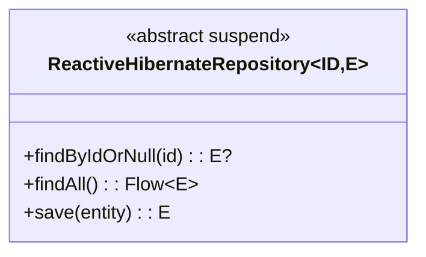
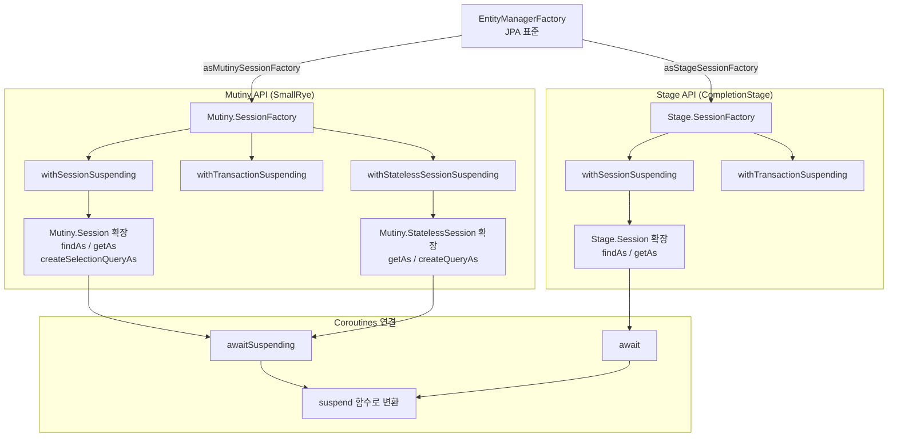
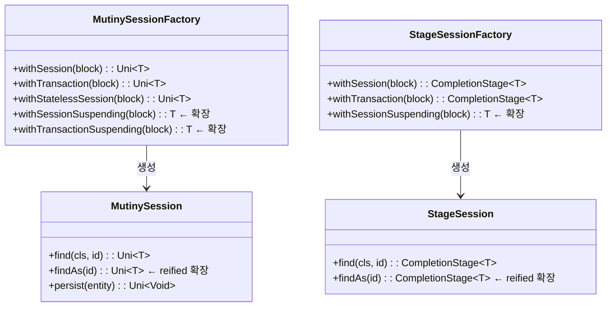

# Module bluetape4k-hibernate-reactive

Hibernate Reactive(Mutiny/Stage) 사용 시 반복 코드를 줄이는 Kotlin 확장 라이브러리입니다.

## 주요 기능

- **EntityManagerFactory 변환**: JPA `EntityManagerFactory` -> `Mutiny/Stage SessionFactory`
- **Coroutine 친화 SessionFactory API**: `withSessionSuspending`, `withTransactionSuspending`
- **Mutiny Session 확장**: `findAs/getAs/create*QueryAs/createEntityGraphAs` 등 reified 함수
- **Stage Session 확장**: Mutiny와 동일한 패턴의 reified 함수
- **StatelessSession 지원**: 트랜잭션/조회/쿼리 보조 API 제공

## 의존성 추가

```kotlin
dependencies {
    implementation("io.github.bluetape4k:bluetape4k-hibernate-reactive:${version}")
}
```

## 주요 기능 상세

### 1. SessionFactory 변환

- `mutiny/EntityManagerFactorySupport.kt`
- `stage/EntityManagerFactorySupport.kt`

```kotlin
val mutinySf = emf.asMutinySessionFactory()
val stageSf = emf.asStageSessionFactory()
```

### 2. Coroutine SessionFactory API

- `mutiny/SessionFactorySupport.kt`
- `stage/SessionFactorySupport.kt`

```kotlin
val count = sf.withTransactionSuspending { session, _ ->
    session.createSelectionQueryAs<Long>("select count(a) from Author a")
        .singleResult
        .await()
        .toLong()
}
```

### 3. Mutiny Session / StatelessSession 확장

- `mutiny/SessionSupport.kt`
- `mutiny/StatelessSessionSupport.kt`

```kotlin
sf.withSessionSuspending { session ->
    val book = session.findAs<Book>(bookId).awaitSuspending()
}

sf.withStatelessSessionSuspending { session ->
    val author = session.getAs<Author>(authorId).awaitSuspending()
}
```

### 4. Stage Session / StatelessSession 확장

- `stage/SessionSupport.kt`
- `stage/StatelessSessionSupport.kt`

```kotlin
sf.withSessionSuspending { session ->
    session.findAs<Author>(authorId).await()
}
```

### 5. 예제 테스트

- `src/test/kotlin/io/bluetape4k/hibernate/reactive/examples/mutiny/*`
- `src/test/kotlin/io/bluetape4k/hibernate/reactive/examples/stage/*`

## 아키텍처 다이어그램

### Reactive Repository 클래스 구조



### Hibernate Reactive API 구조



### 세션 유형 비교



## 참고

- [Hibernate Reactive](https://hibernate.org/reactive/)
- [Mutiny](https://smallrye.io/smallrye-mutiny/)
