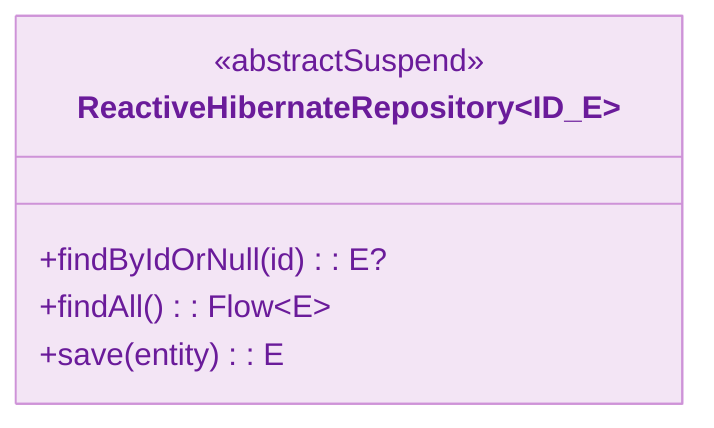
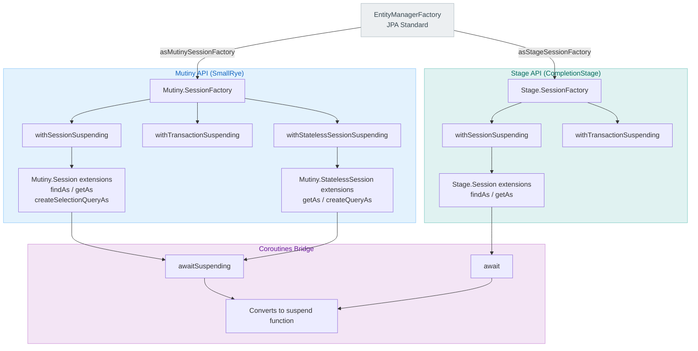
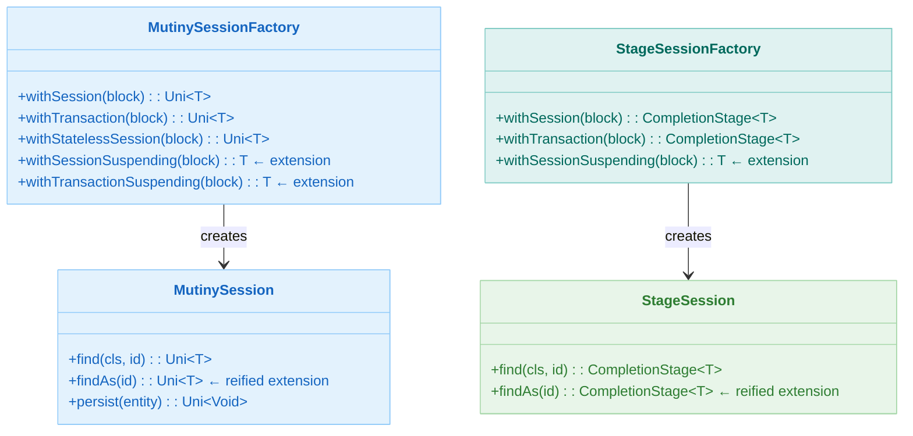

# Module bluetape4k-hibernate-reactive

English | [한국어](./README.ko.md)

A Kotlin extension library that eliminates boilerplate when working with Hibernate Reactive (Mutiny/Stage).

## Key Features

- **EntityManagerFactory Conversion**: JPA `EntityManagerFactory` → `Mutiny/Stage SessionFactory`
- **Coroutine-Friendly SessionFactory API**: `withSessionSuspending`, `withTransactionSuspending`
- **Mutiny Session Extensions**: Reified functions such as `findAs`, `getAs`, `create*QueryAs`, `createEntityGraphAs`
- **Stage Session Extensions**: Reified functions following the same patterns as the Mutiny API
- **StatelessSession Support**: Transaction, lookup, and query helper APIs

## Dependency

```kotlin
dependencies {
    implementation("io.github.bluetape4k:bluetape4k-hibernate-reactive:${version}")
}
```

## Feature Details

### 1. SessionFactory Conversion

- `mutiny/EntityManagerFactorySupport.kt`
- `stage/EntityManagerFactorySupport.kt`

```kotlin
val mutinySf = emf.asMutinySessionFactory()
val stageSf = emf.asStageSessionFactory()
```

### 2. Coroutine SessionFactory API

- `mutiny/SessionFactorySupport.kt`
- `stage/SessionFactorySupport.kt`

```kotlin
val count = sf.withTransactionSuspending { session, _ ->
    session.createSelectionQueryAs<Long>("select count(a) from Author a")
        .singleResult
        .await()
        .toLong()
}
```

### 3. Mutiny Session / StatelessSession Extensions

- `mutiny/SessionSupport.kt`
- `mutiny/StatelessSessionSupport.kt`

```kotlin
sf.withSessionSuspending { session ->
    val book = session.findAs<Book>(bookId).awaitSuspending()
}

sf.withStatelessSessionSuspending { session ->
    val author = session.getAs<Author>(authorId).awaitSuspending()
}
```

### 4. Stage Session / StatelessSession Extensions

- `stage/SessionSupport.kt`
- `stage/StatelessSessionSupport.kt`

```kotlin
sf.withSessionSuspending { session ->
    session.findAs<Author>(authorId).await()
}
```

### 5. Example Tests

- `src/test/kotlin/io/bluetape4k/hibernate/reactive/examples/mutiny/*`
- `src/test/kotlin/io/bluetape4k/hibernate/reactive/examples/stage/*`

## Architecture Diagrams

### Reactive Repository Class Structure



### Hibernate Reactive API Structure



### Session Type Comparison



## References

- [Hibernate Reactive](https://hibernate.org/reactive/)
- [Mutiny](https://smallrye.io/smallrye-mutiny/)
