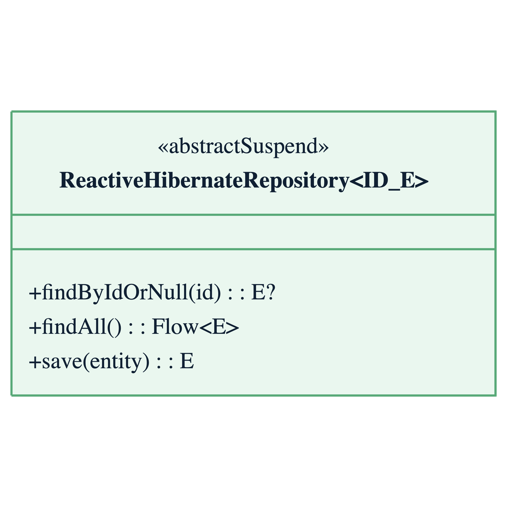
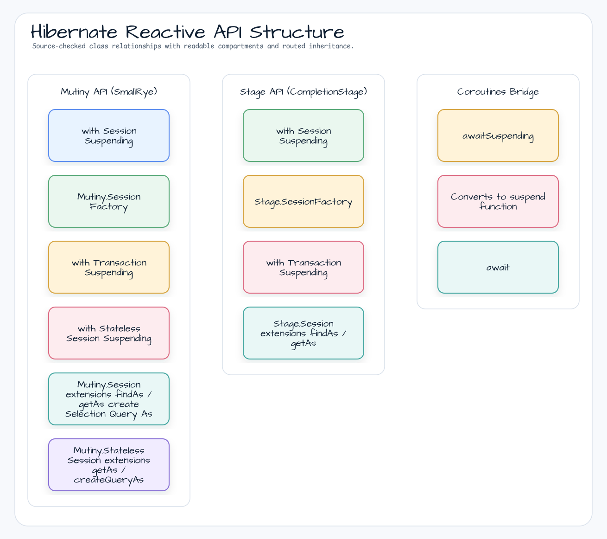
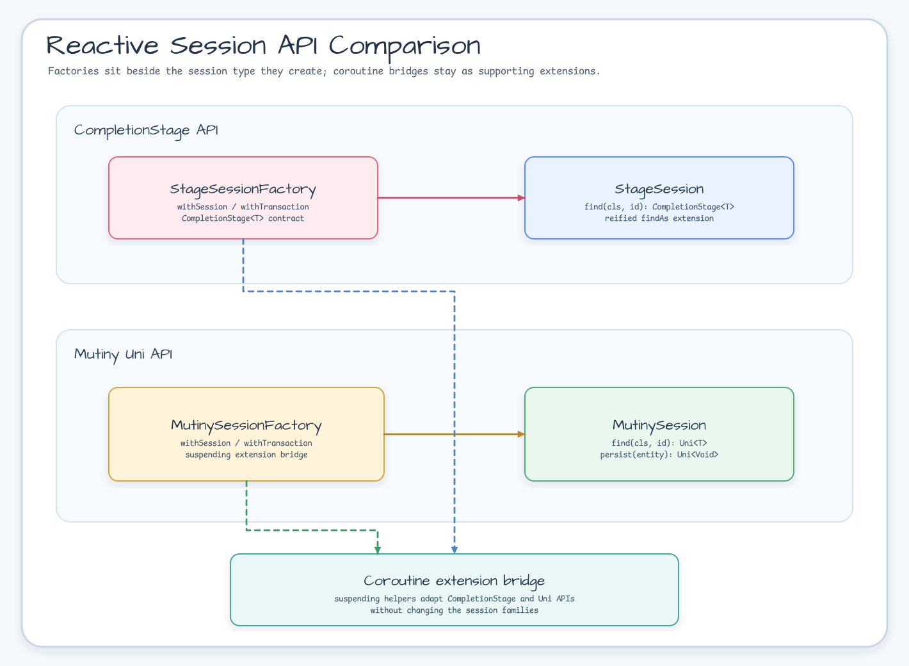

# Module bluetape4k-hibernate-reactive

English | [한국어](./README.ko.md)

A Kotlin extension library that eliminates boilerplate when working with Hibernate Reactive (Mutiny/Stage).

## Key Features

- **EntityManagerFactory Conversion**: JPA `EntityManagerFactory` → `Mutiny/Stage SessionFactory`
- **Coroutine-Friendly SessionFactory API**: `withSessionSuspending`, `withTransactionSuspending`
- **Mutiny Session Extensions**: Reified functions such as `findAs`, `getAs`, `create*QueryAs`, `createEntityGraphAs`
- **Stage Session Extensions**: Reified functions following the same patterns as the Mutiny API
- **StatelessSession Support**: Transaction, lookup, and query helper APIs

## Dependency

```kotlin
dependencies {
    implementation("io.github.bluetape4k:bluetape4k-hibernate-reactive:${version}")
}
```

## Feature Details

### 1. SessionFactory Conversion

- `mutiny/EntityManagerFactorySupport.kt`
- `stage/EntityManagerFactorySupport.kt`

```kotlin
val mutinySf = emf.asMutinySessionFactory()
val stageSf = emf.asStageSessionFactory()
```

### 2. Coroutine SessionFactory API

- `mutiny/SessionFactorySupport.kt`
- `stage/SessionFactorySupport.kt`

```kotlin
val count = sf.withTransactionSuspending { session, _ ->
    session.createSelectionQueryAs<Long>("select count(a) from Author a")
        .singleResult
        .await()
        .toLong()
}
```

### 3. Mutiny Session / StatelessSession Extensions

- `mutiny/SessionSupport.kt`
- `mutiny/StatelessSessionSupport.kt`

```kotlin
sf.withSessionSuspending { session ->
    val book = session.findAs<Book>(bookId).awaitSuspending()
}

sf.withStatelessSessionSuspending { session ->
    val author = session.getAs<Author>(authorId).awaitSuspending()
}
```

### 4. Stage Session / StatelessSession Extensions

- `stage/SessionSupport.kt`
- `stage/StatelessSessionSupport.kt`

```kotlin
sf.withSessionSuspending { session ->
    session.findAs<Author>(authorId).await()
}
```

### 5. Example Tests

- `src/test/kotlin/io/bluetape4k/hibernate/reactive/examples/mutiny/*`
- `src/test/kotlin/io/bluetape4k/hibernate/reactive/examples/stage/*`

Key test classes covering uncovered extension functions:

| Test Class | API | Covered Functions |
|---|---|---|
| `MutinySessionSupportTest` | Mutiny | `findAs(LockMode)`, `getReferenceAs`, `createQueryAs` (Session), `createNativeQueryAs` (Session/StatelessSession), `getAs(LockMode)` |
| `StageSessionSupportTest` | Stage | `findAs(LockMode)`, `getReferenceAs`, `createQueryAs` (Session), `createNativeQueryAs` (Session/StatelessSession), `getAs(LockMode)` |

```kotlin
// findAs with Hibernate LockMode (not JPA LockModeType)
sf.withSessionSuspending { session ->
    session.findAs<Book>(book.id, LockMode.NONE).awaitSuspending()
}

// getReferenceAs — proxy reference, no DB access for id
sf.withSessionSuspending { session ->
    val ref = session.getReferenceAs<Book>(book.id)
    ref.id  // accessible without DB roundtrip
}

// createNativeQueryAs on Session
sf.withSessionSuspending { session ->
    session.createNativeQueryAs<Long>("SELECT COUNT(*) FROM books")
        .singleResult.awaitSuspending()
}
```

## Architecture Diagrams

### Reactive Repository Class Structure



### Hibernate Reactive API Structure



### Session Type Comparison



## Version Requirements

**Hibernate Reactive 4.3.3.Final** requires:
- Hibernate ORM 7.3.2.Final (updated from 7.2.x)
- Jakarta Persistence 3.0 namespace in `persistence.xml`
- Java 11+ / Kotlin 1.5+

### JPA Persistence Configuration Update

When upgrading from Hibernate Reactive 2.x to 3.x:

1. **Update namespace** in `src/main/resources/META-INF/persistence.xml`:
   ```xml
   <!-- Old (JPA 2.0) -->
   <persistence xmlns="http://java.sun.com/xml/ns/persistence" version="2.0">

   <!-- New (Jakarta Persistence 3.0) -->
   <persistence xmlns="https://jakarta.ee/xml/ns/persistence" version="3.0">
   ```

2. **Explicit entity registration** replaces jar-file scanning:
   ```xml
   <!-- Old approach (deprecated) -->
   <jar-file>jar:file:///path/to/entities.jar!/</jar-file>

   <!-- New approach (required) -->
   <class>io.bluetape4k.example.Author</class>
   <class>io.bluetape4k.example.Book</class>
   ```

3. **Validator configuration** requires GlassFish Expressly 6.0.0 for Jakarta EL

## References

- [Hibernate Reactive](https://hibernate.org/reactive/)
- [Hibernate ORM 7.2 Release Notes](https://hibernate.org/orm/)
- [Jakarta Persistence 3.0](https://jakarta.ee/specifications/persistence/3.0/)
- [Mutiny](https://smallrye.io/smallrye-mutiny/)
