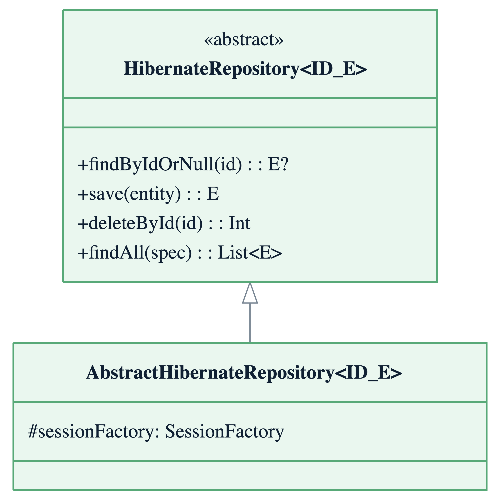
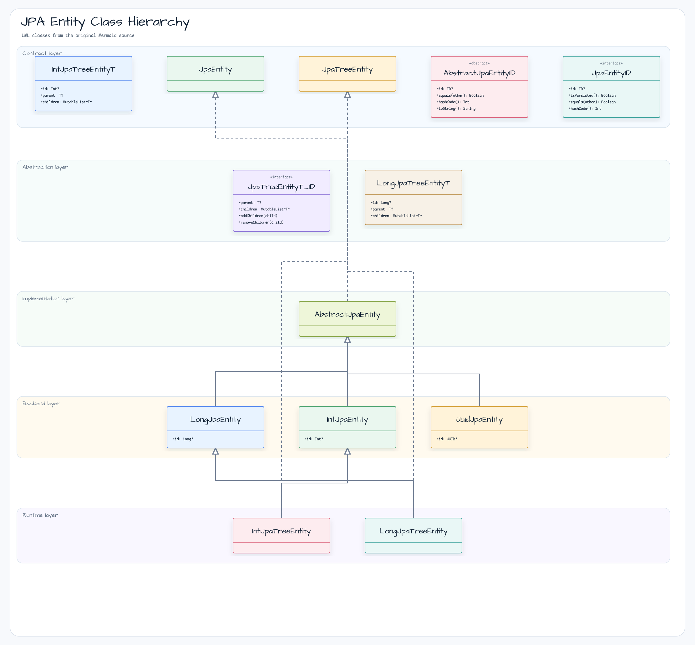
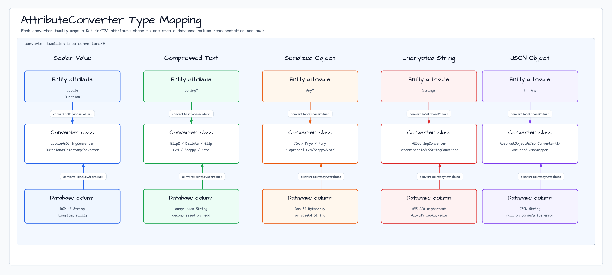
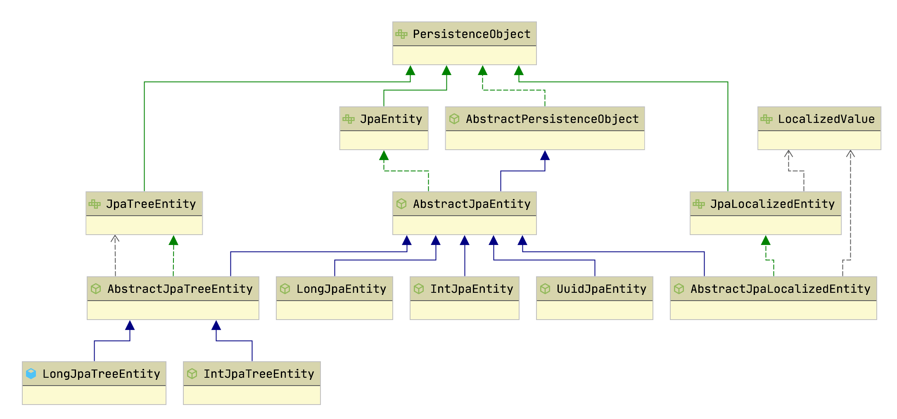

# Module bluetape4k-hibernate

[English](./README.md) | 한국어

Hibernate ORM/JPA 사용 시 반복 코드를 줄이는 Kotlin 확장 라이브러리입니다.

## 개요

`bluetape4k-hibernate`는 [Hibernate ORM](https://hibernate.org/orm/)과 Jakarta Persistence API를 Kotlin 환경에서 더 편리하게 사용할 수 있도록 다양한 확장 함수와 유틸리티를 제공합니다.

### 주요 기능

- **JPA 엔티티 베이스 클래스**: `IntJpaEntity`, `LongJpaEntity`, `UuidJpaEntity`, Tree 계열 엔티티
- **EntityManager 확장**: `save`, `delete`, `findAs`, `countAll`, `deleteAll` 등
- **Session/SessionFactory 확장**: 배치/리스너/세션 보조 기능
- **Criteria/TypedQuery 확장**: `createQueryAs`, `attribute`, `long/int` 변환 유틸
- **Querydsl 확장**: BooleanExpression 결합, 연산자 보조
- **Converter 지원**: Locale/암복호화(Google Tink)/압축/직렬화 기반 converter
- **StatelessSession 지원**: 트랜잭션 처리와 reified 헬퍼 제공
- **Hibernate 7.x 기능 지원**: Jakarta Persistence 3.2.0과 함께 Hibernate 7.2+ 전면 지원
- **NaturalId 예시 포함**: `@NaturalId`와 `Session.bySimpleNaturalId(...)` 조회 패턴 제공

## 의존성 추가

```kotlin
dependencies {
    implementation("io.github.bluetape4k:bluetape4k-hibernate:${version}")

    // Hibernate 7.x (Jakarta Persistence 3.2.0+ 필수)
    implementation("org.hibernate.orm:hibernate-core:7.2.7.Final")

    // Querydsl (선택)
    implementation("io.github.openfeign.querydsl:querydsl-jpa:7.5")
}
```

내장 converter의 런타임 의존성은 `bluetape4k-hibernate` 아티팩트 계약에 포함됩니다. 문서화된
Tink, Jackson3, Kryo, Apache Fory, LZ4, Snappy, Zstd, Commons Compress converter 경로를
사용하기 위해 consumer 프로젝트에서 별도의 `compileOnly` 의존성을 추가할 필요는 없습니다. 단, slim
배포처럼 전이 런타임 의존성을 제외한다면 엔티티 매핑에 사용하는 converter 엔진은 runtime classpath에
남겨야 합니다.

> **은퇴한 Spring Boot 3 통합 참고**: Hibernate 7.x와 Spring Boot 3.x를 함께 사용하던 과거 통합 테스트는 Spring Boot 3의 `SpringBeanContainer`가 Hibernate 5 API를 구현하기 때문에 계속 비활성화되어 있습니다. 현재 bluetape4k Spring 모듈은 Hibernate 7.x 호환을 위해 Spring Boot 4 / Spring Framework 7을 기준으로 합니다. 자세한 내용은 테스트 스위트의 `DisabledWithHibernate7AndSpringBoot3` 보존 guard를 참고하세요.

## Spring Boot 4 마이그레이션

### TestEntityManager Shim

Spring Boot 4에서는 `@DataJpaTest`와 함께 제공되던 `TestEntityManager` 빈이 제거되었습니다. 이 모듈은 `@SpringBootTest + @Transactional` 기반 통합 테스트를 위한 대체 shim을 제공합니다.

```kotlin
// 1. Spring Boot 애플리케이션 컨텍스트에 등록
@Component
class TestEntityManager(@PersistenceContext val entityManager: EntityManager)

// 2. @SpringBootTest + @Transactional 테스트에서 사용
@SpringBootTest(classes = [MyApplication::class])
@Transactional
class UserRepositoryTest {

    @Autowired
    private lateinit var tem: TestEntityManager

    @Test
    fun `엔티티가 올바르게 저장되고 로드된다`() {
        // persist → flush → detach → find (1차 캐시 우회)
        val saved = tem.persistFlushFind(User(name = "debop"))
        saved.id.shouldNotBeNull()
        saved.name shouldBeEqualTo "debop"
    }
}
```

주요 메서드:
- `persist(entity)` — 영속성 컨텍스트에 저장
- `persistAndFlush(entity)` — 저장 후 DB에 즉시 반영 (flush)
- `persistFlushFind(entity)` — 저장 + flush + detach + DB 재로드 (1차 캐시 우회, `Hibernate.getClass()`로 프록시 타입 해석)
- `find(clazz, id)` — ID로 엔티티 조회 (`id`가 null이면 `IllegalArgumentException` 발생)
- `remove(entity)` — 엔티티 제거 (분리 상태인 경우 자동 merge)

## 아키텍처 다이어그램

### 영속성 확장 구조



### JPA 엔티티 클래스 계층 구조



### AttributeConverter 종류



## 기본 사용법

### 1. JPA 엔티티 베이스 클래스

미리 정의된 추상 클래스를 상속받아 엔티티를 쉽게 정의할 수 있습니다.



```kotlin
import io.bluetape4k.hibernate.model.LongJpaEntity
import jakarta.persistence.Entity
import jakarta.persistence.Table

@Entity
@Table(name = "users")
class User: LongJpaEntity() {
    var name: String = ""
    var email: String = ""
    var active: Boolean = true
}

@Entity
@Table(name = "products")
class Product: IntJpaEntity() {
    var name: String = ""
    var price: BigDecimal = BigDecimal.ZERO
}

@Entity
@Table(name = "sessions")
class Session: UuidJpaEntity() {
    var userId: Long = 0
    var token: String = ""
    var expiresAt: Instant = Instant.now()
}
```

#### Tree 구조 엔티티

계층형 데이터를 위한 Tree 엔티티 베이스 클래스를 제공합니다.

```kotlin
import io.bluetape4k.hibernate.model.LongJpaTreeEntity

@Entity
@Table(name = "categories")
class Category: LongJpaTreeEntity<Category>() {
    var name: String = ""
    var description: String = ""
}

// 자식 추가/제거
val parent = Category()
val child = Category()
parent.addChildren(child)    // child.parent = parent 자동 설정
parent.removeChildren(child) // child.parent = null 자동 설정
```

### 2. EntityManager 확장 함수

#### CRUD 작업

```kotlin
import io.bluetape4k.hibernate.*

// 저장 (persist 또는 merge 자동 선택)
val savedUser = em.save(user)

// 삭제
em.delete(user)
em.deleteById<User>(1L)

// 조회
val user = em.findAs<User>(1L)
val user = em.findOne<User>(1L)
val exists = em.exists<User>(1L)

// 전체 조회
val users = em.findAll(User::class.java)

// 카운트
val count = em.countAll<User>()

// 전체 삭제
val deletedCount = em.deleteAll<User>()
```

#### Query 생성

```kotlin
import io.bluetape4k.hibernate.*

// TypedQuery 생성
val query = em.newQuery<User>()
val query = em.createQueryAs<User>("SELECT u FROM User u WHERE u.active = true")

// 페이징 설정
val pagedQuery = query.setPaging(firstResult = 0, maxResults = 10)
```

#### Session 접근

```kotlin
import io.bluetape4k.hibernate.*

// Hibernate Session 가져오기
val session = em.currentSession()
val session = em.asSession()

// SessionFactory 가져오기
val sessionFactory = em.sessionFactory()

// JDBC Connection 가져오기
val connection = em.currentConnection()

// 로드 여부 확인
val isLoaded = em.isLoaded(user)
val isPropertyLoaded = em.isLoaded(user, "orders")
```

### 3. Criteria API 확장

```kotlin
import io.bluetape4k.hibernate.criteria.*

val cb = em.criteriaBuilder

// CriteriaQuery 생성
val query = cb.createQueryAs<User>()
val root = query.from<User>()

// 속성 참조
val namePath = root.attribute(User::name)

// Predicate 생성
val predicate = cb.eq(root.get<String>("name"), "John")
val predicate2 = cb.ne(root.get<Boolean>("active"), false)
val inPredicate = cb.inValues(root.get<Long>("id")).apply {
    value(1L)
    value(2L)
    value(3L)
}

query.where(predicate)
val users = em.createQuery(query).resultList
```

### 4. TypedQuery 확장

```kotlin
import io.bluetape4k.hibernate.criteria.*

// Long 결과 변환
val longQuery = em.createQuery("SELECT u.id FROM User u WHERE u.active = true", java.lang.Long::class.java)
val ids: LongArray = longQuery.longArray()
val idList: List<Long> = longQuery.longList()
val singleId: Long? = longQuery.longResult()

// Int 결과 변환
val intQuery = em.createQuery("SELECT COUNT(*) FROM User u", java.lang.Integer::class.java)
val count: Int? = intQuery.intResult()

// 단일 결과 (없으면 null)
val typedQuery = em.createQuery("SELECT u FROM User u WHERE u.id = :id", User::class.java)
val user: User? = typedQuery.findOneOrNull()
```

### 5. StatelessSession 지원

대량 배치 작업에 적합한 StatelessSession을 지원합니다.

```kotlin
import io.bluetape4k.hibernate.stateless.*

// SessionFactory 기반
sessionFactory.withStateless { stateless ->
    largeDataList.forEach { data ->
        stateless.insert(data)
    }
}

// EntityManager 기반
em.withStateless { stateless ->
    // reified 조회
    val entity = stateless.getAs<User>(userId)

    // 쿼리 실행
    val results = stateless.createQueryAs<User>("FROM User WHERE active = true").list()

    // Native 쿼리
    val users = stateless.createNativeQueryAs<User>("SELECT * FROM users").list()
}
```

### 6. 고급 매핑 예시

Hibernate 7에서 유용한 기능인 `@ConcreteProxy`와 embeddable inheritance 예시를 테스트 자산으로 포함합니다.

```kotlin
@Entity
@ConcreteProxy
@Inheritance(strategy = InheritanceType.SINGLE_TABLE)
abstract class PaymentMethod : IntJpaEntity()

@Embeddable
@DiscriminatorColumn(name = "payment_detail_type")
open class PaymentDetail(
    var billingName: String = "",
)
```

관련 예시는 테스트 코드에서 바로 확인할 수 있습니다.

- `mapping/inheritance/ConcreteProxyInheritanceTest`
- `mapping/embeddable/EmbeddableInheritanceTest`

### 7. NaturalId 조회 예시

```kotlin
@Entity
class Book(
    @NaturalId
    @Column(nullable = false, unique = true, updatable = false)
    var isbn: String = "",
): IntJpaEntity()

val session = em.unwrap(Session::class.java)
val book = session.bySimpleNaturalId(Book::class.java).load("978-89-1234-567-8")
```

관련 예시는 `mapping/naturalid/NaturalIdTest`에서 확인할 수 있습니다.

라이브러리 확장 함수로도 바로 조회할 수 있습니다.

```kotlin
val session = em.currentSession()
val book1 = session.findBySimpleNaturalId<Book>("978-89-1234-567-8")
val book2 = em.findBySimpleNaturalId<Book>("978-89-1234-567-8")
```

### 8. Querydsl 확장

```kotlin
import io.bluetape4k.hibernate.querydsl.core.*

val qUser = QUser.user

// BooleanExpression 결합
val predicate = qUser.active.eq(true)
    .and(qUser.email.endsWith("@example.com"))
    .and(qUser.createdAt.gt(LocalDate.of(2024, 1, 1)))

// 쿼리 실행
val users = queryFactory
    .selectFrom(qUser)
    .where(predicate)
    .fetch()
```

#### QueryDSL codegen 호환성

이 모듈이 지원하는 QueryDSL 생성 경로는 Java APT입니다.
`querydsl-kotlin-codegen` 후보는 clean matrix를 통과할 때까지 의도적으로
비활성화합니다. 로컬 후보 실행은 fixture별 원인을 분리하기 전에
`ExtensionsKt.asTypeName(Extensions.kt:48)` 및
`KotlinEntitySerializer.introClassHeader(KotlinEntitySerializer.kt:109)`의
`NullPointerException`을 포함한 `AnnotationProcessingError`로 실패했습니다.
[QueryDSL issue #3454](https://github.com/querydsl/querydsl/issues/3454)를 참고하세요.

| Fixture | Java APT | Kotlin codegen 후보 | 근거 |
| --- | --- | --- | --- |
| DTO (`ExampleDto`) | 지원 및 테스트 완료 | 후보가 전역 실패하므로 평가하지 않음 | `SimpleQuerydslExamples` constructor 및 `@QueryProjection` 테스트 |
| 일반 엔티티 (`AddressEntity`, `JoinUser`) | 지원 및 테스트 완료 | 후보가 전역 실패하므로 평가하지 않음 | `QuerydslCodegenCompatibilityTest` generated-source 검사 |
| Tree 엔티티 (`ExampleEntity`, `TreeNode`) | 지원 및 테스트 완료 | 후보가 전역 실패하므로 평가하지 않음 | `QExampleEntity`/`QTreeNode` 생성 및 self-reference query |
| Association/join (`JoinUser.addresses`) | 런타임 지원 및 테스트 완료 | 후보가 전역 실패하므로 평가하지 않음 | `QJoinUser` + `QAddressEntity` repository-path query |

2026-08-26 clean 로컬 측정값은 다음과 같습니다.

- Java APT baseline: wall time 18.54초, generated Java source 81개, `build/generated/source/kapt` 아래 324 KB.
- Kotlin codegen 후보: wall time 12.29초, `kaptKotlin` 실패, generated source 0개. 실패 시점 관찰값이므로 성능 비교로 해석하지 않습니다.

후보를 사용할 수 없을 때는 Java APT fallback을 명시적으로 구성하세요.

```kotlin
plugins {
    kotlin("jvm")
    kotlin("kapt")
}

dependencies {
    implementation("io.github.openfeign.querydsl:querydsl-jpa:7.5")
    kapt("io.github.openfeign.querydsl:querydsl-apt:7.5:jakarta")
    kaptTest("io.github.openfeign.querydsl:querydsl-apt:7.5:jakarta")
}

kapt {
    correctErrorTypes = true
    arguments {
        arg("querydsl.entityAccessors", "true")
    }
}
```

generated source는 `build/generated/source/kapt/main`과
`build/generated/source/kapt/test`에 생성됩니다. repository path query는
생성된 타입을 직접 사용할 수 있습니다.

```kotlin
val user = QJoinUser.joinUser
val address = QAddressEntity("address")
val users = JPAQuery<JoinUser>(entityManager)
    .select(user)
    .from(user)
    .innerJoin(user.addresses, address)
    .where(user.name.eq("querydsl-user"), address.city.eq("Seoul"))
    .fetch()
```

### 9. Converter 사용

다양한 AttributeConverter를 제공합니다.

#### 직렬화 Converter

타입이 정해진 객체를 직렬화하여 ByteArray(Base64 인코딩)나 Base64 문자열로 DB에 저장합니다. 영속 컬럼에는 secure serializer allowlist를 사용하는 typed converter 하위 클래스를 권장합니다. 기존 generic `Any?` object converter는 deprecated 상태이며, DB row 변조, 덜 신뢰할 수 있는 시스템의 import, tenant 간 공유가 없는 trusted storage에서만 사용하세요.

```kotlin
import io.bluetape4k.hibernate.converters.*
import io.bluetape4k.io.serializer.KryoBinarySerializer

data class UserProfile(
    val displayName: String,
    val tags: List<String> = emptyList(),
): java.io.Serializable {
    companion object {
        private const val serialVersionUID = 1L
    }
}

class UserProfileAsByteArrayConverter: AbstractTypedObjectAsByteArrayConverter<UserProfile>(
    targetType = UserProfile::class.java,
    serializer = KryoBinarySerializer.secure(UserProfile::class.java),
)

@Entity
class UserData {
    @Id
    var id: Long? = null

    // 명시적 allowlist를 사용하는 typed Kryo 직렬화
    @Convert(converter = UserProfileAsByteArrayConverter::class)
    @Column(length = 4000)
    var profile: UserProfile? = null
}
```

`AbstractTypedObjectAsByteArrayConverter`와 `AbstractTypedObjectAsBase64StringConverter`는 역직렬화된 값의 타입을 Hibernate에 반환하기 전에 확인합니다. Kryo와 Apache Fory를 사용할 때는 `KryoBinarySerializer.secure(...)`, `ForyBinarySerializer.secureFory(...)` 같은 secure serializer와 함께 사용해 converter 경계와 serializer registry가 같은 trust profile을 강제하도록 구성하세요.

#### 암호화 Converter

[Google Tink](https://github.com/google/tink) 기반의 AES 암호화 컨버터를 제공합니다.

- `AESStringConverter`: AES-256-GCM (비결정적, 매번 다른 암호문)
- `DeterministicAESStringConverter`: AES-256-SIV (결정적, 동일 평문 → 동일 암호문, WHERE 절 조회 가능)

암호화된 엔티티 필드는 외부에 보존된 Tink key material이 필요합니다. 기본 컨버터는 애플리케이션
부트스트랩에서 `EncryptedStringConverterKeysets`를 설정하기 전까지 non-null 값을 처리할 때 즉시 실패합니다.
영속 컬럼에는 프로세스 안에서 새로 생성한 keyset을 사용하지 마세요. 한 keyset으로 저장한 암호문은 재시작 후
다른 keyset이나 다른 애플리케이션 인스턴스에서 복호화할 수 없습니다.

```kotlin
import io.bluetape4k.hibernate.converters.AESStringConverter
import io.bluetape4k.hibernate.converters.DeterministicAESStringConverter
import io.bluetape4k.hibernate.converters.EncryptedStringConverterKeysets

fun configureHibernateEncryption() {
    // 보호된 외부 secret 저장소에서 JSON keyset을 읽어오세요.
    // cleartext keyset JSON은 암호화 키 자체이므로 커밋하거나 로그로 남기면 안 됩니다.
    EncryptedStringConverterKeysets.configureAesKeyset(System.getenv("HIBERNATE_AES_GCM_KEYSET_JSON"))
    EncryptedStringConverterKeysets.configureDeterministicKeyset(System.getenv("HIBERNATE_AES_SIV_KEYSET_JSON"))
}

@Entity
class SecureData {
    @Id
    var id: Long? = null

    // AES-256-GCM 암호화 (비결정적)
    @Convert(converter = AESStringConverter::class)
    var creditCard: String? = null

    // AES-256-SIV 결정적 암호화 (WHERE 절로 조회 가능)
    @Convert(converter = DeterministicAESStringConverter::class)
    var password: String? = null
}
```

#### 압축 Converter

문자열을 압축하여 저장합니다. 지원 알고리즘: BZip2, Deflate, GZip, LZ4, Snappy, Zstd.

```kotlin
import io.bluetape4k.hibernate.converters.ZstdStringConverter
import io.bluetape4k.hibernate.converters.LZ4StringConverter

@Entity
class Document {
    @Id
    var id: Long? = null

    // Zstd 압축 (높은 압축률)
    @Convert(converter = ZstdStringConverter::class)
    @Lob
    var content: String = ""

    // LZ4 압축 (높은 속도)
    @Convert(converter = LZ4StringConverter::class)
    @Column(length = 8000)
    var summary: String = ""
}
```

#### 기타 Converter

```kotlin
import io.bluetape4k.hibernate.converters.*

@Entity
class Event {
    @Id
    var id: Long? = null

    // Locale -> BCP 47 language tag 문자열
    @Convert(converter = LocaleAsStringConverter::class)
    var locale: Locale = Locale.getDefault()

    // Duration -> Timestamp (밀리초)
    @Convert(converter = DurationAsTimestampConverter::class)
    var duration: Duration = Duration.ZERO
}
```

#### JSON Converter

```kotlin
import io.bluetape4k.hibernate.converters.AbstractObjectAsJsonConverter

data class Option(val name: String, val value: String): Serializable

// 커스텀 JSON Converter 정의
class OptionAsJsonConverter: AbstractObjectAsJsonConverter<Option>(Option::class.java)

@Entity
class Purchase {
    @Id
    var id: Long? = null

    @Convert(converter = OptionAsJsonConverter::class)
    var option: Option? = null
}
```

## 주요 파일/클래스 목록

### Model (model/)

| 파일                     | 설명                   |
|------------------------|----------------------|
| `JpaEntity.kt`         | JPA 엔티티 인터페이스        |
| `AbstractJpaEntity.kt` | JPA 엔티티 추상 클래스       |
| `IntJpaEntity.kt`      | Int ID 엔티티           |
| `LongJpaEntity.kt`     | Long ID 엔티티          |
| `UuidJpaEntity.kt`     | UUID (Timebased) 엔티티 |
| `JpaTreeEntity.kt`     | Tree 구조 엔티티 인터페이스    |
| `IntJpaTreeEntity.kt`  | Int ID Tree 엔티티      |
| `LongJpaTreeEntity.kt` | Long ID Tree 엔티티     |
| `TreeNodePosition.kt`  | Tree 노드 위치 값 객체      |

### EntityManager 확장

| 파일                               | 설명                      |
|----------------------------------|-------------------------|
| `EntityManagerSupport.kt`        | EntityManager 확장 함수     |
| `EntityManagerFactorySupport.kt` | EntityManagerFactory 확장 |

### Session 확장

| 파일                   | 설명                   |
|----------------------|----------------------|
| `SessionSupport.kt`  | Hibernate Session 확장 |
| `HibernateConsts.kt` | Hibernate 기본 설정 상수   |

### Criteria (criteria/)

| 파일                     | 설명              |
|------------------------|-----------------|
| `CriteriaSupport.kt`   | Criteria API 확장 |
| `TypedQuerySupport.kt` | TypedQuery 확장   |

### Stateless Session (stateless/)

| 파일                              | 설명                             |
|---------------------------------|--------------------------------|
| `StatelessSesisonSupport.kt`    | withStateless 트랜잭션 래퍼          |
| `StatelessSessionExtensions.kt` | StatelessSession reified 확장 함수 |

### Querydsl (querydsl/)

| 파일                                 | 설명                  |
|------------------------------------|---------------------|
| `core/ExpressionsSupport.kt`       | Expression 확장       |
| `core/SimpleExpressionSupport.kt`  | SimpleExpression 확장 |
| `core/StringExpressionsSupport.kt` | StringExpression 확장 |
| `core/MathExpressionsSupport.kt`   | MathExpression 확장   |
| `core/ProjectionsSupport.kt`       | Projections 확장      |
| `jpa/JpaExpressionSupport.kt`      | JPA Expression 확장   |

### Converters (converters/)

| 파일                                 | 설명                                    |
|------------------------------------|---------------------------------------|
| `LocaleAsStringConverter.kt`       | Locale ↔ BCP 47 문자열                   |
| `DurationAsTimestampConverter.kt`  | Duration ↔ Timestamp                  |
| `EncryptedStringConverters.kt`     | Google Tink AES-GCM / AES-SIV 암호화     |
| `CompressedStringConverter.kt`     | BZip2/Deflate/GZip/LZ4/Snappy/Zstd 압축 |
| `ObjectAsByteArrayConverter.kt`    | Jdk/Kryo/Fory 직렬화 + 압축 → ByteArray    |
| `ObjectAsBase64StringConverter.kt` | 객체 직렬화 → Base64 문자열                   |
| `AbstractObjectAsJsonConverter.kt` | 객체 → JSON 문자열 변환 베이스 클래스              |

### Listeners (listeners/)

| 파일                           | 설명                                        |
|------------------------------|-------------------------------------------|
| `HibernateEntityListener.kt` | PostCommit 이벤트 리스너 (insert/update/delete) |
| `JpaEntityEventLogger.kt`    | Pre/Post JPA 이벤트 로깅 리스너                   |

## 테스트

```bash
# 모든 테스트 실행
./gradlew :bluetape4k-hibernate:test

# 특정 테스트 실행
./gradlew :bluetape4k-hibernate:test --tests "io.bluetape4k.hibernate.*"

# Converter 단위 테스트
./gradlew :bluetape4k-hibernate:test --tests "io.bluetape4k.hibernate.converter.*"
```

## 참고

- [Hibernate ORM](https://hibernate.org/orm/)
- [Hibernate ORM 7.2 문서](https://docs.jboss.org/hibernate/orm/7.2/userguide/html_single/Hibernate_User_Guide.html)
- [Jakarta Persistence 3.2 명세](https://jakarta.ee/specifications/persistence/)
- [Querydsl](http://querydsl.com/)
- [Google Tink](https://github.com/google/tink)
