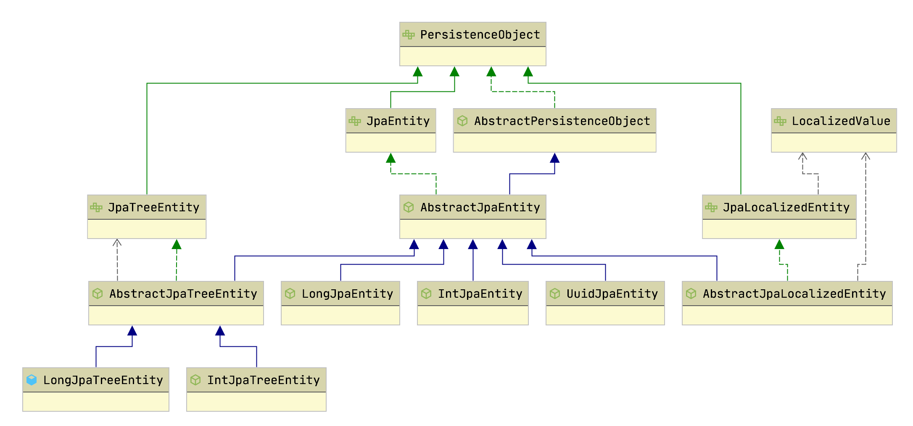
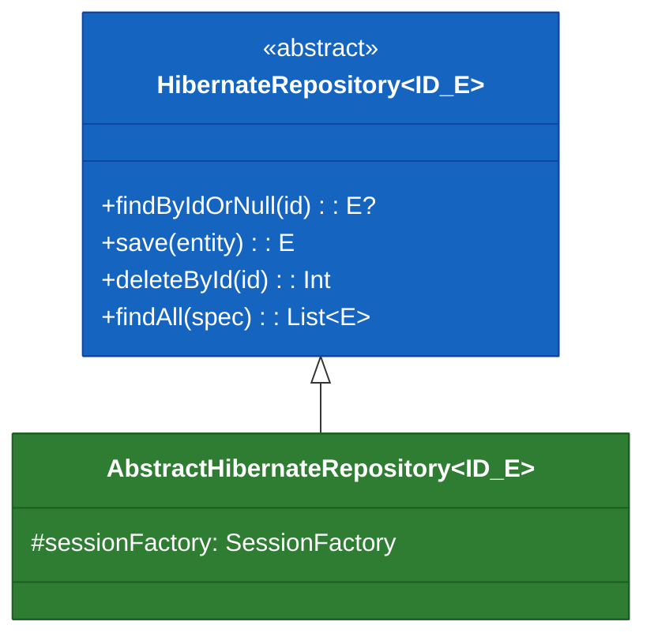
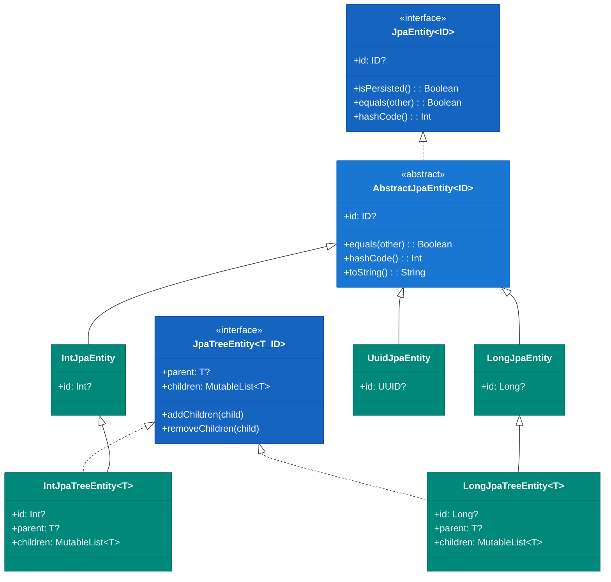
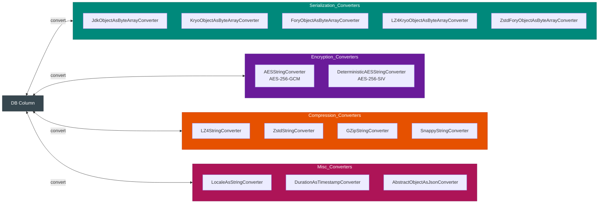

# Module bluetape4k-hibernate

English | [한국어](./README.ko.md)

A Kotlin extension library that eliminates boilerplate when working with Hibernate ORM and JPA.

## Overview

`bluetape4k-hibernate` provides a rich set of extension functions and utilities that make [Hibernate ORM](https://hibernate.org/orm/) and the Jakarta Persistence API more ergonomic in Kotlin.

### Key Features

- **JPA Entity Base Classes**: `IntJpaEntity`, `LongJpaEntity`, `UuidJpaEntity`, and tree-structured entity variants
- **EntityManager Extensions**: `save`, `delete`, `findAs`, `countAll`, `deleteAll`, and more
- **Session/SessionFactory Extensions**: Batch operations, listener support, and session helpers
- **Criteria/TypedQuery Extensions**: `createQueryAs`, `attribute`, `long/int` conversion utilities
- **Querydsl Extensions**: BooleanExpression composition and operator helpers
- **Converter Support**: Locale, encryption (Google Tink), compression, and serialization-based converters
- **StatelessSession Support**: Transaction helpers and reified accessor functions
- **Hibernate 6.6 Feature Examples**: Regression tests for `@ConcreteProxy` and embeddable inheritance mapping
- **NaturalId Examples**: `@NaturalId` and `Session.bySimpleNaturalId(...)` lookup patterns

## Dependency

```kotlin
dependencies {
    implementation("io.github.bluetape4k:bluetape4k-hibernate:${version}")

    // Hibernate (choose your version)
    implementation("org.hibernate.orm:hibernate-core:6.6.41")

    // Querydsl (optional)
    implementation("com.querydsl:querydsl-jpa:5.1.0:jakarta")

    // Encryption converter (Google Tink)
    compileOnly("io.github.bluetape4k:bluetape4k-tink:${version}")

    // JSON converter
    compileOnly("io.github.bluetape4k:bluetape4k-jackson2:${version}")

    // Serialization converter (Kryo or Apache Fory)
    compileOnly("com.esotericsoftware:kryo:5.6.2")
    compileOnly("org.apache.fury:fury-kotlin:0.10.0")
}
```

## Basic Usage

### 1. JPA Entity Base Classes

Extend predefined abstract classes to define entities quickly.



```kotlin
import io.bluetape4k.hibernate.model.LongJpaEntity
import jakarta.persistence.Entity
import jakarta.persistence.Table

@Entity
@Table(name = "users")
class User: LongJpaEntity() {
    var name: String = ""
    var email: String = ""
    var active: Boolean = true
}

@Entity
@Table(name = "products")
class Product: IntJpaEntity() {
    var name: String = ""
    var price: BigDecimal = BigDecimal.ZERO
}

@Entity
@Table(name = "sessions")
class Session: UuidJpaEntity() {
    var userId: Long = 0
    var token: String = ""
    var expiresAt: Instant = Instant.now()
}
```

#### Tree-Structured Entities

Base classes are provided for hierarchical data.

```kotlin
import io.bluetape4k.hibernate.model.LongJpaTreeEntity

@Entity
@Table(name = "categories")
class Category: LongJpaTreeEntity<Category>() {
    var name: String = ""
    var description: String = ""
}

// Add/remove children
val parent = Category()
val child = Category()
parent.addChildren(child)    // Automatically sets child.parent = parent
parent.removeChildren(child) // Automatically sets child.parent = null
```

### 2. EntityManager Extension Functions

#### CRUD Operations

```kotlin
import io.bluetape4k.hibernate.*

// Save (automatically chooses persist or merge)
val savedUser = em.save(user)

// Delete
em.delete(user)
em.deleteById<User>(1L)

// Find
val user = em.findAs<User>(1L)
val user = em.findOne<User>(1L)
val exists = em.exists<User>(1L)

// Find all
val users = em.findAll(User::class.java)

// Count
val count = em.countAll<User>()

// Delete all
val deletedCount = em.deleteAll<User>()
```

#### Query Creation

```kotlin
import io.bluetape4k.hibernate.*

// Create TypedQuery
val query = em.newQuery<User>()
val query = em.createQueryAs<User>("SELECT u FROM User u WHERE u.active = true")

// Apply paging
val pagedQuery = query.setPaging(firstResult = 0, maxResults = 10)
```

#### Session Access

```kotlin
import io.bluetape4k.hibernate.*

// Get the Hibernate Session
val session = em.currentSession()
val session = em.asSession()

// Get the SessionFactory
val sessionFactory = em.sessionFactory()

// Get the JDBC Connection
val connection = em.currentConnection()

// Check loading state
val isLoaded = em.isLoaded(user)
val isPropertyLoaded = em.isLoaded(user, "orders")
```

### 3. Criteria API Extensions

```kotlin
import io.bluetape4k.hibernate.criteria.*

val cb = em.criteriaBuilder

// Create a CriteriaQuery
val query = cb.createQueryAs<User>()
val root = query.from<User>()

// Attribute reference
val namePath = root.attribute(User::name)

// Build predicates
val predicate = cb.eq(root.get<String>("name"), "John")
val predicate2 = cb.ne(root.get<Boolean>("active"), false)
val inPredicate = cb.inValues(root.get<Long>("id")).apply {
    value(1L)
    value(2L)
    value(3L)
}

query.where(predicate)
val users = em.createQuery(query).resultList
```

### 4. TypedQuery Extensions

```kotlin
import io.bluetape4k.hibernate.criteria.*

// Convert to Long results
val longQuery = em.createQuery("SELECT u.id FROM User u WHERE u.active = true", java.lang.Long::class.java)
val ids: LongArray = longQuery.longArray()
val idList: List<Long> = longQuery.longList()
val singleId: Long? = longQuery.longResult()

// Convert to Int results
val intQuery = em.createQuery("SELECT COUNT(*) FROM User u", java.lang.Integer::class.java)
val count: Int? = intQuery.intResult()

// Single result, or null if absent
val typedQuery = em.createQuery("SELECT u FROM User u WHERE u.id = :id", User::class.java)
val user: User? = typedQuery.findOneOrNull()
```

### 5. StatelessSession Support

StatelessSession is ideal for high-throughput batch operations.

```kotlin
import io.bluetape4k.hibernate.stateless.*

// Using SessionFactory
sessionFactory.withStateless { stateless ->
    largeDataList.forEach { data ->
        stateless.insert(data)
    }
}

// Using EntityManager
em.withStateless { stateless ->
    // Reified lookup
    val entity = stateless.getAs<User>(userId)

    // Run a query
    val results = stateless.createQueryAs<User>("FROM User WHERE active = true").list()

    // Native query
    val users = stateless.createNativeQueryAs<User>("SELECT * FROM users").list()
}
```

### 6. Hibernate 6.6 Mapping Examples

The library includes test assets demonstrating
`@ConcreteProxy` and embeddable inheritance, both useful Hibernate 6.6 features.

```kotlin
@Entity
@ConcreteProxy
@Inheritance(strategy = InheritanceType.SINGLE_TABLE)
abstract class PaymentMethod : IntJpaEntity()

@Embeddable
@DiscriminatorColumn(name = "payment_detail_type")
open class PaymentDetail(
    var billingName: String = "",
)
```

See the test code for working examples:

- `mapping/inheritance/ConcreteProxyInheritanceTest`
- `mapping/embeddable/EmbeddableInheritanceTest`

### 7. NaturalId Lookup Example

```kotlin
@Entity
class Book(
    @NaturalId
    @Column(nullable = false, unique = true, updatable = false)
    var isbn: String = "",
): IntJpaEntity()

val session = em.unwrap(Session::class.java)
val book = session.bySimpleNaturalId(Book::class.java).load("978-89-1234-567-8")
```

See `mapping/naturalid/NaturalIdTest` for the full example.

You can also use library extension functions for direct lookup:

```kotlin
val session = em.currentSession()
val book1 = session.findBySimpleNaturalId<Book>("978-89-1234-567-8")
val book2 = em.findBySimpleNaturalId<Book>("978-89-1234-567-8")
```

### 8. Querydsl Extensions

```kotlin
import io.bluetape4k.hibernate.querydsl.core.*

val qUser = QUser.user

// Compose BooleanExpressions
val predicate = qUser.active.eq(true)
    .and(qUser.email.endsWith("@example.com"))
    .and(qUser.createdAt.gt(LocalDate.of(2024, 1, 1)))

// Execute query
val users = queryFactory
    .selectFrom(qUser)
    .where(predicate)
    .fetch()
```

### 9. Converters

A variety of `AttributeConverter` implementations are provided.

#### Serialization Converters

Serialize objects and store them as ByteArray (Base64-encoded) in the database. Supports JDK, Kryo, and Apache Fory serialization combined with LZ4, Snappy, or Zstd compression.

```kotlin
import io.bluetape4k.hibernate.converters.*

@Entity
class UserData {
    @Id
    var id: Long? = null

    // JDK serialization → Base64 → ByteArray
    @Convert(converter = JdkObjectAsByteArrayConverter::class)
    @Column(length = 4000)
    var metadata: Any? = null

    // Kryo serialization + LZ4 compression → Base64 → ByteArray
    @Convert(converter = LZ4KryoObjectAsByteArrayConverter::class)
    @Column(length = 4000)
    var largeData: Any? = null

    // Apache Fory serialization + Zstd compression → Base64 → ByteArray
    @Convert(converter = ZstdForyObjectAsByteArrayConverter::class)
    @Column(length = 4000)
    var compressedData: Any? = null
}
```

#### Encryption Converters

AES encryption converters based on [Google Tink](https://github.com/google/tink).

- `AESStringConverter`: AES-256-GCM (non-deterministic; ciphertext differs each time)
-

`DeterministicAESStringConverter`: AES-256-SIV (deterministic; same plaintext → same ciphertext, supports WHERE clause lookups)

```kotlin
import io.bluetape4k.hibernate.converters.AESStringConverter
import io.bluetape4k.hibernate.converters.DeterministicAESStringConverter

@Entity
class SecureData {
    @Id
    var id: Long? = null

    // AES-256-GCM encryption (non-deterministic)
    @Convert(converter = AESStringConverter::class)
    var creditCard: String? = null

    // AES-256-SIV deterministic encryption (supports WHERE clause lookups)
    @Convert(converter = DeterministicAESStringConverter::class)
    var password: String? = null
}
```

#### Compression Converters

Compress strings before storing. Supported algorithms: BZip2, Deflate, GZip, LZ4, Snappy, Zstd.

```kotlin
import io.bluetape4k.hibernate.converters.ZstdStringConverter
import io.bluetape4k.hibernate.converters.LZ4StringConverter

@Entity
class Document {
    @Id
    var id: Long? = null

    // Zstd compression (high compression ratio)
    @Convert(converter = ZstdStringConverter::class)
    @Lob
    var content: String = ""

    // LZ4 compression (high speed)
    @Convert(converter = LZ4StringConverter::class)
    @Column(length = 8000)
    var summary: String = ""
}
```

#### Miscellaneous Converters

```kotlin
import io.bluetape4k.hibernate.converters.*

@Entity
class Event {
    @Id
    var id: Long? = null

    // Locale → BCP 47 language tag string
    @Convert(converter = LocaleAsStringConverter::class)
    var locale: Locale = Locale.getDefault()

    // Duration → Timestamp (milliseconds)
    @Convert(converter = DurationAsTimestampConverter::class)
    var duration: Duration = Duration.ZERO
}
```

#### JSON Converter

```kotlin
import io.bluetape4k.hibernate.converters.AbstractObjectAsJsonConverter

data class Option(val name: String, val value: String): Serializable

// Define a custom JSON converter
class OptionAsJsonConverter: AbstractObjectAsJsonConverter<Option>(Option::class.java)

@Entity
class Purchase {
    @Id
    var id: Long? = null

    @Convert(converter = OptionAsJsonConverter::class)
    var option: Option? = null
}
```

## Key Files and Classes

### Model (model/)

| File                   | Description                         |
|------------------------|-------------------------------------|
| `JpaEntity.kt`         | JPA entity interface                |
| `AbstractJpaEntity.kt` | Abstract JPA entity base class      |
| `IntJpaEntity.kt`      | Entity with Int ID                  |
| `LongJpaEntity.kt`     | Entity with Long ID                 |
| `UuidJpaEntity.kt`     | Entity with time-based UUID ID      |
| `JpaTreeEntity.kt`     | Tree-structured entity interface    |
| `IntJpaTreeEntity.kt`  | Tree entity with Int ID             |
| `LongJpaTreeEntity.kt` | Tree entity with Long ID            |
| `TreeNodePosition.kt`  | Value object for tree node position |

### EntityManager Extensions

| File                             | Description                       |
|----------------------------------|-----------------------------------|
| `EntityManagerSupport.kt`        | EntityManager extension functions |
| `EntityManagerFactorySupport.kt` | EntityManagerFactory extensions   |

### Session Extensions

| File                 | Description                        |
|----------------------|------------------------------------|
| `SessionSupport.kt`  | Hibernate Session extensions       |
| `HibernateConsts.kt` | Hibernate default config constants |

### Criteria (criteria/)

| File                   | Description             |
|------------------------|-------------------------|
| `CriteriaSupport.kt`   | Criteria API extensions |
| `TypedQuerySupport.kt` | TypedQuery extensions   |

### Stateless Session (stateless/)

| File                            | Description                                      |
|---------------------------------|--------------------------------------------------|
| `StatelessSesisonSupport.kt`    | `withStateless` transaction wrapper              |
| `StatelessSessionExtensions.kt` | Reified extension functions for StatelessSession |

### Querydsl (querydsl/)

| File                               | Description                 |
|------------------------------------|-----------------------------|
| `core/ExpressionsSupport.kt`       | Expression extensions       |
| `core/SimpleExpressionSupport.kt`  | SimpleExpression extensions |
| `core/StringExpressionsSupport.kt` | StringExpression extensions |
| `core/MathExpressionsSupport.kt`   | MathExpression extensions   |
| `core/ProjectionsSupport.kt`       | Projections extensions      |
| `jpa/JpaExpressionSupport.kt`      | JPA Expression extensions   |

### Converters (converters/)

| File                               | Description                                           |
|------------------------------------|-------------------------------------------------------|
| `LocaleAsStringConverter.kt`       | Locale ↔ BCP 47 string                                |
| `DurationAsTimestampConverter.kt`  | Duration ↔ Timestamp                                  |
| `EncryptedStringConverters.kt`     | Google Tink AES-GCM / AES-SIV encryption              |
| `CompressedStringConverter.kt`     | BZip2/Deflate/GZip/LZ4/Snappy/Zstd compression        |
| `ObjectAsByteArrayConverter.kt`    | JDK/Kryo/Fory serialization + compression → ByteArray |
| `ObjectAsBase64StringConverter.kt` | Object serialization → Base64 string                  |
| `AbstractObjectAsJsonConverter.kt` | Base class for object → JSON string conversion        |

### Listeners (listeners/)

| File                         | Description                                      |
|------------------------------|--------------------------------------------------|
| `HibernateEntityListener.kt` | PostCommit event listener (insert/update/delete) |
| `JpaEntityEventLogger.kt`    | Pre/Post JPA event logging listener              |

## Testing

```bash
# Run all tests
./gradlew :bluetape4k-hibernate:test

# Run specific tests
./gradlew :bluetape4k-hibernate:test --tests "io.bluetape4k.hibernate.*"

# Run converter unit tests
./gradlew :bluetape4k-hibernate:test --tests "io.bluetape4k.hibernate.converter.*"
```

## Architecture Diagrams

### Repository Class Structure



### JPA Entity Class Hierarchy



### AttributeConverter Types



## References

- [Hibernate ORM](https://hibernate.org/orm/)
- [Hibernate ORM Documentation](https://docs.jboss.org/hibernate/orm/6.6/userguide/html_single/Hibernate_User_Guide.html)
- [Jakarta Persistence](https://jakarta.ee/specifications/persistence/)
- [Querydsl](http://querydsl.com/)
- [Google Tink](https://github.com/google/tink)
