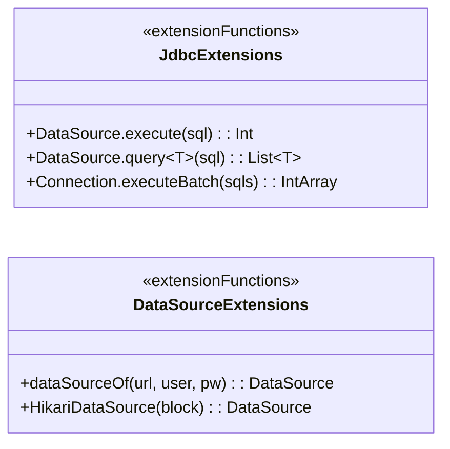
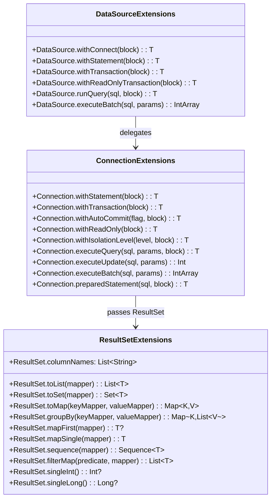
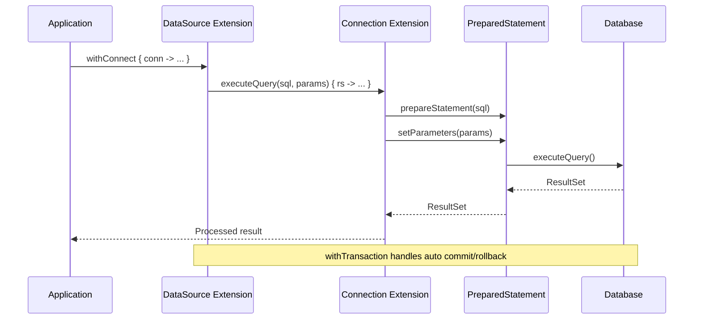

# Module bluetape4k-jdbc

English | [한국어](./README.ko.md)

A Kotlin extension library that eliminates boilerplate when working with JDBC (Java Database Connectivity). Leverage Kotlin's expressive power to write type-safe, concise database code.

## Features

- **Type-Safe ResultSet Access**: Nullable extension functions for safe value retrieval
- **Concise Connection Management**: `use`-pattern and DSL support
- **Transaction Support**: Declarative transaction management
- **Batch Processing**: High-throughput bulk insert support
- **Object Mapping**: Easily convert ResultSet rows to objects

## Dependency

```kotlin
dependencies {
    implementation("io.github.bluetape4k:bluetape4k-jdbc:${version}")
    // Add your database driver (e.g., H2, MySQL, PostgreSQL)
    implementation("com.h2database:h2:${h2Version}")
}
```

## Core Features

### 1. DataSource/Connection Management

Acquire and use a Connection from a DataSource.

```kotlin
import io.bluetape4k.jdbc.sql.*
import javax.sql.DataSource

// Create a DataSource (e.g., HikariCP, Apache DBCP)
val dataSource: DataSource = createDataSource()

// Acquire and use a Connection
dataSource.withConnect { conn ->
    val result = conn.runQuery("SELECT * FROM users") { rs ->
        // Process ResultSet
    }
}
```

### 2. Executing Statements

Simple statement creation and execution:

```kotlin
// Create and use a Statement
dataSource.withStatement { stmt ->
    val rs = stmt.executeQuery("SELECT * FROM users")
    // Process ResultSet
}

// Use directly from a Connection
dataSource.connection.use { conn ->
    conn.withStatement { stmt ->
        stmt.executeUpdate("INSERT INTO users (name) VALUES ('Alice')")
    }
}
```

### 3. ResultSet Processing

Type-safe result retrieval:

```kotlin
dataSource.runQuery("SELECT * FROM users") { rs ->
    val users = mutableListOf<User>()
    while (rs.next()) {
        users.add(
            User(
                id = rs.getLongOrNull("id"),
                name = rs.getStringOrNull("name"),
                age = rs.getIntOrNull("age")
            )
        )
    }
    users
}

// Access by column name
val name: String? = rs.getStringOrNull("name")
val age: Int? = rs.getIntOrNull("age")

// Access by index
val firstColumn: String? = rs.getStringOrNull(1)
```

### 4. Index/Label Operator Access

Convenient operator overloading:

```kotlin
dataSource.runQuery("SELECT id, name FROM users") { rs ->
    while (rs.next()) {
        val id = rs["id"] as? Long    // Access by label
        val name = rs[2] as? String   // Access by index (1-based)
        println("User: $id - $name")
    }
}
```

### 5. Object Mapping

Easily convert ResultSet rows to objects:

```kotlin
data class User(val id: Int, val name: String, val email: String)

// Map the first row
val user = dataSource.runQuery("SELECT * FROM users WHERE id = 1") { rs ->
    rs.mapFirst { row ->
        User(row.getInt("id"), row.getString("name"), row.getString("email"))
    }
}

// Map a single row (throws if 0 or 2+ rows are returned)
val singleUser = dataSource.runQuery("SELECT * FROM users WHERE id = 1") { rs ->
    rs.mapSingle { row ->
        User(row.getInt("id"), row.getString("name"), row.getString("email"))
    }
}

// Convert to a List
val users = dataSource.runQuery("SELECT * FROM users") { rs ->
    rs.toList { row ->
        User(row.getInt("id"), row.getString("name"), row.getString("email"))
    }
}

// Convert to a Set
val uniqueNames = dataSource.runQuery("SELECT name FROM users") { rs ->
    rs.toSet { it.getString("name") }
}

// Convert to a Map
val userMap = dataSource.runQuery("SELECT * FROM users") { rs ->
    rs.toMap(
        keyMapper = { it.getInt("id") },
        valueMapper = { User(it.getInt("id"), it.getString("name"), it.getString("email")) }
    )
}

// Group rows
val usersByStatus = dataSource.runQuery("SELECT * FROM users") { rs ->
    rs.groupBy(
        keyMapper = { it.getString("status") },
        valueMapper = { User(it.getInt("id"), it.getString("name"), it.getString("email")) }
    )
}
```

### 6. ResultSet Iteration

Iterator and Sequence support:

```kotlin
// Using an Iterator
val rs = statement.executeQuery("SELECT * FROM users")
for (row in rs) {
    println(row.getString("name"))
}

// Using a Sequence
val users = dataSource.runQuery("SELECT * FROM users") { rs ->
    rs.sequence { row ->
        User(row.getInt("id"), row.getString("name"), row.getString("email"))
    }.toList()
}

// Using forEach
dataSource.runQuery("SELECT * FROM users") { rs ->
    rs.forEach { row ->
        println("User: ${row.getString("name")}")
    }
}

// Using forEachIndexed
dataSource.runQuery("SELECT * FROM users") { rs ->
    rs.forEachIndexed { index, row ->
        println("$index: ${row.getString("name")}")
    }
}
```

### 7. PreparedStatement Support

PreparedStatement creation and parameter binding:

```kotlin
// Execute a parameterized query
dataSource.withConnect { conn ->
    conn.executeQuery(
        "SELECT * FROM users WHERE age > ? AND status = ?",
        18, "active"
    ) { rs ->
        // Process ResultSet
    }
}

// Execute an update
val affectedRows = dataSource.withConnect { conn ->
    conn.executeUpdate(
        "UPDATE users SET name = ? WHERE id = ?",
        "New Name", 123
    )
}

// Return generated keys
val generatedId = dataSource.withConnect { conn ->
    conn.executeUpdateWithGeneratedKeys(
        "INSERT INTO users (name, email) VALUES (?, ?)",
        "John Doe", "john@example.com"
    ) { rs ->
        if (rs.next()) rs.getLong(1) else null
    }
}

// DSL style
dataSource.withConnect { conn ->
    conn.preparedStatement("SELECT * FROM users WHERE id = ?") { stmt ->
        stmt.setLong(1, userId)
        stmt.executeQuery().use { rs ->
            // Process ResultSet
        }
    }
}
```

### 8. Batch Processing

Bulk data insertion:

```kotlin
// Batch INSERT
val paramsList = listOf(
    listOf("User1", "user1@example.com"),
    listOf("User2", "user2@example.com"),
    listOf("User3", "user3@example.com")
)

val results = dataSource.withConnect { conn ->
    conn.executeBatch(
        "INSERT INTO users (name, email) VALUES (?, ?)",
        paramsList,
        batchSize = 100
    )
}

// Large batch (returns Long)
val largeResults = dataSource.withConnect { conn ->
    conn.executeLargeBatch(
        "INSERT INTO users (name, email) VALUES (?, ?)",
        paramsList,
        batchSize = 1000
    )
}

// Execute directly from a DataSource
val batchResults = dataSource.executeBatch(
    "INSERT INTO users (name, email) VALUES (?, ?)",
    paramsList
)
```

### 9. Transaction Management

Declarative transaction management:

```kotlin
// Basic transaction
dataSource.withTransaction { conn ->
    conn.executeUpdate("INSERT INTO accounts (user_id, balance) VALUES (?, ?)", 1, 1000)
    conn.executeUpdate("INSERT INTO logs (message) VALUES (?)", "Account created")
    // Automatically committed
}

// Read-only transaction
dataSource.withReadOnlyTransaction { conn ->
    conn.runQuery("SELECT * FROM users") { rs ->
        // Perform read-only operations
    }
}

// Specify isolation level
dataSource.withTransaction(Connection.TRANSACTION_SERIALIZABLE) { conn ->
    conn.runQuery("SELECT * FROM accounts WHERE id = 1 FOR UPDATE") { rs ->
        // Query under serializable isolation
    }
}

// Use directly from a Connection
dataSource.connection.use { conn ->
    conn.withTransaction { connection ->
        connection.executeUpdate("INSERT INTO users (name) VALUES (?)", "Alice")
        connection.executeUpdate("INSERT INTO users (name) VALUES (?)", "Bob")
        // Automatically committed
    }
}

// Rollback example
try {
    dataSource.withTransaction { conn ->
        conn.executeUpdate("INSERT INTO users (name) VALUES (?)", "Temp User")
        throw RuntimeException("Something went wrong")
        // Automatically rolled back on exception
    }
} catch (e: Exception) {
    // Transaction was rolled back
}
```

### 10. Temporarily Changing Connection Properties

Temporarily modify connection properties for a block of code:

```kotlin
dataSource.connection.use { conn ->
    // Temporarily disable auto-commit
    conn.withAutoCommit(false) { connection ->
        // Work with auto-commit disabled
    }

    // Read-only mode
    conn.withReadOnly { connection ->
        // Work in read-only mode
    }

    // Temporarily change isolation level
    conn.withIsolationLevel(Connection.TRANSACTION_READ_UNCOMMITTED) { connection ->
        // Work at the specified isolation level
    }

    // Temporarily change holdability
    conn.withHoldability(ResultSet.CLOSE_CURSORS_AT_COMMIT) { connection ->
        // Work with the specified holdability
    }
}
```

### 11. Token-Based Column Access

Type-safe column access using tokens:

```kotlin
dataSource.runQuery("SELECT * FROM users") { rs ->
    rs.extract {
        User(
            id = long["id"]!!,
            name = string["name"]!!,
            age = int["age"],
            createdAt = timestamp["created_at"],
            active = boolean["is_active"] ?: false
        )
    }
}
```

### 12. Single Value Retrieval

Retrieve a single value from aggregate queries:

```kotlin
// Int
val count = dataSource.runQuery("SELECT COUNT(*) FROM users") { rs ->
    rs.singleInt()
}

// Long
val maxId = dataSource.runQuery("SELECT MAX(id) FROM users") { rs ->
    rs.singleLong()
}

// Double
val avgAge = dataSource.runQuery("SELECT AVG(age) FROM users") { rs ->
    rs.singleDouble()
}

// String
val name = dataSource.runQuery("SELECT name FROM users WHERE id = 1") { rs ->
    rs.singleString()
}

// BigDecimal
val totalAmount = dataSource.runQuery("SELECT SUM(amount) FROM orders") { rs ->
    rs.singleBigDecimal()
}
```

### 13. ResultSet Metadata

```kotlin
dataSource.runQuery("SELECT * FROM users") { rs ->
    // Column names
    val columns = rs.columnNames
    println(columns) // ["id", "name", "email", ...]

    // Column labels (aliases)
    val labels = rs.columnLabels

    // Column count
    val columnCount = rs.columnCount
}
```

### 14. Filtering and Searching

```kotlin
dataSource.runQuery("SELECT * FROM users") { rs ->
    // all: true if every row satisfies the predicate
    val allAdults = rs.all { it.getInt("age") >= 18 }

    // any: true if at least one row satisfies the predicate
    val hasAdmin = rs.any { it.getString("role") == "admin" }

    // none: true if no row satisfies the predicate
    val noInactive = rs.none { it.getString("status") == "inactive" }

    // filterMap: map only matching rows
    val adultUsers = rs.filterMap(
        predicate = { it.getInt("age") >= 18 },
        mapper = { User(it.getInt("id"), it.getString("name"), it.getString("email")) }
    )

    // firstOrNull: first matching row, or null
    val firstAdmin = rs.firstOrNull(
        predicate = { it.getString("role") == "admin" },
        mapper = { User(it.getInt("id"), it.getString("name"), it.getString("email")) }
    )
}
```

### 15. Utility Functions

```kotlin
// isEmpty / isNotEmpty
dataSource.runQuery("SELECT * FROM users WHERE 1=0") { rs ->
    rs.isEmpty()    // true
    rs.isNotEmpty() // false
}

// count
dataSource.runQuery("SELECT * FROM users") { rs ->
    val total = rs.count()
    val adults = rs.count { it.getInt("age") >= 18 }
}
```

## Testing

The module includes tests that use an H2 database.

```kotlin
class MyJdbcTest : AbstractJdbcTest() {
    @Test
    fun `user lookup test`() {
        val user = dataSource.executeQuery(
            "SELECT * FROM users WHERE name = ?",
            "Alice"
        ) { rs ->
            rs.mapFirst { row ->
                User(row.getInt("id"), row.getString("name"), row.getString("email"))
            }
        }

        user.shouldNotBeNull()
        user.name shouldBeEqualTo "Alice"
    }
}
```

## Architecture Diagrams

### Extension Function API Overview



### Core API Structure



### JDBC Query Execution Flow



## References

- [JDBC Official Documentation](https://docs.oracle.com/javase/tutorial/jdbc/)
- [Kotlin use Function](https://kotlinlang.org/api/latest/jvm/stdlib/kotlin.io/use.html)
- [HikariCP](https://github.com/brettwooldridge/HikariCP) — High-performance JDBC connection pool

## License

Apache License 2.0
