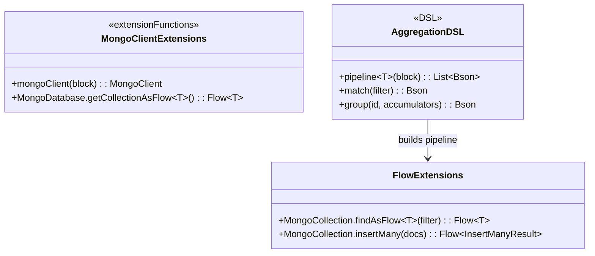
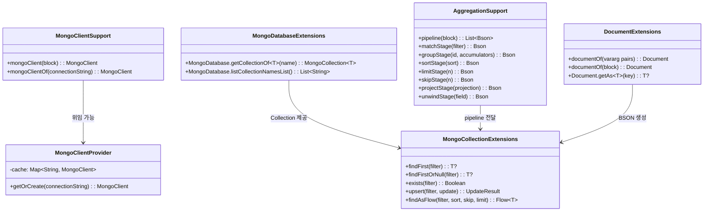
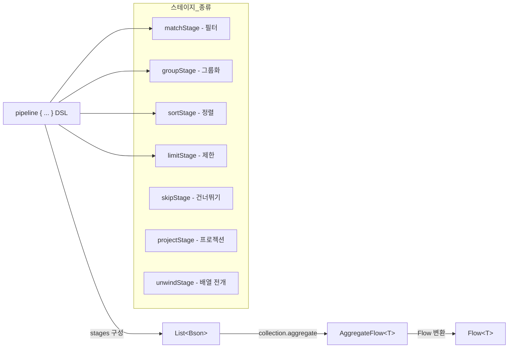

# Module bluetape4k-mongodb

[MongoDB Kotlin Coroutine Driver](https://www.mongodb.com/docs/drivers/kotlin/coroutine/current/)를 더욱 편리하게 사용할 수 있도록 하는 확장 라이브러리입니다.

MongoDB Kotlin Coroutine Driver(v5.x)는 이미 네이티브 `suspend` 함수와 `Flow`를 제공하므로,
이 모듈은 **불필요한 래핑 없이** 진짜 부족한 편의 기능에만 집중합니다.

## 특징

- **MongoClient DSL**: `mongoClient {}` 빌더, `mongoClientOf()` 편의 팩토리
- **MongoClient 캐싱**: `MongoClientProvider` — 연결 문자열 기반 인스턴스 캐싱
- **Database 확장**: reified 타입 `getCollectionOf<T>()`, `listCollectionNamesList()`
- **Collection 확장**: `findFirst`, `exists`, `upsert`, `findAsFlow` (skip/limit/sort 통합)
- **BSON Document DSL**: `documentOf {}` 빌더, `getAs<T>()` 타입 안전 조회
- **Aggregation Pipeline DSL**: `pipeline {}` + `matchStage`, `groupStage`, `sortStage` 등

## 의존성 추가

```kotlin
dependencies {
    implementation("io.github.bluetape4k:bluetape4k-mongodb:${bluetape4kVersion}")
}
```

## 주요 기능

### 1. MongoClient 생성

```kotlin
import io.bluetape4k.mongodb.*

// DSL 방식으로 생성
val client = mongoClient {
    applyConnectionString(ConnectionString("mongodb://localhost:27017"))
}

// 편의 팩토리
val client2 = mongoClientOf("mongodb://localhost:27017")

// 연결 문자열 기반 캐싱 (동일 URL → 동일 인스턴스)
val client3 = MongoClientProvider.getOrCreate("mongodb://localhost:27017")
```

### 2. Database & Collection 확장

```kotlin
import io.bluetape4k.mongodb.*

// reified 타입으로 컬렉션 획득 (Document::class.java 직접 전달 불필요)
val collection = database.getCollectionOf<Person>("persons")

// 컬렉션 이름 목록을 즉시 List로 수집
val names: List<String> = database.listCollectionNamesList()
```

### 3. Collection 편의 함수

네이티브 `insertOne()`, `updateOne()`, `deleteOne()` 등은 이미 `suspend` 함수이므로
이 모듈은 자주 쓰이는 복합 패턴만 추가합니다.

```kotlin
import io.bluetape4k.mongodb.*
import com.mongodb.client.model.Filters
import com.mongodb.client.model.Sorts
import com.mongodb.client.model.Updates

// 첫 번째 일치 문서 조회
val user: Person? = collection.findFirst(Filters.eq("name", "Alice"))

// 존재 여부 확인
val exists: Boolean = collection.exists(Filters.eq("email", "alice@example.com"))

// Upsert (없으면 삽입, 있으면 업데이트)
val result = collection.upsert(
    filter = Filters.eq("name", "Alice"),
    update = Updates.set("age", 31)
)

// 필터 + 정렬 + 페이지네이션을 한 번에
val flow: Flow<Person> = collection.findAsFlow(
    filter = Filters.gt("age", 20),
    sort = Sorts.ascending("name"),
    skip = 10,
    limit = 5
)
flow.collect { println(it) }
```

### 4. BSON Document DSL

```kotlin
import io.bluetape4k.mongodb.bson.*

// 키-값 쌍으로 빠르게 생성
val doc = documentOf("name" to "Alice", "age" to 30, "city" to "Seoul")

// DSL 빌더
val doc2 = documentOf {
    put("name", "Bob")
    put("tags", listOf("admin", "user"))
}

// 타입 안전 조회 (null-safe)
val name: String? = doc.getAs<String>("name")
val age: Int? = doc.getAs<Int>("age")
```

### 5. Aggregation Pipeline DSL

네이티브 `aggregate(pipeline)` 함수가 이미 `AggregateFlow<T>`(`Flow<T>` 구현체)를 반환하므로,
이 모듈은 파이프라인 스테이지 **구성 DSL**만 제공합니다.

```kotlin
import io.bluetape4k.mongodb.aggregation.*
import com.mongodb.client.model.Accumulators
import com.mongodb.client.model.Filters
import com.mongodb.client.model.Sorts

// pipeline {} DSL로 스테이지 구성
val stages = pipeline {
    add(matchStage(Filters.gt("age", 20)))
    add(groupStage("city", Accumulators.sum("count", 1)))
    add(sortStage(Sorts.descending("count")))
    add(limitStage(5))
}

// 네이티브 aggregate() 로 실행 (이미 Flow 반환)
val results = collection.aggregate<Document>(stages).toList()

// unwind 예제
val unwindStages = pipeline {
    add(matchStage(Filters.exists("tags")))
    add(unwindStage("tags"))          // $tags 배열 전개
    add(groupStage("tags", Accumulators.sum("count", 1)))
    add(sortStage(Sorts.descending("count")))
}
```

## 테스트 지원

```kotlin
import io.bluetape4k.mongodb.AbstractMongoTest

class MyMongoTest : AbstractMongoTest() {

    private val collection by lazy {
        database.getCollectionOf<Document>("my_collection")
    }

    @BeforeEach
    fun setUp() = runTest {
        collection.drop()
        collection.insertMany(testData)
    }

    @Test
    fun `문서 조회 테스트`() = runTest {
        val doc = collection.findFirst(Filters.eq("name", "Alice"))
        doc.shouldNotBeNull()
        doc.getString("name") shouldBeEqualTo "Alice"
    }
}
```

`AbstractMongoTest`는 [MongoDBServer](../testing/testcontainers) Testcontainer를 자동으로
시작하고, Kotlin Coroutine 드라이버 기반의 `MongoClient`와 `MongoDatabase`를 제공합니다.

## 제외한 항목 (네이티브 드라이버가 이미 제공)

| 제외 항목 | 이유 |
|---|---|
| `insertOne/Many/updateOne/deleteOne` 래퍼 | 네이티브 CRUD가 이미 `suspend` |
| Filter/Sort/Update/Projection 문자열 DSL | `mongodb-driver-kotlin-extensions`의 KProperty 기반 DSL이 더 타입 안전 |
| `createIndex/dropIndex` 래퍼 | 이미 `suspend` |
| `aggregateAsFlow()` | 네이티브 `aggregate()`가 이미 `AggregateFlow<T>` (= `Flow`) 반환 |

## 아키텍처 다이어그램

### 주요 클래스 구조



### 모듈 API 구조



### Aggregation Pipeline 데이터 흐름



## 참고 자료

- [MongoDB Kotlin Coroutine Driver 공식 문서](https://www.mongodb.com/docs/drivers/kotlin/coroutine/current/)
- [MongoDB Kotlin Extensions](https://www.mongodb.com/docs/drivers/kotlin/coroutine/current/fundamentals/type-safe-queries/)
- [MongoDB Aggregation Pipeline](https://www.mongodb.com/docs/manual/core/aggregation-pipeline/)

## 라이선스

Apache License 2.0
