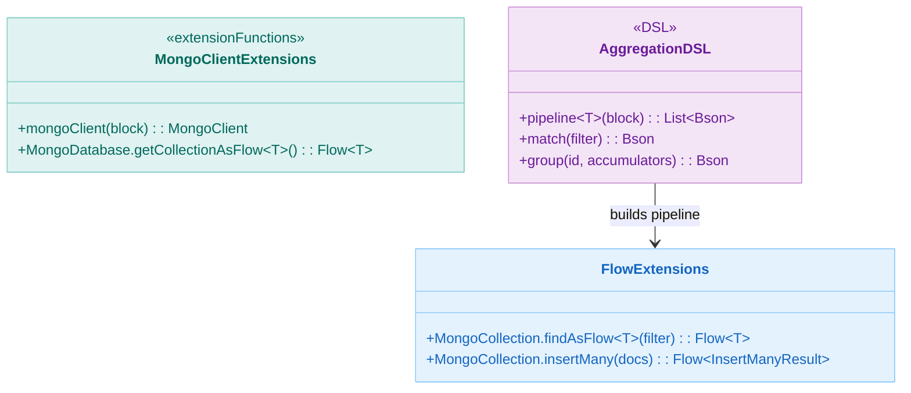
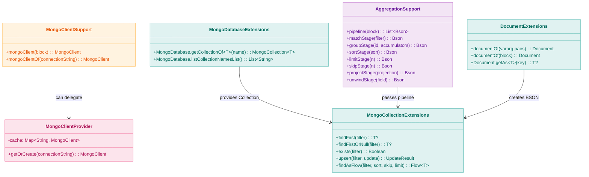
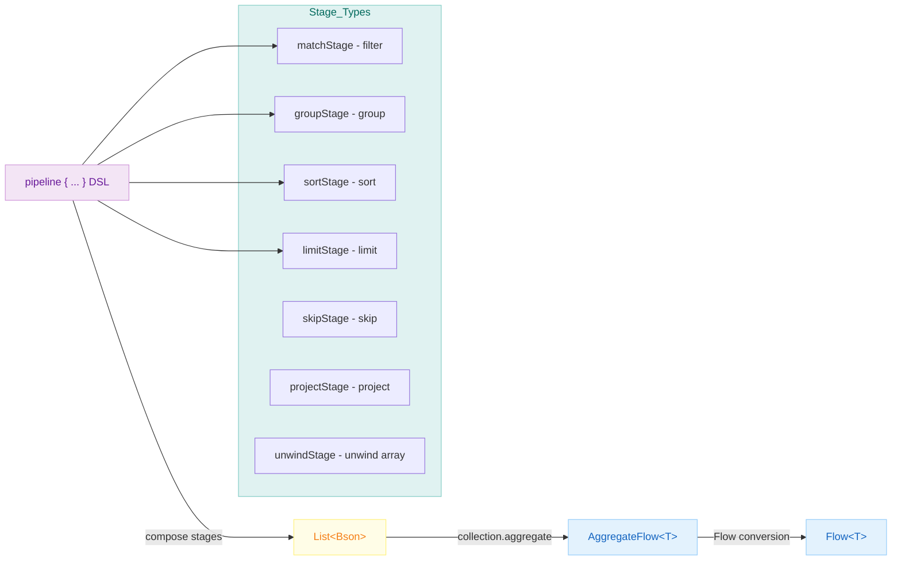

# Module bluetape4k-mongodb

English | [한국어](./README.ko.md)

An extension library that makes the [MongoDB Kotlin Coroutine Driver](https://www.mongodb.com/docs/drivers/kotlin/coroutine/current/) more convenient to use.

Since the MongoDB Kotlin Coroutine Driver (v5.x) already provides native `suspend` functions and
`Flow`, this module focuses exclusively on **genuinely missing convenience features
** without adding unnecessary wrappers.

## Features

- **MongoClient DSL**: `mongoClient {}` builder and `mongoClientOf()` factory function
- **MongoClient Caching**: `MongoClientProvider` — instance caching based on connection string
- **Database Extensions**: Reified `getCollectionOf<T>()`, `listCollectionNamesList()`
- **Collection Extensions**: `findFirst`, `exists`, `upsert`, `findAsFlow` (skip/limit/sort in one call)
- **BSON Document DSL**: `documentOf {}` builder, type-safe `getAs<T>()` accessor
- **Aggregation Pipeline DSL**: `pipeline {}` + `matchStage`, `groupStage`, `sortStage`, and more

## Dependency

```kotlin
dependencies {
    implementation("io.github.bluetape4k:bluetape4k-mongodb:${bluetape4kVersion}")
}
```

## Core Features

### 1. Creating a MongoClient

```kotlin
import io.bluetape4k.mongodb.*

// Create using DSL
val client = mongoClient {
    applyConnectionString(ConnectionString("mongodb://localhost:27017"))
}

// Convenience factory
val client2 = mongoClientOf("mongodb://localhost:27017")

// Connection-string-based caching (same URL → same instance)
val client3 = MongoClientProvider.getOrCreate("mongodb://localhost:27017")
```

### 2. Database & Collection Extensions

```kotlin
import io.bluetape4k.mongodb.*

// Get a collection using a reified type (no need to pass Document::class.java explicitly)
val collection = database.getCollectionOf<Person>("persons")

// Collect collection names eagerly into a List
val names: List<String> = database.listCollectionNamesList()
```

### 3. Collection Convenience Functions

Since native operations like `insertOne()`, `updateOne()`, and `deleteOne()` are already
`suspend` functions, this module only adds frequently-used composite patterns.

```kotlin
import io.bluetape4k.mongodb.*
import com.mongodb.client.model.Filters
import com.mongodb.client.model.Sorts
import com.mongodb.client.model.Updates

// Find the first matching document
val user: Person? = collection.findFirst(Filters.eq("name", "Alice"))

// Check existence
val exists: Boolean = collection.exists(Filters.eq("email", "alice@example.com"))

// Upsert (insert if absent, update if present)
val result = collection.upsert(
    filter = Filters.eq("name", "Alice"),
    update = Updates.set("age", 31)
)

// Filter + sort + pagination in a single call
val flow: Flow<Person> = collection.findAsFlow(
    filter = Filters.gt("age", 20),
    sort = Sorts.ascending("name"),
    skip = 10,
    limit = 5
)
flow.collect { println(it) }
```

### 4. BSON Document DSL

```kotlin
import io.bluetape4k.mongodb.bson.*

// Create quickly from key-value pairs
val doc = documentOf("name" to "Alice", "age" to 30, "city" to "Seoul")

// DSL builder
val doc2 = documentOf {
    put("name", "Bob")
    put("tags", listOf("admin", "user"))
}

// Type-safe, null-safe access
val name: String? = doc.getAs<String>("name")
val age: Int? = doc.getAs<Int>("age")
```

### 5. Aggregation Pipeline DSL

Since the native `aggregate(pipeline)` function already returns `AggregateFlow<T>` (which implements
`Flow<T>`), this module only provides a **stage composition DSL**.

```kotlin
import io.bluetape4k.mongodb.aggregation.*
import com.mongodb.client.model.Accumulators
import com.mongodb.client.model.Filters
import com.mongodb.client.model.Sorts

// Compose stages using the pipeline {} DSL
val stages = pipeline {
    add(matchStage(Filters.gt("age", 20)))
    add(groupStage("city", Accumulators.sum("count", 1)))
    add(sortStage(Sorts.descending("count")))
    add(limitStage(5))
}

// Execute using the native aggregate() (already returns a Flow)
val results = collection.aggregate<Document>(stages).toList()

// Unwind example
val unwindStages = pipeline {
    add(matchStage(Filters.exists("tags")))
    add(unwindStage("tags"))          // Expand the $tags array
    add(groupStage("tags", Accumulators.sum("count", 1)))
    add(sortStage(Sorts.descending("count")))
}
```

## Test Support

```kotlin
import io.bluetape4k.mongodb.AbstractMongoTest

class MyMongoTest : AbstractMongoTest() {

    private val collection by lazy {
        database.getCollectionOf<Document>("my_collection")
    }

    @BeforeEach
    fun setUp() = runTest {
        collection.drop()
        collection.insertMany(testData)
    }

    @Test
    fun `document lookup test`() = runTest {
        val doc = collection.findFirst(Filters.eq("name", "Alice"))
        doc.shouldNotBeNull()
        doc.getString("name") shouldBeEqualTo "Alice"
    }
}
```

`AbstractMongoTest` automatically starts a [MongoDBServer](../testing/testcontainers) Testcontainer and provides a Kotlin Coroutine driver-based
`MongoClient` and `MongoDatabase`.

## Intentionally Excluded (already provided by the native driver)

| Excluded Item                                 | Reason                                                                          |
|-----------------------------------------------|---------------------------------------------------------------------------------|
| `insertOne/Many/updateOne/deleteOne` wrappers | Native CRUD operations are already `suspend`                                    |
| Filter/Sort/Update/Projection string DSL      | The KProperty-based DSL in `mongodb-driver-kotlin-extensions` is more type-safe |
| `createIndex/dropIndex` wrappers              | Already `suspend`                                                               |
| `aggregateAsFlow()`                           | Native `aggregate()` already returns `AggregateFlow<T>` (= `Flow`)              |

## Architecture Diagrams

### Core Class Structure



### Module API Structure



### Aggregation Pipeline Data Flow



## References

- [MongoDB Kotlin Coroutine Driver Official Documentation](https://www.mongodb.com/docs/drivers/kotlin/coroutine/current/)
- [MongoDB Kotlin Extensions](https://www.mongodb.com/docs/drivers/kotlin/coroutine/current/fundamentals/type-safe-queries/)
- [MongoDB Aggregation Pipeline](https://www.mongodb.com/docs/manual/core/aggregation-pipeline/)

## License

Apache License 2.0
