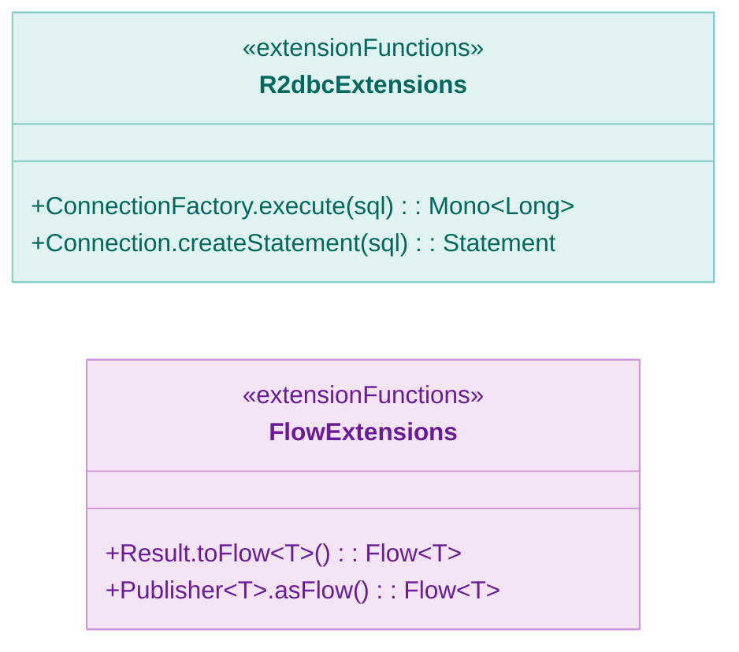
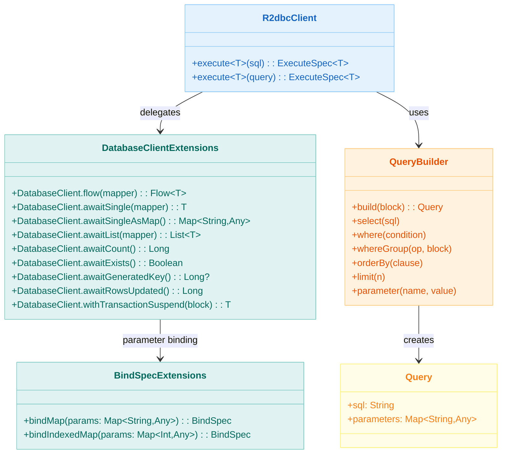
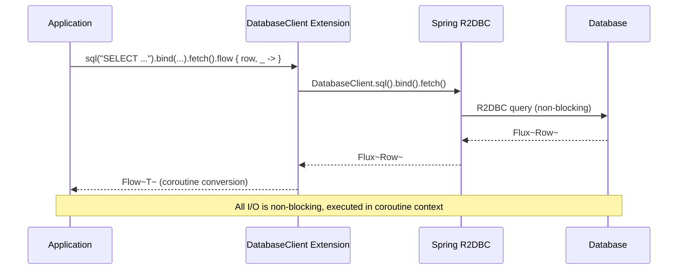
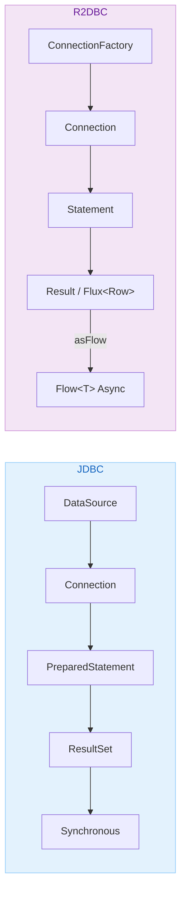

# Module bluetape4k-r2dbc

English | [한국어](./README.ko.md)

A library that supports reactive data access using Coroutines and Flow in an R2DBC (Reactive Relational Database Connectivity) environment.

## Features

- **Kotlin Coroutines/Flow Support**: Converts R2DBC Reactive streams to Kotlin Flow
- **DatabaseClient Extensions**: Parameter binding and SQL execution helpers
- **Query Builder**: Convenient builder for composing dynamic queries
- **Transaction Support**: R2DBC transaction management
- **Spring Boot Auto Configuration**: Automatic configuration in a Spring environment

## Dependency

```kotlin
dependencies {
    implementation("io.github.bluetape4k:bluetape4k-r2dbc:${version}")
}
```

## Core Features

### 1. Executing SQL with DatabaseClient

```kotlin
import io.bluetape4k.r2dbc.support.*
import kotlinx.coroutines.flow.toList

// Execute a SELECT query
val users = databaseClient
    .sql("SELECT * FROM users WHERE active = :active")
    .bind("active", true)
    .fetch()
    .flow { row, _ ->
        User(
            id = row.get("id") as Int,
            name = row.get("name") as String,
            email = row.get("email") as String
        )
    }
    .toList()

// Fetch a single result
val user = databaseClient
    .sql("SELECT * FROM users WHERE id = :id")
    .bind("id", 1)
    .fetch()
    .awaitSingle { row, _ ->
        User(
            id = row.get("id") as Int,
            name = row.get("name") as String
        )
    }

// Fetch result as a Map
val userMap = databaseClient
    .sql("SELECT * FROM users WHERE id = :id")
    .bind("id", 1)
    .fetch()
    .awaitSingleAsMap()
```

### 2. Parameter Binding

```kotlin
// Bind parameters from a Map
val parameters = mapOf(
    "username" to "john",
    "active" to true
)

val users = databaseClient
    .sql("SELECT * FROM users WHERE username = :username AND active = :active")
    .bindMap(parameters)
    .fetch()
    .flow { row, _ -> /* mapping */ }

// Index-based parameter binding
val indexedParams = mapOf(
    1 to "john",
    2 to true
)

val users = databaseClient
    .sql("SELECT * FROM users WHERE username = ? AND active = ?")
    .bindIndexedMap(indexedParams)
    .fetch()
    .flow { row, _ -> /* mapping */ }
```

### 3. CRUD Operations

```kotlin
// INSERT and return generated key
val generatedId = databaseClient
    .sqlInsert("INSERT INTO users (name, email) VALUES (:name, :email)")
    .bind("name", "John Doe")
    .bind("email", "john@example.com")
    .fetch()
    .awaitGeneratedKey()

// UPDATE
val affectedRows = databaseClient
    .sqlUpdate("UPDATE users SET name = :name WHERE id = :id")
    .bind("name", "Jane Doe")
    .bind("id", 1)
    .fetch()
    .awaitRowsUpdated()

// DELETE
val deletedRows = databaseClient
    .sqlDelete("DELETE FROM users WHERE id = :id")
    .bind("id", 1)
    .fetch()
    .awaitRowsUpdated()
```

### 4. Flow and Coroutine Support

```kotlin
import kotlinx.coroutines.flow.*

// Collect results as a Flow
val userFlow: Flow<User> = databaseClient
    .sql("SELECT * FROM users")
    .fetch()
    .flow { row, metadata ->
        User(
            id = row.get("id") as Int,
            name = row.get("name") as String
        )
    }

// Transform the Flow
val names = userFlow
    .map { it.name }
    .filter { it.startsWith("A") }
    .toList()

// Collect into a List
val users = databaseClient
    .sql("SELECT * FROM users")
    .fetch()
    .awaitList { row, _ -> /* mapping */ }
```

### 5. Transaction Management

```kotlin
import io.bluetape4k.r2dbc.support.withTransactionSuspend

// Execute within a transaction
databaseClient.withTransactionSuspend { tx ->
    databaseClient
        .sql("INSERT INTO accounts (user_id, balance) VALUES (:userId, :balance)")
        .bind("userId", 1)
        .bind("balance", 1000)
        .fetch()
        .awaitRowsUpdated()

    databaseClient
        .sql("INSERT INTO logs (message) VALUES (:message)")
        .bind("message", "Account created")
        .fetch()
        .awaitRowsUpdated()

    "success"
}
```

### 6. Query Builder

```kotlin
import io.bluetape4k.r2dbc.query.QueryBuilder

// Compose a dynamic query
val query = QueryBuilder().build {
    select("SELECT * FROM users")
    parameter("active", true)
    whereGroup("and") {
        where("username LIKE :pattern")
        where("created_at > :date")
    }
    orderBy("created_at DESC")
    limit(10)
}

// Execute the query
val users = databaseClient
    .sql(query.sql)
    .bindMap(query.parameters)
    .fetch()
    .flow { row, _ -> /* mapping */ }
```

### 7. Using R2dbcClient

```kotlin
import io.bluetape4k.r2dbc.R2dbcClient
import io.bluetape4k.r2dbc.core.execute

// Execute a query with R2dbcClient
val r2dbcClient: R2dbcClient = TODO() // injected

val users = r2dbcClient
    .execute<User>("SELECT * FROM users WHERE active = :active")
    .bind("active", true)
    .fetch()
    .flow()

// Execute with a Query object
val query = QueryBuilder().build { /* ... */ }
val results = r2dbcClient.execute<User>(query).fetch()
```

### 8. Count and Existence Check

```kotlin
// Count
val count = databaseClient
    .sql("SELECT COUNT(*) FROM users WHERE active = :active")
    .bind("active", true)
    .fetch()
    .awaitCount()

// Check existence
val exists = databaseClient
    .sql("SELECT 1 FROM users WHERE id = :id")
    .bind("id", 1)
    .fetch()
    .awaitExists()
```

### 9. Spring Boot Auto Configuration

```yaml
# application.yml
spring:
  r2dbc:
    url: r2dbc:postgresql://localhost:5432/mydb
    username: user
    password: pass
```

```kotlin
// R2dbcClient auto-injection
@Service
class UserService(
    private val r2dbcClient: R2dbcClient
) {
    suspend fun findAll(): Flow<User> {
        return r2dbcClient
            .execute<User>("SELECT * FROM users")
            .fetch()
            .flow()
    }
}
```

## Test Support

```kotlin
import io.bluetape4k.r2dbc.AbstractR2dbcTest
import org.springframework.boot.test.autoconfigure.data.r2dbc.DataR2dbcTest

@DataR2dbcTest
class UserRepositoryTest: AbstractR2dbcTest() {

    @Test
    fun `user lookup test`() = runSuspendIO {
        val user = client.databaseClient
            .sql("SELECT * FROM users WHERE username = :username")
            .bind("username", "jsmith")
            .fetch()
            .awaitSingle { row, _ ->
                User(
                    id = row.get("user_id") as Int,
                    username = row.get("username") as String
                )
            }

        user.username shouldBeEqualTo "jsmith"
    }
}
```

## Architecture Diagrams

### Extension Function API Overview



### Core API Structure



### R2DBC Query Execution Flow



### JDBC vs R2DBC Comparison



## References

- [R2DBC Official Documentation](https://r2dbc.io/)
- [Spring Data R2DBC](https://docs.spring.io/spring-data/r2dbc/docs/current/reference/html/)
- [Kotlin Coroutines](https://kotlinlang.org/docs/coroutines-overview.html)
- [Kotlin Flow](https://kotlinlang.org/docs/flow.html)

## License

Apache License 2.0
