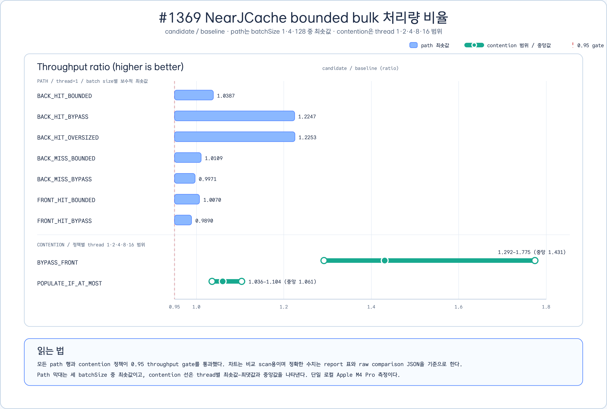
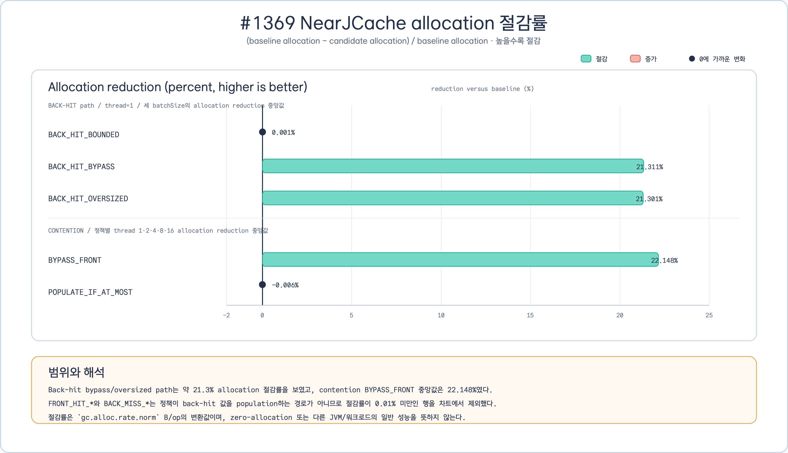

# Issue #1369 NearJCache bounded bulk benchmark - 2026-08-17

## 범위

- Issue: [#1369](https://github.com/bluetape4k/bluetape4k-projects/issues/1369)
- 문서 후속 Issue: [#1436](https://github.com/bluetape4k/bluetape4k-projects/issues/1436)
- Epic: [#1408](https://github.com/bluetape4k/bluetape4k-projects/issues/1408)
- 선행 구현 PR: [#1435](https://github.com/bluetape4k/bluetape4k-projects/pull/1435)
- 모듈/benchmark target: `:bluetape4k-cache-lettuce`, `NearJCacheBulkPathBenchmark`, `NearJCacheBulkContentionBenchmark`
- 결정 대상: `getAll()`의 bounded front population 정책을 기본 `BypassFront`와 bounded opt-in으로 유지할 수 있는지 검증

이 문서는 PR #1435에서 고정한 baseline/candidate raw evidence를 읽어 비교 결과와 chart를 제공한다. 이
slice에서는 JMH를 다시 실행하지 않았으며, 생산 코드·benchmark harness·#1368 작업은 변경하지 않았다.

## 실행 명령

측정에 사용한 명령은 다음과 같다. baseline과 candidate는 같은 harness, profile, fixture를 사용하고 출력
경로만 각각 `baseline/`과 `candidate/`로 바꾼다.

```bash
./gradlew :bluetape4k-cache-lettuce:benchmarkBenchmarkJar --no-configuration-cache

java -jar cache/cache-lettuce/build/benchmarks/benchmark/jars/bluetape4k-cache-lettuce-benchmark-jmh-1.13.0-JMH.jar \
  '.*NearJCacheBulkPathBenchmark.getAll.*' \
  -t 1 -f 3 -wi 3 -i 5 -w 500ms -r 500ms -prof gc -rf json \
  -rff docs/benchmarks/raw/issue-1369/candidate/path-t1.json

for threads in 1 2 4 8 16; do
  java -jar cache/cache-lettuce/build/benchmarks/benchmark/jars/bluetape4k-cache-lettuce-benchmark-jmh-1.13.0-JMH.jar \
    '.*NearJCacheBulkContentionBenchmark.getAll.*' \
    -t "$threads" -f 3 -wi 3 -i 5 -w 500ms -r 500ms -prof gc -rf json \
    -rff "docs/benchmarks/raw/issue-1369/candidate/contention-t${threads}.json"
done
```

비교는 `docs/benchmarks/issue-1351-compare.jq`를 사용했다. `path-t1`은 7개 scenario × 3개
`batchSize`인 21행이고, contention profile은 정책 2개를 thread 1·2·4·8·16에서 측정한 각 2행이다.

## 실행 조건

| 항목 | 값 |
|---|---|
| 측정일 | 2026-08-16에 수집된 raw evidence |
| OS / architecture | Darwin 26.6.1 arm64 |
| CPU | Apple M4 Pro |
| JVM | Oracle Corporation 25.0.4+7-LTS-jvmci-25.2-b20, Java HotSpot(TM) 64-Bit Server VM |
| Gradle / JMH | Gradle 9.7.0 / JMH 1.37 |
| JMH mode / unit | `thrpt` / `ops/ms` |
| profiler / allocation | `gc` / `gc.alloc.rate.norm` (`B/op`) |
| forks | 3 |
| warmup | 3 × 500 ms |
| measurement | 5 × 500 ms |
| threads | path 1, contention 1·2·4·8·16 |
| path fixture | 7 scenarios, `batchSize` 1·4·128 |
| contention fixture | `BYPASS_FRONT`, `POPULATE_IF_AT_MOST`, batch size 128 |

## Raw artifacts와 provenance

- [raw evidence 디렉터리](./raw/issue-1369/)
- [baseline manifest](./raw/issue-1369/baseline/manifest.json)
- [candidate manifest](./raw/issue-1369/candidate/manifest.json)
- [path comparison 21행](./raw/issue-1369/candidate/path-t1-comparison.json)
- [contention comparison thread 1](./raw/issue-1369/candidate/contention-t1-comparison.json)
- [contention comparison thread 2](./raw/issue-1369/candidate/contention-t2-comparison.json)
- [contention comparison thread 4](./raw/issue-1369/candidate/contention-t4-comparison.json)
- [contention comparison thread 8](./raw/issue-1369/candidate/contention-t8-comparison.json)
- [contention comparison thread 16](./raw/issue-1369/candidate/contention-t16-comparison.json)
- [기존 구현 교훈](../lessons/2026-08-16-issue-1369-nearcache-bounded-bulk.md)

candidate manifest의 SHA-256은
`5885fc483326647602f637ecc45de0d3a28e712bdbb6e7505039a5717854dbb4`이다. provenance는 다음과 같다.

| 항목 | 값 |
|---|---|
| measurement commit | `027ee9f675015bdd6d6e7be1490ef96c551e0a85` |
| measurement tree | `4bde98f4e408d456d6159a40723837893045f677` |
| raw evidence commit | `9b1737f73a562e1e0b0feec3775cce79ec8a309f` |
| benchmark source SHA-256 | `42efaf18c3ab37dec9861ecf032d1f91c10741c22fce3662d550e61260c397ab` |
| candidate JMH JAR SHA-256 | `de0f58a05953fa62ea83db817e80a59667152cf21290702fe95aaf8b20426900` |

## 결과

31개 comparison row가 모두 통과했다. throughput gate는 candidate/baseline `>= 0.95`이고, allocation
gate는 다음 상한을 사용했다.

```text
baseline allocation + max(0.001, baseline scoreError + candidate scoreError)
```

전체 throughput ratio 범위는 `0.9889508759282967`–`1.774692209490313`이고, allocation 허용 상한 대비
최소 여유는 `0.03450067306687288 B/op`였다. 아래 표는 raw comparison을 차트용으로 보수적으로 집계한
값이다. 정확한 원시 수치는 위 JSON을 기준으로 한다.

### Path throughput ratio

`thread=1`에서 각 scenario의 세 `batchSize` 중 최솟값이다.

| Scenario | 최소 ratio |
|---|---:|
| `BACK_HIT_BOUNDED` | 1.038713 |
| `BACK_HIT_BYPASS` | 1.224739 |
| `BACK_HIT_OVERSIZED` | 1.225349 |
| `BACK_MISS_BOUNDED` | 1.010862 |
| `BACK_MISS_BYPASS` | 0.997069 |
| `FRONT_HIT_BOUNDED` | 1.007033 |
| `FRONT_HIT_BYPASS` | 0.988951 |

### Contention throughput ratio

각 정책의 thread 1·2·4·8·16 결과에서 최솟값–최댓값과 중앙값을 집계했다.

| Policy | 범위 | 중앙값 |
|---|---:|---:|
| `BYPASS_FRONT` | 1.291551–1.774692 | 1.430842 |
| `POPULATE_IF_AT_MOST` | 1.035548–1.103550 | 1.060633 |

### Allocation reduction

절감률은 `(baseline B/op - candidate B/op) / baseline B/op * 100`이다. back-hit population을 실제로
수행하는 path와 contention 정책만 포함했다.

| Scope | 중앙 절감률 |
|---|---:|
| `BACK_HIT_BOUNDED` | 0.001% |
| `BACK_HIT_BYPASS` | 21.311% |
| `BACK_HIT_OVERSIZED` | 21.301% |
| contention `BYPASS_FRONT` | 22.148% |
| contention `POPULATE_IF_AT_MOST` | -0.006% |

## Chart artifacts

처리량과 allocation은 단위와 의미가 다르므로 차트를 분리했다. 표와 raw JSON이 정밀한 수치의 source of
truth이고, PNG는 빠른 비교용, SVG는 검토·재사용 가능한 원본이다.

### Throughput ratio

[SVG 원본](../images/readme-charts/issue1369-nearcache-bulk-throughput-ratio-chart-01.svg) ·
[PNG](../images/readme-charts/issue1369-nearcache-bulk-throughput-ratio-chart-01.png)



path는 세 `batchSize` 중 최솟값, contention은 thread별 범위와 중앙값으로 표시했다. 0.95 gate를 함께
표시해 보수적 하한을 빠르게 확인할 수 있다.

### Allocation reduction

[SVG 원본](../images/readme-charts/issue1369-nearcache-bulk-allocation-reduction-chart-01.svg) ·
[PNG](../images/readme-charts/issue1369-nearcache-bulk-allocation-reduction-chart-01.png)



`FRONT_HIT_*`와 `BACK_MISS_*`는 back-hit 값을 front에 population하는 경로가 아니며, median 절대 변화가
0.01% 미만이므로 allocation 차트에서 제외했다. 제외 범위와 이유는 [chart source manifest](../images/readme-charts/issue1369-nearcache-bulk-chart-source.json)에 고정했다.

### Chart provenance

- [chart source manifest](../images/readme-charts/issue1369-nearcache-bulk-chart-source.json)
- [semantic ledger](../images/readme-charts/issue1369-nearcache-bulk-chart.semantic.json)
- chart SVG의 `data-manifest-sha`는 candidate manifest SHA와 일치한다.
- source manifest에는 6개 comparison input의 SHA-256, row 수, aggregation 식, 제외 범위가 기록돼 있다.

## 분석과 해석

- `BACK_HIT_BYPASS`와 `BACK_HIT_OVERSIZED`는 최소 throughput ratio가 각각 1.224739와 1.225349이고,
  allocation은 약 21.3% 줄었다. back hit를 front에 저장하지 않는 기본 경로의 비용·거주량 이점을 보여준다.
- `BACK_HIT_BOUNDED`는 all-or-nothing bounded population을 수행하면서도 최소 ratio 1.038713을 기록했고,
  allocation 변화는 0.001%로 사실상 중립이다. 상한 이하일 때만 population한다는 계약과 일치한다.
- contention의 `BYPASS_FRONT`는 ratio 중앙값 1.430842, allocation 중앙값 22.148% 절감이었다.
  `POPULATE_IF_AT_MOST`는 ratio 중앙값 1.060633, allocation 중앙값 -0.006%로 bounded population의 추가
  allocation 절감은 관찰되지 않았다.
- front hit와 back miss의 최솟값도 0.95 gate 위에 있어 회귀 증거는 없지만, `FRONT_HIT_BYPASS`의
  0.988951은 일반적인 성능 향상을 의미하지 않는다.
- 이 결과가 증명하는 것은 고정된 harness·fixture·환경에서의 candidate/baseline 비교와 정책별 allocation
  경계이다. 다른 JVM, CPU, payload, Redis/remote back cache, latency percentile, production traffic의
  일반 성능을 주장하는 자료가 아니다.

## 제한과 후속 작업

- 단일 Apple M4 Pro와 한 JVM/toolchain에서 측정했으므로 source·JAR·환경이 바뀌면 baseline/candidate
  pair를 함께 재측정해야 한다.
- 현재 profile은 throughput과 allocation만 포함하며 p99 latency, GC pause, 네트워크 back cache,
  production traffic shape는 포함하지 않는다.
- [#1436](https://github.com/bluetape4k/bluetape4k-projects/issues/1436)은 이 report/chart와
  benchmark index·module 문서 링크를 소유한다.
- [#1368](https://github.com/bluetape4k/bluetape4k-projects/issues/1368)은 #1369의 exact head와
  CI/review 수렴 이후 별도 stacked slice로 시작한다. 이 문서와 같은 변경에 섞지 않는다.
