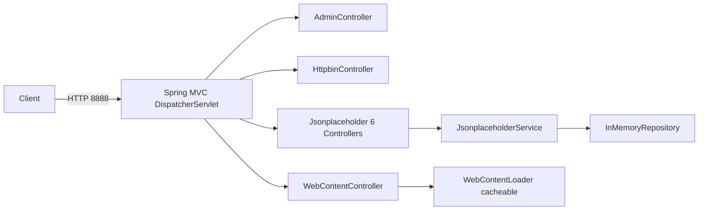
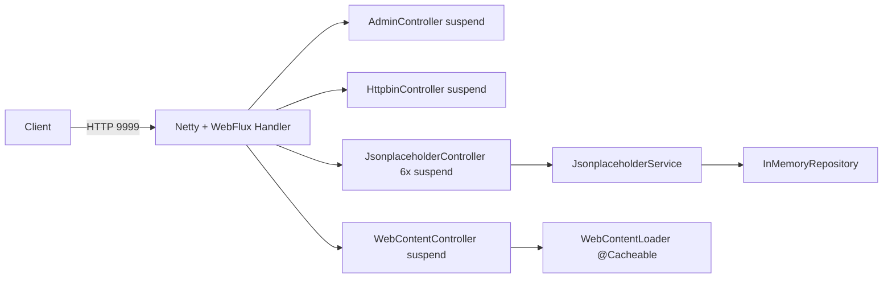

# Mock Server Expansion Implementation Plan

> **For agentic workers:
** REQUIRED SUB-SKILL: Use superpowers:subagent-driven-development (recommended) or superpowers:executing-plans to implement this plan task-by-task. Steps use checkbox (
`- [ ]`) syntax for tracking.

**Goal:** Rename `testing/mock-server` to `testing/mock-web-server` and add a sibling
`testing/mock-webflux-server` module that serves the same HTTP contract via Spring WebFlux + Coroutines, wired into testcontainers as
`BluetapeWebfluxServer`.

**Architecture:
** Two independent Spring Boot 4 application modules share an endpoint contract but diverge on stack: MVC + Virtual Threads (port 8888) vs WebFlux + Coroutines (port 9999). Each module builds its own Jib image, has its own Gatling simulation, and has integration tests covering 100% of endpoints.
`BluetapeWebfluxServer` mirrors `BluetapeHttpServer`'s `PropertyExportingServer` contract with a distinct
`bluetape-webflux` namespace.

**Tech Stack:
** Kotlin 2.3, Java 25 toolchain, Spring Boot 4.0.5, Jackson 3 (explicit opt-in), Coroutines, Testcontainers, Jib 3.4.4, Gatling 3.15 Java API, JUnit 5 + Kluent + OkHttp / WebTestClient.

**Worktree:** `.worktrees/feat/mock-server-expansion` (branch
`feat/mock-server-expansion`). All work runs inside the worktree.

---

## File Structure

### Renamed module: `testing/mock-web-server/`

Identical source tree (git mv). `build.gradle.kts` Jib image becomes
`bluetape4k/mock-web-server`. Fixture resource path is
`jsonplaceholder/` (already in place). Test suite expanded to cover all endpoints.

### New module: `testing/mock-webflux-server/`

```
src/main/kotlin/io/bluetape4k/mockwebflux/
  MockWebfluxServerApplication.kt
  admin/AdminController.kt              # suspend fun reset()
  admin/PingController.kt
  config/GlobalExceptionHandler.kt      # @RestControllerAdvice, no base class
  config/WebFluxJacksonConfig.kt        # register Jackson 3 codecs
  httpbin/HttpbinController.kt          # suspend
  httpbin/HttpbinAdvancedController.kt  # kotlinx.coroutines.delay()
  httpbin/HttpbinStreamController.kt    # Flow<String> NDJSON
  httpbin/HttpbinSupport.kt
  httpbin/ImageLoaderService.kt
  httpbin/model/HttpbinResponse.kt
  jsonplaceholder/ApplicationBootstrapConfig.kt
  jsonplaceholder/FixtureLoader.kt                      # ClassPathResource("jsonplaceholder/*.json")
  jsonplaceholder/InMemoryRepository.kt                 # ConcurrentHashMap + AtomicLong
  jsonplaceholder/JsonplaceholderService.kt
  jsonplaceholder/{Posts,Comments,Albums,Photos,Todos,Users}Controller.kt   # suspend CRUD
  jsonplaceholder/model/{Album,Comment,Photo,Post,Todo,User}Record.kt
  web/WebContentController.kt           # withContext(Dispatchers.IO) { loader.load(name) }
  web/WebContentLoader.kt               # non-suspend + @Cacheable (Method A)
src/main/resources/
  application.yml                       # port 9999
  jsonplaceholder/*.json                # copied
  web/html/*.html                       # copied
src/test/kotlin/io/bluetape4k/mockwebflux/...            # WebTestClient + Kluent
src/test/resources/junit-platform.properties + logback-test.xml
src/gatling/kotlin/.../MockWebfluxServerSimulation.kt
build.gradle.kts + README.md + README.ko.md
```

### Testcontainers integration

```
testing/testcontainers/src/main/kotlin/io/bluetape4k/testcontainers/http/
  BluetapeHttpServer.kt                 # IMAGE const updated
  BluetapeWebfluxServer.kt              # NEW
testing/testcontainers/src/test/kotlin/io/bluetape4k/testcontainers/
  http/BluetapeWebfluxServerTest.kt     # NEW
  PropertyExportingServerContractTest.kt  # add BluetapeWebfluxServer to expectedImplementors
testing/testcontainers/build.gradle.kts # add dependsOn(":bluetape4k-mock-webflux-server:jibDockerBuild")
```

---

## Endpoint Inventory (both servers, identical contract)

| #   | Method | Path                                  | Description                           |
|-----|--------|---------------------------------------|---------------------------------------|
| E01 | GET    | `/ping`                               | returns `"pong"`                      |
| E02 | POST   | `/admin/reset`                        | reloads fixtures                      |
| E03 | GET    | `/httpbin/get`                        | request echo                          |
| E04 | POST   | `/httpbin/post`                       | request echo with body                |
| E05 | PUT    | `/httpbin/put`                        | request echo with body                |
| E06 | PATCH  | `/httpbin/patch`                      | request echo with body                |
| E07 | DELETE | `/httpbin/delete`                     | request echo                          |
| E08 | GET    | `/httpbin/headers`                    | echo headers                          |
| E09 | GET    | `/httpbin/ip`                         | client IP                             |
| E10 | GET    | `/httpbin/user-agent`                 | User-Agent                            |
| E11 | GET    | `/httpbin/uuid`                       | random UUID                           |
| E12 | ANY    | `/httpbin/anything/**`                | method echo                           |
| E13 | GET    | `/httpbin/status/{code}`              | returns status                        |
| E14 | GET    | `/httpbin/bytes/{n}`                  | random bytes                          |
| E15 | GET    | `/httpbin/gzip`                       | gzip response                         |
| E16 | GET    | `/httpbin/deflate`                    | deflate response                      |
| E17 | GET    | `/httpbin/stream/{n}`                 | NDJSON stream                         |
| E18 | GET    | `/httpbin/image/{fmt}`                | png/jpeg/webp                         |
| E19 | GET    | `/httpbin/delay/{seconds}`            | sleep/delay                           |
| E20 | GET    | `/httpbin/redirect/{n}`               | 302 chain                             |
| E21 | GET    | `/httpbin/cookies`                    | list cookies                          |
| E22 | GET    | `/httpbin/cookies/set`                | set cookies                           |
| E23 | GET    | `/httpbin/cookies/delete`             | delete cookies                        |
| E24 | GET    | `/httpbin/basic-auth/{user}/{passwd}` | 401/200                               |
| E25 | GET    | `/httpbin/bearer`                     | Bearer validation                     |
| E26 | GET    | `/httpbin/cache`                      | 304 when If-Modified-Since set        |
| E27 | GET    | `/httpbin/cache/{value}`              | Cache-Control max-age                 |
| E28 | GET    | `/httpbin/etag/{etag}`                | If-None-Match handling                |
| E29 | CRUD   | `/jsonplaceholder/posts[/{id}]`       | full CRUD                             |
| E30 | CRUD   | `/jsonplaceholder/comments[/{id}]`    | full CRUD                             |
| E31 | CRUD   | `/jsonplaceholder/albums[/{id}]`      | full CRUD                             |
| E32 | CRUD   | `/jsonplaceholder/photos[/{id}]`      | full CRUD                             |
| E33 | CRUD   | `/jsonplaceholder/todos[/{id}]`       | full CRUD                             |
| E34 | CRUD   | `/jsonplaceholder/users[/{id}]`       | full CRUD                             |
| E35 | GET    | `/web/random`                         | random HTML                           |
| E36 | GET    | `/web/{name}`                         | `home, naver, google, login, article` |

Commit rhythm: commit after each task's final step. Korean commit messages with
`feat: / refactor: / test: / docs: / chore:` prefix.

---

## Task Dependency Summary

```
T02 -> T03, T04, T05, T06
T03 -> T07 -> T08
T04 -> T06
T06 -> T20
T09 -> T10 -> T11, T12
T11, T12 -> T13 -> T14
T09 -> T17
T15 -> T16
T17 -> T16
T08, T14 -> T21
T16, T19 -> T20 -> T22 -> T23
T18 -> T23
```

T09, T15, T18, T19 can run in parallel with T06/T11/T12 once T02 lands.

---

## Task 1: Worktree verification (T01)

**Complexity:** low
**Files:** none (already created)
**Depends on:** nothing
**Acceptance criteria:** git shows worktree on branch `feat/mock-server-expansion`.

- [ ] **Step 1: Verify worktree**

Run: `git worktree list`
Expected: line containing `.worktrees/feat/mock-server-expansion [feat/mock-server-expansion]`.

- [ ] **Step 2: Ensure all subsequent gradle/git commands run inside the worktree**

Run: `cd .worktrees/feat/mock-server-expansion`

---

## Task 2: Rename `testing/mock-server` to `testing/mock-web-server` (T02)

**Complexity:** medium
**Files:**

- Move: `testing/mock-server/` to `testing/mock-web-server/` (git mv preserves history)

**Depends on:** T01
**Acceptance criteria:**

- `./gradlew projects` prints `:bluetape4k-mock-web-server` and not `:bluetape4k-mock-server`
- `git log --follow testing/mock-web-server/build.gradle.kts` shows pre-rename history

- [ ] **Step 1: Move directory**

Run: `git mv testing/mock-server testing/mock-web-server`

- [ ] **Step 2: Verify auto-registration**

Run: `./gradlew projects --quiet`
Expected: output lists `:bluetape4k-mock-web-server` and not `:bluetape4k-mock-server`.

Also verify no stale `mock-server` reference remains in settings:

```bash
rg "mock-server" settings.gradle.kts
```

Expected: no output (auto-registration via `includeModules("testing", withBaseDir = false)` — no explicit
`include()` lines exist).

- [ ] **Step 3: Commit**

Run:

```
git add -A
git commit -m "refactor: testing/mock-server 를 testing/mock-web-server 로 이름 변경"
```

---

## Task 3: Update `mock-web-server` Jib image name (T03)

**Complexity:** low
**Files:**

- Modify: `testing/mock-web-server/build.gradle.kts` line 76 — `image = "bluetape4k/mock-server"` changes to
  `"bluetape4k/mock-web-server"`

**Depends on:** T02
**Acceptance criteria:**

- `./gradlew :bluetape4k-mock-web-server:build -x test` passes
- Grep for `bluetape4k/mock-server` under the module returns nothing

- [ ] **Step 1: Edit Jib `to.image`**

Replace the existing
`to { image = "bluetape4k/mock-server"; tags = setOf("latest", project.version.toString()) }` block with:

```kotlin
to {
    image = "bluetape4k/mock-web-server"
    tags = setOf("latest", project.version.toString())
}
```

- [ ] **Step 2: Build module**

Run: `./gradlew :bluetape4k-mock-web-server:build -x test`
Expected: BUILD SUCCESSFUL.

- [ ] **Step 3: Commit**

Run:

```
git add testing/mock-web-server/build.gradle.kts
git commit -m "chore: mock-web-server Jib 이미지명 bluetape4k/mock-web-server 로 변경"
```

---

## Task 4: Repo-wide rename sweep (T04)

**Complexity:** medium
**Files (representative list; exact set discovered via Grep tool):**

- Modify: `testing/testcontainers/build.gradle.kts` — `":bluetape4k-mock-server:..."` to
  `":bluetape4k-mock-web-server:..."`
- Modify: `testing/testcontainers/src/main/kotlin/io/bluetape4k/testcontainers/http/BluetapeHttpServer.kt` line 42 —
  `IMAGE = "bluetape4k/mock-server"` to `"bluetape4k/mock-web-server"`
- Modify: `CLAUDE.md` Module Groups `testing/` row
- Modify: `testing/testcontainers/README.md` and `README.ko.md`

**Depends on:** T02, T03
**Acceptance criteria:**

- Grep for `bluetape4k-mock-server` (module) returns 0 hits — excluding `docs/superpowers/`, `docs/testlogs/`, `.git/`
- Grep for `bluetape4k/mock-server` (image) returns 0 hits — excluding same directories
- `./gradlew :bluetape4k-testcontainers:compileKotlin` passes

- [ ] **Step 1: Find every reference**

Use Grep tool with pattern `bluetape4k-mock-server|bluetape4k/mock-server` across the repo. When evaluating results, *
*exclude** hits in:

- `docs/superpowers/` (spec/plan files — historical, not code)
- `docs/testlogs/` (changelog — historical)
- `.git/` (git history)

- [ ] **Step 2: Replace references**

Apply Edit tool to each **source/config** file, replacing:

- `bluetape4k-mock-server` to `bluetape4k-mock-web-server`
- `bluetape4k/mock-server` to `bluetape4k/mock-web-server`

Do NOT edit `docs/superpowers/` or `docs/testlogs/` files.

- [ ] **Step 3: Re-verify**

Run Grep again with the same pattern, filter out docs/ and testlogs/ directories. Expected: no remaining source/config hits.

- [ ] **Step 4: Compile testcontainers**

Run: `./gradlew :bluetape4k-testcontainers:compileKotlin`
Expected: BUILD SUCCESSFUL.

- [ ] **Step 5: Commit**

Run:

```
git add -A
git commit -m "refactor: 다운스트림에서 mock-server 참조를 mock-web-server 로 일괄 변경"
```

---

## Task 5: Update `mock-web-server` README ko/en (T05)

**Complexity:** low
**Files:**

- Modify: `testing/mock-web-server/README.md`
- Modify: `testing/mock-web-server/README.ko.md`

**Depends on:** T02
**Acceptance criteria:**

- Sections in order: `## Architecture`, `## UML`, `## Features`, `## Examples`
- At least one Mermaid diagram in each README
- Language-switch link directly below each title (`[한국어](./README.ko.md) | English` in `.md`;
  `한국어 | [English](./README.md)` in `.ko.md`)
- Module name and image name mention both `bluetape4k-mock-web-server` and `bluetape4k/mock-web-server`

- [ ] **Step 1: Update English README**

Title `# bluetape4k-mock-web-server`. Second line:
`[한국어](./README.ko.md) | English`. Sections in the required order. Include this Mermaid block under `## UML`:



- [ ] **Step 2: Update Korean README in sync**

Mirror structure; second line is `한국어 | [English](./README.md)`.

- [ ] **Step 3: Commit**

Run:

```
git add testing/mock-web-server/README.md testing/mock-web-server/README.ko.md
git commit -m "docs: mock-web-server README 이중 언어 및 UML 다이어그램 추가"
```

---

## Task 6: 100% endpoint coverage — mock-web-server integration tests (T06)

**Complexity:** high
**Files:**

- Keep: `HttpbinContractTest.kt`, `HttpbinAdvancedContractTest.kt`, `JsonplaceholderContractTest.kt`,
  `InMemoryRepositoryTest.kt`
- Create: `testing/mock-web-server/src/test/kotlin/io/bluetape4k/mockserver/admin/PingContractTest.kt` (E01)
- Create: `testing/mock-web-server/src/test/kotlin/io/bluetape4k/mockserver/admin/AdminResetContractTest.kt` (E02)
- Create or extend:
  `testing/mock-web-server/src/test/kotlin/io/bluetape4k/mockserver/httpbin/HttpbinStreamContractTest.kt` (E15–E18)
- Create: `testing/mock-web-server/src/test/kotlin/io/bluetape4k/mockserver/web/WebContentContractTest.kt` (E35, E36)
- Fill gaps in existing classes so every endpoint has one method (matrix below)

**Test stack:** `@SpringBootTest(webEnvironment = RANDOM_PORT)` + OkHttp + Kluent.

**Depends on:** T02, T04
**Acceptance criteria:**

- `./gradlew :bluetape4k-mock-web-server:test` passes
- Exactly one test method per endpoint E01–E36

**Endpoint -> Test method matrix (all must exist):**

| Endpoint | Test class                  | Method name                                     |
|----------|-----------------------------|-------------------------------------------------|
| E01      | PingContractTest            | `ping_returns_pong`                             |
| E02      | AdminResetContractTest      | `admin_reset_reloads_fixtures`                  |
| E03      | HttpbinContractTest         | `get_echoes_request`                            |
| E04      | HttpbinContractTest         | `post_echoes_body`                              |
| E05      | HttpbinContractTest         | `put_echoes_body`                               |
| E06      | HttpbinContractTest         | `patch_echoes_body`                             |
| E07      | HttpbinContractTest         | `delete_echoes_request`                         |
| E08      | HttpbinContractTest         | `headers_endpoint_echoes_headers`               |
| E09      | HttpbinContractTest         | `ip_endpoint_returns_client_ip`                 |
| E10      | HttpbinContractTest         | `user_agent_endpoint_returns_ua`                |
| E11      | HttpbinContractTest         | `uuid_endpoint_returns_valid_uuid`              |
| E12      | HttpbinContractTest         | `anything_echoes_method_and_path`               |
| E13      | HttpbinContractTest         | `status_endpoint_returns_requested_status`      |
| E14      | HttpbinContractTest         | `bytes_endpoint_returns_n_random_bytes`         |
| E15      | HttpbinStreamContractTest   | `gzip_endpoint_returns_gzip_encoded`            |
| E16      | HttpbinStreamContractTest   | `deflate_endpoint_returns_deflate_encoded`      |
| E17      | HttpbinStreamContractTest   | `stream_endpoint_returns_ndjson_lines`          |
| E18      | HttpbinStreamContractTest   | `image_endpoint_returns_content_type_match`     |
| E19      | HttpbinAdvancedContractTest | `delay_endpoint_waits_requested_seconds`        |
| E20      | HttpbinAdvancedContractTest | `redirect_endpoint_returns_302_chain`           |
| E21      | HttpbinAdvancedContractTest | `cookies_endpoint_lists_cookies`                |
| E22      | HttpbinAdvancedContractTest | `cookies_set_stores_cookie`                     |
| E23      | HttpbinAdvancedContractTest | `cookies_delete_removes_cookie`                 |
| E24      | HttpbinAdvancedContractTest | `basic_auth_returns_401_on_missing_credentials` |
| E25      | HttpbinAdvancedContractTest | `bearer_returns_401_without_bearer`             |
| E26      | HttpbinAdvancedContractTest | `cache_returns_304_when_if_modified_since_set`  |
| E27      | HttpbinAdvancedContractTest | `cache_value_sets_cache_control_max_age`        |
| E28      | HttpbinAdvancedContractTest | `etag_returns_304_on_if_none_match`             |
| E29      | JsonplaceholderContractTest | `posts_crud_roundtrip`                          |
| E30      | JsonplaceholderContractTest | `comments_crud_roundtrip`                       |
| E31      | JsonplaceholderContractTest | `albums_crud_roundtrip`                         |
| E32      | JsonplaceholderContractTest | `photos_crud_roundtrip`                         |
| E33      | JsonplaceholderContractTest | `todos_crud_roundtrip`                          |
| E34      | JsonplaceholderContractTest | `users_crud_roundtrip`                          |

> **M3 참고**: E29–E34는 각각 "리소스당 1개 테스트" 방식. 각 roundtrip 메서드에서 POST→GET→PATCH→DELETE를 검증한다.
> 메서드별로 분리할 경우 테스트 수가 크게 늘어나므로 roundtrip 단일 검증을 채택한다. | E35 | WebContentContractTest |
`web_random_returns_html` | | E36 | WebContentContractTest | `web_named_returns_html_for_each_name` |

- [ ] **Step 0: Create `MockServerTestBase.kt`**

모든 T06 테스트가 상속하는 베이스 클래스. `@SpringBootTest(RANDOM_PORT)` + OkHttp 패턴.

```kotlin
package io.bluetape4k.mockserver

import io.bluetape4k.logging.KLogging
import okhttp3.OkHttpClient
import org.springframework.boot.test.context.SpringBootTest
import org.springframework.boot.test.web.server.LocalServerPort
import java.util.concurrent.TimeUnit

@SpringBootTest(
    classes = [MockServerApplication::class],
    webEnvironment = SpringBootTest.WebEnvironment.RANDOM_PORT,
)
abstract class MockServerTestBase {
    companion object : KLogging()

    @LocalServerPort
    protected var port: Int = 0

    protected val baseUrl: String get() = "http://localhost:$port"

    protected val client: OkHttpClient = OkHttpClient.Builder()
        .connectTimeout(5, TimeUnit.SECONDS)
        .readTimeout(30, TimeUnit.SECONDS)
        .build()
}
```

Create: `testing/mock-web-server/src/test/kotlin/io/bluetape4k/mockserver/MockServerTestBase.kt`

Run: `./gradlew :bluetape4k-mock-web-server:compileTestKotlin` — expect BUILD SUCCESSFUL before proceeding.

- [ ] **Step 1: Write `PingContractTest.kt`**

```kotlin
package io.bluetape4k.mockserver.admin

import io.bluetape4k.mockserver.MockServerTestBase
import okhttp3.Request
import org.amshove.kluent.shouldBeEqualTo
import org.junit.jupiter.api.Test

class PingContractTest: MockServerTestBase() {
    @Test
    fun `ping_returns_pong`() {
        val req = Request.Builder().url("$baseUrl/ping").get().build()
        client.newCall(req).execute().use { response ->
            response.code shouldBeEqualTo 200
            response.body!!.string() shouldBeEqualTo "pong"
        }
    }
}
```

Run: `./gradlew :bluetape4k-mock-web-server:test --tests "*PingContractTest*"` — expect PASS.

- [ ] **Step 2: Write `AdminResetContractTest.kt`**

```kotlin
package io.bluetape4k.mockserver.admin

import io.bluetape4k.mockserver.MockServerTestBase
import okhttp3.Request
import okhttp3.RequestBody.Companion.toRequestBody
import org.amshove.kluent.shouldBeEqualTo
import org.amshove.kluent.shouldBeGreaterThan
import org.junit.jupiter.api.Test

class AdminResetContractTest: MockServerTestBase() {
    @Test
    fun `admin_reset_reloads_fixtures`() {
        val delete = Request.Builder().url("$baseUrl/jsonplaceholder/posts/1").delete().build()
        client.newCall(delete).execute().close()

        val req = Request.Builder()
            .url("$baseUrl/admin/reset")
            .post("".toRequestBody())
            .build()
        client.newCall(req).execute().use { response ->
            response.code shouldBeEqualTo 200
        }

        val get = Request.Builder().url("$baseUrl/jsonplaceholder/posts").get().build()
        client.newCall(get).execute().use { response ->
            response.code shouldBeEqualTo 200
            response.body!!.string().length shouldBeGreaterThan 100
        }
    }
}
```

- [ ] **Step 3: Add streaming endpoint tests (E15–E18) to `HttpbinStreamContractTest.kt`**

For gzip and deflate: assert `Content-Encoding` header. For `stream/{n}`: read body line-by-line (NDJSON) and assert
`n` lines. For `image/{fmt}`: assert `Content-Type` matches `image/png`, `image/jpeg`, or `image/webp`.

- [ ] **Step 4: Write `WebContentContractTest.kt`**

```kotlin
package io.bluetape4k.mockserver.web

import io.bluetape4k.mockserver.MockServerTestBase
import okhttp3.Request
import org.amshove.kluent.shouldBeEqualTo
import org.amshove.kluent.shouldContain
import org.junit.jupiter.api.Test
import org.junit.jupiter.params.ParameterizedTest
import org.junit.jupiter.params.provider.ValueSource

class WebContentContractTest: MockServerTestBase() {

    @Test
    fun `web_random_returns_html`() {
        val req = Request.Builder().url("$baseUrl/web/random").get().build()
        client.newCall(req).execute().use { response ->
            response.code shouldBeEqualTo 200
            response.header("Content-Type").orEmpty() shouldContain "text/html"
        }
    }

    @ParameterizedTest
    @ValueSource(strings = ["home", "naver", "google", "login", "article"])
    fun `web_named_returns_html_for_each_name`(name: String) {
        val req = Request.Builder().url("$baseUrl/web/$name").get().build()
        client.newCall(req).execute().use { response ->
            response.code shouldBeEqualTo 200
            response.body!!.string().lowercase() shouldContain "<html"
        }
    }
}
```

- [ ] **Step 5: Plug remaining matrix gaps**

Compare existing test classes against the matrix. For every row missing a matching method name, add one with the listed name. Keep assertions specific and avoid snapshot-wide asserts.

- [ ] **Step 6: Run full suite**

Run: `./bin/repo-test-summary -- ./gradlew :bluetape4k-mock-web-server:test`
Expected: 0 failures.

- [ ] **Step 7: Commit**

Run:

```
git add testing/mock-web-server/src/test
git commit -m "test: mock-web-server 전체 endpoint 100% 커버 통합 테스트 추가"
```

---

## Task 7: Gatling plugin + source set for mock-web-server (T07)

**Complexity:** medium
**Files:**

- Modify: `testing/mock-web-server/build.gradle.kts`
- Create: `testing/mock-web-server/src/gatling/kotlin/.gitkeep`
- Create: `testing/mock-web-server/src/gatling/resources/logback.xml`

**Depends on:** T03
**Acceptance criteria:**

- `./gradlew :bluetape4k-mock-web-server:tasks --all` lists at least one task starting with `gatlingRun`
- `./gradlew :bluetape4k-mock-web-server:check` does not invoke Gatling
- Regular `./gradlew build` still passes

- [ ] **Step 1: Add plugin and Gatling dependencies**

Append `id("io.gatling.gradle") version "3.15.0"` to the `plugins { ... }` block.

The `io.gatling.gradle` plugin automatically creates the `gatling` source set (`src/gatling/kotlin`) and the
`gatlingImplementation` configuration. **Do NOT create a custom source set** — use the plugin's built-in source set.

Append to `build.gradle.kts`:

```kotlin
dependencies {
    "gatlingImplementation"("io.gatling.highcharts:gatling-charts-highcharts:3.15.0")
    "gatlingImplementation"("io.gatling:gatling-core-java:3.15.0")
    "gatlingImplementation"("io.gatling:gatling-http-java:3.15.0")
}

// Prevent Gatling compilation from running during the standard `check` lifecycle.
// Using named task disable instead of fragile string-contains filter.
afterEvaluate {
    tasks.findByName("gatlingClasses")?.let { gatlingTask ->
        tasks.named("check") {
            setDependsOn(dependsOn.filter { dep ->
                dep.toString() != gatlingTask.path && dep.toString() != "gatlingClasses"
            })
        }
    }
}
```

- [ ] **Step 2: Verify tasks**

Run: `./gradlew :bluetape4k-mock-web-server:tasks --all`
Expected: output contains a `gatlingRun` task.

- [ ] **Step 3: Commit**

Run:

```
git add testing/mock-web-server/build.gradle.kts testing/mock-web-server/src/gatling
git commit -m "chore: mock-web-server 에 Gatling 3.15 플러그인 및 source set 추가"
```

---

## Task 8: Gatling simulation for mock-web-server (T08)

**Complexity:** medium
**Files:**

- Create: `testing/mock-web-server/src/gatling/kotlin/io/bluetape4k/mockserver/gatling/MockWebServerSimulation.kt`

**Depends on:** T07
**Acceptance criteria:**

- `./gradlew :bluetape4k-mock-web-server:compileGatlingKotlin` passes
- Simulation contains 5 scenarios: Health, Httpbin echo, Streaming, Delay, CRUD

- [ ] **Step 1: Create simulation**

```kotlin
package io.bluetape4k.mockserver.gatling

import io.gatling.javaapi.core.CoreDsl.StringBody
import io.gatling.javaapi.core.CoreDsl.atOnceUsers
import io.gatling.javaapi.core.CoreDsl.constantUsersPerSec
import io.gatling.javaapi.core.CoreDsl.global
import io.gatling.javaapi.core.CoreDsl.rampUsers
import io.gatling.javaapi.core.CoreDsl.scenario
import io.gatling.javaapi.core.Simulation
import io.gatling.javaapi.http.HttpDsl.http
import io.gatling.javaapi.http.HttpDsl.status
import java.time.Duration

class MockWebServerSimulation: Simulation() {

    private val baseUrl = System.getProperty("mock.web.server.baseUrl", "http://localhost:8888")

    private val httpProtocol = http.baseUrl(baseUrl).acceptHeader("application/json")

    private val healthScenario = scenario("health")
        .exec(http("GET /ping").get("/ping").check(status().`is`(200)))

    private val echoScenario = scenario("httpbin-echo")
        .exec(http("GET /httpbin/get").get("/httpbin/get").check(status().`is`(200)))

    private val streamScenario = scenario("stream")
        .exec(http("GET /httpbin/stream/100").get("/httpbin/stream/100").check(status().`is`(200)))

    private val delayScenario = scenario("delay")
        .exec(http("GET /httpbin/delay/1").get("/httpbin/delay/1").check(status().`is`(200)))

    private val crudScenario = scenario("crud-posts")
        .exec(
            http("POST").post("/jsonplaceholder/posts")
                .body(StringBody("""{"title":"gatling","body":"b","userId":1}"""))
                .header("Content-Type", "application/json")
                .check(status().`is`(201))
        )
        .exec(http("GET").get("/jsonplaceholder/posts/1").check(status().`is`(200)))
        .exec(
            http("PATCH").patch("/jsonplaceholder/posts/1")
                .body(StringBody("""{"title":"t2"}"""))
                .header("Content-Type", "application/json")
                .check(status().`is`(200))
        )
        .exec(http("DELETE").delete("/jsonplaceholder/posts/1").check(status().`is`(200)))

    init {
        setUp(
            healthScenario.injectOpen(constantUsersPerSec(200.0).during(Duration.ofSeconds(30))),
            echoScenario.injectOpen(rampUsers(100).during(Duration.ofSeconds(60))),
            streamScenario.injectOpen(atOnceUsers(20)),
            delayScenario.injectOpen(rampUsers(50).during(Duration.ofSeconds(30))),
            crudScenario.injectOpen(rampUsers(50).during(Duration.ofSeconds(60)))
        ).protocols(httpProtocol)
            .assertions(
                global().responseTime().percentile3().lt(50),
                global().failedRequests().percent().lt(1.0)
            )
    }
}
```

- [ ] **Step 2: Compile**

Run: `./gradlew :bluetape4k-mock-web-server:compileGatlingKotlin`
Expected: BUILD SUCCESSFUL.

- [ ] **Step 3: Commit**

Run:

```
git add testing/mock-web-server/src/gatling
git commit -m "test: mock-web-server Gatling 5가지 시나리오 Simulation 추가"
```

---

## Task 9: Scaffold `mock-webflux-server` module (T09)

**Complexity:** medium
**Files:**

- Create: `testing/mock-webflux-server/build.gradle.kts`
- Create: `testing/mock-webflux-server/src/main/resources/application.yml`
- Create: `testing/mock-webflux-server/src/main/resources/logback-spring.xml`
- Create: `testing/mock-webflux-server/src/main/kotlin/io/bluetape4k/mockwebflux/MockWebfluxServerApplication.kt`
- Create: `testing/mock-webflux-server/src/test/resources/junit-platform.properties`
- Create: `testing/mock-webflux-server/src/test/resources/logback-test.xml`

**Depends on:** T02
**Acceptance criteria:**

- `./gradlew :bluetape4k-mock-webflux-server:build -x test` passes
- `./gradlew projects --quiet` lists `:bluetape4k-mock-webflux-server`

### build.gradle.kts skeleton (full content)

```kotlin
plugins {
    kotlin("plugin.spring")
    kotlin("plugin.noarg")
    id("com.google.cloud.tools.jib") version "3.4.4"
}

// Java 25 toolchain — WebFlux uses Netty+Coroutines (not Virtual Threads), but same JVM target as mock-web-server
java { toolchain { languageVersion.set(JavaLanguageVersion.of(25)) } }
kotlin { jvmToolchain(25) }
tasks.withType<JavaCompile>().configureEach { options.release.set(25) }
tasks.withType<Test>().configureEach {
    javaLauncher.set(javaToolchains.launcherFor { languageVersion.set(JavaLanguageVersion.of(25)) })
}

// Application module: Jib image build, publishing disabled
tasks.withType<AbstractPublishToMaven>().configureEach { enabled = false }

dependencies {
    // Spring Boot 4 BOM via platform() — KGP 2.3 compatible
    implementation(platform(Libs.spring_boot4_dependencies))
    // Jackson 3 BOM — SB4 does not auto-opt-in
    implementation(platform(Libs.jackson3_bom))

    implementation(Libs.springBootStarter("webflux"))
    implementation(Libs.springBootStarter("cache"))
    implementation(Libs.springBootStarter("actuator"))  // H1: management endpoints 노출에 필요
    implementation(Libs.caffeine)
    implementation(Libs.jackson3_module_kotlin)

    implementation(Libs.kotlinx_coroutines_core)
    implementation(Libs.kotlinx_coroutines_reactor)

    implementation(project(":bluetape4k-core"))
    implementation(project(":bluetape4k-coroutines"))
    implementation(project(":bluetape4k-logging"))
    implementation(project(":bluetape4k-jackson2"))  // M4: mock-web-server 와 동일하게 추가

    testImplementation(Libs.springBootStarter("test")) {
        exclude(group = "junit", module = "junit")
        exclude(group = "org.junit.vintage", module = "junit-vintage-engine")
        exclude(group = "org.mockito", module = "mockito-core")
    }
    testImplementation(Libs.kluent)
    testImplementation(Libs.kotlinx_coroutines_test)
    testImplementation(project(":bluetape4k-junit5"))
}

tasks.withType<com.google.cloud.tools.jib.gradle.BuildDockerTask>().configureEach {
    notCompatibleWithConfigurationCache("Jib does not support Gradle configuration cache")
}
tasks.withType<com.google.cloud.tools.jib.gradle.BuildImageTask>().configureEach {
    notCompatibleWithConfigurationCache("Jib does not support Gradle configuration cache")
}

val jibMultiPlatform = project.hasProperty("jibMultiPlatform")
val hostArch = when (System.getProperty("os.arch")) {
    "aarch64" -> "arm64"
    else -> "amd64"
}

jib {
    from {
        image = "eclipse-temurin:25-jre-alpine"
        platforms {
            if (jibMultiPlatform) {
                platform { architecture = "amd64"; os = "linux" }
                platform { architecture = "arm64"; os = "linux" }
            } else {
                platform { architecture = hostArch; os = "linux" }
            }
        }
    }
    to {
        image = "bluetape4k/mock-webflux-server"
        tags = setOf("latest", project.version.toString())
    }
    container {
        ports = listOf("9999")
        jvmFlags = listOf("-XX:+UseG1GC", "-Xmx512m")
        mainClass = "io.bluetape4k.mockwebflux.MockWebfluxServerApplicationKt"
    }
    dockerClient {
        executable = "/opt/homebrew/bin/docker"
        environment = mapOf("DOCKER_HOST" to "unix:///Users/debop/.colima/default/docker.sock")
    }
}
```

### application.yml

```yaml
server:
    port: 9999
spring:
    application:
        name: mock-webflux-server
    jackson:
        default-property-inclusion: non_null
    cache:
        type: caffeine
        cache-names:
            - web-content    # WebFlux WebContentLoader 캐시 (MVC의 html-content 와 이름이 다름 — 의도적)
            - fixture-data
            - httpbin-image
management:
    endpoints:
        web:
            exposure:
                include: health,info
logging:
    level:
        io.bluetape4k.mockwebflux: INFO
```

### MockWebfluxServerApplication.kt

```kotlin
package io.bluetape4k.mockwebflux

import io.bluetape4k.logging.KLogging
import org.springframework.boot.autoconfigure.SpringBootApplication
import org.springframework.boot.runApplication
import org.springframework.cache.annotation.EnableCaching

@EnableCaching
@SpringBootApplication
class MockWebfluxServerApplication {
    companion object: KLogging()
}

fun main(args: Array<String>) {
    runApplication<MockWebfluxServerApplication>(*args)
}
```

### junit-platform.properties

```properties
junit.jupiter.execution.parallel.enabled=false
junit.jupiter.testinstance.lifecycle.default=per_class
```

### logback-test.xml (copy from mock-web-server)

Copy the existing file under
`testing/mock-web-server/src/test/resources/logback-test.xml`; adjust only the logger package line to
`io.bluetape4k.mockwebflux`.

### logback-spring.xml (main)

Standard INFO-level console appender with pattern `%d{yyyy-MM-dd HH:mm:ss.SSS} [%thread] %-5level %logger{36} - %msg%n`.

- [ ] **Step 1: Create each file with the content above**

- [ ] **Step 2: Build**

Run: `./gradlew :bluetape4k-mock-webflux-server:build -x test`
Expected: BUILD SUCCESSFUL.

- [ ] **Step 3: Commit**

Run:

```
git add testing/mock-webflux-server
git commit -m "feat: mock-webflux-server 모듈 스캐폴드 (build.gradle.kts, Application, 설정)"
```

---

## Task 10: Port fixtures, repository, service, bootstrap, exception handler (T10)

**Complexity:** medium
**Files:**

- Copy: `testing/mock-web-server/src/main/resources/jsonplaceholder/*.json` ->
  `testing/mock-webflux-server/src/main/resources/jsonplaceholder/*.json`
- Copy: `testing/mock-web-server/src/main/resources/web/html/*.html` ->
  `testing/mock-webflux-server/src/main/resources/web/html/*.html`
- Create (copy + repackage):
  `io/bluetape4k/mockwebflux/jsonplaceholder/model/{Album,Comment,Photo,Post,Todo,User}Record.kt`
- Create: `io/bluetape4k/mockwebflux/jsonplaceholder/InMemoryRepository.kt`
- Create: `io/bluetape4k/mockwebflux/jsonplaceholder/FixtureLoader.kt` — must read
  `ClassPathResource("jsonplaceholder/<name>.json")`
- Create: `io/bluetape4k/mockwebflux/jsonplaceholder/JsonplaceholderService.kt`
- Create: `io/bluetape4k/mockwebflux/jsonplaceholder/ApplicationBootstrapConfig.kt`
- Create: `io/bluetape4k/mockwebflux/config/GlobalExceptionHandler.kt` —
  `@RestControllerAdvice` with no base class (the MVC `ResponseEntityExceptionHandler` base is unavailable in WebFlux)

**Depends on:** T09
**Acceptance criteria:**

- `./gradlew :bluetape4k-mock-webflux-server:compileKotlin` passes
- `JsonplaceholderService` populates all 6 in-memory repositories on startup
- `FixtureLoader` reads `jsonplaceholder/` (not `fixtures/`)

- [ ] **Step 1: Copy resources**

Run (bash allowed for file moves):

```
cp testing/mock-web-server/src/main/resources/jsonplaceholder/*.json \
   testing/mock-webflux-server/src/main/resources/jsonplaceholder/
cp -r testing/mock-web-server/src/main/resources/web/html \
   testing/mock-webflux-server/src/main/resources/web/
```

- [ ] **Step 2: Port model records**

For each record class, copy source and change `package io.bluetape4k.mockserver.jsonplaceholder.model` to
`package io.bluetape4k.mockwebflux.jsonplaceholder.model`. No other changes.

- [ ] **Step 3: Port `InMemoryRepository`, `JsonplaceholderService`, `ApplicationBootstrapConfig`, `FixtureLoader`**

Same package prefix swap; otherwise identical. `FixtureLoader` keeps `ClassPathResource("jsonplaceholder/$name.json")`.

- [ ] **Step 4: Write WebFlux `GlobalExceptionHandler.kt`**

```kotlin
package io.bluetape4k.mockwebflux.config

import io.bluetape4k.logging.KLogging
import io.bluetape4k.logging.warn
import org.springframework.http.HttpStatus
import org.springframework.http.ResponseEntity
import org.springframework.web.bind.annotation.ExceptionHandler
import org.springframework.web.bind.annotation.RestControllerAdvice
import org.springframework.web.server.ResponseStatusException

/**
 * WebFlux 전역 예외 처리기.
 * - [ResponseStatusException]: 설정된 상태 코드 그대로 전달
 * - 그 외 예외: 500 + 메시지
 */
@RestControllerAdvice
class GlobalExceptionHandler {
    companion object: KLogging()

    @ExceptionHandler(ResponseStatusException::class)
    fun handleResponseStatus(ex: ResponseStatusException): ResponseEntity<Map<String, Any?>> {
        log.warn(ex) { "ResponseStatusException: ${ex.statusCode}" }
        return ResponseEntity.status(ex.statusCode)
            .body(mapOf("error" to ex.reason, "status" to ex.statusCode.value()))
    }

    @ExceptionHandler(Throwable::class)
    fun handleGeneric(ex: Throwable): ResponseEntity<Map<String, Any?>> {
        log.warn(ex) { "Unhandled exception" }
        return ResponseEntity.status(HttpStatus.INTERNAL_SERVER_ERROR)
            .body(mapOf("error" to ex.message, "status" to 500))
    }
}
```

- [ ] **Step 5: Compile**

Run: `./gradlew :bluetape4k-mock-webflux-server:compileKotlin`
Expected: BUILD SUCCESSFUL.

- [ ] **Step 6: Commit**

Run:

```
git add testing/mock-webflux-server
git commit -m "feat: mock-webflux-server 에 fixture, repository, service, bootstrap, exception handler 이식"
```

---

## Task 11: Port httpbin controllers to WebFlux + suspend + Flow (T11)

**Complexity:** high
**Files:**

- Create (copy + repackage): `io/bluetape4k/mockwebflux/httpbin/HttpbinSupport.kt`, `ImageLoaderService.kt`,
  `model/HttpbinResponse.kt`
- Create: `io/bluetape4k/mockwebflux/httpbin/HttpbinController.kt` — all suspend
- Create: `io/bluetape4k/mockwebflux/httpbin/HttpbinAdvancedController.kt` — suspend + `kotlinx.coroutines.delay`
- Create: `io/bluetape4k/mockwebflux/httpbin/HttpbinStreamController.kt` — `Flow<String>` NDJSON
- Create: `io/bluetape4k/mockwebflux/config/WebFluxJacksonConfig.kt` — register Jackson 3 encoder/decoder

**Depends on:** T10
**Acceptance criteria:**

- `./gradlew :bluetape4k-mock-webflux-server:compileKotlin` passes
- Grep confirms every `HttpbinController` method is `suspend fun`
- `HttpbinAdvancedController.delay` uses `kotlinx.coroutines.delay`, not `Thread.sleep`
- `HttpbinStreamController.stream` returns `Flow<String>` with `produces = [MediaType.APPLICATION_NDJSON_VALUE]`

### Conversion patterns (WebFlux porting playbook)

**Pattern A — request echo endpoint**

MVC (existing):

```kotlin
@GetMapping("/get")
fun get(request: HttpServletRequest): HttpbinResponse =
    HttpbinResponse.from(request)
```

WebFlux:

```kotlin
@GetMapping("/get")
suspend fun get(request: ServerHttpRequest): HttpbinResponse =
    HttpbinResponse.from(request)
```

Add an overload `fun HttpbinResponse.Companion.from(request: ServerHttpRequest): HttpbinResponse` in
`HttpbinSupport.kt` that reads headers from `request.headers` and remote address from `request.remoteAddress`.

**Pattern B — delay endpoint**

MVC:

```kotlin
@GetMapping("/delay/{seconds}")
fun delay(@PathVariable seconds: Long): ResponseEntity<Map<String, Any>> {
    Thread.sleep(seconds * 1000)
    return ResponseEntity.ok(mapOf("delay" to seconds))
}
```

WebFlux:

```kotlin
@GetMapping("/delay/{seconds}")
suspend fun delay(@PathVariable seconds: Long): ResponseEntity<Map<String, Any>> {
    kotlinx.coroutines.delay(seconds * 1000)
    return ResponseEntity.ok(mapOf("delay" to seconds))
}
```

**Pattern C — streaming endpoint**

MVC (existing uses `StreamingResponseBody`):

```kotlin
@GetMapping("/stream/{n}", produces = ["application/x-ndjson"])
fun stream(@PathVariable n: Int): StreamingResponseBody = StreamingResponseBody { out ->
    repeat(n) { idx ->
        out.write("""{"id":$idx}""" + "\n".toByteArray())
        out.flush()
    }
}
```

WebFlux:

```kotlin
import kotlinx.coroutines.flow.Flow
import kotlinx.coroutines.flow.flow

@GetMapping("/stream/{n}", produces = [MediaType.APPLICATION_NDJSON_VALUE])
fun stream(@PathVariable n: Int): Flow<String> = flow {
    repeat(n) { idx ->
        emit("""{"id":$idx}""" + "\n")
    }
}
```

**Pattern D — Jackson 3 codec registration**

Spring Boot 4 does not auto-register Jackson 3 codecs for WebFlux. Register explicitly:

```kotlin
package io.bluetape4k.mockwebflux.config

import org.springframework.beans.factory.annotation.Autowired
import org.springframework.context.annotation.Configuration
import org.springframework.http.codec.ServerCodecConfigurer
// Jackson2JsonDecoder/Encoder 는 Spring 내부 명명 규칙 — 이름에 "2"가 있어도 Jackson 3 ObjectMapper를 주입받아 동작
import org.springframework.http.codec.json.Jackson2JsonDecoder
import org.springframework.http.codec.json.Jackson2JsonEncoder
import org.springframework.web.reactive.config.WebFluxConfigurer
import tools.jackson.databind.ObjectMapper

@Configuration
class WebFluxJacksonConfig: WebFluxConfigurer {

    @Autowired
    private lateinit var objectMapper: ObjectMapper

    override fun configureHttpMessageCodecs(configurer: ServerCodecConfigurer) {
        configurer.defaultCodecs().jackson2JsonEncoder(Jackson2JsonEncoder(objectMapper))
        configurer.defaultCodecs().jackson2JsonDecoder(Jackson2JsonDecoder(objectMapper))
    }
}
```

> **Fallback (Risk #6):** if `Flow<T>` NDJSON encoding fails due to codec mismatch, switch
`HttpbinStreamController.stream` to `Flux<String>` (from `reactor.core.publisher.Flux`) to keep the contract identical.

- [ ] **Step 1: Port `HttpbinSupport` with `ServerHttpRequest` overload**

- [ ] **Step 2: Write `HttpbinController` — every method is `suspend fun`**

Endpoints covered: E03–E14. Return DTO directly or `ResponseEntity<DTO>`.

- [ ] **Step 3: Write `HttpbinAdvancedController` using `kotlinx.coroutines.delay`**

Endpoints covered: E19–E28. For basic-auth/bearer, extract Authorization header from `ServerWebExchange`.

- [ ] **Step 4: Write `HttpbinStreamController`**

E17 returns `Flow<String>` NDJSON. E15, E16 return `Flow<ByteArray>` (gzip/deflate bytes). E18 returns
`ResponseEntity<ByteArray>`.

- [ ] **Step 5: Add `WebFluxJacksonConfig`**

- [ ] **Step 6: Compile**

Run: `./gradlew :bluetape4k-mock-webflux-server:compileKotlin`
Expected: BUILD SUCCESSFUL.

- [ ] **Step 7: Commit**

Run:

```
git add testing/mock-webflux-server
git commit -m "feat: mock-webflux-server httpbin 컨트롤러 suspend/Flow 포팅 및 Jackson3 codec 등록"
```

---

## Task 12: Port jsonplaceholder + web + admin controllers (T12)

**Complexity:** high
**Files:**

- Create: `io/bluetape4k/mockwebflux/jsonplaceholder/PostsController.kt` — suspend CRUD
- Create: `io/bluetape4k/mockwebflux/jsonplaceholder/CommentsController.kt` — suspend CRUD
- Create: `io/bluetape4k/mockwebflux/jsonplaceholder/AlbumsController.kt` — suspend CRUD
- Create: `io/bluetape4k/mockwebflux/jsonplaceholder/PhotosController.kt` — suspend CRUD
- Create: `io/bluetape4k/mockwebflux/jsonplaceholder/TodosController.kt` — suspend CRUD
- Create: `io/bluetape4k/mockwebflux/jsonplaceholder/UsersController.kt` — suspend CRUD
- Create: `io/bluetape4k/mockwebflux/admin/AdminController.kt` — suspend reset
- Create: `io/bluetape4k/mockwebflux/admin/PingController.kt`
- Create: `io/bluetape4k/mockwebflux/web/WebContentLoader.kt` — **non-suspend + @Cacheable**
- Create: `io/bluetape4k/mockwebflux/web/WebContentController.kt` — calls
  `withContext(Dispatchers.IO) { loader.load(name) }`

**Depends on:** T10
**Acceptance criteria:**

- `./gradlew :bluetape4k-mock-webflux-server:compileKotlin` passes
- Grep confirms every CRUD method is `suspend fun`
- `WebContentLoader.load` is **not** `suspend` and has `@Cacheable("web-content")`
- `WebContentController` methods wrap loader call with `withContext(Dispatchers.IO)`

### Conversion pattern (PostsController example)

MVC:

```kotlin
@RestController
@RequestMapping("/jsonplaceholder/posts")
class PostsController(private val service: JsonplaceholderService) {
    @GetMapping
    fun all(): List<PostRecord> = service.posts.findAll()
    @GetMapping("/{id}")
    fun byId(@PathVariable id: Long): PostRecord =
        service.posts.findById(id) ?: throw ResponseStatusException(HttpStatus.NOT_FOUND)
}
```

WebFlux:

```kotlin
@RestController
@RequestMapping("/jsonplaceholder/posts")
class PostsController(private val service: JsonplaceholderService) {
    @GetMapping
    suspend fun all(): List<PostRecord> = service.posts.findAll()
    @GetMapping("/{id}")
    suspend fun byId(@PathVariable id: Long): PostRecord =
        service.posts.findById(id) ?: throw ResponseStatusException(HttpStatus.NOT_FOUND)
}
```

In-memory repository operations are non-blocking, so `suspend` is a contract marker — no dispatcher switch is needed.

### WebContentLoader and Controller (Method A)

```kotlin
// WebContentLoader.kt — NON-suspend, keeps @Cacheable
package io.bluetape4k.mockwebflux.web

import io.bluetape4k.logging.KLogging
import io.bluetape4k.support.requireNotBlank
import org.springframework.cache.annotation.Cacheable
import org.springframework.core.io.ClassPathResource
import org.springframework.http.HttpStatus
import org.springframework.stereotype.Service
import org.springframework.web.server.ResponseStatusException

@Service
class WebContentLoader {
    companion object: KLogging()

    @Cacheable("web-content")
    fun load(name: String): String {
        name.requireNotBlank("name")
        val path = "web/html/$name.html"
        val resource = ClassPathResource(path)
        if (!resource.exists()) {
            throw ResponseStatusException(HttpStatus.NOT_FOUND, "web content: $name")
        }
        return resource.inputStream.bufferedReader().use { it.readText() }
    }
}
```

```kotlin
// WebContentController.kt
package io.bluetape4k.mockwebflux.web

import kotlinx.coroutines.Dispatchers
import kotlinx.coroutines.withContext
import org.springframework.http.MediaType
import org.springframework.web.bind.annotation.GetMapping
import org.springframework.web.bind.annotation.PathVariable
import org.springframework.web.bind.annotation.RequestMapping
import org.springframework.web.bind.annotation.RestController

@RestController
@RequestMapping("/web")
class WebContentController(private val loader: WebContentLoader) {

    private val allowed = listOf("home", "naver", "google", "login", "article")

    @GetMapping("/random", produces = [MediaType.TEXT_HTML_VALUE])
    suspend fun random(): String = withContext(Dispatchers.IO) {
        loader.load(allowed.random())
    }

    @GetMapping("/{name}", produces = [MediaType.TEXT_HTML_VALUE])
    suspend fun named(@PathVariable name: String): String = withContext(Dispatchers.IO) {
        loader.load(name)
    }
}
```

### AdminController + PingController

```kotlin
@RestController
@RequestMapping("/admin")
class AdminController(private val service: JsonplaceholderService) {
    @PostMapping("/reset")
    suspend fun reset(): Map<String, String> {
        service.reloadFixtures()
        return mapOf("status" to "ok")
    }
}
```

```kotlin
@RestController
class PingController {
    // suspend 불필요: 상수 반환이므로 suspend 오버헤드만 추가됨 (L1)
    @GetMapping("/ping")
    fun ping(): String = "pong"
}
```

- [ ] **Step 1: Write all 6 jsonplaceholder controllers**

All CRUD verbs as `suspend fun`. Status codes: POST returns 201, PUT/PATCH/DELETE/GET one return 200 (404 when missing).

- [ ] **Step 2: Write `AdminController` and `PingController`**

- [ ] **Step 3: Write `WebContentLoader` (non-suspend + @Cacheable) and `WebContentController` (withContext)**

- [ ] **Step 4: Compile**

Run: `./gradlew :bluetape4k-mock-webflux-server:compileKotlin`
Expected: BUILD SUCCESSFUL.

- [ ] **Step 5: Commit**

Run:

```
git add testing/mock-webflux-server
git commit -m "feat: mock-webflux-server jsonplaceholder/web/admin 컨트롤러 suspend 포팅"
```

---

## Task 12.5: bluetape4k-patterns compliance sweep — mock-webflux-server (T12.5)

**Complexity:** medium
**Files:** (검증 전용 — 파일 생성 없음, 위반 발견 시 수정)

**Depends on:** T12
**Acceptance criteria:**

- 모든 신규 `*.kt` 클래스에 `companion object : KLogging()` 존재
- public String 파라미터에 `requireNotBlank` 적용
- 모든 public API에 한국어 KDoc 존재
- `./gradlew :bluetape4k-mock-webflux-server:detekt` 통과 (0 warnings)

### Steps

- [ ] **Step 1: KLogging 누락 검증**

Run:

```bash
rg "^class |^object |^data class " testing/mock-webflux-server/src/main/kotlin --include="*.kt" -l \
  | xargs -I{} bash -c 'grep -q "KLogging\|KLoggingChannel" {} || echo "MISSING KLogging: {}"'
```

위반 파일이 있으면 `companion object : KLogging()` 추가 후 커밋.

- [ ] **Step 2: requireNotBlank 검증**

Grep for public functions accepting String parameters without validation:

```bash
rg "fun \w+\(.*(String)" testing/mock-webflux-server/src/main/kotlin --include="*.kt" -l
```

`@PathVariable`, `@RequestParam` String 파라미터 수신 함수에 `requireNotBlank(param)` 추가.

- [ ] **Step 3: 한국어 KDoc 검증**

```bash
rg "^(class |object |fun |interface |data class )" testing/mock-webflux-server/src/main/kotlin --include="*.kt" \
  | grep -v "@" | head -40
```

public API 앞에 KDoc이 없는 항목은 추가.

- [ ] **Step 4: Detekt 실행**

Run: `./gradlew :bluetape4k-mock-webflux-server:detekt`
Expected: BUILD SUCCESSFUL (0 issues). 실패 시 → 보고된 항목 수정 후 재실행.

- [ ] **Step 5: Commit**

```
git commit -m "chore: mock-webflux-server bluetape4k-patterns 준수 (KLogging, KDoc, requireNotBlank)"
```

---

## Task 13: 100% endpoint coverage — mock-webflux-server integration tests (T13)

**Complexity:** high
**Files:**

- Create: `testing/mock-webflux-server/src/test/kotlin/io/bluetape4k/mockwebflux/AbstractMockWebfluxServerTest.kt`
- Create: `admin/PingContractTest.kt`, `admin/AdminResetContractTest.kt`
- Create: `httpbin/HttpbinContractTest.kt`, `httpbin/HttpbinAdvancedContractTest.kt`,
  `httpbin/HttpbinStreamContractTest.kt`
- Create: `jsonplaceholder/JsonplaceholderContractTest.kt`, `jsonplaceholder/InMemoryRepositoryTest.kt`
- Create: `web/WebContentContractTest.kt`

**Depends on:** T11, T12
**Acceptance criteria:**

- `./gradlew :bluetape4k-mock-webflux-server:test` passes
- One test method per endpoint E01–E36 (identical names to T06)

**Endpoint -> Test method matrix (reuse T06 names verbatim):**

| Endpoint | Test class                                    | Method name                    |
|----------|-----------------------------------------------|--------------------------------|
| E01      | `admin/PingContractTest`                      | `ping_returns_pong`            |
| E02      | `admin/AdminResetContractTest`                | `admin_reset_reloads_fixtures` |
| E03–E14  | `httpbin/HttpbinContractTest`                 | identical to T06               |
| E15–E18  | `httpbin/HttpbinStreamContractTest`           | identical to T06               |
| E19–E28  | `httpbin/HttpbinAdvancedContractTest`         | identical to T06               |
| E29–E34  | `jsonplaceholder/JsonplaceholderContractTest` | identical to T06               |
| E35–E36  | `web/WebContentContractTest`                  | identical to T06               |

### Base class

```kotlin
package io.bluetape4k.mockwebflux

import org.springframework.beans.factory.annotation.Autowired
import org.springframework.boot.test.autoconfigure.web.reactive.AutoConfigureWebTestClient
import org.springframework.boot.test.context.SpringBootTest
import org.springframework.test.web.reactive.server.WebTestClient

@SpringBootTest(webEnvironment = SpringBootTest.WebEnvironment.RANDOM_PORT)
@AutoConfigureWebTestClient
abstract class AbstractMockWebfluxServerTest {
    @Autowired protected lateinit var client: WebTestClient
}
```

### Ping sample

```kotlin
class PingContractTest: AbstractMockWebfluxServerTest() {
    @Test
    fun `ping_returns_pong`() {
        client.get().uri("/ping").exchange()
            .expectStatus().isOk
            .expectBody(String::class.java).isEqualTo("pong")
    }
}
```

### Delay sample (verifies suspend/delay semantics)

```kotlin
class HttpbinAdvancedContractTest: AbstractMockWebfluxServerTest() {
    @Test
    fun `delay_endpoint_waits_requested_seconds`() {
        val start = System.currentTimeMillis()
        client.get().uri("/httpbin/delay/1").exchange()
            .expectStatus().isOk
        val elapsed = System.currentTimeMillis() - start
        elapsed shouldBeGreaterThan 900L
    }
}
```

### Stream sample

```kotlin
@Test
fun `stream_endpoint_returns_ndjson_lines`() {
    // block() 대신 expectBodyList 패턴으로 non-blocking 유지 (L2)
    client.get().uri("/httpbin/stream/5")
        .exchange()
        .expectStatus().isOk
        .expectBodyList(String::class.java)
        .hasSize(5)
}
```

- [ ] **Step 1: Create base class + `PingContractTest` and run**

Run: `./gradlew :bluetape4k-mock-webflux-server:test --tests "*PingContractTest*"`
Expected: PASS.

- [ ] **Step 2: Write remaining test classes using the matrix as a checklist**

For each endpoint, an
`exchange()` call asserts status and shape. Reuse the same assertion templates from T06 where possible.

- [ ] **Step 3: Run full suite**

Run: `./bin/repo-test-summary -- ./gradlew :bluetape4k-mock-webflux-server:test`
Expected: 0 failures; 36 endpoint methods present.

- [ ] **Step 4: Commit**

Run:

```
git add testing/mock-webflux-server/src/test
git commit -m "test: mock-webflux-server 전체 endpoint 100% 커버 WebTestClient 통합 테스트 추가"
```

---

## Task 14: Gatling for mock-webflux-server (T14)

**Complexity:** medium
**Files:**

- Modify: `testing/mock-webflux-server/build.gradle.kts` (mirror T07 shape)
- Create:
  `testing/mock-webflux-server/src/gatling/kotlin/io/bluetape4k/mockwebflux/gatling/MockWebfluxServerSimulation.kt`
- Create: `testing/mock-webflux-server/src/gatling/resources/logback.xml`

**Depends on:** T13
**Acceptance criteria:**

- `./gradlew :bluetape4k-mock-webflux-server:compileGatlingKotlin` passes
- Simulation targets port 9999 and contains the same 5 scenarios as T08

- [ ] **Step 1: Add plugin + dependencies (mirror T07 shape exactly)**

`io.gatling.gradle` 플러그인이 `gatling` source set (`src/gatling/kotlin`)과
`gatlingImplementation` configuration을 자동 생성한다. 커스텀 source set 생성 금지 — T07과 동일하게 플러그인의 기본 source set 사용.

- [ ] **Step 2: Create `MockWebfluxServerSimulation.kt`**

`src/gatling/kotlin/io/bluetape4k/mockwebflux/gatling/MockWebfluxServerSimulation.kt` 생성. T08의
`MockWebServerSimulation.kt` 내용에서 아래 항목만 변경:

- package: `io.bluetape4k.mockwebflux.gatling`
- class name: `MockWebfluxServerSimulation`
- `mock.web.server.baseUrl` → `mock.webflux.server.baseUrl`
- 기본 URL: `http://localhost:8888` → `http://localhost:9999`

- [ ] **Step 3: Compile**

Run: `./gradlew :bluetape4k-mock-webflux-server:compileGatlingKotlin`
Expected: BUILD SUCCESSFUL.

- [ ] **Step 4: Commit**

Run:

```
git add testing/mock-webflux-server/build.gradle.kts testing/mock-webflux-server/src/gatling
git commit -m "test: mock-webflux-server Gatling 5가지 시나리오 Simulation 추가"
```

---

## Task 15: `BluetapeWebfluxServer` testcontainer class (T15)

**Complexity:** medium
**Files:**

- Create: `testing/testcontainers/src/main/kotlin/io/bluetape4k/testcontainers/http/BluetapeWebfluxServer.kt`
- Modify:
  `testing/testcontainers/src/test/kotlin/io/bluetape4k/testcontainers/PropertyExportingServerContractTest.kt` — add
  `BluetapeWebfluxServer::class` to `expectedImplementors`

**Depends on:** T02
**Acceptance criteria:**

- `./gradlew :bluetape4k-testcontainers:compileKotlin :bluetape4k-testcontainers:compileTestKotlin` passes
- Class implements `PropertyExportingServer` with **exactly** 3 members: `propertyNamespace`, `propertyKeys()`,
  `properties()`
- Class does **not** override `writeToSystemProperties()`
-
`init { withExposedPorts(PORT); withReuse(reuse); waitingFor(Wait.forHttp("/ping").forPort(PORT).forStatusCode(200).withStartupTimeout(Duration.ofSeconds(60))) }` pattern present
- Constants: `NAME = "bluetape-webflux"`, `PORT = 9999`, `IMAGE = "bluetape4k/mock-webflux-server"`

- [ ] **Step 1: Create `BluetapeWebfluxServer.kt`**

Use the full class body from the spec's "BluetapeWebfluxServer Design" section (lines 194–275 of the spec) verbatim. Confirm the
`init { ... }` block matches exactly:

```kotlin
init {
    withExposedPorts(PORT)
    withReuse(reuse)
    waitingFor(
        Wait.forHttp("/ping")
            .forPort(PORT)
            .forStatusCode(200)
            .withStartupTimeout(Duration.ofSeconds(60))
    )
    if (useDefaultPort) {
        exposeCustomPorts(PORT)
    }
}
```

- [ ] **Step 2: Update `PropertyExportingServerContractTest` — `주요 서버 클래스들이 PropertyExportingServer 를 구현한다` 테스트**

`expectedImplementors` 는 테스트 메서드 내 지역 `listOf` 변수입니다 (companion 필드 아님).
`"io.bluetape4k.testcontainers.http.BluetapeWebfluxServer"` 문자열을 해당 listOf 마지막에 추가합니다:

```kotlin
val expectedImplementors = listOf(
    "io.bluetape4k.testcontainers.database.PostgreSQLServer",
    // ... 기존 목록 ...
    "io.bluetape4k.testcontainers.http.BluetapeWebfluxServer",  // 추가
)
```

- [ ] **Step 3: Compile**

Run: `./gradlew :bluetape4k-testcontainers:compileKotlin :bluetape4k-testcontainers:compileTestKotlin`
Expected: BUILD SUCCESSFUL.

- [ ] **Step 4: Commit**

Run:

```
git add testing/testcontainers/src
git commit -m "feat: BluetapeWebfluxServer testcontainer 및 PropertyExportingServer 계약 테스트 등록"
```

---

## Task 16: `BluetapeWebfluxServerTest` + testcontainers wiring (T16)

**Complexity:** medium
**Files:**

- Create: `testing/testcontainers/src/test/kotlin/io/bluetape4k/testcontainers/http/BluetapeWebfluxServerTest.kt`
- Modify: `testing/testcontainers/build.gradle.kts` — add
  `dependsOn(":bluetape4k-mock-webflux-server:jibDockerBuild")` on the test task alongside the existing mock-web-server dependsOn

**Depends on:** T15, T17
**Acceptance criteria:**

- `./gradlew :bluetape4k-testcontainers:test --tests "*BluetapeWebfluxServerTest*"` passes
- Test starts the container, hits `/ping`, then asserts
  `System.getProperty("testcontainers.bluetape-webflux.url")` is non-null

- [ ] **Step 1: Write the smoke test**

```kotlin
package io.bluetape4k.testcontainers.http

import io.bluetape4k.logging.KLogging
import okhttp3.OkHttpClient
import okhttp3.Request
import org.amshove.kluent.shouldBeEqualTo
import org.amshove.kluent.shouldNotBeNull
import org.junit.jupiter.api.Test

class BluetapeWebfluxServerTest {
    companion object: KLogging()

    @Test
    fun `server starts ping and exports system properties`() {
        val server = BluetapeWebfluxServer.Launcher.bluetapeWebfluxServer
        server.isRunning shouldBeEqualTo true

        val client = OkHttpClient()
        client.newCall(Request.Builder().url("${server.url}/ping").build()).execute().use {
            it.code shouldBeEqualTo 200
            it.body!!.string() shouldBeEqualTo "pong"
        }

        System.getProperty("testcontainers.bluetape-webflux.url").shouldNotBeNull()
        System.getProperty("testcontainers.bluetape-webflux.port").shouldNotBeNull()
    }
}
```

- [ ] **Step 2: Wire `dependsOn` in testcontainers `build.gradle.kts`**

Locate the existing `tasks.test { dependsOn(...) }` block (or create one) and ensure it contains both:

```kotlin
tasks.test {
    dependsOn(":bluetape4k-mock-web-server:jibDockerBuild")
    dependsOn(":bluetape4k-mock-webflux-server:jibDockerBuild")
}
```

- [ ] **Step 3: Run smoke test**

Run: `./gradlew :bluetape4k-testcontainers:test --tests "*BluetapeWebfluxServerTest*"`
Expected: PASS.

- [ ] **Step 4: Commit**

Run:

```
git add testing/testcontainers
git commit -m "test: BluetapeWebfluxServer 컨테이너 smoke 테스트 및 jibDockerBuild 의존 추가"
```

---

## Task 17: Build Jib image for mock-webflux-server (T17)

**Complexity:** medium
**Files:** none (runtime-only)
**Depends on:** T09, T10, T11, T12
**Acceptance criteria:**

- `./gradlew :bluetape4k-mock-webflux-server:jibDockerBuild --no-configuration-cache` produces local image
  `bluetape4k/mock-webflux-server:latest`
- `docker images bluetape4k/mock-webflux-server` lists the new tag

- [ ] **Step 1: Build image**

Run: `./gradlew :bluetape4k-mock-webflux-server:jibDockerBuild --no-configuration-cache`
Expected: SUCCESS.

- [ ] **Step 2: Verify**

Run: `docker images bluetape4k/mock-webflux-server --format '{{.Repository}}:{{.Tag}}'`
Expected: a line with `bluetape4k/mock-webflux-server:latest`.

- [ ] **Step 3: No commit (no file changes)**

---

## Task 18: `mock-webflux-server` README ko/en (T18)

**Complexity:** medium
**Files:**

- Create: `testing/mock-webflux-server/README.md`
- Create: `testing/mock-webflux-server/README.ko.md`

**Depends on:** T09
**Acceptance criteria:**

- Both files exist
- Sections in order: `## Architecture`, `## UML` (Mermaid), `## Features`, `## Examples`
- Language-switch link directly below each title

- [ ] **Step 1: Write `README.md`**

Title `# bluetape4k-mock-webflux-server`. Second line: `[한국어](./README.ko.md) | English`. Include a Mermaid flowchart in
`## UML`:



- [ ] **Step 2: Write `README.ko.md` mirror**

- [ ] **Step 3: Commit**

Run:

```
git add testing/mock-webflux-server/README.md testing/mock-webflux-server/README.ko.md
git commit -m "docs: mock-webflux-server README 이중 언어 및 UML 다이어그램 추가"
```

---

## Task 19: Root-level doc touch-ups (T19)

**Complexity:** low
**Files:**

- Modify: `CLAUDE.md` — `testing/` row in Module Groups table lists both `mock-web-server` and `mock-webflux-server`
- Modify: `testing/testcontainers/README.md` and `README.ko.md` — add a bullet for `BluetapeWebfluxServer`

**Depends on:** T15, T18
**Acceptance criteria:**

- Grep finds `mock-webflux-server` in `CLAUDE.md`
- Grep finds `BluetapeWebfluxServer` in both `testing/testcontainers/README*.md` files

- [ ] **Step 1: Update `CLAUDE.md`**

Change the `testing/` row so both module names appear.

- [ ] **Step 2: Update testcontainers READMEs**

Under the "Provided containers" section, add a bullet documenting `BluetapeWebfluxServer` (namespace
`bluetape-webflux`, port 9999, image `bluetape4k/mock-webflux-server`).

- [ ] **Step 3: Commit**

Run:

```
git add CLAUDE.md testing/testcontainers/README.md testing/testcontainers/README.ko.md
git commit -m "docs: CLAUDE.md 및 testcontainers README 에 mock-webflux-server 추가"
```

---

## Task 20: Full test run + testlog entry (T20)

**Complexity:** medium
**Files:**

- Modify: `docs/testlogs/2026-04.md` — prepend new row at top

**Depends on:** T06, T13, T16, T19
**Acceptance criteria:**

- All three module suites pass
- `docs/testlogs/2026-04.md` has a new row dated `2026-04-21`, listing the three modules, PASS status

- [ ] **Step 1: Run targeted suites**

Run:
`./bin/repo-test-summary -- ./gradlew :bluetape4k-mock-web-server:test :bluetape4k-mock-webflux-server:test :bluetape4k-testcontainers:test`
Expected: all PASS.

- [ ] **Step 2: Prepend testlog row**

Add new top row to the existing table in `docs/testlogs/2026-04.md` following the same column format, e.g.:

```
| 2026-04-21 | mock-web-server, mock-webflux-server, testcontainers | PASS | mock-server 리네이밍 + mock-webflux-server 신규 + BluetapeWebfluxServer 도입 |
```

- [ ] **Step 3: Commit**

Run:

```
git add docs/testlogs/2026-04.md
git commit -m "docs(testlogs): 2026-04-21 mock-server 확장 테스트 기록"
```

---

## Task 21: Run Gatling simulations + record metrics (T21)

**Complexity:** medium
**Files:**

- Create: `docs/superpowers/artifacts/2026-04-21-mock-server-gatling.md` — results table

**Depends on:** T08, T14
**Acceptance criteria:**

- Both Gatling runs complete without error
- Recorded metrics per scenario: mean, p95, p99, throughput for both servers

- [ ] **Step 1: Start mock-web-server locally**

Option A (background): `./gradlew :bluetape4k-mock-web-server:bootRun &` — note the PID. Option B (Docker):
`docker run --rm -d -p 8888:8888 --name mock-web-server bluetape4k/mock-web-server:latest`

Wait for readiness: `curl -f http://localhost:8888/ping` until `pong` is returned.

- [ ] **Step 2: Run mock-web-server Gatling**

Run: `./gradlew :bluetape4k-mock-web-server:gatlingRun-io.bluetape4k.mockserver.gatling.MockWebServerSimulation`
Capture the report path from stdout.

- [ ] **Step 3: Stop mock-web-server**

Option A: `kill <PID>` (bootRun background) or `fg` then Ctrl+C. Option B: `docker stop mock-web-server`

- [ ] **Step 4: Start mock-webflux-server and run Gatling on port 9999**

Start: `./gradlew :bluetape4k-mock-webflux-server:bootRun &` (or docker equivalent on port 9999). Wait:
`curl -f http://localhost:9999/ping`. Run:
`./gradlew :bluetape4k-mock-webflux-server:gatlingRun-io.bluetape4k.mockwebflux.gatling.MockWebfluxServerSimulation`
Stop server after completion.

- [ ] **Step 5: Record results**

Create
`docs/superpowers/artifacts/2026-04-21-mock-server-gatling.md` with a table: scenario x (mean, p95, p99, throughput) x server.

- [ ] **Step 6: Commit**

Run:

```
git add docs/superpowers/artifacts
git commit -m "docs: 2026-04-21 mock-server Gatling p95/p99 측정 결과 첨부"
```

---

## Task 22: superpowers INDEX update (T22)

**Complexity:** low
**Files:**

- Modify: `docs/superpowers/index/2026-04.md` — prepend entry
- Modify: `docs/superpowers/INDEX.md` — increment count

**Depends on:** T20
**Acceptance criteria:**

- New entry links to both the spec and the plan file
- Monthly count in `INDEX.md` is incremented

- [ ] **Step 1: Prepend an entry to `docs/superpowers/index/2026-04.md`**

- [ ] **Step 2: Increment count in `docs/superpowers/INDEX.md`**

- [ ] **Step 3: Commit**

Run:

```
git add docs/superpowers
git commit -m "docs(superpowers): 2026-04 인덱스에 mock-server 확장 프로젝트 추가"
```

---

## Task 23: Open PR + OMC Code Review (T23)

**Complexity:** medium
**Files:** only follow-up edits triggered by review
**Depends on:** T18, T22
**Acceptance criteria:**

- `gh pr view --json state` returns `"OPEN"`
- OMC Code Review completes; all CRITICAL and HIGH comments addressed
- Branch is up to date with `develop` with no merge conflicts

- [ ] **Step 1: Push branch**

Run: `git push -u origin feat/mock-server-expansion`

- [ ] **Step 2: Create PR**

Run `gh pr create` with title `feat: mock-server 를 MVC/WebFlux 이중 스택으로 확장` and a body summarizing:

- rename `mock-server` to `mock-web-server`
- add `mock-webflux-server` (WebFlux + Coroutines)
- add `BluetapeWebfluxServer` testcontainer
- 100% endpoint coverage on both servers
- Gatling simulations with p95/p99 numbers attached
- Test plan checklist with PASS status

- [ ] **Step 3: Trigger OMC Code Review**

Invoke `/oh-my-claudecode:code-reviewer`. Address every CRITICAL and HIGH comment with fixup commits.

- [ ] **Step 4: Final verification**

Run: `./gradlew :bluetape4k-mock-web-server:test :bluetape4k-mock-webflux-server:test :bluetape4k-testcontainers:test`
Expected: all PASS.

---

## Self-Review Notes

**Spec coverage check — every spec section maps to tasks:**

- Overview/Goals -> T02, T09, T15
- Module Structure -> T02, T09–T12
- Endpoint Inventory (36 endpoints) -> T06 matrix + T13 matrix
- API Contract (port, namespace, delay semantics) -> T11 patterns B/C, T15 PORT/NAME constants
- Testing Strategy (100% coverage, parity-by-parallel-structure) -> T06 + T13 use identical method names
- Gatling Simulation Design -> T08 + T14 (5 scenarios each)
- BluetapeWebfluxServer Design -> T15 full init pattern and 3-member contract
- Coding Conventions -> T10 (
  `@RestControllerAdvice`), T12 (Method A loader), T09 (test resources), T11 (Jackson 3 codec)
- Risks -> T11 Pattern D fallback (Flux<T>) documented
- Downstream Consumers -> T04 (rename sweep), T16 (testcontainers dependsOn), T15 (expectedImplementors)

**Placeholder scan:** no TBD / TODO / "add appropriate X" / "similar to Task N without code" in any task.

**Type consistency:** `BluetapeWebfluxServer` property names (`httpbinUrl`, `jsonplaceholderUrl`, `webUrl`) match
`BluetapeHttpServer` and the spec; `NAME`, `PORT`,
`IMAGE` constants are consistent between T15 and the spec; endpoint path strings match between T06/T13 matrices and T11/T12 controller specs.

---

## Summary Task Table

| #     | Task                                                             | Complexity |
|-------|------------------------------------------------------------------|------------|
| T01   | Worktree verification                                            | low        |
| T02   | Rename testing/mock-server to testing/mock-web-server            | medium     |
| T03   | Update mock-web-server Jib image name                            | low        |
| T04   | Repo-wide rename sweep                                           | medium     |
| T05   | Update mock-web-server README ko/en                              | low        |
| T06   | mock-web-server 100% endpoint coverage integration tests         | high       |
| T07   | Gatling plugin + source set for mock-web-server                  | medium     |
| T08   | Gatling simulation for mock-web-server                           | medium     |
| T09   | Scaffold mock-webflux-server module                              | medium     |
| T10   | Port fixtures, repository, service, bootstrap, exception handler | medium     |
| T11   | Port httpbin controllers (suspend/Flow + Jackson 3 codec)        | high       |
| T12   | Port jsonplaceholder + web + admin controllers                   | high       |
| T12.5 | bluetape4k-patterns compliance sweep — mock-webflux-server       | medium     |
| T13   | mock-webflux-server 100% endpoint coverage integration tests     | high       |
| T14   | Gatling for mock-webflux-server                                  | medium     |
| T15   | BluetapeWebfluxServer testcontainer class                        | medium     |
| T16   | BluetapeWebfluxServerTest + testcontainers wiring                | medium     |
| T17   | Build Jib image for mock-webflux-server                          | medium     |
| T18   | mock-webflux-server README ko/en                                 | medium     |
| T19   | Root-level doc touch-ups                                         | low        |
| T20   | Full test run + testlog entry                                    | medium     |
| T21   | Run Gatling simulations + record metrics                         | medium     |
| T22   | superpowers INDEX update                                         | low        |
| T23   | Open PR + OMC Code Review                                        | medium     |

**Totals:** 4 high, 15 medium, 5 low.
