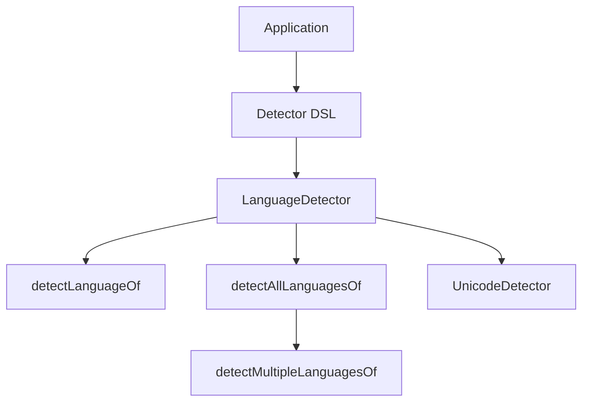
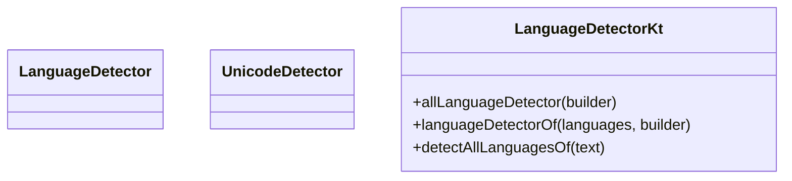

# utils/lingua Implementation Plan

> **For agentic workers:** REQUIRED SUB-SKILL: Use superpowers:subagent-driven-development (recommended) or superpowers:executing-plans to implement this plan task-by-task. Steps use checkbox (`- [ ]`) syntax for tracking.

**Goal:** `x-obsoleted/lingua`를 `utils/lingua`로 승격하여 `bluetape4k-lingua`를 다시 활성화하고, upstream Lingua를 재사용하는 Kotlin DSL wrapper와 `detectAllLanguagesOf(text): Set<Language>` API를 제공한다.

**Architecture:** `utils/lingua`는 thin wrapper 모듈로 유지한다. 기존 `LanguageDetector.kt`, `UnicodeDetector.kt`, `UnicodeSupport.kt`를 승격·복구하고, mixed-language 결과는 Unicode-letter tokenization 후 upstream `LanguageDetector.detectLanguageOf(text)`를 각 토큰에 적용해 non-`UNKNOWN` 언어를 `Set<Language>`로 축약하는 extension으로 노출한다. 짧은 Latin 토큰에서 발생할 수 있는 오탐(`Hello -> SOTHO`)은 confidence 후보가 모호할 때만 제한적으로 보정한다. 문서/README/testlog/superpowers index/TODO를 함께 갱신해 승격 작업을 완결한다.

**Tech Stack:** Kotlin 2.3, Gradle multi-module build, `com.github.pemistahl:lingua`, JUnit 5, Kluent, Bluetape4k KLogging

---

## 파일 구조 맵

### 생성할 파일
- `utils/lingua/build.gradle.kts`
- `utils/lingua/README.md`
- `utils/lingua/README.ko.md`
- `utils/lingua/src/main/kotlin/io/bluetape4k/lingua/LanguageDetector.kt`
- `utils/lingua/src/main/kotlin/io/bluetape4k/lingua/UnicodeDetector.kt`
- `utils/lingua/src/main/kotlin/io/bluetape4k/lingua/UnicodeSupport.kt`
- `utils/lingua/src/test/kotlin/io/bluetape4k/lingua/AbstractLinguaTest.kt`
- `utils/lingua/src/test/kotlin/io/bluetape4k/lingua/LanguageDetectorBuilderTest.kt`
- `utils/lingua/src/test/kotlin/io/bluetape4k/lingua/LanguageDetectorExtensionsTest.kt`
- `utils/lingua/src/test/kotlin/io/bluetape4k/lingua/UnicodeDetectorTest.kt`
- `utils/lingua/src/test/resources/junit-platform.properties`
- `utils/lingua/src/test/resources/logback-test.xml`

### 수정할 파일
- `buildSrc/src/main/kotlin/Libs.kt`
- `README.md`
- `README.ko.md`
- `TODO.md`
- `docs/testlogs/2026-04.md`
- `docs/superpowers/index/2026-04.md`
- `docs/superpowers/INDEX.md`
- 필요 시 `CLAUDE.md`

### 명시적 범위 규칙
- 이 작업은 **Testcontainers가 필요 없는 순수 모듈 작업**이다. 관련 테스트를 임의로 추가하지 않는다.
- `x-obsoleted/lingua/`는 이 PR에서 **삭제하지 않는다**. 활성 모듈 승격과 검증을 먼저 끝내고, 정리 작업은 별도 cleanup PR로 분리한다.
- `.kt` 파일을 만들거나 수정할 때마다 `ide_diagnostics`로 import/deprecation 문제를 확인하고, 필요 시 `ide_optimize_imports`를 적용한 뒤 compile/test로 진행한다.

---

### Task 1: 모듈 골격과 dependency 복구

- **complexity**: medium
- **Files:**
  - Create: `utils/lingua/build.gradle.kts`
  - Modify: `buildSrc/src/main/kotlin/Libs.kt`
  - Create: `utils/lingua/src/test/resources/junit-platform.properties`
  - Create: `utils/lingua/src/test/resources/logback-test.xml`

- [ ] **Step 1: failing compile test를 먼저 정의한다**

```kotlin
// utils/lingua/src/test/kotlin/io/bluetape4k/lingua/LanguageDetectorBuilderTest.kt
package io.bluetape4k.lingua

import com.github.pemistahl.lingua.api.Language
import org.amshove.kluent.shouldNotBeNull
import org.junit.jupiter.api.Test

class LanguageDetectorBuilderTest: AbstractLinguaTest() {
    @Test
    fun `allLanguageDetector로 detector를 생성한다`() {
        val detector = allLanguageDetector {
            withMinimumRelativeDistance(0.1)
        }
        detector.shouldNotBeNull()
    }

    @Test
    fun `languageDetectorOf로 특정 언어 detector를 생성한다`() {
        val detector = languageDetectorOf(setOf(Language.ENGLISH, Language.KOREAN)) {
            withLowAccuracyMode()
        }
        detector.shouldNotBeNull()
    }
}
```

- [ ] **Step 2: test가 실패하는지 확인한다**

Run:
```bash
./gradlew :bluetape4k-lingua:compileTestKotlin
```
Expected: FAIL with `Project with path ':bluetape4k-lingua' could not be found` 또는 `unresolved reference: allLanguageDetector`

- [ ] **Step 3: `Libs.kt`의 기존 객체에 Lingua 버전과 좌표를 추가한다**

```kotlin
// buildSrc/src/main/kotlin/Libs.kt
// inside existing object Versions
const val lingua = "1.2.2"

// inside existing object Libs
const val lingua = "com.github.pemistahl:lingua:${Versions.lingua}"
```

- [ ] **Step 4: `utils/lingua/build.gradle.kts`를 작성한다**

```kotlin
configurations {
    testImplementation.get().extendsFrom(compileOnly.get(), runtimeOnly.get())
}

dependencies {
    api(project(":bluetape4k-core"))
    api(Libs.lingua)

    testImplementation(project(":bluetape4k-junit5"))
}
```

- [ ] **Step 5: 표준 테스트 리소스를 추가한다**

```properties
# utils/lingua/src/test/resources/junit-platform.properties
junit.jupiter.extensions.autodetection.enabled=true
junit.jupiter.testinstance.lifecycle.default=per_class
junit.jupiter.execution.parallel.enabled=false
junit.jupiter.execution.parallel.mode.default=same_thread
junit.jupiter.execution.parallel.mode.classes.default=concurrent
```

```xml
<?xml version="1.0" encoding="UTF-8"?>
<configuration>
    <appender name="Console" class="ch.qos.logback.core.ConsoleAppender">
        <immediateFlush>true</immediateFlush>
        <encoder>
            <pattern>%d{HH:mm:ss.SSS} %highlight(%-5level) [%blue(%24.24t)] %yellow(%logger{36}):%line: %msg%n%throwable</pattern>
            <charset>UTF-8</charset>
        </encoder>
    </appender>

    <logger name="io.bluetape4k.lingua" level="DEBUG"/>

    <root level="INFO">
        <appender-ref ref="Console"/>
    </root>
</configuration>
```

- [ ] **Step 6: 새 모듈이 실제로 자동 등록되는지 확인한다**

Run:
```bash
./gradlew projects | rg "bluetape4k-lingua"
```
Expected: output contains `bluetape4k-lingua`

- [ ] **Step 7: compile이 녹색으로 바뀌는지 확인한다**

Run:
```bash
./gradlew :bluetape4k-lingua:compileKotlin :bluetape4k-lingua:compileTestKotlin
```
Expected: `BUILD SUCCESSFUL`

- [ ] **Step 8: 이 단계는 아직 커밋하지 않는다**

Task 1 단독으로는 테스트가 녹색이 아닐 수 있으므로 커밋을 미룬다. 첫 번째 커밋은 Task 2에서 DSL/Unicode 복구 후 테스트 통과를 확인한 뒤 수행한다.

---

### Task 2: 기존 DSL과 Unicode 유틸을 승격 복구한다

- **complexity**: medium
- **Files:**
  - Create: `utils/lingua/src/main/kotlin/io/bluetape4k/lingua/LanguageDetector.kt`
  - Create: `utils/lingua/src/main/kotlin/io/bluetape4k/lingua/UnicodeDetector.kt`
  - Create: `utils/lingua/src/main/kotlin/io/bluetape4k/lingua/UnicodeSupport.kt`
  - Create: `utils/lingua/src/test/kotlin/io/bluetape4k/lingua/AbstractLinguaTest.kt`
  - Modify: `utils/lingua/src/test/kotlin/io/bluetape4k/lingua/LanguageDetectorBuilderTest.kt`
  - Create: `utils/lingua/src/test/kotlin/io/bluetape4k/lingua/UnicodeDetectorTest.kt`

- [ ] **Step 1: Unicode 유틸과 DSL 복구 테스트를 확장한다**

```kotlin
// utils/lingua/src/test/kotlin/io/bluetape4k/lingua/LanguageDetectorBuilderTest.kt
package io.bluetape4k.lingua

import com.github.pemistahl.lingua.api.IsoCode639_1
import com.github.pemistahl.lingua.api.IsoCode639_3
import com.github.pemistahl.lingua.api.Language
import org.amshove.kluent.shouldNotBeNull
import org.junit.jupiter.api.Test

class LanguageDetectorBuilderTest: AbstractLinguaTest() {
    @Test
    fun `allLanguageDetector로 detector를 생성한다`() {
        val detector = allLanguageDetector {
            withMinimumRelativeDistance(0.1)
        }
        detector.shouldNotBeNull()
    }

    @Test
    fun `language 집합으로 detector를 생성한다`() {
        val detector = languageDetectorOf(setOf(Language.ENGLISH, Language.KOREAN)) {
            withLowAccuracyMode()
        }
        detector.shouldNotBeNull()
    }

    @Test
    fun `ISO 639-1 집합으로 detector를 생성한다`() {
        val detector = languageDetectorOf(setOf(IsoCode639_1.EN, IsoCode639_1.KO)) {
            withMinimumRelativeDistance(0.1)
        }
        detector.shouldNotBeNull()
    }

    @Test
    fun `ISO 639-3 집합으로 detector를 생성한다`() {
        val detector = languageDetectorOf(setOf(IsoCode639_3.ENG, IsoCode639_3.KOR)) {
            withMinimumRelativeDistance(0.1)
        }
        detector.shouldNotBeNull()
    }

    @Test
    fun `convenience overload로 detector를 생성한다`() {
        val detector = languageDetectorOf(
            languages = setOf(Language.ENGLISH, Language.KOREAN),
            minimulRelativeDistance = 0.0,
            isEveryLangageModelPreloaded = false,
            isLowAccuracyModeEnabled = true,
        )
        detector.shouldNotBeNull()
    }
}
```

```kotlin
// utils/lingua/src/test/kotlin/io/bluetape4k/lingua/UnicodeDetectorTest.kt
package io.bluetape4k.lingua

import org.amshove.kluent.shouldBeEqualTo
import org.junit.jupiter.api.Test
import java.util.Locale

class UnicodeDetectorTest: AbstractLinguaTest() {
    private val unicodeDetector = UnicodeDetector()

    @Test
    fun `containsAny는 한국어 문자를 감지한다`() {
        unicodeDetector.containsAny("Hello 안녕", Locale.KOREAN) shouldBeEqualTo true
    }

    @Test
    fun `containsAll은 영어 문장만 모두 통과시킨다`() {
        unicodeDetector.containsAll("What language am I speaking?", Locale.ENGLISH) shouldBeEqualTo true
    }

    @Test
    fun `지원하지 않는 locale은 false를 반환한다`() {
        unicodeDetector.containsAny("مرحبا", Locale.of("ar")) shouldBeEqualTo false
    }
}
```

- [ ] **Step 2: 테스트가 실패하는지 확인한다**

Run:
```bash
./gradlew :bluetape4k-lingua:test --tests "*LanguageDetectorBuilderTest" --tests "*UnicodeDetectorTest"
```
Expected: FAIL with missing source files or missing methods

- [ ] **Step 3: `AbstractLinguaTest.kt`를 추가한다**

```kotlin
package io.bluetape4k.lingua

import io.bluetape4k.logging.KLogging

abstract class AbstractLinguaTest {
    companion object: KLogging()
}
```

- [ ] **Step 4: 기존 Kotlin 소스를 KDoc 보존 상태로 복구한다**

`x-obsoleted/lingua/src/main/kotlin/io/bluetape4k/lingua/LanguageDetector.kt`, `UnicodeDetector.kt`, `UnicodeSupport.kt`를 기반으로 **한국어 KDoc을 유지한 채** `utils/lingua/src/main/kotlin/io/bluetape4k/lingua/`로 복사한다. 이 단계에서는 public API KDoc을 생략하거나 축약하지 않는다.

- [ ] **Step 5: `UnicodeSupport.kt`를 복구한다**

```kotlin
package io.bluetape4k.lingua

val Char.isAscii: Boolean get() = code in 0..127
val Char.isLatin: Boolean
    get() = code in 0x0000..0x007F || code in 0x0080..0x00FF || code in 0x0100..0x017F || code in 0x0180..0x024F || code in 0x0250..0x02AF || code in 0x02B0..0x02FF || code in 0x1E00..0x1EFF || code in 0x2C60..0x2C7F || code in 0xA720..0xA7FF
val Char.isArabic: Boolean
    get() = code in 0x0600..0x06FF || code in 0x0750..0x077F || code in 0xFB50..0xFDFF || code in 0xFE70..0xFEFF
val Char.isThai: Boolean
    get() = code in 0x0E00..0x0E7F || code in 0x1950..0x197F || code in 0x1980..0x19DF || code in 0x1A20..0x1AAF
val Char.isKorean: Boolean
    get() = code in 0x1100..0x11FF || code in 0x3130..0x318F || code in 0xA960..0xA97F || code in 0xAC00..0xD7AF || code in 0xD7B0..0xD7FF || code in 0xFFA0..0xFFDC
val Char.isJapanese: Boolean
    get() = code in 0x3040..0x309F || code in 0x30A0..0x30FF || code in 0x31F0..0x31FF || code in 0xFF66..0xFF9F || code in 0x2E80..0x2EFF || code in 0x2F00..0x2FDF
val Char.isChinese: Boolean
    get() = code in 0x4E00..0x9FFF || code in 0x3400..0x4DBF || code in 0x20000..0x2A6DF || code in 0x2A700..0x2B73F || code in 0x2B740..0x2B81F || code in 0x2B820..0x2CEAF || code in 0x2CEB0..0x2EBEF || code in 0x2F800..0x2FA1F
```

- [ ] **Step 5: `UnicodeDetector.kt`를 복구한다**

```kotlin
package io.bluetape4k.lingua

import io.bluetape4k.logging.KLogging
import io.bluetape4k.logging.debug
import io.bluetape4k.logging.trace
import java.util.Locale

class UnicodeDetector {
    companion object: KLogging() {
        val SupportedLanguages: List<Locale> = listOf(
            Locale.KOREAN,
            Locale.JAPANESE,
            Locale.ENGLISH,
            Locale.CHINESE,
            Locale.of("th")
        )
    }

    fun filterString(text: String, locale: Locale): CharArray {
        log.debug { "filter language[${locale.language}] chars..." }
        return text.mapNotNull { filterChar(it, locale) }.toCharArray()
    }

    fun filterChar(char: Char, locale: Locale): Char? {
        if (char.isAscii) return char
        if (locale !in SupportedLanguages) return null

        val filtered = when (locale.language) {
            "ko" if char.isKorean -> char
            "ja" if char.isJapanese -> char
            "en" if char.isAscii -> char
            "zh" if char.isChinese -> char
            "th" if char.isThai -> char
            else -> null
        }
        log.trace { "char=$char, language=${locale.language}, filtered=$filtered" }
        return filtered
    }

    fun containsAny(text: String, locale: Locale): Boolean = filterString(text, locale).isNotEmpty()
    fun containsAll(text: String, locale: Locale): Boolean = filterString(text, locale).size == text.length
}
```

- [ ] **Step 6: `LanguageDetector.kt`의 DSL을 복구한다**

```kotlin
package io.bluetape4k.lingua

import com.github.pemistahl.lingua.api.IsoCode639_1
import com.github.pemistahl.lingua.api.IsoCode639_3
import com.github.pemistahl.lingua.api.Language
import com.github.pemistahl.lingua.api.LanguageDetector
import com.github.pemistahl.lingua.api.LanguageDetectorBuilder

inline fun allLanguageDetector(builder: LanguageDetectorBuilder.() -> Unit): LanguageDetector =
    LanguageDetectorBuilder.fromAllLanguages().apply(builder).build()

inline fun allLanguageWithoutDetector(languages: Set<Language>, builder: LanguageDetectorBuilder.() -> Unit): LanguageDetector =
    LanguageDetectorBuilder.fromAllLanguagesWithout(*languages.toTypedArray()).apply(builder).build()

inline fun allSpokenLanguageDetector(builder: LanguageDetectorBuilder.() -> Unit): LanguageDetector =
    LanguageDetectorBuilder.fromAllSpokenLanguages().apply(builder).build()

@JvmName("languageDetectorOfLanguage")
inline fun languageDetectorOf(languages: Set<Language>, builder: LanguageDetectorBuilder.() -> Unit): LanguageDetector =
    LanguageDetectorBuilder.fromLanguages(*languages.toTypedArray()).apply(builder).build()

fun languageDetectorOf(
    languages: Set<Language> = Language.all().toSet(),
    minimulRelativeDistance: Double = 0.0,
    isEveryLangageModelPreloaded: Boolean = true,
    isLowAccuracyModeEnabled: Boolean = false,
): LanguageDetector = languageDetectorOf(languages) {
    withMinimumRelativeDistance(minimulRelativeDistance)
    if (isEveryLangageModelPreloaded) withPreloadedLanguageModels()
    if (isLowAccuracyModeEnabled) withLowAccuracyMode()
}

@JvmName("languageDetectorOfIsoCode639_1")
inline fun languageDetectorOf(isoCodes: Set<IsoCode639_1>, builder: LanguageDetectorBuilder.() -> Unit): LanguageDetector =
    LanguageDetectorBuilder.fromIsoCodes639_1(*isoCodes.toTypedArray()).apply(builder).build()

@JvmName("languageDetectorOfIsoCode639_3")
inline fun languageDetectorOf(isoCodes: Set<IsoCode639_3>, builder: LanguageDetectorBuilder.() -> Unit): LanguageDetector =
    LanguageDetectorBuilder.fromIsoCodes639_3(*isoCodes.toTypedArray()).apply(builder).build()
```

- [ ] **Step 7: `ide_diagnostics`와 import 정리를 수행한다**

Run the IDE diagnostics for `utils/lingua/src/main/kotlin/io/bluetape4k/lingua/*.kt` and fix unresolved imports or deprecation issues. If imports are stale, apply `ide_optimize_imports` before compiling.

- [ ] **Step 8: DSL/Unicode 테스트가 통과하는지 확인한다**

Run:
```bash
./bin/repo-test-summary -- ./gradlew :bluetape4k-lingua:test --tests "*LanguageDetectorBuilderTest" --tests "*UnicodeDetectorTest"
```
Expected: PASS

- [ ] **Step 9: `bluetape4k-patterns` 체크를 적용한다**

Verify that restored public APIs keep Korean KDoc, `UnicodeDetector` retains `companion object : KLogging()`, and immutable collections remain in public signatures.

- [ ] **Step 10: Task 1과 함께 첫 커밋을 만든다**

```bash
git add buildSrc/src/main/kotlin/Libs.kt utils/lingua/build.gradle.kts utils/lingua/src/test/resources/junit-platform.properties utils/lingua/src/test/resources/logback-test.xml utils/lingua/src/main/kotlin/io/bluetape4k/lingua/LanguageDetector.kt utils/lingua/src/main/kotlin/io/bluetape4k/lingua/UnicodeDetector.kt utils/lingua/src/main/kotlin/io/bluetape4k/lingua/UnicodeSupport.kt utils/lingua/src/test/kotlin/io/bluetape4k/lingua/AbstractLinguaTest.kt utils/lingua/src/test/kotlin/io/bluetape4k/lingua/LanguageDetectorBuilderTest.kt utils/lingua/src/test/kotlin/io/bluetape4k/lingua/UnicodeDetectorTest.kt
git commit -m "feat: lingua 모듈과 DSL 복구"
```

---

### Task 3: mixed-language `Set<Language>` API를 TDD로 추가한다

- **complexity**: high
- **Files:**
  - Modify: `utils/lingua/src/main/kotlin/io/bluetape4k/lingua/LanguageDetector.kt`
  - Create: `utils/lingua/src/test/kotlin/io/bluetape4k/lingua/LanguageDetectorExtensionsTest.kt`

- [ ] **Step 1: mixed-language extension의 실패 테스트를 작성한다**

```kotlin
package io.bluetape4k.lingua

import com.github.pemistahl.lingua.api.Language
import org.amshove.kluent.shouldBeEqualTo
import org.junit.jupiter.api.Test

class LanguageDetectorExtensionsTest: AbstractLinguaTest() {
    private val detector = allLanguageDetector {
        withMinimumRelativeDistance(0.0)
    }
    private val mixedText = "Parlez-vous français? Ich spreche nur ein bisschen Deutsch. A little bit is better than nothing."

    @Test
    fun `blank 입력이면 빈 집합을 반환한다`() {
        detector.detectAllLanguagesOf("   ") shouldBeEqualTo emptySet()
    }

    @Test
    fun `단일 언어면 singleton set을 반환한다`() {
        detector.detectAllLanguagesOf("Hello world") shouldBeEqualTo setOf(Language.ENGLISH)
    }

    @Test
    fun `혼합 언어면 모든 검출 언어를 집합으로 반환한다`() {
        detector.detectAllLanguagesOf(mixedText) shouldBeEqualTo setOf(
            Language.FRENCH,
            Language.GERMAN,
            Language.ENGLISH,
        )
    }

    @Test
    fun `인식할 수 없는 입력이면 빈 집합을 반환한다`() {
        detector.detectAllLanguagesOf("🔥🎉🧪") shouldBeEqualTo emptySet()
    }
}
```

- [ ] **Step 2: 실패를 확인한다**

Run:
```bash
./gradlew :bluetape4k-lingua:test --tests "*LanguageDetectorExtensionsTest"
```
Expected: FAIL with `unresolved reference: detectAllLanguagesOf`

- [ ] **Step 3: 최소 구현을 추가한다**

```kotlin
import com.github.pemistahl.lingua.api.LanguageDetector

private val tokenRegex = Regex("\\p{L}+(?:['’-]\\p{L}+)*")

fun LanguageDetector.detectAllLanguagesOf(text: String): Set<Language> {
    if (text.isBlank()) return emptySet()

    val detected = tokenRegex
        .findAll(text)
        .map { it.value }
        .mapNotNull { token ->
            detectLanguageOfToken(token)
        }
        .toSet()

    if (detected.isNotEmpty()) {
        return detected
    }

    return detectLanguageOf(text)
        .takeIf { it != Language.UNKNOWN }
        ?.let { setOf(it) }
        ?: emptySet()
}

private fun LanguageDetector.detectLanguageOfToken(token: String): Language? {
    val detected = detectLanguageOf(token)
    if (detected == Language.UNKNOWN) return null
    if (!token.isShortLatinToken() || detected in preferredLatinLanguages) return detected

    val confidenceValues = computeLanguageConfidenceValues(token)
    val second = confidenceValues.entries.elementAtOrNull(1) ?: return detected
    if (second.value < 0.85) return detected

    return confidenceValues.entries.asSequence()
        .take(10)
        .map { it.key }
        .firstOrNull { it in preferredLatinLanguages }
        ?: detected
}
```

- [ ] **Step 4: mixed-language 테스트를 다시 실행한다**

Run:
```bash
./bin/repo-test-summary -- ./gradlew :bluetape4k-lingua:test --tests "*LanguageDetectorExtensionsTest"
```
Expected: PASS

- [ ] **Step 5: detector 재사용 가이드를 KDoc으로 보강한다**

```kotlin
/**
 * 텍스트에서 검출된 모든 언어를 집합으로 반환합니다.
 *
 * - 공백 입력은 `emptySet()`을 반환합니다.
 * - Unicode-letter token별 [detectLanguageOf] 결과에서 `UNKNOWN`을 제거한 집합을 반환합니다.
 * - usable token 결과가 없으면 [detectLanguageOf] 전체 입력 결과를 singleton set으로 반환합니다.
 * - detector 생성 비용이 있으므로 호출마다 새 detector를 만들지 말고 재사용하는 것을 권장합니다.
 */
fun LanguageDetector.detectAllLanguagesOf(text: String): Set<Language> = ...
```

- [ ] **Step 6: 커밋한다**

```bash
git add utils/lingua/src/main/kotlin/io/bluetape4k/lingua/LanguageDetector.kt utils/lingua/src/test/kotlin/io/bluetape4k/lingua/LanguageDetectorExtensionsTest.kt
git commit -m "feat: lingua 다중 언어 집합 검출 추가"
```

---

### Task 4: 모듈 README와 루트 문서를 동기화한다

- **complexity**: low
- **Files:**
  - Create: `utils/lingua/README.md`
  - Create: `utils/lingua/README.ko.md`
  - Modify: `README.md`
  - Modify: `README.ko.md`
  - Modify: `TODO.md`
  - Modify: `CLAUDE.md` (if needed)

- [ ] **Step 1: README example을 검증하는 문서 테스트 포인트를 먼저 만든다**

```markdown
## Features
- Kotlin DSL detector builders
- Mixed-language detection as `Set<Language>`
- Unicode language/script helpers

## Examples
```kotlin
val detector = allLanguageDetector {
    withMinimumRelativeDistance(0.0)
}

detector.detectAllLanguagesOf("Hello 안녕")
// expected: setOf(Language.ENGLISH, Language.KOREAN)
```
```

- [ ] **Step 2: 새 모듈 README를 작성한다**

```markdown
# Module bluetape4k-lingua

English | [한국어](./README.ko.md)

Provides Kotlin-friendly language detection using [Lingua](https://github.com/pemistahl/lingua).

## Dependency
```kotlin
dependencies {
    implementation("io.github.bluetape4k:bluetape4k-lingua:$version")
}
```

## Architecture
### Module Overview


## UML


## Features
- DSL-based detector creation
- Mixed-language result as `Set<Language>`
- Unicode helpers

## Examples
```kotlin
val detector = allLanguageDetector {
    withMinimumRelativeDistance(0.0)
}
```
```

- [ ] **Step 3: 한국어 README를 같은 구조로 작성한다**

```markdown
# Module bluetape4k-lingua

한국어 | [English](./README.md)

Lingua 기반의 Kotlin 친화적 언어 감지 모듈입니다.

## 의존성
```kotlin
dependencies {
    implementation("io.github.bluetape4k:bluetape4k-lingua:$version")
}
```
```

- [ ] **Step 4: 루트 README의 dropped 표기를 active 모듈 설명으로 바꾼다**

```markdown
- **lingua**: Language detection with Kotlin DSL wrapper and mixed-language `Set<Language>` support
```

```markdown
- **lingua**: Kotlin DSL 래퍼와 mixed-language `Set<Language>` 지원 언어 감지
```

- [ ] **Step 5: TODO 체크박스를 완료 처리한다**

```markdown
- [x] **lingua → utils/lingua** (3 kt 파일, 높은 ROI)
```

- [ ] **Step 6: 루트 README의 deprecated line이 제거되었는지 확인한다**

Run:
```bash
rg -n "~~\*\*lingua\*\*" README.md README.ko.md
```
Expected: no matches

- [ ] **Step 7: 문서 예제와 module compile을 함께 검증한다**

Run:
```bash
./gradlew :bluetape4k-lingua:compileKotlin :bluetape4k-lingua:compileTestKotlin
```
Expected: `BUILD SUCCESSFUL`

- [ ] **Step 8: 커밋한다**

```bash
git add utils/lingua/README.md utils/lingua/README.ko.md README.md README.ko.md TODO.md CLAUDE.md
git commit -m "docs: lingua 모듈 문서와 루트 목록 갱신"
```

---

### Task 5: 전체 테스트 실행과 로그/인덱스 기록을 마무리한다

- **complexity**: medium
- **Files:**
  - Modify: `docs/testlogs/2026-04.md`
  - Modify: `docs/superpowers/index/2026-04.md`
  - Modify: `docs/superpowers/INDEX.md`

- [ ] **Step 1: 변경 모듈 테스트를 전체 실행한다**

Run:
```bash
./bin/repo-test-summary -- ./gradlew :bluetape4k-lingua:test
```
Expected: `BUILD SUCCESSFUL` and all lingua tests passing

- [ ] **Step 2: compile 검증을 추가 실행한다**

Run:
```bash
./gradlew :bluetape4k-lingua:compileKotlin :bluetape4k-lingua:compileTestKotlin
```
Expected: `BUILD SUCCESSFUL`

- [ ] **Step 3: 전역 회귀 compile 검증을 수행한다**

Run:
```bash
./gradlew build -x test
```
Expected: `BUILD SUCCESSFUL`

- [ ] **Step 4: testlog 맨 위에 결과를 기록한다**

```markdown
| 2026-04-22 | feat(utils): lingua 모듈 복구 및 mixed-language `Set<Language>` 지원 추가 | `bluetape4k-lingua` | `:bluetape4k-lingua:test` passing | ✅ | ~Xs | upstream Lingua 1.2.2 재사용, DSL 복구, README 동기화 |
```

- [ ] **Step 5: superpowers 월별 index에 새 행을 추가한다**

```markdown
| 2026-04-22 | utils/lingua 승격 — Lingua thin wrapper 복구 + mixed-language `Set<Language>` API | [spec](../specs/2026-04-22-utils-lingua-design.md) | [plan](../plans/2026-04-22-utils-lingua-plan.md) | ✅ | {test-summary / commit hash} |
```

- [ ] **Step 6: superpowers 허브 count를 현재 값 기준으로 갱신한다**

Read `docs/superpowers/INDEX.md` current totals first, then increment the appropriate rows instead of hard-coding numbers.

- [ ] **Step 7: 최종 검증 후 커밋한다**

```bash
git add docs/testlogs/2026-04.md docs/superpowers/index/2026-04.md docs/superpowers/INDEX.md
git commit -m "docs: lingua 작업 로그와 superpowers 인덱스 갱신"
```

---

## self-review checklist

- Spec coverage: 모듈 생성, DSL 복구, Unicode 유틸 복구, mixed-language `Set<Language>`, README/README.ko, 루트 README, TODO, testlog, superpowers index를 모두 태스크로 연결했다.
- Placeholder scan: `<resolved-version>` 같은 placeholder를 제거하고 `Versions.lingua = "1.2.2"`로 고정했다.
- Type consistency: `detectAllLanguagesOf(text): Set<Language>`, `allLanguageDetector`, `languageDetectorOf`, `UnicodeDetector` 명칭을 스펙과 동일하게 유지했다.
