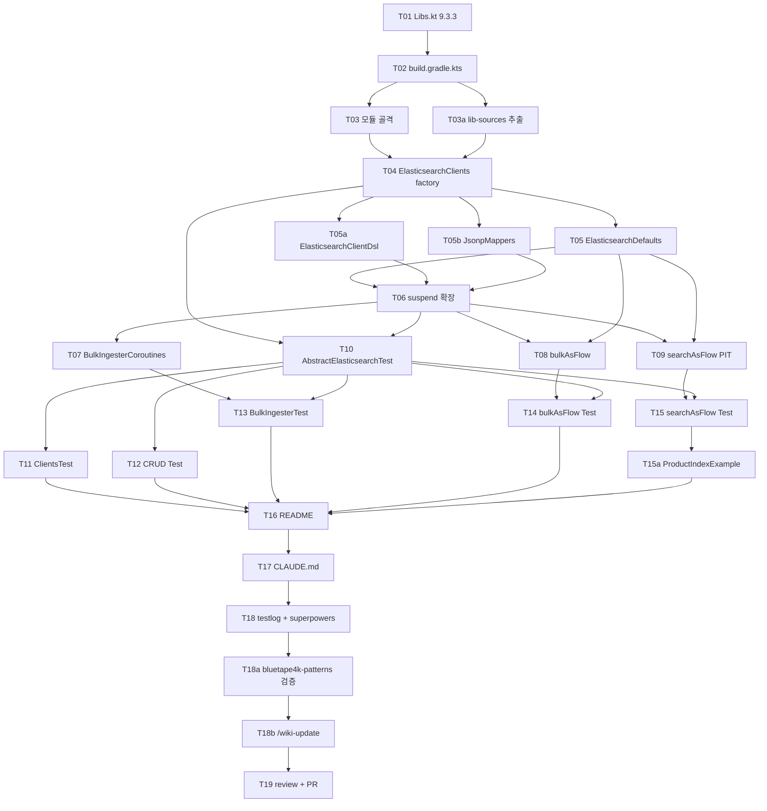

# Elasticsearch Coroutines Module Implementation Plan

- **Spec**: [2026-04-26-elasticsearch-coroutines-design.md](../specs/2026-04-26-elasticsearch-coroutines-design.md)
- **Issue**: #146
- **Worktree**: `.worktrees/issue-146-elasticsearch`
- **Branch**: `feat/issue-146-elasticsearch`
- **작성일**: 2026-04-26
- **작성자**: planner (Opus 4.7)
- **상태**: Step 2 (Plan, 리뷰 대기)

---

## 0. 개요

본 plan 은 spec `2026-04-26-elasticsearch-coroutines-design.md` 의 채택 결정(접근법 C: Hybrid)을 따라 `infra/elasticsearch` 모듈을 implementation 하기 위한 task 목록이다. 각 task 는 **입력 / 출력 / 완료 조건**을 명시하며, complexity 에 따라 model routing(low → haiku, medium → sonnet, high → opus)을 적용한다.

### Critical path 요약

```
T01 → T02 → T03/T03a (병렬) → T04 → T05/T05a/T05b (병렬)
→ T06/T07/T08/T09 (T06 완료 후 T07, T08, T09 병렬 실행 가능)
→ T10 → T11/T12/T13/T14/T15 (T10 완료 후 병렬)
→ T15a → T16 → T17 → T18 → T18a → T18b → T19
```

### Complexity 분포

- **high (4)**: T08 (`bulkAsFlow`), T09 (`searchAsFlow` PIT), T14 (5000건 bulk + partial error), T15 (search 통합 10000건)
- **medium (10)**: T04, T05a (DSL builder), T06 suspend 확장, T07 BulkIngester wrapping, T10 베이스, T11 factory test, T12 CRUD test, T13 BulkIngester test, T15a (ProductIndexExample)
- **low (11)**: T01, T02, T03, T03a, T05, T05b, T16, T17, T18, T18a, T18b, T19

> 아래 표의 complexity 가 spec 의 권고와 100% 일치한다. 주요 risk 는 spec 의 R1–R6 매핑을 그대로 가져온다.

---

## 1. Task 목록

### T01 — `Libs.kt` 버전 업데이트 + `elasticsearch_java` entry 추가

- **complexity**: low
- **목적**: 신규 ES Java client 라이브러리를 dependency 카탈로그에 등록하고, 기존 `Versions.elasticsearch` 를 server tag 와 통일한다. 기존 사용처(`testing/testcontainers`)의 ABI 호환성도 함께 검증한다.
- **입력 파일**: 없음 (편집 대상만 존재).
- **수정 파일**:
  - `buildSrc/src/main/kotlin/Libs.kt`
- **변경 내용**:
  - `Versions.elasticsearch` 를 `"9.2.4"` → `"9.3.3"` 으로 변경.
  - 신규 entry 추가:
    ```kotlin
    val elasticsearch_java = "co.elastic.clients:elasticsearch-java:${Versions.elasticsearch}"
    ```
  - 기존 `elasticsearch_rest_client*` entry 유지 (legacy).
- **완료 조건**:
  - `./gradlew :bluetape4k-testcontainers:compileKotlin` 통과 (ABI 호환성 검증, Q1 답).
  - `./gradlew compileKotlin` (전체) 실행하여 `elasticsearch_rest_client` 사용처 전체 검증 (모듈 간 ABI drift 없음).
  - `./gradlew help` 가 변경 후에도 정상 실행.
  - **실패 시 fallback**: `Versions.elasticsearch_java = "9.3.3"` 별도 entry 도입 (기존 `Versions.elasticsearch = "9.2.4"` 유지) — server tag 와 client 버전을 분리하여 legacy `elasticsearch_rest_client*` 사용처 영향 최소화.

### T02 — `infra/elasticsearch/build.gradle.kts` 생성

- **complexity**: low
- **목적**: 신규 모듈의 Gradle 빌드 정의. testFixtures plugin 활성화, Jackson 2/3 양쪽 `compileOnly` 선언(R5 회피).
- **입력 파일**: 인접 infra 모듈 build script 참고 — `infra/lettuce/build.gradle.kts`, `infra/kafka/build.gradle.kts`.
- **출력 파일**:
  - `infra/elasticsearch/build.gradle.kts`
- **변경 내용**:
  - `plugins { kotlin; java-test-fixtures; ... }`.
  - `dependencies`:
    - `api(Libs.elasticsearch_java)`
    - `api(project(":bluetape4k-coroutines"))`
    - `api(project(":bluetape4k-logging"))`
    - `compileOnly(project(":bluetape4k-jackson"))`
    - `compileOnly(project(":bluetape4k-jackson3"))`
    - `testFixturesApi(project(":bluetape4k-testcontainers"))`
    - `testFixturesApi(Libs.elasticsearch_java)`
    - `testImplementation(project(":bluetape4k-junit5"))`
    - `testImplementation(project(":bluetape4k-jackson3"))` (테스트는 Jackson3 채택)
    - `testImplementation(Libs.mockk)`, `testImplementation(Libs.bluetape4kAssertions)`
- **완료 조건**:
  - `./gradlew :bluetape4k-elasticsearch:dependencies` 가 의존성 트리를 출력.
  - `settings.gradle.kts` 자동 등록으로 모듈 인식.

### T03 — 모듈 골격 디렉터리 + 테스트 리소스 부트스트랩

- **complexity**: low
- **목적**: 패키지 디렉터리 + 테스트 필수 리소스 파일 생성 (`junit-platform.properties`, `logback-test.xml`).
- **입력 파일**: 참조용으로 `infra/kafka/src/test/resources/junit-platform.properties`, `infra/kafka/src/test/resources/logback-test.xml`.
- **출력 파일**:
  - `infra/elasticsearch/src/main/kotlin/io/bluetape4k/elasticsearch/.gitkeep`
  - `infra/elasticsearch/src/main/kotlin/io/bluetape4k/elasticsearch/coroutines/.gitkeep`
  - `infra/elasticsearch/src/main/kotlin/io/bluetape4k/elasticsearch/support/.gitkeep`
  - `infra/elasticsearch/src/test/resources/junit-platform.properties`
  - `infra/elasticsearch/src/test/resources/logback-test.xml`
  - `infra/elasticsearch/src/testFixtures/kotlin/io/bluetape4k/elasticsearch/testfixtures/.gitkeep`
- **완료 조건**:
  - `./gradlew :bluetape4k-elasticsearch:test` 명령이 (테스트 0개라도) 실패 없이 종료.

### T03a — `co.elastic.clients:elasticsearch-java` source jar 추출

- **complexity**: low
- **목적**: 구현 중 API 시그니처 / 동작 확인을 위한 source 참조본 확보 (사용자 지시 — `.claude/lib-sources/<lib>/`).
- **입력 파일**: Maven Central / Gradle cache 의 `elasticsearch-java-9.3.3-sources.jar`.
- **출력 파일**:
  - `.claude/lib-sources/elasticsearch-java/` (압축 해제된 source 트리)
- **완료 조건**:
  - `BulkIngester`, `ElasticsearchAsyncClient`, `RestClientTransport`, `JsonpMapper.lookup()` 의 정의를 grep 으로 즉시 찾을 수 있어야 함.
  - 추출 명령: `unzip -o ~/.gradle/caches/modules-2/files-2.1/co.elastic.clients/elasticsearch-java/9.3.3/*/elasticsearch-java-9.3.3-sources.jar -d .claude/lib-sources/elasticsearch-java/`

### T04 — `ElasticsearchClients` factory + `transportOf`

- **complexity**: medium
- **목적**: spec 4.1 의 factory object 구현. HC5 기반 transport 빌더, SSL/CA + Basic Auth 자동 주입(R2 대응).
- **입력 파일**:
  - 참조: `infra/lettuce/src/main/kotlin/io/bluetape4k/lettuce/LettuceClients.kt`
  - spec 섹션 4.1
- **출력 파일**:
  - `infra/elasticsearch/src/main/kotlin/io/bluetape4k/elasticsearch/ElasticsearchClients.kt`
- **변경 내용**:
  - `object ElasticsearchClients : KLogging()` (spec 4.1 의 `object` + `KLogging()` 패턴, 4.1 말미 주의 사항 반영).
  - `asyncClientOf(host, port, scheme, username, password, sslContext, mapper)` 2가지 오버로드.
  - `clientOf(...)` sync 변형.
  - `transportOf(...)` 공통 builder.
  - 모든 메서드에 KDoc + `@JvmStatic`.
  - **입력 검증**: `host.requireNotBlank("host")`, `port.requirePositiveNumber("port")` 등 bluetape4k-patterns 의 require 헬퍼로 인자 검증.
  - **R6 검증**: monitor lock(`@Synchronized` / `synchronized {}`) 사용 0건. 필요시 `ReentrantLock`.
- **완료 조건**:
  - 컴파일 통과.
  - KDoc lint(IntelliJ formatter) 통과.

### T05 — `ElasticsearchDefaults.kt` 상수 정의

- **complexity**: low
- **목적**: spec 섹션 3 의 magic literal 제거용 상수 모음. `DEFAULT_BULK_CHUNK_SIZE`, `DEFAULT_SEARCH_BATCH_SIZE`, `DEFAULT_BULK_INGESTER_MAX_OPERATIONS`, `DEFAULT_BULK_INGESTER_FLUSH_INTERVAL`.
- **입력 파일**: spec 섹션 3.
- **출력 파일**:
  - `infra/elasticsearch/src/main/kotlin/io/bluetape4k/elasticsearch/ElasticsearchDefaults.kt`
- **변경 내용**:
  - `object ElasticsearchDefaults` 안에 상수 4개 정의 (각 KDoc 에 근거 — ES 공식 가이드 링크 포함).
- **완료 조건**:
  - 모든 상수에 KDoc + 출처 링크.
  - 후속 T06–T08 에서 hardcoded 정수 0건.

### T05a — `ElasticsearchClientDsl.kt` (DSL builder)

- **complexity**: medium
- **목적**: `elasticsearchClient { host = "localhost"; port = 9200; username = "elastic"; password = "..." }` 형태의 DSL builder 를 제공하여 factory 사용성 향상. spec 4.1 의 factory 위에 얇게 얹는 type-safe builder.
- **입력 파일**:
  - 참조: `infra/lettuce/src/main/kotlin/io/bluetape4k/lettuce/codec/...` (DSL 패턴)
  - spec 섹션 4.1
- **출력 파일**:
  - `infra/elasticsearch/src/main/kotlin/io/bluetape4k/elasticsearch/ElasticsearchClientDsl.kt`
- **변경 내용**:
  - `class ElasticsearchClientBuilder` — `host`, `port`, `scheme`, `username`, `password`, `sslContext`, `mapper` 프로퍼티.
  - `fun elasticsearchClient(block: ElasticsearchClientBuilder.() -> Unit): ElasticsearchAsyncClient` — `apply(block)` 후 `ElasticsearchClients.asyncClientOf(...)` 위임.
  - `fun elasticsearchSyncClient(block: ElasticsearchClientBuilder.() -> Unit): ElasticsearchClient` 도 함께 제공.
  - 입력 검증은 위임된 factory 가 수행 (DRY).
  - KDoc 에 사용 예제 포함.
- **완료 조건**:
  - 컴파일 통과.
  - `elasticsearchClient { ... }` 로 `ElasticsearchAsyncClient` 생성 검증 (T10 통합 테스트에서 검증).
  - 모든 public API KDoc.

### T05b — `support/JsonpMappers.kt` (Jackson 2/3 헬퍼)

- **complexity**: low
- **목적**: `JsonpMapper.lookup()` 의 ClassPath 기반 자동 탐색 대신 명시적 헬퍼를 제공. Jackson 2 / Jackson 3 양쪽 의존성이 모두 `compileOnly` 이므로 (R5 회피), 사용자가 의도한 mapper 를 명확하게 지정할 수 있도록 한다.
- **입력 파일**: spec 섹션 4 (R5 처리), `.claude/lib-sources/elasticsearch-java/co/elastic/clients/json/...`
- **출력 파일**:
  - `infra/elasticsearch/src/main/kotlin/io/bluetape4k/elasticsearch/support/JsonpMappers.kt`
- **변경 내용**:
  - `fun jacksonJsonpMapper(): JsonpMapper` — Jackson 2 기반.
  - `fun jackson3JsonpMapper(): JsonpMapper` — Jackson 3 기반.
  - 각 함수는 해당 클래스 부재 시 `ClassNotFoundException` 을 catch 하여 명시적 `IllegalStateException("bluetape4k-jacksonX 모듈을 의존성에 추가하세요")` 로 wrap.
  - KDoc 에 의존성 추가 가이드.
- **완료 조건**:
  - 각 헬퍼 함수 단위 테스트 통과 (모듈 분리 시나리오 포함).
  - Jackson 미존재 시 명확한 에러 메시지 검증.

### T06 — `ElasticsearchCoroutines.kt` (suspend 확장 — Document/Indices/Cluster)

- **complexity**: medium
- **목적**: `ElasticsearchAsyncClient` 의 빈번 사용 메서드를 suspend 변형으로 노출. spec 4.3 시그니처 규칙 준수.
- **입력 파일**: spec 섹션 4.3, `bluetape4k-coroutines` 의 `awaitSuspending`.
- **출력 파일** (총 4개 — Document/Indices/Cluster/Search 의 일반 suspend 확장):
  - `infra/elasticsearch/src/main/kotlin/io/bluetape4k/elasticsearch/coroutines/DocumentApiCoroutines.kt`
  - `infra/elasticsearch/src/main/kotlin/io/bluetape4k/elasticsearch/coroutines/IndicesApiCoroutines.kt`
  - `infra/elasticsearch/src/main/kotlin/io/bluetape4k/elasticsearch/coroutines/ClusterApiCoroutines.kt`
  - `infra/elasticsearch/src/main/kotlin/io/bluetape4k/elasticsearch/coroutines/SearchApiCoroutines.kt` (suspend 부분만; `searchAsFlow` 는 T09 에서 추가)
- **변경 내용**:
  - **DocumentApi**: `indexSuspending`, `getSuspending`, `deleteSuspending`, `updateSuspending`, `existsSuspending` (각 raw + inline reified 변형).
  - **IndicesApi**: `createIndexSuspending`, `existsIndexSuspending`, `deleteIndexSuspending`, `getIndexSuspending`.
  - **ClusterApi**: `healthSuspending`, `infoSuspending`, `pingSuspending`.
  - **SearchApi**: `searchSuspending`, `countSuspending`, `msearchSuspending`.
  - **입력 검증**: public 확장함수의 `index`, `id` 파라미터에 `requireNotBlank("index")`, `requireNotBlank("id")` 등 적용.
  - 모든 파일은 `companion object` 없는 file-level 확장 (logging 이 필요하면 `private val log = KLoggingChannel().asLogger()`).
- **완료 조건**:
  - 컴파일 통과.
  - 모든 public 함수 KDoc.
  - `awaitSuspending()` 사용 통일 (`thenApplyAsync` 등 변형 금지).

### T07 — `BulkIngesterCoroutines.kt`

- **complexity**: medium
- **목적**: spec 5.3 — `BulkIngester<Context>` 를 suspend / Flow 친화로 래핑. factory + `addSuspend` + listener→`Flow<BulkProgressEvent>` 어댑터.
- **입력 파일**: spec 섹션 5.3, `.claude/lib-sources/elasticsearch-java/co/elastic/clients/elasticsearch/_helpers/bulk/BulkIngester.java`.
- **출력 파일**:
  - `infra/elasticsearch/src/main/kotlin/io/bluetape4k/elasticsearch/coroutines/BulkIngesterCoroutines.kt`
- **변경 내용**:
  - `bulkIngesterOf<Context>(client, maxOperations, flushInterval, listener)` factory.
  - `BulkIngester<Context>.addSuspend(operation, context)` suspend 확장 — `withContext(Dispatchers.IO)` 보호.
  - `sealed interface BulkProgressEvent<Context>` (Before/After/Error).
  - `bulkProgressListener<Context>(capacity)`: `Pair<BulkListener<Context>, Flow<BulkProgressEvent<Context>>>`.
  - **입력 검증**: factory `maxOperations.requirePositiveNumber("maxOperations")`, `flushInterval` 의 음수/zero 방어.
  - KDoc 에 `use { }` 패턴 + channel close 책임 명시.
- **완료 조건**:
  - 컴파일 통과.
  - listener 의 `beforeBulk` / `afterBulk` (성공/실패 둘 다) 모두 channel emit 검증 가능.
  - `BulkIngester` 의 `AutoCloseable` 패턴이 KDoc 에 명시.

### T08 — `BulkApiCoroutines.kt` (`bulkAsFlow`)

- **complexity**: high
- **목적**: spec 5.1 — `Flow<BulkOperation>` 을 chunk 단위로 `BulkRequest` 빌드 → `bulk()` 호출. partial failure 정책 + `onItemError(BulkResponseItem) -> Unit` 콜백 (변경 B 반영).
- **입력 파일**: spec 섹션 5.1.
- **출력 파일**:
  - `infra/elasticsearch/src/main/kotlin/io/bluetape4k/elasticsearch/coroutines/BulkApiCoroutines.kt`
- **변경 내용**:
  - `fun ElasticsearchAsyncClient.bulkAsFlow(operations: Flow<BulkOperation>, indexName: String?, chunkSize: Int = DEFAULT_BULK_CHUNK_SIZE, onItemError: (BulkResponseItem) -> Unit = { _ -> }): Flow<BulkResponse>`.
  - `suspend fun ElasticsearchAsyncClient.suspendBulk(request: BulkRequest): BulkResponse`.
  - private helper `flushBulk(buffer, indexName, onItemError)` — `BulkRequest` 빌드 + `bulk().awaitSuspending()` + items 순회하며 error item 만 콜백.
  - chunk 빌드/전송이 모두 suspend 안에서 일어나도록 (R3 회피).
  - **입력 검증**: `indexName?.requireNotBlank("indexName")` (nullable 통과 허용), `chunkSize.requirePositiveNumber("chunkSize")`.
  - **partial failure 는 throw 하지 않음** — `BulkResponse` 그대로 emit.
- **완료 조건**:
  - 컴파일 통과.
  - `onItemError` 시그니처 단일 인자 (`BulkResponseItem`).
  - `BulkOperation` import 가 콜백 시그니처에서 사라짐 확인 (변경 B).

### T09 — `SearchApiCoroutines.kt` 의 `searchAsFlow` (PIT + search_after)

- **complexity**: high
- **목적**: spec 5.2 — search_after + PIT 페이징을 `Flow<Hit<TDocument>>` 로 노출. cancel-safe PIT close.
- **입력 파일**: spec 섹션 5.2.
- **수정 파일** (T06 에서 만든 SearchApiCoroutines.kt 에 추가):
  - `infra/elasticsearch/src/main/kotlin/io/bluetape4k/elasticsearch/coroutines/SearchApiCoroutines.kt`
- **변경 내용**:
  - `inline fun <reified TDocument> ElasticsearchAsyncClient.searchAsFlow(request: SearchRequest, batchSize: Int = DEFAULT_SEARCH_BATCH_SIZE, keepAlive: Duration = Duration.ofMinutes(1)): Flow<Hit<TDocument>>` (reified 우선).
  - non-reified `searchAsFlow(request, documentClass, batchSize, keepAlive)` 도 별도로 제공.
  - 구현 흐름:
    1. `openPointInTime` 으로 PIT id 획득.
    2. `try { while (true) { search(pit + sort + searchAfter + size) ... } }`
    3. `finally { runCatching { closePointInTime } }` — cancel 도 cover.
  - sort/tie-breaker 미설정 시 빠르게 실패 (`require(request.sort().isNotEmpty())`).
  - **입력 검증**: `indexName.requireNotBlank("indexName")` (request 내부 또는 별도 인자), `batchSize.requirePositiveNumber("batchSize")`, `keepAlive` 음수 방어.
- **완료 조건**:
  - 컴파일 통과.
  - PIT close 가 정상 종료/cancel/예외 모든 경로에서 호출 (try-finally + runCatching).
  - 단위 테스트(T15)에서 cancel 시나리오 cover.

### T10 — `AbstractElasticsearchTest` 베이스 + testFixtures `asyncClient()`

- **complexity**: medium
- **목적**: spec 6.1 + 4.2. 모든 통합 테스트의 공통 베이스 + testcontainer Launcher + SSL/CA 자동 주입.
- **입력 파일**: spec 섹션 4.2, 6.1.
- **출력 파일**:
  - `infra/elasticsearch/src/testFixtures/kotlin/io/bluetape4k/elasticsearch/testfixtures/ElasticsearchServerExtensions.kt`
  - `infra/elasticsearch/src/test/kotlin/io/bluetape4k/elasticsearch/AbstractElasticsearchTest.kt`
- **변경 내용**:
  - `testFixtures` 측: `fun ElasticsearchServer.asyncClient(mapper = JsonpMapper.lookup()): ElasticsearchAsyncClient` (spec 4.2).
  - `AbstractElasticsearchTest`:
    - `companion object: KLoggingChannel()` (Spec: KLoggingChannel for suspend test class).
    - `protected val elasticsearch: ElasticsearchServer by lazy { Launcher.elasticsearch }`.
    - `protected val asyncClient by lazy { elasticsearch.asyncClient() }`.
    - `protected fun randomIndexName(): String` — `${LibraryName}.elasticsearch.test.{8-16자 lowercase}`.
    - `protected suspend fun cleanupIndex(name: String)` — best-effort delete.
- **완료 조건**:
  - 컴파일 통과.
  - testFixtures 가 main classpath 와 분리 (production 배포에서 testcontainer 미동반 검증).

### T11 — `ElasticsearchClientsTest`

- **complexity**: medium
- **목적**: factory 메서드의 SSL + Basic Auth 자동 주입 검증.
- **출력 파일**:
  - `infra/elasticsearch/src/test/kotlin/io/bluetape4k/elasticsearch/ElasticsearchClientsTest.kt`
- **시나리오**:
  - `asyncClientOf(host, port, scheme="https", username, password, sslContext)` → `ping().awaitSuspending()` 성공.
  - 잘못된 password → 401/403 예외.
  - testFixture `elasticsearch.asyncClient()` 1줄로 client 생성 후 `info()` 응답 검증.
  - `clientOf(...)` (sync) 한 번만 smoke test.
- **완료 조건**:
  - 통합 테스트 통과.
  - 모든 assertion 이 bluetape4k-assertions matcher (`shouldNotBeNull`, `shouldBeEqualTo`).

### T12 — `ElasticsearchCoroutinesTest` (CRUD roundtrip)

- **complexity**: medium
- **목적**: `index → get → update → exists → delete` 라이프사이클 + reified inline 변형.
- **출력 파일**:
  - `infra/elasticsearch/src/test/kotlin/io/bluetape4k/elasticsearch/coroutines/DocumentApiCoroutinesTest.kt`
  - `infra/elasticsearch/src/test/kotlin/io/bluetape4k/elasticsearch/coroutines/IndicesApiCoroutinesTest.kt`
  - `infra/elasticsearch/src/test/kotlin/io/bluetape4k/elasticsearch/coroutines/ClusterApiCoroutinesTest.kt`
- **시나리오**:
  - `DocumentApi`:
    - `data class Product(...)` 색인 → get → update → delete.
    - reified inline `indexSuspending<Product> { ... }` 별도 케이스.
    - `existsSuspending` true/false 분기.
  - `IndicesApi`: create → exists → delete → 중복 생성 예외.
  - `ClusterApi`: health/info/ping smoke test.
- **완료 조건**:
  - 모든 시나리오 `runTest(timeout = 60.seconds)`.
  - `Result.Created`, `Result.Updated`, `Result.Deleted` 등 enum matcher 사용.

### T13 — `BulkIngesterCoroutinesTest`

- **complexity**: medium
- **목적**: spec 6.2 의 BulkIngester 시나리오. `addSuspend` 1000건 → close 후 모두 색인됨 + listener event 검증.
- **출력 파일**:
  - `infra/elasticsearch/src/test/kotlin/io/bluetape4k/elasticsearch/coroutines/BulkIngesterCoroutinesTest.kt`
- **시나리오**:
  - `bulkIngesterOf(client, maxOperations=200, flushInterval=2초)`.
  - 1000건 `addSuspend` 발행 → ingester `close()` → `count()` 가 1000.
  - `bulkProgressListener<MyContext>()` 사용 시 `BulkProgressEvent.Before` 와 `After` 가 최소 5회 emit (200 chunk × 5).
  - listener channel 의 `Flow` 가 ingester close 후 정상 종료.
- **완료 조건**:
  - 통합 테스트 통과.
  - listener channel 누수 없음 (close 검증).

### T14 — `BulkApiCoroutinesTest` (5000건 + partial error)

- **complexity**: high
- **목적**: spec 6.2 의 핵심 통합 테스트. `bulkAsFlow` 가 chunk 단위로 emit + partial failure 정책 검증.
- **출력 파일**:
  - `infra/elasticsearch/src/test/kotlin/io/bluetape4k/elasticsearch/coroutines/BulkApiCoroutinesTest.kt`
- **시나리오**:
  - 5000건 색인, `chunkSize=500` → 정확히 10번의 `BulkResponse` emit. 각 응답 `items.size == 500`.
  - 잘못된 doc(예: type mismatch) 50건 섞기 → emit 은 계속, throw 없음.
  - `onItemError: (BulkResponseItem) -> Unit` 가 50건 모두에 대해 호출됨 — `AtomicInteger` 카운터로 검증.
  - `onItemError` 시그니처가 spec 변경 B 와 일치 (단일 인자).
- **완료 조건**:
  - 통합 테스트 통과.
  - partial failure 시 throw 0건.
  - `onItemError` 호출 횟수 = 실패 item 수.

### T15 — `SearchApiCoroutinesTest` (10000건 + match/bool/range/`searchAsFlow`)

- **complexity**: high
- **목적**: search_after + PIT 페이징의 cancel-safe 동작 + 다양 query 패턴 검증.
- **출력 파일**:
  - `infra/elasticsearch/src/test/kotlin/io/bluetape4k/elasticsearch/coroutines/SearchApiCoroutinesTest.kt`
- **시나리오**:
  - 사전 색인: bulk 로 10000건.
  - `searchSuspending` — match query / bool query (must+filter) / range query 각 검증.
  - `searchAsFlow<Product>` 로 10000건 페이징 — `count()` == 10000, `batchSize=200` → 50번 round-trip 가시화 (logging 카운트).
  - cancel 시나리오: `take(1500)` 으로 강제 종료 → PIT close 검증.
    - cluster `_pit/stats` 호출이 ES 9.3 에서 응답하면 PIT count 검증 (cancel 직후 0).
    - 응답하지 않거나 API 미지원이면 KDoc 으로만 검증 (테스트는 skip 하지 않고 `closePointInTime` runCatching 결과만 확인).
  - 최소 close 호출이 한 번 이루어졌는지는 `runCatching` 안의 `closePointInTime` 결과로 검증.
- **완료 조건**:
  - 통합 테스트 통과.
  - search_after 의 sort 누락 시 fast-fail.
  - PIT leak 검증.

### T15a — `examples/ProductIndexExample.kt` (실전 시나리오)

- **complexity**: medium
- **목적**: README Examples 섹션과 1:1 대응되는 runnable JUnit 테스트. Product data class + 색인 + 검색 + 집계 시나리오를 통해 사용자가 그대로 복사하여 사용할 수 있는 production-quality 예제 제공.
- **출력 파일**:
  - `infra/elasticsearch/src/test/kotlin/io/bluetape4k/elasticsearch/examples/ProductIndexExample.kt`
- **시나리오**:
  - `data class Product(id: String, name: String, price: Double, category: String, tags: List<String>)` — `Serializable` + `serialVersionUID`.
  - 1) 인덱스 생성 (`IndicesApiCoroutines`).
  - 2) `bulkAsFlow` 로 100건 색인 (`onItemError` 사용).
  - 3) `searchSuspending` match query — 카테고리 검색.
  - 4) `searchAsFlow` 로 페이징 — 가격 정렬 후 전수 순회.
  - 5) terms 집계 — 카테고리별 count.
  - 6) cleanup.
- **완료 조건**:
  - JUnit 실행 통과 (`AbstractElasticsearchTest` 상속).
  - README Examples 섹션과 1:1 대응 (코드 블록 동일).
  - KDoc 에 시나리오 단계별 주석.

### T16 — `README.md` + `README.ko.md`

- **complexity**: low
- **목적**: 모듈 문서화. 사용자 지시 — 영어 README + 한국어 README, 언어 전환 링크 + Architecture/UML/Features/Examples 순.
- **출력 파일**:
  - `infra/elasticsearch/README.md`
  - `infra/elasticsearch/README.ko.md`
- **변경 내용**:
  - 상단 언어 전환 링크 (`[한국어](./README.ko.md) | English` / `한국어 | [English](./README.md)`).
  - Sections:
    1. **Architecture** — Hybrid 접근법 요약 + factory + suspend + Flow 트랙.
    2. **UML** — Mermaid class diagram (`ElasticsearchClients` / `ElasticsearchAsyncClient` / `BulkIngester` / `bulkAsFlow` / `searchAsFlow` 관계).
    3. **Features** — factory, suspend 확장, `bulkAsFlow`, `searchAsFlow`, `BulkIngesterCoroutines`, testFixtures.
    4. **Examples** — testcontainer 1줄 통합, CRUD, bulk 5000건, search_after 페이징, BulkIngester 자동 flush.
- **완료 조건**:
  - Mermaid 다이어그램 GitHub 렌더링 확인.
  - 양쪽 README 항목/예제 1:1 동기화.

### T17 — 루트 `CLAUDE.md` `infra/` 행 업데이트

- **complexity**: low
- **목적**: Module Groups 표 `infra/` 행 끝에 `elasticsearch` 만 추가. 기존 순서는 보존하여 diff 최소화.
- **수정 파일**: `CLAUDE.md` (루트)
- **변경 내용**:
  - 기존 행: `lettuce, redisson, kafka, resilience4j, bucket4j, micrometer, opentelemetry, cache-*`.
  - 신규: `lettuce, redisson, kafka, resilience4j, bucket4j, micrometer, opentelemetry, cache-*, elasticsearch` (기존 순서 그대로 유지, 끝에 `elasticsearch` 만 추가).
  - 알파벳 순으로 전체 재정렬은 하지 않음 — 보수적 추가만 적용 (다른 PR 의 충돌 위험 회피).
- **완료 조건**:
  - 기존 순서(lettuce, redisson, kafka, ...) 변경 없음.
  - `elasticsearch` 항목이 행 끝에 1개 추가.
  - `bin/repo-status` 가 변경 인식.

### T18 — `docs/testlogs/2026-04.md` + `docs/superpowers/index/2026-04.md` + `INDEX.md`

- **complexity**: low
- **목적**: 사용자 지시 — testlog 행 추가 + superpowers index 항목 + 카운트 갱신.
- **수정 파일**:
  - `docs/testlogs/2026-04.md` (표 맨 위에 새 행)
  - `docs/superpowers/index/2026-04.md` (이번 spec/plan 항목)
  - `docs/superpowers/INDEX.md` (월별 카운트)
- **변경 내용**:
  - testlog 행: `2026-04-26 | bluetape4k-elasticsearch | passing/total | duration | feat: infra/elasticsearch 신규 모듈` 형식 (월별 표 표준).
  - superpowers 항목: spec + plan + 모듈 추가 요약.
- **완료 조건**:
  - 표 정합성 (다른 행과 동일 컬럼 수).
  - INDEX.md 카운트 ±1 정확.

### T18a — `bluetape4k-patterns` 1차 검증

- **complexity**: low
- **목적**: code-reviewer 실행 전 `bluetape4k-patterns` skill 로 selbstcheck. 사전 차단 가능한 위반(arg validation, logging, AtomicFU scope, exception handling 등)을 미리 잡아 reviewer 단계의 noise 감소.
- **변경 내용**:
  - `bluetape4k-patterns` skill 호출하여 `infra/elasticsearch` 모듈 전체 점검.
  - 점검 항목: argument validation (`requireNotBlank`, `requirePositiveNumber`), logging pattern (`KLogging` / `KLoggingChannel`), AtomicFU scope (클래스 프로퍼티만), exception handling (try-finally + runCatching).
- **완료 조건**:
  - CRITICAL/HIGH 위반 0건.
  - 발견 시 즉시 수정 후 재검증 → 재실행 결과도 0건.

### T18b — `/wiki-update` 실행

- **complexity**: low
- **목적**: 사용자 지시 — 새 spec/plan 작성 시 wiki 동기화. Obsidian wiki 와 qmd `bluetape4k-docs` 컬렉션 정합 유지.
- **변경 내용**:
  - `/wiki-update` skill 실행 → 변경된 spec(`2026-04-26-elasticsearch-coroutines-design.md`) + plan(`2026-04-26-elasticsearch-coroutines-plan.md`) + 모듈 README 를 wiki 페이지에 반영.
  - qmd 재인덱싱 확인.
- **완료 조건**:
  - `/wiki-update` 실행 완료.
  - 신규 wiki 페이지 또는 갱신 페이지가 qmd 검색에서 노출.

### T19 — `code-reviewer` 실행 + PR 생성

- **complexity**: low
- **목적**: 사용자 지시 — code-reviewer agent 로 HIGH/CRITICAL 해소 후 PR 생성.
- **변경 내용**:
  - `oh-my-claudecode:code-reviewer` 또는 `pr-review-toolkit:code-reviewer` 실행 → 보고서 → 이슈 해소.
  - `gh pr create` (테스트 결과 + 검증 명령 + 변경 근거 포함).
- **완료 조건**:
  - HIGH/CRITICAL 0개.
  - PR body 에 spec/plan 링크, `./gradlew :bluetape4k-elasticsearch:test` 결과 포함.

---

## 2. 의존 그래프 (Mermaid)



---

## 3. 검증 명령

각 task 완료 시 다음 명령으로 검증:

```bash
# T01
./gradlew :bluetape4k-testcontainers:compileKotlin

# T02–T05b
./gradlew :bluetape4k-elasticsearch:dependencies
./gradlew :bluetape4k-elasticsearch:compileKotlin

# T06–T09
./gradlew :bluetape4k-elasticsearch:build -x test

# T10–T15a (테스트)
./gradlew :bluetape4k-elasticsearch:test
./gradlew :bluetape4k-elasticsearch:test --tests "io.bluetape4k.elasticsearch.coroutines.BulkApiCoroutinesTest"
./gradlew :bluetape4k-elasticsearch:test --tests "io.bluetape4k.elasticsearch.coroutines.SearchApiCoroutinesTest"
./gradlew :bluetape4k-elasticsearch:test --tests "io.bluetape4k.elasticsearch.examples.ProductIndexExample"

# T16–T18b (전체 점검)
./gradlew :bluetape4k-elasticsearch:build
./gradlew :bluetape4k-elasticsearch:detekt
# T18a — bluetape4k-patterns skill 호출 (수동)
# T18b — /wiki-update skill 호출 (수동)

# T19
gh pr create --title "feat: infra/elasticsearch 신규 모듈 추가 (#146)" --body-file pr-body.md
```

---

## 4. 완료 보고 양식 (T19 직전)

| Task | Plan complexity | 실제 결과 | 비고 |
|------|-----------------|-----------|------|
| T01  | low    | DONE / FAIL | … |
| T02  | low    | DONE | … |
| T03  | low    | DONE | … |
| T03a | low    | DONE | … |
| T04  | medium | DONE | … |
| T05  | low    | DONE | … |
| T05a | medium | DONE | DSL builder |
| T05b | low    | DONE | Jackson 헬퍼 |
| T06  | medium | DONE | … |
| T07  | medium | DONE | … |
| T08  | high   | DONE | bulkAsFlow |
| T09  | high   | DONE | searchAsFlow PIT |
| T10  | medium | DONE | … |
| T11  | medium | DONE | … |
| T12  | medium | DONE | … |
| T13  | medium | DONE | … |
| T14  | high   | DONE | 5000건 + partial |
| T15  | high   | DONE | 10000건 search |
| T15a | medium | DONE | ProductIndexExample |
| T16  | low    | DONE | README 양쪽 |
| T17  | low    | DONE | CLAUDE.md infra 끝에 추가 |
| T18  | low    | DONE | testlog + superpowers |
| T18a | low    | DONE | bluetape4k-patterns 0건 |
| T18b | low    | DONE | /wiki-update |
| T19  | low    | DONE | PR URL |

- 로컬 테스트: `./gradlew :bluetape4k-elasticsearch:test` → `<passing>/<total>` passed in `<duration>`.
- code-reviewer: `<HIGH count>` / `<CRITICAL count>` 해소.
- README 양쪽 동기화: ✅
- KDoc 추가: 전 public API ✅
- testlog 등록: ✅
- superpowers index: ✅

---

## 5. 다음 단계

- 본 plan 검토 후 **Step 3 (Implementation)** 로 이동.
- complexity high task(T08 / T09 / T14 / T15) 는 `model=opus`, medium 은 `sonnet`, low 는 `haiku` 라우팅.
- 각 task 완료 후 spec DoD 와 1:1 비교 — 사용자 지시 (Plan 대비 비교 표 필수 보고).
