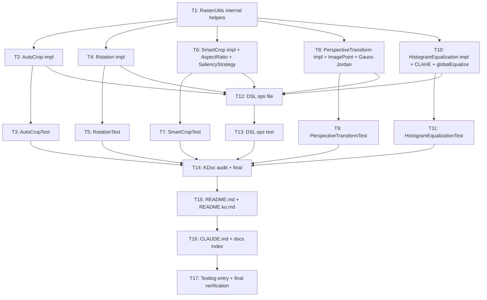

# utils/images Transform API Implementation Plan — Issue #132

- **Issue**: #132
- **Spec**: `docs/superpowers/specs/2026-04-27-images-transform-design.md`
- **모듈**: `utils/images` (`bluetape4k-images`)
- **브랜치**: `feat/issue-132-images-transform`
- **Worktree**: `.worktrees/feat/issue-132-images-transform/`
- **작성일**: 2026-04-27

---

## 0. 작업 원칙

- 모든 task는 worktree(`.worktrees/feat/issue-132-images-transform/`) 안에서 수행한다.
- 모든 `.kt` 편집 후: `ide_diagnostics` → import error/`@Deprecated` 경고 즉시 해소.
- 구현 task와 테스트 task는 1:1로 페어링한다 (T2/T3, T4/T5, ...).
- 각 구현 task 종료 시 해당 단위 테스트 통과 확인 후 다음 task 진행.
- KDoc은 Korean. KLogging: `companion object : KLoggingChannel()`.
- Coroutines: `withContext(Dispatchers.Default)` (CPU bound).
- 픽셀 단위 luma 비교: `assertSimilarToImage(actual, expected, tolerance)` (기존 `AbstractFilterTest` 사용).
- bluetape4k-assertions 비교: `shouldBeGreaterThan` / `shouldBeInRange` 등 — `(x >= y).shouldBeTrue()` 금지.
- 모든 `Graphics2D` 사용은 `try { ... } finally { g.dispose() }` 패턴.

---

## 1. Task Dependency Graph



---

## 2. Tasks

### T1 — `internal/RasterUtils.kt` 헬퍼 작성

- **complexity**: high
- **dependencies**: none
- **files (create)**:
  - `utils/images/src/main/kotlin/io/bluetape4k/images/transforms/internal/RasterUtils.kt`
- **what to implement**:
  - `internal fun ImmutableImage.toIntArgb(): BufferedImage`
    - scrimage `awt()` 결과가 `TYPE_INT_ARGB` 면 그대로, 아니면 새 ARGB BufferedImage 에 `Graphics2D.drawImage` 로 복사 후 반환.
    - `try { ... } finally { g.dispose() }` 패턴 적용.
  - `internal fun BufferedImage.copyArgb(): BufferedImage` — 같은 width/height 의 새 `TYPE_INT_ARGB` 복사본 반환.
  - `internal fun BufferedImage.fill(color: Color): BufferedImage` — `Graphics2D.setBackground(color)` + `clearRect(0, 0, w, h)` 후 자기 자신 반환 (mutating helper, internal usage 한정).
  - `internal fun BufferedImage.getArgb(): IntArray` — `getRGB(0, 0, w, h, IntArray(w*h), 0, w)` wrapper.
  - `internal fun BufferedImage.setArgb(pixels: IntArray): BufferedImage` — `setRGB(0, 0, w, h, pixels, 0, w)` wrapper, this 반환.
  - `internal const val MAX_OUTPUT_PIXELS = 67_108_864L`
  - `internal inline fun argb(a: Int, r: Int, g: Int, b: Int): Int` — bit packing helper (a<<24 | r<<16 | g<<8 | b)
  - `internal inline fun Int.alpha(): Int / red() / green() / blue()` — int extraction extensions
  - 로깅: top-level extension 파일이므로 `private val log = KotlinLogging.logger {}` 사용.
- **검증**: `./gradlew :bluetape4k-images:compileKotlin` 통과 + 컴파일러 경고 0건.

### T2 — `AutoCrop.kt` 구현

- **complexity**: medium
- **dependencies**: T1
- **files (create)**:
  - `utils/images/src/main/kotlin/io/bluetape4k/images/transforms/AutoCrop.kt`
- **what to implement**:
  - `fun ImmutableImage.autoCrop(tolerance: Int = 10, padding: Int = 0, backgroundColor: Color? = null): ImmutableImage`
  - `suspend fun ImmutableImage.suspendAutoCrop(...) = withContext(Dispatchers.Default) { autoCrop(...) }`
  - 알고리즘 (spec §6.1):
    1. `toIntArgb()` → IntArray pixel buffer
    2. `backgroundColor` 가 null 이면 corner 4픽셀 ARGB 평균을 계산해 채널별로 사용.
    3. 위/아래/왼쪽/오른쪽 경계 스캔: 각 행/열의 모든 픽셀이 `|channel - bg| <= tolerance` 인지 검사.
    4. 결정된 `(top, bottom, left, right)` 에서 `padding` 만큼 양보, `coerceIn` 으로 원본 클램프.
    5. `width < 1 || height < 1` 시 `log.debug { "autoCrop silent fallback (w=$w, h=$h, bg=$bg)" }` 후 `this` 반환.
    6. 그 외에는 `subimage(left, top, w, h)` 반환.
  - 로깅: `private val log = KotlinLogging.logger {}` (top-level extension 파일).
  - **검증 예외**: `require(tolerance in 0..255)`, `require(padding >= 0)`.

### T3 — `AutoCropTest.kt`

- **complexity**: medium
- **dependencies**: T2
- **files (create)**:
  - `utils/images/src/test/kotlin/io/bluetape4k/images/transforms/AutoCropTest.kt`
- **what to implement** (extends `AbstractFilterTest`):
  - `흰색 여백 + 빨간 사각형 합성 이미지 → 크롭 결과의 width/height 가 사각형 영역과 정확히 일치`
  - `명시적 backgroundColor = WHITE 와 코너 자동 검출 결과가 동일`
  - `padding = 5 → 결과가 사각형 영역 + 사방 5px`
  - `완전 단색 이미지 → 원본과 동일 ImmutableImage 반환 (silent fallback)`
  - `tolerance = 0 → 정확히 같은 색만 자름` / `tolerance = 50 → 더 넓게 자름`
  - `landscape.jpg → tolerance = 0 일 때 변경 없음`
  - `suspendAutoCrop = autoCrop` (`runTest { ... }`, `assertSimilarToImage` tolerance 0)
  - `tolerance = -1 → IllegalArgumentException`
  - `padding = -1 → IllegalArgumentException`

### T4 — `Rotation.kt` 구현

- **complexity**: medium
- **dependencies**: T1
- **files (create)**:
  - `utils/images/src/main/kotlin/io/bluetape4k/images/transforms/Rotation.kt`
- **what to implement**:
  - `fun ImmutableImage.rotateDegrees(angle: Double, background: Color = Color(0, 0, 0, 0)): ImmutableImage`
  - `fun ImmutableImage.flipHorizontal(): ImmutableImage = flipX()`
  - `fun ImmutableImage.flipVertical(): ImmutableImage = flipY()`
  - `suspend fun ImmutableImage.suspendRotateDegrees(...): ImmutableImage`
  - 알고리즘 (spec §6.3):
    1. `angle.normalize()` → -360..360 범위로 정규화 (`angle % 360`).
    2. 90/180/270 배수 → `rotateLeft()` / `rotate(PI)` / `rotateRight()` 위임 (무손실).
    3. 그 외: 회전 라디안 → 새 bounds(`newW`, `newH`) 계산 → `BufferedImage(newW, newH, TYPE_INT_ARGB)` 생성 → `Graphics2D` 로 background fill → `AffineTransform.translate(newW/2, newH/2).rotate(rad).translate(-w/2, -h/2)` → `setRenderingHint(KEY_INTERPOLATION, VALUE_INTERPOLATION_BICUBIC)` → `drawImage` → `dispose()`.
    4. `ImmutableImage.wrapAwt(...)` 반환.
  - 90도 배수 판별 시 부동소수점 오차 허용 (`Math.abs(angle % 90) < 1e-9`).
  - 로깅: `private val log = KotlinLogging.logger {}` (top-level extension 파일).

### T5 — `RotationTest.kt`

- **complexity**: medium
- **dependencies**: T4
- **files (create)**:
  - `utils/images/src/test/kotlin/io/bluetape4k/images/transforms/RotationTest.kt`
- **what to implement**:
  - `0도 회전 → 원본과 동일 (tolerance 0)`
  - `90도 회전 = rotateRight() (tolerance 0)`
  - `-90도 회전 = rotateLeft() (tolerance 0)`
  - `180도 두 번 → 원본 (tolerance 3, 보간 영향)`
  - `15도 회전 → 새 width/height 가 ceil(|w cos| + |h sin|), ceil(|w sin| + |h cos|) 와 일치`
  - `45도 회전 + background = WHITE → corner pixel 이 흰색`
  - `flipHorizontal().flipHorizontal() → 원본 (tolerance 0)`
  - `flipVertical().flipVertical() → 원본 (tolerance 0)`
  - `suspendRotateDegrees(15.0) ≈ rotateDegrees(15.0)` — `runTest`
  - **[추가]** `이미지를 180도 회전 후 다시 180도 회전 → 원본 중앙 픽셀과 동일` — `translate(newW/2, newH/2)` 회전 중심이 올바름을 검증.

### T6 — `SmartCrop.kt` 구현 (+ AspectRatio + SaliencyStrategy)

- **complexity**: high
- **dependencies**: T1
- **files (create)**:
  - `utils/images/src/main/kotlin/io/bluetape4k/images/transforms/SmartCrop.kt`
- **what to implement**:
  - `data class AspectRatio(val width: Int, val height: Int)` — `init { require(width > 0 && height > 0) }`
    - companion presets: `SQUARE = AspectRatio(1, 1)`, `WIDESCREEN = (16, 9)`, `PORTRAIT = (9, 16)`, `STANDARD = (4, 3)`
  - `sealed interface SaliencyStrategy { object SobelEnergy : SaliencyStrategy }`
  - `fun ImmutableImage.smartCrop(aspectRatio: AspectRatio, strategy: SaliencyStrategy = SaliencyStrategy.SobelEnergy): ImmutableImage`
  - `fun ImmutableImage.smartCropTo(width: Int, height: Int, strategy: SaliencyStrategy = SaliencyStrategy.SobelEnergy): ImmutableImage`
  - `suspend fun ImmutableImage.suspendSmartCrop(...): ImmutableImage`
  - 알고리즘 (spec §6.2):
    1. 다운샘플: `longSide = max(width, height)`, `if (longSide > 256) scaleTo(...)`. 다운샘플 비율 `ds = 256 / longSide` 보존.
    2. 그레이스케일 → IntArray (luma = 0.299R + 0.587G + 0.114B).
    3. **Sobel 3×3** (Gx, Gy) → magnitude `IntArray((w-2)*(h-2))` (테두리 1픽셀 제외) 또는 (w*h) padding 처리.
    4. **integral image** `IntArray((w+1) * (h+1))` (1행/1열 0 padding).
    5. 후보 윈도우: `aspectRatio` 비율 유지하며 다운샘플 영역 안에 들어가는 최대 크기 → `(winW, winH)`.
    6. stride 1로 모든 (x, y) 슬라이드 → integral image 기반 O(1) sum 계산 → 최대 위치.
    7. 다운샘플 좌표 → 원본 좌표 복원 (`(x / ds, y / ds, winW / ds, winH / ds)`, `coerceIn`/`coerceAtMost`).
    8. `subimage(x, y, w, h)` 반환.
  - `smartCropTo(width, height, ...)` 는 내부적으로 `AspectRatio(width, height)` + 정확한 픽셀 크기 후처리 (`scaleTo(width, height)` 추가 호출).
  - 로깅: `private val log = KotlinLogging.logger {}` (top-level extension 파일).

### T7 — `SmartCropTest.kt`

- **complexity**: medium
- **dependencies**: T6
- **files (create)**:
  - `utils/images/src/test/kotlin/io/bluetape4k/images/transforms/SmartCropTest.kt`
- **what to implement**:
  - `좌측 절반 체커보드 + 우측 단색 → smartCrop(SQUARE) 결과의 중심 x < 원본 width/2`
  - `AspectRatio.WIDESCREEN → 결과 width/height 비율이 16/9 ± 1px`
  - `AspectRatio.PORTRAIT → height/width 비율이 16/9 ± 1px`
  - `smartCropTo(320, 240) → 결과가 정확히 320×240`
  - `흰색 단색 이미지 → 결과 크기는 비율에 맞고, 예외 미발생`
  - `AspectRatio(0, 1) → IllegalArgumentException`
  - `suspendSmartCrop ≈ smartCrop` — `runTest`

### T8 — `PerspectiveTransform.kt` 구현 (+ ImagePoint + Gauss-Jordan)

- **complexity**: high
- **dependencies**: T1
- **files (create)**:
  - `utils/images/src/main/kotlin/io/bluetape4k/images/transforms/PerspectiveTransform.kt`
- **what to implement**:
  - `data class ImagePoint(val x: Double, val y: Double)`
  - `fun ImmutableImage.perspectiveTransform(sourceCorners: List<ImagePoint>, destinationCorners: List<ImagePoint>, outputWidth: Int, outputHeight: Int, outsideColor: Color = Color(0, 0, 0, 0)): ImmutableImage`
  - `suspend fun ImmutableImage.suspendPerspectiveTransform(...): ImmutableImage`
  - 입력 검증 (spec §6.4 step 1):
    - `require(sourceCorners.size == 4)`, `destinationCorners.size == 4`
    - `require(outputWidth > 0 && outputHeight > 0)`
    - `require(outputWidth.toLong() * outputHeight.toLong() <= MAX_OUTPUT_PIXELS)` ("output exceeds 64M pixels")
    - `require(sourceCorners.all { it.x.isFinite() && it.y.isFinite() }) { "sourceCorners must have finite coordinates" }`
    - `require(destinationCorners.all { it.x.isFinite() && it.y.isFinite() }) { "destinationCorners must have finite coordinates" }`
  - **Gauss-Jordan with partial pivoting** private 헬퍼:
    - `private fun solve8x8(a: DoubleArray, b: DoubleArray): DoubleArray`
    - `a` (size 64, row-major) + `b` (size 8) → 풀이된 `x` (size 8)
    - 피벗 절대값 `< 1e-12` → `IllegalArgumentException("source/destination points are nearly collinear")`
  - 호모그래피 행렬 H (3×3) 계산 (h33 = 1):
    - 4쌍 점 → 8 식 → `solve8x8` → DoubleArray(9) (h33 = 1.0 추가)
  - 역행렬 Hinv 계산:
    - `private fun invert3x3(h: DoubleArray): DoubleArray` — adjugate / determinant 직접 계산 (3×3 은 closed-form 빠름).
    - `det < 1e-12` → IllegalArgumentException.
  - 출력 BufferedImage 생성 → `outsideColor` fill.
  - 출력 픽셀 (x, y) 마다 inverse mapping + bilinear 4-tap:
    - `(x', y', w') = Hinv * (x + 0.5, y + 0.5, 1)` (pixel center)
    - `srcX = x'/w', srcY = y'/w'`
    - 영역 안 → bilinear 샘플링, 영역 밖 → outsideColor 유지
  - `private fun bilinearSample(pixels: IntArray, w: Int, h: Int, x: Double, y: Double): Int` — 4-tap weighted average for ARGB channels.
  - `ImmutableImage.wrapAwt(...)` 반환.
  - 로깅: `private val log = KotlinLogging.logger {}` (top-level extension 파일).

### T9 — `PerspectiveTransformTest.kt`

- **complexity**: medium
- **dependencies**: T8
- **files (create)**:
  - `utils/images/src/test/kotlin/io/bluetape4k/images/transforms/PerspectiveTransformTest.kt`
- **what to implement**:
  - `항등 매핑 (source = destination = (0,0)/(w,0)/(w,h)/(0,h)) → 결과가 원본과 동일 (tolerance 1)`
  - `90도 회전 호모그래피 ≈ rotateRight() (tolerance 3)`
  - `outsideColor = RED, 결과 코너 픽셀이 RED 인 시나리오 (작은 source 사각형 → 큰 output)`
  - `sourceCorners.size = 3 → IllegalArgumentException`
  - `destinationCorners.size = 5 → IllegalArgumentException`
  - `outputWidth = 0 → IllegalArgumentException`
  - `outputWidth = 10000, outputHeight = 10000 (1억 pixels > 64M) → IllegalArgumentException`
  - `4점 거의 일직선 (3개가 같은 좌표) → IllegalArgumentException("nearly collinear")`
  - `suspendPerspectiveTransform ≈ perspectiveTransform` — `runTest`

### T10 — `HistogramEqualization.kt` 구현 (CLAHE + globalEqualize)

- **complexity**: high
- **dependencies**: T1
- **files (create)**:
  - `utils/images/src/main/kotlin/io/bluetape4k/images/transforms/HistogramEqualization.kt`
- **what to implement**:
  - `fun ImmutableImage.clahe(tileSize: Int = 8, clipLimit: Double = 2.0): ImmutableImage`
  - `fun ImmutableImage.globalEqualize(): ImmutableImage`
  - `suspend fun ImmutableImage.suspendClahe(...): ImmutableImage`
  - 입력 검증: `require(tileSize >= 1)`, `require(clipLimit > 0)`
  - 알고리즘 (spec §6.5):
    1. `toIntArgb()` → IntArray
    2. **RGB → YCbCr** (BT.601):
       - `Y = 0.299R + 0.587G + 0.114B`
       - `Cb = -0.169R - 0.331G + 0.5B + 128`
       - `Cr = 0.5R - 0.419G - 0.081B + 128`
       - 결과 IntArray Y, ByteArray Cb, ByteArray Cr.
    3. `tileSize > min(w, h)` → 단일 타일 (= globalEqualize), `log.debug { "clahe tile fallback (w=$w, h=$h, tile=$tileSize)" }`
    4. 그 외: `nTilesX = ceil(w / tileSize)`, `nTilesY = ceil(h / tileSize)`
       - 타일별 `IntArray(256)` 히스토그램
       - **클리핑**: `cap = (clipLimit * tilePixelCount / 256).toInt()`. 빈도 > cap 인 빈은 잘라내고, 잘라낸 총량 `excess` 를 모든 빈에 균등 분배 (`excess / 256` per bin, 나머지는 라운드로빈).
       - CDF 누적합 → `lut[256]` (정규화: `lut[i] = round(cdf[i] / tilePixelCount * 255)`).
    5. 각 픽셀 `(x, y)` → 인접 4개 타일 LUT 의 bilinear interpolation 으로 `Y'` 매핑.
    6. **YCbCr → RGB**:
       - `R = Y + 1.402 * (Cr - 128)`
       - `G = Y - 0.344 * (Cb - 128) - 0.714 * (Cr - 128)`
       - `B = Y + 1.772 * (Cb - 128)`
       - `coerceIn(0, 255)`
    7. `setArgb` → `wrapAwt`.
  - `globalEqualize()` 는 `clahe(tileSize = max(width, height), clipLimit = 2.0)` — 기본 `clipLimit` 사용.
  - 로깅: `private val log = KotlinLogging.logger {}` (top-level extension 파일).

### T11 — `HistogramEqualizationTest.kt`

- **complexity**: medium
- **dependencies**: T10
- **files (create)**:
  - `utils/images/src/test/kotlin/io/bluetape4k/images/transforms/HistogramEqualizationTest.kt`
- **what to implement**:
  - `어두운 합성 이미지 (모든 픽셀 RGB 50,50,50) → CLAHE 후 평균 luma 변화 (luma 분산이 0 이므로 결과 동일 검증)`
  - `회색 그라데이션 → CLAHE 후 luma 표준편차 증가 (대비 향상)`
  - `tileSize = 1024 (이미지보다 큼) → globalEqualize() 와 결과 동일 (silent fallback)`
  - `채도 보존: 빨강 단색(255,0,0) 이미지 → CLAHE 후 평균 R 채널이 G/B 채널 대비 압도적으로 큰지 (Cb/Cr 보존 검증)`
  - `globalEqualize() → 평균 luma 결과는 입력 luma 분포 따라 다름, 결과 width/height 동일`
  - `tileSize = 0 → IllegalArgumentException`
  - `clipLimit = 0 → IllegalArgumentException`
  - `suspendClahe ≈ clahe` — `runTest`
  - **[주의]** `globalEqualize()` 는 `clahe(tileSize = max(w, h), clipLimit = 2.0)` 이므로, `tileSize = 1024` 테스트는 이미지 크기가 1024 미만임을 전제로 fallback 경로를 검증한다.

### T12 — `dsl/ImageFilterChainTransformOps.kt`

- **complexity**: medium
- **dependencies**: T2, T4, T6, T8, T10
- **files (create)**:
  - `utils/images/src/main/kotlin/io/bluetape4k/images/transforms/dsl/ImageFilterChainTransformOps.kt`
- **what to implement** (spec §5.6):
  - `fun ImageFilterChain.autoCrop(tolerance: Int = 10, padding: Int = 0, backgroundColor: Color? = null)`
  - `fun ImageFilterChain.smartCrop(aspectRatio: AspectRatio, strategy: SaliencyStrategy = SaliencyStrategy.SobelEnergy)`
  - `fun ImageFilterChain.rotateDegrees(angle: Double, background: Color = Color(0, 0, 0, 0))`
  - `fun ImageFilterChain.rotateLeft()`
  - `fun ImageFilterChain.rotateRight()`
  - `fun ImageFilterChain.flipHorizontal()`
  - `fun ImageFilterChain.flipVertical()`
  - `fun ImageFilterChain.perspectiveTransform(sourceCorners: List<ImagePoint>, destinationCorners: List<ImagePoint>, outputWidth: Int, outputHeight: Int, outsideColor: Color = Color(0, 0, 0, 0))`
  - `fun ImageFilterChain.clahe(tileSize: Int = 8, clipLimit: Double = 2.0)`
  - 로깅: `private val log = KotlinLogging.logger {}` (top-level 파일).
  - **공통 헬퍼 (필수)**:
    ```kotlin
    private inline fun ImageFilterChain.transformOp(
        name: String,
        crossinline block: (ImmutableImage) -> ImmutableImage
    ) {
        addPixel { image ->
            try {
                block(image)
            } catch (e: Exception) {
                log.warn(e) { "[$name] failed: ${image.width}×${image.height}" }
                throw e
            }
        }
    }
    ```
  - 위 9개 DSL op 는 모두 `transformOp` 헬퍼를 통해 위임 — `addPixel { ... }` 직접 호출 금지.

### T13 — `dsl/ImageFilterChainTransformOpsTest.kt`

- **complexity**: medium
- **dependencies**: T12
- **files (create)**:
  - `utils/images/src/test/kotlin/io/bluetape4k/images/transforms/dsl/ImageFilterChainTransformOpsTest.kt`
- **what to implement** (spec §7.2):
  - `applyFilters { autoCrop() } ≈ autoCrop()` (tolerance 0)
  - `applyFilters { rotateDegrees(15.0) } ≈ rotateDegrees(15.0)` (tolerance 0)
  - `applyFilters { smartCrop(SQUARE) } ≈ smartCrop(SQUARE)` (tolerance 0)
  - `applyFilters { perspectiveTransform(...) } ≈ perspectiveTransform(...)` (tolerance 0)
  - `applyFilters { clahe() } ≈ clahe()` (tolerance 0)
  - `applyFilters { rotateLeft() } ≈ rotateLeft()` (tolerance 0)
  - `applyFilters { rotateRight() } ≈ rotateRight()` (tolerance 0)
  - `applyFilters { flipHorizontal() } ≈ flipHorizontal()` (tolerance 0)
  - `applyFilters { flipVertical() } ≈ flipVertical()` (tolerance 0)
  - `applyFilters { autoCrop(); vignette() } → 변환 + 네이티브 필터 혼합 정상 동작` (예외 없이 실행, 결과 width <= 원본)
  - `applyFilters { } → 원본과 동일`
  - `suspendApplyFilters { clahe(); smartCrop(SQUARE) } ≈ image.clahe().smartCrop(SQUARE)` — `runTest`
  - **예외 로깅 검증**: `perspectiveTransform` DSL op 에 의도적으로 예외를 발생시키는 잘못된 파라미터를 전달 → `log.warn` 이 호출됨을 logback `ListAppender` 를 사용하여 검증 — WARN 레벨 로그 메시지에 op 이름(`perspectiveTransform`)이 포함되는지 확인.

### T14 — KDoc 검증 및 보강

- **complexity**: low
- **dependencies**: T3, T5, T7, T9, T11, T13
- **files (modify)**:
  - 모든 transform `.kt` 파일 (5 main + 1 DSL)
- **what to implement**:
  - 모든 public 함수: `@param`, `@return`, `@throws` 누락 검사.
  - Risk 섹션 주의사항 반영:
    - SmartCrop: "휴리스틱 saliency, 얼굴/객체 검출 아님"
    - rotateDegrees: "scrimage rotate(radians) 와 의미 동등, 차이는 도 단위 + 투명 기본 배경"
    - DSL ops: "체인 순서가 결과에 영향, 후속 필터는 변환 후 bounds 에서 동작"
    - perspectiveTransform: "출력 크기 64M pixels 상한"
    - autoCrop / clahe: "silent fallback debug 로그"
  - 사용 예제 1건씩 (`@sample` 또는 KDoc 코드블록).
  - `./gradlew :bluetape4k-images:dokkaHtml` (선택) — KDoc 렌더 확인.
  - `./gradlew :bluetape4k-images:detekt` 통과.

### T15 — `utils/images/README.md` + `utils/images/README.ko.md`

- **complexity**: low
- **dependencies**: T14
- **files (modify)**:
  - `utils/images/README.md`
  - `utils/images/README.ko.md`
- **what to implement** (spec §9.4):
  - "Transforms" / "변환" 섹션 추가:
    - 5개 변환 카테고리 (AutoCrop, SmartCrop, Rotation, PerspectiveTransform, CLAHE) 각각 1줄 설명 + 1개 코드 예제.
    - DSL 통합 예제 (spec §5.7 의 혼합 체인).
  - Mermaid 다이어그램 갱신: `ImageFilterChain` 안에 변환 ops 가 새 카테고리로 추가됨을 시각화 (기존 다이어그램에 박스 1개 추가).
  - 한국어/영어 동기 작성 — 예제 코드는 동일, 본문만 언어 차이.
  - README 상단 언어 전환 링크 유지 (`[한국어](./README.ko.md) | English` / `한국어 | [English](./README.md)`).

### T16 — `CLAUDE.md` + `docs/superpowers/index` 업데이트

- **complexity**: low
- **dependencies**: T15
- **files (modify)**:
  - `CLAUDE.md` (project root) — `transforms` 패키지 1줄 언급 (모듈 그룹 표는 변경 불필요, 새 모듈 아님)
  - `docs/superpowers/index.md` 또는 해당 인덱스 파일 — spec/plan 등록 (있는 경우)
- **what to implement**:
  - `CLAUDE.md` "Key Design Patterns" 섹션 또는 module-specific note 에 `bluetape4k-images transforms`: `autoCrop / smartCrop / rotateDegrees / perspectiveTransform / clahe` 1줄 추가.
  - `docs/superpowers/index.md` (또는 index 파일이 있다면) 에 spec/plan 링크 등록.
  - index 파일이 없으면 새로 만들지 않는다 (spec 위치만 알려주면 충분).

### T16-post — Code Review + Wiki Sync (PR 전 필수)

- **complexity**: low
- **dependencies**: T16
- **what to implement**:
  - `/wiki-update` 실행 — spec/plan → Obsidian wiki 동기화.
  - `oh-my-claudecode:code-reviewer` 에이전트 실행 → CRITICAL/HIGH 이슈 0건 확인.
  - 이 두 sub-task 는 CLAUDE.md "Before Creating a PR" 항목에 따라 필수이며, T17 testlog 작성 전에 완료해야 한다.

### T17 — Testlog entry + 최종 검증

- **complexity**: low
- **dependencies**: T16-post
- **files (create/modify)**:
  - `docs/superpowers/testlogs/2026-04-27-images-transform.md` (신규) — 또는 기존 testlog 컨벤션을 따른다.
- **what to implement**:
  - `./gradlew :bluetape4k-images:test --tests "io.bluetape4k.images.transforms.*"` 실행 결과 (passing count + duration).
  - `./gradlew :bluetape4k-images:build` 통과 확인.
  - `./gradlew :bluetape4k-images:detekt` 통과 확인.
  - 테스트 파일별 통과/skip/fail 표.
  - 알려진 한계 (성능 테스트 미수행, 예: 1920×1080 측정값 등) 기록.
  - DoD 체크리스트 (spec §10) 항목별 ✓ 표.
  - **커버리지 검증**:
    - `./gradlew :bluetape4k-images:test` 실행 후 테스트 count 확인.
    - `git diff utils/images/build.gradle.kts` — 변경 없음 확인 (의존성 변경 금지).
    - line coverage ≥ 80% 확인 (Gradle Jacoco 리포트 또는 테스트 수 기반 수동 추산).

---

## 3. 검증 명령

```bash
# 컴파일
./gradlew :bluetape4k-images:compileKotlin
./gradlew :bluetape4k-images:compileTestKotlin

# 테스트 (전체 transform 패키지)
./gradlew :bluetape4k-images:test --tests "io.bluetape4k.images.transforms.*"

# 모듈 빌드
./gradlew :bluetape4k-images:build

# 정적 분석
./gradlew :bluetape4k-images:detekt

# 의존성 변경 검증 (Hash 비교)
git diff utils/images/build.gradle.kts  # 변경 없어야 함
```

---

## 4. 변경 영향 / 호환성

- 신규 API only (5개 main + 9개 DSL op + 2개 data class + 1개 sealed interface).
- 기존 `ImmutableImageSupport` / 기존 DSL ops / 기존 필터 시그니처 변경 없음.
- `build.gradle.kts` 의존성 변경 없음 — pure JDK + scrimage-core.
- 파일 신규 6 main + 6 test + 2 README + index/CLAUDE.md/testlog.

---

## 5. 후속 작업 (out of scope, future PR)

- Lanczos/Mitchell 보간 옵션
- Saliency 색분산/코너/face-detection 전략 추가
- 4점 자동 검출
- LAB CLAHE 정밀 캘리브레이션

---

## 6. 작업 순서 요약

1. **T1** (RasterUtils) → 모든 transform 의 토대.
2. **T2 / T3** AutoCrop + Test (가장 단순한 변환으로 패턴 확립).
3. **T4 / T5** Rotation + Test (Java2D 패턴 확립).
4. **T6 / T7** SmartCrop + Test (Sobel + integral image).
5. **T8 / T9** PerspectiveTransform + Test (Gauss-Jordan + bilinear).
6. **T10 / T11** CLAHE + Test (YCbCr + 타일 LUT bilinear).
7. **T12 / T13** DSL ops + Test.
8. **T14** KDoc + detekt.
9. **T15** README.md + README.ko.md.
10. **T16** CLAUDE.md + index.
11. **T16-post** `/wiki-update` + `code-reviewer` (CRITICAL/HIGH 0건).
12. **T17** testlog + 최종 DoD 체크 + 커버리지 검증.
