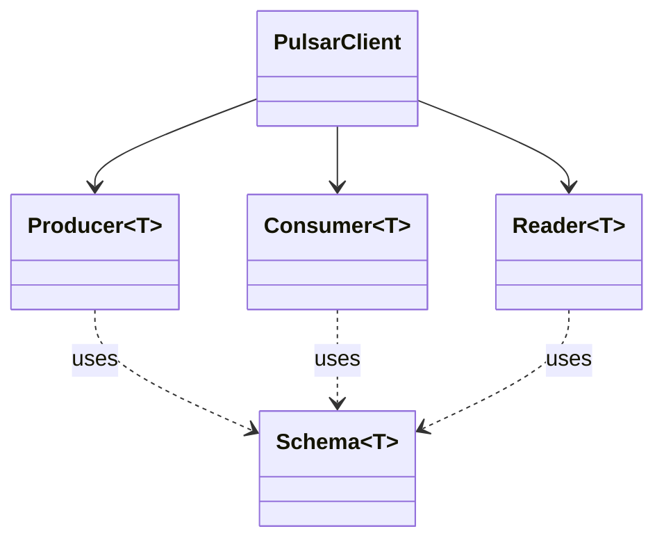

# bluetape4k-pulsar 구현 플랜

- Spec: docs/superpowers/specs/2026-04-27-infra-pulsar-design.md
- Issue: #147
- 브랜치: feat/infra-pulsar
- 작성일: 2026-04-27

---

## 개요

`infra/pulsar` 모듈을 신규 추가한다. Apache Pulsar Java Client (3.3.9)를 Kotlin Coroutines / Flow 로 감싸는 extension function 우선의 래퍼 라이브러리이다. 산출물은 12개 Task 로 분할되며 각 Task는 독립적으로 검증 가능하다.

### 모듈 패키지 루트

`io.bluetape4k.pulsar` (자동 등록명: `bluetape4k-pulsar`)

### 설계 원칙 (스펙 §2-2 발췌)

- **Extension functions 우선** (object 메서드 금지)
- **CompletableFuture → Coroutine**: `awaitSuspending()` 사용 (`bluetape4k-coroutines`)
- **Flow 변환 폴링 패턴**: `flow { while (currentCoroutineContext().isActive) { ... } }`
    + 취소 시 대기 중 `CompletableFuture.cancel(true)` 명시적 호출
- **DSL**: `pulsarClient {}`, `producer {}`, `consumer {}`, `reader {}`
- **withXxx {}**: `suspend inline fun` + `try/finally { closeAsync().awaitSuspending() }`
- top-level 파일 로깅: `private val log = KotlinLogging.logger {}`
- 클래스 파일: `companion object : KLogging()`

---

## Tasks

### T1 — 모듈 Gradle 설정 + 테스트 리소스

**complexity: medium**

생성 파일:

- `infra/pulsar/build.gradle.kts`
- `infra/pulsar/src/test/resources/junit-platform.properties`
- `infra/pulsar/src/test/resources/logback-test.xml`

구현 힌트:

`build.gradle.kts` — `infra/nats/build.gradle.kts` 패턴 참고. 스펙 §5 의존성 정확히 반영.

```kotlin
configurations {
    testImplementation.get().extendsFrom(compileOnly.get(), runtimeOnly.get())
}

dependencies {
    api(project(":bluetape4k-core"))
    api(project(":bluetape4k-coroutines"))

    // Pulsar — pulsar_client(구현체 포함) vs pulsar_client_api(인터페이스만) 구분
    // 래퍼 라이브러리이므로 PulsarClient.builder().build() 사용 → 구현체 필요 → pulsar_client 사용
    api(Libs.pulsar_client)                    // 3.3.9 — buildSrc/Libs.kt 에 존재 확인 필요

    // Jackson (compileOnly — 사용 모듈이 런타임에 implementation 으로 선언)
    compileOnly(project(":bluetape4k-jackson2"))
    compileOnly(Libs.jackson_databind)
    compileOnly(project(":bluetape4k-jackson3"))
    compileOnly(Libs.jackson3_databind)

    // Coroutines
    implementation(Libs.kotlinx_coroutines_core)
    testImplementation(Libs.kotlinx_coroutines_test)

    // Testcontainers
    testImplementation(project(":bluetape4k-junit5"))
    testImplementation(project(":bluetape4k-testcontainers"))
    testImplementation(Libs.testcontainers_pulsar)

    // 테스트용 Jackson (Schema 라운드트립용)
    testImplementation(project(":bluetape4k-jackson2"))
    testImplementation(project(":bluetape4k-jackson3"))
    testImplementation(Libs.jackson_module_kotlin)
}
```

`junit-platform.properties` — `bluetape4k-projects/.claude/templates` 또는 다른 모듈 (예: `infra/nats/src/test/resources/junit-platform.properties`) 그대로 복사:

```
junit.jupiter.execution.parallel.enabled=true
junit.jupiter.execution.parallel.mode.default=concurrent
junit.jupiter.execution.parallel.mode.classes.default=concurrent
```

`logback-test.xml` — 기존 모듈 (예: `infra/nats/src/test/resources/logback-test.xml`)을 그대로 복사하고 패키지명만 `io.bluetape4k.pulsar` 로 교체.

**검증**:

- `./gradlew :bluetape4k-pulsar:dependencies` 실행 시 `pulsar_client`, `kotlinx_coroutines_core` 해석 성공
- `./gradlew :bluetape4k-pulsar:compileKotlin` 통과 (소스가 비어 있어도 OK)

---

### T2 — PulsarClientSupport (DSL + withPulsarClient)

**complexity: medium**

생성 파일:

- `infra/pulsar/src/main/kotlin/io/bluetape4k/pulsar/PulsarClientSupport.kt`

구현 힌트:

```kotlin
package io.bluetape4k.pulsar

import io.bluetape4k.coroutines.support.awaitSuspending
import io.bluetape4k.logging.KotlinLogging
import org.apache.pulsar.client.api.ClientBuilder
import org.apache.pulsar.client.api.PulsarClient

private val log = KotlinLogging.logger {}

/**
 * [PulsarClient] DSL 빌더.
 *
 * @param serviceUrl 비어있지 않으면 `serviceUrl(serviceUrl)` 호출 후 setup 블록 적용
 * @param setup [ClientBuilder] 추가 설정
 */
fun pulsarClient(
    serviceUrl: String = "",
    setup: ClientBuilder.() -> Unit = {},
): PulsarClient {
    val builder = PulsarClient.builder()
    if (serviceUrl.isNotBlank()) builder.serviceUrl(serviceUrl)
    return builder.apply(setup).build()
}

/**
 * Pulsar 클라이언트 생명주기를 블록 스코프로 자동 관리한다.
 *
 * 블록 종료 시(정상/예외/취소 무관) `client.closeAsync().awaitSuspending()` 으로 비동기 close 보장.
 */
suspend inline fun <T> withPulsarClient(
    serviceUrl: String,
    noinline setup: ClientBuilder.() -> Unit = {},
    crossinline block: suspend PulsarClient.() -> T,
): T {
    val client = pulsarClient(serviceUrl, setup)
    try {
        return block(client)
    } finally {
        runCatching { client.closeAsync().awaitSuspending() }
    }
}
```

**주의**:

- `inline fun` + `crossinline` 사용. `noinline` 은 inline 컨텍스트로 람다를 전달할 수 없는 setup 람다에 적용
- finally 의 close 실패가 본 예외를 가리지 않도록 `runCatching` 사용

**검증**: 컴파일 통과. T7 의 `AbstractPulsarTest` 에서 사용됨.

---

### T3 — ProducerSupport + ProducerExtensions

**complexity: medium**

생성 파일:

- `infra/pulsar/src/main/kotlin/io/bluetape4k/pulsar/producer/ProducerSupport.kt`
- `infra/pulsar/src/main/kotlin/io/bluetape4k/pulsar/producer/ProducerExtensions.kt`

#### `ProducerSupport.kt`

```kotlin
package io.bluetape4k.pulsar.producer

import io.bluetape4k.coroutines.support.awaitSuspending
import io.bluetape4k.logging.KotlinLogging
import org.apache.pulsar.client.api.Producer
import org.apache.pulsar.client.api.ProducerBuilder
import org.apache.pulsar.client.api.PulsarClient
import org.apache.pulsar.client.api.Schema

private val log = KotlinLogging.logger {}

/**
 * [Producer] DSL 빌더 (PulsarClient 확장).
 */
fun <T> PulsarClient.producer(
    schema: Schema<T>,
    setup: ProducerBuilder<T>.() -> Unit,
): Producer<T> = newProducer(schema).apply(setup).create()

/**
 * Producer 생명주기를 블록 스코프로 관리. 종료 시 `closeAsync().awaitSuspending()`.
 */
suspend inline fun <T, R> PulsarClient.withProducer(
    schema: Schema<T>,
    noinline setup: ProducerBuilder<T>.() -> Unit = {},
    crossinline block: suspend Producer<T>.() -> R,
): R {
    val producer = producer(schema, setup)
    try {
        return block(producer)
    } finally {
        runCatching { producer.closeAsync().awaitSuspending() }
    }
}
```

#### `ProducerExtensions.kt`

```kotlin
package io.bluetape4k.pulsar.producer

import io.bluetape4k.coroutines.support.awaitSuspending
import io.bluetape4k.logging.KotlinLogging
import kotlinx.coroutines.flow.Flow
import kotlinx.coroutines.flow.map
import org.apache.pulsar.client.api.MessageId
import org.apache.pulsar.client.api.Producer
import org.apache.pulsar.client.api.TypedMessageBuilder

private val log = KotlinLogging.logger {}

/** suspend send — `sendAsync(message).awaitSuspending()`. */
suspend fun <T> Producer<T>.sendSuspend(message: T): MessageId =
    sendAsync(message).awaitSuspending()

/**
 * TypedMessageBuilder DSL 기반 send.
 *
 * ```

* producer.sendSuspend<Order> {
*     value(order); key("order-${order.id}"); property("v", "1")
* }
* ```

*/ suspend fun <T> Producer<T>.sendSuspend (setup: TypedMessageBuilder<T>. () -> Unit,
): MessageId = newMessage ().apply (setup).sendAsync ().awaitSuspending ()

/**

* Flow 기반 배치 발행.
*
* 첫 실패 시 Flow 가 즉시 종료되고 예외가 전파된다 (재시도는 호출자 책임).
* map 의 suspend 람다 안에서 sendSuspend 호출 — 실패 시 자연스럽게 throw.
  */ fun <T> Producer<T>.sendAsFlow (messages: Flow<T>): Flow<MessageId> = messages.map { sendSuspend (it) }

```

**주의**:
- `sendAsFlow` 는 Kafka 의 `sendAsFlow` 와 달리 `flush()` 없음 (Pulsar 는 자동 batch flush)
- 첫 실패 시 종료 → `Flow.map` 자체가 예외를 전파하므로 별도 처리 불필요
- `Flow.map { }` 람다는 내부적으로 suspend 컨텍스트 — `sendSuspend` (suspend fun) 호출 가능. 컴파일 오류 없음

**검증**: T7 `ProducerExtensionsTest` 에서 검증.

---

### T4 — ConsumerSupport + ConsumerExtensions
**complexity: high**

생성 파일:
- `infra/pulsar/src/main/kotlin/io/bluetape4k/pulsar/consumer/ConsumerSupport.kt`
- `infra/pulsar/src/main/kotlin/io/bluetape4k/pulsar/consumer/ConsumerExtensions.kt`

#### `ConsumerSupport.kt`

`ProducerSupport.kt` 와 동일 패턴. `PulsarClient.consumer(schema, setup)` + `withConsumer`.

```kotlin
fun <T> PulsarClient.consumer(
    schema: Schema<T>,
    setup: ConsumerBuilder<T>.() -> Unit,
): Consumer<T> = newConsumer(schema).apply(setup).subscribe()

suspend inline fun <T, R> PulsarClient.withConsumer(
    schema: Schema<T>,
    noinline setup: ConsumerBuilder<T>.() -> Unit = {},
    crossinline block: suspend Consumer<T>.() -> R,
): R {
    val consumer = consumer(schema, setup)
    try { return block(consumer) }
    finally { runCatching { consumer.closeAsync().awaitSuspending() } }
}
```

#### `ConsumerExtensions.kt` (스펙 §3-3 생명주기 계약 엄수)

```kotlin
package io.bluetape4k.pulsar.consumer

import io.bluetape4k.coroutines.support.awaitSuspending
import io.bluetape4k.logging.KotlinLogging
import kotlinx.coroutines.CancellationException
import kotlinx.coroutines.currentCoroutineContext
import kotlinx.coroutines.ensureActive
import kotlinx.coroutines.flow.Flow
import kotlinx.coroutines.flow.flow
import kotlinx.coroutines.isActive
import org.apache.pulsar.client.api.Consumer
import org.apache.pulsar.client.api.Message

private val log = KotlinLogging.logger {}

/** suspend receive — `receiveAsync().awaitSuspending()`. */
suspend fun <T> Consumer<T>.receiveSuspend(): Message<T> =
    receiveAsync().awaitSuspending()

/**
 * Flow 기반 무한 소비.
 *
 * ## 생명주기 계약 (스펙 §3-3)
 * - Flow 취소 시 대기 중인 [java.util.concurrent.CompletableFuture]를 `cancel(true)` 호출 후 종료
 * - Flow 는 Consumer 를 소유하지 않음 — 호출자/`withConsumer {}` 가 close 책임
 * - 브로커 연결 끊김은 Pulsar Client 자동 재연결 — receiveAsync() 가 그동안 블로킹
 */
fun <T> Consumer<T>.receiveAsFlow(): Flow<Message<T>> = flow {
    while (currentCoroutineContext().isActive) {
        val future = receiveAsync()
        try {
            emit(future.awaitSuspending())
        } catch (ce: CancellationException) {
            future.cancel(true)
            throw ce
        }
    }
}

/** suspend ack — `acknowledgeAsync(message).awaitSuspending()`. */
suspend fun <T> Consumer<T>.acknowledgeSuspend(message: Message<T>) {
    acknowledgeAsync(message).awaitSuspending()
}

/**
 * Cumulative ack (suspend).
 *
 * **주의**: Shared subscription 에서 호출하면 `PulsarClientException` 발생.
 * Exclusive / Failover 구독에서만 사용해야 한다.
 */
suspend fun <T> Consumer<T>.acknowledgeCumulativeSuspend(message: Message<T>) {
    acknowledgeCumulativeAsync(message).awaitSuspending()
}

// negativeAcknowledge 확장 정의 없음:
// Consumer 인터페이스에 이미 negativeAcknowledge(Message<T>) 가 void 로 정의됨.
// 동일 시그니처 확장은 인스턴스 메서드에 가려지므로 아무 효과 없음.
// 호출자는 consumer.negativeAcknowledge(msg) 를 직접 사용한다.
```

**주의**:

- `negativeAcknowledge` 확장 **생략
  확정**: Pulsar `Consumer` 인터페이스에 동일 시그니처 메서드가 이미 존재. 확장이 인스턴스 메서드보다 우선되지 않으므로 무의미. DoD에서도 제외됨.
- `currentCoroutineContext().isActive` 사용 (`coroutineContext` 임포트 필요 없음)

**검증**: T8 `ConsumerExtensionsTest` 에서 검증.

---

### T5 — ReaderSupport + ReaderExtensions

**complexity: medium**

생성 파일:

- `infra/pulsar/src/main/kotlin/io/bluetape4k/pulsar/reader/ReaderSupport.kt`
- `infra/pulsar/src/main/kotlin/io/bluetape4k/pulsar/reader/ReaderExtensions.kt`

#### `ReaderSupport.kt`

`ConsumerSupport.kt` 동일 패턴.

```kotlin
fun <T> PulsarClient.reader(
    schema: Schema<T>,
    setup: ReaderBuilder<T>.() -> Unit,
): Reader<T> = newReader(schema).apply(setup).create()

suspend inline fun <T, R> PulsarClient.withReader(
    schema: Schema<T>,
    noinline setup: ReaderBuilder<T>.() -> Unit = {},
    crossinline block: suspend Reader<T>.() -> R,
): R {
    val reader = reader(schema, setup)
    try { return block(reader) }
    finally { runCatching { reader.closeAsync().awaitSuspending() } }
}
```

#### `ReaderExtensions.kt`

```kotlin
suspend fun <T> Reader<T>.readNextSuspend(): Message<T> =
    readNextAsync().awaitSuspending()

/**
 * `hasMessageAvailable()` 기반 Flow.
 *
 * ## 생명주기 계약
 * - `hasMessageAvailable() == false` 이면 Flow 정상 종료
 * - 취소 시 대기 중 `CompletableFuture.cancel(true)` 후 종료
 * - Reader 는 Flow 가 소유하지 않음
 */
fun <T> Reader<T>.readAsFlow(): Flow<Message<T>> = flow {
    while (currentCoroutineContext().isActive && hasMessageAvailable()) {
        val future = readNextAsync()
        try {
            emit(future.awaitSuspending())
        } catch (ce: CancellationException) {
            future.cancel(true)
            throw ce
        }
    }
}
```

**주의**:

- `hasMessageAvailable()` 은 동기 호출. Pulsar Java Client 내부에서 캐시된 큐를 확인하는 방식이므로 대부분 비블로킹이나, 확인 필요 시 `withContext(Dispatchers.IO)` 로 감싸서 테스트해볼 것.
- T9 테스트에서 동작 확인.

**검증**: T9 `ReaderExtensionsTest` 에서 검증.

---

### T6 — Jackson Schema (compileOnly)

**complexity: medium**

생성 파일:

- `infra/pulsar/src/main/kotlin/io/bluetape4k/pulsar/codec/JacksonSchema.kt` (Jackson2)
- `infra/pulsar/src/main/kotlin/io/bluetape4k/pulsar/codec/Jackson3Schema.kt` (Jackson3)

#### `JacksonSchema.kt` (Jackson2 — `com.fasterxml.jackson.databind.ObjectMapper`)

```kotlin
package io.bluetape4k.pulsar.codec

import com.fasterxml.jackson.databind.ObjectMapper
import io.bluetape4k.jackson.Jackson
import io.bluetape4k.logging.KotlinLogging
import org.apache.pulsar.client.api.Schema
import org.apache.pulsar.common.schema.SchemaInfo
import org.apache.pulsar.common.schema.SchemaType

private val log = KotlinLogging.logger {}

/**
 * Jackson2 기반 Pulsar [Schema] 구현.
 *
 * ⚠️ **compileOnly 의존**: 사용 모듈은 `bluetape4k-jackson2` 를 implementation 으로 선언해야 한다.
 * 누락 시 런타임에 `NoClassDefFoundError` 발생.
 */
fun <T> jacksonSchema(
    type: Class<T>,
    mapper: ObjectMapper = Jackson.defaultJsonMapper,
): Schema<T> = JacksonSchemaImpl(type, mapper)

inline fun <reified T> jacksonSchema(
    mapper: ObjectMapper = Jackson.defaultJsonMapper,
): Schema<T> = jacksonSchema(T::class.java, mapper)

private class JacksonSchemaImpl<T>(
    private val type: Class<T>,
    private val mapper: ObjectMapper,
) : Schema<T> {
    private val info: SchemaInfo = SchemaInfo.builder()
        .name(type.simpleName)
        .type(SchemaType.JSON)
        .schema(ByteArray(0))            // 브로커 스키마 검증 없음
        .build()

    override fun encode(message: T): ByteArray = mapper.writeValueAsBytes(message)
    override fun decode(bytes: ByteArray): T = mapper.readValue(bytes, type)
    override fun getSchemaInfo(): SchemaInfo = info
    override fun clone(): Schema<T> = JacksonSchemaImpl(type, mapper)
}
```

#### `Jackson3Schema.kt` (Jackson3 — `tools.jackson.databind.ObjectMapper`)

위와 동일한 구조. import 만 다름:

```kotlin
import tools.jackson.databind.ObjectMapper as Jackson3ObjectMapper

fun <T> jackson3Schema(
    type: Class<T>,
    mapper: Jackson3ObjectMapper,
): Schema<T> = Jackson3SchemaImpl(type, mapper)

inline fun <reified T> jackson3Schema(
    mapper: Jackson3ObjectMapper,
): Schema<T> = jackson3Schema(T::class.java, mapper)
```

Jackson3 의 default mapper 헬퍼는 `bluetape4k-jackson3` 모듈의 정확한 API 명을 확인해서 사용 (`io.bluetape4k.jackson3.Jackson3.defaultJsonMapper` 등이 있는지 검토; 없으면 default 인자 제거하고 호출자가 mapper 전달).

**주의**:

- `Schema<T>.clone()` 은 Pulsar 인터페이스 요구. 새 인스턴스 반환
- `getSchemaInfo()` 의 schema bytes 는 `ByteArray(0)` — 브로커 호환성 우선

**검증**: T10 에서 라운드트립 테스트.

---

### T7 — AbstractPulsarTest + ProducerExtensionsTest

**complexity: medium**

생성 파일:

- `infra/pulsar/src/test/kotlin/io/bluetape4k/pulsar/AbstractPulsarTest.kt`
- `infra/pulsar/src/test/kotlin/io/bluetape4k/pulsar/producer/ProducerExtensionsTest.kt`

#### `AbstractPulsarTest.kt`

```kotlin
package io.bluetape4k.pulsar

import io.bluetape4k.logging.KLogging
import io.bluetape4k.testcontainers.mq.PulsarServer
import org.apache.pulsar.client.api.PulsarClient
import org.junit.jupiter.api.AfterEach
import org.junit.jupiter.api.BeforeEach

abstract class AbstractPulsarTest {

    companion object : KLogging() {
        @JvmStatic
        protected val pulsar = PulsarServer.Launcher.pulsar  // lazy 시작
    }

    protected lateinit var client: PulsarClient

    @BeforeEach
    fun setupClient() {
        client = pulsarClient(pulsar.url) {
            // 기본 설정만
        }
    }

    @AfterEach
    fun closeClient() {
        runCatching { client.close() }
    }

    /** 테스트별 고유 토픽 — 토픽 충돌 방지. */
    protected fun newTopic(prefix: String = "test"): String =
        "persistent://public/default/$prefix-${java.util.UUID.randomUUID()}"

    /** 테스트별 고유 subscriptionName — 스펙 §3-3 패턴. */
    protected fun newSubscription(prefix: String = "test-sub"): String =
        "$prefix-${java.util.UUID.randomUUID()}"
}
```

#### `ProducerExtensionsTest.kt`

```kotlin
class ProducerExtensionsTest : AbstractPulsarTest() {

    @Test
    fun `sendSuspend - 단건 발행`() = runTest {
        val topic = newTopic()
        client.withProducer(Schema.STRING, { topic(topic) }) {
            val msgId = sendSuspend("hello")
            msgId.shouldNotBeNull()
        }
    }

    @Test
    fun `sendAsFlow - 100건 발행 후 결과 수신`() = runTest {
        val topic = newTopic()
        client.withProducer(Schema.STRING, { topic(topic) }) {
            val results = sendAsFlow(flow {
                repeat(100) { emit("msg-$it") }
            }).toList()
            results.size shouldBeEqualTo 100
        }
    }
}
```

**주의**:

- `runTest(timeout = 30.seconds)` 로 타임아웃 반드시 명시 (Pulsar 컨테이너 첫 시작 시 시간 소요)
  → T7 코드 블록의 두 테스트도 `runTest(timeout = 30.seconds)` / `runTest(timeout = 60.seconds)` 적용
- bluetape4k-assertions matcher: `shouldBeEqualTo`, `shouldNotBeNull` (절대 `(x == y).shouldBeTrue()` 금지)
- `pulsarClient {}` DSL 사용 이유: `PulsarServer.Launcher.PulsarClient()` 팩토리 대신 본 모듈의 DSL을 직접 검증하기 위함

**검증**: `./gradlew :bluetape4k-pulsar:test --tests "*ProducerExtensionsTest"` 통과.

---

### T8 — ConsumerExtensionsTest

**complexity: medium**

생성 파일:

- `infra/pulsar/src/test/kotlin/io/bluetape4k/pulsar/consumer/ConsumerExtensionsTest.kt`

테스트 케이스:

1. `receiveSuspend + acknowledgeSuspend 라운드트립` — Producer 1건 발행 후 Consumer 1건 수신 + ack
2. `receiveAsFlow - Exclusive 구독에서 10건 소비` — `take(10).toList()` 로 Flow 종료, 그 후 ack 일괄
3. `acknowledgeCumulativeSuspend - Shared 구독에서 예외 발생 확인` — Shared subscription 에서 cumulative ack 호출 시 `PulsarClientException` 발생 검증

힌트:

```kotlin
@Test
fun `receiveSuspend - 라운드트립`() = runTest(timeout = 30.seconds) {
    val topic = newTopic()
    val sub = newSubscription()

    client.withConsumer(Schema.STRING, {
        topic(topic); subscriptionName(sub)
        subscriptionType(SubscriptionType.Exclusive)
    }) {
        client.withProducer(Schema.STRING, { topic(topic) }) {
            sendSuspend("hello")
        }
        val msg = receiveSuspend()
        msg.value shouldBeEqualTo "hello"
        acknowledgeSuspend(msg)
    }
}

@Test
fun `receiveAsFlow - Exclusive 10건 소비`() = runTest(timeout = 60.seconds) {
    val topic = newTopic()
    val sub = newSubscription()
    val total = 10

    client.withConsumer(Schema.STRING, {
        topic(topic); subscriptionName(sub)
        subscriptionType(SubscriptionType.Exclusive)
    }) {
        client.withProducer(Schema.STRING, { topic(topic) }) {
            repeat(total) { sendSuspend("msg-$it") }
        }
        val received = receiveAsFlow().take(total).toList()
        received.size shouldBeEqualTo total
        received.forEach { acknowledgeSuspend(it) }
    }
}
```

테스트 케이스 3 힌트:

```kotlin
@Test
fun `acknowledgeCumulativeSuspend - Shared 구독에서 예외 발생`() = runTest(timeout = 30.seconds) {
    val topic = newTopic()
    val sub = newSubscription()
    client.withProducer(Schema.STRING, { topic(topic) }) { sendSuspend("hello") }
    client.withConsumer(Schema.STRING, {
        topic(topic); subscriptionName(sub)
        subscriptionType(SubscriptionType.Shared)
    }) {
        val msg = receiveSuspend()
        // Shared subscription 에서 cumulative ack 는 예외 발생
        assertThrows<PulsarClientException> { acknowledgeCumulativeSuspend(msg) }
    }
}
```

**주의**:

- subscription 은 producer 발행 **이전에** 생성되어야 메시지 손실 없음. `withConsumer {}` 가 outer
- `take(total)` 로 Flow 종료 — `receiveAsFlow` 의 cancel 경로 검증 효과

**검증**: `./gradlew :bluetape4k-pulsar:test --tests "*ConsumerExtensionsTest"` 통과.

---

### T9 — ReaderExtensionsTest

**complexity: medium**

생성 파일:

- `infra/pulsar/src/test/kotlin/io/bluetape4k/pulsar/reader/ReaderExtensionsTest.kt`

테스트 케이스:

1. `readNextSuspend - earliest 부터 첫 메시지 읽기` — 발행 후 `MessageId.earliest` Reader 로 1건 읽기
2. `readAsFlow - hasMessageAvailable 기반 종료` — 5건 발행 후 Flow 가 5건만 emit 후 정상 종료

힌트:

```kotlin
@Test
fun `readAsFlow - 발행한 모든 메시지 읽고 종료`() = runTest(timeout = 60.seconds) {
    val topic = newTopic()
    client.withProducer(Schema.STRING, { topic(topic) }) {
        repeat(5) { sendSuspend("msg-$it") }
    }
    client.withReader(Schema.STRING, {
        topic(topic); startMessageId(MessageId.earliest)
    }) {
        val msgs = readAsFlow().toList()
        msgs.size shouldBeEqualTo 5
    }
}
```

**검증**: `./gradlew :bluetape4k-pulsar:test --tests "*ReaderExtensionsTest"` 통과.

---

### T10 — JacksonSchemaTest + Jackson3SchemaTest

**complexity: medium**

생성 파일:

- `infra/pulsar/src/test/kotlin/io/bluetape4k/pulsar/codec/JacksonSchemaTest.kt`
- `infra/pulsar/src/test/kotlin/io/bluetape4k/pulsar/codec/Jackson3SchemaTest.kt`

테스트 페이로드:

```kotlin
data class Order(val id: Long, val name: String, val amount: Double)
```

테스트 케이스:

1. `encode → decode 라운드트립` — `schema.decode(schema.encode(order)) shouldBeEqualTo order`
2. `getSchemaInfo - SchemaType.JSON 검증` — `info.type shouldBeEqualTo SchemaType.JSON`,
   `info.name shouldBeEqualTo "Order"`, `info.schema.shouldBeEmpty()`

힌트 (Jackson2):

```kotlin
class JacksonSchemaTest {
    @Test
    fun `encode decode 라운드트립`() {
        val schema = jacksonSchema<Order>()
        val original = Order(1, "test", 99.9)
        val bytes = schema.encode(original)
        val decoded = schema.decode(bytes)
        decoded shouldBeEqualTo original
    }

    @Test
    fun `SchemaInfo 타입 검증`() {
        val schema = jacksonSchema<Order>()
        val info = schema.schemaInfo
        info.type shouldBeEqualTo SchemaType.JSON
        info.name shouldBeEqualTo "Order"
        info.schema.size shouldBeEqualTo 0
    }
}
```

Jackson3 테스트는 `jackson3Schema(mapper)` 시그니처에 맞춰 mapper 전달.

Jackson3 mapper 생성 힌트:

```kotlin
// bluetape4k-jackson3 의 Jackson3.defaultJsonMapper 또는
// tools.jackson.module.kotlin.jsonMapper { addModule(kotlinModule()) }
// 실제 API 명칭은 T6 구현 시 io.bluetape4k.jackson3.Jackson 소스 확인 후 결정
```

**주의**:

- 두 테스트 모두 testcontainers 불필요 (순수 단위 테스트) → 빠름
- Pulsar 브로커 통합 라운드트립은 별도로 안 함 (Producer/Consumer 테스트가 STRING schema 만 사용)

**검증**: `./gradlew :bluetape4k-pulsar:test --tests "*Schema*Test"` 통과.

---

### T11 — README.md + README.ko.md

**complexity: low**

생성 파일:

- `infra/pulsar/README.md` (English)
- `infra/pulsar/README.ko.md` (Korean)

요구사항:

- 제목 바로 아래 언어 전환 링크
    - `README.md` → `[한국어](./README.ko.md) | English`
    - `README.ko.md` → `한국어 | [English](./README.md)`
- Mermaid Class diagram 포함 (PulsarClient ↔ Producer/Consumer/Reader 관계)
- 구조: **Architecture → UML → Features → Examples**
- 예시 코드: `pulsarClient {}`, `withProducer/withConsumer/withReader`, `sendSuspend`, `receiveAsFlow`, `jacksonSchema`

Mermaid 예:



**검증**: 마크다운 렌더 확인 (Obsidian / GitHub preview).

---

### T13 — bluetape4k-patterns 체크리스트 검증

**complexity: low**

`bluetape4k-patterns` 스킬 기준 전수 점검:

- [ ] 모든 public API KDoc 한국어 기재 여부
- [ ] 클래스 `companion object : KLogging()` 누락 없음
- [ ] top-level 파일 `private val log = KotlinLogging.logger {}` 누락 없음
- [ ] `requireNotBlank`, `requireNotNull` 등 validataion 패턴 적절히 사용
- [ ] bluetape4k-assertions `shouldBeTrue()` 직접 사용 없음 — 비교 matcher 사용

---

### T12 — CLAUDE.md 업데이트

**complexity: low**

대상 파일:

- `CLAUDE.md` (루트 — 워크트리 cwd 기준 `/Users/debop/work/bluetape4k/bluetape4k-projects/.worktrees/feat/infra-pulsar/CLAUDE.md`
  와 `/Users/debop/work/bluetape4k/bluetape4k-projects/CLAUDE.md` 양쪽 동기화 필요 시 검토)

수정 위치: `## Module Groups` 테이블, `infra/` 행.

기존:

```
| `infra/`         | `lettuce`, `redisson`, `kafka`, `resilience4j`, `bucket4j`, `micrometer`, `opentelemetry`, `cache-*`, `elasticsearch`       |
```

수정 후:

```
| `infra/`         | `lettuce`, `redisson`, `kafka`, `pulsar`, `resilience4j`, `bucket4j`, `micrometer`, `opentelemetry`, `cache-*`, `elasticsearch` |
```

**검증**: `rg "pulsar" CLAUDE.md` 결과에 module groups 행이 포함됨.

---

## 작업 순서

T1 → T2 → T3 → T4 → T5 → T6 (구현 6 Task 완료) → T7 → T8 → T9 → T10 (테스트 4 Task) → T13 (patterns 체크) → T11 → T12 (문서)

각 Task 완료 후 즉시 컴파일 확인:

- T1: `./gradlew :bluetape4k-pulsar:compileKotlin`
- T2~T6: `./gradlew :bluetape4k-pulsar:compileKotlin`
- T7~T10: `./gradlew :bluetape4k-pulsar:test`
- T11~T12: 문서 체크

전체 완료 후:

- `./gradlew :bluetape4k-pulsar:build`
- `./gradlew :bluetape4k-pulsar:detekt`
- code-reviewer 에이전트 실행 → HIGH/CRITICAL 해소
- 한국어 commit + PR

---

## DoD 체크리스트 (스펙 §7)

### 구현

- [ ] T1: 모듈 등록 + 의존성 + test resources
- [ ] T2: `pulsarClient {}` / `withPulsarClient {}`
- [ ] T3: `producer {}` / `withProducer {}` / `sendSuspend` / `sendAsFlow`
- [ ] T4: `consumer {}` / `withConsumer {}` / `receiveSuspend` / `receiveAsFlow` / `acknowledgeSuspend` / `acknowledgeCumulativeSuspend`
- [ ] T5: `reader {}` / `withReader {}` / `readNextSuspend` / `readAsFlow`
- [ ] T6: Jackson2 `jacksonSchema<T>()` + Jackson3 `jackson3Schema<T>()` (SchemaInfo 포함)

### 코드 품질

- [ ] 모든 public API 한국어 KDoc
- [ ] top-level 파일 `private val log = KotlinLogging.logger {}`
- [ ] 클래스 파일 `companion object : KLogging()`
- [ ] bluetape4k-assertions matcher 일관 사용 (shouldBeEqualTo / shouldNotBeNull)

### 테스트

- [ ] T7: ProducerExtensionsTest 통과
- [ ] T8: ConsumerExtensionsTest 통과 (UUID subscriptionName)
- [ ] T9: ReaderExtensionsTest 통과
- [ ] T10: JacksonSchemaTest + Jackson3SchemaTest 통과
- [ ] `junit-platform.properties` + `logback-test.xml` 포함

### 코드 품질 추가

- [ ] T13: bluetape4k-patterns 체크리스트 전수 통과

### 문서

- [ ] T11: README.md + README.ko.md (Mermaid + 언어 전환 링크)
- [ ] T12: CLAUDE.md `infra/` 그룹에 `pulsar` 추가

### PR 전 필수

- [ ] `./gradlew :bluetape4k-pulsar:test` 결과 (passing count + duration) PR description 포함

---

## 리스크 및 주의사항

1. **`Libs.pulsar_client` 존재 확인**: `buildSrc/Libs.kt` 에 Pulsar 클라이언트 dependency 가 없으면 T1 에서 추가 필요. 버전 `3.3.9` (스펙 §5).
2. **`Libs.testcontainers_pulsar` 존재 확인**: 동일.
3. **`Libs.jackson3_databind` 존재 확인**: jackson3 모듈은 비교적 신규이므로 buildSrc 에 dependency 등록 필요할 수 있음.
4.

**`io.bluetape4k.coroutines.support.awaitSuspending`**: 시그니처가 `CompletableFuture<T>.awaitSuspending(): T` 인지 확인. 다를 경우 `kotlinx.coroutines.future.await()` 로 대체.
5. **Pulsar 컨테이너 첫 부팅**: Docker pull + 시작에 30초+ 소요 가능 → 모든 테스트 `runTest(timeout = 60.seconds)` 권장.
6. **테스트 격리**: 동일 broker 를 공유하므로 토픽/구독 이름은 반드시 UUID 로 고유화 (`AbstractPulsarTest.newTopic()` / `newSubscription()`).
7. **Jackson3 default
   mapper**: `bluetape4k-jackson3` 의 default mapper helper 명이 확정되지 않았으면 default 파라미터 생략하고 호출자가 항상 mapper 를 전달하도록 한다.
