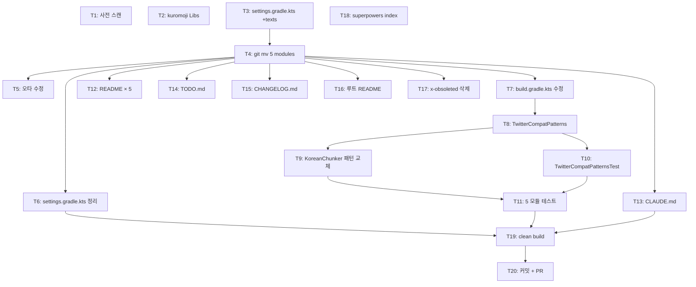

# texts/** 토크나이저·언어처리 모듈 승격 구현 플랜

- Spec: `docs/superpowers/specs/2026-04-27-texts-tokenizer-promotion-design.md`
- Issue: #170
- 브랜치: `feat/texts-tokenizer-promotion`
- Worktree: `.worktrees/feat/texts-tokenizer-promotion`
- 작성일: 2026-04-27

---

## 개요

`x-obsoleted/tokenizer/` 의 3개 모듈(`tokenizer-core`, `tokenizer-korean`, `tokenizer-japanese`)과 `utils/lingua`,
`utils/text-search` 를 단일 **`texts/`** 디렉토리로 승격(재배치)한다. 동시에 `tokenizer-korean` 의
**twitter-text 4.x 의존성**을 제거하고 인라인 정규식 (`TwitterCompatPatterns`) 으로 대체한다.

최종 모듈 구조:

```
texts/
├── tokenizer-core      → bluetape4k-tokenizer-core
├── tokenizer-korean    → bluetape4k-tokenizer-korean
├── tokenizer-japanese  → bluetape4k-tokenizer-japanese
├── lingua              → bluetape4k-lingua
└── text-search         → bluetape4k-text-search
```

### 핵심 게이트

- `KoreanChunkerTest` 100% 통과 (twitter-text 제거 후에도 동등 동작 보장)
- 5개 모듈 `:test` 모두 통과
- `./gradlew clean build -x test` 전체 빌드 통과
- 5개 모듈 README.md / README.ko.md (Mermaid UML 포함)

### 작업 방식

- `git mv` 로 히스토리 보존
- 단일 PR (단순 이동 + 오타 수정 + twitter-text 제거 + Libs.kt 정비)
- Kotlin 2.3 API 현대화는 후속 PR (Non-Goal)

---

## Phase 0 — 준비

### T1 — 다운스트림 참조 사전 스캔
**complexity: low**

이동 전, 이동 대상 모듈을 다른 곳에서 참조하는지 검사한다. 발견 시 동시 업데이트가 필요하다.

검증 명령:
```bash
rg "(:bluetape4k-lingua|:bluetape4k-text-search|:bluetape4k-tokenizer)" \
  --glob "*.kts" --glob "*.gradle"
```

기대 결과: 0건 (또는 발견 시 모두 기록 — Phase 2 에서 일괄 업데이트).

추가로 다음도 확인:
```bash
fd -t f . x-obsoleted/tokenizer utils/lingua utils/text-search    # 이동 대상 모두 존재
fd "Nomalizer|Punchuation" x-obsoleted/tokenizer/                 # 오타 파일명 위치 기록 (파일명 검색)
```

> **중요**: 오타는 **파일명**에 존재하고 내부 심볼(`object KoreanNormalizer`, `class PunctuationProcessor`)은 이미 정상이다.
> 파일 내용 검색(`rg`)은 0건을 반환하므로 반드시 파일명 검색(`fd`)을 사용한다.

**검증**: 사전 스캔 결과를 PR 본문 또는 커밋 메시지에 기록.

---

### T2 — `buildSrc/Libs.kt` 에 kuromoji 의존성 등록
**complexity: low**

수정 파일:
- `buildSrc/src/main/kotlin/Libs.kt`

추가 항목:

```kotlin
object Versions {
    // ...
    const val kuromoji = "0.9.0"
}

object Libs {
    // ...
    const val kuromoji_ipadic = "com.atilika.kuromoji:kuromoji-ipadic:${Versions.kuromoji}"
    const val kuromoji_unidic = "com.atilika.kuromoji:kuromoji-unidic:${Versions.kuromoji}"
}
```

검토할 제거 후보:
- 기존에 `Libs.twitter_text` 가 등록되어 있다면 함께 제거 (다른 모듈 참조 0건 확인 후 — T1 결과 기반).

**검증**:
- `./gradlew buildSrc:compileKotlin` 통과
- `rg "kuromoji_ipadic|kuromoji_unidic" buildSrc/` 2건 이상 매치 (Versions + Libs)

---

## Phase 1 — 구조 이동

### T3 — `settings.gradle.kts` 에 `texts/` 그룹 등록
**complexity: medium**

수정 파일:
- `settings.gradle.kts`

추가 라인:
```kotlin
includeModules("texts", withBaseDir = false)
```

기존 `includeModules("utils", ...)` / `includeModules("x-obsoleted/tokenizer", ...)` 의 패턴을 그대로 따른다.
이 시점에는 `utils/lingua`, `utils/text-search`, `x-obsoleted/tokenizer/*` 항목은 **유지**해 두고,
T6 에서 정리한다 (이동 시 그래들 캐시 안전성 확보).

> ⚠️ **중요 (안전 주의)**: T3 (settings.gradle.kts 에 `includeModules("texts")` 추가) 후, T4 (git mv) 완료 전에는
> `./gradlew projects` 를 실행하지 말 것. `texts/` 디렉토리가 비어 있으면 등록 모듈은 0개이지만,
> `utils/lingua`, `utils/text-search` 가 아직 `utils/` 에 있어 중복 문제는 없다 (자동 등록은 디렉토리 존재 시점에만 발생).
> 단, T4 완료 후에는 반드시 `./gradlew projects` 로 5개 모듈 등록을 검증.

**검증** (T4 완료 후 수행 권장):
- `./gradlew projects` 출력에 `bluetape4k-texts` 디렉토리 인식 시도가 보여야 함 (모듈은 아직 없으므로 비어 있어도 OK)
- `settings.gradle.kts` syntax error 없음

---

### T4 — 5개 모듈 `git mv` 이동
**complexity: medium** · depends: T3

이동 명령 (순서 무관 — 실제 디렉토리명은 `core`/`korean`/`japanese`, `tokenizer-` 접두사 없음):

```bash
mkdir -p texts
git mv x-obsoleted/tokenizer/core      texts/tokenizer-core
git mv x-obsoleted/tokenizer/korean    texts/tokenizer-korean
git mv x-obsoleted/tokenizer/japanese  texts/tokenizer-japanese
git mv utils/lingua                    texts/lingua
git mv utils/text-search               texts/text-search
./gradlew clean
```

대상 모듈은 자동으로 `bluetape4k-{dirname}` 패턴으로 등록 (settings.gradle.kts 의 `includeModules("texts", ...)` 가 처리).

**검증**:
- `eza -la texts/` → 5개 디렉토리 노출
- `git status` → `renamed:` 항목으로 표시 (히스토리 보존 확인)
- `./gradlew projects | rg "bluetape4k-(tokenizer|lingua|text-search)"` → 5개 모듈 등록 확인
- `./gradlew :bluetape4k-tokenizer-core:compileKotlin` 통과 (이동만으로는 컴파일 실패 가능 — twitter-text 제거 전이므로)

---

### T5 — 오타 파일명 수정
**complexity: low** · depends: T4

수정 명령 (실제 존재 시에만):

```bash
git mv texts/tokenizer-korean/src/main/kotlin/io/bluetape4k/tokenizer/korean/normalizer/KoreanNomalizer.kt \
       texts/tokenizer-korean/src/main/kotlin/io/bluetape4k/tokenizer/korean/normalizer/KoreanNormalizer.kt
git mv texts/tokenizer-korean/src/main/kotlin/io/bluetape4k/tokenizer/korean/block/PunchuationProcessor.kt \
       texts/tokenizer-korean/src/main/kotlin/io/bluetape4k/tokenizer/korean/block/PunctuationProcessor.kt
```

내부 심볼(`object KoreanNormalizer`, `class PunctuationProcessor`)은 이미 정상이므로 `@Deprecated typealias` 불필요.

**검증**:
- `rg "KoreanNomalizer|PunchuationProcessor" texts/` → 0건
- `rg "KoreanNormalizer|PunctuationProcessor" texts/` → 정상 참조 다수 매치
- T1 사전 스캔에서 외부 참조 0건 확인된 경우만 진행 (있을 경우 별도 처리)

---

### T6 — `settings.gradle.kts` 정리
**complexity: low** · depends: T4

수정 파일:
- `settings.gradle.kts`

`utils/lingua`, `utils/text-search`, `x-obsoleted/tokenizer/*` 가 이미 이동되었으므로
이전에 자동 등록되었거나 명시 등록된 항목을 제거한다.

- `includeModules("utils", ...)` 의 자동 등록은 디렉토리가 사라지면 자동으로 누락되므로 별도 작업 불필요할 수 있음.
- `x-obsoleted/tokenizer` 명시 등록 라인이 있다면 제거.

**검증**:
- `./gradlew projects | rg "x-obsoleted|utils:(lingua|text-search)"` → 0건
- `./gradlew :bluetape4k-tokenizer-core:projects` → `bluetape4k-tokenizer-core` 그대로 노출

---

## Phase 2 — 의존성 수정

### T7 — `tokenizer-korean` / `tokenizer-japanese` build.gradle.kts 수정
**complexity: medium** · depends: T4

#### `texts/tokenizer-korean/build.gradle.kts`

변경 사항:
- `api("com.twitter.twittertext:twitter-text:3.1.0")` 제거 (또는 `Libs.twitter_text` 참조 시 그것도 제거)
- `api(Libs.eclipse_collections)` → `implementation(Libs.eclipse_collections)` (공개 API 노출 없음 — 내부 구현 전용)

최종 형태:
```kotlin
dependencies {
    api(project(":bluetape4k-tokenizer-core"))
    implementation(Libs.eclipse_collections)
    // twitter-text 의존성 없음 (TwitterCompatPatterns 로 대체)

    testImplementation(project(":bluetape4k-junit5"))
}
```

#### `texts/tokenizer-japanese/build.gradle.kts`

변경 사항:
- `api(Libs.kuromoji_ipadic)` 추가 (T2 에서 등록한 상수 사용)
- (선택) `compileOnly(Libs.kuromoji_unidic)` — 고품질 사전 옵션

최종 형태:
```kotlin
dependencies {
    api(project(":bluetape4k-tokenizer-core"))
    api(Libs.kuromoji_ipadic)
    compileOnly(Libs.kuromoji_unidic)

    testImplementation(project(":bluetape4k-junit5"))
}
```

#### 그 외 모듈

- `texts/tokenizer-core/build.gradle.kts` — 변경 없음 (검토만)
- `texts/lingua/build.gradle.kts` — 변경 없음 (검토만)
- `texts/text-search/build.gradle.kts` — 변경 없음, benchmark sourceSet 유지 확인

**검증**:
- `./gradlew :bluetape4k-tokenizer-korean:dependencies | rg "twitter-text"` → 0건
- `./gradlew :bluetape4k-tokenizer-japanese:dependencies | rg "kuromoji"` → kuromoji_ipadic 매치
- 이 시점에는 컴파일 실패 정상 (T8/T9 전이므로 KoreanChunker 가 missing import)

---

### T8 — `TwitterCompatPatterns.kt` 신규 작성
**complexity: high** · depends: T4, T7

생성 파일:
- `texts/tokenizer-korean/src/main/kotlin/io/bluetape4k/tokenizer/korean/utils/TwitterCompatPatterns.kt`

구현은 **Spec §3.3** 정의를 그대로 사용. 핵심 사항:

- `internal object TwitterCompatPatterns`
- 4개 `Pattern` 상수: `VALID_URL`, `VALID_HASHTAG`, `VALID_MENTION_OR_LIST`, `VALID_CASHTAG`
- 캡처 그룹 정책: 그룹 1 = 선행 공백/괄호 (옵셔널), 그룹 2 = 핵심 매치
- `Matcher.start()`/`end()` 는 그룹 1+2 통합 범위 — `KoreanChunkerTest` fixture 와 호환
- KDoc 에 명시:
  - "단순화된 RFC 3986 기반 패턴, IDN/emoji TLD 미지원"
  - "정확도가 더 필요한 경우 twitter-text-java 직접 의존"

핵심 패턴 (Spec §3.3 발췌):

```kotlin
val VALID_URL: Pattern = Pattern.compile(
    """(\(?(?:https?://|ftp://|www\.)|(?<=\s|^)(?=[a-zA-Z0-9])(?:[a-zA-Z0-9\-]+\.)+[a-zA-Z]{2,})""" +
    """[a-zA-Z0-9\-._~:/?#\[\]@!${'$'}&'()*+,;=%-]*""",
    Pattern.UNICODE_CASE
)

val VALID_HASHTAG: Pattern = Pattern.compile(
    """(\s|^)(#[\p{L}\p{Digit}_]+)""",
    Pattern.UNICODE_CASE or Pattern.UNICODE_CHARACTER_CLASS
)

val VALID_MENTION_OR_LIST: Pattern = Pattern.compile(
    """(\s|^)(@[\p{Alnum}_]+(?:/[\p{Alnum}_]+)?)""",
    Pattern.UNICODE_CASE
)

val VALID_CASHTAG: Pattern = Pattern.compile(
    """(\s|^)(\$[A-Za-z]{1,6}(?:\.[A-Za-z]{1,2})?)"""
)
```

**검증**:
- `./gradlew :bluetape4k-tokenizer-korean:compileKotlin` 통과 (KoreanChunker 가 아직 패턴 교체 전이라면 이 시점 컴파일 실패는 정상 — T9 후 통과)
- `lsp_diagnostics` 0 errors

---

### T9 — `KoreanChunker.kt` 패턴 교체
**complexity: high** · depends: T8

수정 파일:
- `texts/tokenizer-korean/src/main/kotlin/io/bluetape4k/tokenizer/korean/tokenizer/KoreanChunker.kt`
  (T4 이전 경로: `x-obsoleted/tokenizer/korean/src/main/kotlin/io/bluetape4k/tokenizer/korean/tokenizer/KoreanChunker.kt`)

변경 위치: `POS_PATTERNS: Map<KoreanPos, Pattern>` 맵 내부 4개 라인 (현재 line 63, 65, 66, 67).

```kotlin
// 변경 전 (POS_PATTERNS 맵 내부, fully-qualified 참조)
URL to com.twitter.twittertext.Regex.VALID_URL,
// ...
Hashtag to com.twitter.twittertext.Regex.VALID_HASHTAG,
ScreenName to com.twitter.twittertext.Regex.VALID_MENTION_OR_LIST,
CashTag to com.twitter.twittertext.Regex.VALID_CASHTAG,

// 변경 후
URL to TwitterCompatPatterns.VALID_URL,
// ...
Hashtag to TwitterCompatPatterns.VALID_HASHTAG,
ScreenName to TwitterCompatPatterns.VALID_MENTION_OR_LIST,
CashTag to TwitterCompatPatterns.VALID_CASHTAG,
```

import 변경:
- 추가: `import io.bluetape4k.tokenizer.korean.utils.TwitterCompatPatterns`
- 제거: 현재 파일에는 `import com.twitter.twittertext.Regex` 가 없고 fully-qualified 인라인 참조만 사용한다. 4개 라인 교체로 외부 패키지 의존이 자동 제거된다. 잔여 wildcard import 가 있으면 `ide_optimize_imports` 로 정리.

또한 `findAllPatterns` 함수에서:
- `Matcher.start()`/`end()` 사용은 그대로 유지 (전체 매치 = 선행공백 포함 범위와 호환)
- `Matcher.group()` 호출이 본체만 필요한 경우 `group(2)` 로 변경 검토 — `KoreanChunkerTest` fixture 결과로 결정.

**검증**:
- `rg "com\.twitter\.twittertext" texts/` → 0건
- `./gradlew :bluetape4k-tokenizer-korean:compileKotlin` 통과
- `lsp_diagnostics` 0 errors
- `./gradlew :bluetape4k-tokenizer-korean:test --tests *KoreanChunkerTest*` 100% 통과 (게이트 — 실패 시 패턴 또는 group 인덱스 재조정)

---

## Phase 3 — 테스트

### T10 — `TwitterCompatPatternsTest` 작성
**complexity: high** · depends: T8

생성 파일:
- `texts/tokenizer-korean/src/test/kotlin/io/bluetape4k/tokenizer/korean/utils/TwitterCompatPatternsTest.kt`

`KoreanChunkerTest` fixture 기반으로 7개 카테고리 검증. 각 카테고리당 happy + edge case 1건 이상.

#### 검증 케이스 (Spec §3.3 fixture)

1. **bare-domain URL** (scheme 없음)
   - `"openkoreantext.org에서 ..."` → match start=0, end=18, body="openkoreantext.org"
   - `"... pic.twitter.com ..."` → match start=20, end=35

2. **scheme URL with 선행 `(`**
   - `"스팀(https://store.steampowered.com)에서 ..."` → match start=2, end=33 (선행 `(` 포함)

3. **Hashtag with 선행 공백**
   - `" #Google"` → match group 1 = " ", group 2 = "#Google"
   - `" #이쁜자전거"` → match (한글 그룹 검증)

4. **Hashtag at line start** (선행 공백 없음)
   - `"#korean_tokenizer_rocks"` → start=0 (라인 시작 매치)

5. **ScreenName with 선행 공백**
   - `" @drstrange"`, `" @ironman"` → match
   - `" @user/list"` → list 형태도 매치

6. **ScreenName at line start**
   - `"@nlpenguin ..."` → start=0

7. **CashTag (소문자, 선행 공백 포함)**
   - `" $twtr"`, `" $appl"` → match (소문자 지원)
   - `" $TWTR.A"` → 점 표기 (대문자 케이스도)

테스트 패턴:
```kotlin
@Test
fun `VALID_URL matches bare domain at line start`() {
    val matcher = TwitterCompatPatterns.VALID_URL.matcher("openkoreantext.org에서 ...")
    matcher.find().shouldBeTrue()
    matcher.start() shouldBeEqualTo 0
    matcher.end() shouldBeEqualTo 18
}
```

bluetape4k-assertions matcher 사용 필수 (`shouldBeEqualTo`, `shouldBeGreaterOrEqualTo`, `shouldBeTrue`, `shouldBeInRange` 등 — `(x == y).shouldBeTrue()` 금지).

**검증**:
- `./gradlew :bluetape4k-tokenizer-korean:test --tests *TwitterCompatPatternsTest*` 100% 통과
- `lsp_diagnostics` 0 errors

---

### T11 — 5개 모듈 전체 테스트 실행
**complexity: medium** · depends: T9, T10

실행 명령:
```bash
./gradlew :bluetape4k-tokenizer-core:test
./gradlew :bluetape4k-tokenizer-korean:test     # KoreanChunkerTest 100% 포함
./gradlew :bluetape4k-tokenizer-japanese:test
./gradlew :bluetape4k-lingua:test
./gradlew :bluetape4k-text-search:test
./gradlew :bluetape4k-text-search:benchmarkAhocorasick   # 빌드만 확인 (실행은 별도)
```

각 모듈의 테스트 결과(passing count + duration)를 수집하여 PR 본문에 기록.

실패 시:
- `KoreanChunkerTest` 실패 → T9 의 `Matcher.group()` 인덱스 또는 T8 의 패턴 재조정
- 그 외 모듈 실패 → 이동 후 import 경로 변경이 누락되었는지 확인

**검증**:
- 5개 모듈 `:test` 모두 BUILD SUCCESSFUL
- `:bluetape4k-text-search:benchmarkAhocorasick` 빌드 통과
- 실패 시 root cause 보고 (테스트 수정 금지)

---

## Phase 4 — 문서 및 정리

### T12 — 5개 모듈 README.md / README.ko.md 작성
**complexity: medium** · depends: T4

5개 모듈 각각에 대해 README.md (영어) + README.ko.md (한국어) 작성/갱신.

#### 공통 구조 (필수)

```
# bluetape4k-{module}

[한국어](./README.ko.md) | English

## Architecture
(텍스트 설명)

## UML
```mermaid
classDiagram
  ...
```

## Features
- ...

## Examples
```kotlin
// runnable code sample
```
```

#### 모듈별 특이사항

- **`texts/tokenizer-core/`** — 기본 인터페이스 / 추상 클래스 설명
- **`texts/tokenizer-korean/`** — `TwitterCompatPatterns` 제약 명시:
  > "TwitterCompatPatterns 는 단순화된 RFC 3986 기반 패턴이며 IDN/emoji TLD 는 미지원입니다.
  > 정확도가 더 필요한 경우 `com.twitter.twittertext:twitter-text` 를 직접 의존하세요."
- **`texts/tokenizer-japanese/`** — kuromoji-ipadic ~50MB 사전 의존 명시
- **`texts/lingua/`** — Lingua 라이브러리 기반, Kotlin DSL 래핑
- **`texts/text-search/`** — Aho-Corasick + benchmark sourceSet 사용법

언어 전환 링크는 제목 바로 아래에 위치한다 (`[한국어](./README.ko.md) | English` / `한국어 | [English](./README.md)`).

**검증**:
- `fd "README\.(md|ko\.md)" texts/` → 10개 파일
- 각 README 내 `mermaid` 코드 펜스 1개 이상
- tokenizer-korean README.md/README.ko.md 양쪽에 IDN/emoji TLD 제약 명시

---

### T13 — 루트 `CLAUDE.md` Module Groups 표 갱신
**complexity: low** · depends: T4

수정 파일:
- `CLAUDE.md`

기존 `utils/` 행에서 `lingua`, `text-search` 제거. `texts/` 행 신규 추가.

```md
| `texts/`         | `tokenizer-core`, `tokenizer-korean`, `tokenizer-japanese`, `lingua`, `text-search`               |
```

**검증**:
- `rg "texts/" CLAUDE.md` → 1건 매치
- `rg "lingua|text-search" CLAUDE.md` 결과가 utils 가 아닌 texts 행에만 존재

---

### T14 — `TODO.md` 의 tokenizer 항목 정정
**complexity: low** · depends: T4

수정 파일:
- `TODO.md`

기존 항목 (예: "tokenizer 모듈 삭제") → "tokenizer 모듈 texts/ 로 승격 완료" 로 변경.
이슈 #170 링크 추가.

**검증**:
- `rg "tokenizer.*삭제" TODO.md` → 0건
- `rg "texts/" TODO.md` → 매치

---

### T15 — `CHANGELOG.md` 항목 추가
**complexity: low** · depends: T4

수정 파일:
- `CHANGELOG.md`

`Unreleased` 섹션에 다음 항목 추가:

```md
### Moved

- `utils/lingua` → `texts/lingua` 재이동 (issue #170)
- `utils/text-search` → `texts/text-search` 재이동 (issue #170)
- `x-obsoleted/tokenizer/{core,korean,japanese}` → `texts/tokenizer-{core,korean,japanese}` 승격 (issue #170)

### Removed

- `tokenizer-korean` 의 `com.twitter.twittertext:twitter-text:3.1.0` 의존성 제거
  → 자체 `TwitterCompatPatterns` 로 대체. IDN/emoji TLD 는 미지원.

### Added

- `Libs.kuromoji_ipadic`, `Libs.kuromoji_unidic` (kuromoji 0.9.0)
- `texts/tokenizer-korean/.../utils/TwitterCompatPatterns.kt`

### Fixed

- `KoreanNomalizer.kt` → `KoreanNormalizer.kt` (오타 수정)
- `PunchuationProcessor.kt` → `PunctuationProcessor.kt` (오타 수정)
```

**검증**:
- `rg "issue #170" CHANGELOG.md` → 다수 매치

---

### T16 — 루트 `README.md` / `README.ko.md` Module Groups 갱신
**complexity: low** · depends: T4

수정 파일:
- `README.md`
- `README.ko.md`

기존 `utils/` 섹션에서 `lingua`, `text-search` 제거 후 `texts/` 섹션 추가
(또는 기존 모듈 그룹 설명 표가 있을 시 그곳도 동일하게 반영).

**검증**:
- 양쪽 README 에서 `texts/` 섹션 존재 + 5개 모듈 명시

---

### T17 — `x-obsoleted/tokenizer/` 디렉토리 삭제
**complexity: low** · depends: T4

T4 의 `git mv` 후 `x-obsoleted/tokenizer/` 가 비어 있는지 확인하고, 비었다면 디렉토리 삭제.

```bash
fd -t d . x-obsoleted/tokenizer    # 비어 있어야 정상
git rm -r x-obsoleted/tokenizer    # 비어 있으면 git 이 자동 처리. 잔여 파일 있으면 STOP
```

**검증**:
- `fd . x-obsoleted/tokenizer` → 0건
- `git status` 에 `deleted: x-obsoleted/tokenizer/...` 표시 없음 (이미 mv 로 처리됨)

---

### T18 — `docs/superpowers/index/2026-04.md` + `INDEX.md` 갱신
**complexity: low**

수정 파일:
- `docs/superpowers/index/2026-04.md`
- `docs/superpowers/INDEX.md`

본 spec/plan (issue #170) 항목 등록. 기존 항목 형식 그대로 따름.

**검증**:
- 양쪽 인덱스 파일에 `2026-04-27-texts-tokenizer-promotion-{design,plan}.md` 링크 추가됨

---

### T18-wiki — `/wiki-update` 실행
**complexity: low** · depends: T18

본 spec/plan 기반으로 Obsidian wiki/pages/ 의 관련 페이지를 동기화한다.

실행:
```text
/wiki-update
```

대상 페이지 (예시 — wiki 구조에 따라 다름):
- `wiki/pages/texts.md` (신규 또는 갱신)
- `wiki/pages/tokenizer.md`
- `wiki/pages/twitter-text-removal.md` (신규)

작업 후 `qmd` 재인덱싱이 자동 수행된다.

**검증**:
- `qmd query "texts tokenizer promotion" -c wiki` 로 본 spec/plan 관련 페이지가 검색되는지 확인.

---

## Phase 5 — 최종 검증

### T20-patterns — bluetape4k-patterns 체크리스트 적용
**complexity: low** · depends: T9, T8

`TwitterCompatPatterns.kt` (T8) 와 `KoreanChunker.kt` (T9) 의 diff 에 대해 `bluetape4k-patterns` 스킬 체크리스트를 적용한다.

검토 항목 (skill: `bluetape4k-patterns`):
- argument validation (e.g. `requireNotBlank`)
- logging (`KLogging` companion)
- companion object 패턴
- 매직 리터럴 제거
- 예외 처리 idiom
- DSL builder / value object 적합성

**검증**:
- 스킬 체크리스트 결과를 PR 본문에 첨부 (HIGH/CRITICAL 위반 없음)
- 위반 발견 시 코드 수정 → 재실행

---

### T19 — 전체 빌드 검증
**complexity: medium** · depends: T6, T11, T13

실행 명령:
```bash
./gradlew clean build -x test
```

전체 모듈이 컴파일/패키징/구성 통과해야 한다.

추가 점검:
```bash
./gradlew detekt   # 옵션 — 새 모듈/파일에 detekt 위반 없음 확인
./gradlew :bluetape4k-text-search:benchmarkAhocorasick    # benchmark sourceSet 정상
```

**검증**:
- `BUILD SUCCESSFUL` 출력
- `:bluetape4k-tokenizer-korean:dependencies` 에 `twitter-text` 0건
- `:bluetape4k-tokenizer-japanese:dependencies` 에 `kuromoji-ipadic` 매치

---

### T20 — 커밋 정리 + PR 준비
**complexity: low** · depends: T19

`git log --oneline develop..HEAD` 로 커밋 점검. 권장 커밋 분리:

1. `chore: buildSrc/Libs.kt 에 kuromoji 의존성 추가` (T2)
2. `refactor: x-obsoleted/tokenizer + utils/lingua + utils/text-search → texts/ 승격` (T3, T4, T5, T6)
3. `refactor: tokenizer-korean 에서 twitter-text 제거 + TwitterCompatPatterns 도입` (T7, T8, T9)
4. `test: TwitterCompatPatternsTest 추가` (T10)
5. `docs: texts/* 모듈 README + 루트 문서 갱신` (T12~T18)

PR 본문에는:
- 변경 요약 (모듈 이동 + twitter-text 제거 + 오타 수정)
- 5개 모듈 테스트 결과 (passing count + duration)
- TwitterCompatPatterns 제약 (IDN/emoji TLD 미지원, bare-domain 지원)
- 후속 작업: Kotlin 2.3 API 현대화 (별도 이슈)

`oh-my-claudecode:code-reviewer` 또는 `pr-review-toolkit:code-reviewer` 실행하여 HIGH/CRITICAL 이슈 해소 확인.

**검증**:
- `gh pr create --draft` 통과
- 로컬 테스트 결과 PR 본문 반영
- PR Before-Create 체크리스트(루트 CLAUDE.md `## Before Creating a PR`) 모두 충족

---

## DoD 매핑 (Spec §6 → Task)

| DoD 항목                                                                | Task    |
| --------------------------------------------------------------------- | ------- |
| `texts/` 디렉토리 구조 + `settings.gradle.kts` 등록                          | T3, T6  |
| 5개 모듈 git mv 이동 완료                                                   | T4      |
| `TwitterCompatPatterns.kt` 작성 + `KoreanChunker.kt` 패턴 교체                | T8, T9  |
| `tokenizer-korean/build.gradle.kts` 에서 twitter-text 의존성 제거                | T7      |
| `TwitterCompatPatternsTest` 작성 + `KoreanChunkerTest` 100% 통과              | T10, T11|
| `buildSrc/Libs.kt` 에 kuromoji 등록 (버전 상수화)                              | T2      |
| 5개 모듈 모두 `./gradlew :{module}:test` 통과                                  | T11     |
| 5개 모듈 `README.md` + `README.ko.md` 작성 (Mermaid UML 포함)                   | T12     |
| tokenizer-korean README 에 IDN/emoji TLD 제약 명시                          | T12     |
| `CLAUDE.md` Module Groups 표에 `texts/` 그룹 추가                            | T13     |
| `TODO.md` tokenizer 항목 정정                                              | T14     |
| `CHANGELOG.md` 항목 추가                                                  | T15     |
| 루트 `README.md` + `README.ko.md` Module Groups 업데이트                       | T16     |
| `docs/superpowers/index/2026-04.md` + `INDEX.md` 갱신                       | T18     |
| `x-obsoleted/tokenizer/` 디렉토리 삭제 확인                                    | T17     |
| `:bluetape4k-text-search:benchmarkAhocorasick` 빌드 통과                       | T11, T19|
| 오타 파일명 수정                                                          | T5      |
| 다운스트림 참조 사전 스캔                                                  | T1      |

---

## 의존 그래프



---

## 비고

- **Plan 파일은 READ-ONLY**: 작업 도중 변경사항 발생 시 `.omc/notepads/` 또는 PR 본문에 누적 기록.
- **코드 리뷰 게이트**: 커밋 전 `oh-my-claudecode:code-reviewer` 실행 → HIGH/CRITICAL 이슈 해소.
- **테스트 우선 게이트**: T11 결과 첨부 없이 PR 생성 금지.
- **로컬 테스트 시간 목표**: 5 모듈 합산 ≤ 5분 (CI ≤ 10분).
