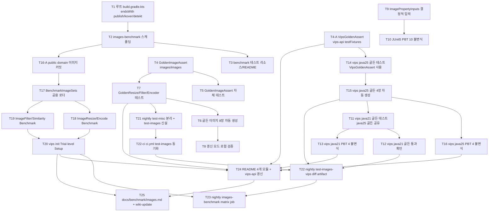

# Images Quality & Performance Testing — Implementation Plan

- **Plan ID**: 2026-04-29-images-quality-testing-plan
- **Spec**: [`2026-04-29-images-quality-testing-design.md`](../specs/2026-04-29-images-quality-testing-design.md)
- **Issue**: [#138 [utils/images] 품질 / 테스트 (JMH 벤치마크 / 골든 이미지 / PBT)](https://github.com/debop/bluetape4k-projects/issues/138)
- **브랜치**: `feat/images-quality-testing`
- **워크트리**: `.worktrees/images-quality-testing/`
- **작성일**: 2026-04-29 (revision 2)

---

## 1. 개요

본 플랜은 spec 의 9개 Phase 를 28개의 검증 가능한 Task 로 분해한다 (T4-A, T16-A, T22-ci 신설). 각 Task 는
복잡도(complexity) 라벨을 가지며, complexity 에 따라 단순 worker 또는 opus 라우팅을 선택한다.

**커밋 메시지**: 한국어 + prefix (`feat:`, `test:`, `chore:`, `docs:`, `fix:`, `refactor:`).

### 핵심 결정사항 (revision 2)

| # | 결정 | 영향 |
|---|------|------|
| 1 | java21/java25 골든 이미지 **공유** — `images-vips-api` testFixtures 의 `golden/vips/` 경로에서 양쪽이 로드 | java21 별도 골든 생성 불필요. T11(java21) 은 T15(java25 골든 생성) 완료 이후 진행 |
| 2 | 벤치마크 입력 이미지는 **public domain 커밋** — Wikimedia Commons CC0 + Unsplash 무료 라이선스 사용. `images-benchmark/src/main/resources/bench/` 에 합산 < 5MB 로 저장 | 합성 이미지 폐기. 실 데이터로 측정 신뢰도 향상 |
| 3 | vips `GoldenImageAssert` **공통화** — `images-vips-api/src/testFixtures/kotlin/.../VipsGoldenAssert.kt` 신설. vips 결과(ByteArray) → ImmutableImage 변환 후 픽셀 비교 (images-vips-api 가 이미 bluetape4k-images 에 의존) | java21/java25 공통 활용. images/images 의 GoldenImageAssert 는 scrimage ImmutableImage 전용으로 별도 유지 |
| 4 | java21 갱신 모드 **차단** — `@EnabledForJreRange(min = JRE.JAVA_25)` 어노테이션을 갱신 모드 관련 테스트(클래스/메서드)에 적용. java21 환경에서는 갱신 모드 테스트 자체가 skip 되어 골든 마스터 환경(java25) 무결성 보장 | java25 가 골든 마스터. java21 은 검증 모드만 수행 |
| 5 | nightly-tests.yml `test-misc` 에서 `bluetape4k-images` 분리 → `test-images` 신설 + ci.yml 동기화 (memory rule `feedback_ci_nightly_sync`) | golden-diff artifact 와 kover 보고를 단일 job 으로 격리 |

### 대상 모듈

| 모듈 | 변경 종류 |
|------|-----------|
| `images/images` | 골든 유틸 (scrimage ImmutableImage 전용) + 골든 8장 + JUnit5 PBT 10개 |
| `images/images-vips-api` (testFixtures) | `VipsGoldenAssert` 공통 유틸 + java21/java25 공유 골든 4장 |
| `images/images-vips-java21` | 공통 testFixtures 의존 + 골든 테스트 + PBT 4개 (CI 전용, 골든은 java25 산출물 공유) |
| `images/images-vips-java25` | 공통 testFixtures 의존 + 골든 테스트 + PBT 4개 (Mac+CI, 골든 마스터 환경) |
| `images/images-benchmark` (신규) | 모듈 스캐폴딩 + JMH 벤치마크 4종 + public domain 입력 이미지 |
| 루트 `build.gradle.kts` | publish/kover/detekt 제외 조건 `endsWith("-benchmark")` |
| `.github/workflows/nightly-tests.yml` | `test-misc` 에서 images 분리 + `test-images` 신설 + `test-images-vips` 보강 + `images-benchmark` 매트릭스 |
| `.github/workflows/ci.yml` | nightly 동기화 — `test-images` job 추가 |
| `docs/benchmark/images.md` | 신규 결과 문서 |

### 핵심 가드

| 가드 | 적용 위치 | 효과 |
|------|-----------|------|
| `@EnabledIfSystemProperty(named="vips.enabled", matches="true")` | 모든 vips 골든/PBT 클래스 최상단 | Mac 로컬에서 자동 skip |
| `@EnabledForJreRange(min = JRE.JAVA_25)` | 갱신 모드 관련 테스트 (모든 모듈) | java21 에서 갱신 모드 자체 skip → 골든 덮어쓰기 차단 |
| `System.getenv("CI") != null` 시 `IllegalStateException` | `GoldenImageAssert` / `VipsGoldenAssert` 갱신 모드 진입부 | CI 에서 골든 덮어쓰기 사고 차단 |
| `path.endsWith("-benchmark")` | 루트 `build.gradle.kts` publish/kover/detekt 제외 | 벤치마크 모듈 publish/검출 제외 |
| `--enable-native-access=ALL-UNNAMED` | java25 test/JavaExec + JMH `@Fork(jvmArgs=...)` | FFM API 동작 보장 (fork JVM 까지) |

> **용어 통일**: spec 의 "AssumptionViolatedException" 표현은 JUnit5 표준의 `org.opentest4j.TestAbortedException` 으로 통일한다. spec 갱신 시점 차이로 spec 본문에 잔존하는 표현은 본 plan 의 우선이다.

> **모든 Kotlin 파일 공통 규칙** (모든 .kt 신규 Task 의 완료 조건에 자동 포함):
> - 클래스/object: `companion object : KLoggingChannel()` 포함 (abstract class 는 `KLogging()` 도 허용)
> - `lsp_diagnostics` 통과 (import 오류 / `@Deprecated` 경고 0)
> - 모든 public 함수에 한국어 KDoc

> **Kluent matcher 규칙** (모든 테스트 Task 공통):
> - 비교는 `shouldBeEqualTo` / `shouldBeLessOrEqualTo` / `shouldBeGreaterOrEqualTo` / `shouldBeLessThan` / `shouldBeInRange` 사용
> - `(x == y).shouldBeTrue()` / `(x >= y).shouldBeTrue()` 등 boolean 변환 후 단순 true/false 비교 **금지** (실패 시 값 맥락 손실)

---

## 2. 의존성 그래프



### 병렬 실행 가능 그룹

| 그룹 | 동시 실행 가능 Task | 조건 |
|------|---------------------|------|
| G1 (Phase 1 후) | T4-A, T4, T9 | T1~T3 완료 후 |
| G2 (T4 후) | T5, T7 | 동시 시작 가능 (T6 은 T7 갱신 모드 실행으로 자동 생성) |
| G3 (도메인별 PBT) | (T4→T6→T7→T8 흐름), (T4-A→T14→T15→T16 흐름), (T9→T10 흐름) | 서로 독립 |
| G4 (java21 진입) | T11~T13 | T15 완료 후 (java25 골든 산출물 공유) |
| G5 (벤치마크 클래스) | T18, T19 | T17 완료 후 동시 작성 가능 |
| G6 (CI yaml) | **T21 → T22-ci → T22 → T23 직렬** | 단일 파일 `nightly-tests.yml` / `ci.yml` 동시 편집 시 충돌 → 직렬화 강제 |
| G7 (README) | T24 의 5개 모듈 README | 각 모듈 README.md/README.ko.md 동시 편집 |

---

## 3. Task 목록

### Phase 1 — 인프라

#### T1 — 루트 `build.gradle.kts` publish/kover/detekt 제외 조건 정밀 매칭
- **complexity**: medium
- **대상 파일**: `build.gradle.kts` (루트)
- **설명**: 기존 `path.contains(...)` 식 제외 조건 옆에 `path.endsWith("-benchmark")` 를 추가한다. 영향 받는 블록은 (a) `nmcp` publish (b) `kover` 합산 보고 (c) `publish` task 자동 등록 (d) `detekt` 집계. 적용 전에 `rg "endsWith\\(\"-benchmark\"\\)|contains\\(\"-benchmark\"\\)|detekt" build.gradle.kts` 로 현재 상태 실측. 이미 등록된 `data/exposed-r2dbc` 같은 기존 벤치마크 모듈명도 모두 `-benchmark` 로 끝나므로 안전.
  - `path.contains("-benchmark")` → `path.endsWith("-benchmark")` 로 정밀화 (우발 매칭 차단).
- **완료 조건**:
  - `./gradlew publishBluetape4kPublicationToBluetape4kRepository --dry-run` 출력에서 `bluetape4k-images-benchmark` task 가 등록되지 않는다.
  - `./gradlew tasks --all | rg images-benchmark` 결과에서 publish 관련 task 가 보이지 않는다.
  - `./gradlew detekt --dry-run | rg images-benchmark` 결과에서 detekt 집계 대상이 아님 확인.
  - kover 합산 결과에 `-benchmark` 모듈이 포함되지 않는다.
- **선행 Task**: 없음

#### T2 — `images/images-benchmark` 모듈 스캐폴딩
- **complexity**: high
- **대상 파일**:
  - `images/images-benchmark/build.gradle.kts` (신규)
  - `images/images-benchmark/src/main/kotlin/io/bluetape4k/images/benchmark/.gitkeep` (신규)
  - `images/images-benchmark/src/benchmark/kotlin/io/bluetape4k/images/benchmark/.gitkeep` (신규)
- **설명**: spec §3.6.2 패턴을 따른다.
  - `kotlin("plugin.allopen")` + `id(Plugins.kotlinx_benchmark)` 플러그인.
  - `allOpen { annotation("org.openjdk.jmh.annotations.State"); annotation("kotlinx.benchmark.State") }` — JMH `@State` 와 kotlinx-benchmark `@State` 두 가지 모두 등록.
  - `sourceSets { create("benchmark") }` + `compilations.getByName("benchmark").associateWith(compilations.getByName("main"))` 로 main 클래스 접근.
  - **`benchmarkImplementation` extendsFrom 정정**: spec 원본의 `testImplementation` 포함 여부는 r2dbc 패턴 비교 + 실측으로 결정한다. **TODO 마커**: `// TODO(T2): testImplementation extendsFrom 검토 — r2dbc 패턴과 비교 후 실측`. 1차 시도는 `testImplementation` 제외(JUnit/MockK 가 benchmark runtime 에 들어가지 않도록):
    ```kotlin
    configurations {
        named("benchmarkImplementation") {
            extendsFrom(
                configurations.implementation.get(),
                configurations.compileOnly.get(),
                // TODO(T2): testImplementation 추가 필요 여부 — r2dbc 패턴과 비교 + 실측
            )
        }
        named("benchmarkRuntimeOnly") {
            extendsFrom(configurations.runtimeOnly.get())
        }
    }
    ```
  - 의존성: `api(project(":bluetape4k-core"))`, `api(project(":bluetape4k-logging"))`, `implementation(project(":bluetape4k-images"))`, `implementation(project(":bluetape4k-images-vips-api"))`.
  - **vips 구현체 토글 (default = java25)**: Mac 로컬과 CI 모두 default 는 java25.
    ```kotlin
    val vipsImpl = project.findProperty("vips.impl") as? String ?: "java25"
    when (vipsImpl) {
        "java21" -> "benchmarkRuntimeOnly"(project(":bluetape4k-images-vips-java21"))
        else     -> "benchmarkRuntimeOnly"(project(":bluetape4k-images-vips-java25"))
    }
    ```
    CI 에서 java21 실행 필요 시 `-Pvips.impl=java21` 명시.
  - `benchmarkImplementation`: `Libs.kotlinx_benchmark_runtime`, `Libs.jmh_core`, `Libs.jmh_generator_annprocess`.
  - `benchmark { configurations.named("main") { warmups = 2; iterations = 3; iterationTime = 2; iterationTimeUnit = "s"; include(".*") }; targets.register("benchmark") { this as JvmBenchmarkTarget; jmhVersion = Versions.jmh } }`.
  - **JVM native access 처리**: Gradle `tasks.withType<JavaExec>().configureEach { jvmArgs(...) }` 만으로는 JMH fork JVM 에 옵션이 전달되지 않는다. `--enable-native-access=ALL-UNNAMED` 는 vips 관련 벤치마크 클래스의 `@Fork(jvmArgs = ["--enable-native-access=ALL-UNNAMED"])` 로 직접 부여한다 (T18/T19/T20). scrimage 전용 벤치마크에는 불필요.
  - `settings.gradle.kts` 자동 등록 메커니즘이 `images/` 하위를 스캔하므로 별도 `include` 불필요. 검증: `./gradlew :bluetape4k-images-benchmark:tasks` 가 인식.
- **완료 조건**:
  - `./gradlew :bluetape4k-images-benchmark:compileBenchmarkKotlin` 성공 (소스 없으므로 즉시 종료).
  - **`./gradlew :bluetape4k-images-benchmark:benchmarkBenchmark --dry-run` 컴파일 성공** — extendsFrom 결정의 최종 게이트(테스트 프레임워크 부재로 컴파일 실패 시 testImplementation 추가 후 재시도).
  - `./gradlew projects` 결과에 `bluetape4k-images-benchmark` 출현.
  - `./gradlew :bluetape4k-images-benchmark:dependencies --configuration benchmarkRuntimeOnly` 출력에 `bluetape4k-images-vips-java25` (default) 또는 `-java21` (`-Pvips.impl=java21`) 가 포함, `junit`/`mockk` 미포함 확인 (testImplementation 추가 시에는 JUnit 만 허용 가능 — 측정 영향 미미).
  - 모든 public 함수에 한국어 KDoc 포함.
- **선행 Task**: T1

#### T3 — benchmark 테스트 리소스 + README 골격
- **complexity**: low
- **대상 파일**:
  - `images/images-benchmark/src/test/resources/junit-platform.properties` (신규)
  - `images/images-benchmark/src/test/resources/logback-test.xml` (신규)
  - `images/images-benchmark/README.md` (신규 — 골격만, T24 에서 채움)
  - `images/images-benchmark/README.ko.md` (신규 — 골격만, T24 에서 채움)
- **설명**: 기존 모듈의 `src/test/resources/junit-platform.properties` + `logback-test.xml` 를 그대로 복제. 4K/HD/thumb 샘플 이미지는 T16-A 에서 별도 처리.
- **완료 조건**:
  - `images-benchmark` 디렉토리에서 `./gradlew :bluetape4k-images-benchmark:test` 가 (테스트 클래스 부재로) 즉시 성공.
  - README 두 파일에 spec 링크 + 언어 전환 링크 포함.
- **선행 Task**: T2

### Phase 2 — `GoldenImageAssert` 유틸리티

#### T4-A — `VipsGoldenAssert` 공통 유틸 (`images-vips-api` testFixtures) ⭐신규
- **complexity**: high
- **대상 파일**:
  - `images/images-vips-api/build.gradle.kts` (수정 — `testFixtures` 활성화 + 의존성 추가)
  - `images/images-vips-api/src/testFixtures/kotlin/io/bluetape4k/images/vips/testfixtures/VipsGoldenAssert.kt` (신규)
  - `images/images-vips-api/src/testFixtures/kotlin/io/bluetape4k/images/vips/testfixtures/VipsGoldenDiff.kt` (신규 — 채널 차분 PNG 생성 유틸)
- **설명**: java21/java25 양쪽이 공유할 vips 전용 골든 비교 유틸을 `images-vips-api` 의 testFixtures 에 배치한다.
  - **빌드 설정**: `java-test-fixtures` 플러그인 적용 + `testFixturesImplementation(project(":bluetape4k-images"))` (ImmutableImage 변환용) + `testFixturesImplementation(project(":bluetape4k-junit5"))`.
  - **함수 시그니처**: `fun assertSimilarToGolden(actualBytes: ByteArray, key: String, tolerance: Int = 3)` — vips 연산 결과(JPEG/PNG ByteArray) 를 받아 scrimage `ImmutableImage.loader().fromBytes(actualBytes)` 로 변환 후 픽셀 비교.
  - **검증 모드**: 리소스 `golden/vips/<key>` 에서 expected 로드 → 픽셀 비교 (per-channel `abs(actualByte - expectedByte) <= tolerance`) → 실패 시 `build/reports/golden-diffs/vips/<key>.diff.png` 생성 후 `org.junit.jupiter.api.Assertions.fail("...")`.
  - **갱신 모드**: `System.getProperty("bluetape4k.images.golden.update") == "true"` 로 진입. **반드시 먼저 `ensureNotCi()` 호출** → CI 에서 `IllegalStateException`. 갱신 후 `org.opentest4j.TestAbortedException` throw 하여 skipped 처리. **클래스 레벨에서 `@EnabledForJreRange(min = JRE.JAVA_25)` 사용을 강제** — 갱신 모드 호출자 책임으로 어노테이션 부여 (코드 레벨 방어 불필요, 문서/KDoc 에 명시).
  - **resolveGoldenWritePath**: 호출 모듈의 `user.dir` 이 아닌 **`images-vips-api/src/testFixtures/resources/golden/vips/<key>`** 로 고정한다. 갱신 모드에서 java25 테스트가 실행되더라도 골든은 testFixtures 에 저장되어 java21 도 그대로 로드. 경로 산출은 `Paths.get(System.getProperty("user.dir"), "..", "images-vips-api", "src", "testFixtures", "resources", "golden", "vips", key).normalize()`.
  - **`VipsGoldenDiff`**: `fun createDiff(actual: ImmutableImage, expected: ImmutableImage, target: Path)` — RGB 채널별 절대 차분을 8-bit 강도로 매핑한 PNG 출력.
  - **공통 규칙**: `companion object : KLoggingChannel()` 포함, `lsp_diagnostics` 통과, public 함수 한국어 KDoc.
  - 함수 인자가 `ByteArray + String + Int` 로 동종 타입 없음 → 현 시그니처 유지 OK.
  - **KDoc 명시 사항**: "갱신 모드(`update=true`) 사용 시 호출자 테스트 클래스(또는 메서드)에 `@EnabledForJreRange(min = JRE.JAVA_25)` 어노테이션 부여 필수. java21 환경에서 갱신 시 골든 마스터 환경 무결성이 깨진다."
- **완료 조건**:
  - 컴파일 성공 (`./gradlew :bluetape4k-images-vips-api:compileTestFixturesKotlin`).
  - `./gradlew :bluetape4k-images-vips-api:dependencies --configuration testFixturesRuntimeClasspath` 에 `bluetape4k-images` 포함 확인.
  - 모든 public 함수에 한국어 KDoc 포함 (KDoc 에 java25 갱신 모드 어노테이션 의무 명시).
  - `lsp_diagnostics` 통과 (import / `@Deprecated` 0).
  - `companion object : KLoggingChannel()` 포함.
- **선행 Task**: 없음 (T1~T3 와 병렬 가능)

#### T4 — `GoldenImageAssert` 구현 (`images/images`, scrimage 전용)
- **complexity**: high
- **대상 파일**:
  - `images/images/src/test/kotlin/io/bluetape4k/images/golden/GoldenImageAssert.kt` (신규)
  - `images/images/src/test/kotlin/io/bluetape4k/images/golden/GoldenImageDiff.kt` (신규 — 채널 차분 PNG 생성 유틸)
- **설명**: spec §3.2.1 의 동작 규칙을 구현. **scrimage `ImmutableImage` 전용** — vips 와는 별개 (vips 는 T4-A `VipsGoldenAssert`).
  - 함수 시그니처: `fun assertSimilarToGolden(actual: ImmutableImage, key: String, tolerance: Int = 3)`.
  - 검증 모드: 리소스 `golden/<key>` 에서 expected 로드 → 픽셀 비교 → 실패 시 `build/reports/golden-diffs/<key>.diff.png` 생성 후 `Assertions.fail("...")`.
  - 갱신 모드: `System.getProperty("bluetape4k.images.golden.update") == "true"` → `ensureNotCi()` 우선 → 갱신 후 `org.opentest4j.TestAbortedException` throw.
  - `resolveGoldenWritePath(key)`: `Paths.get(System.getProperty("user.dir"), "src", "test", "resources", "golden", key)`.
  - **공통 규칙**: `companion object : KLoggingChannel()`, `lsp_diagnostics` 통과, 한국어 KDoc.
  - `GoldenImageDiff`: T4-A 와 동일 로직이지만 scrimage `ImmutableImage` 직접 입력.
  - **KDoc 명시 사항**: T4-A 와 동일 — 갱신 모드 사용자는 호출 측 테스트에 `@EnabledForJreRange(min = JRE.JAVA_25)` 부여 책임.
- **완료 조건**:
  - 파일 컴파일 성공 (`./gradlew :bluetape4k-images:compileTestKotlin`).
  - 모든 public API 에 한국어 KDoc.
  - `lsp_diagnostics` 통과.
  - `companion object : KLoggingChannel()` 포함.
- **선행 Task**: 없음 (T1~T3, T4-A 와 병렬 가능)

#### T5 — `GoldenImageAssert` 자체 단위 테스트
- **complexity**: medium
- **대상 파일**: `images/images/src/test/kotlin/io/bluetape4k/images/golden/GoldenImageAssertTest.kt` (신규)
- **설명**: assert 자체의 동작 검증.
  - 동일 이미지 비교 → assertion 통과.
  - tolerance 초과 차이 → `AssertionError` throw + diff PNG 생성 확인.
  - tolerance 이내 차이 → 통과.
  - CI 가드: `withEnvironmentVariable("CI", "1")` 모킹 + 갱신 모드 → `IllegalStateException`.
  - `AbstractImageTest` 상속, `companion object : KLoggingChannel()`, Kluent matcher 사용.
- **완료 조건**:
  - `./gradlew :bluetape4k-images:test --tests "io.bluetape4k.images.golden.GoldenImageAssertTest"` 통과.
  - 모든 public 함수에 한국어 KDoc 포함.
  - `lsp_diagnostics` 통과 / `companion object : KLoggingChannel()` 포함.
- **선행 Task**: T4

### Phase 3 — `images/images` 골든 이미지 테스트

> **순서 변경**: spec 원본의 T6→T7 순서는 의존 방향이 어색했다 (T7 작성에 T6 골든 필요). 실제 작업 흐름은 T7 테스트 작성 → 갱신 모드(`-Dbluetape4k.images.golden.update=true`) 1회 실행 → 골든이 자동 생성되어 T6 산출물 충족 → 커밋. 본 plan 은 T7 을 먼저, T6 을 산출물 검증 단계로 재정의한다.

#### T7 — `GoldenResizeTest` / `GoldenFilterTest` / `GoldenEncoderTest` 작성
- **complexity**: medium
- **대상 파일**:
  - `images/images/src/test/kotlin/io/bluetape4k/images/golden/GoldenResizeTest.kt`
  - `images/images/src/test/kotlin/io/bluetape4k/images/golden/GoldenFilterTest.kt`
  - `images/images/src/test/kotlin/io/bluetape4k/images/golden/GoldenEncoderTest.kt`
- **설명**:
  - 각 클래스는 `AbstractImageTest` 상속 + `companion object : KLoggingChannel()` + `@Tag("golden")`.
  - `GoldenResizeTest`: 3가지 리사이즈 케이스 → `assertSimilarToGolden(actual, "resize/...", tolerance=2)`.
  - `GoldenFilterTest`: 3가지 필터(blur/grayscale/sepia) → `tolerance=3`.
  - `GoldenEncoderTest`: JPEG q=80 round-trip (`tolerance=5`) + PNG RGBA round-trip (`tolerance=0`).
  - **갱신 모드 차단**: 갱신 시점 회귀 (java21 에서 갱신 → 골든 손상) 방지를 위해 **클래스 레벨에 `@EnabledForJreRange(min = JRE.JAVA_25)`** 부여. java21 에서는 검증 모드 이외 갱신 모드 실행 자체가 skip.
  - 입력 이미지는 `images/images/src/test/resources/images/cafe.jpg`, `landscape.jpg`, `splitter/aqua.jpg`, `filters/debop.jpg` (이미 존재).
- **완료 조건**:
  - 갱신 모드 실행 (java25): `./gradlew :bluetape4k-images:test --tests "io.bluetape4k.images.golden.*" -Dbluetape4k.images.golden.update=true` 으로 T6 의 8장 골든이 `src/test/resources/golden/` 에 자동 생성 → T6 가 자동 충족.
  - 검증 모드 (`./gradlew :bluetape4k-images:test --tests "io.bluetape4k.images.golden.*"`) 통과.
  - 모든 public 함수에 한국어 KDoc 포함.
  - `companion object : KLoggingChannel()` 포함 / `lsp_diagnostics` 통과.
  - Kluent matcher 사용 (`shouldBeEqualTo` 등) — `(x==y).shouldBeTrue()` 0건.
- **선행 Task**: T4

#### T6 — 골든 이미지 8장 산출물 검증 + 커밋
- **complexity**: low
- **대상 파일**:
  - `images/images/src/test/resources/golden/resize/landscape-512x288.png`
  - `images/images/src/test/resources/golden/resize/cafe-thumbnail-128x128.png`
  - `images/images/src/test/resources/golden/resize/aqua-half.png`
  - `images/images/src/test/resources/golden/filters/debop-blur.png`
  - `images/images/src/test/resources/golden/filters/debop-grayscale.png`
  - `images/images/src/test/resources/golden/filters/debop-sepia.png`
  - `images/images/src/test/resources/golden/encoders/cafe-jpeg-q80.jpg`
  - `images/images/src/test/resources/golden/encoders/landscape-png-rgba.png`
- **설명**: T7 의 갱신 모드 실행으로 자동 생성된 8장을 검증 후 커밋.
- **완료 조건**:
  - 8개 파일 모두 git add 됨.
  - `file <path>` 로 PNG/JPEG 헤더 확인.
  - 합산 크기 < 5MB (저장소 비대화 방지).
- **선행 Task**: T7

#### T8 — 갱신 모드 로컬 검증
- **complexity**: low
- **대상 파일**: 없음 (검증 단계)
- **설명**: 로컬에서 `-Dbluetape4k.images.golden.update=true` 실행 → skipped + 파일 갱신 확인. CI 환경 시뮬레이션 `CI=1 ... -Dbluetape4k.images.golden.update=true` → `IllegalStateException` 으로 빌드 실패 확인. java21 시뮬레이션(JAVA_HOME 변경 후) → `@EnabledForJreRange` 로 skip 확인.
- **완료 조건**:
  - 로컬 갱신 (java25) → `TestAbortedException` (skipped) + 파일 갱신 확인.
  - CI=1 시뮬레이션 → `IllegalStateException` 발생 + 빌드 실패.
  - java21 시뮬레이션 → 갱신 모드 테스트 자체 skip (`@EnabledForJreRange` 동작 확인).
- **선행 Task**: T6

### Phase 4 — `images/images` JUnit5 PBT

#### T9 — `ImagePropertyInputs` 결정적 입력 생성기
- **complexity**: medium
- **대상 파일**: `images/images/src/test/kotlin/io/bluetape4k/images/property/ImagePropertyInputs.kt` (신규)
- **설명**: spec §3.3.1 그대로 구현.
  - `Random(SEED=42L)` 으로 결정적.
  - `resizeDimensions()`: edge 4종 (1×1, 2048×1, 1×2048, 64×640) + random 16개 = 20개.
  - `edgeContentImages()`: 단색 R/B/W + 체커보드 = 4종, `solidColorImage(w,h,Color)` / `checkerboardImage(w,h)` 헬퍼 포함.
  - `roundTripQualities()`: JPEG quality `[60, 80, 95]`.
  - `rotationAngles()`: `[90, 180, 270]`.
  - **공통 규칙**: object 또는 class 라면 `companion object : KLoggingChannel()` 부여, `lsp_diagnostics` 통과, 한국어 KDoc.
- **완료 조건**:
  - 컴파일 성공.
  - 각 메서드 호출이 `List<Arguments>` 결정적 결과 반환 (시드 고정 검증 단위 테스트 1개 추가).
  - 모든 public 함수에 한국어 KDoc 포함.
  - `companion object : KLoggingChannel()` 포함 / `lsp_diagnostics` 통과.
- **선행 Task**: 없음 (T4 와 병렬)

#### T10 — JUnit5 PBT 10 불변식 구현
- **complexity**: high
- **대상 파일**: `images/images/src/test/kotlin/io/bluetape4k/images/property/ImagePropertyTest.kt` (신규)
- **설명**: spec §3.3.2 의 10개 불변식 구현. `@ParameterizedTest @MethodSource("io.bluetape4k.images.property.ImagePropertyInputs#resizeDimensions")` 등으로 입력 주입.
  - 1: resize 차원 보존
  - 2: PNG round-trip 무손실 (tolerance=0)
  - 3: pHash 동일 distance=0
  - 4: pHash 50% 축소 distance ≤ 10 (Zauner 2010 근거)
  - 5: 필터 적용 후 크기 보존
  - 6: 90도 회전 후 width↔height 교환
  - 7: JPEG q=80 round-trip 평균 채널 delta < 5
  - 8: 크롭 후 크기 검증
  - 9: flipX/flipY 후 dimensions 보존
  - 10: RGB 채널 분리/재합성 후 픽셀 동일
  - **Kluent matcher 필수**: `shouldBeEqualTo`, `shouldBeLessOrEqualTo`, `shouldBeLessThan`, `shouldBeGreaterOrEqualTo`. `(x==y).shouldBeTrue()` 금지.
  - 실패 분기: `org.junit.jupiter.api.Assertions.fail("...")` (AssertionError). `error()` 금지.
  - `AbstractImageTest` 상속, `companion object : KLoggingChannel()`, `@Tag("pbt")`.
- **완료 조건**:
  - 10 테스트 메서드 모두 PASS (각 메서드는 edge case + 무작위 입력 모두 통과).
  - `./gradlew :bluetape4k-images:test --tests "io.bluetape4k.images.property.ImagePropertyTest"` 통과 + duration 보고.
  - 모든 public 함수에 한국어 KDoc 포함.
  - `companion object : KLoggingChannel()` 포함 / `lsp_diagnostics` 통과.
  - Kluent 비교 matcher 사용 — `(x==y).shouldBeTrue()` 0건.
- **선행 Task**: T9

### Phase 5 — `images-vips-java25` 골든 + PBT (마스터 환경)

> **순서 재편성**: java25 (Mac+CI 양쪽) 가 골든 마스터 환경. T14→T15 (골든 자동 생성) 가 끝나야 java21(T11) 이 동일 골든을 공유 가능.

#### T14 — vips java25 골든 테스트 (`VipsGoldenAssert` 사용)
- **complexity**: medium
- **대상 파일**:
  - `images/images-vips-java25/src/test/kotlin/io/bluetape4k/images/vips/java25/golden/VipsFfmGoldenTest.kt`
  - `images/images-vips-java25/build.gradle.kts` (수정 — `testImplementation(testFixtures(project(":bluetape4k-images-vips-api")))` 추가)
- **설명**:
  - 클래스 최상단에 `@EnabledIfSystemProperty(named="vips.enabled", matches="true")` + **`@EnabledForJreRange(min = JRE.JAVA_25)`** (갱신 모드 호스트, java25 강제).
  - 4가지 테스트 메서드 — vips ffm 연산 결과 ByteArray 를 `VipsGoldenAssert.assertSimilarToGolden(actualBytes, "thumbnail/...", ...)` 으로 비교.
  - 입력은 `testFixtures(project(":bluetape4k-images-vips-api"))` 의 공용 리소스 활용.
  - 기존 `images-vips-java25/build.gradle.kts` 가 이미 `--enable-native-access=ALL-UNNAMED` + `DYLD_LIBRARY_PATH=/opt/homebrew/lib` 처리하므로 빌드 설정 변경은 testFixtures 의존만 추가.
  - `@Tag("golden")` 부여.
- **완료 조건**:
  - 컴파일 + KDoc.
  - 갱신 모드 진입 가능 (실제 골든 생성은 T15).
  - 모든 public 함수에 한국어 KDoc 포함.
  - `companion object : KLoggingChannel()` 포함 / `lsp_diagnostics` 통과.
- **선행 Task**: T4-A

#### T15 — vips java25 골든 4장 자동 생성 + 커밋
- **complexity**: medium
- **대상 파일**:
  - `images/images-vips-api/src/testFixtures/resources/golden/vips/thumbnail/landscape-256.png`
  - `images/images-vips-api/src/testFixtures/resources/golden/vips/format/cafe-png-from-jpeg.png`
  - `images/images-vips-api/src/testFixtures/resources/golden/vips/format/cafe-jpeg-from-png.jpg`
  - `images/images-vips-api/src/testFixtures/resources/golden/vips/resize/aqua-fit-512.png`
- **설명**: T14 를 갱신 모드로 1회 실행하여 골든을 `images-vips-api/src/testFixtures/resources/golden/vips/` 에 자동 생성.
  - Mac 로컬 (`brew install vips`) 환경(java25 JDK)에서 실행: `./gradlew :bluetape4k-images-vips-java25:test -Dvips.enabled=true -Dbluetape4k.images.golden.update=true --tests "io.bluetape4k.images.vips.java25.golden.VipsFfmGoldenTest"`
  - **worktree user.dir 검증**: 갱신 모드 실행 전 테스트 setup 또는 직접 실행 로그에 `System.getProperty("user.dir")` 출력 → `.worktrees/images-quality-testing/images/images-vips-java25` 경로 확인. 잘못된 경로에서 갱신 시 testFixtures 가 아닌 별도 위치에 생성되어 java21 이 골든을 못 찾음.
  - 검증 모드 통과 확인 후 커밋.
- **완료 조건**:
  - 4장 PNG/JPG 커밋 + 합산 < 3MB.
  - `System.getProperty("user.dir")` 로그 확인 — `images-vips-java25` 경로에서 실행됨.
  - Mac 로컬 (`brew install vips` + `-Dvips.enabled=true`) + CI Linux 모두 검증 모드 통과.
- **선행 Task**: T14

#### T16 — vips java25 PBT 4 불변식
- **complexity**: medium
- **대상 파일**: `images/images-vips-java25/src/test/kotlin/io/bluetape4k/images/vips/java25/property/VipsFfmPropertyTest.kt`
- **설명**: spec §3.4.3 의 4개 불변식. java25 ffm 구현체 호출.
  - 1: thumbnail 차원 상한.
  - 2: 포맷 변환 차원 보존.
  - 3: **`use {}` 닫힘 검증** — spy 방식 폐기. JUnit5 `assertDoesNotThrow { use { ... } }` 로 자원 사용 후 예외 없이 종료되는지 검증. 보강: 자원 누수 가능 경로(즉, `use {}` 블록 외부에서 직접 `acquire()`/`release()` 호출) 가 등장하면 컴파일 오류로 막는 설계 가이드를 모듈 README 의 "안전한 자원 사용" 섹션에 명시 (T24 일감).
  - 4: 빈 `ByteArray()` / 손상된 바이트 입력 시 `IllegalArgumentException` (`assertThrows<IllegalArgumentException>`).
  - `@EnabledIfSystemProperty(named="vips.enabled", matches="true")` 가드.
  - `AbstractImageTest` 상속, `companion object : KLoggingChannel()`, `@Tag("pbt")`.
- **완료 조건**:
  - `./gradlew :bluetape4k-images-vips-java25:test -Dvips.enabled=true --tests "io.bluetape4k.images.vips.java25.property.*"` 통과 (Mac/Linux 양쪽).
  - 모든 public 함수에 한국어 KDoc 포함.
  - `companion object : KLoggingChannel()` 포함 / `lsp_diagnostics` 통과.
  - Kluent 비교 matcher 사용.
- **선행 Task**: T14

### Phase 6 — `images-vips-java21` 골든 + PBT (java25 골든 공유)

#### T11 — vips java21 골든 테스트 (java25 골든 공유)
- **complexity**: medium
- **대상 파일**:
  - `images/images-vips-java21/src/test/kotlin/io/bluetape4k/images/vips/java21/golden/VipsJava21GoldenTest.kt` (신규)
  - `images/images-vips-java21/build.gradle.kts` (수정 — `testImplementation(testFixtures(project(":bluetape4k-images-vips-api")))` 추가)
- **설명**: java25 가 마스터 환경에서 생성한 골든을 testFixtures 공통 경로에서 로드.
  - 클래스 최상단에 `@EnabledIfSystemProperty(named="vips.enabled", matches="true")`.
  - **갱신 모드 차단** — 본 클래스에는 `@EnabledForJreRange` 적용하지 **않음**(java21 환경에서 검증 모드는 항상 실행). 단, 만약 갱신 호출 메서드를 두는 경우 해당 메서드에 `@EnabledForJreRange(min = JRE.JAVA_25)` 부여 → java21 에서 갱신 모드 자체 skip.
  - 4가지 테스트 메서드 — JVips JNI 연산 결과 ByteArray 를 `VipsGoldenAssert.assertSimilarToGolden(actualBytes, "thumbnail/...", ...)` 으로 비교.
  - **별도 골든 생성 없음** — T15 에서 생성된 `images-vips-api/src/testFixtures/resources/golden/vips/` 를 그대로 사용.
  - 입력은 `testFixtures(project(":bluetape4k-images-vips-api"))` 의 공용 리소스 활용.
  - `@Tag("golden")` 부여.
- **완료 조건**:
  - 컴파일 성공.
  - testFixtures 의존으로 골든이 classpath 에서 로드됨 확인.
  - **갱신 모드 테스트가 java21 환경에서 `@EnabledForJreRange(min=JAVA_25)` 로 skip 되는지 확인** (해당 메서드가 있을 경우).
  - 모든 public 함수에 한국어 KDoc 포함.
  - `companion object : KLoggingChannel()` 포함 / `lsp_diagnostics` 통과.
- **선행 Task**: T4-A, T15

#### T12 — vips java21 골든 통과 확인 (CI Linux)
- **complexity**: low
- **대상 파일**: 없음 (검증 단계)
- **설명**: CI Linux 또는 libvips 설치 환경에서 `./gradlew :bluetape4k-images-vips-java21:test -Dvips.enabled=true --tests "io.bluetape4k.images.vips.java21.golden.*"` 통과 확인.
  - 골든 차이 발생 시 tolerance 조정으로 흡수 (java21 JVips 와 java25 ffm 의 vips 라이브러리 결과는 동일 libvips 호출이므로 픽셀 동일이어야 함). 차이가 크면 `tolerance=5` 까지 허용.
  - Mac 로컬 (vips.enabled=false) 시 자동 skip.
- **완료 조건**:
  - CI Linux 또는 Linux 컨테이너에서 `-Dvips.enabled=true` 통과.
  - Mac 로컬 자동 skip.
- **선행 Task**: T11

#### T13 — vips java21 PBT 4 불변식
- **complexity**: medium
- **대상 파일**: `images/images-vips-java21/src/test/kotlin/io/bluetape4k/images/vips/java21/property/VipsJava21PropertyTest.kt`
- **설명**: T16 과 동일한 4 불변식. JVips JNI 구현체 호출.
  - 1: thumbnail 차원 상한.
  - 2: 포맷 변환 차원 보존.
  - 3: `use {}` 닫힘 검증 — JUnit5 `assertDoesNotThrow { use { ... } }` (T16 와 동일 정책, spy 폐기).
  - 4: 빈/손상된 바이트 입력 시 `IllegalArgumentException`.
  - `@EnabledIfSystemProperty(named="vips.enabled", matches="true")` 가드.
  - `AbstractImageTest` 상속, `companion object : KLoggingChannel()`, `@Tag("pbt")`.
- **완료 조건**:
  - `./gradlew :bluetape4k-images-vips-java21:test -Dvips.enabled=true --tests "io.bluetape4k.images.vips.java21.property.*"` 통과 (Linux only).
  - 모든 public 함수에 한국어 KDoc 포함.
  - `companion object : KLoggingChannel()` 포함 / `lsp_diagnostics` 통과.
  - Kluent 비교 matcher 사용.
- **선행 Task**: T11

### Phase 7 — `images-benchmark` JMH

#### T16-A — Public domain 벤치마크 입력 이미지 커밋 ⭐신규
- **complexity**: low
- **대상 파일**:
  - `images/images-benchmark/src/main/resources/bench/photo-4k.jpg` (3840×2160 고해상도 사진)
  - `images/images-benchmark/src/main/resources/bench/document.png` (텍스트 문서 스캔)
  - `images/images-benchmark/src/main/resources/bench/thumbnail.jpg` (256×256 썸네일)
- **설명**: spec §3.6.1 의 합성 이미지 정책을 폐기하고 public domain 실 이미지 3장을 커밋한다.
  - **선택 기준**: 다양한 entropy (사진/문서/단색), 총 합산 크기 < 5MB.
  - **출처**:
    - `photo-4k.jpg` — Wikimedia Commons CC0 또는 Unsplash 무료 라이선스 (예: 풍경 사진).
    - `document.png` — Wikimedia Commons CC0 (예: 19세기 문서 스캔).
    - `thumbnail.jpg` — 위 사진의 256×256 다운샘플 또는 Unsplash 무료.
  - **다운로드 URL + sha256 명시 (실 다운로드는 구현 시점)**: 본 Task 의 명세는 후보 이미지의 출처 URL 과 라이선스를 PR 본문에 명시하고, 다운로드 후 sha256 을 계산하여 README.md 부록(`images-benchmark/README.md` 의 "License & Attribution" 섹션) 에 등재한다.
  - **위치 정정**: spec 의 `src/test/resources/bench/` 가 아닌 `src/main/resources/bench/` — 표준 sourceSet 에 두어 IDE 인덱싱 + benchmark sourceSet 의 main 연관(associate) 으로 자동 접근 가능 (T2 의 `compilations.getByName("benchmark").associateWith(compilations.getByName("main"))` 활용).
- **완료 조건**:
  - 3개 파일 커밋 + 합산 < 5MB.
  - `file <path>` 로 PNG/JPEG 헤더 확인.
  - `images-benchmark/README.md` 부록에 출처 URL + 라이선스 + sha256 등재.
- **선행 Task**: T2

#### T17 — `BenchmarkImageSets` 공용 로더
- **complexity**: medium
- **대상 파일**: `images/images-benchmark/src/main/kotlin/io/bluetape4k/images/benchmark/BenchmarkImageSets.kt`
- **설명**: 표준 `main/` sourceSet 에 위치 (spec §3.6.1 high-priority 리뷰 반영). enum `BenchmarkImageSize { THUMB, HD, FOUR_K }` 와 `loadJpegBytes(size)`, `loadScrimage(size)` 헬퍼. classpath 리소스로 로드 (`Thread.currentThread().contextClassLoader.getResourceAsStream("bench/...")`).
  - 로드 키: `THUMB → bench/thumbnail.jpg`, `HD → bench/document.png` (HD 매핑은 문서/HD 통합 — document 이미지가 1920×1080 미만이면 photo-4k 의 1920×1080 다운샘플로 교체 검토), `FOUR_K → bench/photo-4k.jpg`. (실측 후 README 의 입력 매트릭스 표 정정.)
  - `companion object : KLoggingChannel()`.
- **완료 조건**:
  - 컴파일 성공.
  - 3개 enum 모두 non-null `ByteArray` 반환 (단위 테스트 1개로 검증).
  - 모든 public 함수에 한국어 KDoc 포함.
  - `companion object : KLoggingChannel()` 포함 / `lsp_diagnostics` 통과.
  - Kluent 비교 matcher 사용 (단위 테스트).
- **선행 Task**: T16-A

#### T18 — `ImageResizeBenchmark` + `ImageEncodeBenchmark`
- **complexity**: high
- **대상 파일**:
  - `images/images-benchmark/src/benchmark/kotlin/io/bluetape4k/images/benchmark/ImageResizeBenchmark.kt`
  - `images/images-benchmark/src/benchmark/kotlin/io/bluetape4k/images/benchmark/ImageEncodeBenchmark.kt`
- **설명**: spec §3.6.3 표.
  - `ImageResizeBenchmark`: scrimage `scaleTo(1024,768)` vs vips `thumbnail(1024)`. `Mode.AverageTime` + `OutputTimeUnit.MICROSECONDS`. `@Param(["thumb","hd","4k"])`. `@State(Scope.Benchmark)`.
  - `ImageEncodeBenchmark`: scrimage `bytes(JpegWriter().withCompression(80))` vs vips `writeJpeg(quality=80)`. PNG 도 별도 메서드로.
  - **JMH fork 옵션**: vips 호출 메서드가 있으므로 클래스에 `@Fork(value = 1, jvmArgs = ["--enable-native-access=ALL-UNNAMED"])` 부여 (Gradle JavaExec jvmArgs 는 fork JVM 까지 전달되지 않으므로 필수). scrimage-only 메서드만 있는 벤치마크에는 불필요하지만 본 두 클래스는 vips 포함이므로 부여.
  - **`@Fork(jvmArgs=...)` 동작 검증 필수**: kotlinx-benchmark 0.4.15 에서 JMH `@Fork(jvmArgs = [...])` 가 fork JVM 으로 전달되는지 확인 (구현 시점 1회 실측). 동작 안 할 경우 대안 우선순위:
    1. benchmark { } 블록의 `configurations { named("main") { jvmArgs(...) } }` 시도.
    2. 위도 실패 시 vips-only benchmark 는 `--enable-native-access` 가 필요 없는 연산만 포함 (FFM 호출 우회 — JVips JNI 만 사용하는 java21 으로 대체).
  - 모든 클래스에 `companion object : KLoggingChannel()`.
  - `kotlinx.benchmark.State` annotation 사용 (allOpen 적용 대상).
  - 입력은 `BenchmarkImageSets` 통해 로드.
- **완료 조건**:
  - `./gradlew :bluetape4k-images-benchmark:benchmarkBenchmark --dry-run` 가 두 클래스 인식.
  - 로컬 (Mac, java25 vips) 에서 `./gradlew :bluetape4k-images-benchmark:benchmarkBenchmark -Pvips.impl=java25` 가 측정 결과 출력 (>1 결과 행).
  - **`@Fork(jvmArgs=...)` 가 fork JVM 으로 전달됨을 stdout 로그 또는 JMH iteration log 로 확인** (실패 시 대안 적용).
  - 모든 public 함수에 한국어 KDoc 포함.
  - `companion object : KLoggingChannel()` 포함 / `lsp_diagnostics` 통과.
- **선행 Task**: T17

#### T19 — `ImageFilterBenchmark` + `ImageSimilarityBenchmark`
- **complexity**: high
- **대상 파일**:
  - `images/images-benchmark/src/benchmark/kotlin/io/bluetape4k/images/benchmark/ImageFilterBenchmark.kt`
  - `images/images-benchmark/src/benchmark/kotlin/io/bluetape4k/images/benchmark/ImageSimilarityBenchmark.kt`
- **설명**: T18 과 동일 패턴.
  - `ImageFilterBenchmark`: scrimage `BlurFilter` vs vips `gaussblur(sigma=2.0)`.
  - `ImageSimilarityBenchmark`: scrimage `phashOf()` vs vips 기반 pHash. 두 입력 이미지의 phashDistance 도 측정.
  - vips 호출 포함 → `@Fork(value = 1, jvmArgs = ["--enable-native-access=ALL-UNNAMED"])` 동일 부여.
  - **`@Fork(jvmArgs=...)` 동작 검증** — T18 과 동일 정책. 한 번만 검증해도 무방하나 양 클래스에서 jmh log 확인.
- **완료 조건**: T18 과 동일.
- **선행 Task**: T17

#### T20 — vips init Trial-level Setup + 멱등성 검증
- **complexity**: medium
- **대상 파일**:
  - `images/images-benchmark/src/benchmark/kotlin/io/bluetape4k/images/benchmark/VipsBenchmarkState.kt` (신규 — 공용 `@State` 추출)
  - `images/images-benchmark/src/test/kotlin/io/bluetape4k/images/benchmark/VipsBenchmarkStateTest.kt` (신규 — 멱등성 단위 검증)
- **설명**: spec §3.6.4 — `@Setup(Level.Trial)` 에서만 vips 초기화.
  - **vips init API 명 확인**: spec 의 `VipsInitializer.ensureInitialized()` 표현은 placeholder 였음. **실제 API 이름은 구현 시점 `images-vips-api` / `images-vips-java25` 코드 인스펙션 후 확정**한다. 후보:
    - `JVipsRuntime.init()` (java21)
    - `FfmVipsRuntime.init()` (java25)
    - `VipsRuntime.init()` (vips-api 공통 인터페이스)
  - 실 함수명을 적용하고 vips 토글(`-Pvips.impl=java21|java25`) 별로 분기.
  - `open class VipsBenchmarkState { @Setup(Level.Trial) fun init() { runtime.init() } }`. T18/T19 의 vips 포함 벤치마크 클래스가 `VipsBenchmarkState` 상속.
  - **멱등성 검증 (spy/log 의존 폐기)**: 단위 테스트 `@BeforeAll` 또는 `@Test` 에서 `assertDoesNotThrow { runtime.init(); runtime.init() }` 로 검증. setup 로그 출력 확인이 아닌 명시적 단위 테스트.
  - 클래스에 `@Fork(value = 1, jvmArgs = ["--enable-native-access=ALL-UNNAMED"])` 부여 (서브클래스가 상속).
- **완료 조건**:
  - 단위 테스트 `assertDoesNotThrow` 통과 (멱등성 명시 검증).
  - **실제 API 이름 확인 후 적용** — `VipsRuntime.init()` 또는 동등한 실 API 명.
  - 4종 벤치마크 모두 `-Pvips.impl=java25` 로 1회 이상 성공 실행.
  - `build/reports/benchmarks/...` 산출물 확인.
  - 모든 public 함수에 한국어 KDoc 포함.
  - `companion object : KLoggingChannel()` 포함 / `lsp_diagnostics` 통과.
- **선행 Task**: T18, T19

### Phase 8 — CI 연동 (`nightly-tests.yml` + `ci.yml`) — **직렬화 강제**

> **직렬화 사유 (G6)**: T21/T22-ci/T22/T23 모두 단일 파일(`nightly-tests.yml` 또는 `ci.yml`)을 편집하므로 동시 편집 시 머지 충돌 발생. 병렬 실행 가이드(G6) 에서 명시적으로 직렬 실행을 강제한다.

#### T21 — `nightly-tests.yml` `test-misc` 분리 + `test-images` job 신설
- **complexity**: medium
- **대상 파일**: `.github/workflows/nightly-tests.yml`
- **설명**: ⚠️ **단일 파일 편집 충돌 방지: T21 커밋 완료 후 T22-ci 시작, T22-ci 커밋 완료 후 T22 시작, T22 커밋 완료 후 T23 시작.**
  - **Step 1 — `test-misc` 에서 images 분리**:
    - 기존 `test-misc` job 의 gradle command 에서 `:bluetape4k-images:test`, `:bluetape4k-images:koverXmlReport` (있다면) 항목 제거.
  - **Step 2 — `test-images` job 신설**: spec §3.8.1 패턴 + golden-diff artifact + kover.
    ```yaml
    test-images:
      needs: [build]
      runs-on: ubuntu-latest
      steps:
        - uses: actions/checkout@v4
        - uses: actions/setup-java@v4
          with:
            distribution: temurin
            java-version: 21
        - name: Run images tests
          run: ./gradlew :bluetape4k-images:test :bluetape4k-images:koverXmlReport --no-daemon
        - name: Upload golden diff reports
          if: failure()
          uses: actions/upload-artifact@v4
          with:
            name: golden-diffs-images
            path: images/images/build/reports/golden-diffs/**
            retention-days: 7
        - name: Upload kover report
          if: always()
          uses: actions/upload-artifact@v4
          with:
            name: kover-images
            path: images/images/build/reports/kover/**
            retention-days: 14
    ```
  - **@Slow / @Tag 필터링**: 골든/PBT 가 nightly 에서만 실행되도록 하려면 `images/images/src/test/resources/junit-platform.properties` 의 `junit.jupiter.extensions.autodetection.enabled=true` 확인. 골든/PBT 테스트는 `@Tag("golden")`, `@Tag("pbt")` 부여(T7/T10/T11/T13/T14/T16 의 클래스 레벨에 명시됨). nightly 에서 별도 task 로 실행하려면 Gradle test filter 또는 `useJUnitPlatform { includeTags("golden", "pbt") }` 빌드 설정 추가 검토 (선택 사항 — 1차에서는 모든 테스트 실행).
- **완료 조건**:
  - YAML 문법 검증 (`yq '.jobs."test-images"' .github/workflows/nightly-tests.yml`).
  - `test-misc` job gradle command 에 `bluetape4k-images` 미포함 (`yq '.jobs."test-misc"' ...` 확인).
  - PR push 후 nightly trigger 시 `test-images` 잡이 표시 (또는 `workflow_dispatch` 로 수동 실행 가능).
- **선행 Task**: T7

#### T22-ci — `ci.yml` `test-images` 동기화 ⭐신규
- **complexity**: low
- **대상 파일**: `.github/workflows/ci.yml`
- **설명**: ⚠️ **단일 파일 편집 충돌 방지: T21 커밋 완료 후 시작, 본 Task 커밋 완료 후 T22 시작.**
  - memory rule `feedback_ci_nightly_sync` — ci.yml 변경 후 nightly-tests.yml 의 대응 잡도 검토. 본 Task 는 그 역방향: nightly 에 `test-images` 신설했으므로 ci.yml 에도 동일 잡 추가 필요 여부 검토 후 추가.
  - 기존 ci.yml 의 `test-misc` (또는 동등 잡) 에서 `bluetape4k-images` 제거 + `test-images` 잡 신설 (T21 의 yaml 블록과 동일 형식, golden-diff + kover artifact 포함).
  - ci.yml 에 별도 매트릭스나 다른 job 구조가 있다면 그 패턴에 맞춰 조정.
- **완료 조건**:
  - `yq '.jobs."test-images"' .github/workflows/ci.yml` 통과.
  - ci.yml 의 `test-misc` (또는 동등) 에 `bluetape4k-images` 미포함.
  - PR push 시 ci.yml 의 `test-images` 잡 트리거 + 정상 실행 확인.
- **선행 Task**: T21

#### T22 — `nightly-tests.yml` `test-images-vips` diff artifact 보강
- **complexity**: low
- **대상 파일**: `.github/workflows/nightly-tests.yml`
- **설명**: ⚠️ **단일 파일 편집 충돌 방지: T22-ci 커밋 완료 후 시작, 본 Task 커밋 완료 후 T23 시작.**
  - 기존 `test-images-vips` job (단일 job, matrix 없음) 끝에 다음 step 추가:
    ```yaml
    - name: Upload vips golden diff reports
      if: failure()
      uses: actions/upload-artifact@v4
      with:
        name: golden-diffs-images-vips
        path: |
          images/images-vips-java21/build/reports/golden-diffs/**
          images/images-vips-java25/build/reports/golden-diffs/**
        retention-days: 14
    ```
  - **artifact name 은 고정값** (`golden-diffs-images-vips`) — 기존 `test-images-vips` 가 matrix 없는 단일 job 이므로 `${{ matrix.* }}` 참조 금지. (구현 전 `bat .github/workflows/nightly-tests.yml | rg "test-images-vips" -A 30` 으로 matrix 유무 재확인.)
  - `retention-days: 14` — nightly 기존 패턴 일치 (T21 `test-images` 는 7일이지만 vips 는 빈도 낮으므로 14일).
- **완료 조건**:
  - `yq '.jobs."test-images-vips"' .github/workflows/nightly-tests.yml` 문법 통과.
  - **matrix 키 미참조** — artifact name 이 고정값 `golden-diffs-images-vips` 임 확인.
  - 기존 `test-images-vips` 의 다른 step 구조 보존 (gradle command 등 변경 없음).
- **선행 Task**: T12, T15, T22-ci

#### T23 — `nightly-tests.yml` `images-benchmark` matrix job
- **complexity**: medium
- **대상 파일**: `.github/workflows/nightly-tests.yml`
- **설명**: ⚠️ **단일 파일 편집 충돌 방지: T22 커밋 완료 후 시작.** spec §3.8.3 그대로.
  - `needs: [build]`, `continue-on-error: true`, `strategy.matrix.vips-impl: [java21, java25]`.
  - `sudo apt-get install -y libvips-dev`.
  - `./gradlew :bluetape4k-images-benchmark:benchmarkBenchmark -Pvips.impl=${{ matrix.vips-impl }} -Dvips.enabled=true`.
  - **JMH fork 옵션**은 클래스 `@Fork(jvmArgs = [...])` 가 담당하므로 Gradle `-Dorg.gradle.jvmargs=...` 는 제거 (fork JVM 에 전달 안 됨). T18/T19 에서 `@Fork(jvmArgs=...)` 동작 검증을 통과한 것이 전제.
  - artifact: `images-benchmark-results-${{ matrix.vips-impl }}`, path `images/images-benchmark/build/reports/benchmarks/**`, `retention-days: 30`.
- **완료 조건**:
  - yml 문법 검증.
  - `gh workflow run nightly-tests.yml` (또는 nightly 발화 후) 매트릭스 두 슬롯(java21, java25) 실행 확인.
- **선행 Task**: T20, T22

### Phase 9 — 문서

#### T24 — README 5개 모듈 갱신 (vips-api 추가)
- **complexity**: medium
- **대상 파일**:
  - `images/images/README.md` + `README.ko.md`
  - `images/images-vips-api/README.md` + `README.ko.md` ⭐ (T4-A 에서 testFixtures 추가/build.gradle.kts 수정 발생)
  - `images/images-vips-java21/README.md` + `README.ko.md`
  - `images/images-vips-java25/README.md` + `README.ko.md`
  - `images/images-benchmark/README.md` + `README.ko.md`
- **설명**:
  - 각 README 에 골든 + PBT 섹션 추가 (Architecture → UML → Features → Examples 순서 유지).
  - `images-vips-api` README: testFixtures 의 `VipsGoldenAssert` / `VipsGoldenDiff` 사용법 + java25 마스터 환경 가이드 + `@EnabledForJreRange(min=JAVA_25)` 의무 명시.
  - `images-vips-java21` README: "CI 전용" 명시 + `-Dvips.enabled=true` 사용법 + **골든은 `images-vips-api` testFixtures 공유** 명시.
  - `images-vips-java25` README: Mac 로컬 실행 가이드 (`brew install vips`, `DYLD_LIBRARY_PATH`, `--enable-native-access=ALL-UNNAMED`) + **골든 마스터 환경** 명시 + 갱신 모드 java25 강제 (`@EnabledForJreRange`) 명시.
  - `images-benchmark` README: 신규 모듈 안내 + 실행 명령 (`-Pvips.impl=java21|java25`, `--include`, `--exclude`) + **License & Attribution 섹션 (T16-A 의 입력 이미지 출처/sha256)**.
  - 모든 README 에 언어 전환 링크 (`[한국어](./README.ko.md) | English` / `한국어 | [English](./README.md)`).
  - Mermaid UML 포함 (모듈 구조 또는 클래스 다이어그램). Vega-Lite 금지.
  - **`use {}` 안전한 자원 사용** 섹션 (java21/java25 README) — T16 의 설계 가이드 참고.
- **완료 조건**:
  - 10개 파일 모두 갱신 (5 모듈 × 영문/한국어).
  - 언어 전환 링크 정확.
  - Mermaid 블록 GitHub 렌더링 확인.
- **선행 Task**: T7, T13, T16, T20, T4-A

#### T25 — `docs/benchmark/images.md` + KDoc + wiki-update
- **complexity**: medium
- **대상 파일**:
  - `docs/benchmark/images.md` (신규)
  - 신규 공개 API 한국어 KDoc 보완 (각 Task 완료 조건에 KDoc 의무가 포함되었으므로 누락 보완 위주)
- **설명**:
  - `docs/benchmark/images.md`: 측정 환경 (CPU/OS/JVM/libvips 버전/vips 구현체 = java21 또는 java25) + 시나리오별 결과 표 (ops/sec, 95% CI) + Mermaid xychart-beta 시각화 + 해석.
  - 본 spec/plan 은 `/oh-my-claudecode:wiki-update` 또는 `/wiki-update` 스킬로 wiki 인덱싱.
- **완료 조건**:
  - `docs/benchmark/images.md` 작성.
  - Mermaid xychart-beta 블록 GitHub 렌더링.
  - wiki 인덱스에 spec/plan 추가됨 (`qmd query "images-quality-testing"` 결과 확인).
- **선행 Task**: T20, T24

---

## 4. 병렬 실행 가이드

### 권장 작업 순서

1. **단계 1 (직렬)**: T1 → T2 → T3 (인프라 준비)
2. **단계 2 (병렬 가능)**:
   - 트랙 A (`images/images` 골든): T4 → (T5, T7) → T6 → T8
   - 트랙 B (`images/images` PBT): T9 → T10
   - 트랙 C (`images-vips-api` testFixtures + java25): T4-A → T14 → T15 → T16
   - 트랙 D (`images-vips-java21`): T4-A 와 T15 둘 다 완료 후 → T11 → (T12, T13)
   - 트랙 E (벤치마크 입력 + 로더): T16-A → T17 → (T18, T19) → T20
3. **단계 3 (CI 통합 — 직렬 강제)**: T21 → T22-ci → T22 → T23 (단일 yml 파일 충돌 방지)
4. **단계 4 (문서)**: T24 (5개 모듈 README 동시 편집) → T25 (벤치마크 결과 + wiki)

### Worker 라우팅 가이드

| Complexity | Task 수 | 라우팅 |
|------------|---------|--------|
| high | 6개 (T2, T4-A, T4, T10, T18, T19) | `executor` agent (`model=opus`) |
| medium | 15개 (T1, T5, T7, T9, T11, T13, T14, T15, T16, T17, T20, T21, T23, T24, T25) | 표준 sonnet worker |
| low | 7개 (T3, T6, T8, T12, T16-A, T22, T22-ci) | haiku worker |

### 검증 게이트

| 게이트 | 위치 | 명령 |
|--------|------|------|
| G1 | T8 후 | `./gradlew :bluetape4k-images:test` 전체 통과 |
| G2 | T16 후 | `./gradlew :bluetape4k-images-vips-java25:test -Dvips.enabled=true` (Mac+CI) |
| G3 | T13 후 | `./gradlew :bluetape4k-images-vips-java21:test -Dvips.enabled=true` (CI/Linux 또는 libvips 환경) |
| G4 | T20 후 | `./gradlew :bluetape4k-images-benchmark:benchmarkBenchmark -Pvips.impl=java25` 1회 성공 |
| G5 | T23 후 | nightly workflow_dispatch 1회 성공 (또는 yml 문법 + dry-run) |
| G6 | T25 후 | `oh-my-claudecode:code-reviewer` 실행 → HIGH/CRITICAL 이슈 0 |

### 메모리 룰 적용 체크포인트

- **모든 .kt 편집 후**: `lsp_diagnostics` (import/Deprecated 검사) → `lsp_optimize_imports`/`lsp_code_actions` 정정.
- **CI yml 변경 시**: `feedback_ci_nightly_sync` — ci.yml ↔ nightly-tests.yml 동기화 (T21 → T22-ci 직렬 강제).
- **README 변경 시**: `feedback_readme_maintenance` + `feedback_readme_language_links` — 영문/한국어 + 언어 전환 링크.
- **모든 작업 worktree 안에서**: `feedback_use_worktree_for_all_work` — `.worktrees/images-quality-testing/` 검증.
- **Kluent matcher**: `feedback_kluent_comparison_matchers` — `(x==y).shouldBeTrue()` 금지 (T7/T10/T13/T16).
- **벤치마크 모듈 publish/detekt 제외**: T1 검증 게이트 (publish + kover + detekt 모두 확인).
- **public domain 라이선스**: T16-A 입력 이미지 출처/sha256 README 등재 의무.
- **함수 인자 동종 타입 2개 이상 → data class 래핑**: T4/T4-A 의 `assertSimilarToGolden` 시그니처 검토 — 현 시그니처(이미지 + key + tolerance) 는 동종 타입 2개 미만으로 OK.
- **KLoggingChannel 의무**: 모든 신규 .kt 파일의 클래스/object 에 `companion object : KLoggingChannel()`.
- **커밋 메시지**: 한국어 + prefix (`feat:`, `test:`, `chore:`, `docs:`, `fix:`, `refactor:`).

---

## 5. 산출물 요약

- **신규 디렉토리 1개**: `images/images-benchmark/`
- **신규 testFixtures 1개**: `images/images-vips-api/src/testFixtures/`
- **신규 Kotlin 파일 ~22개**:
  - `GoldenImageAssert` × 1 (images/images, scrimage 전용)
  - `GoldenImageDiff` × 1
  - `VipsGoldenAssert` × 1 (images-vips-api testFixtures, java21/java25 공용)
  - `VipsGoldenDiff` × 1
  - 골든 테스트 × 5 (images 3 + java21 1 + java25 1)
  - PBT × 3 (images 1 + java21 1 + java25 1)
  - `ImagePropertyInputs` × 1
  - Benchmarks × 4 + `BenchmarkImageSets` + `VipsBenchmarkState` + benchmark state 단위 테스트
  - Self-test × 1 (`GoldenImageAssertTest`)
- **신규 골든 이미지 12장**: images 8장 + vips 공유 4장 (testFixtures 단일 위치)
- **신규 입력 이미지 3장**: `images-benchmark/src/main/resources/bench/` (public domain, < 5MB 합산)
- **신규 README 10개**: 5 모듈 × 영문/한국어 (vips-api 포함)
- **신규 문서 2개**: `docs/benchmark/images.md` + spec/plan wiki 인덱스
- **수정 파일 6개**:
  - 루트 `build.gradle.kts` (publish/kover/detekt 제외 정밀화)
  - `images-vips-api/build.gradle.kts` (testFixtures 활성화)
  - `images-vips-java21/build.gradle.kts` (testFixtures 의존)
  - `images-vips-java25/build.gradle.kts` (testFixtures 의존)
  - `.github/workflows/nightly-tests.yml`
  - `.github/workflows/ci.yml`
- **신규 CI job 3개 + 보강 1개**: `test-images` 신설 (nightly + ci.yml), `images-benchmark` 매트릭스 신설, `test-images-vips` 보강

총 **28 Task**, 9 Phase (T4-A, T16-A, T22-ci 신설).
