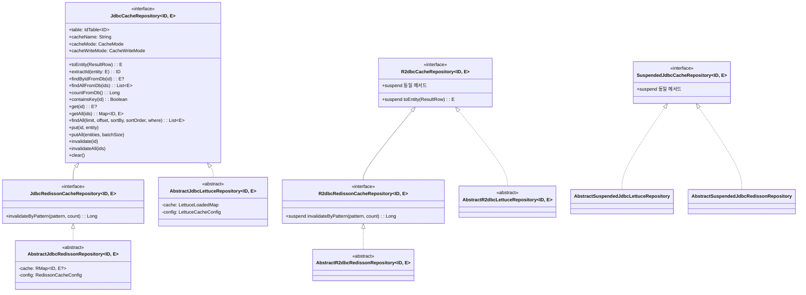
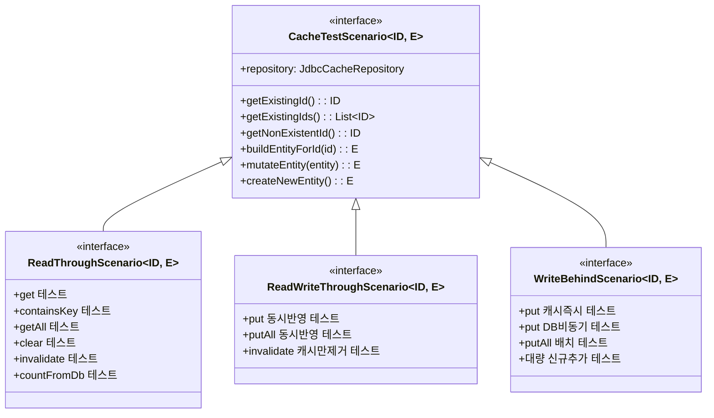

# Exposed Cache Repository 인터페이스 통일 및 테스트 표준화 설계 스펙

> **작성일**: 2026-04-07  
> **상태**: Draft  
> **대상 모듈**: `data/exposed-redis-api` (신규), `data/exposed-jdbc-lettuce`, `data/exposed-jdbc-redisson`, `data/exposed-r2dbc-lettuce`, `data/exposed-r2dbc-redisson`

---

## 1. 개요 및 목표

### 1.1 배경

현재 4개 Cache Repository 모듈은 동일한 기능(Exposed + Redis 캐시)을 제공하면서도 인터페이스가 불일치합니다:

| 차이점 | Lettuce 모듈 | Redisson 모듈 |
|--------|-------------|---------------|
| 캐시 조회 | `findById(id)` | `get(id)` |
| 캐시 저장 | `save(id, entity)` | `put(entity)` |
| 캐시 삭제 | `delete(id)` / `deleteAll(ids)` | `invalidate(*ids)` / `invalidateAll()` |
| 캐시 초기화 | `clearCache()` | `invalidateAll()` |
| 존재 확인 | 없음 | `exists(id)` |
| DB 건수 조회 | `countFromDb()` | 없음 |
| 패턴 삭제 | 없음 | `invalidateByPattern(pattern, count)` |
| Config 타입 | `LettuceCacheConfig` | `RedissonCacheConfig` |
| Closeable | 구현 | 미구현 |
| extractId | protected (Abstract에서) | interface 메서드 |
| toEntity | Abstract에서 정의 | interface 메서드 |
| batchSize 파라미터 | `saveAll(Map)` 형태 | `putAll(Collection, batchSize)` 형태 |

### 1.2 목표

1. **인터페이스 통일**: `data/exposed-redis-api` 신규 모듈에 `JdbcCacheRepository` / `R2dbcCacheRepository` 공통 인터페이스 정의
2. **메서드 합집합**: 양쪽 모듈의 모든 기능을 포함하는 상위 집합 인터페이스 설계
3. **일관된 명명 규칙**: `javax.cache.Cache` API 관례 기반으로 JDBC/R2DBC 간 동일한 메서드 이름, 인자 구조, Config 패턴 유지
4. **테스트 표준화**: Redisson 테스트 구조(테이블 2종 x 캐시 2종 x 기법 3종 = 12가지 조합)를 4개 모듈 모두에 적용
5. **즉시 일괄 마이그레이션**: 기존 인터페이스를 새 인터페이스로 즉시 완전 교체 (1.5.x 최신 버전이므로 하위 호환성 불필요)

---

## 2. 신규 모듈 구조 (exposed-redis-api)

```
data/exposed-redis-api/                    # bluetape4k-exposed-redis-api
├── build.gradle.kts
├── README.md
├── README.ko.md
└── src/main/kotlin/io/bluetape4k/exposed/redis/
    ├── CacheMode.kt                       # 공통 캐시 모드 열거형
    ├── CacheWriteMode.kt                  # 공통 쓰기 모드 열거형
    ├── repository/
    │   ├── JdbcCacheRepository.kt          # 동기 JDBC 캐시 레포지토리 인터페이스
    │   ├── SuspendedJdbcCacheRepository.kt # suspend JDBC 캐시 레포지토리 인터페이스
    │   ├── R2dbcCacheRepository.kt         # suspend R2DBC 캐시 레포지토리 인터페이스
    │   ├── JdbcRedissonCacheRepository.kt  # Redisson 전용 JDBC 확장 (invalidateByPattern)
    │   └── R2dbcRedissonCacheRepository.kt # Redisson 전용 R2DBC 확장 (invalidateByPattern)
    └── test/                               # 공통 테스트 인프라 (testFixtures)
        ├── CacheTestScenario.kt            # JDBC 동기 베이스
        ├── SuspendedCacheTestScenario.kt   # JDBC suspend 베이스
        ├── R2dbcCacheTestScenario.kt       # R2DBC suspend 베이스
        ├── ReadThroughScenario.kt          # RT 시나리오 (동기)
        ├── ReadWriteThroughScenario.kt     # RWT 시나리오 (동기)
        ├── WriteBehindScenario.kt          # WB 시나리오 (동기)
        ├── SuspendedReadThroughScenario.kt
        ├── SuspendedReadWriteThroughScenario.kt
        ├── SuspendedWriteBehindScenario.kt
        ├── R2dbcReadThroughScenario.kt
        ├── R2dbcReadWriteThroughScenario.kt
        └── R2dbcWriteBehindScenario.kt
```

### 2.1 의존성

```kotlin
// data/exposed-redis-api/build.gradle.kts
plugins {
    `java-test-fixtures`   // testFixtures 제공
}

configurations {
    testImplementation.get().extendsFrom(compileOnly.get(), runtimeOnly.get())
}

dependencies {
    // Exposed core (인터페이스 정의에 필요한 최소 의존성)
    api(Libs.exposed_core)

    // testFixtures 의존성
    testFixturesApi(project(":bluetape4k-junit5"))
    testFixturesApi(Libs.kluent)
    testFixturesApi(Libs.kotlinx_coroutines_test)
}
```

---

## 3. 공통 열거형 (CacheMode / CacheWriteMode)

Lettuce의 `WriteMode`와 Redisson의 `CacheMode + WriteMode` 조합을 통합합니다.

```kotlin
package io.bluetape4k.exposed.redis

/**
 * 캐시의 읽기/쓰기 모드를 정의합니다.
 */
enum class CacheMode {
    /** 읽기 전용: DB에서 Read-through만 수행, 쓰기는 캐시에만 반영 */
    READ_ONLY,

    /** 읽기+쓰기: Write-through 또는 Write-behind로 DB에도 반영 */
    READ_WRITE,
}

/**
 * 캐시 쓰기 전략을 정의합니다.
 * [CacheMode.READ_WRITE] 모드에서만 의미를 가집니다.
 */
enum class CacheWriteMode {
    /** 쓰기 없음 (READ_ONLY에서 사용) */
    NONE,

    /** 캐시와 DB에 동시 반영 */
    WRITE_THROUGH,

    /** 캐시에 즉시, DB에 비동기 반영 */
    WRITE_BEHIND,
}
```

> **설계 결정**: 공통 열거형은 인터페이스 수준에서만 사용합니다. 실제 Lettuce/Redisson 구현체에서는 각자의 native Config(`LettuceCacheConfig`, `RedissonCacheConfig`)를 그대로 사용하며, 공통 인터페이스의 `cacheMode`/`cacheWriteMode` 프로퍼티에서 변환합니다.

---

## 4. JdbcCacheRepository 인터페이스 설계

### 4.1 메서드 명명 규칙 결정

> **근거**: 이 모듈은 Cache 전략(Read-Through, Write-Through, Write-Behind) 용도이므로, Spring Data 관례가 아닌 **`javax.cache.Cache`** API 관례를 따릅니다.

| 기능 | Lettuce 현재 | Redisson 현재 | **통일 이름** | 근거 |
|------|-------------|---------------|--------------|------|
| 캐시 조회 (단건) | `findById` | `get` | **`get(id): E?`** | `javax.cache.Cache.get(K)` 관례 — 캐시 미스 시 DB Read-Through |
| 캐시 조회 (다건 by ID) | `findAll(ids): Map` | `getAll(ids, batch): List` | **`getAll(ids): Map<ID, E>`** | `javax.cache.Cache.getAll(Set)` 관례 — Map 반환 |
| 조건부 조회 (DB 쿼리) | `findAll(limit,offset,...)` | `findAll(limit,offset,...)` | **`findAll(limit,offset,...)`** | DB 페이징 쿼리 — 캐시 관련 없으므로 그대로 유지 |
| 캐시 저장 (단건) | `save(id, entity)` | `put(entity)` | **`put(id, entity)`** | `javax.cache.Cache.put(K, V)` 관례 — Write-Through/Behind 포함 |
| 캐시 저장 (다건) | `saveAll(Map)` | `putAll(Collection, batch)` | **`putAll(entities: Map<ID, E>, batchSize)`** | `javax.cache.Cache.putAll(Map)` 관례 + batchSize 지원 |
| 캐시 무효화 (단건) | `delete(id)` | `invalidate(*ids)` | **`invalidate(id)`** | 캐시에서만 제거 (DB 삭제 아님!), "delete"는 DB 삭제를 암시하므로 부적합 |
| 캐시 무효화 (다건) | `deleteAll(ids)` | `invalidate(*ids)` | **`invalidateAll(ids)`** | 캐시에서만 일괄 제거 (DB 삭제 아님!) |
| 캐시 전체 삭제 | `clearCache()` | `invalidateAll()` | **`clear()`** | `javax.cache.Cache.clear()` 관례 — 캐시 전체 비우기 |
| 존재 확인 | 없음 | `exists(id)` | **`containsKey(id)`** | `javax.cache.Cache.containsKey(K)` 관례 |
| DB 직접 조회 (단건) | 없음 (protected) | 없음 (protected) | **`findByIdFromDb(id): E?`** | 캐시를 거치지 않고 DB에서 직접 조회한다 |
| DB 직접 조회 (다건) | 없음 (protected) | 없음 (protected) | **`findAllFromDb(ids): List<E>`** | 캐시를 거치지 않고 DB에서 직접 조회한다 |
| DB 건수 조회 | `countFromDb()` | 없음 | **`countFromDb()`** | DB 전용 메서드, 합집합으로 추가 |
| 패턴 삭제 | 없음 | `invalidateByPattern` | **`invalidateByPattern(pattern, count)`** | Redisson 전용 확장 인터페이스(`JdbcRedissonCacheRepository`)에만 정의 (LSP 준수) |
| ID 추출 | protected | interface | **`extractId(entity): ID`** | interface 메서드로 승격 (findAll(where) 결과 캐싱에 필요) |

> **핵심**: `invalidate`/`invalidateAll`은 **캐시에서만 제거**하는 연산입니다. DB 레코드를 삭제하지 않습니다. Write-Through/Behind 모드에서도 캐시 무효화만 수행합니다.

### 4.2 JdbcCacheRepository 인터페이스

```kotlin
package io.bluetape4k.exposed.redis.repository

import io.bluetape4k.exposed.redis.CacheMode
import io.bluetape4k.exposed.redis.CacheWriteMode
import org.jetbrains.exposed.v1.core.Expression
import org.jetbrains.exposed.v1.core.Op
import org.jetbrains.exposed.v1.core.ResultRow
import org.jetbrains.exposed.v1.core.SortOrder
import org.jetbrains.exposed.v1.core.dao.id.IdTable
import java.io.Closeable
import java.io.Serializable

/**
 * Exposed JDBC와 Redis 캐시를 결합한 동기 캐시 레포지토리의 공통 계약입니다.
 *
 * ## 동작/계약
 * - `get`/`getAll(ids)` — 캐시 미스 시 DB에서 Read-through하여 Redis에 캐싱합니다.
 * - `findByIdFromDb`/`findAllFromDb` — 캐시를 우회하고 DB에서 직접 조회합니다.
 * - `put`/`putAll` — [cacheWriteMode]에 따라 Redis에 저장하고, WRITE_THROUGH이면 DB에도 즉시 반영합니다.
 * - `invalidate`/`invalidateAll` — **캐시에서만 제거**합니다 (DB 삭제 아님!).
 * - `clear` — Redis에서 이 레포지토리의 키를 전부 삭제합니다 (DB 영향 없음).
 *
 * @param ID PK 타입
 * @param E 엔티티(DTO) 타입. Redis 직렬화를 위해 [java.io.Serializable] 구현 필수.
 */
interface JdbcCacheRepository<ID: Any, E: Serializable> : Closeable {

    companion object {
        const val DEFAULT_BATCH_SIZE = 500
    }

    /** 이 레포지토리가 사용하는 Exposed [IdTable]. */
    val table: IdTable<ID>

    /** 캐시 이름 (Redis key prefix 또는 Redisson map name). */
    val cacheName: String

    /** 현재 캐시 모드. */
    val cacheMode: CacheMode

    /** 현재 쓰기 전략. */
    val cacheWriteMode: CacheWriteMode

    /** [ResultRow]를 엔티티로 변환합니다. */
    fun ResultRow.toEntity(): E

    /** 엔티티에서 식별자를 추출합니다. */
    fun extractId(entity: E): ID

    // ─────────────────────────────────────────────────────
    // DB 직접 조회 (캐시 우회)
    // ─────────────────────────────────────────────────────

    /** DB에서 직접 엔티티를 조회합니다 (캐시 우회). */
    fun findByIdFromDb(id: ID): E?

    /** DB에서 여러 엔티티를 직접 조회합니다 (캐시 우회). */
    fun findAllFromDb(ids: Collection<ID>): List<E>

    /** DB 전체 레코드 수를 반환합니다 (캐시 우회). */
    fun countFromDb(): Long

    // ─────────────────────────────────────────────────────
    // 캐시 기반 조회 (Read-through)
    // ─────────────────────────────────────────────────────

    /** 캐시에 해당 ID의 키가 존재하는지 확인합니다. Read-through 설정 시 DB에서 로드 후 판단합니다. */
    fun containsKey(id: ID): Boolean

    /** 캐시에서 엔티티를 조회합니다. 캐시 미스 시 DB에서 Read-through합니다. */
    fun get(id: ID): E?

    /** 여러 엔티티를 캐시에서 일괄 조회합니다. 캐시 미스 키는 DB에서 Read-through합니다. */
    fun getAll(ids: Collection<ID>): Map<ID, E>

    /**
     * DB에서 조건에 맞는 엔티티 목록을 조회한 뒤 캐시에 적재합니다.
     *
     * @param limit 최대 조회 개수 (null이면 무제한)
     * @param offset 조회 시작 위치 (null이면 0)
     * @param sortBy 정렬 기준 컬럼
     * @param sortOrder 정렬 순서
     * @param where 조회 조건
     * @return 엔티티 리스트
     */
    fun findAll(
        limit: Int? = null,
        offset: Long? = null,
        sortBy: Expression<*> = table.id,
        sortOrder: SortOrder = SortOrder.ASC,
        where: () -> Op<Boolean> = { Op.TRUE },
    ): List<E>

    // ─────────────────────────────────────────────────────
    // 쓰기 (캐시 + DB)
    // ─────────────────────────────────────────────────────

    /** 엔티티를 캐시에 저장합니다. [cacheWriteMode]에 따라 DB에도 반영됩니다. */
    fun put(id: ID, entity: E)

    /** 여러 엔티티를 일괄 저장합니다. */
    fun putAll(
        entities: Map<ID, E>,
        batchSize: Int = DEFAULT_BATCH_SIZE,
    )

    // ─────────────────────────────────────────────────────
    // 캐시 무효화 (캐시에서만 제거, DB 삭제 아님!)
    // ─────────────────────────────────────────────────────

    /** 캐시에서 엔티티를 제거합니다. DB에서는 삭제하지 않습니다. */
    fun invalidate(id: ID)

    /** 여러 엔티티를 캐시에서 일괄 제거합니다. DB에서는 삭제하지 않습니다. */
    fun invalidateAll(ids: Collection<ID>)

    // ─────────────────────────────────────────────────────
    // 캐시 관리
    // ─────────────────────────────────────────────────────

    /** 이 레포지토리의 Redis 캐시를 전부 비웁니다 (DB에는 영향 없음). */
    fun clear()

    /** 리소스를 정리합니다. 기본 구현은 no-op. */
    override fun close() {}
}
```

### 4.3 SuspendedJdbcCacheRepository 인터페이스

`JdbcCacheRepository`와 동일한 메서드 목록이되, 모두 `suspend` 함수입니다.

```kotlin
package io.bluetape4k.exposed.redis.repository

import org.jetbrains.exposed.v1.core.Expression
import org.jetbrains.exposed.v1.core.Op
import org.jetbrains.exposed.v1.core.ResultRow
import org.jetbrains.exposed.v1.core.SortOrder
import org.jetbrains.exposed.v1.core.dao.id.IdTable
import java.io.Closeable

/**
 * Exposed JDBC와 Redis 캐시를 결합한 suspend(코루틴) 기반 캐시 레포지토리의 공통 계약입니다.
 *
 * [JdbcCacheRepository]와 동일한 API를 제공하되, 모든 메서드가 `suspend`입니다.
 * `suspendedTransactionAsync(Dispatchers.IO)` 또는 Redisson async API `.await()`를 통해
 * 코루틴 친화적으로 동작합니다.
 */
interface SuspendedJdbcCacheRepository<ID: Any, E: Serializable> : Closeable {

    companion object {
        const val DEFAULT_BATCH_SIZE = 500
    }

    val table: IdTable<ID>
    val cacheName: String
    val cacheMode: CacheMode
    val cacheWriteMode: CacheWriteMode

    fun ResultRow.toEntity(): E
    fun extractId(entity: E): ID

    // DB 직접 조회
    suspend fun findByIdFromDb(id: ID): E?
    suspend fun findAllFromDb(ids: Collection<ID>): List<E>
    suspend fun countFromDb(): Long

    // 캐시 기반 조회
    suspend fun containsKey(id: ID): Boolean
    suspend fun get(id: ID): E?
    suspend fun getAll(ids: Collection<ID>): Map<ID, E>
    suspend fun findAll(
        limit: Int? = null,
        offset: Long? = null,
        sortBy: Expression<*> = table.id,
        sortOrder: SortOrder = SortOrder.ASC,
        where: () -> Op<Boolean> = { Op.TRUE },
    ): List<E>

    // 쓰기
    suspend fun put(id: ID, entity: E)
    suspend fun putAll(
        entities: Map<ID, E>,
        batchSize: Int = DEFAULT_BATCH_SIZE,
    )

    // 캐시 무효화 (캐시에서만 제거, DB 삭제 아님!)
    suspend fun invalidate(id: ID)
    suspend fun invalidateAll(ids: Collection<ID>)

    // 캐시 관리
    suspend fun clear()
    override fun close() {}
}
```

### 4.4 Abstract 클래스 계약 (updateEntity / insertEntity)

`JdbcCacheRepository` 인터페이스에는 `UpdateStatement.updateEntity()`와 `BatchInsertStatement.insertEntity()` 메서드가 포함되지 않습니다.
이 두 메서드는 **Abstract 클래스 레벨**(`AbstractJdbcLettuceRepository`, `AbstractJdbcRedissonRepository`)에 `abstract`로 정의됩니다.

#### 이유

Write-Through/Write-Behind 구현에서 DB에 엔티티를 반영할 때 이 메서드들이 필수적이지만, **인터페이스 수준 통일이 불가능**합니다:

| 구현체 | Write-Through/Behind 메커니즘 |
|--------|-------------------------------|
| **Lettuce** | `AbstractJdbcLettuceRepository`가 직접 `updateEntity()` / `insertEntity()`를 호출하여 DB INSERT/UPDATE 수행 |
| **Redisson** | `MapLoader` / `MapWriter`를 Redisson Config에 외부 설정으로 주입. Redisson이 내부적으로 write-through/behind를 처리하므로, Repository에서 직접 호출하지 않음 |

```kotlin
// AbstractJdbcLettuceRepository (Lettuce)
abstract class AbstractJdbcLettuceRepository<ID: Any, E: Serializable>(...) : JdbcCacheRepository<ID, E> {

    /** Write-Through 시 UPDATE 문에 엔티티 필드를 매핑합니다. */
    abstract fun UpdateStatement.updateEntity(entity: E)

    /** Write-Behind 시 INSERT 문에 엔티티 필드를 매핑합니다. */
    abstract fun BatchInsertStatement.insertEntity(entity: E)
}

// AbstractJdbcRedissonRepository (Redisson)
// → MapWriter.write()에서 DB 반영을 처리하므로 updateEntity/insertEntity가 불필요
abstract class AbstractJdbcRedissonRepository<ID: Any, E: Serializable>(...) : JdbcCacheRepository<ID, E> {
    // updateEntity / insertEntity 없음 — MapWriter가 대신 처리
}
```

> **설계 결정**: 공통 인터페이스가 아닌 Abstract 클래스에 유지함으로써, Lettuce/Redisson 구현체가 각자의 write 메커니즘을 자유롭게 선택할 수 있습니다. 하위 클래스 작성자는 자신이 상속하는 Abstract 클래스의 계약만 따르면 됩니다.

---

## 5. R2dbcCacheRepository 인터페이스 설계

### 5.1 JDBC와의 일관성

R2DBC 버전은 `SuspendedJdbcCacheRepository`와 **동일한 메서드 시그니처**를 사용합니다. 차이점:

| 항목 | SuspendedJdbcCacheRepository | R2dbcCacheRepository |
|------|------------------------------|----------------------|
| DB 접근 | `suspendedTransactionAsync(IO)` | `suspendTransaction` (R2DBC) |
| 패키지 | `io.bluetape4k.exposed.redis.repository` | `io.bluetape4k.exposed.redis.repository` (동일) |
| Exposed import | `exposed.v1.jdbc.*` | `exposed.v1.r2dbc.*` |
| toEntity | `fun ResultRow.toEntity(): E` | `suspend fun ResultRow.toEntity(): E` |

```kotlin
package io.bluetape4k.exposed.redis.repository

import org.jetbrains.exposed.v1.core.Expression
import org.jetbrains.exposed.v1.core.Op
import org.jetbrains.exposed.v1.core.ResultRow
import org.jetbrains.exposed.v1.core.SortOrder
import org.jetbrains.exposed.v1.core.dao.id.IdTable
import java.io.Closeable

/**
 * Exposed R2DBC와 Redis 캐시를 결합한 suspend 캐시 레포지토리의 공통 계약입니다.
 *
 * [SuspendedJdbcCacheRepository]와 동일한 API를 제공하되,
 * DB 접근이 R2DBC `suspendTransaction`을 통해 이루어집니다.
 */
interface R2dbcCacheRepository<ID: Any, E: Serializable> : Closeable {

    companion object {
        const val DEFAULT_BATCH_SIZE = 500
    }

    val table: IdTable<ID>
    val cacheName: String
    val cacheMode: CacheMode
    val cacheWriteMode: CacheWriteMode

    /** R2DBC에서는 toEntity가 suspend일 수 있습니다 (Flow 기반 변환). */
    suspend fun ResultRow.toEntity(): E
    fun extractId(entity: E): ID

    // DB 직접 조회
    suspend fun findByIdFromDb(id: ID): E?
    suspend fun findAllFromDb(ids: Collection<ID>): List<E>
    suspend fun countFromDb(): Long

    // 캐시 기반 조회
    suspend fun containsKey(id: ID): Boolean
    suspend fun get(id: ID): E?
    suspend fun getAll(ids: Collection<ID>): Map<ID, E>
    suspend fun findAll(
        limit: Int? = null,
        offset: Long? = null,
        sortBy: Expression<*> = table.id,
        sortOrder: SortOrder = SortOrder.ASC,
        where: () -> Op<Boolean> = { Op.TRUE },
    ): List<E>

    // 쓰기
    suspend fun put(id: ID, entity: E)
    suspend fun putAll(
        entities: Map<ID, E>,
        batchSize: Int = DEFAULT_BATCH_SIZE,
    )

    // 캐시 무효화 (캐시에서만 제거, DB 삭제 아님!)
    suspend fun invalidate(id: ID)
    suspend fun invalidateAll(ids: Collection<ID>)

    // 캐시 관리
    suspend fun clear()
    override fun close() {}
}
```

### 5.2 Redisson 전용 확장 인터페이스 (invalidateByPattern LSP 해결)

`invalidateByPattern`은 Redisson의 `RMap.keySet(pattern, count)` 기능에 의존하는 Redisson 전용 메서드입니다.
Lettuce의 `LettuceLoadedMap`은 keySet pattern을 지원하지 않으므로, 공통 인터페이스에 포함하면 **LSP(리스코프 치환 원칙)를 위반**합니다.

이를 해결하기 위해, `invalidateByPattern`은 Redisson 전용 확장 인터페이스에만 정의합니다:

```kotlin
/**
 * Redisson 전용 JDBC 캐시 레포지토리.
 * [JdbcCacheRepository]의 모든 계약을 포함하며, Redisson에서만 가능한 패턴 기반 캐시 무효화 기능을 추가합니다.
 */
interface JdbcRedissonCacheRepository<ID: Any, E: Serializable> : JdbcCacheRepository<ID, E> {

    /**
     * 패턴에 매칭되는 키의 엔티티를 캐시에서 무효화합니다 (DB 삭제 아님).
     *
     * @param pattern 키 패턴 (예: "*user*")
     * @param count 최대 무효화 개수
     * @return 무효화된 엔티티 수
     */
    fun invalidateByPattern(
        pattern: String,
        count: Int = DEFAULT_BATCH_SIZE,
    ): Long
}

/**
 * Redisson 전용 R2DBC 캐시 레포지토리.
 */
interface R2dbcRedissonCacheRepository<ID: Any, E: Serializable> : R2dbcCacheRepository<ID, E> {

    suspend fun invalidateByPattern(
        pattern: String,
        count: Int = DEFAULT_BATCH_SIZE,
    ): Long
}
```

> **설계 결정**: 클라이언트 코드가 `JdbcCacheRepository` 타입으로 참조하면 `invalidateByPattern`이 노출되지 않습니다.
> Redisson 전용 기능이 필요한 경우에만 `JdbcRedissonCacheRepository`로 타입을 좁혀 사용합니다.
> 이를 통해 Lettuce 구현체를 `JdbcCacheRepository`로 치환해도 UnsupportedOperationException이 발생하지 않습니다.

---

## 6. 각 모듈 수정 사항

### 6.1 Lettuce JDBC (`exposed-jdbc-lettuce`)

#### build.gradle.kts 변경

```kotlin
dependencies {
    api(project(":bluetape4k-exposed-redis-api"))  // 신규 의존성 추가
    // ... 기존 의존성 유지
    
    testImplementation(testFixtures(project(":bluetape4k-exposed-redis-api")))
}
```

#### 인터페이스 마이그레이션 (즉시 교체)

기존 `JdbcLettuceRepository` 인터페이스를 제거하고, `AbstractJdbcLettuceRepository`가 `JdbcCacheRepository`를 직접 구현합니다. `@Deprecated` 브릿지 메서드는 불필요합니다.

#### AbstractJdbcLettuceRepository 변경

```kotlin
abstract class AbstractJdbcLettuceRepository<ID: Any, E: Serializable>(
    client: RedisClient,
    val config: LettuceCacheConfig = LettuceCacheConfig.READ_WRITE_THROUGH,
) : JdbcCacheRepository<ID, E> {

    // 기존 JdbcLettuceRepository 메서드들을 JdbcCacheRepository 시그니처로 맞춤
    
    override val cacheName: String
        get() = config.keyPrefix

    override val cacheMode: CacheMode
        get() = when (config.writeMode) {
            WriteMode.NONE -> CacheMode.READ_ONLY
            else -> CacheMode.READ_WRITE
        }

    override val cacheWriteMode: CacheWriteMode
        get() = when (config.writeMode) {
            WriteMode.NONE -> CacheWriteMode.NONE
            WriteMode.WRITE_THROUGH -> CacheWriteMode.WRITE_THROUGH
            WriteMode.WRITE_BEHIND -> CacheWriteMode.WRITE_BEHIND
        }

    // containsKey() 신규 구현
    override fun containsKey(id: ID): Boolean = cache[id] != null

    // putAll에 batchSize 파라미터 추가 (Lettuce는 내부적으로 무시 가능)
    override fun putAll(entities: Map<ID, E>, batchSize: Int) {
        entities.forEach { (id, entity) -> cache[id] = entity }
    }

    // extractId를 interface 메서드로 승격 (abstract)
    abstract override fun extractId(entity: E): ID

    // invalidateByPattern은 JdbcCacheRepository에 없으므로 구현 불필요
    // (Lettuce LettuceLoadedMap은 keySet pattern 미지원)
}
```

### 6.2 Redisson JDBC (`exposed-jdbc-redisson`)

#### build.gradle.kts 변경

```kotlin
dependencies {
    api(project(":bluetape4k-exposed-redis-api"))  // 신규 의존성 추가
    // ... 기존 의존성 유지

    testImplementation(testFixtures(project(":bluetape4k-exposed-redis-api")))
}
```

#### 인터페이스 마이그레이션 (즉시 교체)

기존 `JdbcRedissonRepository` 인터페이스를 제거하고, `AbstractJdbcRedissonRepository`가 `JdbcRedissonCacheRepository`를 직접 구현합니다. `@Deprecated` 브릿지 메서드는 불필요합니다.

기존 메서드명(`findById`, `save`, `delete`, `clearCache` 등)은 새 메서드명(`get`, `put`, `invalidate`, `clear`)으로 즉시 교체됩니다.

#### AbstractJdbcRedissonRepository 변경

```kotlin
abstract class AbstractJdbcRedissonRepository<ID: Any, E: Serializable>(
    val redissonClient: RedissonClient,
    override val cacheName: String,
    protected val config: RedissonCacheConfig,
) : JdbcRedissonCacheRepository<ID, E> {

    override val cacheMode: CacheMode
        get() = when (config.cacheMode) {
            RedissonCacheConfig.CacheMode.READ_ONLY -> CacheMode.READ_ONLY
            RedissonCacheConfig.CacheMode.READ_WRITE -> CacheMode.READ_WRITE
        }

    override val cacheWriteMode: CacheWriteMode
        get() = when {
            config.isReadOnly -> CacheWriteMode.NONE
            config.isWriteBehind -> CacheWriteMode.WRITE_BEHIND
            else -> CacheWriteMode.WRITE_THROUGH
        }

    // 신규 메서드 구현
    override fun containsKey(id: ID): Boolean = cache.containsKey(id)

    override fun get(id: ID): E? = cache[id]

    override fun getAll(ids: Collection<ID>): Map<ID, E> {
        if (ids.isEmpty()) return emptyMap()
        return ids.chunked(DEFAULT_BATCH_SIZE).flatMap { chunk ->
            cache.getAll(chunk.toSet()).entries
        }.associate { (k, v) -> k to v }.filterValues { it != null }
            .mapValues { it.value!! }
    }

    override fun countFromDb(): Long = transaction { table.selectAll().count() }

    override fun put(id: ID, entity: E) { cache.fastPut(id, entity) }

    override fun putAll(entities: Map<ID, E>, batchSize: Int) {
        require(batchSize > 0) { "batchSize must be > 0" }
        cache.putAll(entities, batchSize)
    }

    override fun invalidate(id: ID) { cache.fastRemove(id) }

    override fun invalidateAll(ids: Collection<ID>) {
        if (ids.isNotEmpty()) {
            @Suppress("UNCHECKED_CAST")
            cache.fastRemove(*(ids as Collection<Any>).toTypedArray() as Array<ID>)
        }
    }

    override fun invalidateByPattern(pattern: String, count: Int): Long {
        require(count > 0) { "count must be > 0" }
        val keys = cache.keySet(pattern, count)
        if (keys.isEmpty()) return 0
        return cache.fastRemove(*keys.toTypedArray())
    }

    override fun clear() { cache.clear() }

    override fun close() { /* Redisson client는 외부에서 관리 */ }
}
```

### 6.3 Lettuce R2DBC (`exposed-r2dbc-lettuce`)

`R2dbcLettuceRepository` -> `R2dbcCacheRepository` 구현으로 전환.
패턴은 6.1과 동일하되, 모든 메서드가 `suspend`.

### 6.4 Redisson R2DBC (`exposed-r2dbc-redisson`)

`R2dbcRedissonRepository` -> `R2dbcCacheRepository` 구현으로 전환.
패턴은 6.2와 동일하되, 모든 메서드가 `suspend`, DB 접근은 `suspendTransaction`.

---

## 7. 테스트 표준 구조

### 7.1 테스트 매트릭스

모든 4개 모듈에서 아래 12가지 조합을 테스트합니다:

| 테이블 종류 | 캐시 저장 방식 | 캐시 기법 | 동기 테스트 | Suspend 테스트 |
|------------|--------------|----------|:----------:|:-------------:|
| AutoInc ID | Remote Only | Read-Through | O | O |
| AutoInc ID | Remote Only | Read & Write-Through | O | O |
| AutoInc ID | Remote Only | Write-Behind | O | O |
| AutoInc ID | NearCache | Read-Through | O | O |
| AutoInc ID | NearCache | Read & Write-Through | O | O |
| AutoInc ID | NearCache | Write-Behind | O | O |
| ClientGenerated ID | Remote Only | Read-Through | O | O |
| ClientGenerated ID | Remote Only | Read & Write-Through | O | O |
| ClientGenerated ID | Remote Only | Write-Behind | O | O |
| ClientGenerated ID | NearCache | Read-Through | O | O |
| ClientGenerated ID | NearCache | Read & Write-Through | O | O |
| ClientGenerated ID | NearCache | Write-Behind | O | O |

#### 테스트 클래스 수 산정

| 모듈 유형 | 조합 수 | 실행 방식 | 테스트 클래스 수 |
|-----------|:------:|----------|:-------------:|
| JDBC 모듈 (jdbc-lettuce, jdbc-redisson) | 12 | 동기 + suspend = 2 | **24개** (모듈당) |
| R2DBC 모듈 (r2dbc-lettuce, r2dbc-redisson) | 12 | suspend only = 1 | **12개** (모듈당) |
| **합계 (4개 모듈)** | | | **총 36개 x 2 = 72개** |

> **참고**: JDBC 모듈은 동기(`JdbcCacheRepository`)와 suspend(`SuspendedJdbcCacheRepository`) 두 인터페이스를 모두 테스트하므로 2배입니다. R2DBC 모듈은 suspend(`R2dbcCacheRepository`)만 테스트합니다.

### 7.2 공통 테스트 인프라 (testFixtures)

`exposed-redis-api` 모듈의 `testFixtures`에 공통 시나리오 인터페이스를 정의합니다.

#### CacheTestScenario (JDBC 동기)

```kotlin
package io.bluetape4k.exposed.redis.test

import io.bluetape4k.exposed.redis.repository.JdbcCacheRepository
import io.bluetape4k.logging.KLogging
import org.junit.jupiter.api.BeforeEach

/**
 * JDBC 동기 캐시 테스트의 공통 베이스 인터페이스.
 */
interface CacheTestScenario<ID: Any, E: Any> {
    companion object : KLogging()

    /** 테스트 대상 레포지토리 */
    val repository: JdbcCacheRepository<ID, E>

    /** DB에 존재하는 샘플 ID */
    fun getExistingId(): ID

    /** DB에 존재하는 복수 샘플 ID */
    fun getExistingIds(): List<ID>

    /** DB·캐시 모두에 존재하지 않는 ID */
    fun getNonExistentId(): ID

    /** 지정 ID에 해당하는 테스트용 엔티티를 빌드합니다 (DB 미저장). */
    fun buildEntityForId(id: ID): E

    /** 기존 엔티티의 필드를 수정한 복사본을 반환합니다 (Write-through/behind 테스트용). */
    fun mutateEntity(entity: E): E

    /** 새 엔티티를 생성합니다 (Write-behind 배치 테스트용). */
    fun createNewEntity(): E

    @BeforeEach
    fun clearCacheBeforeEach() {
        repository.clear()
    }
}
```

#### ReadThroughScenario (JDBC 동기)

```kotlin
package io.bluetape4k.exposed.redis.test

import org.amshove.kluent.*
import org.junit.jupiter.api.Test

/**
 * Read-through 캐시 전략 테스트 시나리오.
 */
interface ReadThroughScenario<ID: Any, E: Any> : CacheTestScenario<ID, E> {

    @Test
    fun `get - 캐시 미스 시 DB에서 Read-through로 값을 로드한다`() {
        val id = getExistingId()
        val fromDb = repository.findByIdFromDb(id)
        fromDb.shouldNotBeNull()

        repository.clear()
        val fromCache = repository.get(id)
        fromCache.shouldNotBeNull()
        fromCache shouldBeEqualTo fromDb
    }

    @Test
    fun `get - DB에 없는 ID는 null을 반환한다`() {
        repository.get(getNonExistentId()).shouldBeNull()
    }

    @Test
    fun `containsKey - 캐시에 존재하는 ID는 true를 반환한다`() {
        val id = getExistingId()
        repository.get(id) // 캐시 적재
        repository.containsKey(id).shouldBeTrue()
    }

    @Test
    fun `containsKey - 캐시와 DB에 없는 ID는 false를 반환한다`() {
        repository.containsKey(getNonExistentId()).shouldBeFalse()
    }

    @Test
    fun `getAll(ids) - 여러 ID를 일괄 조회하며 캐시 미스 키는 DB에서 Read-through한다`() {
        val ids = getExistingIds()
        val result = repository.getAll(ids)
        result.size shouldBeEqualTo ids.size
    }

    @Test
    fun `getAll(ids) - 존재하지 않는 ID는 결과에 포함되지 않는다`() {
        val ids = getExistingIds() + listOf(getNonExistentId())
        val result = repository.getAll(ids)
        result.size shouldBeEqualTo getExistingIds().size
    }

    @Test
    fun `findAll(where) - 조건부 조회 후 캐시에 적재된다`() {
        val entities = repository.findAll()
        entities.shouldNotBeEmpty()
        entities.size shouldBeEqualTo repository.countFromDb().toInt()
    }

    @Test
    fun `clear - 캐시를 비운 후 재조회하면 DB에서 다시 Read-through한다`() {
        val id = getExistingId()
        repository.get(id)
        repository.clear()
        repository.get(id).shouldNotBeNull()
    }

    @Test
    fun `invalidate - 캐시에만 저장된 엔티티를 무효화하면 get은 null을 반환한다`() {
        val id = getNonExistentId()
        val entity = buildEntityForId(id)
        repository.put(id, entity)
        repository.invalidate(id)
        repository.get(id).shouldBeNull()
    }

    @Test
    fun `invalidateAll - 여러 엔티티를 캐시에서 일괄 무효화한다`() {
        val ids = getExistingIds()
        ids.forEach { repository.get(it) } // 캐시 적재
        repository.invalidateAll(ids)
        // Read-through이므로 다시 로드될 수 있음 - 단, 무효화 직후 캐시에 없음을 확인
    }

    @Test
    fun `countFromDb - DB 전체 레코드 수를 반환한다`() {
        repository.countFromDb() shouldBeGreaterThan 0
    }
}
```

#### ReadWriteThroughScenario (JDBC 동기)

```kotlin
interface ReadWriteThroughScenario<ID: Any, E: Any> : CacheTestScenario<ID, E> {

    @Test
    fun `put - WRITE_THROUGH 저장 시 캐시와 DB에 동시 반영된다`() {
        val id = getExistingId()
        val entity = repository.findByIdFromDb(id).shouldNotBeNull()
        val updated = mutateEntity(entity)

        repository.put(id, updated)

        repository.get(id) shouldBeEqualTo updated
        repository.findByIdFromDb(id) shouldBeEqualTo updated
    }

    @Test
    fun `putAll - 여러 엔티티를 일괄 저장 시 캐시와 DB에 동시 반영된다`() {
        val ids = getExistingIds()
        val entities = ids.associateWith { id ->
            mutateEntity(repository.findByIdFromDb(id)!!)
        }
        repository.putAll(entities)

        entities.forEach { (id, expected) ->
            repository.get(id) shouldBeEqualTo expected
            repository.findByIdFromDb(id) shouldBeEqualTo expected
        }
    }

    @Test
    fun `invalidate - WRITE_THROUGH에서 캐시만 무효화하며 DB는 유지된다`() {
        val id = getExistingId()
        repository.get(id).shouldNotBeNull()
        repository.invalidate(id)

        // invalidate는 캐시에서만 제거 — DB 레코드는 유지
        repository.findByIdFromDb(id).shouldNotBeNull()
    }

    // ReadThroughScenario의 모든 테스트도 상속 가능
}
```

#### WriteBehindScenario (JDBC 동기)

```kotlin
interface WriteBehindScenario<ID: Any, E: Any> : CacheTestScenario<ID, E> {

    /** DB 반영 완료까지 폴링 대기 */
    fun awaitDbReflection(
        timeout: Long = 10_000L,
        condition: () -> Boolean,
    ) {
        val deadline = System.currentTimeMillis() + timeout
        while (!condition() && System.currentTimeMillis() < deadline) {
            Thread.sleep(100L)
        }
    }

    @Test
    fun `put - WRITE_BEHIND 저장 후 캐시에는 즉시 반영된다`() {
        val id = getExistingId()
        val entity = repository.findByIdFromDb(id).shouldNotBeNull()
        val updated = mutateEntity(entity)
        repository.put(id, updated)
        repository.get(id) shouldBeEqualTo updated
    }

    @Test
    fun `put - WRITE_BEHIND flush 주기 후 DB에 반영된다`() {
        val id = getExistingId()
        val entity = repository.findByIdFromDb(id).shouldNotBeNull()
        val updated = mutateEntity(entity)
        repository.put(id, updated)

        awaitDbReflection { repository.findByIdFromDb(id) == updated }
        repository.findByIdFromDb(id) shouldBeEqualTo updated
    }

    @Test
    fun `putAll - 여러 레코드를 배치로 비동기 적재한다`() {
        val ids = getExistingIds()
        val entities = ids.associateWith { id ->
            mutateEntity(repository.findByIdFromDb(id)!!)
        }
        repository.putAll(entities)

        awaitDbReflection {
            entities.all { (id, expected) -> repository.findByIdFromDb(id) == expected }
        }

        entities.forEach { (id, expected) ->
            repository.findByIdFromDb(id) shouldBeEqualTo expected
        }
    }

    @Test
    fun `createNewEntity - Write-Behind로 대량 신규 데이터 추가`() {
        val newEntities = List(100) { createNewEntity() }
        val entityMap = newEntities.associateBy { repository.extractId(it) }
        repository.putAll(entityMap)

        val initialCount = repository.countFromDb()
        awaitDbReflection { repository.countFromDb() > initialCount }
        repository.countFromDb() shouldBeGreaterThan initialCount
    }
}
```

### 7.3 Suspend 테스트 시나리오

동기 시나리오와 동일한 구조이되 `suspend` + `runTest` 사용:

```kotlin
interface SuspendedReadThroughScenario<ID: Any, E: Any> : SuspendedCacheTestScenario<ID, E> {

    @Test
    fun `get - 캐시 미스 시 DB에서 Read-through로 값을 로드한다`() = runTest {
        val id = getExistingId()
        val fromDb = repository.findByIdFromDb(id)
        fromDb.shouldNotBeNull()

        repository.clear()
        val fromCache = repository.get(id)
        fromCache.shouldNotBeNull()
        fromCache shouldBeEqualTo fromDb
    }

    // ... 나머지 테스트들도 동일한 패턴
}
```

### 7.4 R2DBC 테스트 시나리오

Suspend 시나리오와 동일한 구조이되 DB 접근이 R2DBC `suspendTransaction` 사용:

```kotlin
interface R2dbcReadThroughScenario<ID: Any, E: Any> : R2dbcCacheTestScenario<ID, E> {
    // SuspendedReadThroughScenario와 동일한 테스트 메서드
}
```

### 7.5 각 모듈의 테스트 클래스 구조

Redisson JDBC 기준 예시 (가장 완전한 형태):

```kotlin
class ReadThroughCacheTest {

    // ── AutoInc ID ──────────────────────────────────────

    abstract class AutoIncIdReadThrough :
        AbstractRedissonTest(),
        ReadThroughScenario<Long, UserRecord> {
        // getExistingId, getExistingIds, getNonExistentId,
        // buildEntityForId, mutateEntity, createNewEntity 구현
    }

    @Nested
    inner class AutoIncIdRemoteCache : AutoIncIdReadThrough() {
        override val repository by lazy {
            UserCacheRepository(redissonClient, "rt:remote:users", RedissonCacheConfig.READ_ONLY)
        }
    }

    @Nested
    inner class AutoIncIdNearCache : AutoIncIdReadThrough() {
        override val repository by lazy {
            UserCacheRepository(redissonClient, "rt:near:users", RedissonCacheConfig.READ_ONLY_WITH_NEAR_CACHE)
        }
    }

    // ── ClientGenerated ID ──────────────────────────────

    abstract class ClientGenIdReadThrough :
        AbstractRedissonTest(),
        ReadThroughScenario<UUID, UserCredentialsRecord> {
        // ...
    }

    @Nested
    inner class ClientGenIdRemoteCache : ClientGenIdReadThrough() {
        override val repository by lazy {
            UserCredentialCacheRepository(redissonClient, "rt:remote:creds", RedissonCacheConfig.READ_ONLY)
        }
    }

    @Nested
    inner class ClientGenIdNearCache : ClientGenIdReadThrough() {
        override val repository by lazy {
            UserCredentialCacheRepository(redissonClient, "rt:near:creds", RedissonCacheConfig.READ_ONLY_WITH_NEAR_CACHE)
        }
    }
}
```

Lettuce JDBC 예시 (동일 구조 적용):

```kotlin
class ReadThroughCacheTest {

    abstract class AutoIncIdReadThrough :
        AbstractLettuceTest(),
        ReadThroughScenario<Long, UserRecord> {
        // ...
    }

    @Nested
    inner class AutoIncIdRemoteCache : AutoIncIdReadThrough() {
        override val repository by lazy {
            UserLettuceRepository(redisClient, LettuceCacheConfig.READ_ONLY)
        }
    }

    @Nested
    inner class AutoIncIdNearCache : AutoIncIdReadThrough() {
        override val repository by lazy {
            UserLettuceRepository(redisClient, LettuceCacheConfig.READ_ONLY_WITH_NEAR_CACHE)
        }
    }

    // ClientGenerated ID도 동일 패턴
}
```

### 7.6 현재 각 모듈 테스트 누락 분석

| 테스트 시나리오 | jdbc-lettuce | jdbc-redisson | r2dbc-lettuce | r2dbc-redisson |
|---------------|:-----------:|:------------:|:------------:|:-------------:|
| AutoInc + Remote + RT | O | O | O | O |
| AutoInc + Near + RT | X | O | X | X |
| AutoInc + Remote + RWT | O | O | O | O |
| AutoInc + Near + RWT | X | X | X | X |
| AutoInc + Remote + WB | O | O | O | O |
| AutoInc + Near + WB | X | X | X | X |
| ClientGen + Remote + RT | X | O | X | X |
| ClientGen + Near + RT | X | O | X | X |
| ClientGen + Remote + RWT | X | O | X | X |
| ClientGen + Near + RWT | X | X | X | X |
| ClientGen + Remote + WB | X | O | X | X |
| ClientGen + Near + WB | X | X | X | X |
| Suspended + RT | O | O | X | N/A |
| Suspended + RWT | O | O | X | N/A |
| Suspended + WB | O | O | X | N/A |
| containsKey() 테스트 | X | O | X | O |
| countFromDb() 테스트 | X | X | X | X |
| invalidateByPattern() 테스트 | X | O | X | O |

> **RT** = Read-Through, **RWT** = Read & Write-Through, **WB** = Write-Behind

---

## 8. 마이그레이션 전략 (즉시 일괄 교체)

### 8.1 전략 개요

> **결정**: `@Deprecated` 브릿지 메서드 없이, 기존 인터페이스를 **이번 작업에서 즉시 완전 교체**합니다.
>
> **근거**: 현재 1.5.x 최신 버전이며, 하위 호환성 유지보다 깔끔한 API 변경이 더 적합합니다.
> 3단계 분리 마이그레이션은 유지 비용이 높고, 사용자 코드에서 `@Deprecated` 경고가 오래 방치되는 문제가 있습니다.

### 8.2 교체 대상

| 기존 인터페이스 | 교체 후 | 비고 |
|---------------|--------|------|
| `JdbcLettuceRepository<ID, E>` | `JdbcCacheRepository<ID, E>` | 파일 제거 |
| `JdbcRedissonRepository<ID, E>` | `JdbcRedissonCacheRepository<ID, E>` | 파일 제거 |
| `SuspendedJdbcLettuceRepository<ID, E>` | `SuspendedJdbcCacheRepository<ID, E>` | 파일 제거 |
| `SuspendedJdbcRedissonRepository<ID, E>` | `SuspendedJdbcCacheRepository<ID, E>` | 파일 제거 |
| `R2dbcLettuceRepository<ID, E>` | `R2dbcCacheRepository<ID, E>` | 파일 제거 |
| `R2dbcRedissonRepository<ID, E>` | `R2dbcRedissonCacheRepository<ID, E>` | 파일 제거 |

### 8.3 교체 절차

1. `data/exposed-redis-api` 모듈 생성 + 공통 인터페이스 3개 (`JdbcCacheRepository`, `SuspendedJdbcCacheRepository`, `R2dbcCacheRepository`) + Redisson 전용 확장 2개 정의
2. 각 구현 모듈에 `exposed-redis-api` 의존성 추가
3. Abstract 클래스가 새 인터페이스를 **직접** 구현하도록 변경
4. 기존 인터페이스 파일 **삭제** (`JdbcLettuceRepository`, `JdbcRedissonRepository` 등)
5. 기존 인터페이스를 참조하던 사용자 코드를 새 인터페이스로 일괄 변경
6. `@Deprecated` 브릿지 메서드 **불필요** — 생성하지 않음
7. 기존 메서드명(`findById`, `save`, `delete`, `clearCache` 등)은 새 메서드명(`get`, `put`, `invalidate`, `clear`)으로 즉시 교체
8. testFixtures 공통 시나리오 작성 + 누락 테스트 추가를 같은 작업에서 수행

### 8.4 마이그레이션 주의사항

#### extractId 가시성 변경 (toEntity/extractId)

`AbstractJdbcLettuceRepository`에서 `extractId`가 기존 `protected open`에서 `public override`(인터페이스 메서드)로 변경됩니다.

- **영향 없는 경우**: 기존 하위 클래스에서 `override fun extractId(entity: E): ID`로 구현한 경우, `public override`가 되어도 시그니처 호환됩니다.
- **주의가 필요한 경우**: `protected` 가시성에 의존하여 외부 호출을 차단하던 코드가 있다면, `extractId`가 public으로 노출됩니다. 다만, 이 메서드는 순수 변환 함수이므로 public 노출의 부작용은 없습니다.

`toEntity()`도 동일하게 인터페이스 메서드로 승격되므로 같은 원칙이 적용됩니다.

#### config 프로퍼티 (Lettuce)

`AbstractJdbcLettuceRepository`의 `config: LettuceCacheConfig` 프로퍼티는 `protected`로 유지합니다.
공통 인터페이스의 `cacheMode`/`cacheWriteMode`는 `config`에서 변환하여 제공하며, 사용자 코드에서는 공통 인터페이스 프로퍼티를 사용합니다.

```kotlin
abstract class AbstractJdbcLettuceRepository<ID: Any, E: Serializable>(...) : JdbcCacheRepository<ID, E> {

    protected val config: LettuceCacheConfig = initialConfig

    // cacheMode, cacheWriteMode는 config에서 변환
    override val cacheMode: CacheMode
        get() = when (config.writeMode) {
            WriteMode.NONE -> CacheMode.READ_ONLY
            else -> CacheMode.READ_WRITE
        }
}
```

---

## 9. 빌드 설정

### 9.1 settings.gradle.kts 변경

`data/exposed-redis-api` 디렉토리를 생성하면 `settings.gradle.kts`의 `includeModules` 자동 등록으로 `bluetape4k-exposed-redis-api` 모듈명이 됩니다.

별도 수정 불필요 (auto-register 방식).

### 9.2 exposed-redis-api/build.gradle.kts

```kotlin
plugins {
    `java-test-fixtures`
}

configurations {
    testImplementation.get().extendsFrom(compileOnly.get(), runtimeOnly.get())
}

dependencies {
    // 인터페이스 정의에 필요한 최소 의존성
    api(Libs.exposed_core)

    // testFixtures — 공통 테스트 시나리오
    testFixturesApi(project(":bluetape4k-junit5"))
    testFixturesApi(Libs.kluent)
    testFixturesApi(Libs.kotlinx_coroutines_core)
    testFixturesApi(Libs.kotlinx_coroutines_test)
}
```

### 9.3 각 구현 모듈 build.gradle.kts 변경

```kotlin
// 예: data/exposed-jdbc-lettuce/build.gradle.kts
dependencies {
    api(project(":bluetape4k-exposed-redis-api"))  // 추가
    // ... 기존 의존성 유지

    testImplementation(testFixtures(project(":bluetape4k-exposed-redis-api")))  // 추가
}
```

---

## 10. 인터페이스 계층 다이어그램





---

## 11. 작업 순서 및 예상 규모

| Task | 내용 | 예상 파일 수 | 우선순위 |
|------|------|:----------:|:--------:|
| T1 | `exposed-redis-api` 모듈 생성 + 인터페이스 3개 + Redisson 확장 2개 | ~8 | P0 |
| T2 | `exposed-redis-api` testFixtures (시나리오 12개) | ~12 | P0 |
| T3 | `exposed-jdbc-redisson` → 기존 인터페이스 제거 + `JdbcRedissonCacheRepository` 직접 구현 | ~6 | P1 |
| T4 | `exposed-jdbc-lettuce` → 기존 인터페이스 제거 + `JdbcCacheRepository` 직접 구현 | ~6 | P1 |
| T5 | `exposed-r2dbc-redisson` → 기존 인터페이스 제거 + `R2dbcRedissonCacheRepository` 직접 구현 | ~6 | P1 |
| T6 | `exposed-r2dbc-lettuce` → 기존 인터페이스 제거 + `R2dbcCacheRepository` 직접 구현 | ~6 | P1 |
| T7 | `exposed-jdbc-redisson` 테스트 표준화 (누락 조합 추가) | ~4 | P2 |
| T8 | `exposed-jdbc-lettuce` 테스트 표준화 (누락 조합 추가) | ~8 | P2 |
| T9 | `exposed-r2dbc-redisson` 테스트 표준화 | ~8 | P2 |
| T10 | `exposed-r2dbc-lettuce` 테스트 표준화 | ~8 | P2 |
| T11 | README.md / README.ko.md 작성 | ~2 | P2 |

총 예상: **~74 파일** (신규 + 수정)

> **참고**: `@Deprecated` 브릿지 메서드 생성/관리 태스크는 즉시 일괄 교체 전략 적용으로 불필요하여 제거되었습니다.

---

## 12. 주요 설계 결정 요약

| 결정 | 근거 |
|---|---|
| `get`/`getAll` (javax.cache 관례) | `javax.cache.Cache.get(K)` / `getAll(Set)` 관례. Cache 전략 모듈이므로 Spring Data보다 캐시 API 관례가 적합 |
| `put(id, entity)` / `putAll(map)` | `javax.cache.Cache.put(K, V)` / `putAll(Map)` 관례 + ID 명시로 extractId 의존 제거 |
| `invalidate`/`invalidateAll` (캐시만 제거) | 캐시에서만 제거하는 연산임을 명확히 표현. `delete`는 DB 삭제를 암시하여 부적합 |
| `clear()` (javax.cache 관례) | `javax.cache.Cache.clear()` 관례. 캐시 전체 비우기 (DB 영향 없음) |
| `containsKey` (javax.cache 관례) | `javax.cache.Cache.containsKey(K)` 관례 |
| `invalidateByPattern`을 Redisson 전용 확장 인터페이스로 분리 | LSP 준수: Lettuce 구현체 치환 시 UnsupportedOperationException 방지 |
| `UpdateStatement.updateEntity` / `BatchInsertStatement.insertEntity`를 Abstract 클래스에 유지 | Redisson은 MapLoader/MapWriter로 외부 처리하므로 인터페이스 통일 불가 |
| 엔티티 타입 `E: Serializable` 바운드 추가 | Lettuce/Redisson 분산 캐시 직렬화 요건 명시 |
| `extractId`를 interface 메서드로 승격 | findAll(where) 결과 캐싱에 필수, protected가 아닌 public 접근 필요 |
| `countFromDb()` 합집합 포함 | 테스트 검증에 필수적인 유틸리티 메서드 |
| `putAll(Map, batchSize)` 형태 통일 | Map으로 ID 명시 + batchSize로 대량 처리 제어 |
| `CacheMode`/`CacheWriteMode` 공통 열거형 | 인터페이스 수준 캐시 전략 조회용, 실제 Config는 각 구현체 native 사용 |
| testFixtures로 공통 테스트 제공 | 각 모듈이 동일한 시나리오 인터페이스를 implement하여 테스트 일관성 보장 |
| `Closeable` 모든 인터페이스에 포함 | Lettuce는 RedisClient 연결 해제 필요, Redisson은 기본 no-op |
