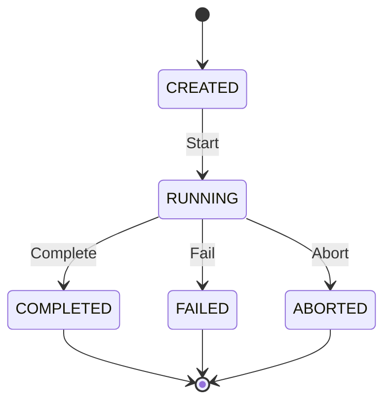
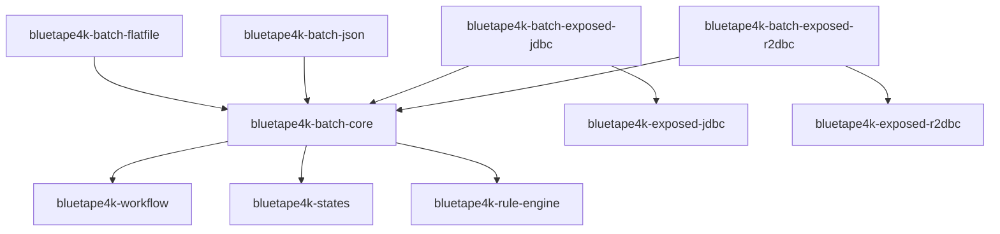

# bluetape4k-batch 설계 스펙

- 날짜: 2026-04-09
- 작성자: Claude Opus (via bluetape4k-design skill)
- 수정: easy-batch 의존성 제거, bluetape4k-workflow/states/rule-engine 활용으로 전면 개정

---

## 제목

**bluetape4k-batch: Easy-Batch 개념 기반 Kotlin 네이티브 배치 처리 프레임워크**

---

## 핵심 설계 원칙

- **easy-batch의 파이프라인 개념만 차용**: Reader → Filter → Mapper → Validator → Processor → Writer
- **라이브러리 의존성 없음**: easy-batch JAR 불사용 (5년 이상 미업데이트로 의존 불가)
- **workflow 모듈 활용**: 파이프라인 각 단계를 `Work`/`SuspendWork`로 구현, `SequentialWorkFlow`로 실행
- **states 모듈 활용**: `BatchJob` 상태 관리 (`CREATED → RUNNING → COMPLETED/FAILED/ABORTED`)
- **rule-engine 모듈 활용**: `RecordFilter`와 `RecordValidator`를 Rule/Condition 패턴으로 구현

---

## 1. 아키텍처 설계

### 1.1 파이프라인 개요 (easy-batch에서 차용한 개념)

```
RecordReader → RecordFilter → RecordMapper → RecordValidator → RecordProcessor → RecordWriter
     ↓                ↓              ↓               ↓                ↓               ↓
  Work 단계      Rule 기반        Work 단계        Rule 기반         Work 단계       Work 단계
                필터링                           검증 실패 시
                                                 에러 레코드 누적
```

각 단계가 `Work`/`SuspendWork`로 구현되어 `SequentialWorkFlow`(workflow 모듈)에 의해 실행됨.

### 1.2 Job 상태 머신 (states 모듈 활용)

```kotlin
enum class BatchJobState {
    CREATED,
    RUNNING,
    COMPLETED,
    FAILED,
    ABORTED
}

sealed interface BatchJobEvent {
    data object Start: BatchJobEvent
    data object Complete: BatchJobEvent
    data object Fail: BatchJobEvent
    data object Abort: BatchJobEvent
}

// StateMachine<BatchJobState, BatchJobEvent> 으로 상태 관리
```

상태 전이:

- `CREATED --[Start]--> RUNNING`
- `RUNNING --[Complete]--> COMPLETED`
- `RUNNING --[Fail]--> FAILED`
- `RUNNING --[Abort]--> ABORTED`



### 1.3 Filter/Validator Rule 통합 (rule-engine 모듈 활용)

```kotlin
// RecordFilter를 Rule의 Condition으로 구현
val skipBlankFilter = rule {
    name = "skip-blank-payload"
    condition { facts -> facts.get<Record<String>>("record")!!.payload.isNotBlank() }
    action { facts -> facts["filtered"] = false }  // false = 통과, skip 하지 않음
}

// RecordValidator는 RuleEngine으로 여러 검증 규칙 조합
val validators = ruleEngine { skipOnFirstFailedRule = false }
```

---

## 2. 모듈 구조

### 2.1 모듈 목록

```
batch/
├── core/                    → bluetape4k-batch-core
├── flatfile/                → bluetape4k-batch-flatfile  (순수 Kotlin, 외부 의존 없음)
├── json/                    → bluetape4k-batch-json      (Jackson 기반)
├── exposed-jdbc/            → bluetape4k-batch-exposed-jdbc
└── exposed-r2dbc/           → bluetape4k-batch-exposed-r2dbc
```

**5개 모듈**, easy-batch-jdbc-tests는 제거 (batch-core에 testFixtures로 통합)

| 모듈                    | 설명                                                                      | 핵심 의존                                                                                         |
|-----------------------|-------------------------------------------------------------------------|-----------------------------------------------------------------------------------------------|
| `batch-core`          | Record 추상화, 파이프라인 인터페이스, BatchJob DSL, JobReport, 상태 머신                 | `bluetape4k-workflow`, `bluetape4k-states`, `bluetape4k-rule-engine`, `bluetape4k-coroutines` |
| `batch-flatfile`      | CSV/TSV FlatFile Reader/Writer (순수 Kotlin OpenCSV 또는 표준 BufferedReader) | `batch-core`                                                                                  |
| `batch-json`          | JSON RecordReader/Writer (Jackson streaming API)                        | `batch-core`, `jackson-databind`                                                              |
| `batch-exposed-jdbc`  | Exposed JDBC RecordReader/Writer                                        | `batch-core`, `bluetape4k-exposed-jdbc`                                                       |
| `batch-exposed-r2dbc` | Exposed R2DBC SuspendRecordReader/Writer (Flow 기반)                      | `batch-core`, `bluetape4k-exposed-r2dbc`                                                      |

### 2.2 settings.gradle.kts 추가

```kotlin
includeModules("batch", withBaseDir = false)
```

### 2.3 의존 관계 다이어그램



---

## 3. 핵심 API 설계

### 3.1 Record 타입

```kotlin
data class RecordHeader(
    val number: Long,       // 레코드 순번 (1부터)
    val source: String,     // 소스 식별자
)

data class Record<T>(
    val header: RecordHeader,
    val payload: T,
): Serializable

data class Batch<T>(
    val records: List<Record<T>>,
) {
    val size: Int get() = records.size
}
```

### 3.2 파이프라인 인터페이스 (동기)

```kotlin
// 모두 fun interface (SAM 지원)
fun interface RecordReader<T> {
    fun read(): Record<T>?  // null = EOF
    fun open() {}
    fun close() {}
}

fun interface RecordFilter<T>: Condition {
    // rule-engine의 Condition을 확장 - facts에서 Record를 꺼내 평가
    // override fun evaluate(facts: Facts): Boolean
    // 편의: fun shouldInclude(record: Record<T>): Boolean
}

fun interface RecordMapper<I, O> {
    fun map(record: Record<I>): Record<O>
}

fun interface RecordValidator<T> {
    fun validate(record: Record<T>): RecordValidationResult
    // RecordValidationResult: sealed(Valid, Invalid(reason))
}

fun interface RecordProcessor<I, O> {
    fun process(record: Record<I>): Record<O>
}

fun interface RecordWriter<T> {
    fun write(batch: Batch<T>)
    fun open() {}
    fun close() {}
}
```

### 3.3 파이프라인 인터페이스 (코루틴)

```kotlin
fun interface SuspendRecordReader<T> {
    suspend fun read(): Record<T>?
    suspend fun open() {}
    suspend fun close() {}
}

fun interface SuspendRecordWriter<T> {
    suspend fun write(batch: Batch<T>)
}

// Flow 기반 읽기 (R2DBC 전용)
fun interface FlowRecordReader<T> {
    fun readAll(): Flow<Record<T>>
}
```

### 3.4 RecordValidationResult

```kotlin
sealed interface RecordValidationResult {
    data object Valid: RecordValidationResult
    data class Invalid(val reasons: List<String>): RecordValidationResult {
        constructor(reason: String): this(listOf(reason))
    }
}
```

### 3.5 BatchJobReport

```kotlin
data class BatchJobReport(
    val jobName: String,
    val startTime: Instant,
    val endTime: Instant,
    val readCount: Long,
    val filteredCount: Long,
    val invalidCount: Long,
    val processedCount: Long,
    val writeCount: Long,
    val errorCount: Long,
    val status: BatchJobState,  // states 모듈 enum 사용
    val errors: List<BatchJobError>,
) {
    val duration: Duration get() = Duration.between(startTime, endTime)
}

data class BatchJobError(
    val recordHeader: RecordHeader,
    val stage: BatchStage,  // READ/FILTER/MAP/VALIDATE/PROCESS/WRITE
    val error: Throwable,
)

enum class BatchStage {
    READ,
    FILTER,
    MAP,
    VALIDATE,
    PROCESS,
    WRITE
}
```

### 3.6 Kotlin DSL (동기)

```kotlin
@DslMarker
annotation class BatchDsl

@BatchDsl
fun <I, O> batchJob(
    name: String,
    block: BatchJobBuilder<I, O>.() -> Unit
): BatchJob<I, O>

// 사용 예시
val job = batchJob<String, UserDto>("csv-to-db") {
    reader { CsvRecordReader(Path("users.csv")) }
    filter { record -> record.payload.isNotBlank() }
    mapper { record -> record.copy(payload = parseUser(record.payload)) }
    validator { record ->
        if (record.payload.name.isBlank()) RecordValidationResult.Invalid("이름 필수")
        else RecordValidationResult.Valid
    }
    processor { record -> record.copy(payload = record.payload.normalize()) }
    writer { batch ->
        // Exposed JDBC
        transaction { UserTable.batchInsert(batch.records.map { it.payload }) { ... } }
    }
    chunkSize(500)
    errorThreshold(10)
}
val report = job.execute()
```

### 3.7 Kotlin DSL (코루틴)

```kotlin
suspend fun <I, O> suspendBatchJob(
    name: String,
    block: SuspendBatchJobBuilder<I, O>.() -> Unit
): BatchJobReport

// 사용 예시: Exposed R2DBC 연동
val report = suspendBatchJob<UserRow, UserDto>("r2dbc-migrate") {
    reader {
        ExposedR2dbcRecordReader(database) { UserTable.selectAll().orderBy(UserTable.id) }
    }
    processor { record -> record.copy(payload = record.payload.toDto()) }
    writer { batch ->
        // Exposed R2DBC
        newSuspendedTransaction {
            TargetTable.batchInsert(batch.records.map { it.payload }) { ... }
        }
    }
    chunkSize(1000)
}
```

### 3.8 workflow 모듈 통합 (파이프라인 실행 엔진)

```kotlin
// BatchJob.execute() 내부 구현 원리:
// 각 청크에 대해 SequentialWorkFlow로 단계 실행:
// ReadWork → FilterWork → MapWork → ValidateWork → ProcessWork → WriteWork
// 이때 각 Work의 WorkContext에 Record/Batch를 전달하고 WorkReport를 받아 JobReport에 누적

// 동기: virtualthread(SequentialWorkFlow) 활용
// 코루틴: suspendSequentialFlow 활용
```

파이프라인 내부 Work 구현 예시:

```kotlin
// 각 파이프라인 단계가 Work로 구현됨
class ReadWork<T>(private val reader: RecordReader<T>): Work {
    override fun execute(context: WorkContext): WorkReport {
        val record = reader.read()
        return if (record != null) {
            context["currentRecord"] = record
            WorkReport.Success(context)
        } else {
            WorkReport.Aborted(context, reason = "EOF reached")
        }
    }
}

class FilterWork<T>(private val filter: RecordFilter<T>): Work {
    override fun execute(context: WorkContext): WorkReport {
        val record = context.get<Record<T>>("currentRecord")!!
        return if (filter.shouldInclude(record)) {
            WorkReport.Success(context)
        } else {
            context["filtered"] = true
            WorkReport.Success(context)  // 필터됐지만 플로우는 계속
        }
    }
}

// BatchJob.execute()에서:
val pipeline = sequentialFlow("batch-pipeline") {
    execute(ReadWork(reader))
    execute(FilterWork(filter))
    execute(MapWork(mapper))
    execute(ValidateWork(validator))
    execute(ProcessWork(processor))
    execute(WriteWork(writer))
}
```

### 3.9 states 모듈 통합 (Job 상태 관리)

```kotlin
// BatchJob 내부에서 StateMachine으로 상태 관리
private val stateMachine = stateMachine<BatchJobState, BatchJobEvent> {
    initialState = BatchJobState.CREATED

    transition(BatchJobState.CREATED, BatchJobEvent.Start) {
        targetState = BatchJobState.RUNNING
    }
    transition(BatchJobState.RUNNING, BatchJobEvent.Complete) {
        targetState = BatchJobState.COMPLETED
    }
    transition(BatchJobState.RUNNING, BatchJobEvent.Fail) {
        targetState = BatchJobState.FAILED
    }
    transition(BatchJobState.RUNNING, BatchJobEvent.Abort) {
        targetState = BatchJobState.ABORTED
    }
}

// 코루틴 버전은 SuspendStateMachine 사용
private val suspendStateMachine = suspendStateMachine<BatchJobState, BatchJobEvent> {
    // 동일한 전이 규칙 + Guard 조건 추가 가능
    initialState = BatchJobState.CREATED

    transition(BatchJobState.RUNNING, BatchJobEvent.Fail) {
        targetState = BatchJobState.FAILED
        guard { context -> context.errorCount > context.errorThreshold }
    }
}
```

### 3.10 Exposed JDBC Reader/Writer

```kotlin
class ExposedJdbcRecordReader<T>(
    private val database: Database? = null,
    private val chunkSize: Int = 500,
    private val query: () -> Query,
    private val mapper: (ResultRow) -> T,
): RecordReader<T> {
    // 내부적으로 offset/limit 기반 페이지 처리
    // read() 호출마다 한 건씩 반환, 페이지 소진 시 다음 페이지 로드
}

class ExposedJdbcRecordWriter<T>(
    private val database: Database? = null,
    private val table: Table,
    private val insertStatement: Table.(T) -> Unit,
): RecordWriter<T> {
    // Batch<T>의 레코드를 Exposed batchInsert로 일괄 기록
}

class ExposedJdbcUpsertWriter<T>(
    private val database: Database? = null,
    private val table: Table,
    private val upsertStatement: UpsertStatement<*>.(T) -> Unit,
): RecordWriter<T> {
    // Exposed upsert로 충돌 시 업데이트
}
```

### 3.11 Exposed R2DBC Reader/Writer (suspend + Flow)

```kotlin
class ExposedR2dbcRecordReader<T>(
    private val database: R2dbcDatabase,
    private val query: () -> Query,
    private val mapper: (ResultRow) -> T,
): FlowRecordReader<T> {
    override fun readAll(): Flow<Record<T>>
    // suspendTransaction 내에서 Flow 반환
}

class ExposedR2dbcRecordWriter<T>(
    private val database: R2dbcDatabase,
    private val table: Table,
    private val insertBody: BatchInsertStatement.(T) -> Unit,
): SuspendRecordWriter<T> {
    // newSuspendedTransaction 내에서 batchInsert 실행
}
```

### 3.12 FlatFile Reader/Writer (순수 Kotlin, 외부 의존 없음)

```kotlin
// CSV: BufferedReader + split(',') 또는 OpenCSV (compileOnly)
class CsvRecordReader(
    private val path: Path,
    private val delimiter: Char = ',',
    private val skipHeader: Boolean = true,
    private val charset: Charset = Charsets.UTF_8,
): RecordReader<Array<String>> {
    // open()에서 BufferedReader 초기화
    // read()에서 한 줄씩 읽어 delimiter로 분할
    // close()에서 BufferedReader 닫기
}

class CsvRecordWriter(
    private val path: Path,
    private val delimiter: Char = ',',
    private val charset: Charset = Charsets.UTF_8,
): RecordWriter<Array<String>> {
    // open()에서 BufferedWriter 초기화
    // write(batch)에서 일괄 기록
    // close()에서 BufferedWriter 닫기
}

// TSV 등 다른 구분자는 delimiter 파라미터로 처리
// DelimitedRecordReader/Writer는 별도 클래스 불필요 (CsvRecordReader의 delimiter로 대응)
```

### 3.13 JSON Reader/Writer (Jackson streaming)

```kotlin
class JsonRecordReader<T>(
    private val path: Path,
    private val type: Class<T>,
    private val objectMapper: ObjectMapper = defaultObjectMapper(),
): RecordReader<T> {
    // Jackson JsonParser (streaming) 기반으로 대용량 JSON 배열 처리
    // open()에서 JsonParser 초기화, START_ARRAY 토큰 소비
    // read()에서 한 객체씩 역직렬화
}

class JsonRecordWriter<T>(
    private val path: Path,
    private val objectMapper: ObjectMapper = defaultObjectMapper(),
): RecordWriter<T> {
    // Jackson JsonGenerator (streaming) 기반
    // open()에서 JsonGenerator 초기화, writeStartArray
    // write(batch)에서 일괄 직렬화
    // close()에서 writeEndArray + flush
}
```

---

## 4. 패키지 구조

```
io.bluetape4k.batch/
├── api/
│   ├── RecordReader.kt
│   ├── RecordWriter.kt
│   ├── RecordFilter.kt
│   ├── RecordMapper.kt
│   ├── RecordValidator.kt
│   ├── RecordProcessor.kt
│   ├── SuspendRecordReader.kt
│   ├── SuspendRecordWriter.kt
│   └── FlowRecordReader.kt
├── model/
│   ├── Record.kt
│   ├── RecordHeader.kt
│   ├── Batch.kt
│   ├── RecordValidationResult.kt
│   ├── BatchJobReport.kt
│   ├── BatchJobError.kt
│   └── BatchStage.kt
├── state/
│   ├── BatchJobState.kt       (states 모듈 활용)
│   └── BatchJobStateMachine.kt
├── core/
│   ├── BatchJob.kt            (workflow 모듈 SequentialWorkFlow 활용)
│   ├── BatchJobBuilder.kt
│   ├── BatchJobDsl.kt
│   └── ChunkProcessor.kt
├── coroutines/
│   ├── SuspendBatchJob.kt
│   ├── SuspendBatchJobBuilder.kt
│   └── SuspendBatchJobDsl.kt
├── work/
│   ├── ReadWork.kt
│   ├── FilterWork.kt
│   ├── MapWork.kt
│   ├── ValidateWork.kt
│   ├── ProcessWork.kt
│   └── WriteWork.kt
└── filter/
    └── RuleBasedRecordFilter.kt  (rule-engine 모듈 활용)

io.bluetape4k.batch.flatfile/
├── CsvRecordReader.kt
├── CsvRecordWriter.kt
└── FlatFileSupport.kt

io.bluetape4k.batch.json/
├── JsonRecordReader.kt
└── JsonRecordWriter.kt

io.bluetape4k.batch.exposed.jdbc/
├── ExposedJdbcRecordReader.kt
├── ExposedJdbcRecordWriter.kt
├── ExposedJdbcUpsertWriter.kt
└── ExposedJdbcBatchJobDsl.kt

io.bluetape4k.batch.exposed.r2dbc/
├── ExposedR2dbcRecordReader.kt
├── ExposedR2dbcRecordWriter.kt
└── ExposedR2dbcBatchJobDsl.kt
```

---

## 5. 테스트 전략

### 5.1 batch-core 테스트

- `BatchJobTest`: CSV string → in-memory list 쓰기 (end-to-end)
- `SuspendBatchJobTest`: Flow 기반 end-to-end
- `BatchJobStateMachineTest`: 상태 전이 (states 모듈 활용)
- `RuleBasedRecordFilterTest`: rule-engine 기반 필터 검증
- `ChunkProcessorTest`: 청크 분할 및 파이프라인 단계 검증
- `RecordValidatorTest`: 유효성 검증 결과 누적 검증

### 5.2 batch-flatfile 테스트

- `CsvRecordReaderTest`: CSV 파일 읽기 (헤더 스킵, 구분자 설정, 빈 줄 처리)
- `CsvRecordWriterTest`: CSV 파일 쓰기 (특수문자 이스케이프)
- `FlatFileIntegrationTest`: 임시 파일 기반 read → process → write 파이프라인

### 5.3 batch-json 테스트

- `JsonRecordReaderTest`: JSON 배열 스트리밍 읽기 (대용량 파일)
- `JsonRecordWriterTest`: JSON 배열 스트리밍 쓰기
- `JsonIntegrationTest`: JSON → 변환 → JSON 파이프라인

### 5.4 batch-exposed-jdbc 테스트

- Testcontainers PostgreSQL
- `ExposedJdbcRecordReaderTest`: 1000건 읽기 + 페이지 처리 검증
- `ExposedJdbcRecordWriterTest`: 배치 인서트 검증
- `ExposedJdbcUpsertWriterTest`: UPSERT 충돌 해결 검증
- Integration: CSV → PostgreSQL full pipeline

### 5.5 batch-exposed-r2dbc 테스트

- Testcontainers PostgreSQL (R2DBC)
- `ExposedR2dbcRecordReaderFlowTest`: Flow 스트리밍 검증
- `ExposedR2dbcRecordWriterTest`: suspend writer 검증
- Integration: PostgreSQL → PostgreSQL 마이그레이션 pipeline

---

## 6. 태스크 목록

### Phase 1: batch-core (모듈 기반 설정 + 핵심 타입) — 12건

| ID    | Complexity | 태스크                                                                                                                        |
|-------|------------|----------------------------------------------------------------------------------------------------------------------------|
| T1.1  | low        | settings.gradle.kts에 `includeModules("batch", withBaseDir = false)` 추가, batch 폴더 생성                                        |
| T1.2  | low        | batch-core build.gradle.kts 작성 (workflow/states/rule-engine 의존성)                                                           |
| T1.3  | medium     | `Record`, `RecordHeader`, `Batch`, `BatchJobReport`, `BatchJobError`, `BatchStage` 데이터 클래스 작성                              |
| T1.4  | medium     | `RecordReader`, `RecordWriter`, `RecordFilter`, `RecordMapper`, `RecordValidator`, `RecordProcessor` fun interface 작성 (동기) |
| T1.5  | medium     | `SuspendRecordReader`, `SuspendRecordWriter`, `FlowRecordReader` fun interface 작성                                          |
| T1.6  | high       | `BatchJobState` enum + `BatchJobStateMachine` (states 모듈 활용) 구현                                                            |
| T1.7  | high       | `BatchJob<I,O>` 동기 구현 (workflow SequentialWorkFlow 활용, chunk 처리)                                                           |
| T1.8  | high       | `SuspendBatchJob<I,O>` 코루틴 구현 (suspendSequentialFlow + Flow)                                                               |
| T1.9  | medium     | `batchJob { }` / `suspendBatchJob { }` DSL 빌더                                                                              |
| T1.10 | medium     | `RuleBasedRecordFilter` (rule-engine Condition 활용)                                                                         |
| T1.11 | medium     | batch-core 테스트 작성 (in-memory reader/writer 사용)                                                                             |
| T1.12 | low        | batch-core KDoc 작성                                                                                                         |

### Phase 2: batch-flatfile + batch-json — 8건

| ID   | Complexity | 태스크                                                                    |
|------|------------|------------------------------------------------------------------------|
| T2.1 | low        | batch-flatfile build.gradle.kts (batch-core 의존)                        |
| T2.2 | medium     | `CsvRecordReader`, `CsvRecordWriter` (순수 Kotlin BufferedReader/Writer) |
| T2.3 | medium     | `DelimitedRecordReader`, `DelimitedRecordWriter` (TSV 등 구분자 설정)        |
| T2.4 | medium     | batch-flatfile 테스트 (임시 파일 기반)                                          |
| T2.5 | low        | batch-json build.gradle.kts (jackson-databind compileOnly)             |
| T2.6 | medium     | `JsonRecordReader<T>`, `JsonRecordWriter<T>` (Jackson streaming)       |
| T2.7 | medium     | batch-json 테스트 (임시 파일 기반)                                              |
| T2.8 | low        | flatfile/json KDoc 작성                                                  |

### Phase 3: batch-exposed-jdbc — 8건

| ID   | Complexity | 태스크                                                     |
|------|------------|---------------------------------------------------------|
| T3.1 | low        | batch-exposed-jdbc build.gradle.kts                     |
| T3.2 | medium     | `ExposedJdbcRecordReader<T>` (Query 기반, 페이지 처리)         |
| T3.3 | medium     | `ExposedJdbcRecordWriter<T>` (BatchInsertStatement 활용)  |
| T3.4 | medium     | `ExposedJdbcUpsertWriter<T>` (Exposed upsert 지원)        |
| T3.5 | medium     | `exposedJdbcBatchJob { }` 편의 DSL                        |
| T3.6 | medium     | batch-exposed-jdbc 테스트 (H2 + Testcontainers PostgreSQL) |
| T3.7 | medium     | Integration test: CSV → PostgreSQL                      |
| T3.8 | low        | KDoc 작성                                                 |

### Phase 4: batch-exposed-r2dbc — 7건

| ID   | Complexity | 태스크                                                                             |
|------|------------|---------------------------------------------------------------------------------|
| T4.1 | low        | batch-exposed-r2dbc build.gradle.kts                                            |
| T4.2 | high       | `ExposedR2dbcRecordReader<T>` (Flow<Record<T>> 반환, newSuspendedTransaction 내에서) |
| T4.3 | medium     | `ExposedR2dbcRecordWriter<T>` (suspend, BatchInsertStatement)                   |
| T4.4 | medium     | `suspendExposedBatchJob { }` 편의 DSL                                             |
| T4.5 | medium     | batch-exposed-r2dbc 테스트 (R2DBC H2 + Testcontainers PostgreSQL)                  |
| T4.6 | medium     | Integration test: PostgreSQL → PostgreSQL R2DBC migration                       |
| T4.7 | low        | KDoc 작성                                                                         |

### Phase 5: 마무리 — 5건

| ID   | Complexity | 태스크                                     |
|------|------------|-----------------------------------------|
| T5.1 | low        | README.md + README.ko.md 작성 (5개 모듈 각각)  |
| T5.2 | medium     | CLAUDE.md 업데이트 (batch 모듈 테이블 추가)        |
| T5.3 | low        | docs/superpowers/index/2026-04.md 항목 추가 |
| T5.4 | medium     | 전체 테스트 실행 + testlog 기록                  |
| T5.5 | low        | 커밋                                      |

---

## 7. 요약

| 항목       | 값                                                                            |
|----------|------------------------------------------------------------------------------|
| 전체 모듈 수  | 5 (core, flatfile, json, exposed-jdbc, exposed-r2dbc)                        |
| 전체 태스크 수 | 40건 (Phase 1: 12, Phase 2: 8, Phase 3: 8, Phase 4: 7, Phase 5: 5)            |
| 외부 의존성   | 없음 (easy-batch JAR 불사용)                                                      |
| 내부 모듈 활용 | `bluetape4k-workflow`, `bluetape4k-states`, `bluetape4k-rule-engine`         |
| 실행 모델    | 동기(Virtual Threads + SequentialWorkFlow) + 코루틴(suspendSequentialFlow + Flow) |
