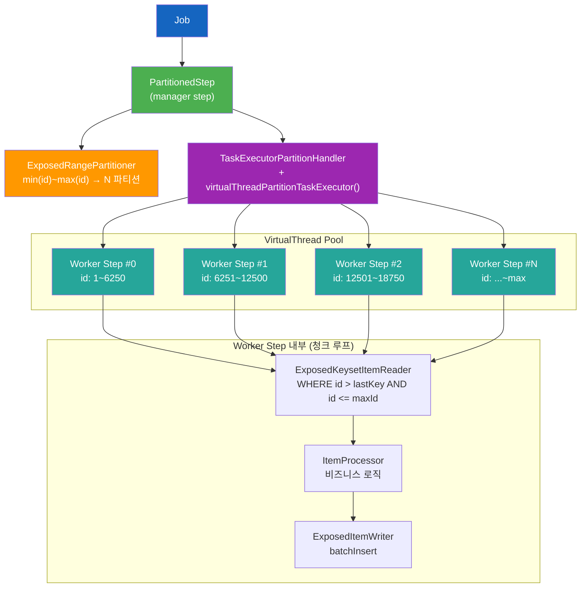
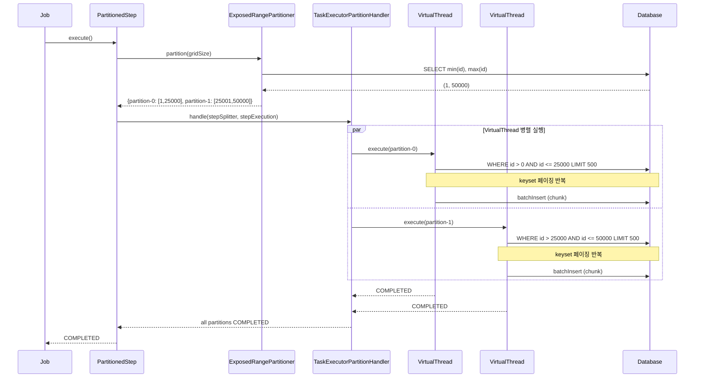
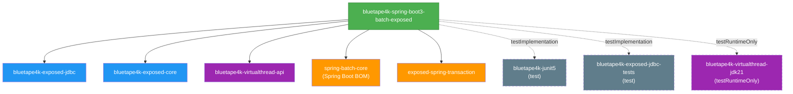
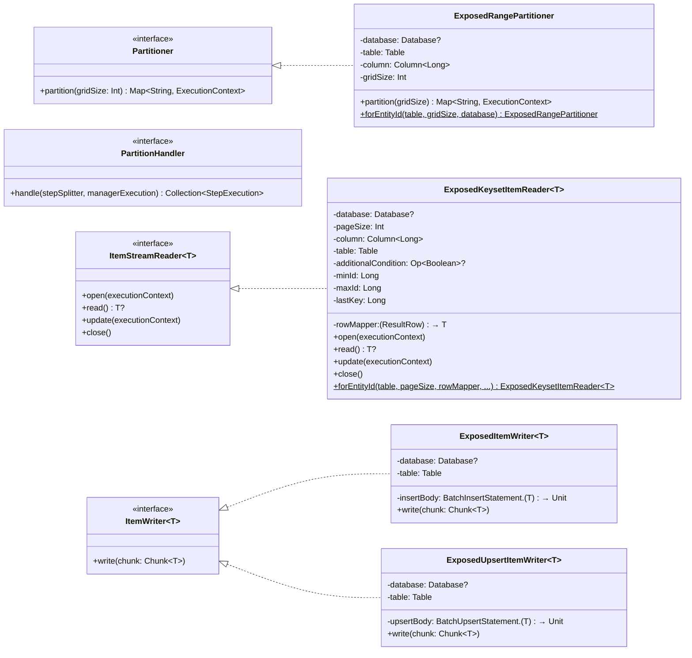

# bluetape4k-spring-boot3-batch-exposed 설계 스펙 (v2)

- 날짜: 2026-04-09
- 작성자: Claude Opus (via bluetape4k-design skill)
- 모듈: spring-boot3/batch-exposed → bluetape4k-spring-boot3-batch-exposed
- 기술 스택: Spring Batch 5.x + Exposed JDBC + Virtual Threads Parallel Query
- v2 변경: CursorItemReader 제거, Partitioned Step + VirtualThread Parallel Query 방향으로 재설계

---

## 1. 개요 및 설계 철학

### 1.1 핵심 아이디어: Virtual Threads의 강점 = Parallel Query

JDBC는 본질적으로 blocking I/O이다. 단일 스레드에서 아무리 빠른 쿼리를 실행해도, DB 응답을 기다리는 동안 스레드는 차단된다. Virtual Threads는 이 차단 비용을 플랫폼 스레드 수준에서 제거한다.

이 모듈의 핵심 전략은 **Partitioned Step + VirtualThread Parallel Query**이다:

```
전통적 방식:
  1개 Reader → 순차 쿼리 → 1 DB 커넥션 × N번 왕복 → 느림

Parallel Query 방식:
  N개 파티션 → 각각 VirtualThread → N개 동시 DB 쿼리 → 진정한 병렬 읽기
```

- auto-increment ID(또는 monotonic sequence)를 가진 테이블을 N개 ID 범위로 분할
- 각 파티션이 독립적인 VirtualThread에서 DB 쿼리를 실행
- 파티션별 독립 Reader/Writer 인스턴스 → thread-safety 문제 없음
- 플랫폼 스레드를 낭비하지 않으면서 높은 동시성 달성

### 1.2 전제 조건

| 조건 | 설명 |
|------|------|
| **unique key + auto increment** | 분할 기준 컬럼이 monotonic하게 증가해야 균등 분할 가능 |
| **HikariCP pool size** | 동시 파티션 수 이상의 커넥션 필요 (`maximumPoolSize >= gridSize`) |
| **읽기 시점 스냅샷** | 파티션 시작 전 min/max 결정 → 실행 중 대규모 insert/delete는 커버하지 않음 |

### 1.3 v1 스코프에서 의도적으로 제외한 것

> ⛔ **아래 항목들은 v1에서 구현하지 않는다. PR에 포함되어서는 안 된다.**

#### 제외 항목 상세

| # | 제외 항목 | 제외 이유 | v2 이후 계획 |
|---|-----------|-----------|-------------|
| 1 | **`ExposedCursorItemReader`** | Spring Batch 청크 트랜잭션과 DB 커넥션 생명주기 충돌 — Step 전체 동안 커넥션을 점유하는 구조는 청크 단위 커밋과 양립 불가 | 트랜잭션 경계 설계 확정 후 v2 재검토 |
| 2 | **Multi-threaded Step** (단일 Reader 공유) | thread-safety 달성을 위해 `synchronized read()` 외 별도 동기화 계층 필요 → Partitioned Step으로 완전 대체 | 불필요 (Partitioned Step이 상위 호환) |
| 3 | **R2DBC 지원** (`batch-exposed-r2dbc`) | Spring Batch 5.x는 R2DBC 청크 트랜잭션을 공식 지원하지 않음; `@EnableBatchProcessing` + R2DBC 조합은 미검증 | Spring Batch R2DBC 지원 성숙 후 별도 모듈 |
| 4 | **멀티-DB Writer** (Writer의 `database` 파라미터) | `SpringTransactionManager` 단일 DataSource 모델과 충돌 — Writer가 별도 DB에 직접 쓰면 청크 트랜잭션 롤백 범위 외부로 이탈 | v2에서 `ChainedTransactionManager` 또는 XA 트랜잭션 설계 후 검토 |
| 5 | **복합 키 / non-auto-increment 테이블** (`ExposedCompositeKeyPartitioner`) | 단조 증가 Long PK 없이는 균등 범위 분할 불가 | v2: 복합 키 해시 버킷 방식 또는 사용자 정의 분할 전략 |
| 6 | **Time-based UUID PK** (`Column<UUID>`, UUIDv7 등) | 단조 증가 UUID는 가능하나 범위 산술에 BigInteger(128비트) 필요 — v1 Long 기반 구조와 이질적 | v2: `forUuidColumn()` 팩토리, `ExecutionContext`에 UUID 문자열 저장 |
| 7 | **FlatFile / JSON 소스 Reader** | Spring Batch 내장 `FlatFileItemReader` + `ExposedItemWriter` 조합으로 충분 | 별도 모듈 불필요 |

### 1.4 Spring Batch를 선택한 이유

| 기준 | Spring Batch 5.x | 자체 구현 |
|------|------------------|-----------|
| API 친숙도 | Reader/Processor/Writer 패턴 | 학습 비용 발생 |
| 엔터프라이즈 기능 | Chunk 트랜잭션, Restart, Skip/Retry | 직접 구현 필요 |
| Partitioned Step | 내장 지원 (`PartitionHandler` + `Partitioner`) | 직접 구현 필요 |
| 테스트 인프라 | `@SpringBatchTest`, `JobLauncherTestUtils` | 직접 구축 |

---

## 2. 아키텍처

### 2.1 전체 실행 흐름



### 2.2 시퀀스 다이어그램



---

## 3. 모듈 구조

### 3.1 단일 모듈

```
spring-boot3/
└── batch-exposed/    → bluetape4k-spring-boot3-batch-exposed
```

### 3.2 의존 관계 다이어그램



> 실선 = `api`/`implementation`, 점선 = `testImplementation`/`testRuntimeOnly`

---

## 4. 핵심 API 설계

### 4.1 클래스 다이어그램



### 4.2 ExposedRangePartitioner

auto-increment PK/sequence 컬럼 기반으로 ID 범위를 N개 파티션으로 분할하는 `Partitioner`.

```kotlin
/**
 * auto-increment PK/sequence `Column<Long>` 컬럼 기반으로 ID 범위를 N개 파티션으로 분할하는 [Partitioner].
 *
 * 전제 조건:
 * - [column]은 `Column<Long>` 타입의 unique + auto-increment 또는 monotonic sequence여야 함
 * - `LongIdTable.id` (`Column<EntityID<Long>>`) 사용 시 `ExposedRangePartitioner.forEntityId(table)` 팩토리 사용
 * - 실행 중 대규모 insert/delete가 없는 상황에 적합
 *
 * 사용 예시:
 * ```kotlin
 * // Column<Long> 컬럼 직접 사용
 * val partitioner = ExposedRangePartitioner(
 *     table = SourceTable,
 *     column = SourceTable.longId,  // Column<Long>
 *     gridSize = 16,
 * )
 *
 * // LongIdTable (Column<EntityID<Long>>) 사용 시: forEntityId() 팩토리
 * val partitioner = ExposedRangePartitioner.forEntityId(
 *     table = SourceTable,  // IdTable<Long>
 *     gridSize = 16,
 * )
 * val partitions = partitioner.partition(16)
 * // {partition-0: {minId=1, maxId=6250}, partition-1: {minId=6251, maxId=12500}, ...}
 * ```
 *
 * @param database Exposed [Database] (null이면 SpringTransactionManager 활용)
 * @param table 파티션 대상 Exposed [Table]
 * @param column 분할 기준 `Column<Long>` 컬럼 (PK, auto-increment)
 * @param gridSize 파티션 수 (기본값: 8)
 */
class ExposedRangePartitioner(
    private val database: Database? = null,
    private val table: Table,
    private val column: Column<Long>,
    private val gridSize: Int = 8,
    // internal: min/max 조회 함수 (팩토리별 오버라이드 가능)
    private val selectMinMax: Transaction.() -> Pair<Long?, Long?> = {
        table.select(column.min(), column.max()).single()
            .let { it[column.min()] to it[column.max()] }
    },
) : Partitioner {

    companion object : KLogging() {
        /** ExecutionContext에 저장되는 파티션 시작 ID 키 */
        const val PARTITION_MIN_ID = "minId"
        /** ExecutionContext에 저장되는 파티션 종료 ID 키 */
        const val PARTITION_MAX_ID = "maxId"

        /**
         * `LongIdTable.id` (`Column<EntityID<Long>>`) 기반 파티셔너 팩토리.
         * EntityID-aware 비교로 인덱스 활용 (CAST 없음).
         *
         * ```kotlin
         * val partitioner = ExposedRangePartitioner.forEntityId(
         *     table = SourceTable,  // IdTable<Long>
         *     gridSize = 16,
         * )
         * ```
         */
        fun forEntityId(
            table: IdTable<Long>,
            gridSize: Int = 8,
            database: Database? = null,
        ): ExposedRangePartitioner = ExposedRangePartitioner(
            database = database,
            table = table,
            // Column<Long> 대리자: EntityID min/max를 Long으로 읽기 위한 내부 처리
            column = table.id.castTo<Long>(LongColumnType()),
            gridSize = gridSize,
            selectMinMax = {
                table.select(table.id.min(), table.id.max()).single().let { row ->
                    row[table.id.min()]?.value to row[table.id.max()]?.value
                }
            },
        )
    }

    override fun partition(gridSize: Int): Map<String, ExecutionContext> {
        val effectiveGridSize = if (gridSize > 0) gridSize else this.gridSize

        val (min, max) = transaction(database) { selectMinMax() }

        // 빈 테이블: 단일 빈 파티션 반환
        if (min == null || max == null) {
            return mapOf("partition-0" to ExecutionContext().apply {
                putLong(PARTITION_MIN_ID, 0L)
                putLong(PARTITION_MAX_ID, -1L)
            })
        }

        val totalRange = max - min + 1
        // Long 기준 계산으로 Int overflow 방지 (totalRange가 Int.MAX_VALUE를 초과할 수 있음)
        val safeGridSize = minOf(effectiveGridSize.toLong(), totalRange.coerceAtLeast(1L)).toInt()
        val rangeSize = totalRange / safeGridSize

        return (0 until safeGridSize).associate { i ->
            val partMinId = min + i * rangeSize
            val partMaxId = if (i == safeGridSize - 1) max else min + (i + 1) * rangeSize - 1

            "partition-$i" to ExecutionContext().apply {
                putLong(PARTITION_MIN_ID, partMinId)
                putLong(PARTITION_MAX_ID, partMaxId)
            }
        }
    }
}
```

**동작 원리**:
1. `SELECT min(id), max(id) FROM table` 실행
2. `(max - min + 1) / gridSize` 로 범위 크기 계산
3. 마지막 파티션은 나머지를 모두 포함 (`partMaxId = max`)
4. 각 파티션의 `minId`, `maxId`를 `ExecutionContext`에 저장

### 4.3 ExposedKeysetItemReader

Keyset 기반 페이지 읽기 Reader. OFFSET 없이 `WHERE id > lastKey` 방식으로 효율적인 페이징을 구현한다.

```kotlin
/**
 * Keyset 기반 페이지 읽기 [ItemStreamReader].
 *
 * - `WHERE [column] > lastKey AND [column] <= maxId ORDER BY [column] ASC LIMIT [pageSize]`
 * - lastKey를 [ExecutionContext]에 저장 → restart 시 마지막 위치부터 재개
 * - 파티션별 독립 인스턴스 → thread-safety 보장
 * - synchronized `read()` 구현 (Spring Batch 컨벤션 준수)
 *
 * 전제 조건:
 * - [column]은 unique + auto-increment. ORDER BY [column] ASC 필수
 * - 읽기 중 다른 트랜잭션의 insert는 누락될 수 있음 (처리 전 스냅샷 기준)
 *
 * ⚠️ `@StepScope` 필수: `open()`에서 `ExecutionContext`를 통해 minId/maxId를 읽으므로
 * Spring Batch Step 스코프에서 빈으로 등록해야 함.
 * ```kotlin
 * @Bean @StepScope
 * fun reader(...) = ExposedKeysetItemReader(...)
 * ```
 *
 * 사용 예시:
 * ```kotlin
 * // Column<Long> 직접 사용
 * val reader = ExposedKeysetItemReader(
 *     column = SourceTable.longId,  // Column<Long>
 *     table = SourceTable,
 *     pageSize = 500,
 *     rowMapper = { row -> SourceRow(row[SourceTable.longId], row[SourceTable.name]) },
 * )
 *
 * // LongIdTable.id (Column<EntityID<Long>>) 사용 시: forEntityId() 팩토리
 * val reader = ExposedKeysetItemReader.forEntityId(
 *     table = SourceTable,  // IdTable<Long>
 *     pageSize = 500,
 *     rowMapper = { row -> SourceRow(row[SourceTable.id].value, row[SourceTable.name]) },
 * )
 * ```
 *
 * @param T 반환 타입
 * @param database Exposed [Database] (null이면 SpringTransactionManager 현재 트랜잭션 참여)
 * @param pageSize 한 번에 읽을 레코드 수 (기본값: 500)
 * @param column keyset 기준 `Column<Long>` 컬럼 (auto-increment PK)
 * @param table Exposed [Table]
 * @param rowMapper [ResultRow] → T 변환 함수
 * @param keyExtractor [ResultRow]에서 keyset 컬럼 Long 값 추출. lastKey 추적에 사용
 * @param additionalCondition 추가 WHERE 조건 람다 (null이면 조건 없음)
 */
class ExposedKeysetItemReader<T>(
    private val database: Database? = null,
    private val pageSize: Int = 500,
    private val column: Column<Long>,
    private val table: Table,
    private val rowMapper: (ResultRow) -> T,
    // keyExtractor: ResultRow에서 keyset 컬럼 값(Long)을 추출. lastKey 추적에 사용.
    // rowMapper와 별도로 분리하여 T가 ID를 포함하지 않아도 동작.
    private val keyExtractor: (ResultRow) -> Long = { it[column] },
    // additionalCondition: 람다 DSL로 추가 WHERE 조건 지정 (null이면 적용 안 함)
    private val additionalCondition: (SqlExpressionBuilder.() -> Op<Boolean>)? = null,
) : ItemStreamReader<T>, InitializingBean {

    companion object : KLogging() {
        private const val LAST_KEY = "lastKey"

        /**
         * `LongIdTable.id` (`Column<EntityID<Long>>`) 기반 Reader 팩토리.
         * EntityID-aware WHERE 조건으로 인덱스 활용 (CAST 없음).
         *
         * ```kotlin
         * val reader = ExposedKeysetItemReader.forEntityId(
         *     table = SourceTable,  // IdTable<Long>
         *     pageSize = 500,
         *     rowMapper = { row -> SourceRow(row[SourceTable.id].value, row[SourceTable.name]) },
         * )
         * ```
         */
        fun <T> forEntityId(
            table: IdTable<Long>,
            pageSize: Int = 500,
            rowMapper: (ResultRow) -> T,
            keyExtractor: (ResultRow) -> Long = { it[table.id].value },
            additionalCondition: (SqlExpressionBuilder.() -> Op<Boolean>)? = null,
            database: Database? = null,
        ): ExposedKeysetItemReader<T> = ExposedKeysetItemReader(
            database = database,
            pageSize = pageSize,
            // EntityID → Long 캐스트는 팩토리 생성 시 1회만 수행; 쿼리 실행마다 castTo 불필요
            column = table.id.castTo<Long>(LongColumnType()),
            table = table,
            rowMapper = rowMapper,
            keyExtractor = keyExtractor,
            additionalCondition = additionalCondition,
        )
    }

    private var minId: Long = 0L
    private var maxId: Long = Long.MAX_VALUE
    private var lastKey: Long = 0L
    private val buffer: MutableList<T> = mutableListOf()
    private var bufferIndex: Int = 0
    private var exhausted: Boolean = false

    override fun afterPropertiesSet() {
        column.name.requireNotBlank("column")
        require(pageSize > 0) { "pageSize must be positive" }
    }

    override fun open(executionContext: ExecutionContext) {
        minId = executionContext.getLong(ExposedRangePartitioner.PARTITION_MIN_ID)
        maxId = executionContext.getLong(ExposedRangePartitioner.PARTITION_MAX_ID)

        // restart 시 마지막 위치 복원
        if (executionContext.containsKey(LAST_KEY)) {
            lastKey = executionContext.getLong(LAST_KEY)
        } else {
            lastKey = minId - 1  // 첫 읽기: minId부터 시작
        }
    }

    @Synchronized
    override fun read(): T? {
        if (exhausted) return null

        if (bufferIndex >= buffer.size) {
            fetchNextPage()
            if (buffer.isEmpty()) {
                exhausted = true
                return null
            }
        }

        return buffer[bufferIndex++]
    }

    override fun update(executionContext: ExecutionContext) {
        executionContext.putLong(LAST_KEY, lastKey)
    }

    override fun close() {
        buffer.clear()
        bufferIndex = 0
        exhausted = false
    }

    private fun fetchNextPage() {
        buffer.clear()
        bufferIndex = 0

        // Reader는 항상 독립 짧은 트랜잭션 — Spring Batch 청크 트랜잭션과 무관
        // column은 Column<Long>이므로 castTo 없이 직접 Long 비교 가능 → 인덱스 활용
        transaction(database) {
            var condition: Op<Boolean> = (column greater lastKey) and (column lessEq maxId)
            additionalCondition?.let { addCond -> condition = condition and SqlExpressionBuilder.addCond() }

            val resultRows = table.selectAll()
                .where { condition }
                .orderBy(column, SortOrder.ASC)
                .limit(pageSize)
                .toList()

            buffer.addAll(resultRows.map(rowMapper))

            if (resultRows.isNotEmpty()) {
                // keyExtractor로 마지막 행의 실제 ID 값을 추출 → ID gap 있어도 정확
                lastKey = keyExtractor(resultRows.last())
            }

            if (resultRows.size < pageSize) {
                exhausted = true  // 마지막 페이지
            }
        }
    }
}
```

**Restart 동작**:
1. `open()`: `ExecutionContext`에서 `lastKey` 복원
2. `read()`: `lastKey`부터 이어서 읽기
3. `update()`: 현재 `lastKey`를 `ExecutionContext`에 저장
4. 청크 커밋 시 `ExecutionContext`가 JobRepository에 저장됨

### 4.4 ExposedItemWriter (Spring 청크 트랜잭션 참여)

```kotlin
/**
 * Exposed `batchInsert` 기반 [ItemWriter].
 *
 * SpringTransactionManager 환경에서 Spring Batch 청크 트랜잭션에 자동 참여.
 * 별도 `transaction { }` 블록 불필요.
 *
 * 사용 예시:
 * ```kotlin
 * val writer = ExposedItemWriter(table = TargetTable) {
 *     this[TargetTable.name] = it.name
 *     this[TargetTable.value] = it.value
 * }
 * ```
 *
 * v1 스코프: Spring-managed 청크 트랜잭션만 지원. 멀티-DB는 v2에서 검토.
 *
 * @param T 입력 타입
 * @param table 대상 Exposed [Table]
 * @param insertBody `batchInsert` 람다
 */
class ExposedItemWriter<T>(
    private val table: Table,
    private val insertBody: BatchInsertStatement.(T) -> Unit,
) : ItemWriter<T> {

    companion object : KLogging()

    override fun write(chunk: Chunk<out T>) {
        if (chunk.isEmpty) return

        // SpringTransactionManager 환경에서는 현재 Spring 트랜잭션에 자동 참여
        table.batchInsert(chunk.items, shouldReturnGeneratedValues = false) { item ->
            insertBody(item)
        }

        log.debug { "${chunk.items.size}건 batchInsert 완료 (table=${table.tableName})" }
    }
}
```

### 4.5 ExposedUpsertItemWriter

```kotlin
/**
 * Exposed `batchUpsert` 기반 [ItemWriter].
 *
 * 동일 키가 존재하면 UPDATE, 없으면 INSERT를 수행.
 * SpringTransactionManager 환경에서 청크 트랜잭션에 자동 참여.
 *
 * v1 스코프: Spring-managed 청크 트랜잭션만 지원.
 *
 * @param T 입력 타입
 * @param table 대상 Exposed [Table]
 * @param upsertBody `batchUpsert` 람다 (Exposed v1: `BatchUpsertStatement` receiver)
 */
class ExposedUpsertItemWriter<T>(
    private val table: Table,
    private val upsertBody: BatchUpsertStatement.(T) -> Unit,
) : ItemWriter<T> {

    companion object : KLogging()

    override fun write(chunk: Chunk<out T>) {
        if (chunk.isEmpty) return

        table.batchUpsert(chunk.items) { item ->
            upsertBody(item)
        }

        log.debug { "${chunk.items.size}건 batchUpsert 완료 (table=${table.tableName})" }
    }
}
```

### 4.6 ExposedUpdateItemWriter

```kotlin
/**
 * Exposed `update` 기반 [ItemWriter].
 *
 * 기존 레코드를 업데이트할 때 사용. 각 아이템에 대해 개별 UPDATE 실행.
 *
 * v1 스코프: Spring-managed 청크 트랜잭션만 지원.
 *
 * @param T 입력 타입
 * @param table 대상 Exposed [Table]
 * @param keyColumn WHERE 조건에 사용할 키 컬럼
 * @param keyExtractor T에서 키 값을 추출하는 함수
 * @param updateBody UPDATE SET 람다
 */
class ExposedUpdateItemWriter<T>(
    private val table: Table,
    private val keyColumn: Column<Long>,
    private val keyExtractor: (T) -> Long,
    private val updateBody: UpdateBuilder<*>.(T) -> Unit,
) : ItemWriter<T> {

    companion object : KLogging()

    override fun write(chunk: Chunk<out T>) {
        if (chunk.isEmpty) return

        chunk.items.forEach { item ->
            table.update({ keyColumn eq keyExtractor(item) }) {
                this.updateBody(item)
            }
        }

        log.debug { "${chunk.items.size}건 update 완료 (table=${table.tableName})" }
    }
}
```

### 4.7 VirtualThread TaskExecutor (PartitionHandler 팩토리)

> **설계 결정**: `PartitionHandler`를 직접 구현하지 않는다.
> Spring Batch의 `TaskExecutorPartitionHandler`가 step execution 상태 반영,
> exception propagation, cancellation, JobRepository update 등 복잡한 계약을 이미 처리한다.
> 커스텀 구현은 이 계약을 다시 맞춰야 하므로 위험하다.
>
> 대신 **`TaskExecutorPartitionHandler` + VirtualThread `TaskExecutor` 조합**을 제공한다.

```kotlin
/**
 * VirtualThread 기반 [TaskExecutor]를 생성하는 팩토리 함수.
 *
 * [TaskExecutorPartitionHandler]에 주입하여 각 파티션을 VirtualThread에서 병렬 실행.
 *
 * @param threadNamePrefix VirtualThread 이름 접두사
 * @param concurrencyLimit 동시 실행 파티션 수 (기본값: availableProcessors * 2)
 */
fun virtualThreadPartitionTaskExecutor(
    threadNamePrefix: String = "batch-partition-",
    concurrencyLimit: Int = Runtime.getRuntime().availableProcessors() * 2,
): TaskExecutor = SimpleAsyncTaskExecutor(threadNamePrefix).apply {
    setVirtualThreads(true)
    setConcurrencyLimit(concurrencyLimit)
}

// 사용 예시 — TaskExecutorPartitionHandler에 주입
val partitionHandler = TaskExecutorPartitionHandler().apply {
    setStep(workerStep)
    setTaskExecutor(virtualThreadPartitionTaskExecutor(concurrencyLimit = 16))
    gridSize = 16
}
```

### 4.8 Spring Boot AutoConfiguration

```kotlin
/**
 * Spring Boot Auto-Configuration for Exposed Batch components.
 *
 * 주의: `@EnableBatchProcessing` 절대 사용 금지 — Spring Boot 3.x auto-config 무력화.
 *
 * ⚠️ `spring.batch.job.enabled=false` 설정 권장:
 * ```yaml
 * spring:
 *   batch:
 *     job:
 *       enabled: false  # 자동 실행 비활성화 — 명시적 JobLauncher 사용 권장
 * ```
 */
@AutoConfiguration(after = [BatchAutoConfiguration::class])
@ConditionalOnClass(Job::class)
@ConditionalOnBean(DataSource::class, PlatformTransactionManager::class)
class ExposedBatchAutoConfiguration {

    companion object : KLogging()

    /**
     * 배치 파티션 실행용 VirtualThread TaskExecutor.
     * 사용자가 직접 빈을 등록하면 이 기본 빈은 생성되지 않음.
     */
    @Bean
    @ConditionalOnMissingBean(name = ["batchPartitionTaskExecutor"])
    fun batchPartitionTaskExecutor(): TaskExecutor =
        SimpleAsyncTaskExecutor("batch-partition-").apply {
            setVirtualThreads(true)
            setConcurrencyLimit(Runtime.getRuntime().availableProcessors() * 2)
        }
}
```

### 4.9 Kotlin DSL 확장

```kotlin
/**
 * Partitioned Batch Job을 간결하게 생성하는 DSL 확장.
 *
 * 사용 예시:
 * ```kotlin
 * val job = partitionedBatchJob("parallel-migrate", jobRepository) {
 *     start(partitionedStep)
 * }
 * ```
 */
fun partitionedBatchJob(
    name: String,
    jobRepository: JobRepository,
    block: JobBuilder.() -> SimpleJobBuilder,
): Job = JobBuilder(name, jobRepository).block().build()

/**
 * Exposed Partitioned Step을 생성하는 DSL 확장.
 */
fun StepBuilder.exposedPartitionedStep(
    partitioner: ExposedRangePartitioner,
    handler: PartitionHandler,
): Step = this.partitioner("worker", partitioner)
    .partitionHandler(handler)
    .build()
```

---

## 5. 패키지 구조

```
io.bluetape4k.spring.batch.exposed/
├── partition/
│   └── ExposedRangePartitioner.kt        // ID 범위 기반 파티셔너
├── reader/
│   └── ExposedKeysetItemReader.kt        // Keyset 페이징 Reader
├── writer/
│   ├── ExposedItemWriter.kt              // batchInsert Writer
│   ├── ExposedUpsertItemWriter.kt        // batchUpsert Writer
│   └── ExposedUpdateItemWriter.kt        // 개별 update Writer
├── support/
│   └── VirtualThreadPartitionSupport.kt  // virtualThreadPartitionTaskExecutor() 팩토리 함수
├── config/
│   └── ExposedBatchAutoConfiguration.kt  // Spring Boot AutoConfiguration
├── dsl/
│   └── BatchJobExtensions.kt             // Kotlin DSL 확장 함수
└── resources/
    └── META-INF/spring/org.springframework.boot.autoconfigure.AutoConfiguration.imports
```

---

## 6. 트랜잭션 설계

### 6.1 Reader 트랜잭션

```
ExposedKeysetItemReader.fetchNextPage():
  ┌─ transaction(database) { ... } ─┐
  │  SELECT * FROM source             │
  │  WHERE id > :lastKey              │
  │  AND id <= :maxId                 │
  │  ORDER BY id ASC LIMIT :pageSize  │
  └────────────────────────────────────┘
  → 각 page read는 단독 짧은 트랜잭션
  → Spring Batch 청크 트랜잭션과 독립
  → 커넥션 즉시 반환 → pool 압박 최소화
```

### 6.2 Writer 트랜잭션

```
ExposedItemWriter.write():
  ┌─ Spring Batch 청크 트랜잭션 ─────────────────┐
  │  // SpringTransactionManager 환경에서          │
  │  // 현재 Spring 트랜잭션에 자동 참여           │
  │  table.batchInsert(chunk.items) { ... }       │
  │                                                │
  │  // 청크 실패 시 Spring이 자동 rollback        │
  └────────────────────────────────────────────────┘
```

### 6.3 파티션 격리

```
Partition #0 ─── VirtualThread #0 ─── HikariCP Connection #A
Partition #1 ─── VirtualThread #1 ─── HikariCP Connection #B
Partition #2 ─── VirtualThread #2 ─── HikariCP Connection #C
...
Partition #N ─── VirtualThread #N ─── HikariCP Connection #N

→ 각 파티션이 독립적인 커넥션/트랜잭션 사용
→ HikariCP pool size ≥ 동시 파티션 수 권장
→ pool size 부족 시 파티션이 커넥션 대기 (deadlock 아님, 단순 지연)
```

### 6.4 database 파라미터 전략 (v1)

**Reader** (`ExposedKeysetItemReader`):
- `database = null` → `TransactionManager.defaultDatabase` 사용 (Exposed 전역 설정)
- `database = 명시적 지정` → 해당 Database의 커넥션으로 독립 read transaction
- **항상 독립 짧은 트랜잭션** — Spring Batch 청크 트랜잭션과 무관

**Writer** (`ExposedItemWriter` / `ExposedUpsertItemWriter` / `ExposedUpdateItemWriter`):
- v1에서는 `database` 파라미터 없음 — **Spring-managed 청크 트랜잭션 전용**
- `exposed-spring-transaction`의 `SpringTransactionManager`를 통해 자동 참여
- 멀티-DB 지원은 v2에서 검토

> **설계 원칙**: Reader와 Writer의 트랜잭션은 완전히 분리된다.
> Reader는 읽기 전용 독립 트랜잭션, Writer는 Spring Batch 청크 트랜잭션에만 참여.

---

## 7. build.gradle.kts

```kotlin
plugins {
    kotlin("plugin.spring")
}

configurations {
    testImplementation.get().extendsFrom(compileOnly.get(), runtimeOnly.get())
}

dependencies {
    // Core
    api(Libs.kotlin_reflect)
    api(project(":bluetape4k-exposed-jdbc"))
    api(project(":bluetape4k-exposed-core"))
    api(project(":bluetape4k-virtualthread-api"))

    // Exposed
    api(Libs.exposed_spring_transaction)
    api(Libs.exposed_core)
    api(Libs.exposed_jdbc)
    api(Libs.exposed_java_time)

    // Spring Batch (Spring Boot BOM 버전 관리)
    api(Libs.springBootStarter("batch"))
    compileOnly(Libs.springBoot("autoconfigure"))

    // Test
    testImplementation(project(":bluetape4k-junit5"))
    testImplementation(project(":bluetape4k-exposed-jdbc-tests"))
    testImplementation(project(":bluetape4k-virtualthread-jdk21"))
    testImplementation(Libs.springBootStarter("test"))
    testImplementation(Libs.spring_batch_test)
    testImplementation(Libs.h2_v2)
    testImplementation(Libs.hikaricp)
    testImplementation(Libs.testcontainers_postgresql)
    testImplementation(Libs.postgresql_driver)
}
```

### 7.1 Libs.kt 추가 필요

```kotlin
// Spring Batch Test
val spring_batch_test = "org.springframework.batch:spring-batch-test"  // Spring Boot BOM 버전 관리
```

---

## 8. 테스트 전략

### 8.1 단위 테스트 (H2)

| 테스트 클래스 | 검증 내용 |
|--------------|----------|
| `ExposedRangePartitionerTest` | min/max 조회, N개 파티션 균등 분할, 빈 테이블 처리, 단일 행 테이블 |
| `ExposedKeysetItemReaderTest` | keyset 읽기 정상 동작, 빈 파티션 → null 반환, restart 재개 검증 |
| `ExposedItemWriterTest` | batchInsert 정상 동작, 빈 chunk 무시, Spring 트랜잭션 rollback 검증 |
| `ExposedUpsertItemWriterTest` | 신규 insert + 기존 update 동작 검증 |
| `ExposedUpdateItemWriterTest` | UPDATE 정확성, Spring 트랜잭션 rollback 검증 |

### 8.2 통합 테스트 (Testcontainers PostgreSQL)

| 테스트 클래스 | 검증 내용 |
|--------------|----------|
| `ParallelQueryIntegrationTest` | 100,000건 Source → Target, 16 파티션 VirtualThread 병렬, 데이터 정합성 |
| `RestartIntegrationTest` | 중간 실패 후 Job 재시작, lastKey 기반 정확한 재개 |
| `EndToEndJobTest` | Spring Boot 통합: AutoConfiguration, Job 실행, 결과 검증 |

### 8.3 Benchmark (CI 분리)

```kotlin
@Tag("benchmark")
class ParallelQueryBenchmarkTest {
    // 파티션 수(1, 4, 8, 16)별 처리 시간 측정
    // HikariCP pool size 최적화 지침 도출
    // 결과를 docs/benchmarks/ 에 기록
}
```

### 8.4 테스트 공통 인프라

```kotlin
// 테스트용 Exposed Table 정의
object SourceTable : LongIdTable("source_data") {
    val name = varchar("name", 255)
    val value = integer("value")
    val createdAt = datetime("created_at").defaultExpression(CurrentDateTime)
}

object TargetTable : LongIdTable("target_data") {
    val sourceName = varchar("source_name", 255)
    val transformedValue = integer("transformed_value")
}

// 대량 테스트 데이터 생성 헬퍼
fun insertTestData(count: Int) {
    transaction {
        SourceTable.batchInsert((1..count).toList()) { i ->
            this[SourceTable.name] = "item-$i"
            this[SourceTable.value] = i
        }
    }
}
```

---

## 9. 향후 계획

| 항목 | 시기 | 설명 |
|------|------|------|
| `spring-boot4/batch-exposed` | v2 | 동일 패키지/API, Spring Boot 4 BOM 사용 |
| `ExposedCursorItemReader` | v2 | 트랜잭션 경계 설계 확정 후 재검토 |
| S3 output | 필요 시 | Spring Cloud AWS `S3ItemWriter` 활용 (별도 모듈) |
| `ExposedCompositeKeyPartitioner` | v2 | 복합 키 테이블 지원 (non-auto-increment) |
| 모니터링 통합 | v2 | Micrometer 메트릭 (파티션별 처리 시간, 행 수) |
| Time-based UUID PK 지원 | v2 | UUIDv7 등 단조 증가 UUID — `forUuidColumn()` 팩토리 추가, BigInteger 범위 산술, `ExecutionContext`에 UUID 문자열 저장 |

---

## 10. 태스크 목록

### Phase 1: 프로젝트 설정 (2건)

| ID | 우선순위 | 태스크 | 상세 |
|----|---------|--------|------|
| T1.1 | low | 폴더 생성 + build.gradle.kts | `spring-boot3/batch-exposed/` 생성, 의존성 설정 |
| T1.2 | low | Libs.kt 상수 추가 | `spring_batch_test` 추가 |

### Phase 2: 핵심 구현 (9건)

| ID | 우선순위 | 태스크 | 상세 |
|----|---------|--------|------|
| T2.1 | high | ExposedRangePartitioner | min/max 쿼리, 균등 분할, 빈 테이블 처리 |
| T2.2 | high | ExposedKeysetItemReader | keyset 읽기, ExecutionContext restart, synchronized read() |
| T2.3 | high | `virtualThreadPartitionTaskExecutor()` 팩토리 함수 | SimpleAsyncTaskExecutor VirtualThread TaskExecutor 생성 |
| T2.4 | medium | ExposedItemWriter | batchInsert, Spring 트랜잭션 자동 참여 |
| T2.5 | medium | ExposedUpsertItemWriter | batchUpsert, 동일 키 update/insert |
| T2.5b | medium | ExposedUpdateItemWriter | Table.update, Spring 청크 트랜잭션 참여 |
| T2.6 | medium | ExposedBatchAutoConfiguration | Spring Boot auto-config, TaskExecutor 빈 |
| T2.6b | low | META-INF AutoConfiguration 등록 | `META-INF/spring/org.springframework.boot.autoconfigure.AutoConfiguration.imports` 파일 등록 |
| T2.7 | medium | Kotlin DSL 확장 | `partitionedBatchJob`, `exposedPartitionedStep` |

### Phase 3: 테스트 (5건)

| ID | 우선순위 | 태스크 | 상세 |
|----|---------|--------|------|
| T3.1 | medium | ExposedRangePartitionerTest | H2, 균등 분할, 빈 테이블, 단일 행 |
| T3.2 | medium | ExposedKeysetItemReaderTest | H2, keyset 읽기, restart 시나리오 |
| T3.3 | medium | ExposedItemWriterTest | Spring 트랜잭션 rollback, 빈 chunk |
| T3.3b | medium | ExposedUpdateItemWriterTest | UPDATE 정확성, Spring 트랜잭션 rollback 검증 |
| T3.4 | high | ParallelQueryIntegrationTest | Testcontainers PostgreSQL, 16 파티션, 데이터 정합성 |

### Phase 4: 마무리 (5건)

| ID | 우선순위 | 태스크 | 상세 |
|----|---------|--------|------|
| T4.1 | low | 한국어 KDoc 전체 | 모든 public 클래스/함수에 한국어 KDoc |
| T4.2 | low | README.md + README.ko.md | 모듈 문서 (Architecture→UML→Features→Examples) |
| T4.3 | low | CLAUDE.md 업데이트 | 신규 모듈 정보 추가 |
| T4.4 | low | superpowers index 항목 추가 | `docs/superpowers/index/2026-04.md` |
| T4.5 | low | 커밋 | `feat: bluetape4k-spring-boot3-batch-exposed 모듈 추가` |

---

## 부록 A: End-to-End 사용 예시

### A.1 Source → Target 마이그레이션 (100K 행, 16 파티션)

```kotlin
@Configuration
class MigrationJobConfig(
    private val jobRepository: JobRepository,
    private val transactionManager: PlatformTransactionManager,
    private val database: Database,
) {

    /**
     * Source 테이블에서 Target 테이블로 데이터를 마이그레이션하는 Job.
     * 16개 파티션으로 분할하여 VirtualThread에서 병렬 실행.
     */
    @Bean
    fun migrationJob(): Job = partitionedBatchJob("migration-job", jobRepository) {
        start(partitionedStep())
    }

    @Bean
    fun partitionedStep(): Step = StepBuilder("migration-manager", jobRepository)
        .partitioner("migration-worker", rangePartitioner())
        .partitionHandler(partitionHandler())
        .build()

    @Bean
    // LongIdTable.id 사용 시 forEntityId() 팩토리로 EntityID-aware 비교 (CAST 없음)
    fun rangePartitioner(): ExposedRangePartitioner = ExposedRangePartitioner.forEntityId(
        table = SourceTable,  // IdTable<Long>
        gridSize = 16,
        database = database,
    )

    @Bean
    fun partitionHandler(): TaskExecutorPartitionHandler = TaskExecutorPartitionHandler().apply {
        setStep(workerStep())
        setTaskExecutor(virtualThreadPartitionTaskExecutor(concurrencyLimit = 16))
        gridSize = 16
    }

    @Bean
    fun workerStep(): Step = StepBuilder("migration-worker", jobRepository)
        .chunk<SourceRecord, TargetRecord>(500, transactionManager)
        .reader(keysetReader())
        .processor(ItemProcessor { source ->
            TargetRecord(
                sourceName = source.name.uppercase(),
                transformedValue = source.value * 2,
            )
        })
        .writer(itemWriter())
        .build()

    @Bean
    @StepScope
    // LongIdTable.id 사용 시 forEntityId() 팩토리 사용
    fun keysetReader(): ExposedKeysetItemReader<SourceRecord> = ExposedKeysetItemReader.forEntityId(
        table = SourceTable,  // IdTable<Long>
        pageSize = 500,
        rowMapper = { row ->
            SourceRecord(
                id = row[SourceTable.id].value,
                name = row[SourceTable.name],
                value = row[SourceTable.value],
            )
        },
        database = database,
    )

    @Bean
    fun itemWriter(): ExposedItemWriter<TargetRecord> = ExposedItemWriter(
        table = TargetTable,
    ) {
        this[TargetTable.sourceName] = it.sourceName
        this[TargetTable.transformedValue] = it.transformedValue
    }
}

// Data classes
data class SourceRecord(
    val id: Long = 0L,
    val name: String,
    val value: Int,
) : Serializable {
    companion object : KLogging() {
        private const val serialVersionUID = 1L
    }
}

data class TargetRecord(
    val sourceName: String,
    val transformedValue: Int,
) : Serializable {
    companion object : KLogging() {
        private const val serialVersionUID = 1L
    }
}
```

### A.2 application.yml 설정

```yaml
spring:
  batch:
    jdbc:
      initialize-schema: always  # 개발 환경
    job:
      enabled: false  # 수동 실행 (JobLauncher 사용)

  datasource:
    hikari:
      maximum-pool-size: 20  # ≥ 파티션 수 (16) + 여유
      minimum-idle: 8
      connection-timeout: 30000
```

### A.3 Restart 시나리오

```kotlin
@Test
fun `중간 실패 후 재시작 시 마지막 위치부터 재개`() {
    // Arrange: 10,000건 Source 데이터 삽입
    insertTestData(10_000)

    // Act 1: Processor에서 5,000번째에서 의도적 예외 발생
    val failingProcessor = ItemProcessor<SourceRecord, TargetRecord> { source ->
        if (source.id == 5000L) throw RuntimeException("의도적 실패")
        source.toTarget()
    }
    val execution1 = jobLauncher.run(migrationJob, jobParameters)

    // Assert 1: Job FAILED, ~4,999건 처리됨
    assertThat(execution1.status).isEqualTo(BatchStatus.FAILED)

    // Act 2: Processor 정상으로 교체 후 재시작
    val execution2 = jobLauncher.run(migrationJob, jobParameters)

    // Assert 2: Job COMPLETED, 10,000건 전체 처리됨
    assertThat(execution2.status).isEqualTo(BatchStatus.COMPLETED)
    assertThat(countTargetRows()).isEqualTo(10_000)
}
```

---

## 부록 B: 성능 가이드

### B.1 파티션 수 결정

| 데이터 규모 | 권장 파티션 수 | HikariCP pool size |
|-------------|---------------|---------------------|
| < 10,000 | 1~2 (오버헤드가 이점보다 큼) | 5 |
| 10,000~100,000 | 4~8 | 10~15 |
| 100,000~1,000,000 | 8~16 | 20~25 |
| > 1,000,000 | 16~32 | 35~40 |

### B.2 pageSize 결정

- **기본값: 500** — 대부분의 경우 적절
- 행 크기가 큰 경우 (BLOB, TEXT): 100~200
- 행 크기가 작은 경우 (PK + 몇 개 컬럼): 1000~2000
- DB 네트워크 왕복 비용이 클수록 pageSize를 키울 것

### B.3 주의사항

- **synchronized pinning**: JDK 21에서 `synchronized` 블록 내 blocking 호출은 carrier thread를 고정(pin)할 수 있음. JDK 25에서는 해결됨. JDK 21 환경에서는 파티션 수를 플랫폼 스레드 수 이하로 제한 권장
- **HikariCP pool exhaustion**: `concurrencyLimit > maximumPoolSize`이면 파티션이 커넥션 대기. deadlock은 아니지만 성능 저하 발생
- **ID 분포 불균형**: auto-increment이더라도 대량 DELETE 후에는 파티션 간 행 수 편차 발생 가능. 이 경우 `ExposedCountBasedPartitioner` (향후 구현) 고려
