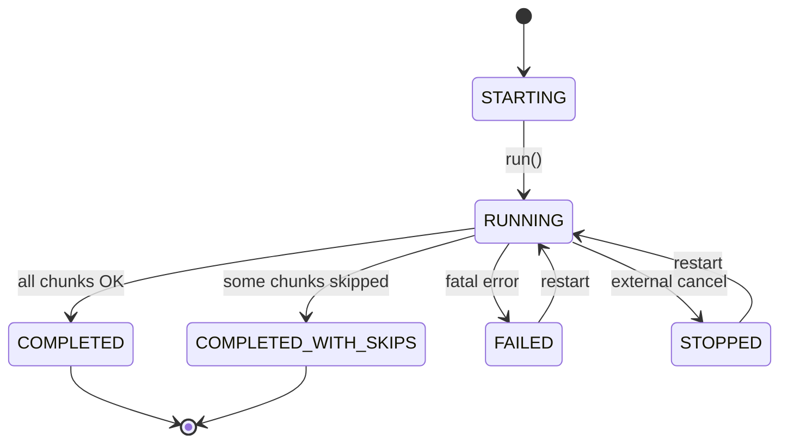
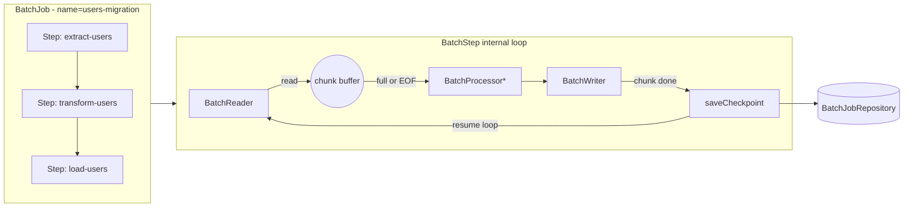
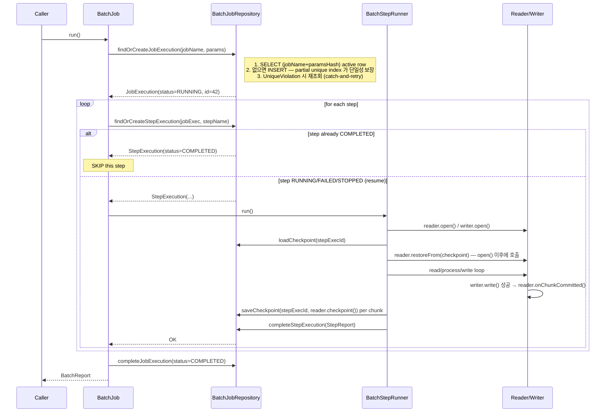
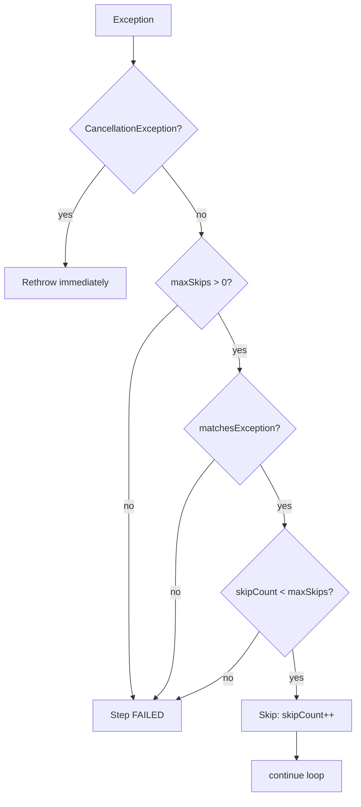

# bluetape4k-batch 모듈 설계 스펙

> **작성일**: 2026-04-10
> **상태**: Draft v4 (P1-A/P1-B 수정 반영)
> **대상**: bluetape4k-projects `utils/batch/` (→ `bluetape4k-batch`)
> **레퍼런스**: [j-easy/easy-batch](https://github.com/j-easy/easy-batch) (영감), Spring Batch (JobRepository 모델)

---

## 1. 개요

### 1.1 목적

`utils/batch` 는 **Kotlin Coroutine 네이티브**로 설계한 경량 배치 처리 프레임워크이다.
Spring Batch가 Spring·Java 중심의 무거운 스택 전체를 끌어들이는 반면, 본 모듈은
다음 원칙을 따른다.

- **No Spring** — 순수 Kotlin + Coroutines + (optional) Exposed
- **No runBlocking** — 모든 I/O 경계는 `suspend`, blocking JDBC 는 `withContext(Dispatchers.VT)` 로 감싼다
- **단일 API, 이중 백엔드** — `BatchReader<T>` / `BatchWriter<T>` 추상화를 통해
  사용자는 JDBC / R2DBC 구현의 내부 차이를 의식하지 않는다.
- **Pluggable Restart** — Spring Batch와 유사한 `JobRepository` 를 직접 구현하여
  체크포인트 기반 재시작을 지원하되, 테이블 스키마·실행 엔진 모두 단순화한다.
- **Workflow 통합 (hard dependency)** — `BatchJob` 은 `SuspendWork` 를 구현하고
  `BatchStep` 은 `utils/workflow` 의 `RetryPolicy` 를 직접 사용한다. 따라서 Workflow 의존성은
  `api(project(":bluetape4k-workflow"))` 로 노출된다.
- **easy-batch 영감** — `RecordReader → RecordProcessor → RecordWriter` 파이프라인을
  **chunk 기반**으로 단순화 (`BatchReader → BatchProcessor(optional) → BatchWriter`).

### 1.2 설계 철학

| 원칙 | 설명 |
|------|------|
| Coroutine-First | `open()` / `read()` / `write()` / `close()` 모두 `suspend`. blocking JDBC 호출은 `withContext(Dispatchers.VT) { transaction(database) { ... } }` 패턴으로 감싼다 |
| 구현 교체 가능성 | `compileOnly` 로 Exposed JDBC·R2DBC 의존성을 두어 사용자가 선택 |
| Chunk 기반 | Reader 가 `null` 을 리턴할 때까지 1건씩 읽어 `chunkSize` 만큼 모아 Processor → Writer 로 전달 |
| Restartable | 각 chunk 처리 완료 시 `checkpoint` 를 저장하여, 장애 시 마지막 keyset 이후부터 재개 |
| 가벼운 Job 모델 | Spring Batch 의 `JobLauncher / JobExplorer / StepBuilder` 등은 제공하지 않고, `batchJob { }.run()` 또는 `workflow` 내부 임베딩만 지원 |

### 1.3 범위

| 범위 | 포함 여부 |
|------|:---------:|
| `BatchReader` / `BatchProcessor` / `BatchWriter` 추상 | O |
| Chunk 기반 실행 엔진 | O |
| `BatchStep` 다중 스텝 순차 실행 | O |
| JDBC Cursor Reader (Exposed) | O |
| R2DBC Keyset Reader (Exposed) | O |
| JDBC / R2DBC Writer (batchInsert / upsert) | O |
| `BatchJobRepository` + Exposed 테이블 (JDBC + R2DBC 구현) | O |
| Checkpoint 기반 재시작 | O |
| SkipPolicy / RetryPolicy | O |
| `BatchJob implements SuspendWork` 연동 | O |
| Spring Batch 의존성 | **X** |
| JobLauncher/JobExplorer/ItemStream 등 Spring Batch 호환 레이어 | **X** |
| Partitioning (step 내부 병렬) — **v2 로 미룸** | X |
| JMS/파일/REST Reader-Writer | X (사용자 확장) |

---

## 2. 모듈 구조

auto-registered 이름: `bluetape4k-batch` (from `settings.gradle.kts` `includeModules("utils", withBaseDir = false)`)

```
utils/batch/
├── build.gradle.kts
├── README.md
├── README.ko.md
└── src/
    ├── main/kotlin/io/bluetape4k/batch/
    │   ├── BatchDefaults.kt
    │   ├── api/                             # 핵심 추상화 (JDBC/R2DBC 의존성 없음)
    │   │   ├── BatchReader.kt
    │   │   ├── BatchProcessor.kt
    │   │   ├── BatchWriter.kt
    │   │   ├── BatchStatus.kt
    │   │   ├── BatchReport.kt
    │   │   ├── StepReport.kt
    │   │   ├── JobExecution.kt
    │   │   ├── StepExecution.kt
    │   │   ├── SkipPolicy.kt
    │   │   ├── BatchStepFailedException.kt
    │   │   └── BatchJobRepository.kt
    │   ├── core/                            # 실행 엔진 + DSL (JDBC/R2DBC 무관)
    │   │   ├── BatchStep.kt
    │   │   ├── BatchJob.kt
    │   │   ├── BatchStepRunner.kt           # chunk 루프
    │   │   ├── InMemoryBatchJobRepository.kt
    │   │   └── dsl/
    │   │       ├── BatchJobBuilder.kt
    │   │       ├── BatchStepBuilder.kt
    │   │       └── BatchDsl.kt              # @BatchDsl marker + batchJob(), step()
    │   ├── jdbc/                            # compileOnly(exposed-jdbc)
    │   │   ├── ExposedJdbcBatchReader.kt
    │   │   ├── ExposedJdbcBatchWriter.kt
    │   │   ├── ExposedJdbcBatchJobRepository.kt
    │   │   └── tables/
    │   │       ├── BatchJobExecutionTable.kt
    │   │       └── BatchStepExecutionTable.kt
    │   ├── r2dbc/                           # compileOnly(exposed-r2dbc)
    │   │   ├── ExposedR2dbcBatchReader.kt
    │   │   ├── ExposedR2dbcBatchWriter.kt
    │   │   └── ExposedR2dbcBatchJobRepository.kt
    │   └── internal/
    │       └── CheckpointJson.kt            # Jackson serialize checkpoint (optional)
    └── test/kotlin/io/bluetape4k/batch/
        ├── api/
        ├── core/
        ├── jdbc/                            # H2 integration
        ├── r2dbc/                           # H2 R2DBC integration
        └── workflow/
```

### 2.1 Package convention

- `io.bluetape4k.batch.api.*` — 인터페이스·값 객체 (JDBC/R2DBC 없이 import 가능)
- `io.bluetape4k.batch.core.*` — 실행 엔진 + DSL (Workflow 필수 의존)
- `io.bluetape4k.batch.jdbc.*` — Exposed JDBC 기반 구현체
- `io.bluetape4k.batch.r2dbc.*` — Exposed R2DBC 기반 구현체

> Workflow 연동은 별도 패키지를 두지 않고 `core/BatchJob.kt` 가 `SuspendWork` 를 직접 구현한다.

---

## 3. 핵심 인터페이스 (`api/`)

### 3.1 BatchReader (체크포인트 내장, 단일 정의)

```kotlin
package io.bluetape4k.batch.api

/**
 * 배치 입력 읽기 추상화.
 *
 * 구현체는 내부 상태(cursor, keyset 등)를 유지하며 [read] 호출 시 다음 아이템을 1개 반환한다.
 * 읽을 데이터가 없으면 `null` 을 반환하여 스트림 종료를 알린다.
 *
 * [open] / [close] 는 한 Step 의 라이프사이클 동안 한 번씩 호출된다.
 *
 * ## Checkpoint
 * [checkpoint] 는 "다음 호출 시 어디서부터 읽을지" 를 나타내는 임의 객체를 반환한다.
 * 재시작 시 [BatchJobRepository] 에서 저장된 checkpoint 를 읽어 [restoreFrom] 으로 복구한다.
 *
 * 구현 예:
 * - [io.bluetape4k.batch.jdbc.ExposedJdbcBatchReader] — keyset pagination (JDBC)
 * - [io.bluetape4k.batch.r2dbc.ExposedR2dbcBatchReader] — keyset pagination (R2DBC)
 */
interface BatchReader<out T : Any> {
    /** Step 시작 시 1회 호출. 커넥션/커서 열기. */
    suspend fun open() {}

    /** 다음 아이템 1건 반환. `null` 이면 스트림 종료. */
    suspend fun read(): T?

    /**
     * 현재 reader 의 재개 지점 (마지막 **커밋된** 처리 키).
     * `null` 이면 "checkpoint 없음" — 기본 구현은 재시작 불가능한 reader 용이다.
     *
     * 주의: "마지막으로 fetch 한 키"가 아니라 **"마지막으로 writer.write() 가 성공한 키"**를 반환해야 한다.
     * 그렇지 않으면 chunk 단위 crash 시 이미 버퍼에 로드된 아이템이 skip 된다.
     */
    suspend fun checkpoint(): Any? = null

    /**
     * 이전에 저장된 checkpoint 를 복구한다.
     * **반드시 [open] 호출 이후에 실행됩니다.**
     * 구현체는 open()에서 커넥션/커서를 초기화한 뒤, restoreFrom()에서 위치를 조정해야 합니다.
     * 기본 구현은 no-op (재시작 불가능한 reader 용).
     */
    suspend fun restoreFrom(checkpoint: Any) {}

    /**
     * 청크 쓰기 성공 후 러너가 호출합니다.
     * 구현체는 이 시점의 내부 읽기 위치를 커밋 포인트로 확정합니다.
     * (러너는 입력 아이템을 추적하지 않습니다 — reader 가 `read()` 내부에서 자신의 위치를 추적해야 합니다.)
     * 이 메서드가 호출된 이후에만 [checkpoint] 가 새로운 값을 반환해야 한다.
     * 기본 구현: no-op (체크포인트 미지원 Reader)
     */
    suspend fun onChunkCommitted() {}   // no item parameter — reader tracks its own position

    /** Step 종료 시 1회 호출. 리소스 해제. */
    suspend fun close() {}
}
```

### 3.2 BatchProcessor

```kotlin
package io.bluetape4k.batch.api

/**
 * 단일 아이템을 변환/필터링하는 처리기.
 *
 * `null` 을 반환하면 해당 아이템은 Writer 로 전달되지 않는다 (filter).
 * `fun interface` 이므로 람다로 간단히 생성 가능하다.
 *
 * ```kotlin
 * val processor = BatchProcessor<UserRow, UserDto> { row ->
 *     if (row.disabled) null else row.toDto()
 * }
 * ```
 *
 * ## 예외 처리
 * - 예외를 던지면 Step 의 [SkipPolicy] 가 아이템 단위로 평가된다.
 * - `null` 반환은 filter (skipCount 증가 없음).
 * - 예외는 skip (skipCount 증가 또는 Step FAILED).
 */
fun interface BatchProcessor<in I : Any, out O : Any> {
    suspend fun process(item: I): O?
}
```

### 3.3 BatchWriter

```kotlin
package io.bluetape4k.batch.api

/**
 * 처리된 아이템을 청크 단위로 기록한다.
 *
 * [write] 는 한 chunk 의 아이템 목록을 받는다 (size ≤ chunkSize).
 * 구현체는 단일 트랜잭션/배치 INSERT 로 원자성을 보장해야 한다.
 *
 * ## 트랜잭션 경계
 * chunk 단위로 트랜잭션이 커밋된다. writer 실패 시 해당 chunk 전체가 롤백되고
 * Step 의 [SkipPolicy] / [RetryPolicy] 가 평가된다.
 */
interface BatchWriter<in T : Any> {
    suspend fun open() {}
    suspend fun write(items: List<T>)
    suspend fun close() {}
}
```

---

## 4. Value Objects & Enums

### 4.1 BatchStatus (+ state machine)

```kotlin
package io.bluetape4k.batch.api

/**
 * JobExecution / StepExecution 의 실행 상태.
 */
enum class BatchStatus {
    /** 생성만 되고 아직 시작되지 않음 */
    STARTING,

    /** 실행 중 */
    RUNNING,

    /** 정상 완료 */
    COMPLETED,

    /** 실패 */
    FAILED,

    /** SkipPolicy/RetryPolicy 소진 후 일부만 실패했으나 완료 */
    COMPLETED_WITH_SKIPS,

    /** 명시적 중단 (CoroutineCancellation 포함) */
    STOPPED;

    val isTerminal: Boolean
        get() = this == COMPLETED || this == FAILED ||
                this == COMPLETED_WITH_SKIPS || this == STOPPED
}
```

**유효한 상태 전이**:



> `COMPLETED` / `COMPLETED_WITH_SKIPS` 는 재시작 대상이 아니다 — `findOrCreateStepExecution` 은
> 해당 상태의 row 를 **UPDATE 하지 않고 그대로 반환**하여 `BatchStepRunner` 가 즉시 skip 처리하도록 만든다.
> `FAILED` / `STOPPED` / `RUNNING` (crash 후) 은 재시작 대상이며 `RUNNING` 으로 복원 후 반환한다.
>
> **`RUNNING → STOPPED` 전이**: 외부 코루틴 취소(`CancellationException`) 발생 시 `BatchJob.run()` 의
> `catch (e: CancellationException)` 블록에서 `withContext(NonCancellable)` 으로 `JobExecution.status = STOPPED`
> 를 영속화한 뒤 예외를 재던진다. 즉 `run()` 은 `BatchReport.Stopped` 를 반환하지 않고 `CancellationException`
> 을 재전파하여 호출자가 취소를 인지하게 한다. `BatchReport.Stopped` 는 v2 에서 도입될 **명시적 `stop()` API**
> 용이며, 현재 버전에서는 타입은 유지되지만 런타임에서 생성되지 않는다.

### 4.2 JobExecution / StepExecution

```kotlin
package io.bluetape4k.batch.api

import io.bluetape4k.logging.KLogging
import java.io.Serializable
import java.time.Instant

/**
 * JobRepository 가 관리하는 Job 인스턴스 실행 기록.
 *
 * 분산 캐시 및 재시작 시 Row 를 재구성할 수 있도록 [Serializable] 구현.
 */
data class JobExecution(
    val id: Long,
    val jobName: String,
    val params: Map<String, Any>,
    val status: BatchStatus,
    val startTime: Instant,
    val endTime: Instant? = null,
): Serializable {
    companion object: KLogging() {
        private const val serialVersionUID: Long = 1L
    }
}

/**
 * Step 단위 실행 기록. 체크포인트 및 진척도를 포함한다.
 */
data class StepExecution(
    val id: Long,
    val jobExecutionId: Long,
    val stepName: String,
    val status: BatchStatus,
    val readCount: Long = 0L,
    val writeCount: Long = 0L,
    val skipCount: Long = 0L,
    val checkpoint: Any? = null,
    val startTime: Instant,
    val endTime: Instant? = null,
): Serializable {
    companion object: KLogging() {
        private const val serialVersionUID: Long = 1L
    }
}
```

### 4.3 StepReport / BatchReport (sealed)

```kotlin
package io.bluetape4k.batch.api

import io.bluetape4k.logging.KLogging
import java.io.Serializable

/**
 * 단일 Step 실행 결과.
 */
data class StepReport(
    val stepName: String,
    val status: BatchStatus,
    val readCount: Long,
    val writeCount: Long,
    val skipCount: Long,
    val error: Throwable? = null,
    val checkpoint: Any? = null,
): Serializable {
    companion object: KLogging() {
        private const val serialVersionUID: Long = 1L
    }
}

/**
 * 전체 BatchJob 실행 결과.
 *
 * - [Success]              → 정상 완료 (모든 Step COMPLETED)
 * - [PartiallyCompleted]   → 일부 Step skip 존재하지만 중단 없이 완료
 * - [Failure]              → 실패로 중단 — [failedSteps] 에 실패 step 목록 노출
 * - [Stopped]              → 외부 취소/사용자 중단
 */
sealed interface BatchReport {
    val jobExecution: JobExecution
    val stepReports: List<StepReport>
    val status: BatchStatus

    data class Success(
        override val jobExecution: JobExecution,
        override val stepReports: List<StepReport>,
    ): BatchReport {
        override val status: BatchStatus = BatchStatus.COMPLETED
    }

    data class PartiallyCompleted(
        override val jobExecution: JobExecution,
        override val stepReports: List<StepReport>,
    ): BatchReport {
        override val status: BatchStatus = BatchStatus.COMPLETED_WITH_SKIPS

        /** skip 이 발생한 Step 들의 report (non-terminal failure). */
        val failedSteps: List<StepReport>
            get() = stepReports.filter { it.skipCount > 0 || it.status == BatchStatus.COMPLETED_WITH_SKIPS }
    }

    data class Failure(
        override val jobExecution: JobExecution,
        override val stepReports: List<StepReport>,
        val error: Throwable,
    ): BatchReport {
        override val status: BatchStatus = BatchStatus.FAILED

        /** FAILED 상태의 step reports. */
        val failedSteps: List<StepReport>
            get() = stepReports.filter { it.status == BatchStatus.FAILED }
    }

    data class Stopped(
        override val jobExecution: JobExecution,
        override val stepReports: List<StepReport>,
        val reason: String? = null,
    ): BatchReport {
        override val status: BatchStatus = BatchStatus.STOPPED
    }
}
```

### 4.4 BatchStepFailedException

```kotlin
package io.bluetape4k.batch.api

import io.bluetape4k.logging.KLogging

/**
 * Workflow 통합 시 단일 Step 실패를 [WorkReport.Failure] 로 전달하기 위한 예외.
 */
class BatchStepFailedException(
    val stepReport: StepReport,
    cause: Throwable? = stepReport.error,
): RuntimeException("Step '${stepReport.stepName}' failed: status=${stepReport.status}", cause) {
    companion object: KLogging()
}
```

---

## 5. BatchStep & BatchJob

### 5.1 아키텍처 개요



### 5.2 BatchStep

```kotlin
package io.bluetape4k.batch.core

import io.bluetape4k.batch.api.BatchProcessor
import io.bluetape4k.batch.api.BatchReader
import io.bluetape4k.batch.api.BatchWriter
import io.bluetape4k.batch.api.SkipPolicy
import io.bluetape4k.logging.coroutines.KLoggingChannel
import io.bluetape4k.support.requireNotBlank
import io.bluetape4k.support.requirePositiveNumber
import io.bluetape4k.workflow.api.RetryPolicy
import kotlin.time.Duration
import kotlin.time.Duration.Companion.seconds

/**
 * 단일 Step 정의. `BatchJob` 은 이 [BatchStep] 들을 순차 실행한다.
 *
 * @param I Reader 가 생산하는 원시 타입
 * @param O Processor 를 거친 뒤 Writer 로 전달되는 타입 (Processor 미사용 시 I == O)
 */
class BatchStep<I : Any, O : Any>(
    val name: String,
    val chunkSize: Int,
    val reader: BatchReader<I>,
    val processor: BatchProcessor<I, O>?,
    val writer: BatchWriter<O>,
    val skipPolicy: SkipPolicy = SkipPolicy.NONE,
    val retryPolicy: RetryPolicy = RetryPolicy.NONE,
    val commitTimeout: Duration = 30.seconds,
) {
    companion object: KLoggingChannel()

    init {
        name.requireNotBlank("name")
        chunkSize.requirePositiveNumber("chunkSize")
    }
}
```

### 5.3 BatchStepRunner — chunk 루프 알고리즘

```text
BatchStepRunner.run(step, jobExecution, repository):
    stepExecution = repository.findOrCreateStepExecution(jobExecution, step.name)
    // repository 가 COMPLETED/COMPLETED_WITH_SKIPS 를 그대로 반환하면 즉시 skip.
    // reader.open()/writer.open() 및 checkpoint 복원을 **절대** 수행하지 않는다.
    if stepExecution.status in {COMPLETED, COMPLETED_WITH_SKIPS}:
        return StepReport(
            stepName   = step.name,
            status     = stepExecution.status,
            readCount  = stepExecution.readCount,
            writeCount = stepExecution.writeCount,
            skipCount  = stepExecution.skipCount,
            checkpoint = stepExecution.checkpoint,
        )   // 재시작 시 skip

    try:
        // 1. reader.open() — 커넥션/커서 초기화 먼저
        step.reader.open()
        // 2. writer.open()
        step.writer.open()
        // 3. 재시작이면 checkpoint 복구 — 반드시 open() 이후에 호출
        checkpoint = repository.loadCheckpoint(stepExecution.id)
        if checkpoint != null:
            step.reader.restoreFrom(checkpoint)

        var readCount  = stepExecution.readCount
        var writeCount = stepExecution.writeCount
        var skipCount  = stepExecution.skipCount

        var eofReached = false

        mainLoop@ while (!eofReached):
            // 1) chunk 수집 — processor 예외는 item-level skip
            val chunk = mutableListOf<O>()
            repeat(step.chunkSize):
                val item = step.reader.read()
                if (item == null):
                    eofReached = true
                    return@repeat   // break out of repeat (NOT mainLoop)
                readCount++
                val processed: O? =
                    if (step.processor == null) item as O
                    else try { step.processor.process(item) }
                    catch (e: CancellationException) throw
                    catch (e: Throwable):
                        if (step.skipPolicy.maxSkips > 0
                            && step.skipPolicy.matchesException(e)
                            && skipCount < step.skipPolicy.maxSkips):
                            skipCount++; null
                        else: throw e
                if (processed != null) chunk.add(processed)

            // EOF 이면서 아무 것도 쓸 게 없다면 종료
            if (chunk.isEmpty() && eofReached) break@mainLoop
            // 전부 필터링되었지만 아직 EOF 가 아니라면 다음 윈도우로 이동 (write 스킵)
            if (chunk.isEmpty()) continue@mainLoop

            // 2) writer 는 retryPolicy 적용
            var attempts = 0
            var currentDelay = step.retryPolicy.delay
            writerLoop@ while (true):
                attempts++
                try:
                    // writer 호출 — dispatcher 는 writer 구현체가 책임진다
                    // (JDBC: 내부에서 withContext(Dispatchers.VT), R2DBC: native suspend)
                    // commitTimeout 이 Duration.ZERO 이면 타임아웃을 적용하지 않음 (제한 없음).
                    // writeWithTimeout() 은 TimeoutCancellationException 을 WriteTimeoutException 으로
                    // 변환하여 retry/skip 경로에서 처리되도록 한다 (§5.3 helper 참고).
                    writeWithTimeout(step.writer, chunk, step.commitTimeout)
                    step.reader.onChunkCommitted()   // reader 가 내부적으로 lastReadKey 추적
                    step.reader.checkpoint()?.let { repository.saveCheckpoint(stepExecution.id, it) }
                    writeCount += chunk.size
                    break@writerLoop
                catch (e: CancellationException) throw   // 외부 취소 — 절대 삼키지 않음
                catch (e: Throwable):
                    // WriteTimeoutException(§5.3) 은 CancellationException 이 아니므로 여기로 진입
                    if (attempts < step.retryPolicy.maxAttempts):
                        delay(currentDelay)
                        currentDelay = minOf(
                            currentDelay * step.retryPolicy.backoffMultiplier,
                            step.retryPolicy.maxDelay,
                        )
                        continue@writerLoop
                    // retry 소진 → skipPolicy 평가 (chunk-level)
                    if (step.skipPolicy.maxSkips > 0
                        && step.skipPolicy.matchesException(e)
                        && skipCount + chunk.size <= step.skipPolicy.maxSkips):
                        skipCount += chunk.size
                        break@writerLoop
                    else: throw e

        val stepReport = StepReport(
            stepName = step.name,
            status = if (skipCount > 0) COMPLETED_WITH_SKIPS else COMPLETED,
            readCount, writeCount, skipCount,
            checkpoint = step.reader.checkpoint(),
        )
        repository.completeStepExecution(stepExecution, stepReport)
        return stepReport

    catch (e: CancellationException):
        // 외부 취소 — StepExecution 을 STOPPED 로 저장 후 반드시 재던진다
        withContext(NonCancellable):
            val stoppedReport = StepReport(
                stepName = step.name,
                status = BatchStatus.STOPPED,
                readCount = readCount,
                writeCount = writeCount,
                skipCount = skipCount,
                checkpoint = step.reader.checkpoint(),
            )
            runCatching { repository.completeStepExecution(stepExecution, stoppedReport) }
                .onFailure { log.warn(it) { "STOPPED 상태 저장 실패 — step=${step.name}" } }
        throw e   // NEVER swallow
    catch (e: Throwable):
        val stepReport = StepReport(step.name, FAILED, readCount, writeCount, skipCount, error = e)
        repository.completeStepExecution(stepExecution, stepReport)
        return stepReport

    finally:
        withContext(NonCancellable):
            runCatching { step.reader.close() }.onFailure { log.warn(it) { "reader close 실패" } }
            runCatching { step.writer.close() }.onFailure { log.warn(it) { "writer close 실패" } }
```

> **중요 규칙**:
> 1. `CancellationException` 은 **절대** catch 하지 않는다 — 항상 즉시 재던진다.
> 2. `finally` 의 `reader.close()` / `writer.close()` 는 `NonCancellable` 컨텍스트에서 실행한다.
> 3. 각 리소스는 **독립된 `runCatching { }`** 블록으로 닫는다 (하나 실패해도 다른 것 닫기 시도).
> 4. `writeCount` 는 성공한 chunk 만 반영한다 (skip 된 chunk 는 제외).
> 5. `withTimeout` 이 던지는 `TimeoutCancellationException` 은 `CancellationException` 을 상속하기
>    때문에 runner 의 retry/skip 경로에 도달하지 못한다. 따라서 `writeWithTimeout()` 헬퍼 안에서
>    `WriteTimeoutException` 으로 래핑하여 재시도/skip 대상으로 전달한다. 외부 코루틴 취소는 영향받지 않는다.

**WriteTimeoutException & writeWithTimeout 헬퍼**

```kotlin
package io.bluetape4k.batch.core

import io.bluetape4k.batch.api.BatchWriter
import kotlinx.coroutines.TimeoutCancellationException
import kotlinx.coroutines.withTimeout
import kotlin.time.Duration

/**
 * Writer 타임아웃을 retry/skip 평가 경로로 전달하기 위한 내부 예외.
 *
 * `withTimeout` 이 던지는 [TimeoutCancellationException] 은 `CancellationException` 을 상속하므로
 * 그대로 두면 runner 가 즉시 재던지게 된다 (외부 취소와 구분 불가). 이 예외는 내부 타임아웃만
 * 나타내므로 retry/skip 로직이 처리할 수 있도록 별도 타입으로 래핑한다.
 */
internal class WriteTimeoutException(
    message: String,
    cause: Throwable,
): RuntimeException(message, cause)

/**
 * writer 호출을 commitTimeout 으로 감싼다. [timeout] 이 `Duration.ZERO` 이하이면 제한 없이 호출한다.
 * 내부 타임아웃은 [WriteTimeoutException] 으로 변환되어 retry/skip 경로로 전달된다.
 */
internal suspend fun writeWithTimeout(
    writer: BatchWriter<*>,
    items: List<Any>,
    timeout: Duration,
) {
    if (timeout <= Duration.ZERO) {
        @Suppress("UNCHECKED_CAST")
        (writer as BatchWriter<Any>).write(items)
        return
    }
    try {
        withTimeout(timeout) {
            @Suppress("UNCHECKED_CAST")
            (writer as BatchWriter<Any>).write(items)
        }
    } catch (e: TimeoutCancellationException) {
        // 내부 타임아웃 → retry/skip 대상으로 변환 (CancellationException 이 아님)
        throw WriteTimeoutException("Writer timed out after $timeout", e)
    }
}
```

Kotlin 구현 스켈레톤:

```kotlin
package io.bluetape4k.batch.core

import io.bluetape4k.batch.api.*
import io.bluetape4k.concurrent.virtualthread.VT
import io.bluetape4k.logging.coroutines.KLoggingChannel
import kotlinx.coroutines.CancellationException
import kotlinx.coroutines.Dispatchers
import kotlinx.coroutines.NonCancellable
import kotlinx.coroutines.delay
import kotlinx.coroutines.withContext
import kotlinx.coroutines.withTimeout
import kotlin.time.Duration

/**
 * 단일 Step 의 chunk 루프 실행기.
 *
 * ## 라이프사이클 & 취소 시맨틱
 * - `run()` 은 내부에서 `repository.findOrCreateStepExecution(jobExecution, step.name)` 을 호출한다.
 *   재시작 시 이미 `COMPLETED` / `COMPLETED_WITH_SKIPS` 상태라면 즉시 기존 리포트를 반환하여 skip 한다.
 * - `CancellationException` 은 **절대 삼키지 않는다**. 외부 취소가 발생하면
 *   `withContext(NonCancellable)` 안에서 StepExecution 을 `BatchStatus.STOPPED` 상태로 저장한 뒤
 *   예외를 재던진다 (M8). StepExecution 이 `RUNNING` 상태로 DB 에 남지 않도록 보장한다.
 * - `reader.close()` / `writer.close()` 는 `finally` 블록의 `NonCancellable` 컨텍스트에서 각각
 *   독립된 `runCatching` 으로 실행된다.
 */
internal class BatchStepRunner<I : Any, O : Any>(
    private val step: BatchStep<I, O>,
    private val jobExecution: JobExecution,
    private val repository: BatchJobRepository,
) {
    companion object: KLoggingChannel()

    suspend fun run(): StepReport { /* see algorithm above */ }
}
```

### 5.4 BatchJob: SuspendWork 구현

```kotlin
package io.bluetape4k.batch.core

import io.bluetape4k.batch.api.*
import io.bluetape4k.logging.coroutines.KLoggingChannel
import io.bluetape4k.support.requireNotBlank
import io.bluetape4k.support.requireNotEmpty
import io.bluetape4k.workflow.api.SuspendWork
import io.bluetape4k.workflow.api.WorkContext
import io.bluetape4k.workflow.api.WorkReport

/**
 * 여러 [BatchStep] 을 순차 실행하는 배치 Job.
 *
 * [SuspendWork] 를 구현하므로 `bluetape4k-workflow` 의 워크플로 DSL 안에서
 * 다른 작업과 함께 오케스트레이션할 수 있다.
 */
class BatchJob(
    val name: String,
    val params: Map<String, Any> = emptyMap(),
    val steps: List<BatchStep<*, *>>,
    val repository: BatchJobRepository,
): SuspendWork {

    companion object: KLoggingChannel()

    init {
        name.requireNotBlank("name")
        steps.requireNotEmpty("steps")
    }

    /**
     * 독립 실행 경로.
     *
     * ```text
     * suspend fun run(): BatchReport:
     *   val startTime = Instant.now()
     *   val jobExecution = repository.findOrCreateJobExecution(name, params)
     *   val stepReports = mutableListOf<StepReport>()
     *
     *   try:
     *     for (step in steps):
     *       // BatchStepRunner 내부에서 findOrCreateStepExecution 호출
     *       // — 이미 COMPLETED 인 step 은 내부에서 즉시 반환 (skip 처리)
     *       val report = BatchStepRunner(step, jobExecution, repository).run()
     *       stepReports += report
     *
     *       if (report.status == FAILED):
     *         // runtime 레벨 실패 — 외부 catch 로 위임하여 통합 처리
     *         throw report.error ?: IllegalStateException("Step ${step.name} FAILED without error")
     *
     *     // 모든 스텝 완료
     *     val hasSkips = stepReports.any { it.skipCount > 0 }
     *     val finalStatus = if (hasSkips) BatchStatus.COMPLETED_WITH_SKIPS else BatchStatus.COMPLETED
     *     repository.completeJobExecution(jobExecution, finalStatus)
     *     return if (hasSkips)
     *       BatchReport.PartiallyCompleted(jobExecution.copy(status = BatchStatus.COMPLETED_WITH_SKIPS), stepReports)
     *     else
     *       BatchReport.Success(jobExecution.copy(status = BatchStatus.COMPLETED), stepReports)
     *
     *   catch (e: CancellationException):
     *     // 외부 코루틴 취소 — NonCancellable 컨텍스트에서 상태를 STOPPED 로 영속화한 뒤 반드시 재던짐.
     *     // BatchJob.run() 은 CancellationException 을 절대 삼키지 않는다.
     *     withContext(NonCancellable):
     *       runCatching { repository.completeJobExecution(jobExecution, BatchStatus.STOPPED) }
     *         .onFailure { log.warn(it) { "STOPPED 상태 저장 실패" } }
     *     throw e
     *
     *   catch (e: Throwable):
     *     // 치명적 실패 — FAILED 상태를 영속화하고 Failure 리포트 반환.
     *     withContext(NonCancellable):
     *       runCatching { repository.completeJobExecution(jobExecution, BatchStatus.FAILED) }
     *         .onFailure { log.warn(it) { "FAILED 상태 저장 실패" } }
     *     return BatchReport.Failure(jobExecution.copy(status = BatchStatus.FAILED), stepReports, e)
     *
     *   // BatchReport.Stopped 는 명시적 stop() 신호 용 (v2 예정, 현재 미지원).
     *   // 외부 코루틴 취소는 CancellationException 으로 전파되며, run() 은 이를 재던진다.
     * ```
     */
    suspend fun run(): BatchReport { /* 위 pseudocode 참고 */ }

    /**
     * [SuspendWork] 구현 — [BatchJob]을 Workflow DSL 안에 임베딩합니다.
     *
     * 매핑 규칙:
     * - [BatchReport.Success]            → [WorkReport.success]
     * - [BatchReport.PartiallyCompleted] → [WorkReport.success] + context["batch.{name}.skipCount"]에 스킵 건수 저장
     * - [BatchReport.Failure]            → [WorkReport.failure] (error 포함)
     * - [BatchReport.Stopped]            → [WorkReport.cancelled] (v2 명시적 stop() API 예정)
     * - 외부 코루틴 취소 (CancellationException) → [WorkReport.cancelled] 대신 CancellationException 을 재던져
     *   Workflow 전체 취소를 전파한다.
     *
     * 참고: PartiallyCompleted 를 success 로 매핑하는 이유 — 스킵은 의도된 동작이므로 Workflow 의
     * `errorStrategy = STOP` 을 발동시키지 않습니다. 스킵 상세는 `context["batch.{name}.skipCount"]` 또는
     * `context["batch.{name}.report"]` 에 저장된 [BatchReport] 에서 확인하세요.
     */
    override suspend fun execute(context: WorkContext): WorkReport {
        context["batch.${name}.startTime"] = Instant.now()
        return try {
            when (val report = run()) {
                is BatchReport.Success            -> WorkReport.success(context.also {
                    it["batch.${name}.report"] = report
                })
                is BatchReport.PartiallyCompleted -> WorkReport.success(context.also {
                    // skip 은 성공적으로 처리된 데이터. Workflow 의 STOP errorStrategy 를 발동시키지 않도록 success 반환.
                    it["batch.${name}.skipCount"] = report.stepReports.sumOf { s -> s.skipCount }
                    it["batch.${name}.report"]    = report
                })
                is BatchReport.Failure            -> WorkReport.failure(context, report.error)
                is BatchReport.Stopped            -> WorkReport.cancelled(context, "명시적 중단 (v2)")
            }
        } catch (e: CancellationException) {
            // run() 이 외부 취소로 CancellationException 을 던진 경우 — Workflow 전체에 취소를 전파.
            // 취소는 절대 삼키지 않는다.
            throw e
        }
    }
}
```

### 5.5 재시작 시퀀스



---

## 6. JobRepository

### 6.1 인터페이스

```kotlin
package io.bluetape4k.batch.api

/**
 * 배치 실행 메타데이터 저장소.
 *
 * 구현체:
 *  - [io.bluetape4k.batch.core.InMemoryBatchJobRepository] — 단위 테스트용
 *  - [io.bluetape4k.batch.jdbc.ExposedJdbcBatchJobRepository]
 *  - [io.bluetape4k.batch.r2dbc.ExposedR2dbcBatchJobRepository]
 */
interface BatchJobRepository {
    suspend fun findOrCreateJobExecution(
        jobName: String,
        params: Map<String, Any> = emptyMap(),
    ): JobExecution

    suspend fun completeJobExecution(
        execution: JobExecution,
        status: BatchStatus,
    )

    suspend fun findOrCreateStepExecution(
        jobExecution: JobExecution,
        stepName: String,
    ): StepExecution

    suspend fun completeStepExecution(
        execution: StepExecution,
        report: StepReport,
    )

    suspend fun saveCheckpoint(
        stepExecutionId: Long,
        checkpoint: Any,
    )

    suspend fun loadCheckpoint(
        stepExecutionId: Long,
    ): Any?
}
```

### 6.2 Exposed 테이블 정의

```kotlin
package io.bluetape4k.batch.jdbc.tables

import io.bluetape4k.batch.api.BatchStatus
import io.bluetape4k.logging.KLogging
import org.jetbrains.exposed.v1.core.ReferenceOption
import org.jetbrains.exposed.v1.core.dao.id.LongIdTable
import org.jetbrains.exposed.v1.javatime.timestamp

/**
 * Batch Job 실행 메타데이터 테이블.
 *
 * 재시작 동작을 위해 다음 인덱스를 권장한다:
 * ```sql
 * -- 권장: (job_name, params_hash) 복합 부분 인덱스
 * CREATE UNIQUE INDEX batch_job_unique_active
 *     ON batch_job_execution(job_name, params_hash)
 *     WHERE status IN ('RUNNING', 'FAILED', 'STOPPED');
 * ```
 * 이 partial unique index 는 동일 (jobName, paramsHash) 조합의 활성 인스턴스
 * (RUNNING / FAILED / STOPPED) 가 1개만 존재하도록 보장한다. 같은 job_name 이라도
 * params_hash 가 다르면 독립된 실행으로 취급되며, 파라미터 없는 job 은 항상 같은 해시
 * (빈 Map 의 SHA-256) 를 가진다.
 *
 * `findOrCreateJobExecution` 은 `SELECT → INSERT → (UniqueViolation 시) 재조회`
 * catch-and-retry 패턴을 사용하며 `SELECT ... FOR UPDATE` 는 쓰지 않는다
 * (빈 결과에는 잠글 행이 없어 동시 INSERT 를 막지 못함). partial unique index 를 생성할 수
 * 없는 DB/환경에서는 동시 실행 중복을 완전히 막을 수 없으므로 권장 인덱스 적용을
 * 강력히 권고한다.
 */
object BatchJobExecutionTable: LongIdTable("batch_job_execution") {
    val jobName    = varchar("job_name", 100).index()
    val paramsHash = varchar("params_hash", 64).nullable()  // SHA-256 of sorted params JSON
    val status     = enumerationByName<BatchStatus>("status", 20)
    val params     = text("params").nullable()       // JSON
    val startTime  = timestamp("start_time")
    val endTime    = timestamp("end_time").nullable()
}

/**
 * 파라미터 맵을 정렬된 key=value 문자열로 직렬화한 뒤 SHA-256 해시를 반환한다.
 *
 * Jackson 의존 없이 stdlib 만으로 구현하여 `compileOnly` 의존성 문제를 피한다
 * (런타임에 Jackson 이 클래스패스에 없을 수 있다).
 *
 * - 키를 사전 순으로 정렬하여 동일 파라미터가 항상 동일한 해시를 갖도록 보장한다.
 * - 파라미터가 없는 job 은 빈 Map 의 해시로 동일하게 식별된다.
 *
 * JDBC / R2DBC 저장소가 동일한 해시 로직을 공유하도록 package-level 로 선언한다.
 */
internal fun Map<String, Any>.toParamsHash(): String {
    val canonical = this.toSortedMap()
        .entries
        .joinToString(",") { (k, v) -> "$k=${v}" }
    return java.security.MessageDigest.getInstance("SHA-256")
        .digest(canonical.toByteArray(Charsets.UTF_8))
        .joinToString("") { "%02x".format(it) }
}

object BatchStepExecutionTable: LongIdTable("batch_step_execution") {
    val jobExecutionId = reference("job_execution_id", BatchJobExecutionTable, ReferenceOption.CASCADE)
    val stepName   = varchar("step_name", 100)
    val status     = enumerationByName<BatchStatus>("status", 20)
    val readCount  = long("read_count").default(0L)
    val writeCount = long("write_count").default(0L)
    val skipCount  = long("skip_count").default(0L)
    val checkpoint = text("checkpoint").nullable()  // JSON
    val startTime  = timestamp("start_time")
    val endTime    = timestamp("end_time").nullable()

    init {
        // UNIQUE 인덱스 — 동일 (jobExecutionId, stepName) 조합의 중복 행을 금지한다.
        uniqueIndex(jobExecutionId, stepName)
    }
}
```

> **중요**: `org.jetbrains.exposed.v1.javatime.timestamp` — 프로젝트 표준 (Java Time). `kotlinx-datetime` 을 쓰는
> `exposed-kotlin-datetime` 모듈은 사용하지 않는다.

### 6.3 JDBC 구현 — ExposedJdbcBatchJobRepository

```kotlin
package io.bluetape4k.batch.jdbc

import io.bluetape4k.batch.api.*
import io.bluetape4k.batch.jdbc.tables.BatchJobExecutionTable
import io.bluetape4k.batch.jdbc.tables.BatchStepExecutionTable
import io.bluetape4k.batch.jdbc.tables.toParamsHash
import io.bluetape4k.batch.internal.CheckpointJson
import io.bluetape4k.concurrent.virtualthread.VT
import io.bluetape4k.logging.coroutines.KLoggingChannel
import io.bluetape4k.support.requireNotBlank
import kotlinx.coroutines.Dispatchers
import kotlinx.coroutines.withContext
import org.jetbrains.exposed.v1.core.SortOrder
import org.jetbrains.exposed.v1.core.and
import org.jetbrains.exposed.v1.core.inList
import org.jetbrains.exposed.v1.jdbc.Database
import org.jetbrains.exposed.v1.jdbc.insertAndGetId
import org.jetbrains.exposed.v1.jdbc.selectAll
import org.jetbrains.exposed.v1.jdbc.transactions.transaction
import org.jetbrains.exposed.v1.jdbc.update
import java.time.Instant

/**
 * Exposed JDBC 기반 [BatchJobRepository] 구현.
 *
 * 모든 blocking JDBC 호출은 `withContext(Dispatchers.VT) { transaction(database) { ... } }`
 * 패턴으로 감싸서 "No runBlocking" 규칙을 준수한다.
 */
class ExposedJdbcBatchJobRepository(
    private val database: Database,
    private val checkpointJson: CheckpointJson,  // 필수 — 기본값 없음 (§6.6 참고)
): BatchJobRepository {

    companion object: KLoggingChannel()

    /**
     * 동시 실행 단일성 보장 전략:
     * - **1순위 (권장)**: DB partial unique index `(job_name, params_hash) WHERE status IN ('RUNNING','FAILED','STOPPED')`.
     *   INSERT 경쟁 발생 시 `UniqueConstraintViolation` (Exposed: [ExposedSQLException]) 으로 감지.
     * - **2순위 (필수 fallback)**: 애플리케이션 catch-and-retry. unique 위반 시 다시 SELECT 하여
     *   경쟁에서 승리한 상대방이 INSERT 한 레코드를 반환한다.
     *
     * `SELECT ... FOR UPDATE` (`.forUpdate()`) 는 **사용하지 않는다** — 빈 결과에는 잠글 행이
     * 없으므로 두 caller 가 동시에 SELECT → 둘 다 INSERT → 중복 active execution 이 생길 수 있다.
     * partial unique index 가 없는 DB/환경에서는 동시 실행 중복을 완전히 막을 수 없으므로
     * 권장 인덱스 적용을 **강력히** 권고한다.
     */
    override suspend fun findOrCreateJobExecution(
        jobName: String,
        params: Map<String, Any>,
    ): JobExecution {
        jobName.requireNotBlank("jobName")
        val hash = params.toParamsHash()

        // 1. 기존 재개 대상 조회 — FOR UPDATE 없음 (빈 결과에서는 무의미)
        val existing = withContext(Dispatchers.VT) {
            transaction(database) {
                BatchJobExecutionTable
                    .selectAll()
                    .where {
                        (BatchJobExecutionTable.jobName eq jobName) and
                        (BatchJobExecutionTable.paramsHash eq hash) and
                        (BatchJobExecutionTable.status inList listOf(
                            BatchStatus.RUNNING, BatchStatus.FAILED, BatchStatus.STOPPED,
                        ))
                    }
                    .orderBy(BatchJobExecutionTable.id, SortOrder.DESC)
                    .limit(1)
                    .firstOrNull()
                    ?.toJobExecution()
            }
        }
        if (existing != null) {
            // C3: 재시작 시 RUNNING 상태로 복원 (FAILED/STOPPED → RUNNING 전이)
            if (existing.status != BatchStatus.RUNNING) {
                withContext(Dispatchers.VT) {
                    transaction(database) {
                        BatchJobExecutionTable.update({ BatchJobExecutionTable.id eq existing.id }) { row ->
                            row[BatchJobExecutionTable.status] = BatchStatus.RUNNING
                        }
                    }
                }
            }
            return existing.copy(status = BatchStatus.RUNNING)
        }

        // 2. 없으면 새 실행 생성 — partial unique index 가 동시 INSERT 경쟁에서 단일성을 보장한다.
        return try {
            withContext(Dispatchers.VT) {
                transaction(database) {
                    val now = Instant.now()
                    val newId = BatchJobExecutionTable.insertAndGetId { row ->
                        row[this.jobName]    = jobName
                        row[this.paramsHash] = hash
                        row[this.status]     = BatchStatus.RUNNING
                        row[this.params]     = checkpointJson.write(params)
                        row[this.startTime]  = now
                    }
                    JobExecution(
                        id = newId.value,
                        jobName = jobName,
                        params = params,
                        status = BatchStatus.RUNNING,
                        startTime = now,
                    )
                }
            }
        } catch (e: ExposedSQLException) {
            // 3. UniqueConstraint 충돌 = 동시 INSERT 경쟁에서 패배 → 다시 조회하여 상대 레코드 반환
            if (!e.isUniqueViolation()) throw e
            log.debug(e) { "Concurrent INSERT detected for job=$jobName — re-reading winner row" }
            withContext(Dispatchers.VT) {
                transaction(database) {
                    BatchJobExecutionTable
                        .selectAll()
                        .where {
                            (BatchJobExecutionTable.jobName eq jobName) and
                            (BatchJobExecutionTable.paramsHash eq hash) and
                            (BatchJobExecutionTable.status inList listOf(
                                BatchStatus.RUNNING, BatchStatus.FAILED, BatchStatus.STOPPED,
                            ))
                        }
                        .orderBy(BatchJobExecutionTable.id, SortOrder.DESC)
                        .limit(1)
                        .first()
                        .toJobExecution()
                }
            }
        }
    }

    /**
     * `ExposedSQLException` 이 partial unique index 충돌인지 판별한다.
     *
     * 프로젝트 내 기존 헬퍼를 재사용하거나 SQLState / vendor-specific error code 로 분기한다
     * (예: PostgreSQL `23505`, MySQL `1062`, H2 `23505`). fallback 으로 메시지에 `unique`
     * 토큰이 포함되었는지 대소문자 무시 매칭.
     */
    private fun ExposedSQLException.isUniqueViolation(): Boolean =
        sqlState == "23505" ||
            errorCode == 1062 ||
            (message?.contains("unique", ignoreCase = true) == true)

    /*
     * completeJobExecution / completeStepExecution / saveCheckpoint / loadCheckpoint 모두 동일 패턴:
     *   withContext(Dispatchers.VT) { transaction(database) { ... } }
     *
     * paramsHash 로직은 §6.2 tables 파일의 package-level `toParamsHash()` (stdlib 기반, Jackson 의존 없음)
     * extension 을 재사용하여 JDBC / R2DBC 구현이 동일하게 참조한다.
     */

    /**
     * 재시작 지원: 기존 StepExecution 이 있으면 상태에 따라 다음 규칙으로 처리한다.
     *
     * | 기존 status           | 동작                                     |
     * |-----------------------|------------------------------------------|
     * | COMPLETED             | UPDATE 없이 그대로 반환 (runner 가 skip) |
     * | COMPLETED_WITH_SKIPS  | UPDATE 없이 그대로 반환 (runner 가 skip) |
     * | FAILED                | RUNNING 으로 UPDATE 후 copy 반환         |
     * | STOPPED               | RUNNING 으로 UPDATE 후 copy 반환         |
     * | RUNNING               | UPDATE 없이 RUNNING 그대로 반환          |
     * | STARTING (예상 외)    | UPDATE 없이 그대로 반환                  |
     *
     * **핵심**: `COMPLETED` / `COMPLETED_WITH_SKIPS` 는 **절대** `RUNNING` 으로 복원하지 않는다.
     * `BatchStepRunner` 가 해당 상태를 받아 즉시 기존 리포트를 반환(skip)하도록 설계되었기 때문에,
     * runner 의 skip 조건을 지워 이미 완료된 step 이 재실행되는 일을 막는다.
     */
    override suspend fun findOrCreateStepExecution(
        jobExecution: JobExecution,
        stepName: String,
    ): StepExecution {
        stepName.requireNotBlank("stepName")

        val existing = withContext(Dispatchers.VT) {
            transaction(database) {
                BatchStepExecutionTable
                    .selectAll()
                    .where {
                        (BatchStepExecutionTable.jobExecutionId eq jobExecution.id) and
                        (BatchStepExecutionTable.stepName eq stepName)
                    }
                    .limit(1)
                    .firstOrNull()
                    ?.toStepExecution(checkpointJson)
            }
        }

        if (existing != null) {
            return when (existing.status) {
                // 완료 상태 — UPDATE 없이 그대로 반환. BatchStepRunner 가 skip 처리.
                BatchStatus.COMPLETED, BatchStatus.COMPLETED_WITH_SKIPS -> existing

                // 재시작 대상 — RUNNING 으로 복원 후 반환 (이미 RUNNING 이면 UPDATE 생략)
                BatchStatus.FAILED, BatchStatus.STOPPED, BatchStatus.RUNNING -> {
                    if (existing.status != BatchStatus.RUNNING) {
                        withContext(Dispatchers.VT) {
                            transaction(database) {
                                BatchStepExecutionTable.update({ BatchStepExecutionTable.id eq existing.id }) { row ->
                                    row[BatchStepExecutionTable.status] = BatchStatus.RUNNING
                                }
                            }
                        }
                    }
                    existing.copy(status = BatchStatus.RUNNING)
                }

                // STARTING 등 예상치 못한 상태 — 변경 없이 반환 (호출자가 판단)
                else -> existing
            }
        }

        // 없으면 새로 생성
        return withContext(Dispatchers.VT) {
            transaction(database) {
                val now = Instant.now()
                val newId = BatchStepExecutionTable.insertAndGetId { row ->
                    row[BatchStepExecutionTable.jobExecutionId] = jobExecution.id
                    row[BatchStepExecutionTable.stepName]       = stepName
                    row[BatchStepExecutionTable.status]         = BatchStatus.RUNNING
                    row[BatchStepExecutionTable.startTime]      = now
                }
                StepExecution(
                    id = newId.value,
                    jobExecutionId = jobExecution.id,
                    stepName = stepName,
                    status = BatchStatus.RUNNING,
                    startTime = now,
                )
            }
        }
    }
}
```

> **핵심**: `withContext(Dispatchers.VT) { transaction(database) { ... } }` 패턴만 사용한다.
> `newVirtualThreadJdbcTransaction(...)` 같은 **블로킹** 함수는 사용하지 않는다.
> `Dispatchers.VT` 는 `io.bluetape4k.concurrent.virtualthread.VirtualThreadDispatcher.kt` 에 정의되어 있다.

### 6.4 R2DBC 구현 — ExposedR2dbcBatchJobRepository

```kotlin
package io.bluetape4k.batch.r2dbc

import io.bluetape4k.batch.api.*
import io.bluetape4k.batch.jdbc.tables.BatchJobExecutionTable
import io.bluetape4k.batch.jdbc.tables.BatchStepExecutionTable
import io.bluetape4k.batch.jdbc.tables.toParamsHash
import io.bluetape4k.batch.internal.CheckpointJson
import io.bluetape4k.logging.coroutines.KLoggingChannel
import io.bluetape4k.support.requireNotBlank
import org.jetbrains.exposed.v1.core.SortOrder
import org.jetbrains.exposed.v1.core.and
import org.jetbrains.exposed.v1.core.inList
import org.jetbrains.exposed.v1.r2dbc.R2dbcDatabase
import org.jetbrains.exposed.v1.r2dbc.insertAndGetId
import org.jetbrains.exposed.v1.r2dbc.selectAll
import org.jetbrains.exposed.v1.r2dbc.transactions.suspendTransaction
import org.jetbrains.exposed.v1.r2dbc.update
import kotlinx.coroutines.flow.firstOrNull
import kotlinx.coroutines.flow.map
import java.time.Instant

/**
 * Exposed R2DBC 기반 [BatchJobRepository] 구현 — 네이티브 suspend.
 *
 * 모든 DB 접근은 `suspendTransaction(db = database) { ... }` 로 감싸며
 * `Dispatchers.VT` / `withContext` 가 필요하지 않다 (R2DBC 는 네이티브 suspend).
 *
 * JDBC 구현과 동일하게 `jobName + paramsHash` 조합으로 재시작 대상을 매칭하며
 * `RUNNING` / `FAILED` / `STOPPED` 상태의 실행만 재사용한다.
 */
class ExposedR2dbcBatchJobRepository(
    private val database: R2dbcDatabase,
    private val checkpointJson: CheckpointJson,  // 필수 — 기본값 없음 (§6.6 참고)
): BatchJobRepository {

    companion object: KLoggingChannel()

    /**
     * 동시 실행 단일성 보장 전략은 JDBC 구현과 동일하다 — §6.3 `ExposedJdbcBatchJobRepository` 참고.
     *
     * - **1순위**: DB partial unique index `(job_name, params_hash) WHERE status IN ('RUNNING','FAILED','STOPPED')`.
     * - **2순위**: `ExposedR2dbcException.isUniqueViolation()` catch 후 재조회.
     *
     * R2DBC 경로에서도 `SELECT ... FOR UPDATE` 는 사용하지 않는다 (빈 결과 시 무의미).
     * partial unique index 가 없는 환경에서는 동시 INSERT 경쟁을 완전히 막을 수 없으므로
     * 권장 인덱스 적용을 강력히 권고한다.
     */
    override suspend fun findOrCreateJobExecution(
        jobName: String,
        params: Map<String, Any>,
    ): JobExecution {
        jobName.requireNotBlank("jobName")
        val hash = params.toParamsHash()

        // 1. 기존 재개 대상 조회
        val existing = suspendTransaction(db = database) {
            BatchJobExecutionTable
                .selectAll()
                .where {
                    (BatchJobExecutionTable.jobName eq jobName) and
                    (BatchJobExecutionTable.paramsHash eq hash) and
                    (BatchJobExecutionTable.status inList listOf(
                        BatchStatus.RUNNING, BatchStatus.FAILED, BatchStatus.STOPPED,
                    ))
                }
                .orderBy(BatchJobExecutionTable.id, SortOrder.DESC)
                .limit(1)
                .map { it.toJobExecution(checkpointJson) }
                .firstOrNull()
        }
        if (existing != null) {
            // C3: 재시작 시 RUNNING 상태로 복원 (FAILED/STOPPED → RUNNING 전이)
            if (existing.status != BatchStatus.RUNNING) {
                suspendTransaction(db = database) {
                    BatchJobExecutionTable.update({ BatchJobExecutionTable.id eq existing.id }) { row ->
                        row[BatchJobExecutionTable.status] = BatchStatus.RUNNING
                    }
                }
            }
            return existing.copy(status = BatchStatus.RUNNING)
        }

        // 2. 없으면 새 실행 생성 — partial unique index 가 동시 INSERT 경쟁 시 단일성을 보장
        return try {
            suspendTransaction(db = database) {
                val now = Instant.now()
                val newId = BatchJobExecutionTable.insertAndGetId { row ->
                    row[this.jobName]    = jobName
                    row[this.paramsHash] = hash
                    row[this.status]     = BatchStatus.RUNNING
                    row[this.params]     = checkpointJson.write(params)
                    row[this.startTime]  = now
                }
                JobExecution(
                    id = newId.value,
                    jobName = jobName,
                    params = params,
                    status = BatchStatus.RUNNING,
                    startTime = now,
                )
            }
        } catch (e: ExposedR2dbcException) {
            // 3. UniqueConstraint 충돌 = 동시 INSERT 경쟁에서 패배 → 다시 조회
            if (!e.isUniqueViolation()) throw e
            log.debug(e) { "Concurrent INSERT detected for job=$jobName — re-reading winner row" }
            suspendTransaction(db = database) {
                BatchJobExecutionTable
                    .selectAll()
                    .where {
                        (BatchJobExecutionTable.jobName eq jobName) and
                        (BatchJobExecutionTable.paramsHash eq hash) and
                        (BatchJobExecutionTable.status inList listOf(
                            BatchStatus.RUNNING, BatchStatus.FAILED, BatchStatus.STOPPED,
                        ))
                    }
                    .orderBy(BatchJobExecutionTable.id, SortOrder.DESC)
                    .limit(1)
                    .map { it.toJobExecution(checkpointJson) }
                    .first()
            }
        }
    }

    /**
     * R2DBC 경로의 unique constraint violation 판별. JDBC 구현과 동일한 SQLState/errorCode 규칙을 적용한다.
     * Exposed R2DBC 드라이버가 던지는 예외 타입(`ExposedR2dbcException` 또는 `R2dbcException` 래퍼)
     * 에 맞춰 실제 구현 시 보정한다.
     */
    private fun ExposedR2dbcException.isUniqueViolation(): Boolean =
        sqlState == "23505" ||
            errorCode == 1062 ||
            (message?.contains("unique", ignoreCase = true) == true)

    override suspend fun completeJobExecution(
        execution: JobExecution,
        status: BatchStatus,
    ) {
        suspendTransaction(db = database) {
            BatchJobExecutionTable.update({ BatchJobExecutionTable.id eq execution.id }) { row ->
                row[BatchJobExecutionTable.status]  = status
                row[BatchJobExecutionTable.endTime] = Instant.now()
            }
        }
    }

    /**
     * 재시작 지원: 기존 StepExecution 이 있으면 상태에 따라 다음 규칙으로 처리한다.
     *
     * | 기존 status           | 동작                                     |
     * |-----------------------|------------------------------------------|
     * | COMPLETED             | UPDATE 없이 그대로 반환 (runner 가 skip) |
     * | COMPLETED_WITH_SKIPS  | UPDATE 없이 그대로 반환 (runner 가 skip) |
     * | FAILED                | RUNNING 으로 UPDATE 후 copy 반환         |
     * | STOPPED               | RUNNING 으로 UPDATE 후 copy 반환         |
     * | RUNNING               | UPDATE 없이 RUNNING 그대로 반환          |
     * | STARTING (예상 외)    | UPDATE 없이 그대로 반환                  |
     *
     * **핵심**: `COMPLETED` / `COMPLETED_WITH_SKIPS` 는 **절대** `RUNNING` 으로 복원하지 않는다.
     * `BatchStepRunner` 가 해당 상태를 받아 즉시 기존 리포트를 반환(skip)하도록 설계되었기 때문이다.
     */
    override suspend fun findOrCreateStepExecution(
        jobExecution: JobExecution,
        stepName: String,
    ): StepExecution {
        stepName.requireNotBlank("stepName")

        val existing = suspendTransaction(db = database) {
            BatchStepExecutionTable
                .selectAll()
                .where {
                    (BatchStepExecutionTable.jobExecutionId eq jobExecution.id) and
                    (BatchStepExecutionTable.stepName eq stepName)
                }
                .limit(1)
                .map { it.toStepExecution(checkpointJson) }
                .firstOrNull()
        }

        if (existing != null) {
            return when (existing.status) {
                // 완료 상태 — UPDATE 없이 그대로 반환. BatchStepRunner 가 skip 처리.
                BatchStatus.COMPLETED, BatchStatus.COMPLETED_WITH_SKIPS -> existing

                // 재시작 대상 — RUNNING 으로 복원 후 반환 (이미 RUNNING 이면 UPDATE 생략)
                BatchStatus.FAILED, BatchStatus.STOPPED, BatchStatus.RUNNING -> {
                    if (existing.status != BatchStatus.RUNNING) {
                        suspendTransaction(db = database) {
                            BatchStepExecutionTable.update({ BatchStepExecutionTable.id eq existing.id }) { row ->
                                row[BatchStepExecutionTable.status] = BatchStatus.RUNNING
                            }
                        }
                    }
                    existing.copy(status = BatchStatus.RUNNING)
                }

                // STARTING 등 예상치 못한 상태 — 변경 없이 반환
                else -> existing
            }
        }

        return suspendTransaction(db = database) {
            val now = Instant.now()
            val newId = BatchStepExecutionTable.insertAndGetId { row ->
                row[BatchStepExecutionTable.jobExecutionId] = jobExecution.id
                row[BatchStepExecutionTable.stepName]       = stepName
                row[BatchStepExecutionTable.status]         = BatchStatus.RUNNING
                row[BatchStepExecutionTable.startTime]      = now
            }
            StepExecution(
                id = newId.value,
                jobExecutionId = jobExecution.id,
                stepName = stepName,
                status = BatchStatus.RUNNING,
                startTime = now,
            )
        }
    }

    override suspend fun completeStepExecution(
        execution: StepExecution,
        report: StepReport,
    ) {
        suspendTransaction(db = database) {
            BatchStepExecutionTable.update({ BatchStepExecutionTable.id eq execution.id }) { row ->
                row[BatchStepExecutionTable.status]     = report.status
                row[BatchStepExecutionTable.readCount]  = report.readCount
                row[BatchStepExecutionTable.writeCount] = report.writeCount
                row[BatchStepExecutionTable.skipCount]  = report.skipCount
                row[BatchStepExecutionTable.checkpoint] = report.checkpoint?.let(checkpointJson::write)
                row[BatchStepExecutionTable.endTime]    = Instant.now()
            }
        }
    }

    override suspend fun saveCheckpoint(
        stepExecutionId: Long,
        checkpoint: Any,
    ) {
        suspendTransaction(db = database) {
            BatchStepExecutionTable.update({ BatchStepExecutionTable.id eq stepExecutionId }) { row ->
                row[BatchStepExecutionTable.checkpoint] = checkpointJson.write(checkpoint)
            }
        }
    }

    override suspend fun loadCheckpoint(
        stepExecutionId: Long,
    ): Any? = suspendTransaction(db = database) {
        BatchStepExecutionTable
            .selectAll()
            .where { BatchStepExecutionTable.id eq stepExecutionId }
            .limit(1)
            .map { it[BatchStepExecutionTable.checkpoint] }
            .firstOrNull()
            ?.let(checkpointJson::read)
    }
}
```

> **참고**: `ResultRow.toJobExecution(checkpointJson)` / `toStepExecution(checkpointJson)` 변환기는 JDBC 구현과 동일한
> 직렬화 규칙을 공유한다 (package-level 확장 함수로 제공). `paramsHash` 로직 역시
> §6.2 tables 파일에 선언된 `toParamsHash()` (stdlib 기반, Jackson 의존 없음) extension 을 재사용한다.

### 6.5 InMemoryBatchJobRepository (테스트 전용)

```kotlin
package io.bluetape4k.batch.core

import io.bluetape4k.batch.api.*
import io.bluetape4k.logging.KLogging
import io.bluetape4k.support.requireNotBlank
import java.time.Instant
import java.util.concurrent.ConcurrentHashMap
import java.util.concurrent.atomic.AtomicLong

/**
 * 단위 테스트·예제 용 인메모리 [BatchJobRepository] 구현.
 *
 * - `ConcurrentHashMap` 으로 JobExecution / StepExecution / checkpoint 를 관리한다.
 * - 동일 jobName 의 RUNNING/FAILED 가 있으면 그것을 반환하여 재시작 시나리오를 재현한다.
 */
class InMemoryBatchJobRepository: BatchJobRepository {

    companion object: KLogging()

    private val jobExecutions  = ConcurrentHashMap<Long, JobExecution>()
    private val stepExecutions = ConcurrentHashMap<Long, StepExecution>()
    private val checkpoints    = ConcurrentHashMap<Long, Any>()
    private val idCounter      = AtomicLong(0L)

    override suspend fun findOrCreateJobExecution(
        jobName: String,
        params: Map<String, Any>,
    ): JobExecution {
        jobName.requireNotBlank("jobName")
        // RUNNING/FAILED/STOPPED 상태를 재시작 대상으로 간주하고, 파라미터까지 동일한 경우만 매칭
        val existing = jobExecutions.values
            .filter {
                it.jobName == jobName &&
                it.params == params &&
                it.status in setOf(BatchStatus.RUNNING, BatchStatus.FAILED, BatchStatus.STOPPED)
            }
            .maxByOrNull { it.id }
        if (existing != null) {
            // C3: 재시작 시 RUNNING 상태로 복원
            return existing.copy(status = BatchStatus.RUNNING).also {
                jobExecutions[it.id] = it
            }
        }

        val id = idCounter.incrementAndGet()
        val created = JobExecution(
            id = id,
            jobName = jobName,
            params = params,
            status = BatchStatus.RUNNING,
            startTime = Instant.now(),
        )
        jobExecutions[id] = created
        return created
    }

    override suspend fun completeJobExecution(execution: JobExecution, status: BatchStatus) {
        jobExecutions[execution.id] = execution.copy(status = status, endTime = Instant.now())
    }

    override suspend fun findOrCreateStepExecution(
        jobExecution: JobExecution,
        stepName: String,
    ): StepExecution {
        stepName.requireNotBlank("stepName")
        val existing = stepExecutions.values
            .firstOrNull { it.jobExecutionId == jobExecution.id && it.stepName == stepName }
        if (existing != null) {
            return when (existing.status) {
                // 완료 상태 — 그대로 반환. BatchStepRunner 가 skip 처리.
                BatchStatus.COMPLETED, BatchStatus.COMPLETED_WITH_SKIPS -> existing

                // 재시작 대상 — RUNNING 으로 복원 후 저장/반환
                BatchStatus.FAILED, BatchStatus.STOPPED, BatchStatus.RUNNING ->
                    existing.copy(status = BatchStatus.RUNNING).also {
                        stepExecutions[it.id] = it
                    }

                // STARTING 등 예상 외 상태 — 변경 없이 반환
                else -> existing
            }
        }

        val id = idCounter.incrementAndGet()
        val created = StepExecution(
            id = id,
            jobExecutionId = jobExecution.id,
            stepName = stepName,
            status = BatchStatus.RUNNING,
            startTime = Instant.now(),
        )
        stepExecutions[id] = created
        return created
    }

    override suspend fun completeStepExecution(execution: StepExecution, report: StepReport) {
        stepExecutions[execution.id] = execution.copy(
            status     = report.status,
            readCount  = report.readCount,
            writeCount = report.writeCount,
            skipCount  = report.skipCount,
            checkpoint = report.checkpoint,
            endTime    = Instant.now(),
        )
    }

    override suspend fun saveCheckpoint(stepExecutionId: Long, checkpoint: Any) {
        checkpoints[stepExecutionId] = checkpoint
    }

    override suspend fun loadCheckpoint(stepExecutionId: Long): Any? =
        checkpoints[stepExecutionId]
}
```

> **주의**: `InMemoryBatchJobRepository` 는 checkpoint 를 `Any` 객체 그대로 `ConcurrentHashMap` 에 보관하므로
> **`CheckpointJson` 의존이 없다** — 생성자 파라미터도 필요 없다. JSON 직렬화는 `ExposedJdbc` / `ExposedR2dbc`
> 구현에서만 필요하다 (§6.6 참고).

### 6.6 CheckpointJson (internal/)

Checkpoint 객체를 JSON 문자열로 직렬화/역직렬화하는 전략 인터페이스. JDBC / R2DBC `BatchJobRepository`
구현만 사용하며, `InMemoryBatchJobRepository` 는 객체 그대로 `Map` 에 보관하므로 불필요하다.

#### 타입 round-trip 문제

Jackson 3 는 `activateDefaultTyping` 이 제거되었으므로, `writeValueAsString(42L)` → `readValue("42", Any::class.java)` 하면 `Long` 이 아닌 `Integer` 로 역직렬화된다. `BatchReader.restoreFrom(checkpoint as K)` 의 `K = Long` 캐스팅에서 **ClassCastException** 이 발생하는 silent 재시작 실패가 된다.

이를 막기 위해 내부적으로 **타입 봉투(`TypedCheckpoint`)** 를 사용한다:

```text
write(42L)  →  {"className":"java.lang.Long","payload":"42"}
read(json)  →  Class.forName("java.lang.Long") 로 역직렬화 → Long(42)
```

```kotlin
package io.bluetape4k.batch.internal

// 직렬화 봉투 — className 으로 원래 타입을 보존한다
internal data class TypedCheckpoint(val className: String, val payload: String)

/**
 * Checkpoint 객체를 문자열로 직렬화/역직렬화하는 전략.
 *
 * ## 중요 — round-trip 보장 필수
 * [read] 가 원래 타입을 완전히 복원하지 못하면 `BatchReader.restoreFrom(checkpoint as K)` 에서
 * [ClassCastException] 이 발생하여 **silent 재시작 실패** 가 된다.
 * 따라서 round-trip (write → read) 을 완전히 보장할 수 없는 구현은 **절대 제공하지 않는다**.
 * 특히 `Any.toString()` fallback 같은 lossy 직렬화는 금지된다.
 *
 * ## 기본 구현
 * [jackson3] — `bluetape4k-jackson3` 모듈이 classpath 에 있을 때만 사용 가능 (`compileOnly`).
 * 없으면 사용자가 직접 [CheckpointJson] 을 구현하여 생성자에 주입해야 한다.
 *
 * ## InMemoryBatchJobRepository
 * 인메모리 구현은 `Any` 객체 그대로 `ConcurrentHashMap` 에 저장하므로 본 인터페이스가 **필요 없다**.
 */
interface CheckpointJson {
    fun write(obj: Any): String
    fun read(json: String): Any

    companion object {
        /**
         * `bluetape4k-jackson3` 기반 기본 구현 팩토리.
         * `tools.jackson.databind.json.JsonMapper` 가 classpath 에 없으면
         * 즉시 [IllegalStateException] 을 던진다 (silent fallback 없음).
         *
         * Jackson 3 는 `tools.jackson.*` 패키지를 사용한다 (`com.fasterxml.jackson.*` 아님).
         */
        fun jackson3(): CheckpointJson = try {
            Class.forName("tools.jackson.databind.json.JsonMapper")
            Jackson3CheckpointJson()
        } catch (e: ClassNotFoundException) {
            throw IllegalStateException(
                "CheckpointJson.jackson3() requires bluetape4k-jackson3 (tools.jackson) on classpath. " +
                "Provide a custom CheckpointJson implementation or add the bluetape4k-jackson3 dependency.", e
            )
        }

        // ⚠ toString() 기반 fallback 은 round-trip 불가 → 제공하지 않는다.
    }
}

/**
 * `bluetape4k-jackson3` (`io.bluetape4k.jackson3.Jackson.defaultJsonMapper`) 기반 구현.
 *
 * [TypedCheckpoint] 봉투로 className 을 함께 저장하여 Jackson 3 의 Default Typing 제거에도
 * 타입 round-trip 을 보장한다.
 */
internal class Jackson3CheckpointJson : CheckpointJson {
    // Jackson.defaultJsonMapper: io.bluetape4k.jackson3.Jackson (bluetape4k-jackson3)
    private val mapper = io.bluetape4k.jackson3.Jackson.defaultJsonMapper

    override fun write(obj: Any): String {
        val envelope = TypedCheckpoint(
            className = obj.javaClass.name,
            payload   = mapper.writeValueAsString(obj),
        )
        return mapper.writeValueAsString(envelope)
    }

    override fun read(json: String): Any {
        val envelope = mapper.readValue(json, TypedCheckpoint::class.java)
        val clazz    = Class.forName(envelope.className)
        return mapper.readValue(envelope.payload, clazz)
    }
}
```

> **규칙**: `CheckpointJson.Default` 는 **삭제**되었다.
> jackson3 없으면 커스텀 `CheckpointJson` 구현을 주입하거나 `bluetape4k-jackson3` 의존성을 추가한다.
> "없으면 `toString()`" 같은 silent fallback 은 금지한다.

---

## 7. JDBC 구현 (`jdbc/`)

### 7.1 ExposedJdbcBatchReader — keyset pagination

전략: `SELECT ... WHERE id > :lastKey ORDER BY id LIMIT :pageSize` 로 keyset 페이징.
내부 버퍼가 비면 다음 페이지를 fetch 한다. `keyExtractor` 는 행에서 keyset key 를 추출하는 함수다.

```kotlin
package io.bluetape4k.batch.jdbc

import io.bluetape4k.batch.api.BatchReader
import io.bluetape4k.concurrent.virtualthread.VT
import io.bluetape4k.logging.coroutines.KLoggingChannel
import io.bluetape4k.support.requirePositiveNumber
import kotlinx.coroutines.Dispatchers
import kotlinx.coroutines.withContext
import org.jetbrains.exposed.v1.core.Column
import org.jetbrains.exposed.v1.core.ResultRow
import org.jetbrains.exposed.v1.core.SortOrder
import org.jetbrains.exposed.v1.core.Table
import org.jetbrains.exposed.v1.core.greater
import org.jetbrains.exposed.v1.jdbc.Database
import org.jetbrains.exposed.v1.jdbc.andWhere
import org.jetbrains.exposed.v1.jdbc.selectAll
import org.jetbrains.exposed.v1.jdbc.transactions.transaction

/**
 * Exposed JDBC keyset pagination Reader.
 *
 * @param K keyset 컬럼의 타입 (PK 또는 단조 증가 컬럼)
 * @param T Reader 가 생산하는 DTO 타입
 * @param keyColumn keyset WHERE 조건에 사용할 컬럼
 * @param rowMapper `ResultRow → T` 변환 함수
 * @param keyExtractor DTO 에서 keyset key 값을 추출하는 함수
 * @param pageSize 한 번에 fetch 할 행 수 (내부 버퍼 크기)
 */
class ExposedJdbcBatchReader<K : Comparable<K>, T : Any>(
    private val database: Database,
    private val table: Table,
    private val keyColumn: Column<K>,
    private val pageSize: Int = 1_000,
    private val rowMapper: (ResultRow) -> T,
    private val keyExtractor: (T) -> K,
): BatchReader<T> {

    companion object: KLoggingChannel()

    init { pageSize.requirePositiveNumber("pageSize") }

    private val buffer: ArrayDeque<T> = ArrayDeque(pageSize)
    private var lastFetchedKey: K? = null    // 다음 페이지 WHERE 조건에 사용
    private var lastReadKey: K? = null       // read() 호출 때마다 전진
    private var lastCommittedKey: K? = null  // checkpoint() 가 반환하는 "커밋된" 키
    private var exhausted: Boolean = false

    override suspend fun read(): T? {
        if (buffer.isEmpty() && !exhausted) fetchNextPage()
        val item = buffer.removeFirstOrNull() ?: return null
        lastReadKey = keyExtractor(item)   // 아이템 단위로 읽기 위치 추적
        return item
    }

    override suspend fun checkpoint(): Any? = lastCommittedKey

    override suspend fun onChunkCommitted() {
        lastCommittedKey = lastReadKey      // 커밋 포인트로 승격
        lastFetchedKey = lastCommittedKey   // mid-buffer crash 대비해 fetch 포인터 동기화
    }

    @Suppress("UNCHECKED_CAST")
    override suspend fun restoreFrom(checkpoint: Any) {
        lastCommittedKey = checkpoint as K
        lastFetchedKey = lastCommittedKey
        lastReadKey = lastCommittedKey
        buffer.clear()   // 프리페치된 버퍼 폐기
    }

    private suspend fun fetchNextPage() {
        val page: List<T> = withContext(Dispatchers.VT) {
            transaction(database) {
                val query = table.selectAll()
                lastFetchedKey?.let { prev -> query.andWhere { keyColumn greater prev } }
                query
                    .orderBy(keyColumn, SortOrder.ASC)
                    .limit(pageSize)
                    .map(rowMapper)
            }
        }
        if (page.isEmpty()) {
            exhausted = true
            return
        }
        buffer.addAll(page)
        // page fetch 포인터만 전진 — checkpoint 는 onChunkCommitted 에서 별도 전진
        page.lastOrNull()?.let { lastFetchedKey = keyExtractor(it) }
    }

    override suspend fun close() {
        runCatching { buffer.clear() }
            .onFailure { log.warn(it) { "ExposedJdbcBatchReader 버퍼 해제 실패" } }
    }
}
```

### 7.2 ExposedJdbcBatchWriter

```kotlin
package io.bluetape4k.batch.jdbc

import io.bluetape4k.batch.api.BatchWriter
import io.bluetape4k.concurrent.virtualthread.VT
import io.bluetape4k.logging.coroutines.KLoggingChannel
import kotlinx.coroutines.Dispatchers
import kotlinx.coroutines.withContext
import org.jetbrains.exposed.v1.core.Table
import org.jetbrains.exposed.v1.core.statements.BatchInsertStatement
import org.jetbrains.exposed.v1.jdbc.Database
import org.jetbrains.exposed.v1.jdbc.batchInsert
import org.jetbrains.exposed.v1.jdbc.transactions.transaction

/**
 * Exposed JDBC `batchInsert` 기반 Writer.
 *
 * chunk 단위 `transaction` 으로 원자성을 보장한다.
 */
class ExposedJdbcBatchWriter<T : Any>(
    private val database: Database,
    private val table: Table,
    private val ignore: Boolean = false,
    private val bind: BatchInsertStatement.(T) -> Unit,
): BatchWriter<T> {

    companion object: KLoggingChannel()

    override suspend fun write(items: List<T>) {
        if (items.isEmpty()) return
        withContext(Dispatchers.VT) {
            transaction(database) {
                table.batchInsert(items, ignore = ignore) { item -> bind(item) }
            }
        }
    }
}
```

---

## 8. R2DBC 구현 (`r2dbc/`)

### 8.1 ExposedR2dbcBatchReader — keyset pagination (네이티브 suspend)

> **정직한 한계 설명**: R2DBC reader 도 keyset pagination 을 사용한다 (JDBC 와 동일).
> Flow 는 각 페이지 안에서 *internal transport* 로만 쓰이며, reactive backpressure streaming 이 아니다.
> 즉, "R2DBC 는 Flow 라 스트리밍" 이라고 오해하지 않기 위해 명시적으로 page fetch 방식임을 문서화한다.

```kotlin
package io.bluetape4k.batch.r2dbc

import io.bluetape4k.batch.api.BatchReader
import io.bluetape4k.logging.coroutines.KLoggingChannel
import io.bluetape4k.support.requirePositiveNumber
import kotlinx.coroutines.flow.map
import kotlinx.coroutines.flow.toList
import org.jetbrains.exposed.v1.core.Column
import org.jetbrains.exposed.v1.core.ResultRow
import org.jetbrains.exposed.v1.core.SortOrder
import org.jetbrains.exposed.v1.core.Table
import org.jetbrains.exposed.v1.core.greater
import org.jetbrains.exposed.v1.r2dbc.R2dbcDatabase
import org.jetbrains.exposed.v1.r2dbc.andWhere
import org.jetbrains.exposed.v1.r2dbc.selectAll
import org.jetbrains.exposed.v1.r2dbc.transactions.suspendTransaction

/**
 * Exposed R2DBC keyset pagination Reader (네이티브 suspend).
 *
 * ## 동작 방식
 * - `suspendTransaction` 안에서 `table.selectAll().asFlow()` 를 `toList()` 로 수집해 한 페이지를 구한다.
 * - 페이지 내부에서 `Flow` 는 row 를 하나씩 변환하는 transport 로만 쓰인다.
 * - 따라서 "streaming with reactive backpressure" 가 아니라 **page-by-page keyset pagination** 이다.
 *   (JDBC 와 동일한 시맨틱)
 */
class ExposedR2dbcBatchReader<K : Comparable<K>, T : Any>(
    private val database: R2dbcDatabase,
    private val table: Table,
    private val keyColumn: Column<K>,
    private val pageSize: Int = 1_000,
    private val rowMapper: suspend (ResultRow) -> T,
    private val keyExtractor: (T) -> K,
): BatchReader<T> {

    companion object: KLoggingChannel()

    init { pageSize.requirePositiveNumber("pageSize") }

    private val buffer = ArrayDeque<T>()
    private var lastFetchedKey: K? = null    // 다음 페이지 WHERE 조건에 사용
    private var lastReadKey: K? = null       // read() 호출 때마다 전진
    private var lastCommittedKey: K? = null  // checkpoint() 가 반환하는 "커밋된" 키
    private var exhausted = false

    override suspend fun read(): T? {
        if (buffer.isEmpty() && !exhausted) fetchNextPage()
        val item = buffer.removeFirstOrNull() ?: return null
        lastReadKey = keyExtractor(item)   // 아이템 단위로 읽기 위치 추적
        return item
    }

    override suspend fun checkpoint(): Any? = lastCommittedKey

    override suspend fun onChunkCommitted() {
        lastCommittedKey = lastReadKey      // 커밋 포인트로 승격
        lastFetchedKey = lastCommittedKey   // mid-buffer crash 대비해 fetch 포인터 동기화
    }

    @Suppress("UNCHECKED_CAST")
    override suspend fun restoreFrom(checkpoint: Any) {
        lastCommittedKey = checkpoint as K
        lastFetchedKey = lastCommittedKey
        lastReadKey = lastCommittedKey
        buffer.clear()   // 프리페치된 버퍼 폐기
    }

    private suspend fun fetchNextPage() {
        val page: List<T> = suspendTransaction(db = database) {
            val query = table.selectAll()
            lastFetchedKey?.let { prev -> query.andWhere { keyColumn greater prev } }
            query
                .orderBy(keyColumn, SortOrder.ASC)
                .limit(pageSize)
                .map(rowMapper)       // Flow.map — per-page transport
                .toList()
        }
        if (page.isEmpty()) {
            exhausted = true
            return
        }
        buffer.addAll(page)
        // page fetch 포인터만 전진 — checkpoint 는 onChunkCommitted 에서 별도 전진
        page.lastOrNull()?.let { lastFetchedKey = keyExtractor(it) }
    }

    override suspend fun close() {
        runCatching { buffer.clear() }
            .onFailure { log.warn(it) { "ExposedR2dbcBatchReader 버퍼 해제 실패" } }
    }
}
```

### 8.2 ExposedR2dbcBatchWriter

```kotlin
package io.bluetape4k.batch.r2dbc

import io.bluetape4k.batch.api.BatchWriter
import io.bluetape4k.logging.coroutines.KLoggingChannel
import org.jetbrains.exposed.v1.core.Table
import org.jetbrains.exposed.v1.core.statements.BatchInsertStatement
import org.jetbrains.exposed.v1.r2dbc.R2dbcDatabase
import org.jetbrains.exposed.v1.r2dbc.batchInsert
import org.jetbrains.exposed.v1.r2dbc.transactions.suspendTransaction

class ExposedR2dbcBatchWriter<T : Any>(
    private val database: R2dbcDatabase,
    private val table: Table,
    private val bind: BatchInsertStatement.(T) -> Unit,
): BatchWriter<T> {

    companion object: KLoggingChannel()

    override suspend fun write(items: List<T>) {
        if (items.isEmpty()) return
        suspendTransaction(db = database) {
            table.batchInsert(items) { item -> bind(item) }
        }
    }
}
```

---

## 9. DSL (`core/dsl/`)

### 9.1 설계 원칙

- `@BatchDsl` DSL marker 로 scope 제한
- 모든 top-level entry-point 빌더는 `inline fun` 으로 정의 (JVM bridge 최소화)
- 빌더 내부 상태는 `var` 프로퍼티 대신 `private var` + **함수 setter** 로만 노출
  (외부에서 직접 대입 불가 → DSL 일관성)
- 제네릭 타입은 reader/writer 에서 추론

### 9.2 배치 DSL 진입점

```kotlin
package io.bluetape4k.batch.core.dsl

import io.bluetape4k.batch.api.*
import io.bluetape4k.batch.core.BatchJob
import io.bluetape4k.batch.core.BatchStep
import io.bluetape4k.batch.core.InMemoryBatchJobRepository
import io.bluetape4k.logging.KLogging
import io.bluetape4k.support.requireNotBlank
import io.bluetape4k.support.requirePositiveNumber
import io.bluetape4k.workflow.api.RetryPolicy
import kotlin.time.Duration
import kotlin.time.Duration.Companion.seconds

@DslMarker
annotation class BatchDsl

@BatchDsl
class BatchJobBuilder(private val name: String) {
    companion object: KLogging()

    private var _repository: BatchJobRepository = InMemoryBatchJobRepository()
    private var _params: Map<String, Any> = emptyMap()
    private val steps = mutableListOf<BatchStep<*, *>>()

    init { name.requireNotBlank("name") }

    fun repository(repository: BatchJobRepository): BatchJobBuilder = apply { _repository = repository }
    fun params(params: Map<String, Any>): BatchJobBuilder = apply { _params = params }

    inline fun <reified I : Any, reified O : Any> step(
        name: String,
        block: BatchStepBuilder<I, O>.() -> Unit,
    ) {
        val built = BatchStepBuilder<I, O>(name).apply(block).build()
        addStep(built)
    }

    @PublishedApi
    internal fun addStep(step: BatchStep<*, *>) {
        steps.add(step)
    }

    fun build(): BatchJob = BatchJob(
        name = name,
        params = _params,
        steps = steps.toList(),
        repository = _repository,
    )
}

@BatchDsl
class BatchStepBuilder<I : Any, O : Any>(val name: String) {
    companion object: KLogging()

    private var _reader: BatchReader<I>? = null
    private var _processor: BatchProcessor<I, O>? = null
    private var _writer: BatchWriter<O>? = null
    private var _chunkSize: Int = 100
    private var _skipPolicy: SkipPolicy = SkipPolicy.NONE
    private var _retryPolicy: RetryPolicy = RetryPolicy.NONE
    private var _commitTimeout: Duration = 30.seconds

    init { name.requireNotBlank("name") }

    fun reader(reader: BatchReader<I>): BatchStepBuilder<I, O> =
        apply { _reader = reader }

    fun processor(processor: BatchProcessor<I, O>): BatchStepBuilder<I, O> =
        apply { _processor = processor }

    fun processor(block: suspend (I) -> O?): BatchStepBuilder<I, O> =
        apply { _processor = BatchProcessor { item -> block(item) } }

    fun writer(writer: BatchWriter<O>): BatchStepBuilder<I, O> =
        apply { _writer = writer }

    fun chunkSize(size: Int): BatchStepBuilder<I, O> =
        apply {
            size.requirePositiveNumber("chunkSize")
            _chunkSize = size
        }

    fun skipPolicy(policy: SkipPolicy): BatchStepBuilder<I, O> =
        apply { _skipPolicy = policy }

    fun retryPolicy(policy: RetryPolicy): BatchStepBuilder<I, O> =
        apply { _retryPolicy = policy }

    fun commitTimeout(timeout: Duration): BatchStepBuilder<I, O> =
        apply { _commitTimeout = timeout }

    fun build(): BatchStep<I, O> = BatchStep(
        name          = name,
        chunkSize     = _chunkSize,
        reader        = requireNotNull(_reader) { "reader must be set for step '$name'" },
        processor     = _processor,
        writer        = requireNotNull(_writer) { "writer must be set for step '$name'" },
        skipPolicy    = _skipPolicy,
        retryPolicy   = _retryPolicy,
        commitTimeout = _commitTimeout,
    )
}

/** Top-level DSL entry point. */
inline fun batchJob(name: String, block: BatchJobBuilder.() -> Unit): BatchJob =
    BatchJobBuilder(name).apply(block).build()
```

### 9.3 예시 사용

```kotlin
val job = batchJob("users-migration") {
    repository(
        ExposedJdbcBatchJobRepository(
            database = jobDatabase,
            checkpointJson = CheckpointJson.jackson3(),  // 필수 — 기본값 없음 (§6.6)
        )
    )
    params(mapOf("since" to "2026-01-01"))

    step<UserRow, UserDoc>("extract") {
        chunkSize(500)
        reader(
            ExposedJdbcBatchReader(
                database = sourceDb,
                table = UserTable,
                keyColumn = UserTable.id,
                rowMapper = { UserRow(it[UserTable.id].value, it[UserTable.name]) },
                keyExtractor = { it.id },
            )
        )
        processor { row -> row.toDoc() }
        writer(
            ExposedR2dbcBatchWriter(targetDb, UserDocTable) { doc ->
                this[UserDocTable.id]   = doc.id
                this[UserDocTable.name] = doc.name
            }
        )
        retryPolicy(RetryPolicy.DEFAULT)
    }
}

val report = job.run()
```

---

## 10. SkipPolicy & RetryPolicy

### 10.1 SkipPolicy

```kotlin
package io.bluetape4k.batch.api

import io.bluetape4k.logging.KLogging
import java.io.Serializable

/**
 * 아이템/청크 처리 중 예외가 발생했을 때 skip 여부를 결정한다.
 *
 * ## 시맨틱
 * - [maxSkips] = 0 → **스킵하지 않는다** (NONE). 최초 예외에서 Step FAILED.
 * - [maxSkips] > 0 && [skipOn] empty → **모든 예외** 에 대해 스킵 시도.
 * - [maxSkips] > 0 && [skipOn] non-empty → [skipOn] 에 포함된 타입에만 스킵 시도.
 * - 누적 skipCount 가 [maxSkips] 를 초과하면 Step FAILED.
 *
 * ## 적용 레벨
 * - **Processor 예외** — 아이템 단위 skip (skipCount += 1)
 * - **Writer 예외 (retry 소진 후)** — 청크 단위 skip (skipCount += chunk.size)
 *
 * ## isolateOnSkip
 * [isolateOnSkip] = true 이면 writer 실패 시 해당 chunk 를 **한 아이템씩 재삽입** 하여
 * 문제 행을 격리한다. 현재 v1 에서는 **hook 만 정의** 하고 실제 격리 구현은 v2 로 미룬다.
 */
data class SkipPolicy(
    val maxSkips: Int = 0,
    val skipOn: Set<Class<out Throwable>> = emptySet(),
    val isolateOnSkip: Boolean = false,
): Serializable {
    companion object: KLogging() {
        private const val serialVersionUID: Long = 1L

        /** 스킵 없음 (최초 예외에서 Step FAILED). */
        val NONE = SkipPolicy(maxSkips = 0)

        /** 모든 예외 타입을 스킵 (무한). 위험하므로 테스트 전용. */
        val ALL = SkipPolicy(maxSkips = Int.MAX_VALUE, skipOn = emptySet())

        /** 편의 팩토리 — 지정 개수만큼 전 예외 타입 허용. */
        fun skipAll(maxSkips: Int): SkipPolicy {
            maxSkips.requirePositiveNumber("maxSkips")
            return SkipPolicy(maxSkips = maxSkips)
        }
    }

    /**
     * 주어진 예외가 스킵 허용 예외 타입인지 판정.
     *
     * - [skipOn] 이 비어 있으면 모든 예외에 대해 true
     * - 비어 있지 않으면 `isAssignableFrom` 체크
     *
     * 주의: 이 함수는 *타입* 만 확인한다. 실제 skip 여부는 runner 에서
     * `maxSkips > 0 && matchesException(e) && currentSkipCount < maxSkips` 로 판정한다.
     */
    fun matchesException(e: Throwable): Boolean =
        skipOn.isEmpty() || skipOn.any { it.isAssignableFrom(e::class.java) }
}
```

### 10.2 SkipPolicy 결정 흐름



### 10.3 RetryPolicy 재사용

`utils/workflow` 의 `RetryPolicy` 를 그대로 재사용한다. 필드:
`maxAttempts`, `delay`, `backoffMultiplier`, `maxDelay` (모두 `Duration` 기반).

> `RetryPolicy.NONE` = 최초 실행 1회, 재시도 없음 (`maxAttempts = 1`).

### 10.4 Step-level 적용 지점

| 정책 | 적용 지점 | 단위 |
|------|-----------|------|
| `skipPolicy` | Processor 예외 | 아이템 |
| `skipPolicy` | Writer 예외 (retry 소진 후) | 청크 |
| `retryPolicy` | Writer 예외 | 청크 (전체 재시도) |

Skip/Retry 순서:
1. `retryPolicy` 먼저 적용 — writer.write() 를 `maxAttempts` 까지 재시도
2. 모두 소진 후 `skipPolicy` 평가 — 매칭 시 chunk 통째로 skipCount 증가
3. 모두 실패 → Step FAILED, 예외 rethrow

### 10.5 트랜잭션 동작

- Writer 실패 시 해당 chunk 의 DB 트랜잭션은 **완전 롤백** 된다.
- 따라서 skip 된 chunk 는 DB 에 절대 쓰이지 않는다. `writeCount` 는 성공 chunk 만 반영.
- `isolateOnSkip = true` (v2 feature) 는 실패 chunk 를 item 단위로 다시 INSERT 하여 "나쁜 row" 를 격리한다.

---

## 11. Workflow 연동

### 11.1 SuspendWork 로서의 BatchJob

`BatchJob` 이 직접 `SuspendWork` 를 구현한다. 별도 어댑터 패키지는 두지 않는다.

```kotlin
// usage: Workflow DSL 안에서 BatchJob 을 SuspendWork 로 그대로 사용
val dailyEtl = suspendSequentialFlow("daily-etl") {
    execute("prepare") { ctx -> WorkReport.success(ctx) }

    execute(batchJob("extract-users") {
        repository(jdbcRepo)
        step<UserRow, UserRow>("read-write") {
            chunkSize(1_000)
            reader(usersReader)
            writer(usersWriter)
        }
    })

    execute("notify") { ctx -> notify(ctx); WorkReport.success(ctx) }
}

dailyEtl.execute(workContext())
```

### 11.2 BatchReport → WorkReport 매핑

| BatchReport                      | WorkReport                                                                                       |
|----------------------------------|--------------------------------------------------------------------------------------------------|
| `Success`                        | `WorkReport.success(context)`                                                                    |
| `PartiallyCompleted`             | `WorkReport.success(context)` — skipCount 는 `context["batch.{name}.skipCount"]` 에 저장        |
| `Failure`                        | `WorkReport.failure(context, report.error)`                                                      |
| `Stopped`                        | `WorkReport.cancelled(context, reason)`                                                          |

> **스킵은 성공으로 간주**: 스킵이 있어도 배치는 성공으로 간주합니다 (`errorStrategy = STOP` 을 발동시키지 않음).
> 스킵 건수는 `context["batch.{name}.skipCount"]` 로 조회하세요. 실패한 스텝 상세는 `context["batch.{name}.report"]`
> 에 저장된 `BatchReport.PartiallyCompleted.stepReports` 에서 확인할 수 있습니다.

---

## 12. 테스트 전략

### 12.1 단위 테스트 (`test/kotlin/io/bluetape4k/batch/api|core/`)

- `InMemoryBatchJobRepository` 사용, 외부 의존 없음
- `FakeReader` / `FakeWriter` 로 chunk 루프 경계 케이스 검증
  - EOF 직전 chunk 가 chunkSize 미만인 경우
  - Processor 가 `null` 반환 시 skip **카운트 없음** (filter 시맨틱)
  - Processor 가 예외 시 `SkipPolicy` 아이템 단위 적용
  - Writer 실패 시 `RetryPolicy` 지정 횟수만큼 재시도 (`runTest` 가상 시간)
  - Writer retry 소진 후 `SkipPolicy` 청크 단위 평가
  - `CancellationException` 은 항상 전파되는지 검증
- 모든 `suspend` 테스트는 `runTest { }` 사용

### 12.2 통합 테스트 — JDBC (`test/kotlin/io/bluetape4k/batch/jdbc/`)

- H2 in-memory (`jdbc:h2:mem:...;MODE=MYSQL`)
- `HikariDataSource` + `Database.connect` → JDBC 경로 검증
- 시나리오:
  1. 10,000 rows INSERT → Reader cursor 로 전량 읽어 Writer 로 복제 → 원본과 비교
  2. 재시작 시나리오: 5,000 건 처리 후 강제 예외 → repository checkpoint 로드 → 재실행 시 나머지 5,000 건만 처리
  3. 다중 Step: step1 `COMPLETED` 저장 후 두 번째 실행 시 step1 스킵 확인

### 12.3 통합 테스트 — R2DBC (`test/kotlin/io/bluetape4k/batch/r2dbc/`)

- H2 R2DBC (`r2dbc:h2:mem:///...`)
- `R2dbcDatabase.connect` 로 생성한 DB 사용
- JDBC 시나리오와 동일 (keyset pagination 검증, checkpoint 재시작)
- `suspendTransaction(db = r2dbcDb) { ... }` 내부 Flow transport 검증

### 12.4 재시작 테스트 핵심 케이스

```kotlin
@Test
fun `restart resumes from last checkpoint`() = runSuspendIO {
    val repo = InMemoryBatchJobRepository()
    val writer = CountingWriter<Int>()
    val reader1 = RangeReader(1..1000, failAt = 550)   // 550번째 read 에서 예외

    val job1 = batchJob("count") {
        repository(repo)
        step<Int, Int>("s1") {
            chunkSize(100)
            reader(reader1)
            writer(writer)
        }
    }
    val r1 = job1.run()
    r1.shouldBeInstanceOf<BatchReport.Failure>()
    writer.total.shouldBeEqualTo(500)   // 5 chunks × 100

    // 재시작 — 실패 없음
    val reader2 = RangeReader(1..1000, failAt = Int.MAX_VALUE)
    val job2 = batchJob("count") {
        repository(repo)
        step<Int, Int>("s1") {
            chunkSize(100)
            reader(reader2)
            writer(writer)
        }
    }
    val r2 = job2.run()
    r2.shouldBeInstanceOf<BatchReport.Success>()
    writer.total.shouldBeEqualTo(1000)  // 전량
}
```

### 12.5 Workflow 연동 테스트

- `BatchJob.execute(ctx)` → `WorkReport.success` / `WorkReport.failure` / `WorkReport.cancelled` 매핑 검증
- `PartiallyCompleted` 시에도 `WorkReport.success` 를 반환하며,
  `context["batch.{name}.skipCount"]` 로 스킵 건수가 정확히 저장되는지 검증
- `context["batch.{name}.report"]` 에 저장된 `BatchReport.PartiallyCompleted.stepReports` 가
  스킵 정보를 포함하는지 검증
- Workflow `errorStrategy = CONTINUE` 일 때 배치 실패 후 다음 스텝 진행 검증

### 12.6 STOPPED 상태 — 외부 코루틴 취소 테스트

- 장기 실행 `BatchJob.run()` 을 `launch { }` 로 구동한 뒤 외부에서 `job.cancelAndJoin()` 호출
- 검증 항목:
  1. `run()` 은 `BatchReport.Stopped` 를 반환하지 않고 `CancellationException` 을 재전파한다
     (try/catch 로 예외 수신 여부 확인)
  2. `InMemoryBatchJobRepository` (또는 Exposed 저장소) 의 `JobExecution.status` 가 `STOPPED` 로
     영속화되었는지 조회 검증
  3. 동일 `(jobName, params)` 로 재시작 시 `findOrCreateJobExecution` 이 STOPPED 레코드를
     재사용하여 checkpoint 부터 재개하는지 검증
- `BatchJob.execute(ctx)` 경로: Workflow 안에서 실행한 뒤 외부 취소 시 `CancellationException` 이
  Workflow 전체로 전파되어 상위 `WorkFlow` 도 취소 상태로 종료되는지 확인
- 모든 취소 테스트는 `runTest { }` 가상 시간 기반으로 작성하고, `NonCancellable` 컨텍스트에서
  상태 저장이 완료되었는지 `yield()` 이후 확인한다

---

## 13. build.gradle.kts

```kotlin
configurations {
    testImplementation.get().extendsFrom(compileOnly.get())
}

dependencies {
    api(project(":bluetape4k-core"))
    api(project(":bluetape4k-coroutines"))
    api(project(":bluetape4k-logging"))

    // Workflow — hard dependency. BatchJob extends SuspendWork,
    //            BatchStep uses workflow.RetryPolicy. 실패한 스텝 상세는
    //            BatchReport.PartiallyCompleted.stepReports 를 통해 context 에 기록된다.
    api(project(":bluetape4k-workflow"))

    // Virtual Threads — Dispatchers.VT 용
    implementation(project(":bluetape4k-virtualthread-api"))
    runtimeOnly(project(":bluetape4k-virtualthread-jdk21"))

    // Exposed JDBC / R2DBC — optional. 사용자가 선택해서 가져간다.
    compileOnly(project(":bluetape4k-exposed-jdbc"))
    compileOnly(project(":bluetape4k-exposed-r2dbc"))
    compileOnly(Libs.exposed_java_time)
    // exposed-core / exposed-jdbc / exposed-r2dbc 의 jar 는 위의 project() 의존성이
    // 전이적으로 제공하므로 Libs.exposed_core / Libs.exposed_jdbc / Libs.exposed_r2dbc
    // 중복 선언은 제거한다.

    // Jackson (checkpoint JSON 직렬화) — optional
    compileOnly(project(":bluetape4k-jackson3"))

    // Coroutines
    implementation(Libs.kotlinx_coroutines_core)

    // Test
    testImplementation(project(":bluetape4k-junit5"))
    testImplementation(project(":bluetape4k-jackson3"))
    testImplementation(Libs.kotlinx_coroutines_test)

    // Exposed JDBC test
    testImplementation(Libs.h2_v2)
    testImplementation(Libs.hikaricp)

    // Exposed R2DBC test
    testImplementation(Libs.r2dbc_h2)
    testImplementation(Libs.r2dbc_pool)
}
```

> `configurations.testImplementation.extendsFrom(compileOnly)` 덕분에 테스트에서만
> Exposed JDBC/R2DBC 를 실제로 쓸 수 있다. 런타임 사용자는 필요한 구현체만 pick-and-choose 한다.
> **Workflow 는 hard dependency** 이므로 `api()` 로 노출된다 — 사용자는 별도 선언 없이 사용할 수 있다.

---

## 14. 사용 예시

### 14.1 JDBC 마이그레이션 (legacy → new)

```kotlin
val repository = ExposedJdbcBatchJobRepository(
    database = metaDb,
    checkpointJson = CheckpointJson.jackson3(),  // 필수 — §6.6 참고
)

val job = batchJob("legacy-migration") {
    repository(repository)
    step<LegacyUser, NewUser>("users") {
        chunkSize(500)
        reader(
            ExposedJdbcBatchReader(
                database = legacyDb,
                table = LegacyUserTable,
                keyColumn = LegacyUserTable.id,
                rowMapper = LegacyUser.Companion::fromRow,
                keyExtractor = { it.id },
            )
        )
        processor { it.toNewUser() }
        writer(
            ExposedJdbcBatchWriter(newDb, NewUserTable) { u ->
                this[NewUserTable.id]    = u.id
                this[NewUserTable.email] = u.email
            }
        )
        retryPolicy(RetryPolicy.DEFAULT)
        skipPolicy(SkipPolicy.skipAll(maxSkips = 10))
    }
}

val report: BatchReport = job.run()
log.info { "result=${report.status} read=${report.stepReports.first().readCount}" }
```

### 14.2 R2DBC 파이프라인

```kotlin
val job = batchJob("events-etl") {
    repository(
        ExposedR2dbcBatchJobRepository(
            database = metaR2dbcDb,
            checkpointJson = CheckpointJson.jackson3(),  // 필수 — §6.6 참고
        )
    )
    step<EventRow, EventRow>("stream") {
        chunkSize(1_000)
        reader(
            ExposedR2dbcBatchReader(
                database = sourceR2dbcDb,
                table = EventTable,
                keyColumn = EventTable.id,
                rowMapper = { EventRow(it[EventTable.id].value, it[EventTable.payload]) },
                keyExtractor = { it.id },
            )
        )
        writer(
            ExposedR2dbcBatchWriter(targetR2dbcDb, EventSinkTable) { e ->
                this[EventSinkTable.id]      = e.id
                this[EventSinkTable.payload] = e.payload
            }
        )
    }
}
val report = job.run()
```

### 14.3 재시작 예시

```kotlin
// 1회차: 실행 중 JVM 크래시
val job = batchJob("long-running") {
    repository(
        ExposedJdbcBatchJobRepository(
            database = metaDb,
            checkpointJson = CheckpointJson.jackson3(),  // 필수 — §6.6
        )
    )
    step<Row, Row>("s1") {
        chunkSize(100)
        reader(longRunningReader)
        writer(longRunningWriter)
    }
}
try { job.run() } catch (e: Throwable) { /* JVM 재시작 */ }

// 2회차: 동일 BatchJob 인스턴스를 다시 run() 하면
//        findOrCreateJobExecution 이 FAILED/RUNNING execution 을 재발견 →
//        findOrCreateStepExecution 이 checkpoint 를 로드 →
//        reader.restoreFrom(checkpoint) 로 재개
val resumeReport = job.run()
```

### 14.4 Workflow 임베딩

```kotlin
val etlWorkflow = suspendSequentialFlow("nightly-etl") {
    execute("prepare-tmp") { ctx -> createTmpTables(); WorkReport.success(ctx) }

    execute(batchJob("extract") {
        repository(metaRepo)
        step<SrcRow, SrcRow>("read-src") {
            chunkSize(1_000)
            reader(srcReader)
            writer(tmpWriter)
        }
    })

    execute(batchJob("transform-load") {
        repository(metaRepo)
        step<TmpRow, DstRow>("t-l") {
            chunkSize(500)
            reader(tmpReader)
            processor { it.transform() }
            writer(dstWriter)
        }
    })

    execute("swap-tables") { ctx -> swap(); WorkReport.success(ctx) }

    errorStrategy(ErrorStrategy.STOP)
}

runSuspendIO {
    val report = etlWorkflow.execute(workContext())
    check(report.isSuccess)
}
```

---

## 15. 문서화 요구사항

### 15.1 README.md (영어) + README.ko.md (한국어)

CLAUDE.md 의 프로젝트 표준을 따라 **Architecture → UML → Features → Examples** 순서로 작성.

필수 Mermaid 다이어그램:
- **class diagram** — `BatchReader` / `BatchProcessor` / `BatchWriter` / `BatchStep` / `BatchJob` / `BatchJobRepository` 관계
- **sequence diagram** — chunk 실행 루프 + 재시작 시나리오 (§5.5 참고)
- **flowchart** — `SkipPolicy` / `RetryPolicy` 결정 트리 (§10.2 참고)
- **state diagram** — `BatchStatus` 상태 전이 (§4.1 참고)

두 README 는 내용이 일치해야 하며, 모듈 변경 시 **양쪽을 함께 업데이트**한다.

### 15.2 한국어 KDoc

CLAUDE.md 지침에 따라 모든 public 클래스·인터페이스·확장 함수에 **한국어 KDoc** 필수.
- 책임, 입력/출력, 예외, 재시작 semantics 를 명시
- 예제 코드를 포함 (특히 reader/writer/repository 계열)

---

## 부록 A. bluetape4k 패턴 체크리스트

- [x] `companion object: KLogging()` — 일반 클래스 (`JobExecution`, `StepExecution`, `StepReport`, `SkipPolicy`, `InMemoryBatchJobRepository` 등)
- [x] `companion object: KLoggingChannel()` — coroutine body 를 포함한 클래스 (`BatchStep`, `BatchJob`, `BatchStepRunner`, `ExposedJdbcBatch*`, `ExposedR2dbcBatch*`)
- [x] `data class` (`JobExecution` / `StepExecution` / `StepReport` / `SkipPolicy`) 는 `Serializable` + `serialVersionUID = 1L` + `companion object: KLogging()`
- [x] `init { }` 에서 `name.requireNotBlank("name")`, `size.requirePositiveNumber("chunkSize")` 등 — `require(...)` 직접 사용 금지
- [x] DSL entry point 는 `inline fun` + `@DslMarker` 애노테이션
- [x] DSL 빌더는 `var` public 프로퍼티 대신 **함수 setter** (`fun reader(...)`, `fun chunkSize(...)`)
- [x] 리소스 `close()` 는 각 리소스마다 **독립된 `runCatching { }`** 블록
- [x] `CancellationException` 은 catch 금지 — 항상 rethrow, `finally` 는 `NonCancellable` 컨텍스트
- [x] `runBlocking` 금지 — JDBC 경로는 `withContext(Dispatchers.VT) { transaction(database) { ... } }`
- [x] `org.jetbrains.exposed.v1.javatime.timestamp` — Java Time 사용 (kotlinx-datetime 금지)
- [x] 테스트는 Kluent + JUnit 5 + `runTest { }` / `runSuspendIO { }`

## 부록 B. 향후 확장

- v2: `isolateOnSkip` 실제 구현 — 실패 chunk 의 item 단위 격리 재삽입
- v2: Step-level Partitioning (`ExposedRangePartitioner` 유사)
- v2: File / JMS / Kafka Reader-Writer
- v2: Job 이벤트 리스너 (`JobExecutionListener`, `StepExecutionListener`)
- v2: Micrometer 메트릭 통합
- v2: `BatchJobRunner` — 여러 `BatchJob` 을 병렬/스케줄 실행

---

**End of Spec**
