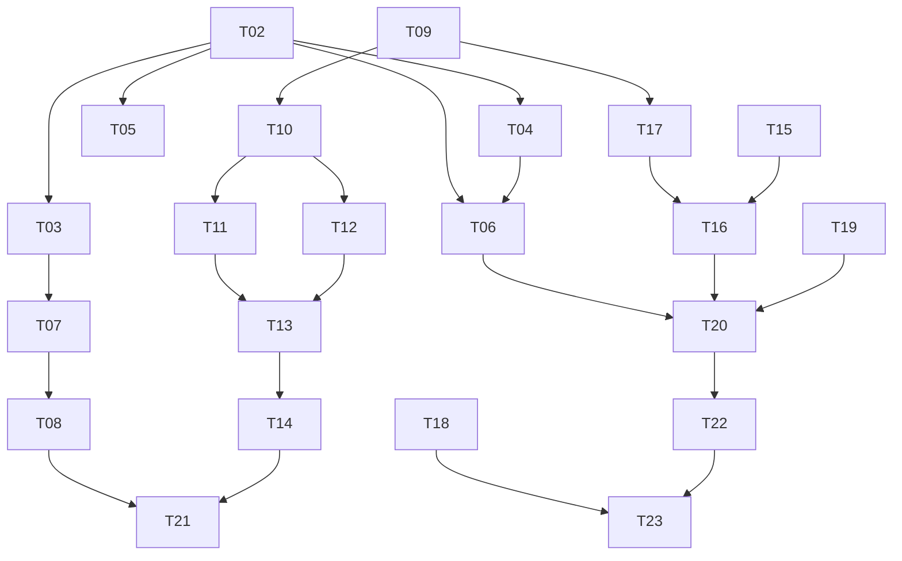

# Mock Server Expansion Design

- **Date**: 2026-04-21
- **Status**: FINAL
- **Branch target**: `feat/mock-server-expansion`
- **Worktree**: `.worktrees/feat/mock-server-expansion`

---

## Overview & Goals

`testing/mock-server`를 두 개의 HTTP 모의 서버 (Spring MVC + Spring WebFlux)로 확장한다. 두 서버는 동일한 endpoint 계약을 제공하므로 테스트 스위트가 base URL만 교체해 두 스택을 검증할 수 있다.

1. `testing/mock-server` → `testing/mock-web-server` 모듈명 변경 (이미지: `bluetape4k/mock-web-server`, 포트 8888)
2. `testing/mock-webflux-server` 신규 생성 (Spring WebFlux + Coroutines + Jackson 3, 이미지:
   `bluetape4k/mock-webflux-server`, 포트 9999)
3. `BluetapeWebfluxServer` testcontainer 추가 (`BluetapeHttpServer` 옆, 네임스페이스 `bluetape-webflux`)
4. **두 서버의 모든 endpoint** 통합 테스트 (JUnit 5 + OkHttp / WebTestClient + bluetape4k-assertions)
5. 각 서버에 Gatling 3.15 Java API 스트레스 테스트

Non-goals: 실제 네트워크 에뮬레이션, WireMock 대체, mutual TLS, HTTP/2

---

## 현행 테스트 커버리지 (mock-server)

| 파일                             | 커버 범위                                                                                        |
|----------------------------------|--------------------------------------------------------------------------------------------------|
| `HttpbinContractTest.kt`         | `/httpbin/get\|post\|put\|patch\|delete\|headers\|ip\|user-agent\|uuid\|anything\|status\|bytes` |
| `HttpbinAdvancedContractTest.kt` | `/httpbin/delay\|redirect\|cookies\|basic-auth\|bearer\|cache\|etag` 일부                        |
| `JsonplaceholderContractTest.kt` | `/jsonplaceholder/*` CRUD                                                                        |
| `InMemoryRepositoryTest.kt`      | 단위 테스트                                                                                      |

**미커버 (T06에서 추가)**:
`GET /ping`, `POST /admin/reset`,
`GET /httpbin/gzip\|deflate\|stream/{n}\|image/{fmt}`,
`GET /web/random`, `GET /web/{name}`

T06 목표: 기존 테스트 보완 + 미커버 추가 = **전체 endpoint 100% 커버**

---

## Module Structure

```
testing/
  mock-web-server/                    # renamed from mock-server
    build.gradle.kts                  # Jib image: bluetape4k/mock-web-server
    src/main/kotlin/io/bluetape4k/mockserver/
      MockServerApplication.kt
      admin/AdminController.kt
      admin/PingController.kt
      config/GlobalExceptionHandler.kt
      httpbin/HttpbinController.kt
      httpbin/HttpbinAdvancedController.kt
      httpbin/HttpbinStreamController.kt
      httpbin/HttpbinSupport.kt
      httpbin/ImageLoaderService.kt
      httpbin/model/HttpbinResponse.kt
      jsonplaceholder/ApplicationBootstrapConfig.kt
      jsonplaceholder/CommentsController.kt ... (6개)
      jsonplaceholder/FixtureLoader.kt
      jsonplaceholder/InMemoryRepository.kt
      jsonplaceholder/JsonplaceholderService.kt
      jsonplaceholder/model/...
      web/WebContentController.kt
      web/WebContentLoader.kt
    src/main/resources/
      application.yml                 # port: 8888, virtual.threads.enabled: true
      jsonplaceholder/*.json          # albums/comments/photos/posts/todos/users.json
      web/html/*.html
    src/test/kotlin/...               # 전체 endpoint 커버 통합 테스트
    src/test/resources/junit-platform.properties + logback-test.xml
    src/gatlingTest/kotlin/.../MockWebServerSimulation.kt

  mock-webflux-server/                # NEW
    build.gradle.kts                  # Jib image: bluetape4k/mock-webflux-server
    src/main/kotlin/io/bluetape4k/mockwebflux/
      MockWebfluxServerApplication.kt
      admin/AdminController.kt        # suspend fun
      admin/PingController.kt
      config/GlobalExceptionHandler.kt  # @RestControllerAdvice (WebFlux 방식)
      httpbin/HttpbinController.kt    # suspend fun
      httpbin/HttpbinAdvancedController.kt  # kotlinx.coroutines.delay()
      httpbin/HttpbinStreamController.kt    # Flow<T>
      httpbin/HttpbinSupport.kt
      httpbin/ImageLoaderService.kt
      httpbin/model/HttpbinResponse.kt
      jsonplaceholder/ApplicationBootstrapConfig.kt
      jsonplaceholder/*Controller.kt  (6개, suspend CRUD)
      jsonplaceholder/FixtureLoader.kt
      jsonplaceholder/InMemoryRepository.kt
      jsonplaceholder/JsonplaceholderService.kt
      jsonplaceholder/model/...
      web/WebContentController.kt     # withContext(Dispatchers.IO) { loader.load(name) }
      web/WebContentLoader.kt         # non-suspend + @Cacheable 유지
    src/main/resources/
      application.yml                 # port: 9999
      jsonplaceholder/*.json          # (복사)
      web/html/*.html                 # (복사)
    src/test/kotlin/...
    src/test/resources/junit-platform.properties + logback-test.xml
    src/gatlingTest/kotlin/.../MockWebfluxServerSimulation.kt

  testcontainers/src/main/kotlin/io/bluetape4k/testcontainers/http/
    BluetapeHttpServer.kt             # IMAGE 상수만 변경
    BluetapeWebfluxServer.kt          # NEW
```

**복사 정책**: `InMemoryRepository`, `JsonplaceholderService`, DTOs, fixture JSON, HTML 파일은 각 모듈에 복사한다. 컨트롤러 반환 타입이
`List<T>` vs `Flow<T>`로 달라 공통 artifact 추출보다 복사가 타당하다.

---

## Endpoint Inventory (두 서버 동일)

| Group           | Method                    | Path                                                                      | Notes                                   |
|-----------------|---------------------------|---------------------------------------------------------------------------|-----------------------------------------|
| Health          | GET                       | `/ping`                                                                   | `"pong"`                                |
| Admin           | POST                      | `/admin/reset`                                                            | fixture 재적재                          |
| Httpbin         | GET/POST/PUT/PATCH/DELETE | `/httpbin/get\|post\|put\|patch\|delete`                                  | 요청 에코                               |
| Httpbin         | GET                       | `/httpbin/headers\|ip\|user-agent\|uuid`                                  |                                         |
| Httpbin         | ANY                       | `/httpbin/anything/**`                                                    | 메서드 에코                             |
| Httpbin         | GET                       | `/httpbin/status/{code}`                                                  | 지정 HTTP 상태 반환                     |
| Httpbin         | GET                       | `/httpbin/bytes/{n}`                                                      | 랜덤 바이트                             |
| Httpbin stream  | GET                       | `/httpbin/gzip\|deflate`                                                  | 압축 응답                               |
| Httpbin stream  | GET                       | `/httpbin/stream/{n}`                                                     | NDJSON                                  |
| Httpbin stream  | GET                       | `/httpbin/image/{fmt}`                                                    | png/jpeg/webp                           |
| Advanced        | GET                       | `/httpbin/delay/{seconds}`                                                | MVC: `Thread.sleep`; WebFlux: `delay()` |
| Advanced        | GET                       | `/httpbin/redirect/{n}`                                                   | 302 체인                                |
| Advanced        | GET                       | `/httpbin/cookies\|cookies/set\|cookies/delete`                           |                                         |
| Advanced        | GET                       | `/httpbin/basic-auth/{user}/{passwd}`                                     | 401/200                                 |
| Advanced        | GET                       | `/httpbin/bearer`                                                         | Bearer 검증                             |
| Advanced        | GET                       | `/httpbin/cache\|cache/{value}`                                           | 304                                     |
| Advanced        | GET                       | `/httpbin/etag/{etag}`                                                    | If-None-Match                           |
| Jsonplaceholder | GET/POST/PUT/PATCH/DELETE | `/jsonplaceholder/{posts\|comments\|albums\|photos\|todos\|users}[/{id}]` | full CRUD                               |
| Web             | GET                       | `/web/random`                                                             | 무작위 HTML                             |
| Web             | GET                       | `/web/{name}`                                                             | home/naver/google/login/article         |

---

## API Contract

| Aspect                 | `mock-web-server`                                                         | `mock-webflux-server`                       |
|------------------------|---------------------------------------------------------------------------|---------------------------------------------|
| 스택                   | Spring MVC + Virtual Threads                                              | Spring WebFlux + Coroutines                 |
| Controller style       | `@RestController` + `HttpServletRequest`                                  | `@RestController` + `suspend fun` / `Flow`  |
| Delay                  | `Thread.sleep(ms)`                                                        | `kotlinx.coroutines.delay(ms)`              |
| Streaming              | `StreamingResponseBody` (NDJSON)                                          | `Flow<String>` + `APPLICATION_NDJSON_VALUE` |
| Serialization          | Jackson 3 **명시적**: `platform(jackson3_bom)` + `jackson3_module_kotlin` | 동일                                        |
| Port                   | 8888                                                                      | 9999                                        |
| Docker image           | `bluetape4k/mock-web-server`                                              | `bluetape4k/mock-webflux-server`            |
| System props namespace | `testcontainers.bluetape-http.*`                                          | `testcontainers.bluetape-webflux.*`         |

> Spring Boot 4는 Jackson 3을 기본으로 사용하지 않는다. **명시적 opt-in** 필수.

> MVC 서버도 `spring.threads.virtual.enabled: true`로 platform-level non-blocking이다.
> Gatling delay 시나리오에서 두 서버 throughput 차이가 미미할 수 있으며, 결과를 수치로 기록한다.

---

## Testing Strategy

- **단위 테스트**: `FixtureLoader`, `InMemoryRepository` (양 서버 모두). WebFlux 버전은 `runTest { }`.
- **통합 테스트**: `@SpringBootTest(webEnvironment = RANDOM_PORT)`.
    - `mock-web-server`: OkHttp 기반 — **모든 endpoint 100% 커버**.
    - `mock-webflux-server`: `WebTestClient` 기반 — **모든 endpoint 100% 커버**.
    - **Parity 전략**: 각 모듈 독립 테스트 (교차 모듈 의존 없음). 동일한 assertion 패턴을 각 모듈에서 병렬 구조로 작성.
- **Container smoke test**: `BluetapeHttpServerTest`, `BluetapeWebfluxServerTest` — `start()` → `/ping` → 시스템 프로퍼티 키 검증.
- **Gatling**: `gatlingTest` source set; `./gradlew test` 제외; 명시적 실행.

---

## Gatling Simulation Design

Gatling 3.15 **Java API** (`io.gatling.javaapi.core.*`,
`io.gatling.javaapi.http.*`)를 Kotlin에서 호출. 공식 Kotlin DSL은 없으며, Java API를 Kotlin에서 직접 사용한다.

| # | 시나리오     | 설정                                        | 목표                          |
|---|--------------|---------------------------------------------|-------------------------------|
| 1 | Health       | `GET /ping` 200 rps × 30s                   | p95 < 50ms                    |
| 2 | Httpbin echo | ramp 1→100 user × 60s                       | failed < 1%                   |
| 3 | Streaming    | `GET /httpbin/stream/100` × 20 user × 30s   | timeout 없음                  |
| 4 | Delay        | `GET /httpbin/delay/1` × 50 user × 30s      | VT vs WebFlux throughput 비교 |
| 5 | CRUD         | posts POST→GET→PATCH→DELETE × 50 user × 60s | failed < 1%                   |

---

## BluetapeWebfluxServer Design

`PropertyExportingServer` 계약: `propertyNamespace` + `propertyKeys()` + `properties()` 3개 구현.
`writeToSystemProperties()`는 **default 구현**, override 금지.

```kotlin
class BluetapeWebfluxServer private constructor(
    imageName: DockerImageName,
    useDefaultPort: Boolean,
    reuse: Boolean,
): GenericContainer<BluetapeWebfluxServer>(imageName), GenericServer, PropertyExportingServer {

    companion object: KLogging() {
        const val IMAGE = "bluetape4k/mock-webflux-server"
        const val TAG = "latest"
        const val NAME = "bluetape-webflux"
        const val PORT = 9999

        @JvmStatic
        operator fun invoke(
            imageName: DockerImageName,
            useDefaultPort: Boolean = false,
            reuse: Boolean = true,
        ): BluetapeWebfluxServer = BluetapeWebfluxServer(imageName, useDefaultPort, reuse)

        @JvmStatic
        operator fun invoke(
            image: String = IMAGE,
            tag: String = TAG,
            useDefaultPort: Boolean = false,
            reuse: Boolean = true,
        ): BluetapeWebfluxServer {
            image.requireNotBlank("image")
            tag.requireNotBlank("tag")
            return invoke(DockerImageName.parse(image).withTag(tag), useDefaultPort, reuse)
        }
    }

    override val port: Int get() = getMappedPort(PORT)
    override val url: String get() = "http://$host:$port"
    val httpbinUrl: String get() = "$url/httpbin"
    val jsonplaceholderUrl: String get() = "$url/jsonplaceholder"
    val webUrl: String get() = "$url/web"

    override val propertyNamespace: String = NAME

    override fun propertyKeys(): Set<String> =
        setOf("host", "port", "url", "httpbinUrl", "jsonplaceholderUrl", "webUrl")

    override fun properties(): Map<String, String> = mapOf(
        "host" to host,
        "port" to port.toString(),
        "url" to url,
        "httpbinUrl" to httpbinUrl,
        "jsonplaceholderUrl" to jsonplaceholderUrl,
        "webUrl" to webUrl,
    )

    init {
        withExposedPorts(PORT)
        withReuse(reuse)
        waitingFor(
            Wait.forHttp("/ping")
                .forPort(PORT)
                .forStatusCode(200)
                .withStartupTimeout(Duration.ofSeconds(60))
        )
        if (useDefaultPort) {
            exposeCustomPorts(PORT)
        }
    }

    override fun start() {
        super.start()
        log.info { "BluetapeWebfluxServer started. url=$url" }
        writeToSystemProperties()   // default 구현 호출
    }

    object Launcher {
        val bluetapeWebfluxServer: BluetapeWebfluxServer by lazy {
            BluetapeWebfluxServer().apply {
                start()
                ShutdownQueue.register(this)
            }
        }
    }
}
```

**프로퍼티 키**: `BluetapeHttpServer` 기존 camelCase 키와 동일하게 맞춤. 향후 kebab-case 마이그레이션 시
`withCompatKeys()`로 하위 호환 제공 (이번 PR 범위 외).

---

## Coding Conventions

- `companion object: KLogging()` 필수
- 문자열 파라미터: `requireNotBlank(name)`
- 모든 public API: 한국어 KDoc
- `InMemoryRepository`: `ConcurrentHashMap` + `AtomicLong` (변경 없음)
- `BluetapeHttpServer.NAME = "bluetape-http"` 유지; IMAGE만 변경
- `@Cacheable` + `suspend` (`WebContentLoader`): **Method A 채택** — `WebContentLoader.load()`를 non-suspend로 유지하고
  `@Cacheable` 적용, 컨트롤러에서
  `withContext(Dispatchers.IO) { loader.load(name) }` 호출. exposed-workshop의 LettuceSuspendedCacheManager (수동 구현)는 이 단순 파일 I/O 캐시에 불필요하다.
- `GlobalExceptionHandler` WebFlux 버전: `@RestControllerAdvice` + `@ExceptionHandler` (MVC
  `ResponseEntityExceptionHandler`와 base class 다름)
- Jib `container { ports = listOf("9999") }` 명시 필수 (mock-webflux-server)
- 신규 모듈: `src/test/resources/junit-platform.properties` + `logback-test.xml` 필수

---

## Risks & Mitigations

| # | 리스크                      | 대응                                                                                                                                   |
|---|-----------------------------|----------------------------------------------------------------------------------------------------------------------------------------|
| 1 | Rename 다운스트림 참조 오류 | ripgrep 전체 탐색 → 일괄 업데이트 (T04). 롤백: `git revert T02~T04` 범위로 되돌리면 `:bluetape4k-mock-server` 모듈명·이미지명이 복원됨 |
| 2 | CI 포트 충돌                | Testcontainers 동적 포트 매핑                                                                                                          |
| 3 | WebFlux 의미론적 차이       | 각 모듈 독립 assertion 구조로 동일 패턴 유지                                                                                           |
| 4 | Gatling 빌드 비용           | `gatlingTest` source set 격리, `check` 제외                                                                                            |
| 5 | Docker 이미지 이중화        | Jib 공유 base layer `eclipse-temurin:25-jre-alpine`                                                                                    |
| 6 | Jackson 3 + WebFlux codec   | `WebFluxConfigurer.configureHttpMessageCodecs()`에 Jackson 3 codec 명시 등록 필요; `Flow<T>` NDJSON 불가 시 `Flux<T>` 폴백             |
| 7 | VT vs WebFlux throughput    | 두 서버 모두 non-blocking → 차이 미미 가능, 결과 수치 첨부                                                                             |

---

## Approach Decisions

| 항목                                      | 채택 | 기각 이유                         |
|-------------------------------------------|------|-----------------------------------|
| WebFlux: `@RestController` + `suspend`    | ✅   | MVC 1:1 대응, URL 일치 용이       |
| WebFlux: `RouterFunction` DSL             | ❌   | parity 검증 어려움                |
| Gatling: 각 모듈 `gatlingTest` source set | ✅   | co-located, 추가 모듈 불필요      |
| Parity: 각 모듈 독립 테스트               | ✅   | 교차 모듈 의존 없음, CI 부담 없음 |
| Parity: testFixtures 공유                 | ❌   | 교차 모듈 결합 생성               |

---

## Known Downstream Consumers

| 파일                                      | 변경 내용                                                                              |
|-------------------------------------------|----------------------------------------------------------------------------------------|
| `testing/testcontainers/build.gradle.kts` | `dependsOn(":bluetape4k-mock-server:jibDockerBuild")` → `:bluetape4k-mock-web-server:` |
| `BluetapeHttpServer.kt`                   | `IMAGE = "bluetape4k/mock-server"` → `"bluetape4k/mock-web-server"`                    |
| `mock-web-server/build.gradle.kts`        | Jib `to.image = "bluetape4k/mock-web-server"`                                          |
| Gradle 모듈명                             | `:bluetape4k-mock-server` → `:bluetape4k-mock-web-server`                              |
| `PropertyExportingServerContractTest`     | `expectedImplementors` 목록에 `BluetapeWebfluxServer` 추가                             |

---

## Jib Build Checklist

```bash
./gradlew :bluetape4k-mock-web-server:jibDockerBuild
./gradlew :bluetape4k-mock-webflux-server:jibDockerBuild
```

---

## Task List

| #   | Task                                                                                                                                                                                                      | Complexity |
|-----|-----------------------------------------------------------------------------------------------------------------------------------------------------------------------------------------------------------|------------|
| T01 | ~~worktree 생성~~ 완료                                                                                                                                                                                    | low        |
| T02 | `testing/mock-server` → `testing/mock-web-server` 디렉토리 이동                                                                                                                                           | medium     |
| T03 | `build.gradle.kts` Jib image → `bluetape4k/mock-web-server`                                                                                                                                               | low        |
| T04 | 전체 repo ripgrep: `bluetape4k-mock-server`, `bluetape4k/mock-server` 참조 일괄 업데이트                                                                                                                  | medium     |
| T05 | `README.md` + `README.ko.md` 갱신 (Mermaid 아키텍처 포함, Architecture→UML→Features→Examples)                                                                                                             | low        |
| T06 | mock-web-server **전체 endpoint 100% 커버** 통합 테스트: 기존 보완 + Ping/Admin/Stream/Web 신규 추가 (OkHttp + bluetape4k-assertions)                                                                     | high       |
| T07 | `build.gradle.kts` `io.gatling.gradle` 플러그인 + `gatlingTest` source set 추가                                                                                                                           | medium     |
| T08 | `MockWebServerSimulation.kt`: 5개 시나리오 (Gatling Java API)                                                                                                                                             | medium     |
| T09 | `testing/mock-webflux-server` scaffold: `build.gradle.kts` (webflux + jackson3 + jib, `container { ports = ["9999"] }`), `application.yml` (port 9999), `MockWebfluxServerApplication.kt`, test resources | medium     |
| T10 | fixtures + `FixtureLoader` + `InMemoryRepository` + DTOs + HTML 복사; `ApplicationBootstrapConfig.kt`, `JsonplaceholderService.kt`, `GlobalExceptionHandler` (`@RestControllerAdvice`) 작성               | medium     |
| T11 | httpbin 컨트롤러 3개 `suspend`/`Flow` 포팅; `Thread.sleep` → `delay()`; Jackson 3 WebFlux codec 등록                                                                                                      | high       |
| T12 | jsonplaceholder 컨트롤러 6개 `suspend` 포팅; `web/` 컨트롤러: `WebContentLoader`는 non-suspend + `@Cacheable` 유지, 컨트롤러에서 `withContext(Dispatchers.IO)` 호출                                       | high       |
| T13 | mock-webflux-server **전체 endpoint 100% 커버** 통합 테스트 (`WebTestClient` + bluetape4k-assertions)                                                                                                     | high       |
| T14 | `mock-webflux-server` Gatling: `io.gatling.gradle` + `MockWebfluxServerSimulation.kt`                                                                                                                     | medium     |
| T15 | `BluetapeWebfluxServer.kt`: `init { withExposedPorts(PORT); waitingFor(...) }`, 3-멤버 계약 구현; `PropertyExportingServerContractTest.expectedImplementors` 목록 업데이트                                | medium     |
| T16 | `BluetapeWebfluxServerTest.kt`; testcontainers `build.gradle.kts`에 `dependsOn(":bluetape4k-mock-webflux-server:jibDockerBuild")`                                                                         | medium     |
| T17 | mock-webflux-server Jib `jibDockerBuild` 검증 → `bluetape4k/mock-webflux-server:latest`                                                                                                                   | medium     |
| T18 | `mock-webflux-server/README.md` + `README.ko.md` (Mermaid 다이어그램)                                                                                                                                     | medium     |
| T19 | `CLAUDE.md` Module Groups + `testcontainers/README*.md` 업데이트                                                                                                                                          | low        |
| T20 | `./bin/repo-test-summary -- ./gradlew :bluetape4k-mock-web-server:test :bluetape4k-mock-webflux-server:test :bluetape4k-testcontainers:test`; `docs/testlogs/2026-04.md` 기록                             | medium     |
| T21 | Gatling 수동 실행; p95/p99 PR 첨부                                                                                                                                                                        | medium     |
| T22 | `docs/superpowers/index/2026-04.md` 항목 추가; `INDEX.md` 건수 갱신                                                                                                                                       | low        |
| T23 | PR 생성; `/oh-my-claudecode:code-reviewer`; 피드백 반영                                                                                                                                                   | medium     |

**Total: 23 tasks — 4 high, 14 medium, 5 low**

---

## Task Dependency Graph



*T09, T15, T18, T19는 T02 완료 후 T06/T11/T12와 병렬 시작 가능*
