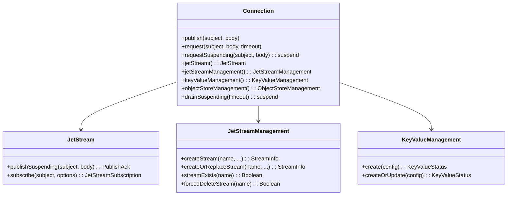

# Spec: infra/nats 모듈 승격 (NATS JetStream + Coroutines)

- **Issue**: #139
- **Branch**: `issue-139-nats` (worktree: `.worktrees/issue-139-nats`)
- **Date**: 2026-04-26
- **Author**: bluetape4k-design (Opus)
- **Status**: Draft (pre-plan)

## 1. 배경 / 목적

`x-obsoleted/nats` 디렉토리에 이미 NATS Java 클라이언트(`io.nats:jnats`) 기반의 코틀린 친화 확장 모듈이 존재한다. 30개 main 소스 파일은 한국어 KDoc, `KLogging`, `requireNotBlank`, Coroutines 통합(`*Suspending` 함수), DSL 빌더(`streamConfiguration {}`, `consumerConfiguration {}`, `keyValueConfiguration {}`, `objectStoreConfiguration {}`) 등 bluetape4k 관행을 이미 상당 부분 따르고 있어 품질이 양호하다.

`x-obsoleted`는 GitHub Packages Maven에 publish되지 않는 격리 폴더이므로(루트 publishing 설정에서 제외), 현재 사용자에게 노출되지 않은 상태다. 이를 정식 `infra/nats` 모듈로 승격해 다음을 달성한다.

1. **publish 활성화**: `bluetape4k-nats` 아티팩트로 GitHub Packages에 게시되어 외부 프로젝트에서 의존 가능
2. **테스트 통과 검증**: `bluetape4k-testcontainers`의 `NatsServer`를 사용한 통합 테스트가 CI에서 실행
3. **bluetape4k 관행 정렬**: `io.nats.examples.*` 패키지 오염 정리, `@Deprecated` 코드 제거, `infra/kafka`와 일관된 빌드 스크립트
4. **Spring Boot 3/4 통합 전략 확정**: `nats-spring` / `nats-spring-cloud-stream-binder`의 노출 범위를 명시적으로 결정

## 2. 범위

### 포함
- `x-obsoleted/nats/` → `infra/nats/` 이동 (`git mv`로 history 보존)
- `build.gradle.kts` 재작성 (Spring 전략 반영, infra 컨벤션 정렬)
- `io.nats.examples.*` 패키지 25개 테스트 파일 정리
- `coPublish` 등 `@Deprecated` 코드 제거
- `README.md` + `README.ko.md` Mermaid UML 다이어그램 추가
- `infra/kafka` 패턴 참조: configurations·testImplementation 확장 규칙 유지
- 기존 `AbstractNatsTest`, `NatsManagementExtensionsTest`, `SubscriptionExtensionsTest`, `ServiceEndpointExtensionsTest` 마이그레이션 + 통과 검증

### 제외
- 신규 API 추가 (예: NATS Stream Reactor, Spring Boot Starter, Micrometer 통합)
- nats-spring-cloud-stream-binder 활용 예제 (compileOnly 유지, 테스트 불추가)
- jnats 버전 업그레이드 (현 `2.25.1` 유지)
- Spring Boot 4 전용 분기 모듈 작성 (Spring 통합 전략 결정 후 후속 PR에서 검토)

### 미결 / 결정 필요 사항
1. **Spring 의존성 노출 전략** (§5에서 3개 옵션 비교, 권고안 제시)
2. **`io.nats.examples.*` 처리 방식** (§7에서 옵션 비교, 권고안 제시)
3. **`@Deprecated` `coPublish` 즉시 제거 여부** (§6에서 권고)

## 3. 설계 리스크 / 실패 모드

### R1. Spring Boot 3/4 호환성 단절 (HIGH)
`nats-spring 0.6.2+3.5`는 Spring Boot 3.5 전용이다. `infra/kafka`처럼 `implementation(platform(Libs.spring_boot3_dependencies))`로 묶으면 Boot 4 사용자가 `infra/nats`를 의존할 때 Spring 클래스패스 충돌 가능성이 있다. **완화**: Spring 통합을 `compileOnly`로 노출하고 Spring 의존성은 사용자가 명시적으로 가져오게 함 (옵션 B/C).

### R2. `io.nats.examples.*` 패키지 오염 (MEDIUM)
27개 테스트 파일이 `io.nats.examples`로 분류되어 있어, 만약 메인 소스에 섞이거나 `package-info.java` 단계 검사를 통과하지 못하면 사용자에게 "외부 라이브러리의 일부"로 오인될 위험이 있다. 또한 외부 nats-io 예제와의 라이선스/저작권 추적이 모호해진다. **완화**: 테스트 디렉토리에서만 사용 + 명확한 정리 정책 (§7).

### R3. NatsServer testcontainer ↔ jnats 프로토콜 호환성 (HIGH → 선결 검증 필요)
testcontainers의 `NatsServer`는 tag `2.12`를 사용하고, jnats 클라이언트는 `2.25.1`이다. NATS JetStream simplification API(pull consumer next/fetch/iterate)는 NATS 서버 2.10+에서 안정 동작. tag `2.12`는 조건을 만족하지만 구체적 API 호환성은 실행해야 확인 가능.

**[M2] 완화 전략 (단순 "돌리고 보자" 아님)**:
- **선결 task 0** 추가: `git mv` 전에 `x-obsoleted/nats`에서 `:test` 실행해 현재 호환성 베이스라인 확인
  ```bash
  ./gradlew :x-obsoleted-nats:test  # 현재 pass 수 확인
  ```
- 마이그레이션 후 동일 테스트가 모두 pass인지 비교
- 실패 시 2가지 선택지:
  1. NatsServer tag 업데이트 (본 PR에 포함, `testing/testcontainers` 별도 commit)
  2. 실패하는 simplification API 테스트를 `@Disabled("NatsServer 2.12 호환성 이슈")` 마킹 후 후속 PR

### R4. JetStream 상태 누수 (LOW)
JetStream은 stream/consumer/KV bucket을 서버에 누적시키는 stateful 리소스다. testcontainer 인스턴스를 클래스간 공유 (companion object 패턴) 시 stream 이름 충돌 가능. **완화**: 기존 `AbstractNatsTest`가 이미 unique stream name 패턴을 사용하는지 확인하고, 필요 시 `@BeforeEach`에서 cleanup 보강.

### R5. `@Deprecated coPublish` 향후 binary-compat 부담 (LOW)
x-obsoleted 모듈은 publish된 적이 없으므로 binary-compat 의무가 없다. 그러나 만약 그대로 두면 첫 release 시 사용자가 deprecated API를 채택할 위험. **완화**: §6의 권고대로 즉시 제거.

## 4. 모듈 구조

### 4.1 디렉토리 트리

```
infra/nats/
├── build.gradle.kts
├── README.md
├── README.ko.md
└── src/
    ├── main/kotlin/io/bluetape4k/nats/
    │   ├── client/
    │   │   ├── ConnectionExtensions.kt
    │   │   ├── Consumer.kt, ConsumerContext.kt
    │   │   ├── JetStream.kt              # @Deprecated coPublish 제거
    │   │   ├── JetStreamApiException.kt
    │   │   ├── JetStreamManagement.kt
    │   │   ├── JetStreamOptions.kt
    │   │   ├── KeyValueManagement.kt, KeyValueOptions.kt
    │   │   ├── NatsConsts.kt, NatsMessage.kt
    │   │   ├── ObjectStreamManagement.kt
    │   │   ├── Options.kt
    │   │   ├── PublishOptions.kt
    │   │   ├── PullSubscriptionOptions.kt, PushSubscriptionOptions.kt
    │   │   ├── SubscriptionExtensions.kt
    │   │   └── api/
    │   │       ├── ConsumerConfiguration.kt
    │   │       ├── FetchConsumeOptions.kt
    │   │       ├── KeyValueConfiguration.kt
    │   │       ├── KeyValuePurgeConfiguration.kt
    │   │       ├── ObjectLink.kt, ObjectMeta.kt, ObjectMetaOptions.kt
    │   │       ├── ObjectStoreConfiguration.kt
    │   │       ├── StreamConfiguration.kt
    │   │       └── StreamInfoOptions.kt
    │   └── service/
    │       ├── Endpoint.kt, Service.kt, ServiceEndpoint.kt
    └── test/
        ├── kotlin/io/bluetape4k/nats/
        │   ├── AbstractNatsTest.kt
        │   ├── client/
        │   │   ├── NatsManagementExtensionsTest.kt
        │   │   ├── SubscriptionExtensionsTest.kt
        │   │   └── examples/              # ← io.nats.examples.* → io.bluetape4k.nats.client.examples.*
        │   │       ├── PubSubExample.kt, RequestReplyExample.kt, ... (10개)
        │   │       ├── chainOfCommand/    # ← io.nats.examples.chainOfCommand.* (5개, service 아님)
        │   │       │   ├── App.kt, Endpoint.kt, Input.kt
        │   │       │   ├── PublishStyleWorkers.kt, RequestStyleWorkers.kt
        │   │       ├── jetstream/         # ← io.nats.examples.jetstream.* (3개)
        │   │       └── jetstream/simple/  # ← io.nats.examples.jetstream.simple.* (6개)
        │   └── service/
        │       ├── ServiceEndpointExtensionsTest.kt
        │       └── examples/              # ← io.nats.examples.service.* (1개)
        │           └── ServiceExample.kt
        └── resources/
            ├── junit-platform.properties
            └── logback-test.xml
```

### 4.2 자동 등록 흐름

`settings.gradle.kts:21`의 `includeModules("infra", withBaseDir = false)` 가 `infra/*` 하위 디렉토리를 `bluetape4k-{dirname}` 프로젝트로 자동 등록하므로, **`infra/nats/build.gradle.kts` 파일 존재만으로 `:bluetape4k-nats` 프로젝트가 등록된다**. settings.gradle.kts 수정 불필요.

## 5. 빌드 설정 (build.gradle.kts)

### 5.1 Spring 통합 전략 — 옵션 비교

| 옵션 | 핵심 결정 | Pros | Cons |
|------|----------|------|------|
| **A. infra/kafka 미러** | `implementation(platform(Libs.spring_boot3_dependencies))` + `api(Libs.nats_spring)` | infra/kafka와 일관, Spring 사용자 편의 ↑ | Spring Boot 4 사용자 충돌 위험, NATS 코어만 쓰는 사용자도 Spring 의존성 추이 |
| **B. compileOnly Spring** | `compileOnly(Libs.nats_spring)`, 사용자가 명시적으로 가져옴 | Boot 3/4 모두 호환, 코어 슬림 | infra/kafka와 비대칭, "그냥 쓰면 동작" 편의 ↓ |
| **C. 모듈 분리** | `infra/nats` (코어) + `infra/nats-spring` (Spring binder + cloud-stream) | 가장 깔끔한 의존성 그래프, Boot 4 분기 시점에 `infra/nats-spring4` 추가 가능 | 모듈 1개 추가, 초기 비용 ↑ |

### 5.2 권고안: **옵션 B (compileOnly Spring)**

**근거**:
- 본 PR의 목적은 "x-obsoleted 승격 + 정리"이지, "Spring Boot Starter 신설"이 아니다 (§2 범위 제외 확인)
- 옵션 C가 가장 깨끗하지만 본 PR 범위를 넘는다 → 별도 후속 issue
- 옵션 A는 Boot 4 호환성을 미리 깬다 → spring-boot4 그룹이 이미 운영 중이므로 위험
- `infra/kafka`도 본질적으로는 Kafka 클라이언트가 1차 시민, Spring 통합은 부수적이다. NATS는 publish 시점부터 양쪽 호환성 확보가 가능하므로 더 좋은 출발점

옵션 C는 추후 **Issue 등록 + 별도 PR**로 도입 권고. 그 경우 `infra/nats`는 변경 없이 의존만 추가됨.

### 5.3 build.gradle.kts 초안

```kotlin
configurations {
    testImplementation.get().extendsFrom(compileOnly.get(), runtimeOnly.get())
}

dependencies {
    api(project(":bluetape4k-core"))
    api(project(":bluetape4k-io"))
    testImplementation(project(":bluetape4k-junit5"))
    testImplementation(project(":bluetape4k-testcontainers"))

    // NATS - 코어 클라이언트는 api로 노출
    api(Libs.jnats)

    // NATS - Spring 통합은 compileOnly (Boot 3/4 호환을 위해 사용자가 직접 선언)
    // nats_spring_cloud_stream_binder는 main 소스에서 미사용 → 제외
    compileOnly(Libs.nats_spring)

    // Coroutines
    compileOnly(project(":bluetape4k-coroutines"))
    compileOnly(Libs.kotlinx_coroutines_core)
    compileOnly(Libs.kotlinx_coroutines_reactor)
    testImplementation(Libs.kotlinx_coroutines_test)

    // Json (테스트에서만)
    testImplementation(project(":bluetape4k-jackson2"))
    testImplementation(Libs.jackson_databind)
    testImplementation(Libs.jackson_module_kotlin)
    testImplementation(Libs.jackson_module_parameter_names)
    testImplementation(Libs.jackson_module_blackbird)

    // Compressors / Serializers (테스트 페이로드용)
    testImplementation(Libs.lz4_java)
    testImplementation(Libs.snappy_java)
    testImplementation(Libs.zstd_jni)
    testImplementation(Libs.kryo5)
    testImplementation(Libs.fory_kotlin)
}
```

**기존 build.gradle.kts와의 차이점**:
- `api(Libs.nats_spring)` → `compileOnly(Libs.nats_spring)` (R1 완화)
- 의존성 그룹 주석 정리, infra/kafka와 형식 일치
- `kotlin("plugin.spring")` 추가 **하지 않음** (Spring을 require하지 않으므로)

**[M1] Spring transitive 의존성 검증 (필수 선결 단계)**:

`compileOnly(Libs.nats_spring)` 선언 후 다음 명령으로 transitive Spring 버전을 확인해야 한다:
```bash
./gradlew :bluetape4k-nats:dependencies --configuration compileClasspath | grep spring
```
- Spring 클래스가 compileClasspath에 나타나더라도, 사용자 런타임에서 Boot 3/4 버전으로 교체되므로 binary 충돌 가능성 존재
- 만약 `spring-context`, `spring-messaging` 등이 특정 버전으로 고정 노출되는 경우: `compileOnly(platform(Libs.spring_boot3_dependencies))` 추가 검토
- 심각한 충돌 발견 시 옵션 C(모듈 분리)로 escalation

## 6. 주요 API 설계 (기존 코드 재사용 방침)

### 6.1 재사용 원칙

기존 30개 main kt 파일은 **API 시그니처 변경 없이 그대로 마이그레이션**한다. 사유:
- 한국어 KDoc, `requireNotBlank`, `KLogging` 등 bluetape4k 관행을 이미 따름
- `*Suspending` 명명, `streamConfiguration {}` DSL, `forcedDelete*` / `tryDelete` 등 컨벤션이 일관적
- 본 PR 범위는 "정리·승격"이지 "재설계"가 아님

### 6.2 변경 1건: `@Deprecated coPublish` 제거

`JetStream.kt:81-92`의 deprecated 함수 즉시 제거. **근거**:
- x-obsoleted 모듈은 publish 이력이 없음 → binary-compat 의무 부재
- 첫 release 시점에 deprecated API가 외부에 노출되면 사용자가 채택 후 다음 minor에서 제거할 때 마이그레이션 비용 발생
- `replaceWith`로 안내된 `publishSuspending`이 이미 동일 모듈에 존재 → 즉시 대체 가능

```kotlin
// REMOVE (JetStream.kt:81-92)
@Deprecated(
    message = "use publishSuspending",
    replaceWith = ReplaceWith("publishSuspending(subject, body, headers, options)")
)
suspend fun JetStream.coPublish(...): PublishAck = publishSuspending(...)
```

제거 전 전수 grep 필수 (M6 수정):
```bash
rg "coPublish" --include="*.kt" .
```
발견된 모든 참조(main + test + 타 모듈)를 `publishSuspending`으로 치환한 후 제거.

### 6.3 변경 없음: 그 외 모든 공개 API

`ConnectionExtensions.kt`, `JetStreamManagement.kt`, `KeyValueManagement.kt` 등은 시그니처 변경 없이 이전.

## 7. 테스트 전략 (`io.nats.examples` 처리 포함)

### 7.1 `io.nats.examples.*` 처리 — 옵션 비교

| 옵션 | 결정 | Pros | Cons |
|------|------|------|------|
| **A. 패키지 리네이밍** | `io.nats.examples.*` → `io.bluetape4k.nats.client.examples.*` (테스트 트리 내) | 패키지 오염 해소, bluetape4k 일관성, KDoc 한국어화 가능 | 25개 파일 import 수정, 작업량 ↑ |
| **B. workshop으로 이동** | `workshop/nats-examples/` (publish 제외) | 메인 모듈 슬림화 | publish는 안되지만 테스트 실행 대상에서 빠짐 → CI 회귀 검증 손실 |
| **C. 일부 삭제 + 핵심만 리네이밍** | `KeyValueIntroExamples`, `ObjectStoreExample`, `PubSubExample`, `ServiceExample` 등 핵심만 리네이밍, 나머지 (`SimplicationMigrationExample` 등) 삭제 | 가장 슬림 | "어디까지 핵심인지" 주관 개입, 검토 비용 |

### 7.2 권고안: **옵션 A (전체 리네이밍)**

**근거**:
- "패키지 오염 해소"가 사용자 명시 요구사항
- 테스트로 유지하면 NATS 사용 패턴이 회귀 검증되고 README 예제 출처가 명확
- 이름 변경은 IntelliJ refactor + grep으로 대량 처리 가능 (수작업 비용 낮음)
- 옵션 B는 CI 검증 손실, 옵션 C는 검토 부담

**구현 디테일** (실제 25개 파일 구조 기반):
- 패키지 매핑 (grep 실측 기준):
  - `io.nats.examples.*` (top-level, 10개) → `io.bluetape4k.nats.client.examples.*`
  - `io.nats.examples.chainOfCommand.*` (5개) → `io.bluetape4k.nats.client.examples.chainOfCommand.*` (**service 하위 아님** — 원본이 `examples/chainOfCommand/`에 위치)
  - `io.nats.examples.jetstream.*` (3개) → `io.bluetape4k.nats.client.examples.jetstream.*`
  - `io.nats.examples.jetstream.simple.*` (6개) → `io.bluetape4k.nats.client.examples.jetstream.simple.*`
  - `io.nats.examples.service.*` (1개: ServiceExample.kt) → `io.bluetape4k.nats.service.examples.*`
- 디렉토리도 동일하게 이동 (`git mv` 작업, history 보존)
- `package` 선언 + import 일괄 수정 (IntelliJ refactor 후 `git diff`로 잔여 확인)
- 라이선스 헤더 검토: 외부 nats-io 예제 출처라면 출처 주석을 클래스 KDoc에 명시
- 리네이밍 후 **필수 검증**: `rg "package io.nats.examples" src/test/` 결과 0건

> **[C1 수정]** 이전 버전에서 `chainOfCommand`을 `service.examples.chainOfCommand`로 잘못 매핑했음. 실제 원본 디렉토리는 `io/nats/examples/chainOfCommand/`이므로 `client.examples.chainOfCommand`로 유지.

### 7.3 테스트 인프라

- `AbstractNatsTest`: `bluetape4k-testcontainers`의 `NatsServer` 사용. 클래스별 공유 패턴 유지 (companion object).
- `junit-platform.properties` + `logback-test.xml`: 기존 파일 그대로 마이그레이션
- 테스트 분류:
  - **단위**: MockK 기반 (현재 부재 → 후속 작업 권장, 본 PR 범위 외)
    - **[M5] 단위 테스트 부재 정당화**: coPublish 제거·패키지 리네임은 시그니처 단순 제거/이동이며, `publishSuspending`(동일 파일 내)이 이미 동등 기능을 커버함. 기존 통합 테스트(`NatsManagementExtensionsTest`, `SubscriptionExtensionsTest`)가 실행 검증. 단위 테스트는 후속 PR에서 보강.
  - **통합**: testcontainer NATS 서버 사용. JetStream/KV/ObjectStore 시나리오 포함
  - **예제 테스트 전환**: 25개 `io.nats.examples.*` 파일을 패키지 리네임 후 정식 테스트로 전환
    - 18개: @Test 이미 보유 → 그대로 유지
    - 7개(@Test 없음: `AbstractSimpleExample`, `JetStreamTestUtils`, `NatsJsPubAsync`, `chainOfCommand/Input`, `Endpoint`, `PublishStyleWorkers`, `RequestStyleWorkers`): 헬퍼/데이터 클래스이므로 별도 @Test 메서드 추가 불필요. 단, 상위 @Test 클래스에서 실행 커버되도록 구조 확인
    - **핵심 원칙**: 모든 example 파일은 CI에서 컴파일·실행 검증 대상

### 7.4 검증 명령

```bash
./gradlew :bluetape4k-nats:compileKotlin
./gradlew :bluetape4k-nats:compileTestKotlin
./gradlew :bluetape4k-nats:test
./gradlew :bluetape4k-nats:detekt
```

`./bin/repo-test-summary -- ./gradlew :bluetape4k-nats:test`로 PR 본문에 결과 요약 첨부.

## 8. README 방침

### 8.1 형식 요구사항 (CLAUDE.md / 메모리)

- `README.md` (영어) + `README.ko.md` (한국어) 2개 파일 동기 유지
- 제목 바로 아래 언어 전환 링크: `English | [한국어](./README.ko.md)`
- 구조: **Architecture → UML → Features → Examples → References**
- Mermaid UML 다이어그램 포함 (CLAUDE.md "README Diagrams" 요구사항)
- Vega-Lite 사용 금지 (메모리 feedback)

### 8.2 추가할 Mermaid 다이어그램 (현재 부재)



또한 NATS 메시지 플로우(Pub/Sub, Request/Reply, JetStream Stream→Consumer→Subscriber)를 sequence diagram으로 포함.

### 8.3 README 본문 갱신

- "Dependency" 섹션: Spring 통합은 사용자가 명시적으로 가져온다는 안내 추가:
  ```kotlin
  implementation("io.github.bluetape4k:bluetape4k-nats:${bluetape4kVersion}")
  // Spring 통합이 필요한 경우만:
  implementation("io.nats:nats-spring:0.6.2+3.5")
  ```
- "Examples" 섹션 경로 갱신: `src/test/kotlin/io/bluetape4k/nats/client/examples/...`
- "Test Support" 섹션은 그대로 유지

## 9. 마이그레이션 절차 (참고)

본격적 task 분해는 후속 plan 문서에 위임. 여기서는 큰 흐름만 명기.

```
git mv x-obsoleted/nats infra/nats         # history 보존
# build.gradle.kts 수정 (§5.3)
# JetStream.kt에서 coPublish 제거 (§6.2)
# 패키지 리네이밍 io.nats.examples → io.bluetape4k.nats.{client,service}.examples (§7.2)
# README.md / README.ko.md Mermaid 추가 + Examples 경로 갱신 (§8)
./gradlew :bluetape4k-nats:test            # 검증
./gradlew :bluetape4k-nats:detekt
```

## 10. 초안 Task 목록

| # | Task | 의존 | 예상 | 비고 |
|---|------|------|------|------|
| 0 | **[선결]** x-obsoleted/nats 베이스라인 테스트 실행 (`./gradlew :x-obsoleted-nats:test`) | - | 10분 | R3 호환성 baseline 확인; 실패 시 plan 단계에서 NatsServer tag 업데이트 task 추가 |
| 1 | Spring 의존성 노출 전략 확정 (옵션 B) + transitive 검증 (§5.3 M1) | 0 | 결정+10분 | `dependencies --configuration compileClasspath \| grep spring` |
| 2 | `io.nats.examples` 처리 방식 확정 (옵션 A, 25개 파일, §7.2 실측 매핑) | - | 결정 | chainOfCommand → client.examples.chainOfCommand |
| 3 | `git mv x-obsoleted/nats infra/nats` 실행 | 1, 2 | 5분 | `git log --follow` 로 history 보존 확인 |
| 4 | `build.gradle.kts` 재작성 (§5.3) | 3 | 15분 | infra/kafka 의존성 그룹 주석 형식만 정렬 (plugin.spring 추가 안 함) |
| 5 | `rg "coPublish"` 전수 grep → `JetStream.kt` deprecated 제거 + 치환 | 3 | 10분 | main+test+타 모듈 전수 확인 |
| 6 | 테스트 패키지 리네이밍 `io.nats.examples → io.bluetape4k.nats.{client,service}.examples` (§7.2 실측 매핑) | 3 | 2-3시간 | **25개 파일**, IntelliJ refactor 필수 → `rg "package io.nats.examples" src/test/` 결과 0건 확인 |
| 7 | `:bluetape4k-nats:compileKotlin` + `compileTestKotlin` 통과 | 4-6 | 검증 | import 수정 잔여 발견 시 fix |
| 8 | `:bluetape4k-nats:test` 전수 통과 (`./bin/repo-test-summary`) | 7 | 검증 | testcontainer NATS 기동, task 0 baseline 대비 회귀 없는지 확인 |
| 9 | `:bluetape4k-nats:detekt` 통과 | 7 | 검증 | baseline 없으면 `./gradlew :bluetape4k-nats:detektGenerateConfig` 후 fix |
| 10 | README.md 작성 (§8.1 구조, Mermaid classDiagram + sequence diagram) | 6 | 45분 | 영어; 제목 직후 `English \| [한국어](./README.ko.md)`; Architecture→UML→Features→Examples→References 순서 |
| 11 | README.ko.md 작성 (§8.1 동기) | 10 | 45분 | 한국어; `[English](./README.md) \| 한국어`; 섹션 구조·Mermaid 코드블록 동일 |
| 12 | 코드 리뷰 (`oh-my-claudecode:code-reviewer`) | 8-11 | 검증 | HIGH/CRITICAL 해소; publishing dry-run `./gradlew :bluetape4k-nats:publishToMavenLocal` 확인 |
| 13 | CLAUDE.md `infra/` 모듈 그룹 표에 nats 추가 | 11 | 5분 | 단일 행 추가 |
| 14 | testlog + superpowers index 업데이트 | 12 | 5분 | `docs/testlogs/2026-04.md` + `docs/superpowers/index/2026-04.md` |
| 15 | 커밋 + PR 생성 (한국어 커밋 메시지, `feat:` prefix) | 13-14 | 15분 | PR 본문: passing count + duration + 검증 명령 포함 |
| 16 | (후속) Issue 등록: `infra/nats-spring` 분리 (옵션 C) | 15 | 별도 PR | 본 PR 범위 외 |

## 11. 거부된 접근법

- **옵션 A (Spring api 노출)**: bluetape4k가 spring-boot4 그룹을 이미 운영 중이므로, Boot 3 platform 강제는 첫 release부터 호환성 채무를 남긴다. infra/kafka는 Boot 4 운영 시점 이전에 도입되었으나, NATS는 시작 시점이 다르다 → 같은 패턴 답습이 자동으로 옳지 않다.
- **옵션 C (모듈 분리, 즉시)**: 가장 깨끗한 그래프지만 본 PR 범위를 넘고, "최소 변경으로 승격"이라는 목표와 충돌. `infra/nats` 안정화 후 진행이 안전.
- **옵션 B (workshop 이동, 테스트 7.1)**: workshop은 publish 제외만이 아니라 CI test에서도 빠진다 (CLAUDE.md "Publishing: ... exclude workshop/ and examples/"). 회귀 검증 가치를 희생하므로 거부.
- **옵션 C (일부 예제 삭제, 테스트 7.1)**: "핵심" 정의가 주관적이고 검토 비용이 높다. NATS 학습 곡선상 모든 예제가 사용자 가치가 있다 (특히 `SimplicationMigrationExample`은 nats-io 권장 마이그레이션 패턴 → 그대로 유지가 좋음).
- **deprecated `coPublish` 보존**: x-obsoleted는 publish 이력이 없어 binary-compat 의무 부재. 첫 release에 deprecated API가 노출되면 사용자가 채택 후 다음 minor에 마이그레이션 비용 발생 → 거부.

## 12. 후속 작업 (본 PR 범위 외)

- `infra/nats-spring` 분리 (옵션 C 도입)
- Spring Boot Starter (`spring-boot3-nats`, `spring-boot4-nats`) 모듈
- Reactor NATS 통합 (`reactor-nats` 별도 모듈 — `reactor-kafka` 위치 참조)
- Micrometer / OpenTelemetry 통합
- jnats 버전 업그레이드 검토 + NatsServer testcontainer tag 동기 (R3 확인 결과에 따라)
- 단위 테스트 (MockK 기반) 보강
