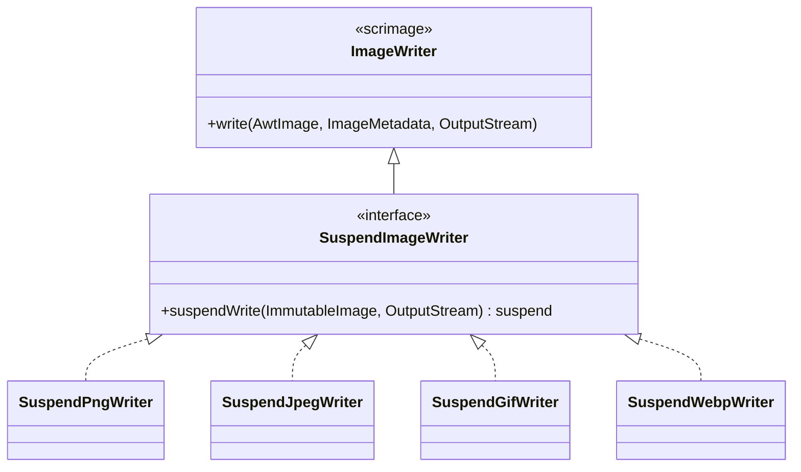

# utils/images 포맷 지원 확장 설계 (Issue #134)

- **작성일**: 2026-04-27
- **이슈**: #134 — utils/images 포맷 지원 확장 (TIFF / SVG / AVIF·HEIC)
- **연관 이슈**: #136 — utils/images-vips (libvips JNI 기반 AVIF/HEIC 구현)
- **브랜치**: `feat/issue-134-images-format`
- **모듈**: `utils/images` (`bluetape4k-images`)

---

## 1. 배경 및 목적

### 1.1 현황

현재 `utils/images` (`bluetape4k-images`) 모듈은 다음 포맷만 지원합니다.

| 포맷              | Reader        | Writer                       | 비고            |
|-------------------|---------------|------------------------------|-----------------|
| JPEG              | JDK ImageIO   | `SuspendJpegWriter`          | scrimage 기본   |
| PNG               | JDK ImageIO   | `SuspendPngWriter`           | scrimage 기본   |
| GIF               | JDK ImageIO   | `SuspendGifWriter`           | scrimage 기본   |
| WebP              | scrimage-webp | `SuspendWebpWriter`          | libwebp JNI     |
| Animated GIF/WebP | —             | `SuspendAnimatedImageWriter` | 자체 인터페이스 |

핵심 추상은 `SuspendImageWriter` 인터페이스로, scrimage `ImageWriter`를 상속하면서
`suspend fun suspendWrite(image, out)` 한 메서드를 `withContext(Dispatchers.IO)`로 감싸는 형태입니다.



### 1.2 요구사항 (Issue #134 스코프)

1. **TIFF 단일 페이지 지원** — `ImageFormat.TIFF` 추가, `SuspendTiffWriter` 구현체 추가.
2. **TIFF 다중 페이지 지원** — `List<ImmutableImage>` 를 한 파일로 직렬화하는 새 인터페이스 + 구현체.
3. **SVG 래스터화 지원** — SVG 입력 (스트림)을 `ImmutableImage`로 변환하는 Rasterizer 추상화 + Apache Batik 구현체.
4. **AVIF / HEIC 인터페이스
   정의** — 추후 `utils/images-vips` 모듈 (#136)에서 구현하기 위한 SPI (Service Provider Interface)만 정의. 본 모듈에서는 동작 구현 없음.
5. **RAW 포맷 (CR2/NEF/ARW 등)** — 본 스코프 제외. 추후 별도 이슈에서 검토.

### 1.3 목적

- **포맷 커버리지 확대**: 사진/문서 워크플로우에서 자주 마주치는 포맷 (TIFF 다중 페이지 = 스캔 문서 / SVG = 벡터 자산)을 1차 지원.
- **AVIF/HEiC를 위한 분리 가능한
  SPI**: 모바일 사진 (HEIC) / 차세대 정적 이미지 (AVIF) 는 JNI (libvips/libheif) 의존성이 무겁기 때문에, 인터페이스만 코어에 두고 구현은 별도 모듈로 격리.
- **기존 `SuspendImageWriter` 패턴 일관 유지**: 새 포맷도 동일한 suspend 패턴 + `KLoggingChannel` + `companion object` 프리셋 형태로 등록.

---

## 2. 설계 리스크

### 2.1 리스크 1 — TIFF 다중 페이지 API의 단일/복수 일관성

**문제**

scrimage의 `ImageWriter`는 단일 `AwtImage` → `OutputStream` 변환 시그니처에 고정되어 있습니다. TIFF 다중 페이지는 `List<ImmutableImage>` → 단일 OutputStream 으로 직렬화해야 하므로
`SuspendImageWriter` 시그니처와 호환되지 않습니다.

**영향**

- `SuspendImageWriter`를 그대로 상속하면 `write(image, out)` 호출 시 첫 페이지만 쓰이고 나머지는 누락 → silent data loss.
- 사용자가 `SuspendImageWriter` 변수 타입에 다중 페이지 writer를 대입하면 의도와 다르게 동작.

**완화**

- `SuspendMultiPageImageWriter`를 **별도 인터페이스**로 정의하고 `SuspendImageWriter`를 상속하지 않는다.
- 다중 페이지 writer의 단일 페이지 호환 메서드 (`suspendWrite(image, out)`)는 `listOf(image)`로 위임해 명시적 동작 보장.
- 클래스 KDoc 상단에 "단일 OutputStream에 다중 IFD를 작성한다"는 계약을 한국어 + `## 동작/계약` 섹션으로 명시.

### 2.2 리스크 2 — Apache Batik의 보안 / 무거운 의존성

**문제**

Apache Batik은 SVG → 래스터 변환의 사실상 표준이지만 다음 단점이 있다.

- **보안**: Batik 1.x는 과거 XXE/XSLT 취약점 (CVE-2022-44729 외) 이력이 있다. 외부 SVG를 그대로 파싱하면 SSRF, 파일 노출 위험.
- **사이즈**: `batik-transcoder` 1종에 약 30+ 개의 transitive jar (xml-apis, fop 등)가 끌려옴. `bluetape4k-images` core jar 비대화.
- **JDK 호환**: Batik은 JAXP/SAX 구현체에 민감. JDK 21에서는 정상이나, 모듈식 JLink 빌드 시 깨질 수 있음.

**영향**

- `bluetape4k-images`를 사용하기만 해도 SVG 파싱 의존성이 강제로 따라옴.
- 보안 정책 강화 필요 (외부 리소스 비활성화, DTD 차단, 파일 시스템 접근 차단).

**완화**

1. **의존성
   격리**: `org.apache.xmlgraphics:batik-transcoder`를 `compileOnly` + `testImplementation`으로 두고 `SuspendSvgRasterizer` 인터페이스만 노출. 사용자가 명시적으로 batik을 추가해야 `BatikSvgRasterizer` 가 동작.
2. **Secure default**: `BatikSvgRasterizer`는 생성 시 `TranscoderInput`/`SAXSVGDocumentFactory`에 다음 보안 옵션을 강제 적용.

   TranscodingHints 레벨 (PNGTranscoder hints에 설정):
    - `SVGAbstractTranscoder.KEY_ALLOW_EXTERNAL_RESOURCES = false`
    - `XMLAbstractTranscoder.KEY_XML_PARSER_VALIDATING = false`

   SAX 파서 레벨 (SAXSVGDocumentFactory 또는 SecurityManagerUserAgent를 통해 설정):
    - `http://apache.org/xml/features/disallow-doctype-decl = true` (단, SVG 내부 DTD 미사용 가정)
    - `http://xml.org/sax/features/external-general-entities = false`
    - `http://xml.org/sax/features/external-parameter-entities = false`
    - `http://apache.org/xml/features/nonvalidating/load-external-dtd = false`

   UserAgent override (allowExternalResources=false 시):
    - `SecurityManagerUserAgent : UserAgentAdapter` 구현 → `loadExternalDocument()` 에서 `SecurityException` 발생
    - data: URI는 허용 (SVG 임베디드 이미지)
3. **버전 고정**: Batik `1.18` (2024년 보안 패치 반영) 이상으로 `Libs.kt`에 등록.

### 2.3 리스크 3 — AVIF/HEIC 인터페이스의 조숙한 추상화 (premature abstraction)

**문제**

본 스코프에서는 AVIF/HEIC를 인터페이스만 정의하고 구현은 `utils/images-vips`에서 진행한다. 인터페이스를 너무 일찍 고정하면 libvips 실제 구현 시 시그니처 변경이 발생해 호환성을 깨뜨릴 위험.

**완화**

- 인터페이스 시그니처는 **기존 `SuspendImageWriter` / Rasterizer 와 동일한 형태**로 단순하게 유지 (옵션은 data class로 묶어 확장 여지 확보).
- `@MustBeDocumented annotation class IncubatingImageApi` 마커를 추가하고 인터페이스에 부여. 1.7.x 시리즈 동안은 시그니처 변경을 허용한다는 정책을 KDoc에 명시.
- 기본 구현체 (`NoopAvifWriter` / `NoopHeicReader` 같은 stub) 는 만들지
  **않는다**. 사용자가 vips 모듈을 추가하지 않으면 컴파일 시점에 사용 불가하도록 둠 → fail-fast.

### 2.4 리스크 4 (보너스) — TwelveMonkeys ImageIO SPI 등록 시점

**문제**

TwelveMonkeys (`com.twelvemonkeys.imageio:imageio-tiff`)는 SPI (`META-INF/services/javax.imageio.spi.ImageReaderSpi`) 자동 등록 방식이다.

- 다른 모듈에서 ImageIO를 먼저 초기화한 뒤 TwelveMonkeys jar가 lazy-load 되면 SPI가 등록되지 않을 수 있다.
- `IIORegistry.getDefaultInstance()`는 호출 시점에 ClassLoader가 보이는 SPI 만 발견.

**완화**

- `bluetape4k-images` 초기화 시 명시적으로 `IIORegistry.getDefaultInstance().registerApplicationClasspathSpis()` 를 호출하는 init 훅을 `IIORegistryUtils`에 추가.
- TIFF 관련 단위 테스트는 `@BeforeAll`에서 위 init을 강제 호출하여 SPI 누락 회귀 검증.

---

## 3. 접근 방식 비교

### 3.1 옵션 A — TwelveMonkeys ImageIO + Apache Batik (단일 모듈)

**설명**

- TIFF: `imageio-tiff` (TwelveMonkeys) — JDK ImageIO SPI에 등록되어 `ImageIO.write(..., "TIFF", ...)`로 단일/다중 페이지 모두 처리 가능.
- SVG: `batik-transcoder` 단일 jar. `PNGTranscoder` 사용.
- 모두 `utils/images`에 직접 의존성으로 추가.

| 장점                                 | 단점                                  |
|--------------------------------------|---------------------------------------|
| 모듈 신설 없이 한 번에 끝남          | jar 크기 증가 (~5MB +)                |
| TwelveMonkeys는 SPI라 코드 변경 최소 | Batik 의존성이 모든 사용자에게 강제됨 |
| 검증된 라이브러리 조합               | 보안 취약점 발생 시 전체 영향권       |

### 3.2 옵션 B — TwelveMonkeys 직접 의존 + Batik 옵셔널 (compileOnly)

**설명**

- TIFF는 옵션 A와 동일.
- SVG는 `SuspendSvgRasterizer` **인터페이스만** core에 두고, `BatikSvgRasterizer` 구현은 `compileOnly` + 테스트에서만 활성화.
- 사용자가 SVG를 쓰려면 자기 build.gradle에 `org.apache.xmlgraphics:batik-transcoder`를 추가해야 함.

| 장점                           | 단점                                  |
|--------------------------------|---------------------------------------|
| Batik 비사용자는 의존성 미부담 | SVG 사용자는 의존성 한 줄 추가 필요   |
| 보안 책임을 구현체에 격리      | 모듈 README에 사용 안내 필수          |
| jar 크기 영향 최소             | 통합 테스트는 testImplementation 필요 |

### 3.3 옵션 C — 별도 모듈 분리 (`utils/images-tiff`, `utils/images-svg`)

**설명**

- 포맷별로 sub-module 신설. core는 인터페이스만 노출.

| 장점                    | 단점                                                       |
|-------------------------|------------------------------------------------------------|
| 의존성 완전 격리        | 모듈 수 증가 (모듈 인플레이션)                             |
| AVIF/HEIC와 일관된 패턴 | 실제 사용 시 `images + images-tiff + images-svg` 다중 의존 |
| 각 포맷별 README 분리   | TIFF는 SPI 자동 등록이라 모듈 분리 이득 작음               |

### 3.4 채택 — **옵션 B (하이브리드)**

**판단 근거**

| 기준             | A    | B           | C           |
|------------------|------|-------------|-------------|
| jar 비대화 방지  | x    | o           | o           |
| 사용자 추가 작업 | 없음 | 1줄 (SVG만) | 모듈 의존성 |
| 모듈 인플레이션  | 없음 | 없음        | 발생        |
| 보안 격리        | 약   | 강          | 강          |
| AVIF/HEIC 일관성 | 낮음 | 중          | 높음        |

- TIFF는 TwelveMonkeys SPI 특성상 `api`로 두는 편이 `ImageIO.read/write` 사용 측면에서 자연스럽다.
- SVG는 Batik의 보안/사이즈 부담이 커서 `compileOnly` 격리가 적절하다.
- AVIF/HEIC는 별도 모듈 (#136)에서 구현하는 옵션 C 패턴이 이미 결정되어 있으므로, SVG도 동일한 SPI 패턴을 따르는 옵션 B가 일관성을 확보한다.

---

## 4. 채택 설계

### 4.1 컴포넌트 구조

```mermaid
flowchart TB
    subgraph utils_images["utils/images (bluetape4k-images)"]
        direction TB
        IF[ImageFormat ENUM<br/>+ TIFF + SVG + AVIF + HEIC]
        SIW[SuspendImageWriter]
        SMPIW[SuspendMultiPageImageWriter<br/><i>NEW</i>]
        SSR[SuspendSvgRasterizer<br/><i>NEW interface</i>]
        AVIFI[AvifWriter<br/><i>NEW @IncubatingImageApi</i>]
        HEICI[HeicReader<br/><i>NEW @IncubatingImageApi</i>]

        STW[SuspendTiffWriter<br/><i>NEW</i>]
        STMPW[SuspendTiffMultiPageWriter<br/><i>NEW</i>]
        BSR[BatikSvgRasterizer<br/><i>NEW, compileOnly</i>]

        SIW <|.. STW
        SMPIW <|.. STMPW
        SSR <|.. BSR
    end

    subgraph deps_strong["api (강제 의존)"]
        TM[TwelveMonkeys imageio-tiff]
    end

    subgraph deps_weak["compileOnly (옵션 의존)"]
        BT[Apache Batik 1.18]
    end

    subgraph future["#136 utils/images-vips (미래 모듈)"]
        VAVIF[VipsAvifWriter]
        VHEIC[VipsHeicReader]
    end

    STW --> TM
    STMPW --> TM
    BSR -.compileOnly.-> BT
    VAVIF -.implements.-> AVIFI
    VHEIC -.implements.-> HEICI
```

### 4.2 패키지 배치

```
io.bluetape4k.images
├── ImageFormat.kt                       # TIFF / SVG / AVIF / HEIC enum 추가
├── coroutines/
│   ├── SuspendImageWriter.kt            # 기존
│   ├── SuspendMultiPageImageWriter.kt   # NEW (top-level interface)
│   ├── SuspendTiffWriter.kt             # NEW
│   └── SuspendTiffMultiPageWriter.kt    # NEW
├── svg/                                 # NEW package
│   ├── SuspendSvgRasterizer.kt          # NEW interface
│   ├── SvgRasterizeOptions.kt           # NEW data class
│   └── BatikSvgRasterizer.kt            # NEW (compileOnly Batik)
└── incubating/                          # NEW package
    ├── IncubatingImageApi.kt            # @MustBeDocumented marker annotation
    ├── AvifWriter.kt                    # NEW interface (#136에서 구현)
    ├── HeicReader.kt                    # NEW interface (#136에서 구현)
    └── HeicReadOptions.kt               # NEW data class
```

### 4.3 API 정의 (요지)

#### 4.3.1 `ImageFormat` 확장

```kotlin
enum class ImageFormat(val ioName: String) {
    GIF("gif"),
    JPG("jpeg"),
    PNG("png"),
    WEBP("webp"),
    TIFF("tiff"),  // NEW
    SVG("svg"),    // NEW (입력 전용 — 래스터화 후 PNG/JPG로 출력)
    AVIF("avif"),  // NEW (incubating, 구현은 #136)
    HEIC("heic");  // NEW (incubating, 구현은 #136)

    companion object {
        @JvmStatic
        fun parse(formatName: String): ImageFormat? { /* 기존 동일 */ }

        /** SVG, AVIF, HEIC는 [ImageIO.write]로 직접 쓰기 불가. Rasterizer 또는 별도 모듈 사용 필요. */
        @JvmStatic
        fun ImageFormat.isWritableByImageIO(): Boolean = this !in setOf(SVG, AVIF, HEIC)

        /** SVG를 [ImageIO.write] 경로에 넘기면 이 예외가 발생한다. */
        @JvmStatic
        fun ImageFormat.requireWritable() {
            require(isWritableByImageIO()) {
                "ImageFormat.$name 은 ImageIO Writer를 지원하지 않습니다. SVG → SuspendSvgRasterizer, AVIF/HEIC → bluetape4k-images-vips 모듈을 사용하세요."
            }
        }
    }
}
```

> **계약**: `SVG`는 출력 ImageWriter가 없다. `SVG.ioName`을 `ImageIO.write`에 넘기면 실패한다. SVG는 입력 → 래스터 변환 후 다른 포맷으로 출력되는 흐름만 지원한다.

#### 4.3.2 `SuspendMultiPageImageWriter`

```kotlin
/**
 * 여러 페이지를 단일 [OutputStream]에 직렬화하는 비동기 Writer.
 *
 * ## 동작/계약
 * - [SuspendImageWriter]와 별개의 인터페이스. 단일/다중 시그니처 혼동을 막기 위함.
 * - 페이지 수 0 → IllegalArgumentException.
 * - 페이지 1 → 단일 페이지 컨테이너로 정상 직렬화.
 * - 메타데이터는 페이지별로 적용되며, 누락 시 기본 [ImageMetadata.empty()].
 * - 내부적으로 [Dispatchers.IO]에서 실행.
 */
interface SuspendMultiPageImageWriter {
    suspend fun suspendWrite(images: List<ImmutableImage>, out: OutputStream)

    // 단일 이미지 편의 오버로드는 extension function으로 분리:
    // suspend fun SuspendMultiPageImageWriter.suspendWrite(image: ImmutableImage, out: OutputStream) = suspendWrite(listOf(image), out)
    // → io.bluetape4k.images.coroutines.SuspendMultiPageImageWriterExtensions.kt 에 위치
}
```

#### 4.3.3 `SuspendTiffWriter` / `SuspendTiffMultiPageWriter`

```kotlin
/**
 * TIFF 단일 페이지 Writer.
 *
 * - TwelveMonkeys [imageio-tiff] SPI 사용.
 * - LZW / Deflate / JPEG 압축 지원 (compression 파라미터).
 */
class SuspendTiffWriter(
    val compression: TiffCompression = TiffCompression.DEFLATE,
    val quality: Float = 0.9f,  // JPEG 압축 시에만 의미
): SuspendImageWriter {
    override fun write(image: AwtImage, metadata: ImageMetadata, out: OutputStream) {
        // ImageIO + TIFFImageWriteParam 으로 직접 구현 (scrimage Writer 상속 안 함)
    }

    companion object: KLoggingChannel() {
        @JvmStatic val Default = SuspendTiffWriter()
        @JvmStatic val Lzw = SuspendTiffWriter(TiffCompression.LZW)
        @JvmStatic val Uncompressed = SuspendTiffWriter(TiffCompression.NONE)
    }
}

enum class TiffCompression(val ioName: String) {
    NONE("None"), LZW("LZW"), DEFLATE("Deflate"), JPEG("JPEG"), PACKBITS("PackBits"),
}

class SuspendTiffMultiPageWriter(
    val compression: TiffCompression = TiffCompression.DEFLATE,
    val maxPages: Int = 1024,
    val maxPixelsPerPage: Long = 100_000_000L,  // 100MP 제한
): SuspendMultiPageImageWriter {
    override suspend fun suspendWrite(images: List<ImmutableImage>, out: OutputStream) {
        require(images.isNotEmpty()) { "images must not be empty" }
        require(images.size <= maxPages) { "TIFF page count (${images.size}) exceeds limit ($maxPages)" }
        images.forEach { img ->
            val pixels = img.width.toLong() * img.height.toLong()
            require(pixels <= maxPixelsPerPage) { "TIFF page pixel count ($pixels) exceeds limit ($maxPixelsPerPage)" }
        }
        withContext(Dispatchers.IO) {
            // ImageIO ImageWriter#prepareWriteSequence + writeToSequence 사용
        }
    }

    companion object: KLoggingChannel() {
        @JvmStatic val Default = SuspendTiffMultiPageWriter()
    }
}
```

> **원자성/취소 계약**:
> - `withContext(Dispatchers.IO)` 대신 `runInterruptible(Dispatchers.IO)` 를 사용해 코루틴 취소 시 Thread.interrupt () 가 전파되어 ImageIO 블로킹 호출이 인터럽트됨.
> - `OutputStream`은 사용자가 제공하므로 중간 실패 시 부분 쓰기 책임은 사용자에게 있음 (KDoc 경고).
> - 파일 경로 기반 헬퍼를 사용할 경우 tmp 파일 → atomic move 패턴으로 부분 파일 방지.
> - `ImageWriter.dispose()` 호출은 try/finally로 보장.

> **채택 설계**: `SuspendTiffWriter`는 scrimage `ImageWriter` 인터페이스를 직접 구현하고 `SuspendImageWriter`도 구현한다.
> `SuspendWebpWriter`와 동일 패턴 (부모 scrimage 구현체 상속 대신 두 인터페이스 직접 구현). 내부에서 TwelveMonkeys TIFF SPI를 직접 호출하므로
> scrimage `TiffWriter` 클래스가 존재하지 않는 제약을 우회한다. companion object init 블록에서 `IIORegistryUtils.registerApplicationClasspathSpis()` 호출.

#### 4.3.4 `SuspendSvgRasterizer` + `BatikSvgRasterizer`

```kotlin
data class SvgRasterizeOptions(
    val width: Int? = null,
    val height: Int? = null,
    val dpi: Int = 96,                                         // 96 DPI 기본값 (내부에서 25.4f / dpi 계산)
    val backgroundColor: java.awt.Color? = null,               // null = transparent (JPEG 출력 시 white로 자동 변환)
    val allowExternalResources: Boolean = false,                // SECURE DEFAULT: SSRF/XXE 방어
    val allowedSchemes: Set<String> = setOf("data"),           // allowExternalResources=true 시 허용 스킴
    val timeoutMillis: Long = 10_000L,                         // SVG 렌더링 타임아웃 (runInterruptible 조합)
    val maxWidthPx: Int = 8192,                                // 출력 이미지 최대 너비 (픽셀)
    val maxHeightPx: Int = 8192,                               // 출력 이미지 최대 높이 (픽셀)
)

/**
 * SVG 입력을 래스터 [ImmutableImage]로 변환하는 비동기 Rasterizer.
 *
 * ## 동작/계약
 * - 입력은 [InputStream] 또는 [ByteArray] / [String].
 * - [SvgRasterizeOptions.allowExternalResources]가 false면 외부 URL/DTD 로딩 금지 (SSRF/XXE 방어).
 * - width/height 미지정 시 SVG 자체 viewBox 기준.
 */
interface SuspendSvgRasterizer {
    suspend fun suspendRasterize(input: InputStream, options: SvgRasterizeOptions = SvgRasterizeOptions()): ImmutableImage
    suspend fun suspendRasterize(svg: String, options: SvgRasterizeOptions = SvgRasterizeOptions()): ImmutableImage =
        suspendRasterize(svg.byteInputStream(Charsets.UTF_8), options)
}

/** Apache Batik 기반 구현 (compileOnly Batik). */
class BatikSvgRasterizer: SuspendSvgRasterizer {
    override suspend fun suspendRasterize(input: InputStream, options: SvgRasterizeOptions): ImmutableImage =
        withContext(Dispatchers.IO) { /* PNGTranscoder 사용, secure XML 설정 */ }

    companion object: KLoggingChannel()
}
```

#### 4.3.5 AVIF / HEIC 인터페이스 (incubating)

```kotlin
/**
 * 1.7.x 시리즈 동안 시그니처 변경이 허용되는 incubating API임을 나타내는 마커.
 * 사용 시 @OptIn(IncubatingImageApi::class) 명시 필요.
 */
@RequiresOptIn(
    level = RequiresOptIn.Level.WARNING,
    message = "이 API는 incubating 상태입니다. 1.7.x 시리즈 동안 시그니처가 변경될 수 있으며 바이너리 호환성이 보장되지 않습니다."
)
@MustBeDocumented
@Retention(AnnotationRetention.BINARY)
@Target(AnnotationTarget.CLASS, AnnotationTarget.FUNCTION, AnnotationTarget.PROPERTY)
annotation class IncubatingImageApi

data class AvifEncodeOptions(
    val quality: Float = 0.85f,    // 0.0 (최저) ~ 1.0 (최고)
    val lossless: Boolean = false,
)

@IncubatingImageApi
interface AvifWriter {
    suspend fun suspendWrite(image: ImmutableImage, out: OutputStream, options: AvifEncodeOptions = AvifEncodeOptions())
}

data class HeicReadOptions(
    val pageIndex: Int = 0,        // HEIC는 다중 이미지 컨테이너
    val applyOrientation: Boolean = true,
)

@IncubatingImageApi
interface HeicReader {
    suspend fun suspendRead(input: InputStream, options: HeicReadOptions = HeicReadOptions()): ImmutableImage
}
```

> **채택 패턴**: `bluetape4k-images-vips` 모듈에서 `VipsAvifWriter` / `VipsHeicReader`를 **직접 인스턴스화** 방식으로 구현.
> ServiceLoader 패턴은 no-arg 생성자 강제 + SPI 등록 오버헤드가 있어 채택하지 않음.
> 사용자가 vips 모듈 없이 `AvifWriter`/`HeicReader` 구현체를 직접 인스턴스화하면 `NoClassDefFoundError`로 fail-fast.
> `bluetape4k-images` 코어 모듈에는 구현체가 없으며 스텁 (stub)도 제공하지 않음.

### 4.4 의존성 변경

`buildSrc/src/main/kotlin/Libs.kt` 추가:

```kotlin
// TwelveMonkeys ImageIO
const val twelvemonkeys_imageio = "3.12.0"
val twelvemonkeys_imageio_tiff = "com.twelvemonkeys.imageio:imageio-tiff:$twelvemonkeys_imageio"
val twelvemonkeys_imageio_core = "com.twelvemonkeys.imageio:imageio-core:$twelvemonkeys_imageio"
val twelvemonkeys_imageio_metadata = "com.twelvemonkeys.imageio:imageio-metadata:$twelvemonkeys_imageio"

// Apache Batik (SVG)
const val batik = "1.18"
val batik_transcoder = "org.apache.xmlgraphics:batik-transcoder:$batik"
val batik_codec = "org.apache.xmlgraphics:batik-codec:$batik"
```

`utils/images/build.gradle.kts`:

```kotlin
dependencies {
    api(project(":bluetape4k-core"))
    api(project(":bluetape4k-io"))
    testImplementation(project(":bluetape4k-junit5"))

    // 기존
    api(Libs.scrimage_core)
    api(Libs.scrimage_filters)
    implementation(Libs.scrimage_webp)
    implementation(Libs.metadata_extractor)

    // NEW: TIFF (TwelveMonkeys SPI)
    api(Libs.twelvemonkeys_imageio_tiff)
    api(Libs.twelvemonkeys_imageio_metadata)

    // NEW: SVG (compileOnly — 사용자가 명시 추가)
    compileOnly(Libs.batik_transcoder)
    compileOnly(Libs.batik_codec)
    testImplementation(Libs.batik_transcoder)
    testImplementation(Libs.batik_codec)

    // Coroutines
    implementation(project(":bluetape4k-coroutines"))
    implementation(Libs.kotlinx_coroutines_core)
    testImplementation(Libs.kotlinx_coroutines_test)
}
```

### 4.5 IIORegistry 초기화

`IIORegistryUtils`에 init 헬퍼 추가:

```kotlin
object IIORegistryUtils {
    /** 클래스패스에 추가된 ImageIO SPI를 강제 재등록. TwelveMonkeys jar lazy-load 회귀 방지. */
    fun registerApplicationClasspathSpis() {
        IIORegistry.getDefaultInstance().registerApplicationClasspathSpis()
    }
}
```

`utils/images` 모듈 사용 측에서 정적 초기화 시점을 보장하기 위해 `SuspendTiffWriter`의 `companion object init`에서 1회 호출.

---

## 5. DoD (Definition of Done)

### 5.1 코드

- [ ] `ImageFormat` enum 에 `TIFF`, `SVG`, `AVIF`, `HEIC` 추가, `parse()`가 모두 매칭.
- [ ] `SuspendMultiPageImageWriter` 인터페이스 정의 (별도 파일, KDoc + `## 동작/계약`).
- [ ] `SuspendTiffWriter` 구현 + 4개 압축 모드 프리셋 (`Default`, `Lzw`, `Uncompressed`, `JpegCompression`).
- [ ] `SuspendTiffMultiPageWriter` 구현 + `Default` 프리셋 + 빈 리스트 가드.
- [ ] `SuspendSvgRasterizer` 인터페이스 + `SvgRasterizeOptions` data class.
- [ ] `BatikSvgRasterizer` 구현 + secure XML 기본값 (외부 리소스/DTD 차단).
- [ ] `IncubatingImageApi` 마커 annotation 정의.
- [ ] `AvifWriter`, `HeicReader`, `HeicReadOptions` 인터페이스/데이터 클래스 정의 (구현 없음, 본 모듈에는 구현체 없음을 KDoc에 명시).
- [ ] `IIORegistryUtils.registerApplicationClasspathSpis()` 추가 + `SuspendTiffWriter` 초기화에서 호출.

### 5.2 테스트 (JUnit 5 + MockK + bluetape4k-assertions)

- [ ] `ImageFormatTest`: 신규 4개 포맷 parse 성공 + 대소문자 무시 검증.
- [ ] `SuspendTiffWriterTest`: PNG 입력 → TIFF 라운드트립 (압축 모드별 4 케이스). 출력 바이트가 TIFF magic (`0x49492A00` 또는 `0x4D4D002A`)로 시작.
- [ ] `SuspendTiffMultiPageWriterTest`: 3페이지 입력 → 다중 IFD TIFF 생성 → ImageIO `getNumImages(true) == 3` 검증. 빈 리스트는 IllegalArgumentException.
- [ ] `BatikSvgRasterizerTest`: 단순 SVG (`<svg ... rect/>`) → ImmutableImage 변환, 너비/높이 옵션 적용 검증.
- [ ] `BatikSvgRasterizerSecurityTest`: 외부 URL 참조 SVG / DTD 포함 SVG가 `allowExternalResources=false`에서 외부 fetch 시도 없이 처리되는지 검증 (mock URL handler로 hit count 0 확인).
- [ ] `IncubatingApiTest`: `AvifWriter`/`HeicReader`가 `@IncubatingImageApi` 어노테이션 부여 여부 reflection 검증.
- [ ] 전수 테스트 통과: `./gradlew :bluetape4k-images:test`.

### 5.3 문서

- [ ] `utils/images/README.md` (영문) + `README.ko.md` (한국어) 동기 업데이트:
    - 지원 포맷 표에 TIFF / SVG / (incubating) AVIF, HEIC 행 추가.
    - SVG 사용 시 Batik 의존성 추가 안내.
    - AVIF/HEIC는 `bluetape4k-images-vips` 모듈 (#136) 미리 안내.
    - Mermaid 클래스 다이어그램에 신규 인터페이스 반영.
- [ ] 모든 신규 public API에 한국어 KDoc + `## 동작/계약` + `## 예시` 섹션.
- [ ] `/wiki-update` 스킬로 Obsidian wiki 인덱스 갱신.

### 5.4 스타일 / 검증

- [ ] IntelliJ IDEA 포맷 + `.editorconfig` 적용 (ktlint 사용 금지).
- [ ] `./gradlew :bluetape4k-images:detekt` 통과.
- [ ] `oh-my-claudecode:code-reviewer` 또는 `pr-review-toolkit:code-reviewer` 1회 통과 (HIGH/CRITICAL 0건).
- [ ] PR 생성 전 worktree 확인.

---

## 6. 의존성 변경 계획 (요약)

| 라이브러리                     | 좌표                                         | 버전   | scope                                |
|--------------------------------|----------------------------------------------|--------|--------------------------------------|
| TwelveMonkeys ImageIO TIFF     | `com.twelvemonkeys.imageio:imageio-tiff`     | 3.12.0 | `api`                                |
| TwelveMonkeys ImageIO Metadata | `com.twelvemonkeys.imageio:imageio-metadata` | 3.12.0 | `api`                                |
| Apache Batik Transcoder        | `org.apache.xmlgraphics:batik-transcoder`    | 1.18   | `compileOnly` + `testImplementation` |
| Apache Batik Codec             | `org.apache.xmlgraphics:batik-codec`         | 1.18   | `compileOnly` + `testImplementation` |

> 사용자 부담:
> - TIFF는 자동 동작 (api).
> - SVG 사용자는 자기 build에 Batik 의존성 1줄 추가 필요. README에 명시.
> - AVIF/HEIC 사용자는 `bluetape4k-images-vips` 모듈 의존 추가 필요 (Issue #136 완료 후).

---

## 7. 후속 작업 (Out of Scope)

- **Issue #136**: `utils/images-vips` 모듈에서 libvips JNI 기반 `VipsAvifWriter` / `VipsHeicReader` 구현.
- **RAW 포맷 지원** (CR2/NEF/ARW): 별도 이슈에서 dcraw 또는 libraw JNI 검토.
- **TIFF 메타데이터 보존 강화**: GeoTIFF (지리 좌표 메타) 지원은 추후 `utils/science`와 연계해 검토.
- **SVG → SVG 변환** (스타일 인라인, 최적화): Batik이 아닌 별도 라이브러리 검토 (out of scope).

---

## 8. 변경 이력

| 일자       | 내용                                    |
|------------|-----------------------------------------|
| 2026-04-27 | v1.0 초안 작성 (Issue #134 스코프 확정) |
