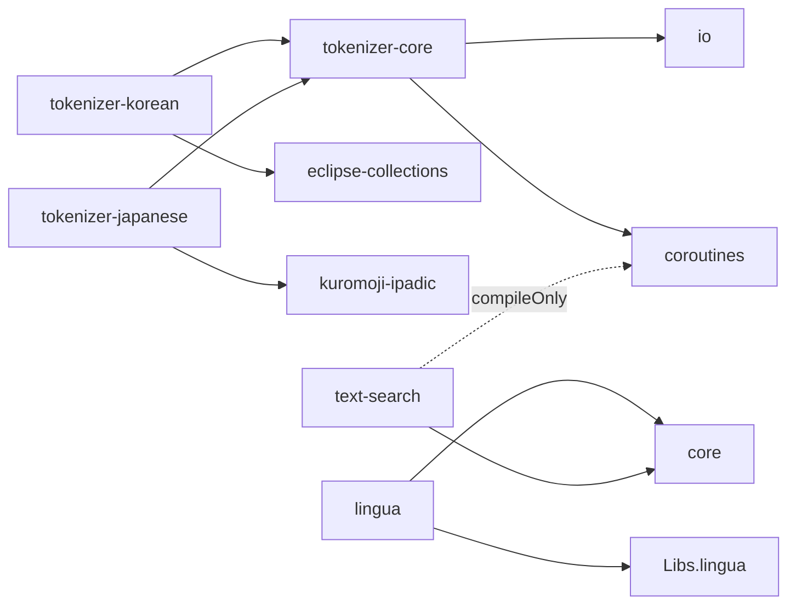

# texts/** 토크나이저·언어처리 모듈 승격 설계 (Spec)

- 작성일: 2026-04-27
- 이슈: #170
- 브랜치: `feat/texts-tokenizer-promotion`
- Worktree: `.worktrees/feat/texts-tokenizer-promotion`
- 작성자: planner (Opus, OMC)

---

## 0. 문제 재서술 + 제약 + 미지수

### 문제

현재 텍스트 처리 관련 코드가 세 곳에 흩어져 있어 일관성이 떨어진다.

- `x-obsoleted/tokenizer/` — `tokenizer-core`, `tokenizer-korean`, `tokenizer-japanese` (build에서 제외된 상태)
- `utils/lingua` — 언어 감지(Lingua 기반)
- `utils/text-search` — Aho-Corasick 사전 매칭(이슈 #169 작업으로 최근 승격됨)

본 이슈(#170)에서는 이들을 단일 **`texts/`** 그룹으로 재배치(승격)하여 텍스트/자연어 처리 모듈을 한 곳으로 모은다. 동시에 `tokenizer-korean` 이 가지고 있던 **twitter-text 4.x 의존성**(EOL, 보안/유지보수 부채)을 제거하고 인라인 정규식으로 대체한다.

최종 모듈 구조:

```
texts/
├── tokenizer-core      → bluetape4k-tokenizer-core
├── tokenizer-korean    → bluetape4k-tokenizer-korean
├── tokenizer-japanese  → bluetape4k-tokenizer-japanese
├── lingua              → bluetape4k-lingua
└── text-search         → bluetape4k-text-search
```

### 제약

- Kotlin 2.3, JVM 21, JUnit 5 + MockK + Kluent.
- `settings.gradle.kts` 의 `includeModules("texts", withBaseDir = false)` 패턴으로 디렉토리명 → 아티팩트 `bluetape4k-{dirname}` 자동 등록.
- 단일 PR 로 처리한다 (모듈 이동 + twitter-text 제거 + Libs.kt 정비).
- **이동 방식은 `git mv` 로 히스토리 보존**. 단순 이동 + 오타 수정만 허용 (Kotlin 2.3 API 현대화는 후속 PR).
- 포맷: IntelliJ + .editorconfig (ktlint 금지). KDoc 한글 허용. 테스트 출력은 production-quality.
- README.md + README.ko.md 양쪽 작성. Mermaid UML 포함.
- twitter-text 의존성은 **완전 제거**. 대체로직은 `tokenizer-korean` 내부에서 자체 구현.

### 미지수 (사용자 결정 필요는 아닌, spec 내에서 결단할 사항)

- A1. `tokenizer/` 우산(umbrella) 모듈을 만들지 말지 → §2 에서 평면 5모듈 결정.
- A2. twitter-text 의 `Regex.VALID_URL` / `VALID_HASHTAG` / `VALID_MENTION_OR_LIST` / `VALID_CASHTAG` 대체 방법 → §3 에서 `internal object TwitterCompatPatterns` 별도 파일 결정.
- A3. 기존 오타(`KoreanNomalizer`, `PunchuationProcessor`)를 같은 PR에서 수정할지 → §4 에서 _실제 존재 시_ `@Deprecated typealias 1 cycle 유지_ 후 다음 minor 제거.
- A4. lingua / text-search 모듈은 이미 `utils/` 에 존재 → `git mv utils/lingua texts/lingua` 형태로 동일 PR에서 이동.
- A5. kuromoji 버전 상수화 위치 → `buildSrc/Libs.kt` 의 `Versions` + `Libs` 양쪽에 추가.

---

## 1. 설계 리스크 / 실패 모드

### R1. VALID_URL 단순화로 인한 URL 인식률 저하 (HIGH)

twitter-text 의 `Regex.VALID_URL` 은 IDN(국제화 도메인), emoji TLD, punycode 등 매우 넓은 범위를 커버한다. 이를 RFC 3986 기반 단순 패턴으로 줄이면 일부 입력에서 URL 매치가 실패할 수 있다.

- **대응**: `KoreanChunkerTest` 의 기존 fixture 가 100% 통과해야만 PR 머지. fixture 가 IDN/emoji TLD 케이스를 포함하지 않는다면 `README.ko.md` 와 `TwitterCompatPatterns.kt` KDoc 에 "단순화된 RFC 3986 기반 패턴, IDN/emoji TLD 미지원" 명시.

### R2. kuromoji-ipadic ~50MB 빌드/배포 영향 (MEDIUM)

`tokenizer-japanese` 가 의존하는 `kuromoji-ipadic` 사전은 ~50MB. CI 빌드 시간/캐시/Maven 게시 용량에 영향.

- **대응**: 런타임에 사전이 필요하므로 `compileOnly` 가 아닌 **`api` 의존**으로 노출 유지 (소비자도 자동으로 사전 가짐). PR 머지 후 CI 빌드 시간을 모니터링해 5분 이상 증가 시 `runtimeOnly` 로 변경 검토.

### R3. git mv 후 Gradle 캐시 오염 (MEDIUM)

기존 `utils/lingua`, `utils/text-search`, `x-obsoleted/tokenizer/*` 의 빌드 캐시가 새 위치를 인식하지 못해 NoClassDefFoundError 등이 발생할 수 있다.

- **대응**: `git mv` 직후 `./gradlew clean` 실행으로 캐시 초기화. CI 의 `--no-build-cache` 옵션은 그대로 유지.

### R4. lingua CHANGELOG 이력 이중 기록 (LOW)

`utils/lingua` 는 이미 한 번 모듈로 승격된 적 있어 `CHANGELOG.md` 에 "lingua 모듈 추가" 기록이 있다. 이번 이동을 또 "이동" 으로 적으면 이력이 흐려짐.

- **대응**: `CHANGELOG.md` 의 `Unreleased` 섹션에 `### Moved` 또는 `### Changed` 항목으로 "utils/lingua → texts/lingua 재이동", "utils/text-search → texts/text-search 재이동" 명시.

### R5. benchmark sourceSet 경로 변경 (MEDIUM)

`utils/text-search` 는 JMH benchmark sourceSet (`benchmarkAhocorasick`) 을 가짐. 이동 후 task 이름이 변경되거나 빌드가 깨질 수 있다.

- **대응**: 이동 후 `./gradlew :bluetape4k-text-search:benchmarkAhocorasick` 명령으로 빌드/실행 확인. task 이름은 모듈명에 의존하지 않으므로 동일 이름 유지가 정상.

### R6. KoreanChunker.kt 패턴 교체 시 미묘한 동작 변화 (HIGH)

`KoreanChunker.kt:63-67` 의 4개 정규식 상수를 `TwitterCompatPatterns` 로 교체할 때, 그룹 캡처 인덱스가 달라지면 `Matcher.group(N)` 호출 위치가 모두 깨진다.

- **대응**: `TwitterCompatPatterns` 의 각 패턴은 `(?:non-capture)` 그룹 위주로 작성하여 캡처 그룹 수를 1개(전체 매치)로 유지. `KoreanChunkerTest` 100% 통과가 게이트.

---

## 2. 접근법 비교

### 접근법 A: 평면 5 모듈 (umbrella 없음)

```
texts/
├── tokenizer-core
├── tokenizer-korean
├── tokenizer-japanese
├── lingua
└── text-search
```

- Pros: `settings.gradle.kts` 의 `includeModules` 자동 등록과 정확히 맞음. 개별 모듈 의존성이 명료. 사용자가 필요한 것만 골라 의존.
- Cons: 5개 아티팩트가 모두 별도 게시.

### 접근법 B: umbrella 모듈 + sub modules

```
texts/
└── tokenizer/
    ├── core/
    ├── korean/
    └── japanese/
texts/lingua/
texts/text-search/
```

- Pros: tokenizer 3종이 묶여 보임.
- Cons: `settings.gradle.kts` 의 자동 등록 패턴(`{dirname}` → `bluetape4k-{dirname}`)과 충돌. 별도 등록 코드 필요. 모듈 그래프 복잡.

### 접근법 C: 단일 `texts/all` 통합 모듈

- Pros: 의존 1개로 모두 사용.
- Cons: kuromoji 50MB 가 lingua 만 쓰는 사용자에게도 강제. 분리 설계의 장점 소실.

### 권고: **접근법 A (평면 5 모듈)**

`includeModules` 자동 등록 패턴과 정합. 개별 모듈 선택 의존이 가능하여 kuromoji 같은 큰 사전 의존성을 격리할 수 있다. umbrella 모듈을 만들 만한 공통 코드도 없다 (각 토크나이저는 `tokenizer-core` API만 공유).

---

## 3. API / 모듈 설계

### 3.1 모듈 의존 그래프



### 3.2 각 모듈의 의존 (build.gradle.kts)

#### `texts/tokenizer-core/build.gradle.kts`

```kotlin
dependencies {
    api(project(":bluetape4k-io"))
    api(project(":bluetape4k-coroutines"))

    testImplementation(project(":bluetape4k-junit5"))
}
```

#### `texts/tokenizer-korean/build.gradle.kts`

현재 `x-obsoleted/tokenizer/korean/build.gradle.kts` 의 의존성을 그대로 유지하되 다음 두 가지만 변경한다:

1. `api("com.twitter.twittertext:twitter-text:3.1.0")` 라인 **제거**
2. `api(Libs.eclipse_collections)` → `implementation(Libs.eclipse_collections)` (공개 API에 노출 없음 — 내부 구현 전용)

나머지 의존성(`bluetape4k-io`, `bluetape4k-coroutines`, `kotlinx_coroutines_core`, `commons_collections4`, `eclipse_collections_forkjoin`, `org.openkoreantext:open-korean-text:2.3.1`, `eclipse_collections_testutils`)은 모두 그대로 유지.

최종 형태:

```kotlin
configurations {
    testImplementation.get().extendsFrom(compileOnly.get(), runtimeOnly.get())
}

dependencies {
    api(project(":bluetape4k-io"))
    api(project(":bluetape4k-coroutines"))
    api(project(":bluetape4k-tokenizer-core"))
    testImplementation(project(":bluetape4k-junit5"))

    // twitter-text 의존성 제거 — TwitterCompatPatterns 로 대체
    // Benchmark 비교를 위해
    testImplementation("org.openkoreantext:open-korean-text:2.3.1")

    // Coroutines
    api(Libs.kotlinx_coroutines_core)
    testImplementation(Libs.kotlinx_coroutines_test)

    // Collections
    implementation(Libs.commons_collections4)
    implementation(Libs.eclipse_collections)            // api → implementation 으로 변경 (공개 API 노출 없음)
    implementation(Libs.eclipse_collections_forkjoin)
    testImplementation(Libs.eclipse_collections_testutils)
}
```

#### `texts/tokenizer-japanese/build.gradle.kts`

현재 `x-obsoleted/tokenizer/japanese/build.gradle.kts` 는 인라인 버전 변수(`val kuromoji = "0.9.0"`) 와 직접 좌표 문자열을 사용한다. T2 에서 등록한 `Libs.kuromoji_ipadic` / `Libs.kuromoji_unidic` 상수로 치환한다. `compileOnly(Libs.kuromoji_unidic)` 도 그대로 유지(고품질 사전 옵션).

최종 형태:

```kotlin
configurations {
    testImplementation.get().extendsFrom(compileOnly.get(), runtimeOnly.get())
}

dependencies {
    api(project(":bluetape4k-tokenizer-core"))
    api(Libs.kuromoji_ipadic)
    compileOnly(Libs.kuromoji_unidic)

    api(project(":bluetape4k-coroutines"))
    api(Libs.kotlinx_coroutines_core)
    testImplementation(Libs.kotlinx_coroutines_test)

    testImplementation(project(":bluetape4k-junit5"))
}
```

#### `texts/lingua/build.gradle.kts`

```kotlin
dependencies {
    api(project(":bluetape4k-core"))
    api(Libs.lingua)

    testImplementation(project(":bluetape4k-junit5"))
}
```

#### `texts/text-search/build.gradle.kts`

```kotlin
dependencies {
    api(project(":bluetape4k-core"))
    compileOnly(project(":bluetape4k-coroutines"))
    compileOnly(Libs.kotlinx_coroutines_core)

    testImplementation(project(":bluetape4k-junit5"))
    testImplementation(project(":bluetape4k-coroutines"))
    testImplementation(Libs.kotlinx_coroutines_test)

    // benchmark sourceSet 유지
}
```

### 3.3 `TwitterCompatPatterns.kt`

위치: `texts/tokenizer-korean/src/main/kotlin/io/bluetape4k/tokenizer/korean/utils/TwitterCompatPatterns.kt`

#### 핵심 검증 fixture (`KoreanChunkerTest`)

패턴 작성 시 다음 fixture 가 100% 통과해야 한다. start/end 인덱스는 **전체 매치 범위** (`Matcher.start()`/`end()`) 기준이며, 선행 공백/괄호도 매치에 포함된다.

- **bare-domain URL** (scheme 없음, 시작 위치):
  - `"openkoreantext.org에서 ..."` → `ChunkMatch(0, 18, "openkoreantext.org", URL)`
  - `"... pic.twitter.com ..."` → `ChunkMatch(20, 35, "pic.twitter.com", URL)`
- **scheme URL with 선행 `(`**:
  - `"스팀(https://store.steampowered.com)에서 ..."` → `ChunkMatch(2, 33, "(https://store.steampowered.com", URL)` (선행 `(` 포함, 31자)
- **Hashtag with 선행 공백**:
  - `"... 자전거가 있다. #Google #이쁜자전거 #갖고싶다"` → `(20, 28, " #Google")`, `(28, 35, " #이쁜자전거")`, `(35, 41, " #갖고싶다")`
- **Hashtag at line start** (선행 공백 없음):
  - `"#korean_tokenizer_rocks 우하하"` 의 일부 → `KoreanToken("#korean_tokenizer_rocks", Hashtag, 18, 23)`
- **ScreenName with 선행 공백**:
  - `"... 가능합니다. @ironman을 @drstrange로 ..."` → `(24, 33, " @ironman")`, `(34, 45, " @drstrange")`
- **ScreenName at line start**:
  - `"@nlpenguin @edeng ..."` → `KoreanToken("@nlpenguin", ScreenName, 0, 10)`
- **CashTag (소문자, 선행 공백 포함)**:
  - `"... 주식은 $twtr, Apple의 주식은 $appl ..."` → `(25, 31, " $twtr")`, `(43, 49, " $appl")`

위 fixture 에서 알 수 있는 사실:
1. URL/Hashtag/ScreenName/CashTag 의 매치 범위는 **선행 공백 또는 `(` 1글자를 포함**한다 (있을 때).
2. 시작 위치(`^`)에서는 선행 글자가 없으므로 매치는 본체에서 시작한다.
3. CashTag 는 **소문자 입력**(`$twtr`, `$appl`) 도 매치되어야 한다.
4. URL 은 scheme 유무 모두 지원해야 한다 (`pic.twitter.com`, `openkoreantext.org` 같은 bare-domain).

#### 패턴 정의

캡처 그룹 정책: **그룹 1 = 선행 공백/괄호 (있을 때 빈 문자열)**, **그룹 2 = 핵심 매치**. `Matcher.start()`/`end()` 는 두 그룹을 합친 **전체 매치 범위**를 반환하므로 `KoreanChunker.findAllPatterns` 의 기존 호출과 호환된다 (검증 필요: 만약 `findAllPatterns` 가 `start(2)`/`end(2)` 를 호출해야 한다면 `KoreanChunker.kt` 의 fixture-driven 검증으로 결정).

```kotlin
package io.bluetape4k.tokenizer.korean.utils

import java.util.regex.Pattern

/**
 * twitter-text 4.x 의존성 제거를 위한 호환 패턴.
 *
 * 원본 [twitter-text](https://github.com/twitter/twitter-text) 의 `Regex.VALID_URL`,
 * `VALID_HASHTAG`, `VALID_MENTION_OR_LIST`, `VALID_CASHTAG` 를 KoreanChunker 가 필요로 하는
 * 최소 기능만 추출하여 자체 정의한 단순화 패턴이다.
 *
 * **제한 사항**:
 * - `VALID_URL` 은 RFC 3986 기반 단순화 패턴이며 scheme(`http(s)`/`ftp`/`www.`) 또는
 *   bare-domain (`pic.twitter.com`, `openkoreantext.org`) 모두 지원한다.
 * - **IDN(국제화 도메인), emoji TLD, punycode 는 미지원** (twitter-text 가 제공하던 광범위 패턴 제외).
 * - 캡처 그룹은 패턴당 2개: 그룹 1 = 선행 공백/괄호 (옵셔널), 그룹 2 = 핵심 매치.
 *   `Matcher.start()`/`end()` 는 그룹 1+2 합친 전체 매치 범위 — KoreanChunkerTest fixture 와 호환.
 *
 * 정확도가 더 필요한 경우 [twitter-text-java](https://github.com/twitter/twitter-text/tree/master/java)
 * 를 직접 의존하라.
 */
internal object TwitterCompatPatterns {

    /**
     * URL 패턴 — scheme 유무 관계없이 도메인 매치.
     *
     * - scheme URL: 선행 `(` 옵셔널 포함 (예: `(https://store.steampowered.com`)
     * - bare-domain URL: 시작 위치 또는 공백 뒤에서 매치 (예: `openkoreantext.org`, ` pic.twitter.com`)
     *
     * 제약: IDN/emoji TLD 미지원.
     */
    val VALID_URL: Pattern = Pattern.compile(
        """(\(?(?:https?://|ftp://|www\.)|(?<=\s|^)(?=[a-zA-Z0-9])(?:[a-zA-Z0-9\-]+\.)+[a-zA-Z]{2,})""" +
        """[a-zA-Z0-9\-._~:/?#\[\]@!${'$'}&'()*+,;=%-]*""",
        Pattern.UNICODE_CASE
    )

    /**
     * Hashtag 패턴 — 선행 공백 포함 (또는 라인 시작), 한글/영문/숫자/밑줄 지원.
     * 그룹 1: 선행 공백 (옵셔널), 그룹 2: `#…` 본체.
     */
    val VALID_HASHTAG: Pattern = Pattern.compile(
        """(\s|^)(#[\p{L}\p{Digit}_]+)""",
        Pattern.UNICODE_CASE or Pattern.UNICODE_CHARACTER_CLASS
    )

    /**
     * @mention 및 @user/list 패턴 — 선행 공백 포함 (또는 라인 시작).
     * 그룹 1: 선행 공백 (옵셔널), 그룹 2: `@…` 본체.
     */
    val VALID_MENTION_OR_LIST: Pattern = Pattern.compile(
        """(\s|^)(@[\p{Alnum}_]+(?:/[\p{Alnum}_]+)?)""",
        Pattern.UNICODE_CASE
    )

    /**
     * CashTag 패턴 — 선행 공백 포함, 대소문자 구분 없음 (fixture: `$twtr`, `$appl`).
     * 그룹 1: 선행 공백 (옵셔널), 그룹 2: `$…` 본체.
     */
    val VALID_CASHTAG: Pattern = Pattern.compile(
        """(\s|^)(\$[A-Za-z]{1,6}(?:\.[A-Za-z]{1,2})?)"""
    )
}
```

> **구현 참고**: `KoreanChunker.findAllPatterns` 는 현재 `Matcher.start()`/`end()` 와 `Matcher.group()` 를 사용한다.
> 위 패턴은 그룹 1 + 그룹 2 가 합쳐진 매치 범위를 그대로 반환하도록 설계되었으므로 `start()`/`end()` 그대로 사용 가능하다.
> 단, `group()` 호출이 그룹 0 (전체 매치) 을 반환하는지 확인하고, 만약 본체만 필요하면 `group(2)` 로 변경한다.
> `KoreanChunkerTest` fixture (위 §3.3 검증 fixture) 100% 통과가 최종 게이트.

#### ⚠️ VALID_URL 캡처 그룹 비대칭성 (필독)

위 4개 패턴은 **선행 공백/괄호 처리 방식이 서로 다르다**:

| 패턴                   | 선행 처리 방식                | `start()`/`end()` 범위              | 본체 추출 방법         |
| ---------------------- | ----------------------------- | ----------------------------------- | ---------------------- |
| `VALID_URL`            | **lookbehind** `(?<=\s|^)` 사용 | 본체만 (선행 공백 **미포함**)       | `group()` = 전체 매치 |
| `VALID_HASHTAG`        | 캡처 그룹 1 = `(\s|^)`        | 그룹 1+2 합산 (선행 공백 **포함**) | `group(2)` 본체만     |
| `VALID_MENTION_OR_LIST`| 캡처 그룹 1 = `(\s|^)`        | 그룹 1+2 합산 (선행 공백 **포함**) | `group(2)` 본체만     |
| `VALID_CASHTAG`        | 캡처 그룹 1 = `(\s|^)`        | 그룹 1+2 합산 (선행 공백 **포함**) | `group(2)` 본체만     |

**결과**:
- `KoreanChunker.findAllPatterns` 가 `Matcher.start()`/`end()` 를 그대로 호출하면 URL 매치는 본체만, Hashtag/ScreenName/CashTag 매치는 선행 공백을 포함한다.
- 위 §3.3 검증 fixture 의 Hashtag/ScreenName/CashTag start/end 인덱스는 **선행 공백을 포함**한다 (예: ` #Google` 의 start=20, length=8).
- 만약 fixture 가 일치하지 않으면 패턴 타입에 따라 분기가 필요할 수 있다:
  - URL → `m.start()`/`m.end()` 그대로
  - 그 외 (Hashtag/ScreenName/CashTag) → `m.start(2)`/`m.end(2)` 로 본체 범위만 사용
- `KoreanChunkerTest` 의 start/end 인덱스가 `findAllPatterns` 결과와 정확히 맞는지 확인이 **T9 검증의 필수 항목**.

### 3.4 `KoreanChunker.kt` `POS_PATTERNS` 맵 교체 (현재→이후)

대상 파일: `texts/tokenizer-korean/src/main/kotlin/io/bluetape4k/tokenizer/korean/tokenizer/KoreanChunker.kt`
(현재 위치: `x-obsoleted/tokenizer/korean/src/main/kotlin/io/bluetape4k/tokenizer/korean/tokenizer/KoreanChunker.kt`)

twitter-text 참조는 `POS_PATTERNS: Map<KoreanPos, Pattern>` 맵 안에서 4개 라인에 인라인으로 등장한다.

**현재 (twitter-text 의존, `POS_PATTERNS` 맵 내부)**:

```kotlin
val POS_PATTERNS: Map<KoreanPos, Pattern> = mapOf(
    Korean to """([가-힣]+)""".toRegex().toPattern(),
    Alpha to """(\p{Alpha}+)""".toRegex().toPattern(),
    Number to ("""(\$?\p{Digit}+""" + ... ).toRegex().toPattern(),
    KoreanParticle to """([ㄱ-ㅣ]+)""".toRegex().toPattern(),
    Punctuation to """([\p{Punct}·…’]+)""".toRegex().toPattern(),
    URL to com.twitter.twittertext.Regex.VALID_URL,
    Email to """([\p{Alnum}.\-_]+@[\p{Alnum}.]+)""".toRegex().toPattern(),
    Hashtag to com.twitter.twittertext.Regex.VALID_HASHTAG,
    ScreenName to com.twitter.twittertext.Regex.VALID_MENTION_OR_LIST,
    CashTag to com.twitter.twittertext.Regex.VALID_CASHTAG,
    Space to """\s+""".toRegex().toPattern()
)
```

**이후 (자체 패턴)**:

```kotlin
import io.bluetape4k.tokenizer.korean.utils.TwitterCompatPatterns
// ...
val POS_PATTERNS: Map<KoreanPos, Pattern> = mapOf(
    Korean to """([가-힣]+)""".toRegex().toPattern(),
    Alpha to """(\p{Alpha}+)""".toRegex().toPattern(),
    Number to ("""(\$?\p{Digit}+""" + ... ).toRegex().toPattern(),
    KoreanParticle to """([ㄱ-ㅣ]+)""".toRegex().toPattern(),
    Punctuation to """([\p{Punct}·…’]+)""".toRegex().toPattern(),
    URL to TwitterCompatPatterns.VALID_URL,
    Email to """([\p{Alnum}.\-_]+@[\p{Alnum}.]+)""".toRegex().toPattern(),
    Hashtag to TwitterCompatPatterns.VALID_HASHTAG,
    ScreenName to TwitterCompatPatterns.VALID_MENTION_OR_LIST,
    CashTag to TwitterCompatPatterns.VALID_CASHTAG,
    Space to """\s+""".toRegex().toPattern()
)
```

import 변경:
- 추가: `import io.bluetape4k.tokenizer.korean.utils.TwitterCompatPatterns`
- 제거: `com.twitter.twittertext.Regex` 관련 (현재 KoreanChunker 는 `com.twitter.twittertext.Regex` 를 wildcard 로 사용하지 않고 인라인 fully-qualified 참조를 쓰므로, 인라인 4건만 교체하면 자동으로 외부 패키지 의존이 사라진다)

게이트: `KoreanChunkerTest` 100% 통과.

### 3.5 `buildSrc/Libs.kt` 추가/제거

**추가**:

```kotlin
object Versions {
    // ...
    const val kuromoji = "0.9.0"
}

object Libs {
    // ...
    const val kuromoji_ipadic = "com.atilika.kuromoji:kuromoji-ipadic:${Versions.kuromoji}"
    const val kuromoji_unidic = "com.atilika.kuromoji:kuromoji-unidic:${Versions.kuromoji}"
}
```

**제거 검토**: `Libs.twitter_text` 가 등록되어 있다면 본 PR 에서 함께 제거 (다른 모듈에서 참조 0건 확인 후).

---

## 4. 오타 수정 정책

`x-obsoleted/tokenizer/korean/` 의 두 파일은 **파일명만 오타**이고, 내부 심볼(`object KoreanNormalizer`, `class PunctuationProcessor`)은 이미 정상이다.

- `normalizer/KoreanNomalizer.kt` → `git mv` → `normalizer/KoreanNormalizer.kt`
- `block/PunchuationProcessor.kt` → `git mv` → `block/PunctuationProcessor.kt`

외부 소비자가 사용하는 심볼명은 이미 정상이므로 `@Deprecated typealias` 불필요.
이동 후 `rg "KoreanNomalizer|PunchuationProcessor" texts/` 로 잔여 참조 0건 확인.

---

## 5. 작업 순서 (개발자 체크리스트)

1. **존재 검증**: `fd -t f . x-obsoleted/tokenizer utils/lingua utils/text-search` 로 이동 대상 모두 존재 확인.
1.5. **다운스트림 참조 사전 스캔**:
   ```bash
   rg "(:bluetape4k-lingua|:bluetape4k-text-search|:bluetape4k-tokenizer)" \
     --glob "*.kts" --glob "*.gradle"
   ```
   결과가 0건이어야 이동 진행. 발견 시 해당 모듈 동시 업데이트 또는 스펙 검토.
2. **오타 검증**: 오타는 **파일명**에만 존재하고 내부 심볼은 정상이므로 파일명 검색을 사용한다.
   - `fd "Nomalizer|Punchuation" x-obsoleted/tokenizer/` (파일명 검색 — `rg` 는 파일 내용만 보므로 0건 반환됨)
   - 매치 결과를 PR 본문에 기록.
3. **`texts/` 디렉토리 생성** + `settings.gradle.kts` 에 `includeModules("texts", withBaseDir = false)` 라인 추가.
4. **5개 모듈 git mv 이동** (실제 디렉토리는 `core`/`korean`/`japanese` — `tokenizer-` 접두사 없음):
   - `git mv x-obsoleted/tokenizer/core      texts/tokenizer-core`
   - `git mv x-obsoleted/tokenizer/korean    texts/tokenizer-korean`
   - `git mv x-obsoleted/tokenizer/japanese  texts/tokenizer-japanese`
   - `git mv utils/lingua                    texts/lingua`
   - `git mv utils/text-search               texts/text-search`
5. **`./gradlew clean`** 으로 캐시 초기화.
6. **`buildSrc/Libs.kt`** 에 kuromoji 버전/의존성 추가.
7. **`TwitterCompatPatterns.kt`** 작성.
8. **`KoreanChunker.kt:63-67`** 교체 + import 정리.
9. **`tokenizer-korean/build.gradle.kts`** 에서 twitter-text 의존성 제거.
10. **`TwitterCompatPatternsTest`** 작성 (4개 패턴 각각 happy/edge case).
11. **`./gradlew :bluetape4k-tokenizer-korean:test`** 100% 통과 확인 (`KoreanChunkerTest` 포함).
12. **나머지 4개 모듈** 각각 `:test` 통과 확인.
13. **오타 수정** (해당 시): 4번 단계에서 검증된 결과대로 처리.
14. **5개 모듈 README.md + README.ko.md** 작성/갱신 (Mermaid UML 포함).
15. **루트 `CLAUDE.md`** Module Groups 표에 `texts/` 행 추가.
16. **`TODO.md`** tokenizer 항목 "삭제" → "승격 완료"로 정정.
17. **`CHANGELOG.md`** Unreleased 섹션에 lingua/text-search 재이동 + tokenizer 승격 + twitter-text 제거 명시.
18. **루트 `README.md` + `README.ko.md`** Module Groups 업데이트.
19. **`docs/superpowers/index/2026-04.md` + `INDEX.md`** 본 spec 등록.
20. **`x-obsoleted/tokenizer/`** 디렉토리 비었음 확인 → 디렉토리 자체 삭제 (`git rm -r`).
21. **`./gradlew :bluetape4k-text-search:benchmarkAhocorasick`** 빌드 확인.
22. **`./gradlew clean build -x test`** 전체 컴파일 확인.

---

## 6. DoD (Definition of Done)

- [ ] `texts/` 디렉토리 구조 + `settings.gradle.kts` 등록
- [ ] 5개 모듈 git mv 이동 완료 (`tokenizer-core`, `tokenizer-korean`, `tokenizer-japanese`, `lingua`, `text-search`)
- [ ] `TwitterCompatPatterns.kt` 작성 + `KoreanChunker.kt` 패턴 교체
- [ ] `tokenizer-korean/build.gradle.kts` 에서 twitter-text 의존성 제거
- [ ] `TwitterCompatPatternsTest` 작성 + `KoreanChunkerTest` 100% 통과
- [ ] `buildSrc/Libs.kt` 에 kuromoji 등록 (버전 상수화)
- [ ] 5개 모듈 모두 `./gradlew :{module}:test` 통과
- [ ] 5개 모듈 `README.md` + `README.ko.md` 작성 (Mermaid UML 포함)
- [ ] tokenizer-korean README 에 "TwitterCompatPatterns 제약: IDN/emoji TLD 미지원, bare-domain 지원" 명시
- [ ] `CLAUDE.md` Module Groups 표에 `texts/` 그룹 추가
- [ ] `TODO.md` tokenizer 항목 "삭제" → "승격 완료" 정정
- [ ] `CHANGELOG.md` 에 lingua/text-search 재이동 + tokenizer 승격 + twitter-text 제거 항목
- [ ] 루트 `README.md` + `README.ko.md` Module Groups 업데이트
- [ ] `docs/superpowers/index/2026-04.md` + `INDEX.md` 갱신
- [ ] `x-obsoleted/tokenizer/` 디렉토리 삭제 확인
- [ ] `:bluetape4k-text-search:benchmarkAhocorasick` 빌드 통과
- [ ] (오타 존재 시) `@Deprecated typealias` 1 cycle 유지 + 다음 minor 제거 메모

---

## 7. Risks & Mitigations

| 위험                                               | 대응                                                                                  |
| -------------------------------------------------- | ------------------------------------------------------------------------------------- |
| VALID_URL 단순화로 URL 인식률 저하                 | `KoreanChunkerTest` 기존 fixture 전수 통과가 게이트, README 에 한계 명시              |
| `kuromoji-ipadic` ~50MB 빌드 영향                  | `api` 의존 유지 (런타임 필요), CI 빌드 시간 모니터링                                  |
| `git mv` 후 Gradle 캐시 오염                       | mv 직후 `./gradlew clean` 으로 캐시 초기화                                            |
| lingua CHANGELOG 이력 이중 기록                    | `CHANGELOG.md` 에 "utils/lingua → texts/lingua 재이동" 명시                           |
| benchmark sourceSet 경로 변경                      | text-search 이동 후 `:bluetape4k-text-search:benchmarkAhocorasick` 빌드 확인          |
| `KoreanChunker.kt` 패턴 교체 시 캡처 그룹 차이     | `TwitterCompatPatterns` 패턴은 그룹 1=선행공백/그룹 2=본체 정책, `start()`/`end()` 전체 범위 사용, `KoreanChunkerTest` fixture 가 게이트 |
| 오타 파일 미존재 시 무리한 수정                    | 4번 단계에서 `rg` 결과 우선 확인 후 처리                                              |
| `git mv` 후 빌드 파손                              | `git mv` reverse 수행: 5개 모듈을 원래 경로로 `git mv` 복구 + `git checkout settings.gradle.kts buildSrc/Libs.kt` |

---

## 8. Non-Goals

- umbrella 모듈 (`texts/tokenizer`) 생성
- lingua ↔ tokenizer 자동 라우터 구현
- Kotlin 2.3 API 현대화 (sealed class, value class, context parameters 등 — 후속 PR)
- kuromoji-unidic 고품질 사전 교체
- IDN / emoji TLD URL 지원 (twitter-text 가 제공하던 광범위 패턴)
- twitter-text 동등 100% 호환 (실용 fixture 통과만 보장)

---

## 9. 참고

- 이슈 #170 (texts/** 토크나이저·언어처리 모듈 승격)
- 이전 작업 #169 (`utils/text-search` 승격) — 본 PR 에서 `texts/text-search` 로 재이동
- 기존 spec `2026-04-26-utils-text-search-design.md` — text-search 자체 설계 (이동 후에도 그대로 유효)
- twitter-text 4.x EOL 고지: <https://github.com/twitter/twitter-text>
- kuromoji 0.9.0: <https://github.com/atilika/kuromoji>
