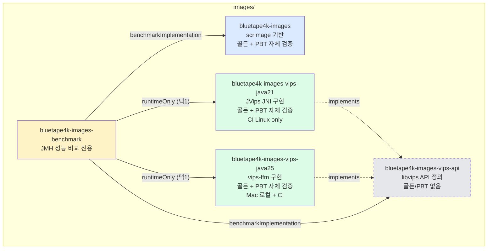

# Images Quality & Performance Testing Design

- **Spec ID**: 2026-04-29-images-quality-testing-design
- **Issue**: [#138 [utils/images] 품질 / 테스트 (JMH 벤치마크 / 골든 이미지 / PBT)](https://github.com/debop/bluetape4k-projects/issues/138)
- **작성일**: 2026-04-29 (revised)
- **브랜치**: `feat/images-quality-testing`
- **워크트리**: `.worktrees/images-quality-testing/`
- **대상 모듈**:
    - `images/images` (scrimage 기반)
    - `images/images-vips-java21` (JVips JNI 구현)
    - `images/images-vips-java25` (vips-ffm FFM 구현)
    - `images/images-benchmark` (신규 — JMH 성능 비교 전용)

---

## 1. 배경 및 목적

### 1.1 배경

bluetape4k 의 이미지 처리 모듈은 두 가지 백엔드를 지원한다.

1. **`bluetape4k-images`** — Scala 기반 [scrimage](https://github.com/sksamuel/scrimage) 위에 구축된 순수 JVM 이미지 처리 모듈
2. **`bluetape4k-images-vips-*`** — [libvips](https://www.libvips.org/) 바인딩
    - `images-vips-api` — 공통 API/인터페이스 정의 모듈 (실행 가능 vips 구현 없음)
    - `images-vips-java21` — JVips(JNI) 기반 구현 — Linux/CI 전용 (Mac 미지원)
    - `images-vips-java25` — vips-ffm(Foreign Function & Memory) 기반 구현 — Mac 로컬 + Linux/CI

현재 두 모듈 모두 단위 테스트는 갖추고 있으나 다음이 부족하다.

- **시각적 회귀(Visual Regression)** 검증 부재 — 픽셀 단위 비교만으로는 라이브러리 업그레이드/리팩토링이 사용자 결과물에 미치는 영향을 발견하기 어렵다.
- **속성 기반 검증(Property-Based Testing)** 부재 — 이미지 변환의 수학적 불변식(차원 보존, round-trip 무손실, pHash 견고성 등)을 광범위한 입력 공간에서 검증할 수 있는 메커니즘이 없다.
- **scrimage vs vips 정량적 성능 비교** 부재 — 두 백엔드의 트레이드오프(JIT 친화적 순수 JVM vs SIMD 가속 네이티브)를 사용자가 합리적으로 선택할 수 있도록 측정된 데이터가 없다.

### 1.2 목적

- **정확성**: 각 실행 가능 모듈(`images`, `images-vips-java21`, `images-vips-java25`)이 골든 이미지 회귀 테스트와 JUnit5 PBT 로 자체 검증을 책임진다.
- **성능 비교**: 별도 `images-benchmark` 모듈에서 scrimage 와 vips 의 핵심 연산을 JMH 로 측정/문서화한다.
- **CI 통합**: nightly 워크플로우에서 골든 diff artifact 를 업로드하고, 벤치마크는 선택적으로 실행 가능하도록 한다.

### 1.3 비목표

- `images-vips-api` 의 골든/PBT — API 정의만 갖는 모듈로 실행 가능한 vips 구현이 없으므로 검증 대상 아님 (구현 모듈인 java21/java25 가 책임).
- 새로운 이미지 포맷이나 필터의 추가 — 본 작업은 **검증 인프라**에 집중한다.
- 외부 GPU/CUDA 가속 비교 — 현재 모듈 범위 밖.

---

## 2. 범위 (Scope)

### 2.1 In-Scope

| 모듈 | 추가 내용 |
|------|-----------|
| `images/images` | `GoldenImageAssert` 유틸리티, 골든 이미지 테스트(8장 이상), JUnit5 PBT(불변식 10개) |
| `images/images-vips-java21` | 골든 이미지 테스트(4장 이상), JUnit5 PBT(불변식 4개 이상). CI 전용 (`-Dvips.enabled=true`) |
| `images/images-vips-java25` | 골든 이미지 테스트(4장 이상), JUnit5 PBT(불변식 4개 이상). 로컬 Mac + CI 모두 실행 (`-Dvips.enabled=true`) |
| `images/images-benchmark` (신규) | JMH 벤치마크 4종(resize/encode/filter/similarity), publish/kover 제외 |
| 루트 `build.gradle.kts` | `-benchmark` 경로를 nmcp/kover/publish 제외 조건에 추가 (`endsWith("-benchmark")`) |
| `.github/workflows/nightly-tests.yml` | `test-images` job 신설 + 기존 `test-images-vips` job 수정 + 선택적 벤치마크 job |
| `docs/benchmark/images.md` | 벤치마크 결과 문서 |

### 2.2 Out-of-Scope

- `images/images-vips-api` 의 골든/PBT 작성
- 새로운 이미지 포맷/필터 추가
- macOS/Windows 골든 이미지 별도 관리 — Linux JVM CI 환경 기준 단일 골든
- vips RedHat/CentOS 패키지 매트릭스

### 2.3 플랫폼별 실행 매트릭스

| 환경 | `images-vips-java21` 골든/PBT | `images-vips-java25` 골든/PBT | 벤치마크 |
|------|-------------------------------|-------------------------------|----------|
| Mac 로컬 | **불가** (JVips JNI Mac 미지원) | 가능 (`-Dvips.enabled=true` + libvips brew install) | java25 vips 만 |
| Linux CI | 가능 (`-Dvips.enabled=true`) | 가능 (`-Dvips.enabled=true`) | java21 + java25 별도 측정 (벤치마크 두 설정) |

`@EnabledIfSystemProperty(named = "vips.enabled", matches = "true")` 가드를 모든 vips 테스트 클래스 최상단에 적용한다.

---

## 3. 아키텍처 설계

### 3.1 전체 모듈 구조



**핵심 결정 이유**

- **각 실행 가능 모듈이 자기 정확성을 책임진다**: 골든/PBT 는 모듈 내부에서 실행되어야 빌드 시 즉시 회귀를 잡을 수 있다.
- **`images-vips-api` 는 검증 대상 아님**: 인터페이스/팩토리 정의만 보유하므로 실행 가능한 vips 호출 경로가 없다. 구현 모듈인 java21/java25 가 검증을 수행한다.
- **`images-benchmark` 는 순수 성능 비교 전용**: scrimage 와 vips 두 구현체에 의존하므로 동일 입력에 대한 정량 비교가 가능하다.
- **publish/kover 제외**: 벤치마크는 라이브러리 사용자에게 배포할 산출물이 아니다.

### 3.2 `images/images` — 골든 이미지 테스트

#### 3.2.1 `GoldenImageAssert` 유틸리티

기존 `AbstractFilterTest.assertSimilarToImage / assertSimilarToResource` API 를 확장하여 **갱신 모드**를 지원하는 유틸리티를 신설한다.

```kotlin
// images/images/src/test/kotlin/io/bluetape4k/images/testing/GoldenImageAssert.kt
package io.bluetape4k.images.testing

import io.bluetape4k.logging.coroutines.KLoggingChannel

object GoldenImageAssert {

    companion object: KLoggingChannel()

    private const val GOLDEN_RESOURCE_ROOT = "golden"
    private const val DIFF_REPORT_DIR = "build/reports/golden-diffs"
    private const val UPDATE_PROPERTY = "bluetape4k.images.golden.update"
    private const val DEFAULT_TOLERANCE = 3

    /**
     * 실제 이미지를 골든 키와 비교하거나(기본 모드), 테스트 리소스에 골든을 새로 저장한다(갱신 모드).
     *
     * @param actual 비교할 실제 이미지
     * @param key 골든 식별자 — 예: `"resize/landscape-512x288.png"`
     * @param tolerance 픽셀 허용 오차(0..255). 기본값 3
     */
    fun assertSimilarToGolden(
        actual: ImmutableImage,
        key: String,
        tolerance: Int = DEFAULT_TOLERANCE,
    )
}
```

**동작 규칙**

| 모드 | 트리거 | 동작 |
|------|--------|------|
| 검증 모드 | 기본 | 리소스에서 골든 로드 → 픽셀 비교 → 실패 시 diff PNG 저장 후 `Assertions.fail()` (AssertionError) |
| 갱신 모드 | `-Dbluetape4k.images.golden.update=true` (CI 환경 외) | `<cwd>/src/test/resources/golden/<key>` 위치에 actual 을 PNG 로 저장(디렉토리 자동 생성), 그 후 `AssumptionViolatedException` throw → 테스트 skipped 처리 |

**갱신 모드 CWD 결정 로직**

```kotlin
private fun resolveGoldenWritePath(key: String): Path {
    val cwd = System.getProperty("user.dir")
    return Paths.get(cwd, "src", "test", "resources", GOLDEN_RESOURCE_ROOT, key)
}
```

Gradle 은 모듈별로 user.dir 을 해당 모듈 디렉토리로 설정하므로 별도 룩업 없이 일관된다.

**갱신 모드 CI 가드 (반드시 적용)**

```kotlin
private fun ensureNotCi() {
    if (System.getenv("CI") != null) {
        throw IllegalStateException(
            "Golden update mode is forbidden in CI. " +
                "Run locally with -Dbluetape4k.images.golden.update=true."
        )
    }
}
```

CI 환경에서 갱신 모드가 우발적으로 켜져 골든이 덮어써지는 사고를 차단한다.

**diff 이미지 생성 규칙**

- 위치: `build/reports/golden-diffs/<key>.diff.png`
- 내용: |actual.r - expected.r|, |actual.g - expected.g|, |actual.b - expected.b| 의 RGB 채널 차분을 시각화한 PNG
- CI 에서 artifact 로 업로드되어 사람이 확인 가능

**골든 이미지 카테고리 (`src/test/resources/golden/`)**

```
golden/
  resize/
    landscape-512x288.png
    cafe-thumbnail-128x128.png
    aqua-half.png
  filters/
    debop-blur.png
    debop-grayscale.png
    debop-sepia.png
  encoders/
    cafe-jpeg-q80.jpg
    landscape-png-rgba.png
```

#### 3.2.2 골든 기준 환경

- **OS**: Linux (Ubuntu LTS — CI 환경)
- **JVM**: Eclipse Temurin 21
- **scrimage**: `Libs.scrimage_*` 잠금 버전
- **tolerance 권장값**:
    - 리사이즈/변환: `2`
    - 필터: `3`
    - JPEG 인코딩 round-trip: `5`
    - PNG round-trip(무손실): `0`

macOS/Windows 로컬 실행 시 미세한 차이가 있을 수 있으므로 tolerance 로 흡수한다.

### 3.3 `images/images` — JUnit5 Property-Based Testing

**제약: Kotest 사용 금지** — 본 프로젝트는 JUnit5 + Kluent + MockK 만 허용한다.

JUnit5 의 `@ParameterizedTest` + `@MethodSource` 로 결정적 입력을 생성하여 PBT 와 동등한 효과를 낸다.

#### 3.3.1 입력 생성기 — edge case 고정 포함

```kotlin
object ImagePropertyInputs {

    private const val SEED = 42L

    fun resizeDimensions(): List<Arguments> {
        val rng = Random(SEED)
        // edge case 고정 입력
        val edgeCases = listOf(
            Arguments.of(1, 1),       // 1x1 — 최소 이미지
            Arguments.of(2048, 1),    // 1:2048 — 극단적 가로 종횡비
            Arguments.of(1, 2048),    // 2048:1 — 극단적 세로 종횡비
            Arguments.of(64, 640),    // 1:10 종횡비
        )
        // 무작위 입력 16개
        val random = List(16) {
            val w = rng.nextInt(64, 1024)
            val h = rng.nextInt(64, 1024)
            Arguments.of(w, h)
        }
        return edgeCases + random
    }

    /** 단색/복잡 이미지 등 콘텐츠 edge case 도 별도 시드로 제공 */
    fun edgeContentImages(): List<Arguments> = listOf(
        Arguments.of("solid-red", solidColorImage(64, 64, Color.RED)),
        Arguments.of("solid-black", solidColorImage(64, 64, Color.BLACK)),
        Arguments.of("solid-white", solidColorImage(64, 64, Color.WHITE)),
        Arguments.of("checkerboard", checkerboardImage(64, 64)),
    )
}
```

**Edge case 고정 정책**: 1×1 / 단색(black/white/red) / 1:10 종횡비 / 체커보드 — 이상 4종은 `@MethodSource` 결과에 반드시 포함한다.

#### 3.3.2 검증 불변식 (10개)

| # | 불변식 | 설명 |
|---|--------|------|
| 1 | resize 차원 보존 | `image.scaleTo(w, h)` → `result.width shouldBeEqualTo w && result.height shouldBeEqualTo h` |
| 2 | PNG round-trip 무손실 | RGB/ARGB 입력 가정, `image.bytes(PngWriter)` → `ImmutableImage.loader().fromBytes(...)` 후 픽셀 동일 (tolerance=0) |
| 3 | pHash 동일 이미지 distance = 0 | `img.phashDistance(img.copy()) shouldBeEqualTo 0` |
| 4 | pHash 50% 축소 견고성 | `img.phashDistance(img.scale(0.5)) shouldBeLessOrEqualTo 10` (64-bit pHash 기준 실측, 논문 — Zauner 2010, "Implementation and Benchmarking of Perceptual Image Hash Functions" — 의 스케일 불변 범위) |
| 5 | 필터 적용 후 크기 보존 | `img.filter(BlurFilter()).width shouldBeEqualTo img.width` 등 |
| 6 | 90도 회전 후 크기 교환 | `img.rotateLeft().width shouldBeEqualTo img.height` |
| 7 | JPEG 재인코딩 평균 손실 허용 | `avgChannelDelta(img, jpegRoundTrip(img, q=80)) shouldBeLessThan 5` |
| 8 | 크롭 후 크기 검증 | `img.subimage(0, 0, w, h).width shouldBeEqualTo w` |
| 9 | 수평/수직 플립 후 크기 보존 | `img.flipX().dimensions shouldBeEqualTo img.dimensions` |
| 10 | 색상 채널 추출 라운드 | RGB 채널 분리/재합성 후 픽셀 동일 |

**Kluent 사용 규칙**: 비교는 `shouldBe` / `shouldBeEqualTo` / `shouldBeLessOrEqualTo` / `shouldBeLessThan` / `shouldBeGreaterOrEqualTo` 등 전용 matcher 를 사용한다. `(x == y).shouldBeTrue()` 류는 실패 시 값 맥락이 사라지므로 금지.

**실패 assertion**: 분기 안에서 명시적으로 실패가 필요할 때는 `org.junit.jupiter.api.Assertions.fail("...")` (AssertionError) 사용. `error()` (IllegalStateException) 금지.

#### 3.3.3 클래스 구조 관례

- 모든 PBT 클래스는 `AbstractImageTest` 상속
- `companion object: KLoggingChannel()` 명시 (로깅 일관성)
- 패키지: `images/images/src/test/kotlin/io/bluetape4k/images/property/`

### 3.4 `images/images-vips-java21` — 골든 + PBT (CI 전용)

#### 3.4.1 실행 가드

```kotlin
@EnabledIfSystemProperty(named = "vips.enabled", matches = "true")
class VipsJava21GoldenTest: AbstractImageTest() {

    companion object: KLoggingChannel()

    // ...
}
```

Mac 로컬에서는 JVips JNI 라이브러리가 빌드되지 않으므로 강제로 skip 된다. CI 워크플로우는 `-Dvips.enabled=true` 를 명시적으로 전달.

#### 3.4.2 vips 골든 카테고리 (4장 이상)

```
images/images-vips-java21/src/test/resources/golden/
  thumbnail/
    landscape-256.png
  format/
    cafe-png-from-jpeg.png
    cafe-jpeg-from-png.jpg
  resize/
    aqua-fit-512.png
```

#### 3.4.3 vips PBT 불변식 (4개 이상)

| # | 불변식 | 설명 |
|---|--------|------|
| 1 | thumbnail 차원 상한 | `thumbnail(maxSize=N)` → `max(width, height) shouldBeLessOrEqualTo N` |
| 2 | 포맷 변환 차원 보존 | JPEG → PNG 변환 후 width/height shouldBeEqualTo 원본 |
| 3 | `use {}` 블록 닫힘 검증 | 컴파일 시점 — 모든 vips 자원 사용은 `use {}` 안에서 일어나야 함 (코드 inspection + 단위 테스트로 `close()` 호출 확인) |
| 4 | 빈/잘못된 입력 거부 | 0 byte 또는 손상된 바이트 입력 시 `IllegalArgumentException` (assertThrows) |

> **메모리 해제 불변식 제거**: 이전 버전의 "Cleaner 로 네이티브 메모리 누수 검증" 항목은 GC 타이밍 의존이라 결정적 검증이 불가능하므로 삭제하고, `use {}` 블록을 통한 구조적 닫힘으로 대체.

#### 3.4.4 클래스 구조 관례

- 모든 골든/PBT 클래스: `AbstractImageTest` 상속
- `companion object: KLoggingChannel()`
- 별도 `GoldenImageAssert` 구현 (`images-vips-java21/src/test/kotlin/io/bluetape4k/images/vips/testing/`) — `BufferedImage` / `ByteArray` 기반. CI 가드 + 갱신 모드 동일 적용.

### 3.5 `images/images-vips-java25` — 골든 + PBT (Mac 로컬 + CI)

구조는 java21 과 동일하나 다음이 다르다.

- **vips-ffm 의존**: Java 25 Foreign Function & Memory API 사용. JVM 옵션 `--enable-native-access=ALL-UNNAMED` 필수.
- **Mac 로컬 가능**: `brew install vips` 후 `DYLD_LIBRARY_PATH=/opt/homebrew/lib` (Apple Silicon) 또는 `/usr/local/lib` (Intel) 환경변수 설정 필요. Gradle test task 에 다음을 추가:

```kotlin
tasks.withType<Test>().configureEach {
    jvmArgs(
        "--enable-native-access=ALL-UNNAMED",
        "-Djava.library.path=${System.getenv("DYLD_LIBRARY_PATH") ?: "/opt/homebrew/lib"}",
    )
    environment("DYLD_LIBRARY_PATH", System.getenv("DYLD_LIBRARY_PATH") ?: "/opt/homebrew/lib")
    systemProperty("vips.enabled", System.getProperty("vips.enabled", "false"))
}
```

- **CI 에서도 동일하게 실행**: Linux 의 경우 `LD_LIBRARY_PATH` + `apt-get install libvips-dev` 후 `-Dvips.enabled=true`.

골든 디렉토리 구조와 PBT 불변식은 java21 과 동일.

### 3.6 `images/images-benchmark` (신규 모듈)

#### 3.6.1 디렉토리 구조

```
images/images-benchmark/
  build.gradle.kts
  README.md
  README.ko.md
  src/
    main/
      kotlin/io/bluetape4k/images/benchmark/
        BenchmarkImageSets.kt          # 공용 이미지 로더 (4K/HD/thumbnail) — 표준 sourceSet
    benchmark/
      kotlin/io/bluetape4k/images/benchmark/
        ImageResizeBenchmark.kt        # scrimage resize vs vips thumbnail
        ImageEncodeBenchmark.kt        # JPEG/PNG encode 비교
        ImageFilterBenchmark.kt        # blur/grayscale 비교
        ImageSimilarityBenchmark.kt    # pHash 비교
    test/
      resources/
        bench/
          4k.jpg                       # 3840x2160 샘플
          hd.jpg                       # 1920x1080 샘플
          thumb.jpg                    # 256x256 샘플
        junit-platform.properties
        logback-test.xml
```

> **`BenchmarkImageSets.kt` 위치**: 비표준 sourceSet 인 `benchmark/` 가 아닌 표준 `main/` sourceSet 에 배치하여 IDE 인덱싱/공용 활용을 보장한다 (리뷰 [high] 반영).

#### 3.6.2 `build.gradle.kts` 패턴

`data/exposed-r2dbc` 의 벤치마크 설정을 모델로 한다.

```kotlin
import org.jetbrains.kotlinx.benchmark.gradle.JvmBenchmarkTarget

plugins {
    kotlin("plugin.allopen")  // 필수 — JMH @State 클래스 open 처리
    id(Plugins.kotlinx_benchmark)
}

allOpen {
    annotation("org.openjdk.jmh.annotations.State")
    annotation("kotlinx.benchmark.State")  // kotlinx-benchmark @State 도 함께 등록
}

sourceSets {
    create("benchmark")
}

kotlin {
    target {
        compilations.getByName("benchmark").associateWith(compilations.getByName("main"))
    }
}

configurations {
    named("benchmarkImplementation") {
        extendsFrom(
            configurations.implementation.get(),
            configurations.compileOnly.get(),
            configurations.testImplementation.get(),
        )
    }
    named("benchmarkRuntimeOnly") {
        extendsFrom(configurations.runtimeOnly.get())
    }
}

dependencies {
    api(project(":bluetape4k-core"))
    api(project(":bluetape4k-logging"))

    // 두 백엔드 모두 의존
    implementation(project(":bluetape4k-images"))
    implementation(project(":bluetape4k-images-vips-api"))

    // 벤치마크 런타임에 vips 구현체 선택
    // 로컬(Mac): java25 / CI(Linux): java21 또는 java25 — Gradle property 로 토글
    if (project.findProperty("vips.impl") == "java21") {
        "benchmarkRuntimeOnly"(project(":bluetape4k-images-vips-java21"))
    } else {
        "benchmarkRuntimeOnly"(project(":bluetape4k-images-vips-java25"))
    }

    "benchmarkImplementation"(Libs.kotlinx_benchmark_runtime)
    "benchmarkImplementation"(Libs.jmh_core)
    "benchmarkImplementation"(Libs.jmh_generator_annprocess)
}

benchmark {
    configurations {
        named("main") {
            warmups = 2
            iterations = 3
            iterationTime = 2
            iterationTimeUnit = "s"
            include(".*")
        }
    }
    targets {
        register("benchmark") {
            this as JvmBenchmarkTarget
            jmhVersion = Versions.jmh
        }
    }
}

tasks.withType<JavaExec>().configureEach {
    jvmArgs("--enable-native-access=ALL-UNNAMED")
}
```

#### 3.6.3 벤치마크 시나리오

| 클래스 | 비교 대상 | Mode | 측정 단위 |
|--------|-----------|------|-----------|
| `ImageResizeBenchmark` | scrimage `scaleTo(1024,768)` vs vips `thumbnail(1024)` | `AverageTime` | μs/op |
| `ImageEncodeBenchmark` | scrimage `bytes(JpegWriter)` vs vips `writeJpeg()` | `AverageTime` | μs/op |
| `ImageFilterBenchmark` | scrimage `BlurFilter` vs vips `gaussblur()` | `AverageTime` | μs/op |
| `ImageSimilarityBenchmark` | scrimage `phashOf()` vs vips 기반 pHash | `AverageTime` | μs/op |

**입력 매트릭스**: `@Param` 으로 `["thumb", "hd", "4k"]` 세 가지 크기

#### 3.6.4 vips 초기화 비용 처리

vips 의 init 은 비용이 크므로 측정에서 제외한다.

```kotlin
@State(Scope.Benchmark)
open class VipsState {

    companion object: KLoggingChannel()

    @Setup(Level.Trial)
    fun init() {
        VipsInitializer.ensureInitialized()
    }
}
```

#### 3.6.5 결과 문서

- **위치**: `docs/benchmark/images.md`
- **내용**:
    - 측정 환경 (CPU, OS, JVM, libvips 버전, vips 구현체 = java21 or java25)
    - 시나리오별 결과 표 (ops/sec, 95% 신뢰구간)
    - Mermaid xychart-beta 로 시각화 (Vega-Lite 금지)
    - 결과 해석 — 어떤 시나리오에서 어느 백엔드를 선택해야 하는지
- **갱신 주기**: 의존성 메이저 업그레이드 시 또는 분기별 1회

### 3.7 루트 `build.gradle.kts` 수정

현재 publish/kover 제외 조건을 `endsWith("-benchmark")` 로 정확히 매칭한다 (`contains` 는 우발적 매칭 위험).

```kotlin
val isPublishable = !path.contains("workshop")
    && !path.contains("examples")
    && !path.contains("-demo")
    && !path.endsWith("-benchmark")  // 신규 — 정확 매칭
```

**적용 대상 (Phase 1 에서 실측 확인 후 일괄 적용)**:
- `nmcp` publish 블록
- `kover` 합산 보고 블록
- `publish` task 자동 등록 블록

### 3.8 CI 연동 (`.github/workflows/nightly-tests.yml`)

#### 3.8.1 `test-images` job 신설 — `images/images` 골든 diff

기존 nightly 워크플로우에는 `test-images` 잡이 없다. ci.yml 의 해당 step 을 이식한 신규 잡을 추가한다.

```yaml
test-images:
  name: Images golden + PBT (nightly)
  runs-on: ubuntu-latest
  needs: [build]
  steps:
    - uses: actions/checkout@v4
    - uses: actions/setup-java@v4
      with: { distribution: 'temurin', java-version: '21' }
    - run: ./gradlew :bluetape4k-images:test
    - name: Upload golden diff reports
      if: failure()
      uses: actions/upload-artifact@v4
      with:
        name: golden-diffs-images
        path: images/images/build/reports/golden-diffs/**
        retention-days: 7
```

#### 3.8.2 기존 `test-images-vips` job 수정 — vips 골든 diff step 추가

이미 존재하는 `test-images-vips` job 끝에 다음 step 들을 추가한다.

```yaml
- name: Upload vips golden diff reports
  if: failure()
  uses: actions/upload-artifact@v4
  with:
    name: golden-diffs-images-vips-${{ matrix.java }}
    path: |
      images/images-vips-java21/build/reports/golden-diffs/**
      images/images-vips-java25/build/reports/golden-diffs/**
    retention-days: 7
```

#### 3.8.3 선택적 벤치마크 job

```yaml
images-benchmark:
  name: Images Benchmark (nightly)
  runs-on: ubuntu-latest
  needs: [build]
  continue-on-error: true   # 벤치마크 실패가 nightly 전체 실패로 이어지지 않도록
  strategy:
    matrix:
      vips-impl: [java21, java25]
  steps:
    - uses: actions/checkout@v4
    - uses: actions/setup-java@v4
      with: { distribution: 'temurin', java-version: '21' }
    - run: sudo apt-get install -y libvips-dev
    - run: |
        ./gradlew :bluetape4k-images-benchmark:benchmarkBenchmark \
          -Pvips.impl=${{ matrix.vips-impl }} \
          -Dvips.enabled=true \
          -Dorg.gradle.jvmargs="--enable-native-access=ALL-UNNAMED"
    - uses: actions/upload-artifact@v4
      with:
        name: images-benchmark-results-${{ matrix.vips-impl }}
        path: images/images-benchmark/build/reports/benchmarks/**
        retention-days: 30
```

벤치마크는 nightly 에서만 실행되며 PR CI 부담을 늘리지 않는다. java21/java25 두 구현을 매트릭스로 측정.

#### 3.8.4 `ci.yml` 동기화

ci.yml 변경이 있으면 동일 변경을 nightly-tests.yml 에도 반영한다 (memory rule: `feedback_ci_nightly_sync`). 반대로 nightly 만 추가되는 잡(`images-benchmark`)은 ci.yml 에 옮기지 않는다.

---

## 4. 구현 태스크 (Phase 별)

### Phase 1 — 인프라 정비
- [ ] 루트 `build.gradle.kts` 의 publish/kover 제외 조건에 `endsWith("-benchmark")` 추가 (모든 해당 블록 일괄)
- [ ] `images/images-benchmark/` 디렉토리 + `build.gradle.kts` 스캐폴딩 (`kotlin("plugin.allopen")` + `kotlinx.benchmark` + JMH)
- [ ] `settings.gradle.kts` 자동 등록 확인 (`bluetape4k-images-benchmark` 인식)
- [ ] `images-benchmark` README.md / README.ko.md / `src/test/resources/{junit-platform.properties, logback-test.xml}`

### Phase 2 — `GoldenImageAssert` 유틸리티 (`images/images`)
- [ ] `GoldenImageAssert` 구현 (검증 + 갱신 + diff 생성 + CI 가드)
- [ ] `companion object: KLoggingChannel()` 적용
- [ ] 단위 테스트 (assert 자체의 동작 검증 — 임의 두 이미지 비교 + CI 가드 동작)

### Phase 3 — `images/images` 골든 이미지
- [ ] `golden/resize/` 3장
- [ ] `golden/filters/` 3장
- [ ] `golden/encoders/` 2장
- [ ] 각 골든을 사용하는 테스트 클래스 작성 (`GoldenResizeTest`, `GoldenFilterTest`, `GoldenEncoderTest`) — `AbstractImageTest` 상속, `KLoggingChannel`
- [ ] 갱신 모드 동작 확인 (`-Dbluetape4k.images.golden.update=true` 로컬 실행)

### Phase 4 — `images/images` JUnit5 PBT
- [ ] `ImagePropertyInputs` (결정적 입력 생성기 + 1×1, 단색, 1:10 종횡비, 체커보드 edge case 고정 포함)
- [ ] 불변식 10개 구현 (`@ParameterizedTest @MethodSource`) — `AbstractImageTest` 상속
- [ ] 모든 PBT 통과 확인 (Kluent matcher 만 사용)

### Phase 5 — `images/images-vips-java21` 골든 + PBT (CI 전용)
- [ ] vips 용 `GoldenImageAssert` (BufferedImage / ByteArray 기반) — CI 가드 + 갱신 모드 동일
- [ ] `@EnabledIfSystemProperty(named="vips.enabled", matches="true")` 가드 적용
- [ ] 골든 4장 이상 (`thumbnail/`, `format/`, `resize/`)
- [ ] 불변식 4개 (thumbnail 상한 / 포맷 변환 차원 보존 / `use {}` 닫힘 / 빈 입력 거부)
- [ ] 로컬 Mac 에서 `vips.enabled=false` 일 때 자동 skip 확인

### Phase 6 — `images/images-vips-java25` 골든 + PBT (로컬 + CI)
- [ ] java21 과 동일한 골든/PBT 세트 (별도 디렉토리에 복제)
- [ ] `--enable-native-access=ALL-UNNAMED` Gradle test JVM 옵션
- [ ] `DYLD_LIBRARY_PATH` (Mac) / `LD_LIBRARY_PATH` (Linux) 처리
- [ ] Mac 로컬에서 `brew install vips` 후 `-Dvips.enabled=true ./gradlew :bluetape4k-images-vips-java25:test` 통과 확인

### Phase 7 — `images-benchmark` JMH
- [ ] `BenchmarkImageSets` 공용 로더 — `src/main/kotlin/` (표준 sourceSet)
- [ ] `ImageResizeBenchmark`
- [ ] `ImageEncodeBenchmark`
- [ ] `ImageFilterBenchmark`
- [ ] `ImageSimilarityBenchmark`
- [ ] 모든 벤치마크 클래스에 `companion object: KLoggingChannel()`
- [ ] vips init 을 `@Setup(Level.Trial)` 에서만 수행
- [ ] 로컬(Mac, java25)에서 `:bluetape4k-images-benchmark:benchmarkBenchmark -Pvips.impl=java25` 실행 성공
- [ ] CI 시나리오 dry-run (java21, java25 모두) 검증

### Phase 8 — CI 연동
- [ ] `nightly-tests.yml` 신규 `test-images` job 추가 (ci.yml 의 step 이식 + golden diff artifact)
- [ ] `nightly-tests.yml` 기존 `test-images-vips` job 에 vips golden diff artifact step 추가
- [ ] `nightly-tests.yml` 신규 `images-benchmark` job 추가 (matrix: java21/java25, `-Dvips.enabled=true`, `--enable-native-access=ALL-UNNAMED`, `continue-on-error: true`, `retention-days: 30`)
- [ ] `ci.yml` 동기화 — 신규 `test-images` 잡이 ci.yml 에도 필요한지 검토

### Phase 9 — 문서
- [ ] `docs/benchmark/images.md` 결과 문서 (java21/java25 두 결과)
- [ ] `images/images/README.md` + `README.ko.md` — 골든/PBT 섹션 추가 (Architecture/UML/Features/Examples 순서 유지)
- [ ] `images/images-vips-java21/README.md` + `README.ko.md` — 골든/PBT 섹션 + CI 전용 명시
- [ ] `images/images-vips-java25/README.md` + `README.ko.md` — 골든/PBT 섹션 + Mac 로컬 실행 가이드
- [ ] `images/images-benchmark/README.md` + `README.ko.md` — 신규 모듈 안내 + 실행 가이드
- [ ] 한국어 KDoc — 새 공개 API (`GoldenImageAssert`, 벤치마크 클래스 등)
- [ ] `/wiki-update` 스킬 실행 — 본 spec/plan 의 wiki 인덱싱

---

## 5. Definition of Done (DoD)

### 5.1 모듈 산출물

- [ ] `images-benchmark` 모듈 생성, `settings.gradle.kts` 자동 인식
- [ ] `./gradlew publishBluetape4kPublicationToBluetape4kRepository --dry-run` 결과에 `-benchmark` 미포함 확인
- [ ] `./gradlew koverXmlReport` 합산에 `-benchmark` 미포함 확인
- [ ] 루트 `build.gradle.kts` 제외 조건이 `endsWith("-benchmark")` 정확 매칭 사용

### 5.2 골든 이미지 / PBT — `images/images`

- [ ] `GoldenImageAssert.assertSimilarToGolden()` 구현 + 갱신 모드 동작 + CI 가드(`IllegalStateException`) 확인
- [ ] `companion object: KLoggingChannel()` 적용 (모든 신규 클래스)
- [ ] 갱신 모드 후 `AssumptionViolatedException` throw → 테스트 skipped 확인
- [ ] `images/images/src/test/resources/golden/` 에 8장 이상 커밋
- [ ] PBT 불변식 10개 통과 (1×1 / 단색 / 1:10 종횡비 / 체커보드 edge case 포함)
- [ ] 모든 PBT 클래스 `AbstractImageTest` 상속
- [ ] Kluent 비교 matcher 사용 (`shouldBeEqualTo` / `shouldBeLessOrEqualTo` 등) — `(x==y).shouldBeTrue()` 미사용
- [ ] 실패 분기는 `Assertions.fail()` 사용

### 5.3 골든 이미지 / PBT — `images/images-vips-java21`

- [ ] `@EnabledIfSystemProperty(named="vips.enabled", matches="true")` 가드 적용
- [ ] `images-vips-java21/src/test/resources/golden/` 에 4장 이상 커밋
- [ ] PBT 불변식 4개 통과 (thumbnail 상한 / 포맷 변환 차원 보존 / `use {}` 닫힘 / 빈 입력 거부)
- [ ] Mac 로컬 (`vips.enabled` 미설정) 시 자동 skip 확인
- [ ] CI Linux 에서 `-Dvips.enabled=true` 통과 확인

### 5.4 골든 이미지 / PBT — `images/images-vips-java25`

- [ ] `@EnabledIfSystemProperty(named="vips.enabled", matches="true")` 가드 적용
- [ ] `--enable-native-access=ALL-UNNAMED` JVM 옵션 적용
- [ ] `images-vips-java25/src/test/resources/golden/` 에 4장 이상 커밋
- [ ] PBT 불변식 4개 통과
- [ ] Mac 로컬 (`brew install vips` + `-Dvips.enabled=true`) 통과 확인
- [ ] CI Linux 통과 확인

### 5.5 벤치마크

- [ ] `kotlin("plugin.allopen")` 플러그인 적용
- [ ] `allOpen` 에 `kotlinx.benchmark.State` + `org.openjdk.jmh.annotations.State` 둘 다 등록
- [ ] JMH 벤치마크 4종 클래스 존재
- [ ] 모든 벤치마크 클래스에 `companion object: KLoggingChannel()`
- [ ] `BenchmarkImageSets.kt` 가 `src/main/kotlin/` (표준 sourceSet) 에 위치
- [ ] `./gradlew :bluetape4k-images-benchmark:benchmarkBenchmark -Pvips.impl=java25` 로컬(Mac) 실행 가능
- [ ] vips 초기화가 `@Setup(Level.Trial)` 에서 1회만 일어남

### 5.6 테스트 통과

- [ ] `./gradlew :bluetape4k-images:test` 전체 통과 (passing count + duration 보고)
- [ ] `./gradlew :bluetape4k-images-vips-java25:test -Dvips.enabled=true` (Mac 로컬) 전체 통과
- [ ] CI: `:bluetape4k-images-vips-java21:test -Dvips.enabled=true` 통과
- [ ] CI: `:bluetape4k-images-vips-java25:test -Dvips.enabled=true` 통과
- [ ] 메인 CI 잡 (`ci.yml`) 통과

### 5.7 CI

- [ ] `nightly-tests.yml` 에 `test-images` job 신설 (golden diff artifact `if: failure()` 조건, `retention-days: 7`)
- [ ] `nightly-tests.yml` 기존 `test-images-vips` job 에 golden diff artifact step 추가
- [ ] `nightly-tests.yml` 에 `images-benchmark` job 추가 — matrix(java21/java25), `-Dvips.enabled=true`, `--enable-native-access=ALL-UNNAMED`, `continue-on-error: true`, `retention-days: 30`
- [ ] (선택) nightly 1회 이상 성공 실행 확인

### 5.8 문서

- [ ] `docs/benchmark/images.md` 작성 — 환경/결과/해석 포함 (java21/java25 두 결과)
- [ ] 4개 모듈의 `README.md` + `README.ko.md` 갱신 (Architecture/UML/Features/Examples 순서 유지)
    - `images/images`
    - `images/images-vips-java21`
    - `images/images-vips-java25`
    - `images/images-benchmark`
- [ ] 모든 README 에 언어 전환 링크 (`[한국어](./README.ko.md) | English` / `한국어 | [English](./README.md)`)
- [ ] 신규 공개 API 에 한국어 KDoc
- [ ] `/wiki-update` 스킬 실행

### 5.9 코드 리뷰 / PR

- [ ] `oh-my-claudecode:code-reviewer` 실행 → HIGH/CRITICAL 이슈 해소
- [ ] PR 본문에 테스트 결과(passing count + duration), 검증 명령어, 골든 이미지 갱신 절차 포함
- [ ] 워크트리에서 작업 — `.worktrees/images-quality-testing/`
- [ ] PR 생성 전 `ci.yml` ↔ `nightly-tests.yml` 동기화 검토

---

## 6. 위험 요소 및 대응

| # | 위험 | 영향 | 대응 |
|---|------|------|------|
| 1 | Linux vs macOS 픽셀 차이 (JPEG 디코더 미세 변동) | 골든 테스트 거짓 실패 | tolerance 3 이상으로 흡수 + 골든 기준 = Linux CI |
| 2 | vips 초기화 비용이 벤치마크 결과 오염 | 잘못된 비교 결과 | `@Setup(Level.Trial)` 로 측정 외부 초기화 |
| 3 | Mac 에서 JVips JNI 미지원 | java21 골든/PBT 로컬 실행 불가 | `@EnabledIfSystemProperty` 로 자동 skip + java25 사용 |
| 4 | CI 환경에서 갱신 모드 우발적 활성화 | 골든 자동 덮어쓰기 사고 | `System.getenv("CI") != null` 시 `IllegalStateException` |
| 5 | benchmark 모듈을 publish 에 실수로 포함 | 사용자에게 노출 | 루트 `build.gradle.kts` 의 `endsWith("-benchmark")` + DoD 체크 |
| 6 | scrimage 업그레이드 시 골든 대량 갱신 필요 | 유지비 증가 | `-Dbluetape4k.images.golden.update=true` 일괄 갱신 + diff 리뷰 후 커밋 |
| 7 | JMH 결과 변동성 | 신뢰도 낮은 비교 | warmups=2, iterations=3, fork=1 로 변동 감소 + 95% 신뢰구간 보고 |
| 8 | PBT 무한히 늘어나는 입력 시간 | 빌드 지연 | 입력 개수를 결정적 20개(edge 4 + random 16)로 고정 (Random(SEED=42)) |
| 9 | vips 구현 매트릭스(java21/java25) 벤치마크 시간 2배 | nightly 잡 실행 시간 증가 | `continue-on-error: true` + `retention-days: 30` 으로 결과만 보존 |
| 10 | `--enable-native-access=ALL-UNNAMED` 누락 시 java25 vips 실행 실패 | 테스트/벤치마크 NPE/UnsatisfiedLinkError | Gradle test/JavaExec task 에 일괄 jvmArgs 적용 |

---

## 7. 참고

### 7.1 기존 API / 위치

- `images/images` `AbstractImageTest` — 모든 테스트의 베이스 (KLoggingChannel + 공용 리소스 로더)
- `images/images` `AbstractFilterTest` — `assertSimilarToImage`, `assertSimilarToResource`
- `images/images` `HashSimilarity.kt` — `phashOf`, `phashDistance`, `HashDistance.hamming`
- 테스트 이미지 리소스:
    - `images/splitter/aqua.jpg`, `everland.jpg`
    - `images/cafe.jpg`, `landscape.jpg`
    - `images/filters/debop.jpg`

### 7.2 Gradle 의존성 (이미 등록됨)

```kotlin
Plugins.kotlinx_benchmark = "org.jetbrains.kotlinx.benchmark"  // 0.4.15
Versions.jmh = "1.37"
Libs.kotlinx_benchmark_runtime
Libs.kotlinx_benchmark_runtime_jvm
Libs.jmh_core
Libs.jmh_generator_annprocess
```

### 7.3 모델 모듈

- benchmark 패턴: `data/exposed-r2dbc`
- 모듈 자동 등록: `settings.gradle.kts` 의 디렉토리 스캐닝 (자동으로 `bluetape4k-images-benchmark` 으로 매핑)

### 7.4 메모리 룰 적용

- ci.yml 변경 시 nightly-tests.yml 동기화 (`feedback_ci_nightly_sync`)
- 작업은 worktree 안에서 (`feedback_use_worktree_for_all_work`)
- README 영문 + 한국어 동시 갱신 (`feedback_readme_maintenance`)
- README 언어 전환 링크 필수 (`feedback_readme_language_links`)
- ktlint 사용 금지 — IntelliJ IDEA + .editorconfig (`feedback_no_ktlint`)
- atomicfu 는 클래스 프로퍼티에서만 (`feedback_atomicfu_scope`)
- Vega-Lite 금지 — Mermaid xychart-beta (`feedback_no_vegalite_in_readme`)
- jar 소스 추출은 `.claude/lib-sources/<library>/` (`feedback_lib_source_extraction_path`)
- Kluent 비교 matcher 필수 (`feedback_kluent_comparison_matchers`)
- 함수 인자 2개 이상 동종 타입 → data class 래핑 (`feedback_function_args_data_class`)

### 7.5 참조 문헌

- Zauner, C. (2010). *Implementation and Benchmarking of Perceptual Image Hash Functions*. Master's thesis. — pHash 64-bit 해밍 거리 기반 스케일 불변 임계값(≤10) 근거.
- libvips documentation — `thumbnail`, `gaussblur`, `writeJpeg` API.
- JMH 1.37 + kotlinx-benchmark 0.4.15 — `@State`, `@Setup(Level.Trial)`, `@Param` 사용 패턴.
