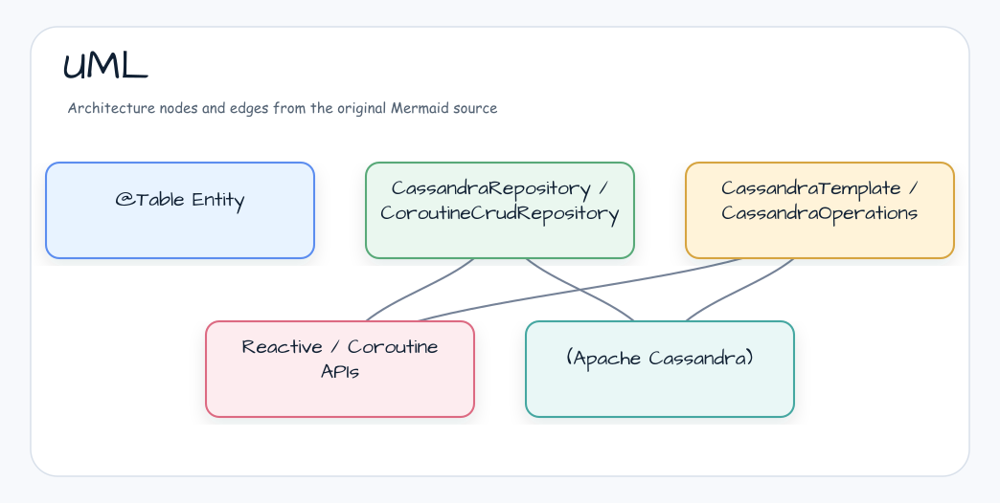

# Module Examples - Cassandra & Spring Data Cassandra (Spring Boot 4)

[English](./README.md) | 한국어

Apache Cassandra와 Spring Data Cassandra를 활용하는 종합 예제입니다 (Spring Boot 4.x).

## 예제 아키텍처



> Spring Boot 4 기반 versionless 표준 예제 모듈입니다.

## 예제 목록

### 기본 (basic/)

| 예제 파일                                 | 설명                         |
|---------------------------------------|----------------------------|
| `BasicUserRepositoryTest.kt`          | 기본 Repository 사용법          |
| `CassandraOperationsTest.kt`          | CassandraOperations로 쿼리 실행 |
| `CoroutineCassandraOperationsTest.kt` | Coroutines 기반 비동기 쿼리       |

### Kotlin DSL (kotlin/)

| 예제 파일                     | 설명                        |
|---------------------------|---------------------------|
| `PersonRepositoryTest.kt` | Kotlin DSL로 Repository 정의 |
| `TemplateTest.kt`         | CassandraTemplate 사용법     |

### Reactive (reactive/)

| 예제 파일                              | 설명                    |
|------------------------------------|-----------------------|
| `ReactivePersonRepositoryTest.kt`  | Reactive Repository   |
| `CoroutinePersonRepositoryTest.kt` | Coroutines Repository |

### 감사 (auditing/)

| 예제 파일             | 설명                              |
|-------------------|---------------------------------|
| `AuditingTest.kt` | `@CreatedBy`, `@LastModifiedBy` |

## Entity 정의

```kotlin
@Table
data class User(
    @PrimaryKey val id: UUID = UUID.randomUUID(),
    val name: String,
    val email: String,
)
```

## Repository

```kotlin
interface UserRepository : CassandraRepository<User, UUID> {
    fun findByEmail(email: String): User?
}
```

## Coroutines 지원

```kotlin
interface CoroutinePersonRepository : CoroutineCrudRepository<Person, String> {

    fun findByLastname(lastname: String): Flow<Person>

    @Query("SELECT * FROM coroutine_persons WHERE firstname = ?0 AND lastname = ?1")
    suspend fun findByFirstnameAndLastname(firstname: String, lastname: String): Person?
}
```

`Flow<T>`를 반환하는 Repository query는 일반 함수로 선언합니다. 단일
결과를 반환하는 nullable `Person?` 조회에는 `suspend fun`을 사용합니다.

## 실행 방법

```bash
# Cassandra Docker 실행
docker run -d --name cassandra -p 9042:9042 cassandra:4

# 모든 예제 실행
./gradlew :bluetape4k-spring-boot-cassandra-demo:test
```

## 참고

- [Spring Data Cassandra](https://spring.io/projects/spring-data-cassandra)
- [Apache Cassandra](https://cassandra.apache.org/)
